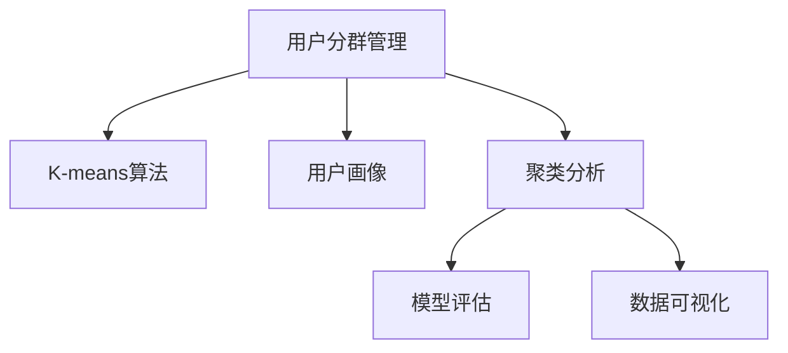

                 

# 如何进行有效的用户分群管理

> 关键词：用户分群管理, K-means算法, 用户画像, 聚类分析, 模型评估, 数据可视化

## 1. 背景介绍

### 1.1 问题由来
随着互联网的发展，企业积累了越来越多的用户数据。这些数据不仅包括用户的基本信息，如姓名、年龄、性别等，还涵盖了用户的在线行为数据，如浏览记录、购买历史、评价反馈等。如何从这些海量的用户数据中挖掘出有价值的洞察，成为企业数据驱动决策的关键。

其中，用户分群管理是数据挖掘领域的一个重要研究方向。它通过将用户按照某些特征进行分类，揭示用户群体的行为模式和需求特征，为个性化推荐、精准营销、风险控制等业务提供支持。

### 1.2 问题核心关键点
用户分群管理的核心在于：如何选择合适的用户特征，设计合理的分类模型，对用户进行高效的聚类分析，从而得到符合实际需求的、可解释的用户分群结果。

具体来说，关键点包括以下几个方面：

1. **数据预处理**：清洗、归一化、缺失值处理等。
2. **特征选择**：选择合适的特征作为分群的依据。
3. **聚类模型选择**：选择适当的聚类算法，如K-means、层次聚类等。
4. **模型评估与调优**：评估聚类效果，调优模型参数，提升分群质量。
5. **分群解释与应用**：构建用户画像，指导实际业务应用。

### 1.3 问题研究意义
用户分群管理对于提升用户满意度、提高转化率、优化用户体验具有重要意义。通过用户分群，企业可以：

1. 实现个性化推荐，提升用户粘性和满意度。
2. 针对不同用户群进行精准营销，提高营销ROI。
3. 识别高风险用户，实施风险控制策略。
4. 分析用户行为模式，洞察用户需求，指导产品优化。

因此，深入研究用户分群管理，对于提升企业的数字化运营水平，具有重要的理论和实际意义。

## 2. 核心概念与联系

### 2.1 核心概念概述

在进行用户分群管理时，涉及到的核心概念包括：

- **用户分群管理**：通过将用户按照某些特征进行分类，揭示用户群体的行为模式和需求特征，为个性化推荐、精准营销、风险控制等业务提供支持。
- **K-means算法**：一种常见的聚类算法，用于将用户数据划分为K个簇，每个簇的中心点代表该簇的特征。
- **用户画像**：描述用户特征和行为的一个或多个特征集，用于指导个性化推荐和精准营销。
- **聚类分析**：将数据划分为若干个相似性的组或簇，每个组内的数据相似度高，不同组之间的数据相似度低。
- **模型评估**：通过评估指标（如轮廓系数、Calinski-Harabasz指数等）来衡量聚类效果。
- **数据可视化**：通过图表等可视化手段，展示聚类结果，帮助业务人员理解用户分群情况。

这些概念之间的联系可以通过以下Mermaid流程图来展示：



这个流程图展示了大语言模型的核心概念及其之间的关系：

1. 用户分群管理通过K-means算法进行聚类分析。
2. 用户分群结果用于构建用户画像。
3. 聚类分析结果需要经过模型评估，以确保聚类质量。
4. 聚类结果通过数据可视化展示，供业务人员理解和使用。

## 3. 核心算法原理 & 具体操作步骤

### 3.1 算法原理概述

用户分群管理的核心在于聚类分析。聚类分析的目标是将数据划分为若干个组，使得同一组内的数据相似度高，不同组之间的数据相似度低。其中，K-means算法是最常用的聚类算法之一。

K-means算法的基本原理如下：

1. **初始化K个簇中心**：随机选取K个数据点作为初始的簇中心。
2. **分配数据点**：对于每个数据点，计算其与各簇中心的距离，将其分配到距离最近的簇中。
3. **更新簇中心**：对于每个簇，重新计算其所有数据点的均值，作为新的簇中心。
4. **迭代更新**：重复步骤2和3，直到簇中心不再变化，或达到预设的迭代次数。

### 3.2 算法步骤详解

用户分群管理的详细步骤包括：

**Step 1: 数据预处理**
- 收集用户数据，包括基本信息、行为数据、评价反馈等。
- 对数据进行清洗，去除缺失值、重复数据等。
- 对数值型数据进行归一化，保证不同特征的可比性。

**Step 2: 特征选择**
- 分析用户数据的特征，选择最能代表用户特征的指标。
- 常用的特征包括年龄、性别、消费金额、浏览时长、购买次数等。

**Step 3: 聚类分析**
- 选择K-means算法进行聚类。
- 初始化K个簇中心。
- 重复分配数据点、更新簇中心，直至收敛。

**Step 4: 模型评估**
- 计算聚类效果，常用的指标包括轮廓系数、Calinski-Harabasz指数、Silhouette宽度等。
- 对模型参数进行调优，如K值的选择、初始簇中心的选择等。

**Step 5: 分群解释与应用**
- 构建用户画像，描述每个用户群体的特征和行为。
- 将用户分群结果应用于个性化推荐、精准营销、风险控制等业务场景。

### 3.3 算法优缺点

K-means算法在用户分群管理中具有以下优点：

1. **计算简单**：K-means算法实现简单，计算速度快。
2. **可解释性强**：K-means的聚类结果直观易懂，易于解释。
3. **应用广泛**：K-means算法广泛应用于市场细分、客户分群、图像分割等领域。

同时，K-means算法也存在以下缺点：

1. **需要预设簇数**：K-means算法需要预设簇数K，对于多维数据集，选择合适的K值较为困难。
2. **对初始值敏感**：K-means算法对初始簇中心的选择较为敏感，不同的初始值可能导致不同的聚类结果。
3. **假设数据服从高斯分布**：K-means算法假设簇内的数据点服从高斯分布，对于非球形、非凸形的簇，效果较差。

### 3.4 算法应用领域

用户分群管理在多个领域都有广泛应用：

1. **电商**：通过用户分群管理，实现个性化推荐、精准营销、库存优化。
2. **金融**：通过用户分群管理，进行风险控制、客户细分、产品优化。
3. **社交媒体**：通过用户分群管理，实现内容推荐、广告投放、用户流失预测。
4. **健康医疗**：通过用户分群管理，实现个性化诊疗、精准营销、疾病预测。

## 4. 数学模型和公式 & 详细讲解 & 举例说明

### 4.1 数学模型构建

在进行用户分群管理时，可以使用K-means算法对用户数据进行聚类。假设用户数据集为 $D=\{x_1, x_2, \ldots, x_n\}$，每个用户数据点 $x_i=(x_{i1}, x_{i2}, \ldots, x_{im})$ 包含m个特征。

设K个簇中心为 $\mu_1, \mu_2, \ldots, \mu_K$，其中 $\mu_k=(\mu_{k1}, \mu_{k2}, \ldots, \mu_{km})$。K-means算法的目标是最小化聚类误差，即：

$$
\min_{\mu_1, \mu_2, \ldots, \mu_K} \sum_{i=1}^n \min_{k=1,\ldots,K} \|x_i - \mu_k\|
$$

其中，$\|x_i - \mu_k\|$ 表示用户数据点 $x_i$ 与簇中心 $\mu_k$ 的距离。

### 4.2 公式推导过程

K-means算法的迭代过程包括以下步骤：

1. **初始化簇中心**：随机选取K个数据点作为初始的簇中心。
2. **分配数据点**：对于每个数据点 $x_i$，计算其与各簇中心的距离，将其分配到距离最近的簇中。
3. **更新簇中心**：对于每个簇，重新计算其所有数据点的均值，作为新的簇中心。
4. **重复更新**：重复步骤2和3，直到簇中心不再变化，或达到预设的迭代次数。

公式推导如下：

设簇 $C_k$ 包含的数据点为 $x_{ik}$，簇中心为 $\mu_k$，则簇的均值为：

$$
\mu_k = \frac{1}{|C_k|} \sum_{i=1}^{|C_k|} x_{ik}
$$

对于每个数据点 $x_i$，计算其与各簇中心的距离，分配到距离最近的簇中。设分配到的簇为 $C_j$，则有：

$$
j = \arg\min_{k=1,\ldots,K} \|x_i - \mu_k\|
$$

更新簇中心，重新计算每个簇的均值：

$$
\mu_k = \frac{1}{|C_k|} \sum_{i=1}^{|C_k|} x_i
$$

重复上述过程，直到簇中心不再变化，或达到预设的迭代次数。

### 4.3 案例分析与讲解

假设我们有一份用户数据集，包含用户的年龄、性别、消费金额、浏览时长等特征。我们想要对这部分数据进行聚类，将用户分为多个不同的群体。

**Step 1: 数据预处理**

我们首先对数据进行清洗，去除缺失值，并对数值型数据进行归一化处理。

**Step 2: 特征选择**

根据数据的特征，我们选择了年龄、性别、消费金额、浏览时长作为聚类的特征。

**Step 3: 聚类分析**

我们选择K-means算法，初始化K=4个簇中心。经过多次迭代，得到4个簇的聚类结果。

**Step 4: 模型评估**

我们计算了聚类效果的轮廓系数，发现聚类结果较好。

**Step 5: 分群解释与应用**

我们根据聚类结果，构建了4个用户群体的画像，描述了每个群体的特征和行为。将这些用户群体应用于个性化推荐、精准营销等业务场景。

## 5. 项目实践：代码实例和详细解释说明

### 5.1 开发环境搭建

在进行用户分群管理时，我们需要准备好开发环境。以下是使用Python进行Scikit-learn开发的环境配置流程：

1. 安装Anaconda：从官网下载并安装Anaconda，用于创建独立的Python环境。

2. 创建并激活虚拟环境：
```bash
conda create -n user-clustering python=3.8 
conda activate user-clustering
```

3. 安装Scikit-learn：
```bash
conda install scikit-learn
```

4. 安装Pandas、NumPy、Matplotlib等工具包：
```bash
pip install pandas numpy matplotlib seaborn
```

完成上述步骤后，即可在`user-clustering`环境中开始用户分群管理的实践。

### 5.2 源代码详细实现

这里我们以K-means算法为例，给出用户分群管理的PyTorch代码实现。

```python
import numpy as np
from sklearn.cluster import KMeans
from sklearn.metrics import silhouette_score
import pandas as pd
import matplotlib.pyplot as plt

# 数据预处理
def preprocess_data(data):
    # 去除缺失值
    data = data.dropna()
    # 归一化处理
    data = (data - data.mean()) / data.std()
    return data

# 聚类分析
def cluster_analysis(data, k):
    # 初始化K-means模型
    kmeans = KMeans(n_clusters=k, random_state=0)
    # 拟合数据
    kmeans.fit(data)
    # 获取聚类结果
    labels = kmeans.labels_
    # 计算轮廓系数
    score = silhouette_score(data, labels)
    # 绘制聚类结果
    plt.scatter(data[:, 0], data[:, 1], c=labels)
    plt.show()
    return labels, score

# 用户分群管理
def user_clustering(data, k=3):
    # 数据预处理
    data = preprocess_data(data)
    # 聚类分析
    labels, score = cluster_analysis(data, k)
    # 构建用户画像
    user_profiles = pd.DataFrame(data, columns=['age', 'gender', 'consumption', 'browsing_time'])
    user_profiles['cluster'] = labels
    return user_profiles, score

# 加载数据
data = pd.read_csv('user_data.csv')

# 进行用户分群管理
user_profiles, score = user_clustering(data)

# 输出用户分群结果和聚类效果
print(user_profiles.head())
print(f'聚类效果：轮廓系数 = {score:.2f}')
```

以上代码实现了用户分群管理的全流程，从数据预处理到聚类分析，再到用户画像的构建，最后输出聚类效果。

### 5.3 代码解读与分析

让我们再详细解读一下关键代码的实现细节：

**preprocess_data函数**：
- 数据预处理：去除缺失值，归一化处理。

**cluster_analysis函数**：
- 初始化K-means模型，拟合数据，获取聚类结果和轮廓系数。
- 绘制聚类结果，供业务人员理解。

**user_clustering函数**：
- 调用preprocess_data和cluster_analysis函数，完成用户分群管理的全流程。
- 构建用户画像，描述每个用户群体的特征。

**加载数据和分群管理**：
- 加载用户数据集。
- 进行用户分群管理，并输出分群结果和聚类效果。

可以看出，PyTorch配合Scikit-learn使得用户分群管理的代码实现变得简洁高效。开发者可以将更多精力放在数据处理、模型改进等高层逻辑上，而不必过多关注底层的实现细节。

## 6. 实际应用场景

### 6.1 智能推荐系统

用户分群管理在智能推荐系统中具有广泛应用。通过用户分群管理，可以识别出不同兴趣群体的用户，为每个用户群体推荐其感兴趣的商品或服务。

例如，电商平台可以根据用户的浏览记录、购买历史等数据，将其分为高潜力用户、忠实用户、新用户等不同群体，针对每个群体设计不同的推荐策略，提高推荐效果。

### 6.2 金融风险控制

在金融领域，用户分群管理可以帮助银行识别高风险用户，采取相应的风险控制措施。例如，通过分析用户的消费行为、信用记录等数据，将其分为高风险用户、中等风险用户、低风险用户等不同群体，针对高风险用户采取更为严格的风控策略，避免金融风险。

### 6.3 社交媒体内容推荐

社交媒体平台通过用户分群管理，可以实现个性化内容推荐，提升用户粘性和平台活跃度。例如，根据用户的兴趣、行为数据，将其分为新闻、娱乐、体育等不同兴趣群体，为每个群体推荐其感兴趣的内容，提高用户的平台使用体验。

### 6.4 健康医疗个性化诊疗

在健康医疗领域，用户分群管理可以帮助医院识别高风险患者，提供个性化的诊疗方案。例如，通过分析患者的病史、病情、治疗记录等数据，将其分为不同健康状态群体，针对每个群体制定不同的诊疗方案，提高治疗效果。

## 7. 工具和资源推荐

### 7.1 学习资源推荐

为了帮助开发者系统掌握用户分群管理的理论基础和实践技巧，这里推荐一些优质的学习资源：

1. 《机器学习实战》系列书籍：由吴恩达教授团队编写，涵盖机器学习基础和多种算法实现。

2. Coursera《机器学习》课程：斯坦福大学开设的机器学习经典课程，内容全面深入，适合入门学习。

3. 《Python数据科学手册》书籍：由Jake VanderPlas编写，涵盖数据科学、数据可视化、机器学习等众多主题。

4. Scikit-learn官方文档：Scikit-learn库的官方文档，提供了详细的算法实现和案例应用。

5. K-means算法论文：介绍K-means算法的经典论文，了解其原理和优化方法。

通过对这些资源的学习实践，相信你一定能够快速掌握用户分群管理的精髓，并用于解决实际的NLP问题。

### 7.2 开发工具推荐

高效的开发离不开优秀的工具支持。以下是几款用于用户分群管理的常用工具：

1. Python：Python语言简单易学，生态丰富，适合进行数据处理和算法实现。

2. Scikit-learn：Scikit-learn库提供了多种聚类算法和模型评估方法，是进行用户分群管理的利器。

3. Pandas：Pandas库提供了数据处理和分析功能，适合进行数据预处理和可视化。

4. Matplotlib：Matplotlib库提供了丰富的图表绘制功能，适合进行聚类结果的可视化展示。

5. Jupyter Notebook：Jupyter Notebook是一种交互式的Python开发环境，适合进行算法实验和数据分析。

合理利用这些工具，可以显著提升用户分群管理的开发效率，加快创新迭代的步伐。

### 7.3 相关论文推荐

用户分群管理领域的研究不断发展，以下是几篇奠基性的相关论文，推荐阅读：

1. "K-means: algorithms for clustering"：介绍K-means算法的经典论文，了解其原理和优化方法。

2. "A Survey of Clustering Algorithms"：综述了多种聚类算法，了解其优缺点和适用场景。

3. "Interactive Clustering by Averaging"：介绍了一种交互式聚类算法，适合处理大规模数据集。

4. "Customer Segmentation for Online Retail"：介绍了一种基于用户分群管理的在线零售应用案例，了解其具体实现方法。

这些论文代表了大语言模型微调技术的发展脉络。通过学习这些前沿成果，可以帮助研究者把握学科前进方向，激发更多的创新灵感。

## 8. 总结：未来发展趋势与挑战

### 8.1 总结

本文对用户分群管理的核心概念、算法原理和操作步骤进行了全面系统的介绍。通过数据预处理、特征选择、聚类分析、模型评估和分群解释等步骤，展示了用户分群管理的全流程。同时，本文还探讨了用户分群管理在多个领域的应用，展示了其广泛的应用前景。

通过本文的系统梳理，可以看到，用户分群管理通过聚类分析，将用户按照某些特征进行分类，揭示用户群体的行为模式和需求特征，为个性化推荐、精准营销、风险控制等业务提供支持。未来，伴随聚类算法的不断演进和数据的不断积累，用户分群管理将进一步提升数据驱动决策的能力，为企业带来更大的价值。

### 8.2 未来发展趋势

展望未来，用户分群管理将呈现以下几个发展趋势：

1. **大数据聚类**：随着数据规模的不断扩大，大数据聚类技术将成为聚类分析的重要方向。大数据聚类需要处理大规模数据集，解决数据存储和计算问题。

2. **多模态聚类**：未来聚类分析将不再局限于单一模态数据，而是融合多种模态数据进行聚类。例如，将文本数据与图像、视频数据结合，构建多模态用户画像。

3. **深度学习聚类**：深度学习算法在聚类分析中的应用将越来越广泛，如自编码器、神经网络等。深度学习聚类可以自动学习高维数据特征，提升聚类效果。

4. **半监督聚类**：半监督聚类可以利用少量有标注数据，结合无标注数据进行聚类，提升聚类效果。未来半监督聚类技术将得到广泛应用。

5. **在线聚类**：随着数据流技术的不断发展，在线聚类技术将越来越重要。在线聚类可以实时处理数据流，动态更新聚类结果。

这些趋势凸显了用户分群管理技术的前景广阔，需要不断探索和优化。

### 8.3 面临的挑战

尽管用户分群管理在多个领域都有广泛应用，但在实际应用中，仍面临以下挑战：

1. **数据质量和数量**：用户数据的质量和数量直接影响聚类效果。如何获取高质量、大规模的数据，是一个重要的难题。

2. **聚类算法选择**：不同的聚类算法适用于不同的数据类型和数据规模。如何选择合适的聚类算法，是一个需要深入研究的问题。

3. **聚类结果解释**：聚类结果的解释性差，业务人员难以理解和使用。如何构建易于解释的用户画像，是一个亟待解决的问题。

4. **数据隐私和安全**：用户数据涉及隐私和安全问题，如何保护用户数据，避免数据泄露，是一个重要的挑战。

5. **计算资源需求**：大数据聚类和深度学习聚类需要大量的计算资源，如何优化资源消耗，是一个重要的研究方向。

### 8.4 研究展望

面对用户分群管理所面临的种种挑战，未来的研究需要在以下几个方面寻求新的突破：

1. **大数据聚类技术**：开发高效、可扩展的大数据聚类算法，解决数据存储和计算问题。

2. **多模态聚类方法**：探索融合多种模态数据进行聚类的方法，提升聚类效果。

3. **聚类结果解释技术**：开发易于解释的聚类结果展示方法，帮助业务人员理解和使用聚类结果。

4. **数据隐私保护技术**：开发数据隐私保护算法，确保用户数据的安全和隐私。

5. **在线聚类技术**：开发高效的在线聚类算法，实时处理数据流，动态更新聚类结果。

这些研究方向将推动用户分群管理技术向更深层次发展，为构建智能化、普适化的数据驱动决策系统铺平道路。面向未来，用户分群管理技术还需要与其他人工智能技术进行更深入的融合，如知识表示、因果推理、强化学习等，多路径协同发力，共同推动人工智能技术的进步。

## 9. 附录：常见问题与解答

**Q1: 用户分群管理的主要流程是什么？**

A: 用户分群管理的主要流程包括数据预处理、特征选择、聚类分析、模型评估和分群解释。具体来说：

1. 数据预处理：清洗、归一化、缺失值处理等。
2. 特征选择：选择最能代表用户特征的指标。
3. 聚类分析：选择聚类算法进行聚类。
4. 模型评估：评估聚类效果，调优模型参数。
5. 分群解释与应用：构建用户画像，指导实际业务应用。

**Q2: 如何选择聚类算法？**

A: 选择聚类算法需要考虑数据类型、数据规模、聚类结果需求等因素。常用的聚类算法包括K-means、层次聚类、DBSCAN等。具体选择时，可以参考以下标准：

1. 数据类型：对于数值型数据，可以使用K-means算法；对于分类数据，可以使用层次聚类或DBSCAN算法。
2. 数据规模：对于大规模数据集，可以使用K-means++初始化或MiniBatch K-means等优化算法。
3. 聚类结果需求：对于聚类数量已知的情况，可以使用K-means算法；对于聚类数量未知的情况，可以使用层次聚类或DBSCAN算法。

**Q3: 聚类分析有哪些评估指标？**

A: 聚类分析的评估指标包括轮廓系数、Calinski-Harabasz指数、Davies-Bouldin指数等。具体来说：

1. 轮廓系数：衡量聚类效果的重要指标，值越大表示聚类效果越好。
2. Calinski-Harabasz指数：衡量聚类内紧凑度和聚类间分离度的指标，值越大表示聚类效果越好。
3. Davies-Bouldin指数：衡量聚类内相似度和聚类间差异度的指标，值越小表示聚类效果越好。

**Q4: 如何提升聚类算法的效率？**

A: 提升聚类算法效率的方法包括：

1. 并行计算：使用多线程、分布式计算等技术，提升聚类算法的计算速度。
2. 算法优化：优化聚类算法，减少迭代次数，提高计算效率。
3. 数据压缩：对数据进行压缩，减少存储和计算开销。
4. 模型裁剪：去除不必要的参数，减小模型尺寸，提升计算效率。

**Q5: 聚类分析有哪些应用场景？**

A: 聚类分析在多个领域都有广泛应用，包括市场细分、客户分群、图像分割等。具体来说：

1. 市场细分：通过聚类分析，识别出不同兴趣群体的用户，为每个群体设计不同的营销策略。
2. 客户分群：通过聚类分析，识别出高潜力客户、忠实客户、新客户等不同群体，针对每个群体设计不同的服务方案。
3. 图像分割：通过聚类分析，将图像划分为不同的区域，提取感兴趣的区域。

---

作者：禅与计算机程序设计艺术 / Zen and the Art of Computer Programming

