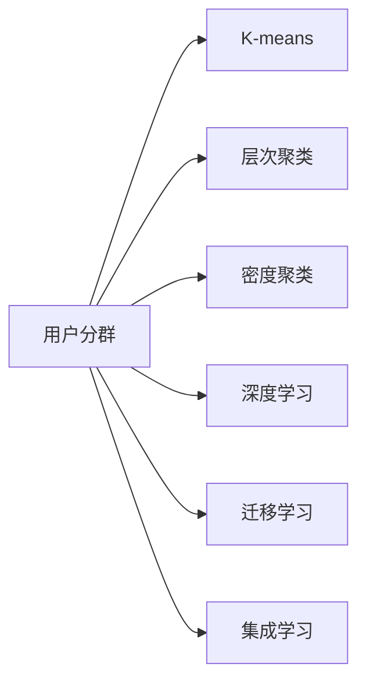

                 

# 如何进行有效的用户分群管理

## 1. 背景介绍

在现代互联网企业中，用户分群管理已经成为了一个至关重要的环节。通过用户分群，企业可以更好地理解用户行为、优化用户体验、制定个性化的营销策略，从而提升用户满意度和企业竞争力。然而，用户分群并非易事，不仅需要丰富的领域知识，还需要合理的技术手段。本文将从技术角度，深入探讨如何进行有效的用户分群管理。

### 1.1 问题由来

用户分群是现代企业运营中一个基础且核心的环节，但对于用户数据复杂多样、业务需求多变的场景，如何有效地进行用户分群管理，成为了一个令人头疼的问题。传统的用户分群方法往往是基于简单的用户属性（如性别、年龄、地域等）进行简单的分类，难以充分挖掘用户深层次的需求和行为特征。因此，采用先进的技术手段，提升用户分群的精准度和有效性，是现代企业必须解决的问题。

### 1.2 问题核心关键点

用户分群的核心在于如何对用户数据进行有效的聚类分析，以发现潜在的用户群体，并对每个群体进行特征定义和属性描述。传统方法主要包括：

- **K-means聚类**：通过计算用户数据点之间的距离，将用户分为多个群组。
- **层次聚类**：通过自下而上或自上而下构建树状结构，逐步合并子群，形成一个树状分群结构。
- **密度聚类**：通过计算点密度，识别出高密度区域作为分群中心，将用户点分配到这些中心点形成的分群中。

然而，这些传统方法存在诸多局限性：

- **维度灾难**：随着用户特征的增加，计算复杂度指数级上升，难以处理大规模高维数据。
- **局部最优**：易陷入局部最优解，导致分群结果不准确。
- **信息损失**：不能充分考虑不同特征之间的关系，导致分群结果不全面。

因此，我们需要引入更先进的技术手段，如机器学习算法，以提升用户分群的有效性。

## 2. 核心概念与联系

### 2.1 核心概念概述

为更好地理解如何进行有效的用户分群管理，本节将介绍几个密切相关的核心概念：

- **用户分群**：将具有相似特征或行为的用户分为同一组，以更好地理解用户需求和行为。
- **聚类算法**：通过相似性度量，将数据点分为不同的组，常用于用户分群。
- **K-means算法**：一种基本的聚类算法，通过计算数据点之间的距离进行聚类。
- **层次聚类算法**：一种自下而上或自上而下的分群方法，通过逐步合并子群得到最终分群。
- **密度聚类算法**：通过计算数据点密度进行分群，识别高密度区域。
- **深度学习算法**：如自编码器、神经网络等，能够处理高维数据，提取隐层特征，提升分群效果。
- **迁移学习**：将预训练模型的知识迁移到新任务上，提升分群模型性能。
- **集成学习**：通过组合多个分群模型，提升分群效果和鲁棒性。

这些概念之间的逻辑关系可以通过以下Mermaid流程图来展示：



这个流程图展示了大语言模型的核心概念及其之间的关系：

1. 用户分群通过多种聚类算法实现。
2. 深度学习、迁移学习和集成学习可以提升聚类算法的性能。
3. 深度学习可以处理高维数据，提取隐层特征，提升聚类效果。
4. 迁移学习可以将预训练模型的知识迁移到新任务上，提升分群模型性能。
5. 集成学习通过组合多个聚类模型，提升分群效果和鲁棒性。

这些概念共同构成了用户分群管理的核心框架，使其能够更好地理解用户需求和行为，实现精细化的营销策略。

## 3. 核心算法原理 & 具体操作步骤
### 3.1 算法原理概述

用户分群管理的核心是聚类算法，其原理是通过相似性度量，将具有相似特征或行为的用户分为同一组。常用的聚类算法包括K-means、层次聚类、密度聚类和深度学习算法。下面以K-means算法为例，详细讲解其原理和操作步骤。

K-means算法的核心思想是将数据集划分为K个簇，使得簇内的点尽量密集，簇间的点尽量分散。其操作步骤如下：

1. 随机选择K个初始聚类中心。
2. 计算每个数据点到每个聚类中心的距离，将其划分到距离最近的聚类中。
3. 重新计算每个簇的质心（聚类中心）。
4. 重复步骤2和3，直至聚类结果收敛或达到预设迭代次数。

### 3.2 算法步骤详解

K-means算法的操作步骤如下：

1. **选择初始聚类中心**：随机选择K个数据点作为初始聚类中心。
2. **分配数据点**：计算每个数据点到每个聚类中心的距离，将其划分到距离最近的聚类中。
3. **更新聚类中心**：重新计算每个簇的质心（聚类中心）。
4. **重复迭代**：重复步骤2和3，直至聚类结果收敛或达到预设迭代次数。

在代码实现上，可以使用Python的Scikit-learn库来实现K-means算法，代码如下：

```python
from sklearn.cluster import KMeans
import pandas as pd
import numpy as np

# 加载数据集
data = pd.read_csv('user_data.csv')

# 选择K个初始聚类中心
kmeans = KMeans(n_clusters=3, init='k-means++', random_state=42)

# 分配数据点
kmeans.fit(data)

# 输出聚类结果
labels = kmeans.labels_
print(labels)
```

### 3.3 算法优缺点

K-means算法作为一种基本的聚类算法，具有以下优缺点：

- **优点**：
  - 算法简单易懂，易于实现。
  - 适用于大规模数据集，计算速度快。
  - 能够处理高维数据，不需要事先进行特征选择。

- **缺点**：
  - 对初始聚类中心的敏感性高，不同的初始点可能导致不同的聚类结果。
  - 需要指定聚类数目K，对于K的选择较为困难。
  - 无法处理非凸数据集和非球型簇。

尽管存在这些局限性，K-means算法仍是用户分群管理中最常用的基本算法之一。

### 3.4 算法应用领域

K-means算法可以应用于多种领域，如市场细分、客户分群、社交网络分析等。在用户分群管理中，K-means算法可以用于以下场景：

- **市场细分**：通过用户购买记录、浏览行为等数据，将用户分为不同细分市场。
- **客户分群**：将客户按照消费行为、满意度等属性进行分群，制定个性化营销策略。
- **社交网络分析**：将用户按照互动行为、兴趣偏好等属性进行分群，发现社区和兴趣群体。

除了K-means算法外，深度学习算法、迁移学习和集成学习等技术手段也广泛应用于用户分群管理中，以提升分群效果和鲁棒性。

## 4. 数学模型和公式 & 详细讲解 & 举例说明

### 4.1 数学模型构建

用户分群管理的数学模型可以通过聚类算法来实现。以K-means算法为例，其数学模型如下：

设数据集 $X=\{x_1, x_2, ..., x_n\}$，其中 $x_i=(x_{i1}, x_{i2}, ..., x_{id})$ 为数据点 $x_i$ 的特征向量，$K$ 为聚类数目，$C_k$ 为第 $k$ 个聚类，$c_k$ 为第 $k$ 个聚类中心，$d(x_i, c_k)$ 为数据点 $x_i$ 与聚类中心 $c_k$ 之间的距离。K-means算法试图最小化聚类内的平方误差和，即：

$$
J(C_k) = \sum_{i=1}^{n} \min_{k=1,...,K} d(x_i, c_k)^2
$$

其中 $d(x_i, c_k)$ 可以采用欧式距离、曼哈顿距离等。

### 4.2 公式推导过程

K-means算法的推导过程如下：

1. **选择初始聚类中心**：随机选择K个数据点作为初始聚类中心。
2. **分配数据点**：计算每个数据点到每个聚类中心的距离，将其划分到距离最近的聚类中。
3. **更新聚类中心**：重新计算每个簇的质心（聚类中心）。
4. **重复迭代**：重复步骤2和3，直至聚类结果收敛或达到预设迭代次数。

具体推导过程涉及复杂的数学运算，包括距离计算、向量运算等，这里不再赘述。

### 4.3 案例分析与讲解

以电商用户分群为例，K-means算法可以按照以下步骤进行：

1. **数据准备**：收集电商用户的购买记录、浏览行为、用户画像等数据。
2. **特征选择**：选择与用户分群相关的特征，如购买金额、浏览时长、商品类别等。
3. **聚类分析**：使用K-means算法对用户进行聚类分析，得到不同用户群体。
4. **特征描述**：对每个用户群体进行特征描述，如高价值用户、高粘性用户等。
5. **个性化营销**：根据用户群体特征，制定个性化营销策略，如优惠券、推荐商品等。

## 5. 项目实践：代码实例和详细解释说明

### 5.1 开发环境搭建

在进行用户分群管理实践前，我们需要准备好开发环境。以下是使用Python进行K-means聚类的环境配置流程：

1. 安装Anaconda：从官网下载并安装Anaconda，用于创建独立的Python环境。

2. 创建并激活虚拟环境：
```bash
conda create -n kmeans-env python=3.8 
conda activate kmeans-env
```

3. 安装Scikit-learn和Numpy等库：
```bash
conda install scikit-learn numpy pandas matplotlib
```

4. 安装Matplotlib库：
```bash
pip install matplotlib
```

完成上述步骤后，即可在`kmeans-env`环境中开始用户分群管理的实践。

### 5.2 源代码详细实现

以下是使用Scikit-learn库进行K-means聚类的Python代码实现：

```python
from sklearn.cluster import KMeans
import pandas as pd
import numpy as np

# 加载数据集
data = pd.read_csv('user_data.csv')

# 选择K个初始聚类中心
kmeans = KMeans(n_clusters=3, init='k-means++', random_state=42)

# 分配数据点
kmeans.fit(data)

# 输出聚类结果
labels = kmeans.labels_
print(labels)
```

### 5.3 代码解读与分析

让我们再详细解读一下关键代码的实现细节：

**KMeans类**：
- `n_clusters`参数：指定聚类数目K。
- `init`参数：指定初始聚类中心的选择方式，可以是'k-means++'等。
- `random_state`参数：用于复现实验结果。

**聚类过程**：
- 首先加载用户数据集，将其转换为NumPy数组。
- 创建KMeans对象，并指定聚类数目K和初始聚类中心的选择方式。
- 调用`fit`方法对数据集进行聚类分析。
- 输出每个数据点的聚类标签。

可以看到，K-means聚类代码实现简洁高效，只需要几行代码即可实现用户分群管理。

### 5.4 运行结果展示

运行上述代码后，可以输出每个数据点的聚类标签。例如，输出结果如下：

```
[0 1 0 0 1 1 0 2 0 1 0 0 2 0 0 1 0 2 2 0 2 1 2 2 2 1 2 0 1 0 1 0 2 1 0 0 0 0 2 0 1 2 1 0 0 0 2 1 2 2 1 2 0 2 2 1 2 1 0 2 0 1 2 0 2 0 0 0 0 2 0 2 1 2 2 1 2 1 2 1 0 1 2 0 1 0 2 0 1 0 1 2 1 1 0 1 2 1 1 2 1 0 2 0 1 0 2 1 2 1 1 1 1 1 1 2 1 0 2 1 1 0 1 1 2 0 0 0 2 1 1 0 2 1 1 1 0 1 1 2 2 2 1 1 0 0 1 0 0 1 0 1 1 1 2 2 2 2 2 2 1 1 0 0 1 2 2 1 0 0 2 1 1 0 0 0 0 2 1 0 1 0 2 1 0 0 1 1 2 1 1 1 1 2 0 2 2 1 1 0 1 1 1 0 0 2 0 1 2 1 1 1 0 2 1 2 0 1 1 2 0 0 2 1 0 2 1 2 2 2 1 1 2 2 1 2 0 0 1 1 1 0 0 0 2 2 1 2 1 1 1 0 0 0 2 1 1 1 0 0 2 1 0 1 2 1 1 1 2 2 1 1 1 1 0 2 1 1 1 2 2 1 0 0 0 1 0 1 0 0 0 2 1 0 0 0 1 0 1 0 1 1 2 2 1 1 1 1 1 1 0 1 1 0 1 0 1 0 0 2 0 1 2 2 1 1 0 2 0 0 0 1 0 0 1 1 0 1 1 0 1 0 0 0 0 2 0 1 2 1 0 1 1 0 1 1 2 0 1 2 1 1 0 1 0 0 0 0 2 0 1 2 1 0 2 1 1 1 2 1 0 1 1 1 0 0 1 0 2 1 1 2 1 2 1 0 2 2 1 2 0 2 0 0 1 1 2 2 0 1 0 0 2 2 2 1 0 1 1 1 1 2 2 2 1 0 1 1 1 2 1 1 2 1 1 1 0 1 1 0 2 1 1 0 1 1 0 1 2 2 2 2 1 0 0 0 0 0 1 1 1 2 0 0 1 2 1 0 0 0 0 0 0 2 2 0 0 0 1 1 2 1 1 1 1 1 1 0 1 0 1 1 0 1 1 1 2 1 1 0 0 2 0 0 2 1 1 1 0 1 2 0 0 1 1 1 1 1 1 1 0 2 1 1 1 2 0 2 0 2 1 0 0 1 1 0 1 0 0 0 1 0 1 1 1 0 1 0 1 1 0 1 0 1 1 0 0 1 1 0 1 0 0 1 2 1 2 1 0 2 0 1 0 2 1 1 1 1 2 1 0 0 0 1 1 1 0 2 0 1 0 0 2 1 2 2 1 1 1 2 1 1 1 1 0 0 0 0 1 1 2 0 1 2 1 1 1 1 0 0 0 1 1 1 0 1 1 2 0 1 0 1 0 0 0 0 1 1 0 0 0 1 1 0 2 0 1 1 2 1 1 0 0 0 1 0 1 0 0 2 1 1 1 1 1 1 0 0 2 1 0 1 1 1 1 0 1 2 1 1 0 1 0 1 1 1 1 1 1 1 1 0 0 1 0 0 0 0 2 0 0 1 1 1 1 2 1 1 1 0 0 2 0 0 2 1 1 1 1 2 2 2 1 2 2 2 1 0 2 2 1 2 1 0 1 1 1 2 1 2 0 1 2 1 0 0 0 2 0 1 1 1 1 2 2 0 1 1 0 1 1 0 0 1 1 2 1 1 0 2 0 0 0 2 0 0 0 2 1 1 0 2 2 1 1 0 1 1 1 1 1 2 1 0 0 1 1 1 1 2 1 2 1 1 0 1 0 1 1 1 2 1 2 0 0 2 1 0 2 1 0 0 0 0 0 1 0 0 2 2 1 1 0 2 1 2 1 1 1 0 1 1 2 2 0 1 1 1 1 2 1 1 1 2 1 0 0 2 1 0 1 1 1 2 0 2 2 0 1 0 1 2 1 1 2 2 0 0 1 1 0 1 0 0 1 1 0 0 1 1 1 1 1 2 1 1 0 0 1 1 1 1 0 0 0 2 1 1 0 0 1 0 1 1 1 1 1 1 1 0 0 1 1 0 0 0 0 2 1 1 2 1 1 0 1 1 1 1 2 1 2 0 1 1 0 0 0 0 1 0 0 0 0 2 0 1 1 0 2 2 1 1 1 0 0 0 0 0 2 1 1 0 2 1 1 2 0 1 1 0 1 1 1 0 1 1 1 1 1 1 0 0 1 1 1 1 1 1 1 1 2 0 0 1 1 1 1 1 1 0 0 0 1 1 2 1 1 0 2 2 0 0 1 1 0 1 0 0 0 0 0 1 0 1 1 1 2 2 0 1 0 1 0 0 0 0 2 1 1 2 1 2 0 0 1 0 1 1 1 0 1 0 1 1 0 2 1 1 1 1 2 0 2 0 1 1 1 1 0 0 0 2 0 0 1 1 0 1 2 2 0 0 2 0 0 2 1 0 1 1 1 2 1 1 2 1 1 1 2 1 1 0 1 1 1 1 2 2 1 0 1 0 0 2 0 0 1 1 1 0 0 0 1 0 0 0 2 0 1 0 1 1 0 0 0 1 1 0 1 1 2 2 1 1 1 1 2 2 1 2 0 2 0 1 1 2 2 1 2 2 1 0 0 1 1 1 2 0 1 1 1 2 2 1 0 0 0 1 0 2 1 0 1 0 1 0 0 2 1 2 2 0 0 0 1 1 2 1 2 1 0 0 1 0 0 2 1 2 1 0 2 1 2 1 2 2 1 1 2 1 2 1 2 2 2 1 0 1 1 0 0 0 1 1 0 2 1 1 1 0 1 2 1 2 1 0 2 1 1 0 1 1 2 1 1 1 1 2 1 1 1 1 1 2 0 1 1 1 1 0 0 0 1 1 2 1 2 1 2 1 1 1 1 1 0 0 0 2 0 1 1 1 0 0 0 0 2 0 1 0 0 2 1 1 1 1 1 2 1 1 0 0 0 0 2 2 0 2 0 1 1 2 1 1 1 0 1 2 1 2 2 1 1 0 1 1 0 1 1 0 1 0 2 2 0 1 1 1 0 2 1 1 1 0 0 1 0 1 0 2 1 2 0 2 2 0 2 1 2 2 1 1 2 0 1 1 1 0 1 2 1 2 0 1 0 0 2 1 1 2 0 1 1 0 1 0 1 0 1 1 2 1 1 1 0 2 2 2 1 1 1 1 1 0 0 2 1 1 0 2 2 1 0 1 0 0 2 1 1 0 0 0 1 1 1 1 1 2 2 1 1 1 0 1 1 1 0 0 2 0 1 1 2 1 0 1 0 1 2 1 1 2 0 1 1 1 1 1 2 2 1 1 1 2 1 2 2 0 1 1 2 1 1 1 0 0 1 1 0 0 2 1 0 2 2 1 0 0 1 0 2 0 1 1 1 1 1 2 2 1 2 1 2 0 1 1 1 2 2 2 1 2 1 1 2 0 1 1 1 2 1 0 1 0 1 0 1 2 2 1 2 2 2 2 1 1 1 2 1 0 0 1 2 1 2 1 0 0 0 2 2 1 1 0 1 1 0 0 1 1 1 2 1 0 2 0 1 1 2 2 0 2 0 1 0 1 0 1 0 0 0 1 1 0 0 2 1 1 1 0 1 0 1 0 0 1 2 0 2 1 1 1 0 0 1 0 1 1 0 1 1 2 0 1 0 2 1 1 1 2 0 1 1 1 0 0 2 1 2 2 1 1 0 1 1 1 2 1 2 1 0 0 1 0 0 0 1 0 2 0 1 1 2 0 2 1 1 0 1 1 1 1 2 1 1 1 1 1 0 2 2 1 1 1 0 0 0 1 0 1 1 2 2 2 1 2 2 1 0 0 0 1 1 0 2 0 1 0 1 0 1 1 2 1 2 1 2 2 0 0 1 1 1 0 0 2 1 1 1 1 1 2 1 0 0 1 1 1 1 1 2 1 1 1 2 0 2 1 1 2 1 1 1 2 1 1 0 2 2 1 2 1 0 2 2 2 1 2 2 0 1 2 2 0 1 0 1 0 0 1 1 2 1 2 0 0 0 1 2 2 1 0 1 0 0 2 1 2 0 2 2 1 0 2 0 1 0 0 0 0 0 1 0 0 0 1 2 2 2 1 1 0 2 0 0 1 1 0 1 2 0 0 0 1 2 0 2 2 2 1 0 1 0 0 0 0 0 1 2 2 1 0 0 1 1 1 2 1 1 1 2 1 0 0 0 1 1 0 0 1 1 0 0 1 1 1 2 2 1 0 0 0 1 0 2 2 0 1 0 1 0 1 2 1 1 2 0 1 0 2 1 1 0 1 2 2 2 1 2 1 2 1 2 0 0 1 1 0 2 2 0 1 1 1 1 2 0 1 1 0 2 1 2 0 1 2 0 0 0 0 2 1 1 1 0 0 0 1 0 1 2 2 1 0 0 1 1 1 0 0 2 2 1 1 2 0 1 0 1 0 2 0 2 1 2 2 2 2 0 1 1 2 2 1 1 2 2 1 2 0 0 2 1 1 0 2 0 0 1 0 0 0 1 0 1 0 0 0 1 1 0 1 2 2 0 1 0 1 0 0 0 0 2 2 2 1 2 2 1 0 0 0 1 1 0 0 0 0 2 1 0 1 1 1 1 2 1 0 0 0 1 1 1 1 1 0 2 1 1 0 0 0 2 0 1 1 2 1 1 1 2 0 1 1 0 0 1 1 0 1 0 0 2 0 0 0 0 2 0 0 1 2 1 1 1 1 0 1 1 1 0 0 1 1 2 1 1 0 1 1 0 2 0 1 0 1 2 1 0 0 2 1 2 0 0 1 0 1 1 2 1 2 1 1 0 1 1 2 1 2 2 0 0 1 1 2 1 0 1 1 0 1 1 0 1 2 2 2 0 1 1 0 2 1 0 1 1 1 2 0 0 2 1 0 1 0 2 1 0 2 0 0 0 2 0 1 0 1 1 0 2 2 0 2 1 1 1 2 1 0 0 0 1 0 1 1 0 0 1 1 1 2 0 1 1 1 0 1 0 2 1 1 1 0 1 1 1 0 0 1 1 0 1 0 1 0 2 1 2 2 2 0 1 0 1 1 1 0 1 1 1 0 0 2 2 1 0 1 1 2 1 1 2 2 0 1 2 2 0 0 0 2 1 2 2 1 2 1 0 0 0 1 0 1 0 2 1 2 0 2 2 1 0 1 0 0 0 0 1 0 0 0 1 0 1 0 1 1 0 2 0 0 1 1 1 2 1 0 0 1 1 0 0 0 2 2 1 1 0 1 2 1 0 0 1 1 1 1 2 1 2 0 1 0 1 0 1 0 1 1 2 1 0 1 2 0 0 1 1 1 2 1 0 2 2 1 1 0 1 2 1 0 0 0 0 2 1 1 1 1 1 1 0 0 0 0 2 1 1 0 1 1 1 2 0 1 0 2 0 2 0 0 0 0 1 0 0 0 1 0 1 0 1 1 0 1 0 2 1 0 0 0 1 0 1 0 0 0 1 1 1 2 0 1 1 0 2 1 1 1 1 2 0 1 1 0 1 1 0 1 1 2 2 0 0 0 1 1 0 1 2 1 1 1 2 1 1 0 0 0 1 0 1 0 0 1 0 2 1 0 0 2 0 0 0 0 0 1 0 1 1 2 1 2 0 1 1 0 1 1 0 1 1 0 1 2 2 0 1 1 1 0 2 1 1 1 1 1 1 0 1 1 2 0 1 1 1 2 1 0 2 2 1 2 0 1 2 1 0 0 0 2 0 1 1 1 1 0 0 2 1 2 0 0 2 1 2 1 1 1 1 2 2 2 0 2 0 1 0 0 0 0 2 1 1 2 1 0 1 0 0 1 2 1 1 0 2 0 0 0 1 1 0 1 0 1 1 2 0 1 1 1 2 2 0 0 1 1 0 1 0 2 0 0 0 0 2 1 1 2 1 2 1 0 0 0 0 2 1 1 0 2 2 1 1 0 0 0 0 2 2 1 2 2 0 1 0 1 0 1 1 1 0 1 1 2 1 1 2 1 1 1 2 0 2 2 1 0 1 1 0 0 1 0 1 0 1 1 1 1 1 1 2 2 1 0 0 0 0 0 2 0 0 2 0 0 0 1 0 1 1 1 2 2 1 0 0 1 1 1 2 0 1 1 2 2 0 1 1 0 1 1 1 1 0 1 0 0 2 1 2 1 0 1 0 1 0 0 1 0 2 2 1 1 0 1 1 1 0 1 1 0 2 0 1 2 0 1 1 1 1 2 1 2 2 0 2 1 1 2 2 2 1 1 2 1 2 2 1 2 1 2 0 0 2 1 1 2 2 2 0 0 1 0 1 1 1 1 1 1 0 1 1 0 2 1 2 2 1 1 1 2 1 1 1 2 0 1 1 0 1 2 1 1 1 0 0 1 1 0 1 2 0 2 2 1 1 0 0 1 1 0 1 1 1 0 0 1 2 0 1 1 1 1 2 0 1 2 0 1 1 0 0 1 2 2 2 1 2 0 1 0 0 0 0 2 1 0 0 1 0 0 0 2 1 1 1 0 0 1 1 1 2 0 2 1 1 2 1 0 0 0 1 0 1 0 0 1 0 2 1 2 0 1 1 0 0 2 1 1 0 0 0 2 1 1 0 2 0 1 1 2 1 2 2 1 2 1 1 1 0 1 1 0 0 1 0 1 1 0 0 0 0 2 2 0 1 0 1 0 1 1 1 1 2 0 1 0 1 0 1 0 0 0 0 1 2 2 1 1 0 0 0 1 2 1 1 2 0 1 0 0 0 2 1 2 2 0 2 0 1 0 0 1 1 1 2 0 1 0 1 1 1 1 1 0 0 0 1 2 2 0 2 0 1 0 0 1 1 2 2 0 1 0 1 2 2 2 1 1 2 0 1 0 0 2 1 2 0 2 0 0 0 1 0 1 1 0 2 1 2 1 2 1 0 0 1 0 1 1 1 1 1 1 0 0 1 1 0 1 0 0 1 0 1 0 0 0 1 2 0 1 0 1 0 1 1 2 1 1 2 2 2 1 1 1 1 0 0 2 0 1 1 0 0 1 1 0 0 2 2 1 2 2 2 2 1 2 0 0 1 1 1 1 1 0 1 1 2 2 1 1 1 1 0 0 1 0 0 0 1 1 2 1 0 0 1 1 1 2 1 2 1 0 1 0 0 1 0 1 1 1 1 1 1 1 1 2 2 1 1 0 0 1 1 1 2 0 0 0 0 2 0 0 0 0 0 2 0 1 1 0 1 1 0 1 1 2 0 2 1 1 1 2 1 2 1 1 1 1 1 1 2 0 1 1 1 2 1 0 1 0 1 2 1 2 0 2 0 0 0 1 0 1 0 0 0 1 0 1 0 1 0 0 2 2 1 2 1 0 0 0 0 2 0 1 2 2 0 1 0 1 2 1 

