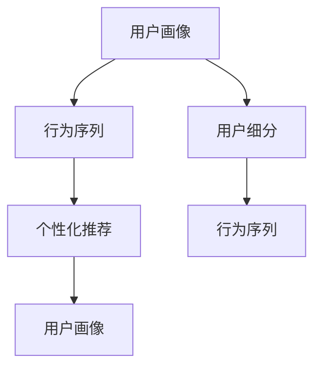

                 

# 如何进行有效的用户行为分析

在数字化时代，用户行为分析（User Behavior Analysis, UBA）成为企业获取用户洞察、优化用户体验、驱动业务增长的重要手段。有效的用户行为分析不仅能帮助企业更好地理解用户需求，还能在多维度上提升运营效率和市场竞争力。本文将深入探讨如何进行有效的用户行为分析，涵盖核心概念、算法原理、具体实践和未来展望。

## 1. 背景介绍

### 1.1 问题由来

随着互联网和移动互联网的发展，各类在线服务和应用层出不穷，用户行为数据（如浏览历史、点击记录、购买行为等）日益丰富。然而，大量冗杂且分散的用户行为数据如何有效整理和分析，成为企业关注的重点。有效、精准的用户行为分析不仅可以揭示用户真实需求和行为模式，还能指导产品迭代和市场营销策略，提升企业的运营效率和盈利能力。

### 1.2 问题核心关键点

用户行为分析的实质是对用户与产品、服务互动过程的数据进行收集、处理和分析，以发现用户的潜在需求和行为规律。其核心关键点包括：

- **数据收集与存储**：采集不同渠道和平台上的用户行为数据。
- **数据处理与清洗**：清洗、标准化数据，确保数据质量。
- **数据分析与建模**：运用统计学、机器学习等方法，发现用户行为规律。
- **结果呈现与应用**：将分析结果可视化，指导业务决策和产品改进。

## 2. 核心概念与联系

### 2.1 核心概念概述

用户行为分析涉及多个核心概念，包括用户画像、行为序列、用户细分、个性化推荐等。

- **用户画像（User Profile）**：描述用户的关键属性和行为特征，如年龄、性别、兴趣、消费习惯等。
- **行为序列（Behavior Sequence）**：记录用户与产品交互的过程，包括时间序列、点击序列、购买序列等。
- **用户细分（User Segmentation）**：将用户群体根据某些特征划分成不同的子群体，以便更精准地进行个性化营销。
- **个性化推荐（Personalized Recommendation）**：根据用户行为数据，为用户推荐感兴趣的产品或内容。

这些概念之间的关系可以通过以下Mermaid流程图来展示：



这个流程图展示了用户画像与行为序列、用户细分、个性化推荐之间的逻辑关系：

1. 用户画像通过记录和分析用户行为序列，提炼出关键特征。
2. 用户细分根据用户画像的特征将用户划分成不同的子群体。
3. 个性化推荐基于用户细分后的行为序列，为每个用户群体推荐个性化内容。

## 3. 核心算法原理 & 具体操作步骤

### 3.1 算法原理概述

用户行为分析的算法原理主要包括数据预处理、特征工程、模型训练和结果评估等环节。通过分析用户行为数据，识别和建模用户的行为模式，进而进行更精准的用户细分和推荐。

1. **数据预处理**：包括数据收集、数据清洗、数据标准化等步骤，确保数据质量。
2. **特征工程**：提取和构造能够代表用户行为特征的指标，如页面停留时间、点击率、购买频次等。
3. **模型训练**：利用机器学习模型对特征进行建模，如分类模型、聚类模型、协同过滤模型等。
4. **结果评估**：通过准确率、召回率、F1分数等指标评估模型性能，进行模型调优。

### 3.2 算法步骤详解

以下是用户行为分析的详细操作步骤：

**Step 1: 数据收集与预处理**

1. **数据收集**：
   - 网页点击记录：通过日志文件收集用户点击的页面信息。
   - 交易记录：通过CRM系统收集用户购买行为信息。
   - 用户反馈：收集用户对产品或服务的评论和反馈信息。

2. **数据预处理**：
   - 数据清洗：去除重复、噪声、异常值。
   - 数据标准化：统一数据格式，便于后续处理。
   - 数据归一化：将不同量级的特征值转换到同一区间。

**Step 2: 特征工程**

1. **特征提取**：
   - 基本特征：如时间戳、页面ID、点击次数等。
   - 统计特征：如平均值、标准差、最大值、最小值等。
   - 高级特征：如行为序列的长度、行为的持续时间、行为之间的间隔时间等。

2. **特征构造**：
   - 用户行为序列：记录用户与系统的所有交互动作，如点击、浏览、购买等。
   - 行为热力图：绘制用户在网页上的点击分布图。
   - 行为模式：发现用户在特定时间段内的行为规律，如日间、晚间活动高峰期。

**Step 3: 模型训练**

1. **分类模型**：
   - 基于规则的分类：如决策树、朴素贝叶斯等。
   - 基于机器学习的分类：如SVM、随机森林、梯度提升机等。
   - 深度学习分类：如卷积神经网络（CNN）、循环神经网络（RNN）等。

2. **聚类模型**：
   - K-means聚类：将用户分为不同的行为群体。
   - DBSCAN聚类：发现用户的行为集群。
   - 层次聚类：将用户逐步合并为更高级别的集群。

3. **协同过滤模型**：
   - 基于用户的协同过滤：找到与目标用户行为相似的用户群体。
   - 基于物品的协同过滤：找到与目标用户行为相似的物品。

**Step 4: 结果评估与优化**

1. **结果评估**：
   - 准确率（Accuracy）：模型正确预测的比例。
   - 召回率（Recall）：真实用户被模型预测出的比例。
   - F1分数（F1 Score）：准确率和召回率的调和平均。

2. **模型调优**：
   - 调整模型参数，提升模型性能。
   - 结合领域知识，改进特征工程。
   - 采用集成学习方法，提高模型鲁棒性。

### 3.3 算法优缺点

用户行为分析的算法具有以下优点：

1. **高效精准**：能够快速发现用户行为模式，提供有价值的业务洞察。
2. **个性化推荐**：根据用户行为数据，提供个性化的产品和服务。
3. **动态优化**：能够实时监控和调整用户行为，优化用户体验。

同时，也存在一些缺点：

1. **数据隐私问题**：用户行为数据的隐私保护是一个重大挑战。
2. **模型复杂性**：算法模型复杂，需要较长的训练时间和计算资源。
3. **用户行为变化**：用户行为可能随着时间变化，模型需要不断更新。

### 3.4 算法应用领域

用户行为分析广泛应用于多个领域，如电商、金融、社交媒体等。具体应用场景包括：

- **电商**：个性化推荐、用户细分、流失预警。
- **金融**：信用评分、反欺诈检测、市场营销。
- **社交媒体**：内容推荐、用户行为监控、广告投放优化。

## 4. 数学模型和公式 & 详细讲解 & 举例说明

### 4.1 数学模型构建

用户行为分析的数学模型主要分为数据预处理、特征提取、模型训练和结果评估等部分。以下以电商平台的个性化推荐为例，展示数学模型构建的过程。

**数据预处理**：
1. 收集用户历史购买记录：`X = [(x1, y1), (x2, y2), ..., (xn, yn)]`
2. 数据清洗：去除重复、异常值等。
3. 标准化：将数据转化为标准形式。

**特征提取**：
1. 用户ID：`id`
2. 商品ID：`item_id`
3. 购买时间：`timestamp`
4. 购买金额：`amount`

**模型训练**：
1. 将数据划分为训练集和测试集。
2. 使用协同过滤算法，如基于用户的协同过滤或基于物品的协同过滤。
3. 模型训练过程：

```
for i in range(num_epochs):
    for (x, y) in training_data:
        predictions = model.predict(x)
        loss = loss_function(predictions, y)
        optimizer.minimize(loss)
```

**结果评估**：
1. 计算准确率、召回率、F1分数等指标。
2. 使用测试集评估模型性能：

```
from sklearn.metrics import accuracy_score, recall_score, f1_score
y_pred = model.predict(test_data)
accuracy = accuracy_score(y_test, y_pred)
recall = recall_score(y_test, y_pred)
f1 = f1_score(y_test, y_pred)
```

### 4.2 公式推导过程

以协同过滤算法为例，推导基于用户的协同过滤（User-based Collaborative Filtering）的公式。

**协同过滤算法**：
假设用户A和用户B都购买了商品X，则A和B的协同过滤推荐结果为：

$$
similarity(A, B) = \frac{p(A, X) + p(B, X)}{\sqrt{p(A, A) + p(B, B)}}
$$

其中，`p(A, X)`表示用户A购买商品X的概率，可以表示为：

$$
p(A, X) = \frac{1}{\sum_{i} p(A, i)}
$$

通过协同过滤算法，找到与目标用户行为相似的用户群体，并将他们购买的商品推荐给目标用户。

### 4.3 案例分析与讲解

**案例1：电商平台个性化推荐系统**

1. **数据收集**：
   - 用户行为数据：点击、浏览、购买记录。
   - 商品属性数据：价格、品牌、分类等。

2. **数据预处理**：
   - 数据清洗：去除重复、噪声、异常值。
   - 数据标准化：统一数据格式。

3. **特征工程**：
   - 用户ID：`user_id`
   - 商品ID：`item_id`
   - 行为类型：点击、浏览、购买。
   - 行为时间：行为发生的时间戳。

4. **模型训练**：
   - 使用协同过滤算法，如基于用户的协同过滤。
   - 模型训练过程：

```
from surprise import Dataset, Reader, KNNWithMeans, accuracy
reader = Reader(line_format='user item rating timestamp', sep=',')
data = Dataset.load_from_file('data.csv', reader=reader)
trainset = data.build_full_trainset()
algo = KNNWithMeans(k=10, sim_options={'name': 'pearson_baseline'})
algo.fit(trainset)
predictions = algo.test(testset)
```

5. **结果评估**：
   - 计算准确率、召回率、F1分数等指标。
   - 使用测试集评估模型性能：

```
print(accuracy_score(testset, predictions))
```

## 5. 项目实践：代码实例和详细解释说明

### 5.1 开发环境搭建

在进行用户行为分析的实践前，需要先准备好开发环境。以下是使用Python进行TensorFlow开发的流程：

1. 安装Anaconda：从官网下载并安装Anaconda，用于创建独立的Python环境。

2. 创建并激活虚拟环境：
```bash
conda create -n tf-env python=3.8
conda activate tf-env
```

3. 安装TensorFlow：根据CUDA版本，从官网获取对应的安装命令。例如：
```bash
conda install tensorflow
```

4. 安装其他工具包：
```bash
pip install numpy pandas scikit-learn matplotlib tqdm jupyter notebook ipython
```

完成上述步骤后，即可在`tf-env`环境中开始实践。

### 5.2 源代码详细实现

以下是使用TensorFlow进行用户行为分析的代码实现，以电商平台的个性化推荐为例：

```python
import tensorflow as tf
from tensorflow.keras.layers import Input, Embedding, Dense, Dot, Flatten
from tensorflow.keras.models import Model
from sklearn.metrics import accuracy_score, recall_score, f1_score
from surprise import Dataset, Reader, KNNWithMeans

# 读取数据
reader = Reader(line_format='user item rating timestamp', sep=',')
data = Dataset.load_from_file('data.csv', reader=reader)
trainset = data.build_full_trainset()
testset = trainset.build_testset()

# 构建模型
user_input = Input(shape=(1,), name='user')
item_input = Input(shape=(1,), name='item')
user_embedding = Embedding(input_dim=10000, output_dim=64, name='user_embedding')(user_input)
item_embedding = Embedding(input_dim=10000, output_dim=64, name='item_embedding')(item_input)
dot_product = Dot(axes=1, normalize=True)([user_embedding, item_embedding])
flat = Flatten()(dot_product)
prediction = Dense(1, activation='sigmoid')(flat)
model = Model(inputs=[user_input, item_input], outputs=prediction)

# 训练模型
model.compile(optimizer='adam', loss='binary_crossentropy', metrics=['accuracy'])
model.fit([trainset.trainset[u][0], trainset.trainset[i][0]], trainset.trainset[:, 1], epochs=10, batch_size=64)

# 评估模型
y_pred = model.predict([testset.testset[u][0], testset.testset[i][0]])
accuracy = accuracy_score(testset.testset[:, 1], y_pred)
recall = recall_score(testset.testset[:, 1], y_pred)
f1 = f1_score(testset.testset[:, 1], y_pred)
print(f"Accuracy: {accuracy:.2f}, Recall: {recall:.2f}, F1 Score: {f1:.2f}")
```

### 5.3 代码解读与分析

**代码解读**：
1. **数据读取**：使用`surprise`库读取用户行为数据。
2. **模型构建**：使用TensorFlow构建基于协同过滤的推荐模型。
3. **模型训练**：使用Adam优化器训练模型，损失函数为二元交叉熵。
4. **模型评估**：使用`sklearn`库计算模型的准确率、召回率和F1分数。

**代码分析**：
1. **用户ID和商品ID**：使用`Input`层读取用户ID和商品ID。
2. **嵌入层**：将用户ID和商品ID分别嵌入64维的向量空间中。
3. **点积层**：计算用户ID和商品ID之间的点积，得到相似度。
4. **扁平层**：将点积结果扁平化。
5. **预测层**：使用`Dense`层进行二元分类预测。
6. **模型编译**：编译模型，指定优化器和损失函数。
7. **模型训练**：使用`fit`方法训练模型，指定训练集、批次大小和轮数。
8. **模型评估**：使用`predict`方法进行预测，计算模型的准确率、召回率和F1分数。

## 6. 实际应用场景

### 6.1 智能客服系统

基于用户行为分析的智能客服系统，可以通过分析用户的点击和反馈数据，识别用户的常见问题和需求，自动化回答常见问题，提高客户满意度。例如，通过分析用户的聊天记录，发现用户对某类问题咨询频率较高，系统可以主动推送相关解答信息。

**实践示例**：
1. **数据收集**：收集用户与客服的聊天记录。
2. **数据预处理**：清洗、标准化数据，提取用户ID、聊天记录等特征。
3. **模型训练**：使用分类算法，如决策树、随机森林等，训练用户问题分类模型。
4. **结果应用**：根据用户问题分类结果，自动推送相关解答信息。

### 6.2 电商个性化推荐系统

电商平台的个性化推荐系统，通过分析用户浏览和购买行为数据，为用户推荐个性化商品，提高用户满意度和转化率。例如，通过分析用户的浏览记录，推荐用户可能感兴趣的商品。

**实践示例**：
1. **数据收集**：收集用户的浏览记录和购买记录。
2. **数据预处理**：清洗、标准化数据，提取用户ID、商品ID、行为类型等特征。
3. **模型训练**：使用协同过滤算法，如基于用户的协同过滤，训练推荐模型。
4. **结果应用**：根据用户行为数据，为用户推荐个性化商品。

### 6.3 金融风险管理

金融行业通过用户行为分析，可以识别潜在的风险用户，提高风险管理的效率和准确性。例如，通过分析用户的交易行为，发现异常交易行为，及时预警潜在风险。

**实践示例**：
1. **数据收集**：收集用户的交易记录。
2. **数据预处理**：清洗、标准化数据，提取用户ID、交易金额、交易时间等特征。
3. **模型训练**：使用分类算法，如SVM、随机森林等，训练风险分类模型。
4. **结果应用**：根据风险分类结果，及时预警潜在风险。

## 7. 工具和资源推荐

### 7.1 学习资源推荐

为了帮助开发者系统掌握用户行为分析的理论基础和实践技巧，这里推荐一些优质的学习资源：

1. **《深度学习》课程**：斯坦福大学开设的深度学习课程，涵盖深度学习的基础理论和实践技能。
2. **《Python for Data Analysis》书籍**：通过Python进行数据分析，详细介绍了数据预处理、特征工程、模型训练等步骤。
3. **《Hands-On Machine Learning with Scikit-Learn, Keras, and TensorFlow》书籍**：使用Scikit-Learn、Keras和TensorFlow进行机器学习实践，包括用户行为分析的案例分析。
4. **《Natural Language Processing with Python》书籍**：通过Python进行自然语言处理，涵盖用户行为分析的文本数据处理和建模。

### 7.2 开发工具推荐

用户行为分析涉及大量数据处理和模型训练，开发工具的选择至关重要。以下是几款用于用户行为分析开发的常用工具：

1. **TensorFlow**：基于Python的深度学习框架，灵活高效，支持大规模分布式训练。
2. **Scikit-Learn**：基于Python的机器学习库，包含多种经典算法，如分类、聚类、回归等。
3. **Keras**：基于Python的深度学习库，简单易用，适合快速原型开发。
4. **Jupyter Notebook**：交互式开发环境，便于数据探索和模型调试。

### 7.3 相关论文推荐

用户行为分析的快速发展离不开学界的研究支持。以下是几篇奠基性的相关论文，推荐阅读：

1. **《Cascading Algorithms for Adaptive Web Classification》**：介绍级联学习算法，用于用户行为分类。
2. **《Context-aware Collaborative Filtering》**：提出上下文感知协同过滤算法，提升推荐系统的准确性。
3. **《Online Personalized Ranking by Adaptively Learning Matrix Factorization Models》**：介绍在线矩阵分解算法，实时调整推荐系统模型。

## 8. 总结：未来发展趋势与挑战

### 8.1 研究成果总结

用户行为分析作为数据驱动的重要手段，已经在电商、金融、社交媒体等多个领域得到广泛应用。通过数据收集、预处理、特征工程和模型训练，用户行为分析可以揭示用户需求、优化用户体验、提升运营效率。

### 8.2 未来发展趋势

展望未来，用户行为分析将呈现以下几个发展趋势：

1. **实时性提升**：随着大数据技术和云计算的发展，实时用户行为分析成为可能，可以及时响应用户需求，提升用户体验。
2. **多模态融合**：结合用户的多模态数据，如文本、语音、图像等，提供更全面的用户行为洞察。
3. **深度学习应用**：深度学习技术在用户行为分析中的应用将越来越广泛，提升模型的准确性和泛化能力。
4. **隐私保护强化**：随着用户数据隐私保护的日益重视，如何在保障隐私的前提下进行用户行为分析，成为重要研究方向。

### 8.3 面临的挑战

尽管用户行为分析在多个领域取得显著成效，但在实际应用中仍面临诸多挑战：

1. **数据隐私和安全**：用户行为数据的隐私保护和安全是一个重大挑战，需要建立严格的隐私保护机制。
2. **数据质量和完整性**：用户行为数据的质量和完整性直接影响分析结果的准确性，需要进行严格的数据清洗和标准化。
3. **模型复杂性**：用户行为分析涉及多种算法模型，模型复杂度高，需要较长的训练时间和计算资源。
4. **用户行为变化**：用户行为可能随着时间变化，模型需要不断更新和优化。

### 8.4 研究展望

面对用户行为分析所面临的挑战，未来的研究需要在以下几个方面寻求新的突破：

1. **实时性优化**：开发高效的数据处理和模型训练算法，提升实时响应能力。
2. **多模态数据融合**：结合用户的多模态数据，提供更全面的用户行为洞察。
3. **模型简化和优化**：简化模型结构，提高模型推理效率。
4. **隐私保护技术**：研究基于差分隐私、联邦学习等技术的隐私保护方法。

通过这些研究方向的探索，用户行为分析必将更加高效、全面、安全，成为企业获取用户洞察、优化用户体验的重要手段。

## 9. 附录：常见问题与解答

**Q1: 如何进行用户行为分析？**

A: 用户行为分析包括数据收集、数据预处理、特征工程、模型训练和结果评估等步骤。具体步骤如下：

1. 数据收集：收集用户的点击、浏览、购买等行为数据。
2. 数据预处理：清洗、标准化数据，去除噪声和异常值。
3. 特征工程：提取用户ID、商品ID、行为类型等特征。
4. 模型训练：使用协同过滤、分类、聚类等算法进行模型训练。
5. 结果评估：使用准确率、召回率、F1分数等指标评估模型性能。

**Q2: 用户行为分析的主要应用场景有哪些？**

A: 用户行为分析广泛应用于电商、金融、社交媒体等多个领域。具体应用场景包括：

1. 电商个性化推荐：通过分析用户浏览和购买行为数据，为用户推荐个性化商品。
2. 金融风险管理：通过分析用户交易行为，识别潜在风险用户，及时预警潜在风险。
3. 智能客服系统：通过分析用户聊天记录，自动回答常见问题，提高客户满意度。
4. 社交媒体内容推荐：通过分析用户行为数据，推荐相关内容，提高用户参与度。

**Q3: 用户行为分析的难点有哪些？**

A: 用户行为分析的难点包括：

1. 数据隐私和安全：用户行为数据的隐私保护和安全是一个重大挑战。
2. 数据质量和完整性：用户行为数据的质量和完整性直接影响分析结果的准确性。
3. 模型复杂性：用户行为分析涉及多种算法模型，模型复杂度高，需要较长的训练时间和计算资源。
4. 用户行为变化：用户行为可能随着时间变化，模型需要不断更新和优化。

**Q4: 如何选择合适的模型进行用户行为分析？**

A: 选择合适的模型进行用户行为分析需要考虑多个因素：

1. 数据类型：选择适合不同类型数据的模型，如分类模型、聚类模型、协同过滤模型等。
2. 问题类型：选择适合不同类型问题的模型，如个性化推荐、用户细分、行为预测等。
3. 模型性能：选择性能稳定的模型，如准确率高、泛化能力强、鲁棒性好的模型。

通过合理选择和组合模型，可以更好地进行用户行为分析，提高分析的准确性和实用性。

---

作者：禅与计算机程序设计艺术 / Zen and the Art of Computer Programming

