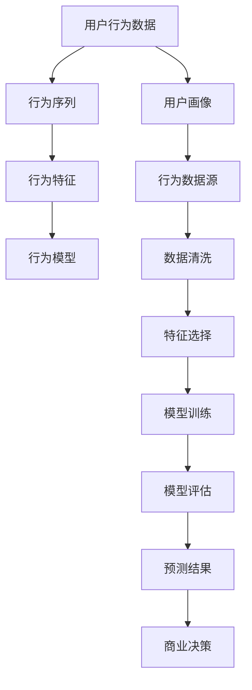

                 

# 如何进行有效的用户行为分析

> 关键词：用户行为分析,行为数据挖掘,机器学习模型,行为预测,用户画像,推荐系统

## 1. 背景介绍

### 1.1 问题由来

在数字时代，企业收集到的用户行为数据越来越丰富，形式也越来越多样，包括点击、浏览、搜索、购买、评论、分享等。如何有效分析这些数据，揭示用户行为背后的模式和规律，成为了数字营销和商业决策的核心任务。

行为数据挖掘(User Behavior Mining)是一种从大量用户行为数据中提取有价值信息的技术。它通过构建模型预测用户未来的行为，为个性化推荐、客户细分、广告定向等决策提供依据。而其中，基于机器学习模型的用户行为分析方法尤为广泛应用。

### 1.2 问题核心关键点

行为数据挖掘主要包含以下几个关键点：

- **数据来源**：用户行为数据通常来自于网站、移动应用、社交媒体等平台。
- **数据格式**：不同平台生成的数据格式各异，如网页点击流、电商交易记录、社交媒体评论等。
- **数据量级**：数据量级可从小量级到海量级不等，如何处理大规模数据是关键。
- **特征选择**：如何从原始行为数据中提取出有效的特征，对模型性能至关重要。
- **模型构建**：选择合适的机器学习模型，并对模型进行训练和调优。
- **预测与评估**：如何评估模型预测效果，并利用预测结果进行商业决策。

本文将深入探讨如何有效利用机器学习模型进行用户行为分析，为读者提供实用的技术指导。

## 2. 核心概念与联系

### 2.1 核心概念概述

以下是用户行为分析中的几个核心概念及其相互关系：

- **用户行为数据**：用户在数字平台上产生的一切行为记录，包括浏览历史、点击流、购买记录等。
- **用户画像**：基于用户行为数据构建的用户模型，用于描述用户的基本特征和行为模式。
- **行为序列**：用户行为数据按时间顺序排列形成的行为序列，可以是一系列的点击、浏览、购买行为。
- **行为特征**：从行为序列中提取出的关键特征，如行为频次、停留时间、购物车行为等。
- **行为模型**：利用机器学习算法构建的行为预测模型，用于预测用户未来的行为。

以上概念通过机器学习模型紧密联系在一起，共同构成了用户行为分析的技术框架。

### 2.2 核心概念原理和架构的 Mermaid 流程图



## 3. 核心算法原理 & 具体操作步骤

### 3.1 算法原理概述

基于机器学习的用户行为分析主要包括以下几个步骤：

1. **数据收集与清洗**：从不同平台收集用户行为数据，并进行数据清洗，去除异常值和噪声。
2. **特征选择与提取**：从清洗后的数据中提取有意义的行为特征，如浏览时长、购物车行为、评分反馈等。
3. **模型构建与训练**：选择合适的机器学习模型，并使用历史行为数据进行模型训练。
4. **模型评估与优化**：通过交叉验证、混淆矩阵等方法评估模型性能，并根据评估结果对模型进行优化。
5. **预测与结果应用**：利用训练好的模型进行用户行为预测，并将预测结果应用到商业决策中。

### 3.2 算法步骤详解

**Step 1: 数据收集与清洗**

用户行为数据通常分散在不同的平台和渠道中，需要综合集成。例如，电商网站收集的用户浏览、购买记录，社交媒体收集的用户评论、分享行为等。整合这些数据源，需先进行初步的数据清洗，包括去除重复数据、处理缺失值、纠正格式不一致等问题。

**Step 2: 特征选择与提取**

行为数据通常包含大量冗余和噪声信息，特征选择和提取是提高模型性能的关键步骤。常用的特征包括：

- **行为时间特征**：用户在平台上的活跃时间、高峰时间段等。
- **行为频率特征**：用户的访问频次、浏览次数、点击次数等。
- **行为顺序特征**：用户的操作序列，如浏览商品->加入购物车->下单。
- **行为持续时间特征**：用户的操作时长、停留时间、阅读深度等。
- **行为触发特征**：用户行为触发的原因，如搜索、推荐、广告点击等。

特征选择可以采用信息增益、卡方检验、相关性分析等方法。提取出的特征需要进行归一化和标准化处理，以提高模型稳定性。

**Step 3: 模型构建与训练**

选择合适的机器学习模型，并使用历史行为数据进行训练。常用的模型包括：

- **决策树模型**：基于特征对用户行为进行分类和预测。
- **随机森林模型**：通过集成多个决策树提高预测准确性。
- **支持向量机模型**：利用核函数将数据映射到高维空间，进行分类和回归。
- **朴素贝叶斯模型**：基于贝叶斯定理进行分类，适用于高维度稀疏数据。
- **深度学习模型**：如多层感知机、循环神经网络、卷积神经网络等，适用于复杂行为预测。

在模型训练过程中，需设置合适的超参数，如学习率、正则化系数、批次大小等。常用的超参数调优方法包括网格搜索、随机搜索、贝叶斯优化等。

**Step 4: 模型评估与优化**

训练好的模型需通过交叉验证、混淆矩阵、ROC曲线等方法进行评估，并根据评估结果进行模型优化。常用的评估指标包括准确率、召回率、F1分数、AUC值等。

**Step 5: 预测与结果应用**

利用训练好的模型进行用户行为预测，例如预测用户是否会购买某商品、是否会流失、是否会分享等。根据预测结果进行商业决策，如个性化推荐、用户细分、广告定向等。

### 3.3 算法优缺点

基于机器学习的用户行为分析方法具有以下优点：

1. **自动化程度高**：通过算法自动发现用户行为模式和规律，减少人工干预。
2. **预测准确性高**：在大量数据支持下，模型具有较高的预测准确性。
3. **适应性强**：模型可以适应不同类型和来源的用户行为数据。
4. **可解释性强**：通过特征工程和模型选择，可以理解模型的内部工作机制。

同时，该方法也存在以下缺点：

1. **数据质量要求高**：数据清洗和特征提取需手工干预，数据质量对模型性能影响大。
2. **算法复杂度高**：深度学习模型训练和优化复杂，需大量计算资源。
3. **模型过拟合风险**：模型可能在训练集上表现优异，但在测试集上泛化能力差。
4. **算法黑箱问题**：复杂的深度学习模型难以解释，缺乏透明性。

## 4. 数学模型和公式 & 详细讲解 & 举例说明

### 4.1 数学模型构建

假设用户行为数据集为 $D=\{(x_i,y_i)\}_{i=1}^N$，其中 $x_i$ 为行为特征向量，$y_i \in \{0,1\}$ 为行为标签（如是否购买）。

定义用户行为分类模型为 $M$，其预测结果为 $\hat{y}=M(x)$，其中 $\hat{y} \in \{0,1\}$。

目标是最小化模型的预测误差，可以使用交叉熵损失函数：

$$
\mathcal{L}(M)=\frac{1}{N}\sum_{i=1}^N \ell(M(x_i),y_i)=\frac{1}{N}\sum_{i=1}^N y_i\log M(x_i) + (1-y_i)\log (1-M(x_i))
$$

其中 $\ell$ 为二分类交叉熵损失函数。

### 4.2 公式推导过程

以随机森林模型为例，推导其分类器的预测公式：

1. **训练过程**：从训练集中随机抽取 $m$ 个样本和 $k$ 个特征，构建 $k$ 棵决策树 $T_1, T_2, \ldots, T_k$，并计算每棵树的预测结果 $y^{(j)}$。

2. **预测过程**：对于测试集中的样本 $x$，计算其在每棵决策树上的预测结果，并取多数投票：

$$
\hat{y}=\text{argmax} \sum_{j=1}^k y^{(j)}
$$

其中 $y^{(j)}$ 为第 $j$ 棵决策树的预测结果，可以通过决策树的预测规则得到。

### 4.3 案例分析与讲解

假设某电商平台收集的用户行为数据为 $D=\{(x_i,y_i)\}_{i=1}^N$，其中 $x_i$ 为用户的浏览、点击、购买行为序列，$y_i \in \{0,1\}$ 为是否完成购买行为。

采用随机森林模型对数据进行分类预测，步骤如下：

1. **数据预处理**：将用户行为序列转化为特征向量 $x_i$，并进行归一化处理。
2. **模型训练**：从 $D$ 中随机抽取样本和特征，构建多棵决策树 $T_1, T_2, \ldots, T_k$，并计算每棵树的预测结果。
3. **模型评估**：使用交叉验证评估模型性能，并优化超参数。
4. **预测应用**：使用训练好的模型对新用户的浏览行为进行预测，生成个性化推荐列表。

## 5. 项目实践：代码实例和详细解释说明

### 5.1 开发环境搭建

在进行用户行为分析项目实践前，需要先搭建好开发环境。以下是Python开发环境搭建步骤：

1. 安装Python：从官网下载并安装Python，建议选择最新版本。
2. 安装pip：使用命令行 `python -m ensurepip --default-pip` 安装pip。
3. 安装依赖包：使用 pip install 命令安装所需的依赖包，如numpy、pandas、scikit-learn、tensorflow等。
4. 创建虚拟环境：使用 `python -m venv myenv` 命令创建虚拟环境，激活虚拟环境：`source myenv/bin/activate`。

### 5.2 源代码详细实现

以下是使用Python进行用户行为分析的代码实现，假设用户行为数据为 $D=\{(x_i,y_i)\}_{i=1}^N$，其中 $x_i$ 为用户的浏览、点击、购买行为序列，$y_i \in \{0,1\}$ 为是否完成购买行为。

```python
import numpy as np
import pandas as pd
from sklearn.ensemble import RandomForestClassifier
from sklearn.model_selection import train_test_split
from sklearn.metrics import accuracy_score, precision_score, recall_score, f1_score

# 读取数据集
data = pd.read_csv('user_behavior_data.csv', index_col='user_id')

# 数据预处理
X = data[['click_count', 'browsing_time', 'purchase_frequency']]  # 特征选择
y = data['purchase_completed']  # 行为标签

# 数据划分
X_train, X_test, y_train, y_test = train_test_split(X, y, test_size=0.2, random_state=42)

# 模型训练
clf = RandomForestClassifier(n_estimators=100, max_depth=5, random_state=42)
clf.fit(X_train, y_train)

# 模型评估
y_pred = clf.predict(X_test)
print('Accuracy:', accuracy_score(y_test, y_pred))
print('Precision:', precision_score(y_test, y_pred))
print('Recall:', recall_score(y_test, y_pred))
print('F1-score:', f1_score(y_test, y_pred))
```

### 5.3 代码解读与分析

这段代码首先读取用户行为数据，并进行特征选择和数据划分。然后使用随机森林模型对训练集进行训练，并使用测试集评估模型性能。

代码中使用了sklearn库中的RandomForestClassifier模型，其中 `n_estimators` 表示决策树的棵数，`max_depth` 表示决策树的深度。

评估过程中使用了准确率、精确度、召回率和F1分数等指标，分别衡量模型的分类效果。

## 6. 实际应用场景

### 6.1 电商个性化推荐

电商网站通过用户行为数据挖掘，可以构建用户画像，预测用户是否会购买某商品。基于此，电商平台可以为用户推荐相关商品，提升用户购买意愿和满意度。

**应用案例**：亚马逊通过分析用户的浏览、购买行为，构建用户画像，预测用户是否会购买某商品。利用预测结果进行个性化推荐，显著提高了用户的购买转化率。

### 6.2 社交媒体用户分析

社交媒体平台通过用户行为数据挖掘，可以分析用户的行为模式和兴趣偏好，进行用户细分和广告定向。

**应用案例**：Facebook通过分析用户的点赞、评论、分享行为，构建用户画像，实现精准的广告定向。利用用户画像进行广告投放，提升了广告的点击率和转化率。

### 6.3 在线教育内容推荐

在线教育平台通过用户行为数据挖掘，可以分析用户的学习行为和兴趣偏好，进行内容推荐，提升学习效果和用户体验。

**应用案例**：Coursera通过分析用户的学习行为，如视频观看时间、课程评分等，构建用户画像，推荐相关课程。利用预测结果进行内容推荐，显著提高了课程完成率和用户满意度。

### 6.4 金融风控管理

金融公司通过用户行为数据挖掘，可以分析用户的交易行为和风险偏好，进行风险评估和控制。

**应用案例**：支付宝通过分析用户的交易行为，如消费频率、交易金额等，构建用户画像，进行风险评估。利用预测结果进行风险控制，有效防范金融欺诈行为。

### 6.5 游戏用户行为分析

游戏公司通过用户行为数据挖掘，可以分析用户的游戏行为和偏好，进行游戏推荐和内容优化。

**应用案例**：腾讯通过分析用户的游戏行为，如游戏时间、角色等级等，构建用户画像，推荐相关游戏内容。利用预测结果进行游戏推荐，显著提高了用户的游戏粘性和留存率。

## 7. 工具和资源推荐

### 7.1 学习资源推荐

1. 《Python数据科学手册》：这本书深入浅出地介绍了Python在数据科学中的应用，包括数据清洗、特征工程、模型选择等。
2. 《机器学习实战》：这本书通过大量的案例和代码，详细讲解了常见的机器学习算法和应用，适合初学者入门。
3. 《深度学习》：由Ian Goodfellow等知名学者编写，全面介绍了深度学习的基础理论和应用，是深度学习的经典教材。
4. Kaggle数据科学竞赛：Kaggle提供了丰富的数据集和竞赛任务，可以锻炼实战能力，学习数据科学和机器学习技术。
5. Coursera机器学习课程：由斯坦福大学的Andrew Ng教授主讲，系统讲解了机器学习的理论基础和实际应用，是入门机器学习的最佳选择。

### 7.2 开发工具推荐

1. Jupyter Notebook：用于编写和运行Python代码，支持实时展示代码输出，方便调试和展示结果。
2. Python环境管理工具：如virtualenv、conda等，方便管理和安装依赖包。
3. 数据可视化工具：如Matplotlib、Seaborn、Plotly等，支持绘制高质量的图表。
4. 数据清洗工具：如Pandas、NumPy等，支持数据预处理和特征提取。
5. 机器学习库：如scikit-learn、TensorFlow等，支持构建和训练机器学习模型。

### 7.3 相关论文推荐

1. <a href="https://arxiv.org/abs/1301.10099">“An Introduction to Statistical Learning” by Gareth James et al.</a>：介绍了统计学习的基础理论和方法，是数据科学和机器学习的重要参考。
2. <a href="https://arxiv.org/abs/1706.03471">“Towards Explainable AI” by Tom D.iet al.</a>：探讨了如何构建可解释的机器学习模型，提高了模型的透明性和可解释性。
3. <a href="https://arxiv.org/abs/1806.00745">“A Survey on Multi-Task Learning for Recommender Systems” by Lifeng Song et al.</a>：综述了多任务学习在推荐系统中的应用，探讨了如何提高推荐模型的效果和可解释性。
4. <a href="https://arxiv.org/abs/1903.00886">“Deep Learning in Recommendation Systems” by Ben Wang et al.</a>：介绍了深度学习在推荐系统中的应用，探讨了如何提高推荐模型的精度和效率。

## 8. 总结：未来发展趋势与挑战

### 8.1 研究成果总结

本文系统介绍了基于机器学习的用户行为分析方法，并结合具体应用案例，展示了其在电商、社交、教育、金融等多个领域的应用前景。通过深入探讨数据收集与清洗、特征选择与提取、模型构建与训练、模型评估与优化等关键步骤，为读者提供了实用的技术指导。

### 8.2 未来发展趋势

未来，用户行为分析技术将呈现以下几个发展趋势：

1. **多模态数据融合**：用户行为数据不仅限于单一渠道，更多地融合了图像、视频、音频等多模态数据，模型需要具备多模态数据处理能力。
2. **实时数据分析**：用户行为数据实时更新，需要构建实时数据分析系统，及时进行行为预测和决策。
3. **联邦学习**：在用户隐私保护的要求下，联邦学习成为热门技术，通过分布式计算，训练模型以保护用户隐私。
4. **跨领域知识迁移**：跨领域知识迁移技术将帮助模型更好地适应不同领域，提升模型的通用性和泛化能力。
5. **自动化模型选择**：自动化模型选择技术将帮助用户根据数据特点和应用场景，选择合适的模型进行训练和预测。

### 8.3 面临的挑战

尽管用户行为分析技术取得了一定进展，但在应用过程中仍然面临以下挑战：

1. **数据隐私问题**：用户行为数据涉及隐私，如何保护用户隐私是一个重要挑战。
2. **数据质量和多样性**：不同平台和渠道生成的数据质量和格式各异，数据多样性对模型训练和预测效果影响较大。
3. **模型可解释性**：复杂的深度学习模型难以解释，缺乏透明性，需要进一步提升模型的可解释性。
4. **计算资源需求高**：大模型和高维数据的训练需要大量的计算资源，如何优化计算效率是关键。
5. **用户行为变化快**：用户行为变化快，模型需要快速更新以适应新变化，需要进行动态模型更新。

### 8.4 研究展望

面对用户行为分析技术面临的挑战，未来的研究需要在以下几个方面进行深入探索：

1. **隐私保护技术**：开发更加高效、安全的隐私保护技术，确保用户数据的安全性。
2. **跨模态数据融合**：研究多模态数据融合技术，提升模型对不同数据类型的处理能力。
3. **自动化模型选择**：开发自动化模型选择工具，帮助用户根据数据特点和应用场景，快速选择最优模型。
4. **动态模型更新**：研究动态模型更新技术，提升模型对用户行为变化的适应能力。
5. **可解释性增强**：通过模型优化和特征工程，提升模型的可解释性，增强用户信任度。

总之，用户行为分析技术在数字经济中具有重要应用价值，但面临的挑战和问题仍需持续解决。未来，只有不断创新和优化，才能进一步提升用户行为分析技术的性能和应用范围。

## 9. 附录：常见问题与解答

**Q1: 如何处理缺失数据和异常值？**

A: 缺失数据和异常值是用户行为数据分析中的常见问题。常用的处理方法包括：

1. **缺失值填充**：使用均值、中位数、插值等方法填充缺失值。
2. **异常值检测**：使用统计方法（如标准差、四分位数）或模型预测（如随机森林）检测和处理异常值。
3. **缺失值编码**：将缺失值编码为特殊值，并参与模型训练。

**Q2: 如何提高模型的泛化能力？**

A: 提高模型泛化能力的方法包括：

1. **数据增强**：通过数据扩充和生成，增加训练数据量，减少过拟合。
2. **正则化**：使用L1/L2正则化、Dropout等技术，抑制过拟合。
3. **模型集成**：通过集成多个模型，提升泛化能力。
4. **超参数优化**：通过网格搜索、贝叶斯优化等方法，寻找最优超参数组合。

**Q3: 如何优化模型的计算效率？**

A: 优化模型计算效率的方法包括：

1. **模型裁剪**：去除不必要的层和参数，减小模型尺寸。
2. **量化加速**：将浮点模型转化为定点模型，压缩存储空间，提高计算效率。
3. **模型并行**：使用分布式计算，提升模型训练和推理效率。
4. **算法优化**：使用高效的算法实现，如剪枝、蒸馏等。

**Q4: 如何提升模型的可解释性？**

A: 提升模型可解释性的方法包括：

1. **特征重要性分析**：使用特征重要性评估方法，理解模型内部工作机制。
2. **模型可视化**：使用可视化工具，展示模型的预测过程和特征关系。
3. **模型融合**：使用简单的模型与复杂模型结合，提升可解释性。

**Q5: 如何选择适合的机器学习算法？**

A: 选择适合的机器学习算法的方法包括：

1. **问题类型**：根据任务类型选择分类、回归、聚类等算法。
2. **数据规模**：根据数据规模选择合适的算法，如小数据集可以使用决策树、随机森林等，大数据集可以使用深度学习等。
3. **模型复杂度**：根据模型的复杂度选择算法，如简单模型可以使用线性回归、决策树等，复杂模型可以使用深度学习等。
4. **特征数量**：根据特征数量选择算法，如高维度稀疏数据可以使用朴素贝叶斯、支持向量机等。

通过回答这些常见问题，希望读者能够更全面地理解用户行为分析技术，并应用于实际项目中。

---

作者：禅与计算机程序设计艺术 / Zen and the Art of Computer Programming

