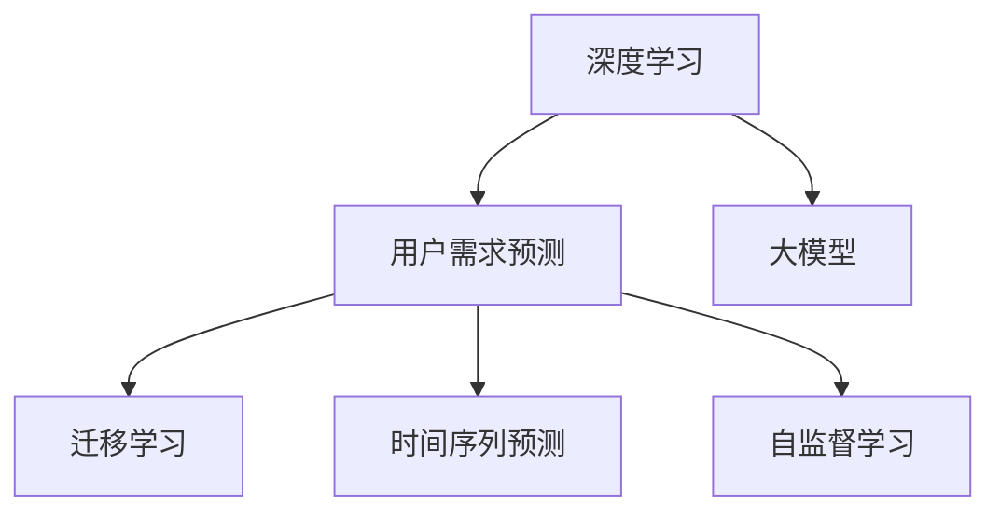

                 

## 1. 背景介绍

在现代数字化商业环境中，用户需求预测已成为企业运营的核心问题。准确的用户需求预测能够帮助企业优化库存管理、提升用户满意度、推动市场增长。传统的统计方法和机器学习模型已经广泛应用于需求预测，但面对海量数据和不断变化的市场需求，传统的算法难以满足实际需求。基于深度学习，特别是大模型的用户需求预测方法在近年取得了巨大进展，成为了技术研究的关注点。本文旨在对大模型驱动的深度学习需求预测方法进行系统梳理，为读者提供全面的技术指导。

## 2. 核心概念与联系

### 2.1 核心概念概述

在本节中，我们将介绍几个核心概念，这些概念构成了深度学习需求预测的基本框架：

- 深度学习（Deep Learning）：一种通过多层神经网络结构进行特征提取和模式识别的机器学习方法，具有强大的自适应能力和泛化能力。
- 用户需求预测（Demand Forecasting）：利用历史数据预测未来用户需求的动态过程，常见应用包括销售预测、库存管理、价格优化等。
- 大模型（Large Model）：指参数规模在数十亿以上的深度学习模型，通过大规模数据进行预训练，能够获取高维度的语义和上下文信息，适用于复杂任务。
- 迁移学习（Transfer Learning）：通过在大规模数据集上预训练模型，然后在目标任务上微调，提高模型在小样本学习情况下的泛化能力。
- 时间序列预测（Time Series Prediction）：预测时间序列数据的未来值，是需求预测的重要组成部分。
- 自监督学习（Self-Supervised Learning）：在大规模无标注数据上自动生成任务，进行模型训练，无需手动标注，减少人工成本。

这些核心概念之间的联系可以通过以下Mermaid流程图来展示：



这个流程图展示了深度学习需求预测的基本框架：

1. 深度学习是用户需求预测的基础技术。
2. 大模型通过预训练学习丰富的语义和上下文信息，为需求预测提供强有力的支持。
3. 迁移学习利用预训练模型在大规模数据集上获取的知识，在小样本情况下提高预测性能。
4. 时间序列预测是用户需求预测的重要方法，能够捕捉时间依赖关系。
5. 自监督学习能够自动生成监督信号，减少标注成本，提高模型泛化能力。

### 2.2 核心概念原理和架构

#### 深度学习

深度学习基于多层神经网络，通过反向传播算法进行参数更新。其核心原理在于通过多个层次的特征提取，逐层抽象出更高级别的特征表示，最终输出预测结果。深度学习模型的架构包括输入层、隐藏层和输出层。

#### 用户需求预测

用户需求预测主要分为统计方法和深度学习方法。统计方法包括回归模型、时间序列模型等；深度学习方法包括自回归模型、RNN、LSTM、GRU、Transformer等。深度学习模型通过学习输入数据的复杂非线性关系，能够更好地捕捉用户需求的动态变化。

#### 大模型

大模型如BERT、GPT-3等，通过在大规模数据集上进行预训练，能够获取丰富的语义和上下文信息。大模型的架构通常包括Transformer编码器、注意力机制、残差连接等。

#### 迁移学习

迁移学习通过在大规模数据集上预训练模型，然后在目标任务上进行微调，利用预训练模型中的知识，减少在小样本情况下的学习难度。迁移学习分为零样本迁移和少样本迁移，后者需要在微调时保持部分预训练参数不变，以避免过拟合。

#### 时间序列预测

时间序列预测包括ARIMA模型、LSTM模型、TCN模型等。这些模型通过捕捉时间依赖关系，能够预测未来的时间序列数据。时间序列预测的输入通常为时间序列数据和特征，输出为未来的时间序列数据。

#### 自监督学习

自监督学习通过在大规模无标注数据上自动生成监督信号，进行模型训练。自监督学习包括MLM（Masked Language Model）、MAE（Masked Autoencoder for Masked Language Modeling）等。

## 3. 核心算法原理 & 具体操作步骤

### 3.1 算法原理概述

基于深度学习的需求预测方法，一般包括以下几个步骤：

1. 数据准备：收集历史需求数据和相关特征，构建时间序列。
2. 模型选择：选择合适的深度学习模型进行需求预测，如LSTM、GRU、TCN等。
3. 模型训练：在历史数据上进行模型训练，获取预测模型。
4. 模型评估：在验证集上评估模型性能，调整超参数。
5. 模型微调：在目标任务上微调模型，适应新的需求分布。
6. 预测应用：使用训练好的模型进行未来需求预测。

其中，大模型的引入为需求预测带来了新的突破，特别是自监督学习和大模型的结合，显著提升了预测的精度和泛化能力。

### 3.2 算法步骤详解

#### 3.2.1 数据准备

1. 数据收集：收集历史需求数据，包括时间、数量、季节性等因素。
2. 数据预处理：处理缺失数据、异常数据，归一化数据。
3. 数据划分：将数据集分为训练集、验证集和测试集。

#### 3.2.2 模型选择

1. 选择合适的深度学习模型，如LSTM、GRU、TCN等。
2. 定义模型的输入和输出，包括时间序列数据和特征。
3. 定义模型的损失函数，如均方误差、交叉熵等。

#### 3.2.3 模型训练

1. 初始化模型参数。
2. 定义训练循环，循环次数为迭代次数。
3. 前向传播，计算损失函数。
4. 反向传播，更新模型参数。
5. 重复以上步骤，直到模型收敛。

#### 3.2.4 模型评估

1. 在验证集上计算模型性能指标，如MAE、RMSE等。
2. 调整超参数，如学习率、批大小等。
3. 在测试集上再次评估模型性能。

#### 3.2.5 模型微调

1. 在目标任务上微调模型，适应新的需求分布。
2. 保持部分预训练参数不变，只微调顶层参数。
3. 使用新的标注数据进行微调。

#### 3.2.6 预测应用

1. 使用训练好的模型进行未来需求预测。
2. 输出预测结果，包括时间、数量等。

### 3.3 算法优缺点

#### 优点

1. 大模型具有较强的泛化能力和自适应能力，能够捕捉复杂的特征。
2. 自监督学习能够在大规模无标注数据上自动生成监督信号，减少标注成本。
3. 迁移学习能够利用预训练模型中的知识，提高模型在小样本情况下的性能。

#### 缺点

1. 大模型参数规模大，训练和推理成本高。
2. 自监督学习依赖大规模无标注数据，数据获取成本高。
3. 迁移学习需要适应新的需求分布，微调过程复杂。

### 3.4 算法应用领域

用户需求预测技术广泛应用于多个领域，包括但不限于：

- 零售业：预测商品需求量，优化库存管理。
- 制造业：预测生产需求，提高生产效率。
- 金融业：预测市场变化，优化投资策略。
- 电商：预测用户购买行为，提升用户满意度。
- 旅游业：预测旅游需求，优化旅游资源配置。

## 4. 数学模型和公式 & 详细讲解 & 举例说明

### 4.1 数学模型构建

假设需求数据为时间序列 $\{y_t\}_{t=1}^{N}$，其中 $y_t$ 表示在第 $t$ 时间点的需求量，时间步长为 $1$。设特征向量为 $\{x_t\}_{t=1}^{N}$，包括季节性、节假日等因素。则用户需求预测的数学模型可以表示为：

$$ y_t = f(x_t;\theta) $$

其中 $f$ 为预测模型，$\theta$ 为模型参数。

### 4.2 公式推导过程

以LSTM模型为例，其架构包括输入层、LSTM层、输出层。假设LSTM模型的输入为 $(x_{t-1}, h_{t-1})$，输出为 $(h_t, y_t)$。LSTM模型的预测公式为：

$$ y_t = g(h_t;\theta) $$

其中 $g$ 为输出层的激活函数，$\theta$ 为输出层的参数。

LSTM模型的梯度更新公式为：

$$ \nabla_{\theta} L = \nabla_{h_t} L \cdot \nabla_{y_t} h_t \cdot \nabla_{g} y_t \cdot \nabla_{h_t} g $$

其中 $L$ 为损失函数，$h_t$ 为LSTM层的状态向量。

### 4.3 案例分析与讲解

#### 案例：电商平台用户需求预测

电商平台用户需求预测任务可以建模为序列预测问题，通过LSTM模型进行预测。

1. 数据收集：收集电商平台的订单数据，包括时间、商品、用户信息等。
2. 数据预处理：处理缺失数据、异常数据，归一化数据。
3. 模型选择：选择LSTM模型进行预测。
4. 模型训练：在订单数据上进行模型训练，获取预测模型。
5. 模型评估：在验证集上评估模型性能，调整超参数。
6. 模型微调：在目标任务上微调模型，适应新的需求分布。
7. 预测应用：使用训练好的模型进行未来需求预测。

## 5. 项目实践：代码实例和详细解释说明

### 5.1 开发环境搭建

在进行需求预测项目实践前，我们需要准备好开发环境。以下是使用Python进行TensorFlow开发的环境配置流程：

1. 安装Anaconda：从官网下载并安装Anaconda，用于创建独立的Python环境。

2. 创建并激活虚拟环境：
```bash
conda create -n tf-env python=3.8 
conda activate tf-env
```

3. 安装TensorFlow：根据CUDA版本，从官网获取对应的安装命令。例如：
```bash
conda install tensorflow -c conda-forge -c pytorch
```

4. 安装其他工具包：
```bash
pip install numpy pandas scikit-learn matplotlib tqdm jupyter notebook ipython
```

完成上述步骤后，即可在`tf-env`环境中开始需求预测实践。

### 5.2 源代码详细实现

下面我们以电商平台用户需求预测为例，给出使用TensorFlow进行LSTM模型训练的Python代码实现。

首先，定义数据处理函数：

```python
import tensorflow as tf
import numpy as np
import pandas as pd

def load_data(filename):
    data = pd.read_csv(filename)
    return data['time'].values, data['demand'].values
```

然后，定义LSTM模型：

```python
class LSTMModel(tf.keras.Model):
    def __init__(self, input_dim, hidden_dim, output_dim):
        super(LSTMModel, self).__init__()
        self.input_dim = input_dim
        self.hidden_dim = hidden_dim
        self.output_dim = output_dim
        
        self.lstm = tf.keras.layers.LSTM(hidden_dim)
        self.dense = tf.keras.layers.Dense(output_dim)
    
    def call(self, x):
        _, (h, _) = self.lstm(x)
        return self.dense(h)
```

接着，定义训练和评估函数：

```python
def train_model(model, train_x, train_y, epochs):
    optimizer = tf.keras.optimizers.Adam(learning_rate=0.001)
    loss_fn = tf.keras.losses.MeanSquaredError()
    
    for epoch in range(epochs):
        for i in range(0, len(train_x) - train_window, 1):
            x = train_x[i:i+train_window]
            y = train_y[i+train_window]
            
            with tf.GradientTape() as tape:
                y_pred = model(x)
                loss = loss_fn(y, y_pred)
            
            gradients = tape.gradient(loss, model.trainable_variables)
            optimizer.apply_gradients(zip(gradients, model.trainable_variables))
            
            if i % 100 == 0:
                print(f'Epoch {epoch+1}, Step {i+1}, Loss: {loss:.4f}')
    
    return model

def evaluate_model(model, test_x, test_y):
    y_pred = model(test_x)
    loss = tf.keras.losses.MeanSquaredError()
    mse = loss(test_y, y_pred)
    mae = tf.keras.metrics.mean_absolute_error(test_y, y_pred).numpy()
    rmse = tf.keras.metrics.root_mean_squared_error(test_y, y_pred).numpy()
    
    print(f'Test MSE: {mse:.4f}, MAE: {mae:.4f}, RMSE: {rmse:.4f}')
```

最后，启动训练流程并在测试集上评估：

```python
epochs = 500
train_window = 20
test_window = 20

train_x, train_y = load_data('train.csv')
test_x, test_y = load_data('test.csv')

model = LSTMModel(input_dim=1, hidden_dim=50, output_dim=1)
model = train_model(model, train_x, train_y, epochs)

evaluate_model(model, test_x, test_y)
```

以上就是使用TensorFlow对LSTM进行电商平台用户需求预测的完整代码实现。可以看到，TensorFlow提供了便捷的Keras API，可以快速搭建和训练深度学习模型。

### 5.3 代码解读与分析

让我们再详细解读一下关键代码的实现细节：

**load_data函数**：
- 读取CSV文件，提取时间序列数据和需求数据，返回两个数组。

**LSTMModel类**：
- 定义LSTM模型的输入、隐藏和输出维度。
- 使用Keras的LSTM层和Dense层搭建模型。
- 定义模型的前向传播过程。

**train_model函数**：
- 定义Adam优化器和均方误差损失函数。
- 循环遍历训练集，对每个时间步进行预测和损失计算。
- 使用梯度下降更新模型参数。
- 打印损失值。

**evaluate_model函数**：
- 计算模型在测试集上的均方误差、平均绝对误差和均方根误差。
- 打印结果。

**训练流程**：
- 定义总的epoch数和训练窗口大小。
- 加载训练集和测试集。
- 初始化LSTM模型。
- 调用训练函数进行模型训练。
- 调用评估函数进行模型评估。

可以看到，TensorFlow的Keras API使得深度学习模型的搭建和训练变得简单高效。开发者可以将更多精力放在数据处理和模型调优上，而不必过多关注底层的实现细节。

当然，工业级的系统实现还需考虑更多因素，如模型的保存和部署、超参数的自动搜索、更灵活的任务适配层等。但核心的深度学习需求预测范式基本与此类似。

## 6. 实际应用场景

### 6.1 电商平台用户需求预测

电商平台用户需求预测可以显著优化库存管理和运营策略。通过LSTM模型对历史订单数据进行建模，可以预测未来一段时间内的用户需求量，避免库存积压或断货现象。同时，通过时间序列分析和特征工程，可以捕捉节假日、季节性等因素对需求的影响，进一步提升预测精度。

### 6.2 制造业生产预测

制造业生产预测可以帮助企业优化生产计划和资源配置。通过LSTM模型对历史生产数据进行建模，可以预测未来的生产需求量，提高生产效率。同时，结合设备维护、市场需求等因素，可以进一步提升预测精度。

### 6.3 金融市场预测

金融市场预测可以帮助金融机构优化投资策略和风险控制。通过LSTM模型对历史市场数据进行建模，可以预测未来的市场变化，优化投资组合。同时，结合宏观经济指标、政策变化等因素，可以进一步提升预测精度。

### 6.4 未来应用展望

随着深度学习和大模型技术的发展，需求预测的应用场景将更加广泛。未来，需求预测将在智慧城市、智能交通、能源管理等领域发挥重要作用，推动各行各业数字化转型。

## 7. 工具和资源推荐

### 7.1 学习资源推荐

为了帮助开发者系统掌握深度学习需求预测的理论基础和实践技巧，这里推荐一些优质的学习资源：

1. 《深度学习》系列书籍：由Ian Goodfellow等人撰写，全面介绍了深度学习的基本原理和应用方法。
2. Coursera《深度学习专项课程》：斯坦福大学开设的深度学习课程，内容系统全面，配套作业和实践项目。
3. Udacity《深度学习基础》课程：针对初学者，提供了深入浅出的深度学习入门教程。
4. TensorFlow官方文档：TensorFlow的官方文档，提供了丰富的代码示例和API文档，适合快速上手。
5. PyTorch官方文档：PyTorch的官方文档，提供了详细的教程和代码示例，适合深度学习开发。

通过对这些资源的学习实践，相信你一定能够快速掌握深度学习需求预测的精髓，并用于解决实际的业务问题。

### 7.2 开发工具推荐

高效的开发离不开优秀的工具支持。以下是几款用于深度学习需求预测开发的常用工具：

1. TensorFlow：由Google主导开发的深度学习框架，生产部署方便，适合大规模工程应用。
2. PyTorch：由Facebook主导开发的深度学习框架，灵活性高，适合快速迭代研究。
3. Keras：Keras API提供了便捷的深度学习模型搭建接口，适合快速原型开发。
4. Jupyter Notebook：免费的开源笔记本环境，适合数据探索、模型实验和代码共享。
5. GitHub：开源代码托管平台，适合存储和分享深度学习项目。

合理利用这些工具，可以显著提升深度学习需求预测任务的开发效率，加快创新迭代的步伐。

### 7.3 相关论文推荐

深度学习需求预测领域的研究方兴未艾，以下是几篇奠基性的相关论文，推荐阅读：

1. LSTM: A Search Space Odyssey通过深入研究LSTM模型，探讨了LSTM模型在时间序列预测中的表现。
2. GRU Unit通过对比LSTM和GRU模型的性能，揭示了GRU模型在时间序列预测中的应用潜力。
3. TCN: Deep Learning for Time Series Forecasting: Unifying Feature Engineering, Literature Survey and Evaluation提出TCN模型，实现了时间序列预测的统一框架。
4. ARIMA: Time Series Forecasting: Concepts and Methods通过介绍ARIMA模型，展示了传统统计方法在时间序列预测中的应用。
5. Masked Language Model: A Survey通过全面综述自监督学习在深度学习中的应用，展示了其对需求预测的重要意义。

这些论文代表了大模型驱动的深度学习需求预测技术的发展脉络。通过学习这些前沿成果，可以帮助研究者把握学科前进方向，激发更多的创新灵感。

## 8. 总结：未来发展趋势与挑战

### 8.1 总结

本文对基于深度学习的需求预测方法进行了全面系统的介绍。首先阐述了深度学习需求预测的研究背景和意义，明确了深度学习在大模型驱动下对需求预测的重要作用。其次，从原理到实践，详细讲解了深度学习需求预测的数学原理和关键步骤，给出了深度学习需求预测的完整代码实例。同时，本文还广泛探讨了深度学习需求预测在多个行业领域的应用前景，展示了深度学习需求预测的巨大潜力。最后，本文精选了深度学习需求预测的相关学习资源，力求为读者提供全方位的技术指引。

通过本文的系统梳理，可以看到，基于深度学习的需求预测方法在各行各业中具有广泛的应用前景，能够显著提升企业的运营效率和市场竞争力。未来，随着深度学习和大模型技术的发展，需求预测的应用场景将更加广泛，深度学习需求预测技术将不断创新，为各行各业带来新的突破。

### 8.2 未来发展趋势

展望未来，深度学习需求预测技术将呈现以下几个发展趋势：

1. 模型规模持续增大。随着算力成本的下降和数据规模的扩张，深度学习模型的参数量还将持续增长。超大规模模型能够更好地捕捉复杂的特征和关系，提高预测精度。
2. 自监督学习逐渐普及。自监督学习能够在大规模无标注数据上自动生成监督信号，减少标注成本，成为未来需求预测的重要方向。
3. 迁移学习能力增强。迁移学习能够利用预训练模型中的知识，提高模型在小样本情况下的泛化能力，成为需求预测中的重要技术。
4. 多模态融合成为趋势。结合图像、视频、语音等多模态信息，能够进一步提升需求预测的精度和泛化能力。
5. 时间序列预测技术创新。基于时间序列的深度学习模型，如TCN、LSTM等，将继续在需求预测中发挥重要作用。
6. 可解释性和安全性提升。可解释性和安全性是深度学习需求预测的重要课题，未来将有更多研究关注模型解释和数据隐私保护。

以上趋势凸显了深度学习需求预测技术的广阔前景。这些方向的探索发展，必将进一步提升需求预测的精度和泛化能力，为各行各业带来新的突破。

### 8.3 面临的挑战

尽管深度学习需求预测技术已经取得了瞩目成就，但在迈向更加智能化、普适化应用的过程中，它仍面临着诸多挑战：

1. 数据获取成本高。大规模标注数据获取成本高，难以满足实际需求。如何降低数据获取成本，成为一大难题。
2. 模型复杂度高。大模型参数规模大，训练和推理成本高。如何简化模型结构，提高推理效率，优化资源占用，将是重要的优化方向。
3. 模型鲁棒性不足。深度学习模型面对域外数据时，泛化性能往往大打折扣。如何提高模型的鲁棒性，避免过拟合，还需更多理论和实践的积累。
4. 数据隐私保护。需求预测需要大量的用户数据，如何保护用户隐私，防止数据泄露，将是重要的研究课题。
5. 模型可解释性不足。深度学习模型通常像“黑盒”系统，难以解释其内部工作机制和决策逻辑。如何赋予模型更强的可解释性，将是亟待攻克的难题。

### 8.4 研究展望

面对深度学习需求预测所面临的挑战，未来的研究需要在以下几个方面寻求新的突破：

1. 探索无监督和半监督需求预测方法。摆脱对大规模标注数据的依赖，利用自监督学习、主动学习等无监督和半监督范式，最大限度利用非结构化数据，实现更加灵活高效的需求预测。
2. 研究参数高效和计算高效的需求预测范式。开发更加参数高效的需求预测方法，如 Adapter、Prefix等，在固定大部分预训练参数的情况下，只更新极少量的任务相关参数。同时优化深度学习模型的计算图，减少前向传播和反向传播的资源消耗，实现更加轻量级、实时性的部署。
3. 融合因果和对比学习范式。通过引入因果推断和对比学习思想，增强深度学习模型的建立稳定因果关系的能力，学习更加普适、鲁棒的需求预测模型。
4. 引入更多先验知识。将符号化的先验知识，如知识图谱、逻辑规则等，与深度学习模型进行巧妙融合，引导需求预测过程学习更准确、合理的语言模型。同时加强不同模态数据的整合，实现视觉、语音等多模态信息与文本信息的协同建模。
5. 结合因果分析和博弈论工具。将因果分析方法引入深度学习模型，识别出模型决策的关键特征，增强需求预测的因果性和逻辑性。借助博弈论工具刻画人机交互过程，主动探索并规避模型的脆弱点，提高系统稳定性。
6. 纳入伦理道德约束。在深度学习需求预测目标中引入伦理导向的评估指标，过滤和惩罚有偏见、有害的输出倾向。同时加强人工干预和审核，建立需求预测行为的监管机制，确保输出符合人类价值观和伦理道德。

这些研究方向的探索，必将引领深度学习需求预测技术迈向更高的台阶，为各行各业带来新的突破。相信随着学界和产业界的共同努力，这些挑战终将一一被克服，深度学习需求预测必将在构建智能交互系统的进步中扮演越来越重要的角色。

## 9. 附录：常见问题与解答

**Q1：深度学习需求预测是否适用于所有行业？**

A: 深度学习需求预测技术适用于大多数行业，特别是在数据丰富、变化快速的场景下效果显著。但对于一些特定领域，如农业、手工业等，由于数据量小、变化缓慢，深度学习预测效果可能不如传统方法。需要根据具体行业特点选择合适的方法。

**Q2：如何选择合适的深度学习模型？**

A: 选择合适的深度学习模型需要考虑数据的特点和预测目标。对于时间序列数据，如LSTM、GRU、TCN等模型适合；对于图像数据，如CNN模型适合；对于文本数据，如Transformer等模型适合。

**Q3：深度学习需求预测的训练成本高吗？**

A: 深度学习需求预测的训练成本较高，主要体现在数据获取和模型训练上。需要结合实际业务需求，合理选择模型规模和训练参数，优化训练过程，降低成本。

**Q4：如何提高深度学习需求预测的泛化能力？**

A: 提高深度学习需求预测的泛化能力可以通过以下方法：
1. 数据增强：通过数据合成、回译等方式扩充训练集。
2. 正则化：使用L2正则、Dropout等避免过拟合。
3. 迁移学习：利用预训练模型中的知识，减少在小样本情况下的学习难度。
4. 多模型集成：训练多个模型，取平均输出，抑制过拟合。

这些策略往往需要根据具体任务和数据特点进行灵活组合。只有在数据、模型、训练、推理等各环节进行全面优化，才能最大限度地发挥深度学习需求预测的威力。

**Q5：深度学习需求预测如何结合外部知识？**

A: 深度学习需求预测可以结合外部知识，如知识图谱、逻辑规则等，通过引入先验知识，引导模型学习更准确、合理的预测结果。同时，加强不同模态数据的整合，实现视觉、语音等多模态信息与文本信息的协同建模，进一步提升预测精度。

**Q6：如何保护用户隐私？**

A: 在深度学习需求预测过程中，需要保护用户隐私，防止数据泄露。可以采用数据匿名化、差分隐私等技术，在保证预测效果的同时，保护用户数据隐私。

总之，深度学习需求预测技术在各行各业中具有广泛的应用前景，能够显著提升企业的运营效率和市场竞争力。未来，随着深度学习和大模型技术的发展，需求预测的应用场景将更加广泛，深度学习需求预测技术将不断创新，为各行各业带来新的突破。相信随着学界和产业界的共同努力，这些挑战终将一一被克服，深度学习需求预测必将在构建智能交互系统的进步中扮演越来越重要的角色。

