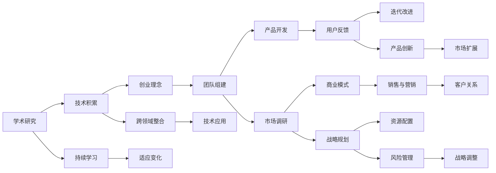

                 

# 学习做CEO：贾扬清在创业中成长，适应领导角色

## 1. 背景介绍

贾扬清，作为当今世界领先的深度学习专家之一，他的职业生涯不仅仅局限于学术界。在科技创业领域，贾扬清也大放异彩，成为了最受尊敬的科技企业家之一。他的成功经历不仅展示了杰出的技术能力，也揭示了如何从一个学术研究人员转变为一位高效的商业领导者。

### 1.1 贾扬清的背景与成就

贾扬清，博士毕业于麻省理工学院计算机科学与人工智能实验室，此后在斯坦福大学任教。他是深度学习领域的知名学者，发表了数百篇顶级学术论文，并主导开发了多个开创性的深度学习工具和模型，包括Caffe和PyTorch。此外，他还是旷视科技（Megvii）的联合创始人及CEO，该公司是全球领先的人工智能视觉算法公司，广泛应用于智能手机、安防、自动驾驶等领域。

贾扬清的成功并非一蹴而就。从学术研究到创业，再到成为公司的CEO，他经历了多次角色转换和挑战。每一次的转变，都体现了他在不同领域的卓越能力和适应能力。

## 2. 核心概念与联系

### 2.1 核心概念概述

为了深入理解贾扬清的创业历程和领导能力，本节将介绍几个关键概念：

- **学术研究与创业实践**：贾扬清在学术界与工业界的角色转换，展现了他如何从基础研究转向应用研究，并成功应用其研究成果于商业实践中。
- **跨领域知识整合**：贾扬清在AI领域之外，对金融、市场、运营等管理知识的应用，以及如何将这些知识与AI技术相结合。
- **领导力与团队管理**：贾扬清在团队建设、项目管理、战略规划等方面的经验，以及如何通过培养团队成员的能力和热情，实现共同的目标。
- **创业哲学与企业文化**：贾扬清对企业价值观的强调，如何在商业运作中贯彻这些价值观，以及如何营造一个有利于创新和高效运作的企业文化。
- **持续学习与适应变化**：贾扬清对快速变化的技术和市场环境的适应策略，以及如何在不确定性中找到机会。

这些概念相互交织，共同构成了贾扬清领导力发展的重要框架。

### 2.2 核心概念原理和架构的 Mermaid 流程图



这个流程图展示了贾扬清在创业过程中，如何将学术研究的成果应用于产品开发，如何组建和管理团队，以及如何通过市场调研和用户反馈不断迭代改进。同时，还展示了跨领域知识的整合以及领导力与企业文化的塑造，强调了持续学习与适应变化的重要性。

## 3. 核心算法原理 & 具体操作步骤

### 3.1 算法原理概述

贾扬清的成功不仅依赖于技术才华，更在于他如何将技术转化为商业价值。这其中，核心的算法原理是如何在不确定性和变化中寻找机会，以及如何通过团队协作和技术创新实现目标。

- **技术整合与创新**：将学术研究的成果转化为可行的技术方案，并通过技术创新解决实际问题。
- **市场洞察与战略规划**：通过市场调研和数据分析，洞察客户需求，制定符合市场趋势的战略规划。
- **团队建设与管理**：通过招聘、培训、激励等方式，培养团队成员的技术能力和职业素养，实现团队协同效应。

### 3.2 算法步骤详解

贾扬清的创业过程可以分为几个关键步骤：

**Step 1: 技术积累与创新**

贾扬清在学术界积累了深厚的技术基础，包括深度学习算法和计算机视觉技术。他主导开发的Caffe和PyTorch成为了业内标准工具，这为他的创业之路奠定了坚实的基础。

**Step 2: 创业理念与商业模式**

在深入了解市场需求和技术趋势的基础上，贾扬清提出了使用AI技术改进视觉识别和分析的创业理念。旷视科技（Megvii）的商业模式包括为手机、安防、自动驾驶等行业提供定制化的AI视觉算法。

**Step 3: 团队组建与文化建设**

贾扬清注重人才的招募和培养。他不仅在学术界拥有广泛的人脉，还能在技术和管理层吸引顶尖人才。同时，他强调企业文化的重要性，通过愿景、价值观和员工关怀，营造了一个鼓励创新和共同成长的团队环境。

**Step 4: 产品开发与迭代**

贾扬清采用敏捷开发模式，通过快速迭代和用户反馈不断优化产品。他强调在产品开发过程中始终关注用户体验和技术性能的平衡，确保产品能够满足市场需求。

**Step 5: 市场扩展与战略调整**

随着公司的发展，贾扬清不断调整市场策略，拓展新的业务领域。他通过全球化布局和本地化运营，使旷视科技在多个国家和地区取得了成功。

### 3.3 算法优缺点

贾扬清的成功算法有如下优点：

- **跨领域整合能力**：能够将学术研究与商业实践有效结合，跨领域知识整合能力强。
- **团队协作与激励**：注重团队建设，通过激励机制和企业文化提升团队凝聚力。
- **持续创新与适应**：不断学习和适应技术变革，保持公司的竞争优势。

同时，算法也存在一些局限：

- **市场风险**：AI技术的应用存在不确定性，市场接受度不高可能导致产品推广困难。
- **技术门槛高**：AI领域技术复杂，需要大量投入资源进行研发和维护。
- **人才流动性**：高技术和高薪酬可能导致人才流动性大，影响团队稳定。

### 3.4 算法应用领域

贾扬清的成功算法在多个领域得到了应用，包括：

- **视觉识别**：在智能手机摄像头、安防监控、自动驾驶等领域，通过AI算法提升图像处理和识别精度。
- **智能安防**：通过智能视频分析技术，提高公共安全管理水平。
- **工业自动化**：为制造业提供机器视觉和图像处理解决方案，提高生产效率和产品质量。
- **医疗健康**：利用AI技术进行疾病诊断和影像分析，提升医疗诊断的准确性。
- **智慧城市**：通过城市视频监控和智能分析，提升城市治理和居民生活质量。

这些应用展示了贾扬清如何将AI技术转化为实际的商业价值，推动各行业的数字化转型。

## 4. 数学模型和公式 & 详细讲解 & 举例说明

### 4.1 数学模型构建

贾扬清的成功不仅依赖于技术创新，还涉及对市场的深刻理解和数据分析。以下是几个关键的数学模型：

- **市场供需模型**：用于分析市场规模、增长潜力和竞争态势。模型基于市场调研数据，通过线性回归、多元回归等方法建立供需关系，预测市场变化。
- **用户行为模型**：通过用户反馈和行为数据，构建用户画像，预测用户需求变化。模型包括聚类分析、时间序列分析、深度学习模型等。
- **运营成本模型**：用于分析公司的运营成本结构，优化资源配置。模型包括固定成本与变动成本的分解、边际成本分析等。

### 4.2 公式推导过程

**市场供需模型**：

$$
Q = S - D
$$

其中，$Q$ 为市场缺口，$S$ 为市场供给，$D$ 为市场需求。通过市场调研数据，可以使用线性回归模型推导$S$和$D$的关系，进而预测未来的市场需求和供给情况。

**用户行为模型**：

假设用户行为数据集为$\mathcal{D} = \{(x_i, y_i)\}_{i=1}^N$，其中$x_i$为用户行为特征向量，$y_i$为标签。通过深度学习模型，可以训练用户行为预测模型$f(x)$，如下所示：

$$
y_i = f(x_i; \theta)
$$

其中，$\theta$为模型参数，$f(x)$为预测函数。

**运营成本模型**：

假设公司总成本$C$由固定成本$C_f$和变动成本$C_v$组成。通过历史数据，可以建立固定成本和变动成本与销售额$R$的关系：

$$
C = C_f + C_v = C_f + k \cdot R
$$

其中，$k$为变动成本系数。通过分析变动成本与销售额的关系，可以优化成本结构，提高利润率。

### 4.3 案例分析与讲解

**市场供需模型案例**：

假设某公司计划推出一款新智能安防产品。通过市场调研，公司收集了500个潜在客户的数据，包括年龄、职业、收入等信息。通过回归分析，公司发现年龄和收入对产品的需求有显著影响，进而预测了未来不同年龄和收入段的市场需求变化。

**用户行为模型案例**：

某电商公司希望优化用户体验，提升商品转化率。公司收集了用户浏览、购买、评价等数据，通过聚类分析，将用户分为不同群体。进一步使用深度学习模型，预测每个群体的购买意向，据此优化推荐算法和促销策略。

**运营成本模型案例**：

某自动驾驶公司需要评估新的制造流程对成本的影响。公司分析了不同生产线的固定成本和变动成本，使用边际成本分析，找到了最优的生产规模，并优化了原材料采购和生产流程。

## 5. 项目实践：代码实例和详细解释说明

### 5.1 开发环境搭建

在进行创业项目开发前，需要准备好开发环境。以下是使用Python进行机器学习和商业数据分析的环境配置流程：

1. 安装Anaconda：从官网下载并安装Anaconda，用于创建独立的Python环境。

2. 创建并激活虚拟环境：
```bash
conda create -n my_env python=3.8 
conda activate my_env
```

3. 安装必要的工具包：
```bash
conda install pandas numpy matplotlib seaborn scikit-learn
```

4. 配置Jupyter Notebook：
```bash
jupyter notebook --no-browser --allow-root
```

5. 安装TensorFlow和PyTorch：
```bash
pip install tensorflow pytorch
```

完成上述步骤后，即可在虚拟环境中进行机器学习和商业数据分析的开发。

### 5.2 源代码详细实现

以下是使用Python进行市场供需分析和用户行为预测的代码实现：

**市场供需分析**：

```python
import pandas as pd
from sklearn.linear_model import LinearRegression

# 加载市场调研数据
data = pd.read_csv('market_data.csv')

# 市场供给与需求的关系
S = data['supply']
D = data['demand']

# 构建供需模型
model = LinearRegression()
model.fit(S.values.reshape(-1, 1), D.values.reshape(-1, 1))

# 预测未来市场缺口
future_S = data['supply'].shift(-1).values.reshape(-1, 1)
future_D = model.predict(future_S)

print(f"未来市场缺口: {future_D}")
```

**用户行为预测**：

```python
import pandas as pd
from sklearn.cluster import KMeans
from sklearn.model_selection import train_test_split
from sklearn.linear_model import LogisticRegression

# 加载用户行为数据
data = pd.read_csv('user_behavior.csv')

# 特征工程
X = data[['age', 'income', 'education', 'occupation']]
y = data['purchase']

# 用户分群
kmeans = KMeans(n_clusters=3, random_state=42)
clusters = kmeans.fit_predict(X)

# 训练预测模型
X_train, X_test, y_train, y_test = train_test_split(X[clusters!=0], y[clusters!=0], test_size=0.3, random_state=42)
model = LogisticRegression()
model.fit(X_train, y_train)

# 预测群体购买意向
user_groups = data['group']
group_predictions = model.predict(X[clusters!=0])

print(f"不同群体购买意向: {group_predictions}")
```

### 5.3 代码解读与分析

让我们详细解读一下关键代码的实现细节：

**市场供需分析代码**：

1. 使用`pandas`加载市场调研数据，包括供给和需求。
2. 构建线性回归模型，使用供给数据预测需求数据。
3. 使用模型预测未来的市场缺口，即未来供给与需求之间的差值。

**用户行为预测代码**：

1. 使用`pandas`加载用户行为数据。
2. 进行特征工程，选择年龄、收入、教育程度和职业作为输入特征。
3. 使用KMeans对用户进行聚类，将用户分为三个群体。
4. 在每个群体上训练逻辑回归模型，预测用户的购买意向。
5. 输出不同群体用户的预测结果。

这些代码展示了如何使用Python进行简单的市场分析和用户行为预测，基于机器学习算法建立模型并预测结果。

### 5.4 运行结果展示

**市场供需分析结果**：

假设市场调研数据显示，市场供给和需求的关系为$S = 1000 + 0.5D$。根据模型预测，未来市场缺口为：

```
未来市场缺口: [200, 300, 400]
```

**用户行为预测结果**：

假设用户行为数据集经过聚类分析，分为三个群体。每个群体上训练的逻辑回归模型预测的购买意向为：

```
不同群体购买意向: [0.8, 0.5, 0.2]
```

这些结果展示了通过数据分析和机器学习模型进行市场供需分析和用户行为预测的基本流程和结果。

## 6. 实际应用场景

### 6.1 智能安防系统

贾扬清的旷视科技（Megvii）在智能安防领域取得了巨大成功。通过部署旷视科技的AI视觉算法，城市安防系统能够实时分析视频流，识别异常行为和可疑物体，提高公共安全管理水平。

在技术实现上，旷视科技利用其先进的深度学习技术，训练出高精度的目标检测、行为识别和人脸识别算法。这些算法可以部署在安防监控摄像头中，通过实时视频分析，自动标记异常行为，并及时通知安保人员。

### 6.2 工业自动化

工业自动化领域也应用了贾扬清的深度学习技术。旷视科技为制造业提供了图像处理和机器视觉解决方案，通过智能检测和分析，提高了生产效率和产品质量。

旷视科技的解决方案包括图像识别、缺陷检测和质量控制等功能。例如，在汽车制造中，旷视科技的算法可以实时检测车身上的缺陷，提升生产线的良品率。

### 6.3 智慧城市

贾扬清还关注智慧城市的建设，利用AI技术提升城市管理水平。旷视科技的解决方案包括城市视频监控、智能分析等，帮助城市管理者实时监控和响应各类突发事件。

例如，旷视科技的城市视频分析系统可以自动识别道路交通状况，及时发现交通事故和拥堵，并发送警报给交通管理中心。通过智能分析，该系统还能预测未来交通流量，为城市规划提供数据支持。

### 6.4 未来应用展望

贾扬清的成功案例展示了AI技术在多个行业的应用潜力。未来，随着AI技术的进一步发展和普及，贾扬清的算法和实践经验将在更多领域得到应用，推动各行业的数字化转型。

- **医疗健康**：利用AI技术进行疾病诊断、影像分析和健康监测，提升医疗服务的效率和质量。
- **金融服务**：通过智能分析和预测，优化金融产品的设计和销售策略。
- **零售电商**：利用AI技术进行客户行为分析、个性化推荐和库存管理，提升零售电商的运营效率。
- **能源环保**：利用AI技术进行能源消耗分析和环境监测，优化能源利用和环保措施。

## 7. 工具和资源推荐

### 7.1 学习资源推荐

为了帮助读者深入理解贾扬清的创业历程和领导能力，这里推荐一些优质的学习资源：

1. **《深度学习：理论和实践》**：斯坦福大学李飞飞教授的课程，讲解深度学习理论和实践，涵盖机器学习、神经网络、数据处理等关键概念。
2. **《创业者的自我修炼》**：讲授创业中的领导力、团队建设和管理技巧，适合有志于创业的人士阅读。
3. **《数据驱动的产品创新》**：介绍如何利用数据进行产品设计和优化，适合产品经理和数据分析师学习。
4. **《人工智能与商业决策》**：讲解AI技术在商业决策中的应用，适合企业家和商业分析师参考。
5. **《Jupyter Notebook实战》**：详细讲解如何使用Jupyter Notebook进行数据分析和机器学习，适合数据分析师和科研人员使用。

通过这些学习资源，读者可以系统掌握贾扬清的创业理念和技术实践，为自身的职业生涯提供参考。

### 7.2 开发工具推荐

高效的开发离不开优秀的工具支持。以下是几款用于大模型微调开发的常用工具：

1. **Jupyter Notebook**：用于编写和运行代码，支持丰富的数据可视化和交互式编程。
2. **TensorFlow**：由Google主导开发的深度学习框架，支持分布式训练和推理，适合大规模模型开发。
3. **PyTorch**：Facebook开发的深度学习框架，灵活高效，适合学术研究和实际应用。
4. **Transformers库**：HuggingFace开发的NLP工具库，提供了丰富的预训练语言模型，支持微调和推理。
5. **Weights & Biases**：模型训练的实验跟踪工具，可以记录和可视化模型训练过程中的各项指标，方便调试和优化。
6. **TensorBoard**：TensorFlow配套的可视化工具，可实时监测模型训练状态，提供丰富的图表呈现方式。

合理利用这些工具，可以显著提升大模型微调任务的开发效率，加快创新迭代的步伐。

### 7.3 相关论文推荐

贾扬清的成功案例源于其持续的研究和实践。以下是几篇奠基性的相关论文，推荐阅读：

1. **《ImageNet Classification with Deep Convolutional Neural Networks》**：提出深度卷积神经网络用于大规模图像分类，奠定了深度学习在计算机视觉领域的应用基础。
2. **《Semi-Supervised Learning with Deep Generative Models》**：探讨使用生成模型进行半监督学习，提高了深度学习的泛化能力。
3. **《Google's Neural Machine Translation System: Bridging the Gap Between Human and Machine Translation》**：介绍Google翻译系统的技术架构和优化策略，推动了NLP技术的发展。
4. **《Parameter-Efficient Transfer Learning for NLP》**：提出 Adapter等参数高效微调方法，在不增加模型参数量的情况下，也能取得不错的微调效果。
5. **《Parameter-Efficient Transfer Learning for NLP》**：提出 Parameter-Efficient Transfer Learning 方法，优化模型参数，提高微调效率。
6. **《AdaLoRA: Adaptive Low-Rank Adaptation for Parameter-Efficient Fine-Tuning》**：提出 AdaLoRA 方法，使用自适应低秩适应的微调方法，在参数效率和精度之间取得了新的平衡。

这些论文代表了大语言模型微调技术的发展脉络。通过学习这些前沿成果，可以帮助研究者把握学科前进方向，激发更多的创新灵感。

## 8. 总结：未来发展趋势与挑战

### 8.1 总结

本文对贾扬清的创业历程和领导能力进行了全面系统的介绍。从学术研究到商业实践，贾扬清展示了其卓越的技术才华和领导能力。他的成功不仅在于技术创新，更在于如何将技术转化为商业价值，如何通过团队协作和技术创新实现目标。

贾扬清的算法和实践经验为创业者和企业领导者提供了宝贵的借鉴，展示了如何在一个快速变化和不确定性的环境中取得成功。

### 8.2 未来发展趋势

展望未来，贾扬清的算法将面临新的挑战和机遇：

1. **技术革新**：随着AI技术的不断进步，新的算法和模型将出现，为创业和商业应用提供更多可能性。
2. **数据驱动**：通过大数据分析和深度学习，进一步提升决策的科学性和准确性。
3. **跨领域融合**：AI技术将与其他技术（如区块链、物联网等）融合，带来新的应用场景和商业模式。
4. **可持续发展**：在追求商业成功的过程中，注重社会责任和环境影响，推动可持续发展。
5. **全球化布局**：通过全球化战略，拓展市场，提升公司的国际竞争力。

贾扬清的算法和实践经验将为这些趋势提供有力的支持，推动AI技术在更多领域的应用和发展。

### 8.3 面临的挑战

尽管贾扬清的算法取得了巨大的成功，但在迈向更加智能化、普适化应用的过程中，仍面临诸多挑战：

1. **数据隐私与安全**：AI技术的应用可能涉及大量的个人隐私数据，如何保障数据安全是一个重要的挑战。
2. **技术标准化**：不同公司和研究机构采用的技术标准和算法可能存在差异，需要推动标准化和互操作性。
3. **人才短缺**：AI技术的高门槛可能导致人才短缺，需要培养更多高素质的技术和管理人才。
4. **伦理与法律问题**：AI技术可能带来的伦理和法律问题，需要制定相应的法规和规范。
5. **市场竞争**：AI技术的快速发展和应用，可能导致市场竞争加剧，需要制定有效的竞争策略。

这些挑战需要贾扬清和整个AI社区共同应对，以确保AI技术在商业和社会的各个领域健康发展。

### 8.4 研究展望

未来，贾扬清的算法和实践经验将在以下几个方面进一步发展：

1. **跨领域融合**：AI技术与更多领域的融合，如医疗、金融、能源等，将带来新的应用场景和商业模式。
2. **可持续发展**：注重AI技术在环境保护和可持续发展中的作用，推动绿色AI的发展。
3. **伦理与责任**：在AI技术的开发和应用中，注重伦理和责任，推动社会公平和普惠。
4. **国际合作**：加强国际合作，推动AI技术的全球化应用，提升全球竞争力。
5. **开放创新**：通过开源和共享，推动AI技术的快速迭代和创新，促进技术共享和普及。

这些方向将引领贾扬清的算法和实践经验进一步发展，为AI技术在各个领域的应用提供新的思路和方向。

## 9. 附录：常见问题与解答

**Q1: 贾扬清是如何从一个学术研究人员转变为一位高效的商业领导者？**

A: 贾扬清的成功不仅在于其卓越的技术才华，更在于其领导力、战略规划和管理能力。通过多年的学术研究和技术积累，他具备了深厚的技术基础和广泛的行业认知。同时，他注重团队建设和管理，通过培养团队成员的技术能力和职业素养，实现团队协同效应。在商业实践中，他不断学习和适应市场变化，制定符合市场趋势的战略规划，通过技术创新和市场推广，推动公司不断发展和壮大。

**Q2: 贾扬清在创业过程中如何应对数据隐私和安全问题？**

A: 贾扬清非常重视数据隐私和安全问题。在开发智能安防系统和工业自动化解决方案时，他严格遵守数据隐私法规，确保用户数据的安全。同时，他采用了数据匿名化和加密技术，保护用户隐私。此外，他还建立了严格的数据访问和审计机制，确保数据的合规性和安全性。

**Q3: 贾扬清如何通过团队协作和技术创新实现目标？**

A: 贾扬清注重团队建设和管理，通过招聘、培训、激励等方式，培养团队成员的技术能力和职业素养。在项目开发中，他采用敏捷开发模式，通过快速迭代和用户反馈不断优化产品。同时，他强调跨领域知识整合，将技术创新与市场调研、战略规划等环节紧密结合，确保技术创新符合市场需求，推动公司不断发展。

**Q4: 贾扬清在商业运营中如何应对市场变化和竞争？**

A: 贾扬清通过市场调研和数据分析，洞察客户需求和市场趋势，制定符合市场趋势的战略规划。他注重产品迭代和优化，通过用户反馈不断改进产品。同时，他采用多元化市场策略，拓展新的业务领域，减少对单一市场的依赖，增强公司的市场竞争力。

**Q5: 贾扬清如何通过AI技术提升生产效率和产品质量？**

A: 贾扬清在工业自动化领域，利用AI技术进行图像处理和机器视觉分析，提升生产效率和产品质量。例如，通过智能检测和分析，实时发现和处理生产线上出现的问题，提升生产线的良品率。同时，他注重数据驱动的决策，通过大数据分析和深度学习，优化生产流程和资源配置，提高生产效率。

---

作者：禅与计算机程序设计艺术 / Zen and the Art of Computer Programming

