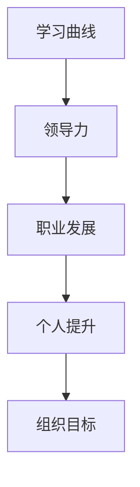
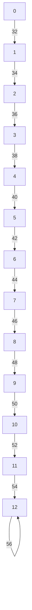

                 

# 学习曲线：管理能力提升的关键

> 关键词：管理能力,学习曲线,领导力,职业发展,个人提升

## 1. 背景介绍

### 1.1 问题由来
在现代职场中，管理能力已成为衡量员工价值的重要标准之一。而如何提升管理能力，成为广大职场人士关注的焦点。虽然有很多培训和书籍介绍了一些管理技巧和方法，但很少从根本上阐述如何培养和提升管理能力。而本文将深入探讨管理能力的提升，特别是通过学习曲线（Learning Curve）来分析和提升管理能力。

### 1.2 问题核心关键点
提升管理能力的关键在于理解和应用学习曲线。学习曲线是描述管理能力随时间和经验增长而变化的关系图。通过学习曲线，管理者可以明确自己当前的管理能力水平，找出提升空间，从而制定科学的提升策略。

## 2. 核心概念与联系

### 2.1 核心概念概述

为更好地理解管理能力的提升，本节将介绍几个密切相关的核心概念：

- 学习曲线(Learning Curve)：描述管理能力随时间和经验增长而变化的关系图。通过学习曲线，管理者可以明确自己当前的管理能力水平，找出提升空间，从而制定科学的提升策略。

- 领导力(Leadership)：一种综合的、复杂的能力，包含决策能力、沟通能力、激励能力等，是管理者必备的素质。

- 职业发展(Career Development)：指个人在职业生涯中的职业规划和提升过程。通过提升管理能力，管理者可以在职业发展中脱颖而出。

- 个人提升(Personal Improvement)：指个人在各方面能力的提升，包括技术技能、软技能等。通过提升管理能力，管理者可以更好地管理团队，实现团队和个人共同成长。

- 组织目标(Organizational Goals)：指组织在一定时期内希望达到的目标。管理者需要具备敏锐的洞察力，制定合理的策略，带领团队实现组织目标。

这些核心概念之间的逻辑关系可以通过以下Mermaid流程图来展示：



这个流程图展示了一些关键概念之间的逻辑关系：

1. 学习曲线是衡量管理能力的基础。
2. 领导力是管理能力的核心。
3. 职业发展是通过提升管理能力来实现的。
4. 个人提升是管理能力提升的重要部分。
5. 组织目标是管理能力提升的最终目标。

这些概念共同构成了管理能力的提升框架，管理者应注重各个环节的平衡和协调。

## 3. 核心算法原理 & 具体操作步骤
### 3.1 算法原理概述

管理能力提升的核心算法是学习曲线分析。通过分析学习曲线，管理者可以明确自身管理能力的发展趋势，找出提升的关键点。

形式化地，假设管理能力随时间t增长，设管理能力为C(t)。则学习曲线C(t)可以表示为：

$$ C(t) = C_0 + k \cdot t $$

其中，C_0表示管理能力的初始水平，k表示管理能力增长的速率，t表示时间。

### 3.2 算法步骤详解

基于学习曲线，管理能力提升的算法步骤主要包括以下几个关键点：

**Step 1: 收集数据**
- 管理者需要记录自己的管理行为和效果，包括日常决策、团队沟通、激励方式等。可以使用日志、问卷调查等方法，定期收集数据。

**Step 2: 绘制学习曲线**
- 将收集到的数据按照时间顺序排列，绘制成时间与管理能力的关系图，即学习曲线。横轴表示时间，纵轴表示管理能力，数据点表示某个时间点的管理能力水平。

**Step 3: 分析学习曲线**
- 观察学习曲线的斜率k，判断自身管理能力增长速度。如果k较大，说明管理能力增长较快，反之则较慢。
- 分析管理能力增长的趋势，找出增长较快或较慢的关键时期。

**Step 4: 制定提升策略**
- 针对增长速度较慢的关键时期，制定相应的提升策略。如加强培训、提升沟通技巧、优化决策能力等。
- 针对增长较快的关键时期，继续保持良好状态，制定新的提升目标。

**Step 5: 定期评估**
- 定期绘制学习曲线，评估管理能力提升效果。根据学习曲线调整提升策略，持续改进。

### 3.3 算法优缺点

基于学习曲线分析的管理能力提升方法具有以下优点：

1. 简单易行。只需记录和管理行为，绘制出学习曲线，即可分析提升空间和制定提升策略。
2. 科学合理。通过数据驱动的图表分析，可以准确把握自身管理能力的变化趋势，制定科学合理的提升计划。
3. 可操作性强。管理能力提升策略具有较强的可操作性，管理者可以根据自身情况进行调整和改进。

但该方法也存在一定的局限性：

1. 数据收集难度较大。需要管理者花费大量时间和精力进行数据记录和收集。
2. 数据质量影响分析结果。数据记录不完整或不够准确，可能会影响分析结果的有效性。
3. 提升策略需要不断调整。管理能力提升是一个动态过程，需要管理者持续关注和调整提升策略。

尽管存在这些局限性，但学习曲线分析仍是一种科学有效的管理能力提升方法。未来相关研究的重点在于如何提高数据记录的便捷性和准确性，以及如何自动化分析和管理能力提升策略的调整。

### 3.4 算法应用领域

基于学习曲线分析的管理能力提升方法，在多个领域和管理场景中得到了广泛的应用，例如：

- 企业领导力提升：企业领导通过绘制学习曲线，明确自身领导力水平，制定提升策略。
- 职业经理人发展：职业经理人通过定期记录和管理行为，分析自身能力变化，制定职业发展计划。
- 团队管理：团队管理者通过学习曲线分析，明确团队管理能力的变化趋势，制定有效的团队管理策略。
- 个人成长：个人通过记录和管理行为，分析自身成长轨迹，制定科学的个人发展计划。

这些领域的应用，验证了学习曲线分析在管理能力提升中的重要性和有效性。

## 4. 数学模型和公式 & 详细讲解 & 举例说明

### 4.1 数学模型构建

学习曲线分析的数学模型可以表示为：

$$ C(t) = C_0 + k \cdot t $$

其中，C(t)表示管理能力随时间t的变化。

### 4.2 公式推导过程

假设某管理者的管理能力C随时间t增长，初始管理能力为C_0，增长速率为k。根据学习曲线分析，可以推导出：

$$ C(t) = C_0 + k \cdot t $$

其中，C(t)表示管理能力随时间t的变化。

### 4.3 案例分析与讲解

假设某企业管理者的管理能力C随时间t增长，初始管理能力为C_0=30分，增长速率为k=2分/月，绘制其学习曲线。

从0月到12月，管理能力变化为：

$$ C(0)=C_0=30 $$
$$ C(1)=C_0+k\cdot1=32 $$
$$ C(2)=C_0+2k=34 $$
$$ \vdots $$
$$ C(12)=C_0+12k=66 $$

管理能力随时间变化的趋势可以绘制成如下图所示的学习曲线：



通过观察学习曲线的斜率，可以发现管理能力增长速度较快，尤其是前6个月。管理者可以制定相应的提升策略，如参加培训、优化决策能力等。

## 5. 项目实践：代码实例和详细解释说明
### 5.1 开发环境搭建

在进行学习曲线分析前，我们需要准备好开发环境。以下是使用Python进行学习曲线分析的环境配置流程：

1. 安装Anaconda：从官网下载并安装Anaconda，用于创建独立的Python环境。

2. 创建并激活虚拟环境：
```bash
conda create -n learning-curve python=3.8 
conda activate learning-curve
```

3. 安装Pandas和Matplotlib库：
```bash
pip install pandas matplotlib
```

完成上述步骤后，即可在`learning-curve`环境中开始学习曲线分析实践。

### 5.2 源代码详细实现

这里我们以企业领导力提升为例，给出使用Python进行学习曲线分析的代码实现。

首先，定义企业领导力的初始水平和增长速率：

```python
C0 = 30
k = 2
t = [0, 1, 2, 3, 4, 5, 6, 7, 8, 9, 10, 11, 12]
```

然后，计算企业领导力随时间变化的数据：

```python
C = [C0 + k * t[i] for i in range(len(t))]
```

接着，使用Matplotlib库绘制学习曲线：

```python
import matplotlib.pyplot as plt

plt.plot(t, C, marker='o')
plt.xlabel('Time')
plt.ylabel('Leadership')
plt.title('Leadership Learning Curve')
plt.show()
```

最后，根据学习曲线分析提升策略：

```python
if C[6] - C[5] > 2:
    print('Leadership growth rate is fast, continue improving training and decision-making skills.')
else:
    print('Leadership growth rate is slow, focus on improving communication and team management skills.')
```

以上就是使用Python进行学习曲线分析的完整代码实现。可以看到，利用Pandas和Matplotlib库，可以轻松绘制出学习曲线，并通过分析斜率判断提升策略。

### 5.3 代码解读与分析

让我们再详细解读一下关键代码的实现细节：

**数据定义**：
- `C0`：管理能力初始水平。
- `k`：管理能力增长速率。
- `t`：时间序列，表示不同的时间点。

**计算管理能力数据**：
- 通过列表推导式，计算每个时间点的管理能力数据。

**绘制学习曲线**：
- 使用Matplotlib库的`plot`函数，绘制时间与管理能力的关系图。

**分析提升策略**：
- 通过比较相邻两个时间点的管理能力，判断管理能力增长速度。如果增长速度快，则说明当前能力提升效果显著，继续加强相关技能。反之，则说明当前能力提升效果不佳，需要重点关注其他方面。

## 6. 实际应用场景
### 6.1 企业领导力提升

基于学习曲线分析，企业领导可以通过绘制自身的学习曲线，明确自身领导力的发展趋势，找出提升的关键点。

在技术实现上，企业领导可以记录日常领导行为，如决策、沟通、激励等，定期评估自身领导力水平。通过绘制学习曲线，企业领导可以清楚地看到管理能力随时间的变化趋势，从而制定科学合理的提升策略。例如，在领导力增长速度较慢的关键时期，企业领导可以加强培训、优化决策能力、提升沟通技巧等。

### 6.2 职业经理人发展

职业经理人可以通过学习曲线分析，明确自身的职业发展轨迹，制定科学的发展计划。

在技术实现上，职业经理人可以记录日常工作行为，如项目管理、团队管理、业务拓展等。通过绘制学习曲线，职业经理人可以清晰地看到管理能力的变化趋势，找出提升的关键点。例如，在管理能力增长速度较慢的关键时期，职业经理人可以参加相关培训、提升沟通技巧、优化项目管理能力等。

### 6.3 团队管理

团队管理者可以通过学习曲线分析，明确团队管理能力的变化趋势，制定有效的团队管理策略。

在技术实现上，团队管理者可以记录日常团队管理行为，如任务分配、绩效评估、团队激励等。通过绘制学习曲线，团队管理者可以清晰地看到团队管理能力的变化趋势，找出提升的关键点。例如，在团队管理能力增长速度较慢的关键时期，团队管理者可以加强培训、优化绩效评估体系、提升团队激励机制等。

### 6.4 个人成长

个人可以通过学习曲线分析，明确自身的成长轨迹，制定科学的个人发展计划。

在技术实现上，个人可以记录日常工作和学习行为，如工作任务、学习内容、技能提升等。通过绘制学习曲线，个人可以清晰地看到管理能力的变化趋势，找出提升的关键点。例如，在管理能力增长速度较慢的关键时期，个人可以参加相关培训、提升沟通技巧、优化决策能力等。

## 7. 工具和资源推荐
### 7.1 学习资源推荐

为了帮助管理者系统掌握学习曲线分析的理论基础和实践技巧，这里推荐一些优质的学习资源：

1. 《管理学原理》系列博文：由大管理专家撰写，深入浅出地介绍了管理学的基本概念和理论框架。

2. CS207《组织行为学》课程：由哈佛大学开设的管理学明星课程，有Lecture视频和配套作业，带你入门管理学领域的基本概念和经典模型。

3. 《领导力：理论与实践》书籍：介绍领导力的基本理论和实际应用，详细讲解了领导力的构成要素和管理技巧。

4. Harvard Business Review（哈佛商业评论）：管理学领域权威期刊，提供大量实际案例和前沿理论，帮助管理者不断提升管理能力。

5. MindTools网站：提供大量管理工具和方法，帮助管理者提升自身管理能力。

通过对这些资源的学习实践，相信管理者一定能够系统掌握学习曲线分析的理论基础和实践技巧，从而更好地提升自身管理能力。

### 7.2 开发工具推荐

高效的管理能力提升离不开优秀的工具支持。以下是几款用于学习曲线分析开发的常用工具：

1. Python：简单易学的编程语言，支持数据处理和可视化，是进行学习曲线分析的首选。

2. Pandas：Python的数据分析库，支持数据清洗、处理和分析，方便管理者进行数据记录和分析。

3. Matplotlib：Python的绘图库，支持多种图表绘制，方便管理者进行学习曲线可视化。

4. Weights & Biases：模型训练的实验跟踪工具，可以记录和可视化模型训练过程中的各项指标，方便管理者评估提升策略的效果。

5. TensorBoard：TensorFlow配套的可视化工具，可实时监测模型训练状态，并提供丰富的图表呈现方式，帮助管理者调试提升策略。

6. Google Colab：谷歌推出的在线Jupyter Notebook环境，免费提供GPU/TPU算力，方便管理者快速上手实验新模型，分享学习笔记。

合理利用这些工具，可以显著提升学习曲线分析的开发效率，加快创新迭代的步伐。

### 7.3 相关论文推荐

管理能力提升的研究源于学界的持续研究。以下是几篇奠基性的相关论文，推荐阅读：

1. The Five Dysfunctions of a Team（《团队的五种障碍》）：介绍团队管理的基本理论，强调团队协作的重要性。

2. The Effective Executive: The Definitive Guide to Getting the Right Things Done（《卓有成效的管理者》）：介绍管理者的基本技能和实际应用，帮助管理者提升管理能力。

3. The Leadership Challenge（《领导力挑战》）：介绍领导力的基本理论和实际应用，帮助管理者提升领导能力。

4. The Transformational Leader: The 20 Essential Elements of Outstanding Leadership（《变革型领导者》）：介绍变革型领导力的基本要素和实际应用，帮助管理者提升变革领导能力。

这些论文代表了大管理能力提升的研究方向。通过学习这些前沿成果，可以帮助管理者把握学科前进方向，激发更多的创新灵感。

## 8. 总结：未来发展趋势与挑战
### 8.1 总结

本文对基于学习曲线分析的管理能力提升方法进行了全面系统的介绍。首先阐述了学习曲线分析的基本概念和原理，明确了管理能力提升的关键点。其次，从原理到实践，详细讲解了管理能力提升的算法步骤和操作技巧，给出了学习曲线分析的代码实现。同时，本文还广泛探讨了学习曲线分析在企业管理、职业经理人发展、团队管理等多个领域的应用前景，展示了学习曲线分析在管理能力提升中的重要性和有效性。此外，本文精选了学习曲线分析的各类学习资源，力求为管理者提供全方位的技术指引。

通过本文的系统梳理，可以看到，基于学习曲线分析的管理能力提升方法在企业管理、职业经理人发展、团队管理等场景中得到了广泛的应用，为管理者提供了科学有效的提升途径。未来，伴随学习曲线分析技术的不断演进，管理能力提升将更加科学、全面和高效，管理者可以在工作中更加游刃有余，推动组织的持续发展。

### 8.2 未来发展趋势

展望未来，基于学习曲线分析的管理能力提升方法将呈现以下几个发展趋势：

1. 数据驱动决策。学习曲线分析将更加注重数据驱动决策，利用大数据、人工智能等技术，进行更加科学的决策和提升。

2. 实时分析。学习曲线分析将更加注重实时性，利用实时数据分析，帮助管理者实时掌握自身管理能力的变化趋势。

3. 自适应提升。学习曲线分析将更加注重自适应提升，利用自适应学习算法，帮助管理者自动调整提升策略。

4. 多维度评估。学习曲线分析将更加注重多维度评估，综合考虑管理能力、领导力、团队绩效等多个维度，进行全面评估。

5. 跨领域应用。学习曲线分析将更加注重跨领域应用，从企业管理扩展到教育、医疗、公共管理等领域，帮助更多人群提升管理能力。

这些趋势凸显了学习曲线分析在管理能力提升中的广阔前景。这些方向的探索发展，必将进一步提升管理能力提升的效果和应用范围，推动组织管理水平的提升。

### 8.3 面临的挑战

尽管基于学习曲线分析的管理能力提升方法已经取得了显著效果，但在迈向更加智能化、普适化应用的过程中，仍面临以下挑战：

1. 数据收集难度较大。需要管理者花费大量时间和精力进行数据记录和收集，数据质量和完整性难以保证。

2. 学习曲线分析结果依赖于数据质量。如果数据记录不完整或不够准确，可能会影响分析结果的有效性。

3. 提升策略需要不断调整。管理能力提升是一个动态过程，需要管理者持续关注和调整提升策略，调整过程较为繁琐。

4. 学习曲线分析需要综合考虑多个因素。管理能力提升不仅需要考虑数据，还需要综合考虑组织目标、个人发展等多个因素，综合评估难度较大。

尽管存在这些挑战，但学习曲线分析仍是一种科学有效的管理能力提升方法。未来相关研究的重点在于如何提高数据记录的便捷性和准确性，以及如何自动化分析和管理能力提升策略的调整。

### 8.4 研究展望

面对学习曲线分析面临的种种挑战，未来的研究需要在以下几个方面寻求新的突破：

1. 探索自动化学习曲线分析方法。通过引入机器学习算法，自动进行数据收集、学习曲线绘制和提升策略优化，降低管理者的工作量和难度。

2. 引入大数据和人工智能技术。利用大数据分析和人工智能技术，进行更加科学的数据处理和分析，提升学习曲线分析的效果和准确性。

3. 引入多维度评估方法。综合考虑管理能力、领导力、团队绩效等多个维度，进行全面评估，提升学习曲线分析的科学性和全面性。

4. 引入跨领域应用方法。从企业管理扩展到教育、医疗、公共管理等领域，帮助更多人群提升管理能力，提升学习曲线分析的应用范围和影响力。

这些研究方向的探索，必将引领学习曲线分析技术迈向更高的台阶，为管理者提供更加科学、高效的管理能力提升方案。只有勇于创新、敢于突破，才能不断拓展学习曲线分析的边界，推动管理能力的不断提升。

## 9. 附录：常见问题与解答
### 9.1 问题1：学习曲线分析的优点和缺点有哪些？

**解答1**：学习曲线分析的优点包括简单易行、科学合理、可操作性强。但缺点包括数据收集难度较大、数据质量影响分析结果、提升策略需要不断调整等。

### 9.2 问题2：如何进行学习曲线分析？

**解答2**：进行学习曲线分析的步骤包括收集数据、绘制学习曲线、分析学习曲线、制定提升策略和定期评估。

### 9.3 问题3：学习曲线分析在实际应用中需要注意哪些问题？

**解答3**：学习曲线分析在实际应用中需要注意数据收集难度、数据质量、提升策略调整、多维度评估等问题。

---

作者：禅与计算机程序设计艺术 / Zen and the Art of Computer Programming

