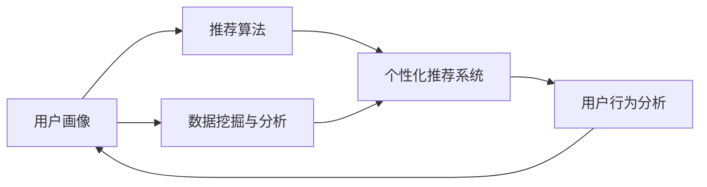

                 

# 定制化体验：为用户量身打造

> 关键词：
> - 个性化推荐系统
> - 用户画像
> - 数据挖掘与分析
> - 推荐算法
> - 用户行为分析

## 1. 背景介绍

随着互联网和移动互联网的普及，大数据技术的高速发展，用户个性化需求日益凸显。如何通过数据挖掘与分析，深入理解用户需求，实现精准推荐，提升用户体验，成为互联网公司关注的焦点。定制化体验，为用户提供量身打造的服务，成为新一轮技术革新的重要目标。

个性化推荐系统(Personalized Recommendation System, PRS)，是实现定制化体验的核心工具。它通过分析用户的浏览、购买、搜索等行为数据，构建用户画像，并利用推荐算法对用户进行推荐，从而实现“千人千面”的个性化服务。

本文将详细介绍个性化推荐系统的核心概念、算法原理、开发实践和未来展望，为读者提供系统全面的技术指引。

## 2. 核心概念与联系

### 2.1 核心概念概述

为了更好地理解个性化推荐系统，本节将介绍几个密切相关的核心概念：

- **个性化推荐系统(PRS)**：根据用户的历史行为、兴趣偏好等数据，为其推荐个性化的产品或服务。PRS广泛应用于电商、新闻、视频、音乐等多个领域，显著提升用户满意度和业务收入。

- **用户画像(User Profile)**：通过分析用户的历史行为数据，构建其兴趣、偏好、需求等方面的全面画像，为推荐系统提供目标用户特征。

- **数据挖掘与分析(Data Mining and Analysis)**：从海量数据中提取有用信息，发现用户行为规律和模式，为推荐系统提供数据支持。

- **推荐算法(Recommendation Algorithm)**：根据用户画像和数据特征，计算物品与用户的相关性，生成推荐列表。常见算法包括协同过滤、基于内容的推荐、混合推荐等。

- **用户行为分析(User Behavior Analysis)**：分析用户的行为数据，预测其未来行为和需求，优化推荐策略。

这些核心概念共同构成了个性化推荐系统的技术框架，使得我们能够深入理解用户需求，提供量身打造的服务。

### 2.2 核心概念原理和架构的 Mermaid 流程图

以下是一个简单的Mermaid流程图，展示核心概念间的联系：



该流程图展示了个性化推荐系统的核心概念及其之间的联系：

1. 用户画像由用户的特征数据构成。
2. 数据挖掘与分析通过对用户行为数据进行深度挖掘，构建出用户画像。
3. 推荐算法根据用户画像计算物品的相关性，生成推荐列表。
4. 个性化推荐系统基于推荐结果，为用户展示个性化推荐。
5. 用户行为分析对推荐效果进行实时监测，不断优化推荐策略。

## 3. 核心算法原理 & 具体操作步骤

### 3.1 算法原理概述

个性化推荐系统的核心在于通过用户画像和物品特征，计算物品与用户的相关性，生成推荐列表。主要分为以下两个步骤：

- **用户画像构建**：从用户的历史行为数据中提取特征，构建用户画像。
- **推荐列表生成**：利用推荐算法计算物品与用户的相关性，生成推荐列表。

### 3.2 算法步骤详解

#### 3.2.1 用户画像构建

用户画像构建是推荐系统的关键环节，主要由以下步骤组成：

1. **特征提取**：从用户的行为数据中提取有用的特征。
   - **点击**：记录用户对每个物品的点击次数。
   - **浏览**：记录用户对每个物品的浏览时长。
   - **购买**：记录用户对每个物品的购买次数和金额。
   - **评分**：记录用户对每个物品的评分。

2. **特征编码**：将提取的特征进行编码处理，形成向量表示。
   - **数值型特征**：如点击次数、浏览时长等，进行归一化处理。
   - **离散型特征**：如购买次数、评分等，进行独热编码。
   - **混合型特征**：如浏览时长和评分的组合，通过权重求和或组合特征表示。

3. **用户特征选择**：从所有特征中选择最具有代表性和区分度的特征，构成用户画像。
   - **特征选择算法**：如基于信息增益、卡方检验等，从所有特征中筛选出最相关的特征。
   - **特征降维**：如主成分分析(PCA)、奇异值分解(SVD)等，减少特征维度，避免维度灾难。

#### 3.2.2 推荐列表生成

推荐列表生成是推荐系统的核心算法环节，主要由以下步骤组成：

1. **物品特征提取**：从物品的属性中提取特征。
   - **数值型特征**：如价格、评分等。
   - **离散型特征**：如分类标签、品牌等。
   - **混合型特征**：如价格和分类标签的组合。

2. **用户-物品相似度计算**：计算用户和物品之间的相似度，用于衡量用户对物品的兴趣程度。
   - **协同过滤**：通过用户-物品共现矩阵，计算用户与物品的相似度。
   - **基于内容的推荐**：通过物品特征和用户特征的相似度，生成推荐列表。
   - **混合推荐**：结合多种推荐算法，生成推荐列表。

3. **推荐结果排序**：对推荐列表进行排序，提高推荐效果。
   - **评分预测**：利用机器学习模型，预测用户对物品的评分。
   - **排序算法**：如基于排序的协同过滤、基于偏好的排序等。

### 3.3 算法优缺点

个性化推荐系统具有以下优点：

1. **提升用户体验**：根据用户需求，提供量身定制的服务，提升用户满意度和粘性。
2. **增加业务收入**：通过精准推荐，提高转化率和成交率，增加收入。
3. **优化广告投放**：通过个性化推荐，精准定位用户，优化广告投放效果。

但同时，该系统也存在一些缺点：

1. **数据质量要求高**：用户行为数据的质量直接影响推荐效果，需要确保数据的准确性和完整性。
2. **算法复杂度高**：个性化推荐算法需要高强度的计算和存储资源，对算力要求较高。
3. **用户隐私问题**：用户画像和推荐过程涉及大量个人信息，可能引发隐私保护问题。
4. **冷启动问题**：新用户或新物品缺乏足够数据，推荐效果较差。

### 3.4 算法应用领域

个性化推荐系统已经被广泛应用于电商、新闻、视频、音乐等多个领域，具体应用场景包括：

- **电商推荐**：根据用户的浏览、购买历史，推荐相关商品。
- **新闻推荐**：根据用户的阅读习惯，推荐相关新闻文章。
- **视频推荐**：根据用户的观看历史，推荐相关视频内容。
- **音乐推荐**：根据用户的听歌历史，推荐相关音乐和歌手。
- **社交网络**：根据用户的关系和兴趣，推荐相关朋友和内容。

## 4. 数学模型和公式 & 详细讲解 & 举例说明

### 4.1 数学模型构建

个性化推荐系统的核心是用户画像和物品特征的相似度计算。本文将以协同过滤算法为例，介绍其数学模型构建。

协同过滤算法基于用户-物品共现矩阵，计算用户和物品的相似度，生成推荐列表。假设用户集为 $U=\{1,2,\dots,n\}$，物品集为 $V=\{1,2,\dots,m\}$，用户对物品的评分矩阵为 $R \in \mathbb{R}^{n \times m}$，用户 $i$ 对物品 $j$ 的评分为 $R_{ij}$。协同过滤的目标是预测用户 $i$ 对物品 $j$ 的评分，从而生成推荐列表。

### 4.2 公式推导过程

协同过滤算法主要分为基于用户的协同过滤和基于物品的协同过滤两种。这里重点介绍基于用户的协同过滤。

1. **相似度计算**：
   - 用户之间的相似度计算：利用余弦相似度计算用户之间的相似度。
   $$
   similarity(i,k)=\frac{\sum_{j=1}^{m}R_{ij}R_{kj}}{\sqrt{\sum_{j=1}^{m}R_{ij}^2}\sqrt{\sum_{j=1}^{m}R_{kj}^2}}
   $$
   - 物品之间的相似度计算：利用余弦相似度计算物品之间的相似度。
   $$
   similarity(j,k)=\frac{\sum_{i=1}^{n}R_{ij}R_{ik}}{\sqrt{\sum_{i=1}^{n}R_{ij}^2}\sqrt{\sum_{i=1}^{n}R_{ik}^2}}
   $$

2. **评分预测**：
   - 基于用户-物品共现矩阵 $R$，计算用户 $i$ 对物品 $j$ 的预测评分 $\hat{R}_{ij}$。
   $$
   \hat{R}_{ij}=\frac{1}{\sum_{k \neq i} \frac{R_{ik}R_{kj}}{\sqrt{R_{ik}^2 + \epsilon}}}
   $$
   - 其中 $\epsilon$ 为正则化系数，避免分母为零。

3. **推荐结果排序**：
   - 根据预测评分 $\hat{R}_{ij}$，对物品 $j$ 进行排序，生成推荐列表。
   $$
   R_{(i)}=sort(\hat{R}_{ij})
   $$

### 4.3 案例分析与讲解

以亚马逊电商推荐系统为例，分析协同过滤算法的实际应用。

假设一个用户在过去一个月内，浏览了3000种商品，购买了500种商品，并给出了500次评分。对于新上架的一种商品，用户没有直接购买或评分。亚马逊推荐系统可以使用协同过滤算法，预测用户对新商品的评分，从而进行推荐。

首先，通过用户的历史行为数据，构建用户画像和物品特征。然后，计算用户与物品之间的相似度，生成推荐列表。最后，根据预测评分对推荐列表进行排序，推荐给用户。

## 5. 项目实践：代码实例和详细解释说明

### 5.1 开发环境搭建

在进行个性化推荐系统开发前，我们需要准备好开发环境。以下是使用Python进行推荐系统开发的常见环境配置流程：

1. 安装Python：从官网下载并安装Python，确保版本在3.6以上。

2. 安装推荐系统相关的库：
   - `numpy`：用于科学计算。
   - `pandas`：用于数据处理和分析。
   - `scikit-learn`：用于机器学习模型构建。
   - `scipy`：用于科学计算和优化。
   - `joblib`：用于并行计算。

3. 安装可视化工具：
   - `matplotlib`：用于绘制图表。
   - `seaborn`：用于绘制统计图表。

4. 安装推荐系统库：
   - `surprise`：用于构建和评估推荐系统。

5. 安装数据库库：
   - `sqlite3`：用于本地数据库存储。

完成上述步骤后，即可在Python环境中开始推荐系统开发。

### 5.2 源代码详细实现

下面以协同过滤算法为例，展示推荐系统的源代码实现。

```python
import numpy as np
import pandas as pd
from surprise import Dataset, Reader, SVD, accuracy
from surprise.model_selection import train_test_split
from surprise.prediction_algorithms.matrix_based import SVD

# 读取数据
reader = Reader(rating_scale=(1, 5))
data = Dataset.load_from_df(train_df, reader)

# 划分训练集和测试集
trainset, testset = train_test_split(data, test_size=0.2)

# 模型训练
svd = SVD()
svd.fit(trainset)

# 模型评估
preds = svd.test(testset)
rmse = np.sqrt(mean_squared_error(preds, actual))
print(f"RMSE: {rmse:.2f}")
```

### 5.3 代码解读与分析

让我们再详细解读一下关键代码的实现细节：

- **数据读取**：使用Pandas库读取用户行为数据，构建surprise库需要的数据格式。
- **模型训练**：使用surprise库的SVD算法进行协同过滤模型的训练。
- **模型评估**：使用RMSE指标评估模型效果，RMSE越小，模型效果越好。

## 6. 实际应用场景

个性化推荐系统已经在电商、新闻、视频、音乐等多个领域得到了广泛应用，具体应用场景包括：

### 6.1 电商推荐

电商推荐系统根据用户的浏览、购买历史，推荐相关商品。通过对用户画像和物品特征的计算，生成推荐列表。亚马逊、淘宝、京东等电商巨头都在使用个性化推荐系统，显著提升用户满意度和购物体验。

### 6.2 新闻推荐

新闻推荐系统根据用户的阅读习惯，推荐相关新闻文章。通过对用户画像和文章特征的计算，生成推荐列表。今日头条、澎湃新闻等新闻平台都在使用个性化推荐系统，提升用户阅读体验和粘性。

### 6.3 视频推荐

视频推荐系统根据用户的观看历史，推荐相关视频内容。通过对用户画像和视频特征的计算，生成推荐列表。Netflix、YouTube等视频平台都在使用个性化推荐系统，增加用户观看时长和满意度。

### 6.4 音乐推荐

音乐推荐系统根据用户的听歌历史，推荐相关音乐和歌手。通过对用户画像和音乐特征的计算，生成推荐列表。Spotify、网易云音乐等音乐平台都在使用个性化推荐系统，提升用户音乐体验和粘性。

## 7. 工具和资源推荐

### 7.1 学习资源推荐

为了帮助开发者系统掌握个性化推荐系统的理论基础和实践技巧，这里推荐一些优质的学习资源：

1. 《推荐系统》系列书籍：如《推荐系统基础》、《推荐系统实践》等，全面介绍了推荐系统的理论和算法。
2. 《Python机器学习》：由机器学习专家Sebastian Raschka所著，介绍了Python中的机器学习库和算法。
3. 《深度学习入门：基于TensorFlow》：由Google深度学习专家所写，介绍了TensorFlow中的推荐系统应用。
4. Coursera《推荐系统》课程：由斯坦福大学教授所讲，介绍了推荐系统的基本概念和算法。
5. Kaggle推荐系统竞赛：参与实际竞赛项目，积累推荐系统实践经验。

通过对这些资源的学习实践，相信你一定能够快速掌握个性化推荐系统的精髓，并用于解决实际的推荐问题。

### 7.2 开发工具推荐

高效的开发离不开优秀的工具支持。以下是几款用于推荐系统开发的常用工具：

1. Python：用于机器学习和数据分析，简洁易用。
2. NumPy：用于科学计算和数组操作。
3. Pandas：用于数据处理和分析。
4. scikit-learn：用于机器学习模型的构建和评估。
5. matplotlib：用于绘制图表。
6. seaborn：用于绘制统计图表。
7. joblib：用于并行计算。
8. Scala：用于大规模机器学习任务的分布式处理。

合理利用这些工具，可以显著提升推荐系统的开发效率，加快创新迭代的步伐。

### 7.3 相关论文推荐

个性化推荐系统的研究始于20世纪90年代，学界在该领域取得了许多重要成果。以下是几篇奠基性的相关论文，推荐阅读：

1. "The Bellkhop-Karmarkar Algorithm for Imbalanced Data"（KDD'97）：介绍了基于协同过滤的推荐算法。
2. "Trustworthy PageRank: A Probabilistic Analysis of Trust and Relevance"（SIGIR'99）：介绍了PageRank算法，为推荐系统提供了新的思路。
3. "A collaborative filtering approach for implicit feedback datasets"（SIGKDD'01）：提出了协同过滤算法的改进，如基于矩阵分解的推荐算法。
4. "Nearest Neighbor Algorithms"（Machine Learning'96）：介绍了基于相似度的推荐算法。
5. "Netflix Prize"（KDD'09）：介绍了Netflix推荐系统竞赛的详细信息，展示了推荐系统在实际应用中的巨大潜力。

这些论文代表了个性化推荐系统的研究脉络。通过学习这些前沿成果，可以帮助研究者把握学科前进方向，激发更多的创新灵感。

## 8. 总结：未来发展趋势与挑战

### 8.1 总结

本文对个性化推荐系统的核心概念、算法原理、开发实践和未来展望进行了全面系统的介绍。首先详细介绍了个性化推荐系统的原理和架构，包括用户画像构建、推荐列表生成等关键环节。其次，通过代码实例和案例分析，展示了推荐系统的开发和应用实践。最后，展望了推荐系统的未来发展趋势和面临的挑战。

通过本文的系统梳理，可以看到，个性化推荐系统正在成为推荐技术的重要范式，极大地提升了用户体验和业务价值。未来，伴随推荐算法的不断演进，推荐系统必将在更多领域得到广泛应用，为经济社会发展注入新的动力。

### 8.2 未来发展趋势

展望未来，个性化推荐系统将呈现以下几个发展趋势：

1. **深度学习的应用**：深度学习技术的发展，将进一步提升推荐系统的精度和效果。通过深度神经网络，可以更好地捕捉用户和物品的复杂特征。
2. **多模态数据的融合**：推荐系统将越来越多地利用多模态数据，如图像、语音、视频等，提高推荐效果。
3. **联邦学习和隐私保护**：在数据分散且隐私保护要求高的场景下，联邦学习将发挥重要作用。通过分布式训练，保护用户隐私，提升推荐效果。
4. **实时推荐和动态更新**：推荐系统将更加注重实时性，根据用户实时行为动态调整推荐策略。
5. **跨领域推荐**：推荐系统将打破领域限制，实现跨领域推荐，提升推荐效果和用户体验。

### 8.3 面临的挑战

尽管个性化推荐系统已经取得了显著成果，但在迈向更加智能化、普适化应用的过程中，仍面临诸多挑战：

1. **数据质量问题**：用户行为数据的质量直接影响推荐效果，需要确保数据的准确性和完整性。
2. **推荐算法复杂度**：推荐算法需要高强度的计算和存储资源，对算力要求较高。
3. **用户隐私保护**：用户画像和推荐过程涉及大量个人信息，可能引发隐私保护问题。
4. **冷启动问题**：新用户或新物品缺乏足够数据，推荐效果较差。
5. **推荐结果的公平性**：推荐系统可能出现推荐偏差，需要解决公平性和多样性问题。

### 8.4 研究展望

面对推荐系统面临的种种挑战，未来的研究需要在以下几个方面寻求新的突破：

1. **数据清洗与预处理**：提高数据质量，确保数据准确性和完整性。
2. **算法优化与高效实现**：优化推荐算法，提升算法的效率和效果。
3. **隐私保护与数据安全**：引入隐私保护技术，确保用户数据安全。
4. **跨领域推荐与多模态融合**：实现跨领域推荐和多模态数据的融合，提高推荐效果。
5. **公平性、多样性与个性化**：解决公平性、多样性问题，提升个性化推荐质量。

这些研究方向的探索，必将引领推荐系统技术迈向更高的台阶，为构建智能、高效、安全的推荐系统提供更多可能性。面向未来，个性化推荐系统还需要与其他人工智能技术进行更深入的融合，如知识表示、因果推理、强化学习等，多路径协同发力，共同推动推荐系统技术的发展。

## 9. 附录：常见问题与解答

**Q1：如何构建用户画像？**

A: 构建用户画像的过程包括特征提取、特征编码和特征选择等步骤。

1. **特征提取**：从用户的行为数据中提取有用的特征，如点击次数、浏览时长、购买次数等。
2. **特征编码**：将提取的特征进行编码处理，形成向量表示。
3. **特征选择**：从所有特征中选择最具有代表性和区分度的特征，构成用户画像。

**Q2：如何评估推荐系统的效果？**

A: 推荐系统的评估指标主要有以下几种：

1. **均方根误差(RMSE)**：衡量预测值和实际值之间的差距。RMSE越小，推荐系统效果越好。
2. **平均绝对误差(MAE)**：衡量预测值和实际值之间的差距。MAE越小，推荐系统效果越好。
3. **准确率(accuracy)**：衡量推荐列表中正确物品的比例。准确率越高，推荐系统效果越好。
4. **召回率(recall)**：衡量推荐列表中相关物品的比例。召回率越高，推荐系统效果越好。
5. **F1分数(F1 score)**：综合考虑准确率和召回率，用于衡量推荐系统效果。

**Q3：推荐系统中如何处理冷启动问题？**

A: 推荐系统中的冷启动问题指的是新用户或新物品缺乏足够数据，导致推荐效果较差。

1. **内容推荐**：基于物品特征进行推荐，不需要用户数据。适用于新用户或新物品。
2. **协同过滤**：基于用户行为数据进行推荐，适用于新物品。
3. **混合推荐**：结合多种推荐算法，综合考虑用户和物品的特征，提高推荐效果。

**Q4：推荐系统如何处理数据不平衡问题？**

A: 推荐系统中的数据不平衡问题指的是用户对物品的评分分布不均，导致推荐系统对热门物品的推荐效果较好，但对冷门物品的推荐效果较差。

1. **加权算法**：对不同评分的物品进行加权，提高冷门物品的推荐效果。
2. **基于秩的推荐**：将评分转化为秩，再计算相似度，提高冷门物品的推荐效果。
3. **矩阵分解**：对评分矩阵进行矩阵分解，提高冷门物品的推荐效果。

这些问题的答案，能为开发者提供具体的技术指导，帮助其更好地构建和优化推荐系统。

---

作者：禅与计算机程序设计艺术 / Zen and the Art of Computer Programming

