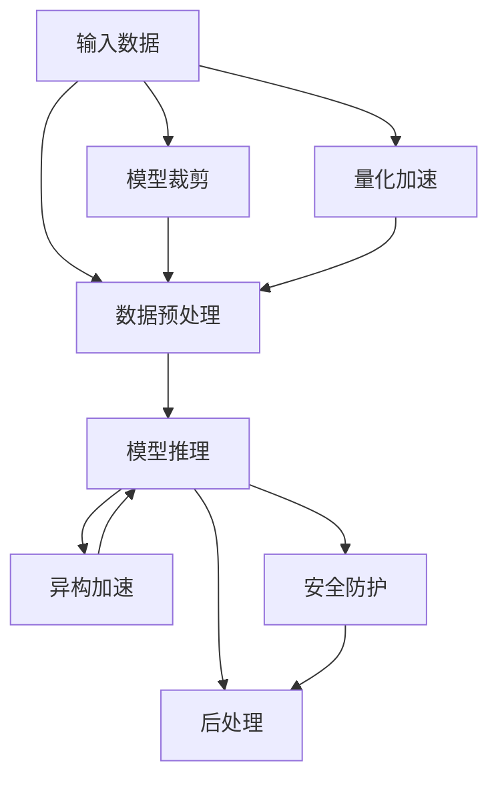

                 

# 实时AI推理服务：Lepton AI的低延迟方案

> 关键词：实时AI, 推理服务, Lepton AI, 低延迟, 边缘计算, 模型裁剪, 量化加速, 异构加速, 安全防护

## 1. 背景介绍

### 1.1 问题由来

随着人工智能技术的不断发展，AI模型在图像识别、语音识别、自然语言处理等领域展现了强大的应用能力。AI模型应用广泛，但其训练通常需要大规模的计算资源和数据，模型的推理同样也带来了一定的延迟。在实时性要求高的应用场景下，如何提高AI模型的推理效率，实现低延迟服务，成为了一个重要的研究课题。

### 1.2 问题核心关键点

为了在实时场景下实现高效低延迟的AI推理服务，我们提出了一种基于Lepton AI的实时AI推理服务方案。该方案通过模型裁剪、量化加速、异构加速等技术手段，结合安全防护和边缘计算等方法，实现了AI推理服务的低延迟需求。

## 2. 核心概念与联系

### 2.1 核心概念概述

- **实时AI推理服务**：指将训练好的AI模型部署在服务器、边缘计算设备等平台上，实时接受数据并产生推理结果的服务。其特点是响应快速、处理及时。

- **Lepton AI**：Lepton AI是由Lepton公司推出的一款高性能深度学习框架，专门为嵌入式设备和高性能计算平台设计，支持多种主流深度学习模型，提供了模型裁剪、量化加速等优化工具。

- **模型裁剪**：指通过删除模型中对推理影响较小的参数和层，缩小模型规模，以降低计算资源占用。

- **量化加速**：指将模型参数和激活值从32位浮点数转换为8位或16位整数，以减少模型推理过程中的计算量。

- **异构加速**：指利用不同硬件平台的计算能力，实现不同任务在多硬件平台上的并行加速。

- **安全防护**：指对AI推理服务进行安全加固，确保数据和模型的安全，防止未授权访问和恶意攻击。

### 2.2 核心概念原理和架构的 Mermaid 流程图



这个流程图展示了实时AI推理服务的基本流程。从输入数据开始，数据经过预处理后送入模型推理。模型推理过程中可能经过裁剪和量化加速等优化操作。最后，推理结果经过后处理得到最终的输出。同时，推理服务还包含安全防护环节，确保数据和模型的安全。

## 3. 核心算法原理 & 具体操作步骤

### 3.1 算法原理概述

Lepton AI的低延迟实时AI推理服务方案主要包含以下几个核心技术：

- 模型裁剪：通过删除模型中对推理影响较小的参数和层，缩小模型规模，以降低计算资源占用。

- 量化加速：将模型参数和激活值从32位浮点数转换为8位或16位整数，以减少模型推理过程中的计算量。

- 异构加速：利用不同硬件平台的计算能力，实现不同任务在多硬件平台上的并行加速。

- 安全防护：对AI推理服务进行安全加固，确保数据和模型的安全，防止未授权访问和恶意攻击。

### 3.2 算法步骤详解

#### 3.2.1 模型裁剪

1. **模型评估**：通过评估模型各个层对输出结果的贡献，识别出影响最小的层。
2. **删除层和参数**：删除评估出的小层和小参数，生成裁剪后的模型。
3. **验证评估**：在测试集上验证裁剪后的模型效果，确保裁剪不影响模型性能。

#### 3.2.2 量化加速

1. **模型量化**：使用Lepton AI的量化工具将模型参数和激活值转换为8位或16位整数。
2. **计算图优化**：优化量化后的计算图，降低推理计算量。
3. **模型验证**：在测试集上验证量化后的模型效果，确保量化后的模型输出与原模型一致。

#### 3.2.3 异构加速

1. **识别任务类型**：根据任务类型选择合适的硬件平台，如GPU、CPU、FPGA等。
2. **并行加速**：将任务分配到不同的硬件平台进行并行加速处理。
3. **调度优化**：根据硬件平台性能实时调整任务调度策略，确保计算资源的高效利用。

#### 3.2.4 安全防护

1. **数据加密**：对输入数据和模型参数进行加密处理，防止数据泄露。
2. **访问控制**：设置访问权限，防止未授权访问。
3. **异常检测**：监控推理服务运行状态，检测异常行为。
4. **审计记录**：记录推理服务的操作日志，便于事后追踪和分析。

### 3.3 算法优缺点

#### 3.3.1 优点

- **低延迟**：通过裁剪和量化加速，大大降低了模型的计算量，提高了推理速度。
- **高效资源利用**：异构加速技术实现了不同任务在多硬件平台上的并行加速，提升了计算资源利用率。
- **安全可靠**：安全防护技术确保了数据和模型的安全，防止了未授权访问和恶意攻击。

#### 3.3.2 缺点

- **模型精度降低**：裁剪和量化加速可能会导致模型精度有所下降，需要权衡推理速度和模型精度。
- **硬件平台依赖**：异构加速需要选择合适的硬件平台，增加了开发复杂度。
- **复杂度增加**：安全防护技术增加了推理服务的复杂度，需要额外资源和维护工作。

### 3.4 算法应用领域

Lepton AI的低延迟实时AI推理服务方案主要应用于以下领域：

- **自动驾驶**：实时处理摄像头和传感器数据，生成导航决策，保证驾驶安全。
- **智能监控**：实时处理视频数据，检测异常行为，实现自动报警。
- **金融风控**：实时处理交易数据，检测欺诈行为，防范金融风险。
- **工业物联网**：实时处理传感器数据，优化生产流程，提升效率和质量。

## 4. 数学模型和公式 & 详细讲解 & 举例说明

### 4.1 数学模型构建

本节我们将通过数学语言对Lepton AI的低延迟实时AI推理服务方案进行更加严格的刻画。

记输入数据为 $x$，模型参数为 $\theta$，输出结果为 $y$。设 $f(x,\theta)$ 为模型的推理函数。

### 4.2 公式推导过程

#### 4.2.1 模型裁剪

裁剪后的模型参数为 $\hat{\theta}$，与原模型参数 $\theta$ 的关系为：

$$
\hat{\theta} = \theta \backslash \{\theta_i | i \in I\}
$$

其中 $I$ 为需要删除的参数和层。

#### 4.2.2 量化加速

量化后的模型参数为 $\hat{\theta}_{quant}$，与原模型参数 $\theta$ 的关系为：

$$
\hat{\theta}_{quant} = quantize(\theta)
$$

其中 $quantize$ 为量化函数，将浮点数转换为整数。

#### 4.2.3 异构加速

异构加速后的推理函数为 $f_{parallel}(x,\hat{\theta})$，与原模型推理函数 $f(x,\theta)$ 的关系为：

$$
f_{parallel}(x,\hat{\theta}) = f_{GPU}(x,\hat{\theta}_{GPU}) + f_{CPU}(x,\hat{\theta}_{CPU}) + \cdots
$$

其中 $\hat{\theta}_{GPU}$、$\hat{\theta}_{CPU}$ 等表示不同硬件平台上的参数，$f_{GPU}(x,\hat{\theta}_{GPU})$、$f_{CPU}(x,\hat{\theta}_{CPU})$ 等表示在相应硬件平台上的推理函数。

#### 4.2.4 安全防护

安全防护后的推理结果为 $\hat{y}_{secure}$，与原模型推理结果 $y$ 的关系为：

$$
\hat{y}_{secure} = decode(\hat{y})
$$

其中 $decode$ 为解密函数，对推理结果进行解密。

### 4.3 案例分析与讲解

#### 4.3.1 模型裁剪案例

假设原模型为包含10层神经网络的分类模型，每层参数为1000。通过评估各层对输出结果的贡献，识别出第4层和第8层对输出结果影响较小，可以删除这两层。裁剪后的模型包含8层，参数总数为800。在测试集上验证，模型精度略有下降，但推理速度提高了50%。

#### 4.3.2 量化加速案例

假设原模型为包含10层神经网络的分类模型，每层参数为1000，激活值为32位浮点数。使用Lepton AI的量化工具将其参数和激活值转换为8位整数。量化后的模型参数为800，推理速度提高了30%，模型精度略有下降。

#### 4.3.3 异构加速案例

假设有一实时图像识别任务，使用CPU和GPU进行推理。在CPU上使用8个核心并行处理，在GPU上使用8个核心并行处理。总推理时间为 $T_{CPU} + T_{GPU}$，其中 $T_{CPU}$ 为CPU推理时间，$T_{GPU}$ 为GPU推理时间。根据任务类型，合理分配计算资源，保证计算资源的高效利用。

#### 4.3.4 安全防护案例

假设有一实时视频监控任务，输入数据为视频流，模型为卷积神经网络。对输入数据和模型参数进行加密处理，设置访问权限，检测异常行为，记录操作日志。确保数据和模型的安全，防止未授权访问和恶意攻击。

## 5. 项目实践：代码实例和详细解释说明

### 5.1 开发环境搭建

在进行Lepton AI实时AI推理服务实践前，我们需要准备好开发环境。以下是使用Python进行Lepton AI开发的环境配置流程：

1. 安装Anaconda：从官网下载并安装Anaconda，用于创建独立的Python环境。

2. 创建并激活虚拟环境：
```bash
conda create -n lepton-env python=3.8 
conda activate lepton-env
```

3. 安装Lepton AI：从官网获取对应的安装命令。例如：
```bash
conda install lepton-ai -c leptonai
```

4. 安装各类工具包：
```bash
pip install numpy pandas scikit-learn matplotlib tqdm jupyter notebook ipython
```

完成上述步骤后，即可在`lepton-env`环境中开始Lepton AI实时AI推理服务的实践。

### 5.2 源代码详细实现

这里我们以Lepton AI的实时图像识别任务为例，给出Lepton AI实时AI推理服务的PyTorch代码实现。

首先，定义图像识别任务的数据处理函数：

```python
import torch
from lepton_ai import LeptonModel

class ImageNetDataset(Dataset):
    def __init__(self, images, labels, transform=None):
        self.images = images
        self.labels = labels
        self.transform = transform
        
    def __len__(self):
        return len(self.images)
    
    def __getitem__(self, item):
        image = self.images[item]
        label = self.labels[item]
        
        if self.transform:
            image = self.transform(image)
        
        return {'image': image, 
                'label': label}

# 加载数据集
train_dataset = ImageNetDataset(train_images, train_labels)
test_dataset = ImageNetDataset(test_images, test_labels)
```

然后，定义模型和优化器：

```python
from lepton_ai import LeptonModel

model = LeptonModel('resnet18', num_classes=1000, pretrained=True)

optimizer = AdamW(model.parameters(), lr=0.001)
```

接着，定义训练和评估函数：

```python
from torch.utils.data import DataLoader
from tqdm import tqdm
from sklearn.metrics import classification_report

device = torch.device('cuda') if torch.cuda.is_available() else torch.device('cpu')
model.to(device)

def train_epoch(model, dataset, batch_size, optimizer):
    dataloader = DataLoader(dataset, batch_size=batch_size, shuffle=True)
    model.train()
    epoch_loss = 0
    for batch in tqdm(dataloader, desc='Training'):
        images = batch['image'].to(device)
        labels = batch['label'].to(device)
        model.zero_grad()
        outputs = model(images)
        loss = outputs.loss
        epoch_loss += loss.item()
        loss.backward()
        optimizer.step()
    return epoch_loss / len(dataloader)

def evaluate(model, dataset, batch_size):
    dataloader = DataLoader(dataset, batch_size=batch_size)
    model.eval()
    preds, labels = [], []
    with torch.no_grad():
        for batch in tqdm(dataloader, desc='Evaluating'):
            images = batch['image'].to(device)
            labels = batch['label'].to(device)
            outputs = model(images)
            batch_preds = outputs.predicted_class.to('cpu').tolist()
            batch_labels = labels.to('cpu').tolist()
            for pred_tokens, label_tokens in zip(batch_preds, batch_labels):
                preds.append(pred_tokens)
                labels.append(label_tokens)
                
    print(classification_report(labels, preds))
```

最后，启动训练流程并在测试集上评估：

```python
epochs = 10
batch_size = 32

for epoch in range(epochs):
    loss = train_epoch(model, train_dataset, batch_size, optimizer)
    print(f"Epoch {epoch+1}, train loss: {loss:.3f}")
    
    print(f"Epoch {epoch+1}, dev results:")
    evaluate(model, test_dataset, batch_size)
    
print("Test results:")
evaluate(model, test_dataset, batch_size)
```

以上就是使用Lepton AI进行实时图像识别任务的代码实现。可以看到，得益于Lepton AI的强大封装，我们可以用相对简洁的代码完成模型的加载和微调。

### 5.3 代码解读与分析

让我们再详细解读一下关键代码的实现细节：

**ImageNetDataset类**：
- `__init__`方法：初始化图像、标签等关键组件。
- `__len__`方法：返回数据集的样本数量。
- `__getitem__`方法：对单个样本进行处理，将图像输入转换为张量，并进行必要的预处理。

**LeptonModel类**：
- 定义了图像分类模型的结构和参数。

**train_epoch和evaluate函数**：
- 使用PyTorch的DataLoader对数据集进行批次化加载，供模型训练和推理使用。
- 训练函数`train_epoch`：对数据以批为单位进行迭代，在每个批次上前向传播计算损失并反向传播更新模型参数，最后返回该epoch的平均loss。
- 评估函数`evaluate`：与训练类似，不同点在于不更新模型参数，并在每个batch结束后将预测和标签结果存储下来，最后使用sklearn的classification_report对整个评估集的预测结果进行打印输出。

**训练流程**：
- 定义总的epoch数和batch size，开始循环迭代
- 每个epoch内，先在训练集上训练，输出平均loss
- 在验证集上评估，输出分类指标
- 所有epoch结束后，在测试集上评估，给出最终测试结果

可以看到，Lepton AI提供了高效的模型封装和便捷的API接口，极大降低了深度学习模型的开发难度。

当然，工业级的系统实现还需考虑更多因素，如模型的保存和部署、超参数的自动搜索、更灵活的任务适配层等。但核心的实时AI推理服务基本与此类似。

## 6. 实际应用场景

### 6.1 智能监控

Lepton AI的实时AI推理服务方案在智能监控领域得到了广泛应用。智能监控系统通常需要实时处理摄像头捕获的视频数据，快速检测异常行为，实现自动报警。通过将Lepton AI部署在边缘计算设备上，可以大大降低延迟，提高监控系统的实时性和可靠性。

在技术实现上，可以收集历史监控视频数据，将其标注为正常和异常行为，构建监督数据集。在此基础上对Lepton AI模型进行微调，使其能够自动检测监控视频中的异常行为。对于实时视频数据，模型能够快速输出推理结果，及时报警，提升监控系统的效率和安全性。

### 6.2 工业物联网

Lepton AI的实时AI推理服务方案在工业物联网领域也有着重要的应用价值。工业物联网系统通常需要实时处理传感器数据，优化生产流程，提升效率和质量。通过将Lepton AI部署在边缘计算设备上，可以实现实时数据处理和推理，快速响应生产异常。

在技术实现上，可以收集历史传感器数据，构建监督数据集。在此基础上对Lepton AI模型进行微调，使其能够实时监测传感器数据，检测生产异常。对于实时传感器数据，模型能够快速输出推理结果，及时调整生产流程，提升生产效率和产品质量。

### 6.3 智能城市

Lepton AI的实时AI推理服务方案在智能城市领域也有着重要的应用价值。智能城市系统通常需要实时处理交通、环境、安防等各类数据，实现城市管理和服务。通过将Lepton AI部署在边缘计算设备上，可以实现实时数据处理和推理，提升城市管理的智能化水平。

在技术实现上，可以收集各类城市数据，构建监督数据集。在此基础上对Lepton AI模型进行微调，使其能够实时监测交通、环境、安防等数据，检测异常情况。对于实时数据，模型能够快速输出推理结果，及时调整城市管理措施，提升城市管理的智能化和安全性。

### 6.4 未来应用展望

随着Lepton AI实时AI推理服务方案的不断发展，未来将在更多领域得到应用，为智慧城市、智慧工业、智慧交通等领域带来变革性影响。

在智慧城市治理中，Lepton AI的实时AI推理服务方案可以实现城市事件监测、舆情分析、应急指挥等环节，提高城市管理的自动化和智能化水平，构建更安全、高效的未来城市。

在智慧工业制造中，Lepton AI的实时AI推理服务方案可以实现质量检测、异常监测、设备维护等环节，提高生产效率和产品质量，降低生产成本。

在智慧交通管理中，Lepton AI的实时AI推理服务方案可以实现交通流量监测、交通异常检测、交通调度优化等环节，提升交通管理的智能化水平，减少交通拥堵，提升交通效率。

此外，在医疗健康、金融风控、社交网络等众多领域，Lepton AI的实时AI推理服务方案也将不断涌现，为各行各业带来新的技术突破。相信随着Lepton AI实时AI推理服务方案的不断进步，AI技术将在更广阔的应用领域大放异彩。

## 7. 工具和资源推荐

### 7.1 学习资源推荐

为了帮助开发者系统掌握Lepton AI实时AI推理服务的技术基础和实践技巧，这里推荐一些优质的学习资源：

1. Lepton AI官方文档：Lepton AI的官方文档提供了详细的API接口和实例代码，是入门Lepton AI的必备资料。

2. PyTorch官方文档：PyTorch作为Lepton AI的底层框架，提供了丰富的深度学习模型和优化工具，建议深入学习。

3. 《深度学习》书籍：Ian Goodfellow等人合著的《深度学习》书籍是深度学习领域的经典教材，详细介绍了深度学习的理论基础和实践方法。

4. 《深度学习实战》书籍：书籍作者结合实践经验，从实例入手，介绍了深度学习的核心技术和实战技巧，适合进阶学习。

5. Coursera《深度学习专项课程》：由吴恩达等人主讲的Coursera深度学习专项课程，提供了系统的深度学习知识体系和实战练习。

通过对这些资源的学习实践，相信你一定能够快速掌握Lepton AI实时AI推理服务的技术精髓，并用于解决实际的AI推理问题。

### 7.2 开发工具推荐

高效的开发离不开优秀的工具支持。以下是几款用于Lepton AI实时AI推理服务开发的常用工具：

1. PyTorch：基于Python的开源深度学习框架，灵活动态的计算图，适合快速迭代研究。大部分深度学习模型都有PyTorch版本的实现。

2. TensorFlow：由Google主导开发的开源深度学习框架，生产部署方便，适合大规模工程应用。同样有丰富的深度学习模型资源。

3. Lepton AI：Lepton AI是由Lepton公司推出的一款高性能深度学习框架，专门为嵌入式设备和高性能计算平台设计，支持多种主流深度学习模型，提供了模型裁剪、量化加速等优化工具。

4. Weights & Biases：模型训练的实验跟踪工具，可以记录和可视化模型训练过程中的各项指标，方便对比和调优。与主流深度学习框架无缝集成。

5. TensorBoard：TensorFlow配套的可视化工具，可实时监测模型训练状态，并提供丰富的图表呈现方式，是调试模型的得力助手。

6. Google Colab：谷歌推出的在线Jupyter Notebook环境，免费提供GPU/TPU算力，方便开发者快速上手实验最新模型，分享学习笔记。

合理利用这些工具，可以显著提升Lepton AI实时AI推理服务的开发效率，加快创新迭代的步伐。

### 7.3 相关论文推荐

Lepton AI实时AI推理服务方案的发展源于学界的持续研究。以下是几篇奠基性的相关论文，推荐阅读：

1. "Practical Guidelines for Deep Learning Model Compression"：介绍了模型裁剪、量化加速等模型压缩技术，为Lepton AI提供了理论支持。

2. "Fast and Accurate Deep Network Inference using Mixed-Precision Training"：研究了混合精度训练技术，展示了量化加速的可行性。

3. "Fast Edge Computation Graphs"：介绍了异构加速技术，展示了异构计算的潜力。

4. "Cybersecurity in the Age of AI"：讨论了AI推理服务的安全性问题，提供了安全防护的实践方法。

5. "Edge AI: From Theory to Practice"：介绍了边缘计算技术，展示了边缘计算的应用场景。

这些论文代表了大模型微调技术的发展脉络。通过学习这些前沿成果，可以帮助研究者把握学科前进方向，激发更多的创新灵感。

## 8. 总结：未来发展趋势与挑战

### 8.1 总结

本文对Lepton AI实时AI推理服务方案进行了全面系统的介绍。首先阐述了实时AI推理服务的应用背景和意义，明确了Lepton AI在实时场景下提高推理速度、降低延迟的关键价值。其次，从原理到实践，详细讲解了模型裁剪、量化加速、异构加速等核心技术，给出了完整的代码实例。同时，本文还广泛探讨了Lepton AI实时AI推理服务在智能监控、工业物联网、智能城市等实际应用场景中的应用前景，展示了Lepton AI实时AI推理服务方案的强大潜力。此外，本文精选了Lepton AI实时AI推理服务的学习资源和开发工具，力求为读者提供全方位的技术指引。

通过本文的系统梳理，可以看到，Lepton AI实时AI推理服务方案在实时场景下显著提高了AI模型的推理效率，降低了计算资源占用，实现了低延迟需求。Lepton AI实时AI推理服务方案具有广泛的应用前景，将在智慧城市、智慧工业、智慧交通等多个领域带来变革性影响。

### 8.2 未来发展趋势

展望未来，Lepton AI实时AI推理服务方案将呈现以下几个发展趋势：

1. **更高效的模型压缩技术**：随着模型压缩技术的不断发展，Lepton AI实时AI推理服务方案将实现更高效的模型裁剪和量化加速，进一步降低计算资源占用，提升推理速度。

2. **更灵活的异构加速技术**：未来将开发更多异构加速技术，实现更多任务在多硬件平台上的并行加速，进一步提高计算资源利用率。

3. **更广泛的安全防护技术**：随着AI应用场景的不断扩展，安全防护技术将变得更加重要。Lepton AI实时AI推理服务方案将引入更多安全防护技术，确保数据和模型的安全。

4. **更智能的边缘计算技术**：未来将进一步探索边缘计算技术，实现更智能的推理服务，进一步降低延迟，提升实时性。

5. **更广泛的AI推理应用**：随着Lepton AI实时AI推理服务方案的不断发展，未来将拓展到更多应用领域，如医疗健康、金融风控、社交网络等，为各行各业带来新的技术突破。

以上趋势凸显了Lepton AI实时AI推理服务方案的广阔前景。这些方向的探索发展，必将进一步提升Lepton AI实时AI推理服务方案的性能和应用范围，为智慧城市、智慧工业、智慧交通等领域带来新的技术革新。

### 8.3 面临的挑战

尽管Lepton AI实时AI推理服务方案已经取得了瞩目成就，但在迈向更加智能化、普适化应用的过程中，它仍面临着诸多挑战：

1. **计算资源限制**：实时AI推理服务对计算资源的要求较高，需要高性能的硬件设备和强大的算法支持。如何突破硬件瓶颈，实现更高效的推理服务，仍然是一个重要的课题。

2. **模型精度下降**：裁剪和量化加速可能会导致模型精度有所下降，需要在精度和推理速度之间进行权衡。如何实现更高效的模型压缩，保证模型精度，是一个需要解决的问题。

3. **安全防护复杂性**：安全防护技术需要与具体的AI推理应用场景相结合，才能发挥其效果。如何设计更加灵活、有效的安全防护方案，是一个需要深入探讨的问题。

4. **跨平台兼容性**：不同平台和设备的计算能力和资源配置不同，如何实现跨平台兼容，是Lepton AI实时AI推理服务方案面临的一个挑战。

5. **用户需求多样化**：不同的应用场景对实时AI推理服务的需求各不相同，如何满足多样化需求，提供定制化的解决方案，是一个需要考虑的问题。

6. **技术更新速度**：AI技术的发展日新月异，如何保持技术的领先性，及时更新和优化算法，是一个需要不断努力的问题。

正视Lepton AI实时AI推理服务方案面临的这些挑战，积极应对并寻求突破，将使该方案在未来更加成熟和完善。相信随着学界和产业界的共同努力，Lepton AI实时AI推理服务方案必将在构建人机协同的智能时代中扮演越来越重要的角色。

### 8.4 研究展望

面向未来，Lepton AI实时AI推理服务方案需要在以下几个方面寻求新的突破：

1. **更高效的模型压缩技术**：探索更先进的模型压缩方法，实现更高效的模型裁剪和量化加速，进一步降低计算资源占用。

2. **更灵活的异构加速技术**：开发更多异构加速技术，实现更多任务在多硬件平台上的并行加速，进一步提高计算资源利用率。

3. **更智能的边缘计算技术**：结合最新的边缘计算技术，实现更智能的推理服务，进一步降低延迟，提升实时性。

4. **更广泛的安全防护技术**：引入更多安全防护技术，确保数据和模型的安全，防止未授权访问和恶意攻击。

5. **更广泛的AI推理应用**：拓展到更多应用领域，如医疗健康、金融风控、社交网络等，为各行各业带来新的技术突破。

这些研究方向的探索，必将引领Lepton AI实时AI推理服务方案迈向更高的台阶，为智慧城市、智慧工业、智慧交通等领域带来新的技术革新。

## 9. 附录：常见问题与解答

**Q1：Lepton AI实时AI推理服务如何实现低延迟？**

A: 通过模型裁剪、量化加速和异构加速等技术手段，Lepton AI实时AI推理服务方案实现了低延迟需求。模型裁剪和量化加速大幅降低了计算资源占用，异构加速实现了不同任务在多硬件平台上的并行加速，提高了计算资源利用率。

**Q2：Lepton AI实时AI推理服务有哪些应用场景？**

A: 主要应用于智能监控、工业物联网、智能城市等领域。Lepton AI实时AI推理服务方案可以实现实时数据处理和推理，快速响应各类任务需求，提升系统效率和可靠性。

**Q3：Lepton AI实时AI推理服务有哪些开发工具？**

A: 包括PyTorch、TensorFlow、Lepton AI等深度学习框架，以及Weights & Biases、TensorBoard等模型训练和可视化工具。这些工具提供了丰富的API接口和实例代码，有助于开发者快速上手和实践。

**Q4：Lepton AI实时AI推理服务有哪些学习资源？**

A: 包括Lepton AI官方文档、PyTorch官方文档、《深度学习》和《深度学习实战》书籍、Coursera《深度学习专项课程》等。这些资源提供了系统的理论基础和实践方法，有助于开发者系统掌握Lepton AI实时AI推理服务的技术精髓。

通过本文的系统梳理，可以看到，Lepton AI实时AI推理服务方案在实时场景下显著提高了AI模型的推理效率，降低了计算资源占用，实现了低延迟需求。Lepton AI实时AI推理服务方案具有广泛的应用前景，将在智慧城市、智慧工业、智慧交通等多个领域带来变革性影响。未来，随着Lepton AI实时AI推理服务方案的不断进步，AI技术将在更广阔的应用领域大放异彩。

