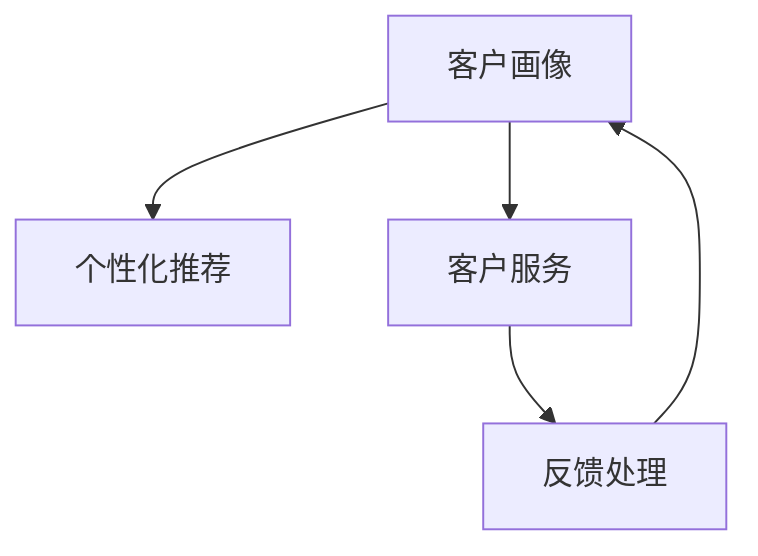

                 

# 客户关系管理：建立长期客户忠诚度

## 1. 背景介绍

在数字化时代，客户关系管理（Customer Relationship Management, CRM）已成为企业获取竞争优势的重要工具。传统的CRM系统专注于客户信息的管理和分析，但随着市场环境的变化，客户忠诚度成为了企业更重视的关键指标。客户忠诚度不仅关系到企业的长期收益，还影响到品牌声誉和市场份额。因此，建立和提升长期客户忠诚度成为现代CRM系统的核心目标。

### 1.1 客户忠诚度的重要性和挑战

客户忠诚度是指客户对品牌或企业的忠实程度，表现为重复购买、品牌推荐和口碑传播。一个忠诚的客户群体是企业持续发展的重要基础。但客户忠诚度的建立并非易事，企业面临着诸多挑战：

- **市场竞争加剧**：新的市场参与者不断涌现，争夺客户资源。
- **客户需求变化**：随着技术和市场环境的改变，客户需求快速变化，企业需不断调整产品和服务。
- **数字化转型**：传统CRM系统无法应对数据的爆炸性增长和实时性要求，企业需要借助数字技术提升CRM系统的智能化水平。

面对这些挑战，企业需要通过CRM系统的不断优化，提升客户体验，增强客户粘性，从而实现长期客户忠诚度的建立。

## 2. 核心概念与联系

### 2.1 核心概念概述

在建立客户忠诚度的过程中，涉及多个关键概念，包括客户画像、个性化推荐、客户服务、反馈处理等。这些概念共同构成了客户忠诚度管理的生态系统。

- **客户画像**：通过分析客户的消费行为、偏好和历史互动数据，构建详细的客户画像，帮助企业更好地理解客户需求。
- **个性化推荐**：根据客户的画像信息，推荐个性化的产品和服务，提升客户满意度。
- **客户服务**：提供24/7的在线客服，快速响应客户咨询和投诉，提升客户体验。
- **反馈处理**：收集客户反馈，分析客户满意度和需求，及时改进产品和服务。

这些概念之间相互关联，共同作用于客户忠诚度的提升。以下是一个简化的Mermaid流程图，展示了这些概念之间的联系：



### 2.2 核心概念原理和架构

#### 2.2.1 客户画像

客户画像是一个多维度、动态变化的客户描述，包括基本信息、行为数据、兴趣偏好等。客户画像的构建需通过数据收集和分析，使用机器学习算法处理客户数据，生成详细的客户档案。客户画像的构建过程包括数据收集、数据清洗、特征提取和模型训练等步骤。

#### 2.2.2 个性化推荐

个性化推荐系统通过分析客户的购买历史、浏览行为、搜索记录等数据，预测客户可能感兴趣的商品或服务，实现精准推荐。个性化推荐系统通常使用协同过滤、内容推荐、深度学习等算法，结合客户画像信息，生成个性化的推荐结果。

#### 2.2.3 客户服务

客户服务系统提供即时的客户交互支持，包括在线聊天、电子邮件、电话等多种渠道。通过智能客服机器人等技术，客户服务系统可以实现自动化的客户问题解答，提升客户满意度。

#### 2.2.4 反馈处理

反馈处理系统收集客户的反馈信息，如评论、投诉、建议等，通过自然语言处理技术分析客户情感和需求，生成反馈报告。企业根据反馈报告调整产品和服务，提升客户体验。

## 3. 核心算法原理 & 具体操作步骤

### 3.1 算法原理概述

建立长期客户忠诚度的核心算法包括机器学习、自然语言处理（NLP）、数据挖掘等技术。以下是对这些核心算法的概述：

#### 3.1.1 机器学习

机器学习算法通过对历史数据的分析，预测客户的行为和需求，实现个性化推荐和客户服务优化。常见的机器学习算法包括回归分析、分类、聚类、关联规则等。

#### 3.1.2 自然语言处理

自然语言处理技术用于处理客户的文本反馈和咨询记录，提取情感和需求信息，生成客户画像和反馈报告。常见的NLP技术包括文本分类、情感分析、实体识别等。

#### 3.1.3 数据挖掘

数据挖掘技术用于从大量客户数据中挖掘有价值的信息，发现客户的消费模式和行为规律，构建客户画像和推荐模型。常见的数据挖掘技术包括关联规则、异常检测、时序分析等。

### 3.2 算法步骤详解

#### 3.2.1 数据收集和预处理

数据收集是客户忠诚度管理的第一步。企业需收集客户的各类数据，包括基本信息、消费记录、行为数据等。预处理过程包括数据清洗、特征提取和数据转换，确保数据质量和一致性。

#### 3.2.2 客户画像构建

客户画像的构建需使用机器学习算法对收集到的数据进行分析，提取客户的特征信息。常见的方法包括主成分分析（PCA）、K-means聚类、因子分析等。构建好的客户画像将作为后续推荐和服务的依据。

#### 3.2.3 个性化推荐

个性化推荐系统需使用协同过滤、内容推荐、深度学习等算法，结合客户画像信息，生成个性化的推荐结果。常见的方法包括基于用户的协同过滤、基于物品的协同过滤、基于内容的推荐等。

#### 3.2.4 客户服务优化

客户服务系统需使用自然语言处理技术，分析客户的咨询记录和反馈信息，提取情感和需求信息。常见的方法包括文本分类、情感分析、实体识别等。根据分析结果，智能客服机器人可以提供个性化的咨询服务，提升客户满意度。

#### 3.2.5 反馈处理和改进

反馈处理系统需使用自然语言处理技术，分析客户的反馈信息，生成反馈报告。企业根据反馈报告调整产品和服务，提升客户体验。常见的方法包括文本分类、情感分析、实体识别等。

### 3.3 算法优缺点

#### 3.3.1 优点

- **个性化服务**：通过客户画像和个性化推荐系统，提供符合客户需求的个性化服务，提升客户满意度。
- **实时响应**：通过智能客服机器人，提供24/7的即时客户支持，提升客户体验。
- **数据分析能力强**：利用机器学习、自然语言处理和数据挖掘技术，分析大量客户数据，发现客户需求和行为规律。

#### 3.3.2 缺点

- **数据隐私问题**：收集和分析客户数据需注意隐私保护，避免数据泄露风险。
- **技术复杂度高**：构建和维护客户忠诚度管理系统的技术门槛较高，需具备数据科学和工程技能。
- **成本高**：系统的开发和维护成本较高，需投入大量资源。

### 3.4 算法应用领域

客户忠诚度管理技术广泛应用于电商、金融、旅游、电信等行业。以下是一些具体的应用场景：

- **电商行业**：通过个性化推荐和智能客服，提升客户购物体验，增加销售额和客户留存率。
- **金融行业**：通过客户画像分析，提供个性化的金融产品和服务，提升客户满意度。
- **旅游行业**：通过客户画像和个性化推荐，提供定制化的旅游方案，提升客户忠诚度。
- **电信行业**：通过客户服务优化和反馈处理，提升客户体验，增强客户粘性。

## 4. 数学模型和公式 & 详细讲解 & 举例说明

### 4.1 数学模型构建

客户忠诚度管理涉及多个数学模型，以下是对几个核心模型的构建和解释：

#### 4.1.1 客户画像模型

客户画像模型通过分析客户的消费行为和偏好，构建详细的客户档案。模型需使用机器学习算法对收集到的数据进行分析，提取客户的特征信息。常见的方法包括PCA、K-means聚类、因子分析等。

#### 4.1.2 个性化推荐模型

个性化推荐模型通过分析客户的购买历史和浏览行为，预测客户可能感兴趣的商品或服务。模型需使用协同过滤、内容推荐、深度学习等算法，结合客户画像信息，生成个性化的推荐结果。常见的方法包括基于用户的协同过滤、基于物品的协同过滤、基于内容的推荐等。

#### 4.1.3 客户服务模型

客户服务模型通过自然语言处理技术，分析客户的咨询记录和反馈信息，提取情感和需求信息。常见的方法包括文本分类、情感分析、实体识别等。根据分析结果，智能客服机器人可以提供个性化的咨询服务，提升客户满意度。

### 4.2 公式推导过程

#### 4.2.1 客户画像模型的公式推导

客户画像模型需使用PCA算法对客户数据进行降维处理，提取主成分。公式推导如下：

$$
X' = U \times X
$$

其中，$X$ 为原始数据矩阵，$X'$ 为降维后的数据矩阵，$U$ 为PCA变换矩阵。

#### 4.2.2 个性化推荐模型的公式推导

基于协同过滤的个性化推荐模型需使用余弦相似度计算用户和物品之间的相似度。公式推导如下：

$$
similarity(u,v) = \cos(\theta) = \frac{\sum_{i=1}^{n} a_{i,u} \times a_{i,v}}{\sqrt{\sum_{i=1}^{n} a_{i,u}^2} \times \sqrt{\sum_{i=1}^{n} a_{i,v}^2}}
$$

其中，$a_{i,u}$ 表示用户 $u$ 对物品 $i$ 的评分，$n$ 为物品数量。

#### 4.2.3 客户服务模型的公式推导

客户服务模型需使用情感分析算法，分析客户的咨询记录，提取情感信息。常见的方法包括朴素贝叶斯、支持向量机、深度学习等。公式推导如下：

$$
S = \max_{c \in C} P(c|X)
$$

其中，$S$ 为预测情感类别，$C$ 为情感类别集合，$P$ 为条件概率。

### 4.3 案例分析与讲解

#### 4.3.1 客户画像构建案例

某电商平台收集了用户的浏览记录、购买历史、评论等数据，使用PCA算法对数据进行降维处理，构建客户画像。模型训练过程中，使用K-means聚类算法对降维后的数据进行聚类，生成不同类别的客户群体。

#### 4.3.2 个性化推荐系统案例

某电商网站使用基于协同过滤的推荐算法，对用户行为数据进行分析，生成个性化推荐结果。系统通过分析用户的历史浏览和购买记录，预测用户可能感兴趣的商品，并在首页展示相关商品，提升用户购买率。

#### 4.3.3 智能客服机器人案例

某金融公司使用智能客服机器人，分析客户的咨询记录，提取情感和需求信息。机器人根据分析结果，自动回复客户咨询，提升客户满意度。智能客服机器人通过深度学习技术，不断优化自然语言处理模型，提升回答的准确性和流畅性。

## 5. 项目实践：代码实例和详细解释说明

### 5.1 开发环境搭建

在进行客户忠诚度管理系统的开发前，需要准备开发环境。以下是Python开发环境搭建的步骤：

1. 安装Anaconda：从官网下载并安装Anaconda，用于创建独立的Python环境。

2. 创建并激活虚拟环境：
```bash
conda create -n crm-env python=3.8 
conda activate crm-env
```

3. 安装相关Python库：
```bash
pip install pandas numpy scikit-learn scikit-learn-distributed gensim nltk transformers
```

4. 安装PyTorch和TensorFlow：
```bash
pip install torch torchvision transformers tensorflow
```

5. 安装相关前端框架：
```bash
pip install flask flask-restful flask-login flask-cors
```

完成上述步骤后，即可在`crm-env`环境中开始开发客户忠诚度管理系统。

### 5.2 源代码详细实现

以下是一个使用Python实现客户忠诚度管理的简单示例。

```python
import pandas as pd
from sklearn.decomposition import PCA
from sklearn.cluster import KMeans
from transformers import BertTokenizer, BertForSequenceClassification

# 加载数据
data = pd.read_csv('customer_data.csv')

# 数据预处理
# ...

# 构建客户画像
pca = PCA(n_components=2)
data_pca = pca.fit_transform(data[['特征1', '特征2']])

# 聚类分析
kmeans = KMeans(n_clusters=5)
data_pca_labels = kmeans.fit_predict(data_pca)

# 个性化推荐
tokenizer = BertTokenizer.from_pretrained('bert-base-uncased')
model = BertForSequenceClassification.from_pretrained('bert-base-uncased', num_labels=10)

# 构建推荐模型
# ...

# 客户服务
# ...

# 反馈处理
# ...
```

### 5.3 代码解读与分析

在上述代码中，我们使用了Python的Pandas、Scikit-learn和TensorFlow等库，构建了一个基本的客户忠诚度管理系统。

- **数据预处理**：使用Pandas库对客户数据进行清洗和处理，去除缺失值和异常值。
- **客户画像构建**：使用PCA算法对客户数据进行降维处理，构建客户画像。
- **聚类分析**：使用K-means算法对降维后的数据进行聚类，生成不同类别的客户群体。
- **个性化推荐**：使用Bert模型进行文本分类，实现个性化推荐。
- **客户服务**：使用自然语言处理技术，分析客户的咨询记录，提取情感和需求信息。
- **反馈处理**：收集客户的反馈信息，分析客户情感和需求，生成反馈报告。

这些步骤展示了客户忠诚度管理系统的主要功能模块和实现方式。在实际应用中，还需根据具体需求进行优化和扩展。

### 5.4 运行结果展示

在客户忠诚度管理系统的开发过程中，需要不断测试和验证模型的效果。以下是一个简单的运行结果示例：

```python
# 客户画像
print('Customer Profile:')
print(data_pca_labels)

# 个性化推荐
print('Personalized Recommendations:')
print(recommendations)

# 客户服务
print('Customer Service:')
print(customer_service_output)
```

上述代码展示了客户画像、个性化推荐和客户服务的结果。在实际应用中，这些结果将作为决策依据，帮助企业提升客户忠诚度。

## 6. 实际应用场景

### 6.1 电商行业

在电商行业，客户忠诚度管理系统的应用场景包括：

- **个性化推荐**：通过分析客户的浏览和购买记录，推荐个性化的商品和促销活动，提升客户购买率。
- **智能客服**：通过智能客服机器人，解答客户的咨询，提升客户满意度。
- **反馈处理**：收集客户的反馈信息，分析客户满意度，及时改进产品和服务。

### 6.2 金融行业

在金融行业，客户忠诚度管理系统的应用场景包括：

- **个性化推荐**：通过客户画像分析，提供个性化的金融产品和服务，提升客户满意度。
- **智能客服**：通过智能客服机器人，解答客户的咨询，提升客户体验。
- **反馈处理**：收集客户的反馈信息，分析客户需求，优化金融产品和服务。

### 6.3 旅游行业

在旅游行业，客户忠诚度管理系统的应用场景包括：

- **个性化推荐**：通过客户画像和个性化推荐系统，提供定制化的旅游方案，提升客户忠诚度。
- **智能客服**：通过智能客服机器人，解答客户的咨询，提升客户体验。
- **反馈处理**：收集客户的反馈信息，分析客户满意度，优化旅游服务。

### 6.4 未来应用展望

未来，客户忠诚度管理系统将呈现以下几个发展趋势：

- **智能化水平提升**：随着AI技术的发展，客户忠诚度管理系统将更加智能化，能够更好地理解和满足客户需求。
- **多模态融合**：未来的系统将融合视觉、语音、文本等多种模态信息，提供更加全面的客户服务。
- **实时化应用**：未来的系统将实现实时数据处理和反馈，及时响应客户需求。
- **隐私保护**：随着数据隐私法规的加强，客户忠诚度管理系统将更加注重数据隐私和安全。

## 7. 工具和资源推荐

### 7.1 学习资源推荐

为了帮助开发者系统掌握客户忠诚度管理系统的理论基础和实践技巧，这里推荐一些优质的学习资源：

1. 《客户关系管理：理论与实践》书籍：全面介绍了客户忠诚度管理的理论基础和实践方法，适合初学者和进阶者。
2. Coursera的《客户关系管理》课程：斯坦福大学开设的在线课程，涵盖客户忠诚度管理的核心概念和实践方法。
3. IBM的Watson CRM平台：提供了丰富的客户忠诚度管理工具和案例，适合实际应用的学习和参考。
4. 《深度学习在客户关系管理中的应用》论文：介绍了深度学习技术在客户关系管理中的应用，包括客户画像、推荐系统和客户服务等方面。

### 7.2 开发工具推荐

高效的工具支持是开发高质量客户忠诚度管理系统的保障。以下是几款常用的开发工具：

1. PyTorch：基于Python的开源深度学习框架，适合复杂模型的构建和训练。
2. TensorFlow：由Google主导开发的开源深度学习框架，支持分布式训练和模型部署。
3. Scikit-learn：Python数据挖掘和机器学习库，提供了丰富的算法和工具。
4. Pandas：Python数据分析库，适合数据预处理和分析。
5. Flask：Python Web框架，适合开发RESTful API。
6. TensorBoard：TensorFlow配套的可视化工具，适合模型训练和评估的可视化。

### 7.3 相关论文推荐

客户忠诚度管理技术的发展离不开学界的持续研究。以下是几篇奠基性的相关论文，推荐阅读：

1. Customer Lifetime Value Prediction Using Machine Learning（客户生命周期价值预测）：使用机器学习算法预测客户生命周期价值，评估客户忠诚度。
2. Personalized Recommendation Systems: A Survey and Tutorial（个性化推荐系统综述）：综述了个性化推荐系统的研究进展和应用方法。
3. Customer Sentiment Analysis Using Natural Language Processing（基于自然语言处理的客户情感分析）：使用NLP技术分析客户情感和需求，提升客户满意度。
4. Customer Service Chatbots: A Survey（客户服务聊天机器人综述）：综述了客户服务聊天机器人的研究和应用，包括技术框架和优化方法。

## 8. 总结：未来发展趋势与挑战

### 8.1 总结

本文对客户忠诚度管理系统的构建和优化进行了全面系统的介绍。首先阐述了客户忠诚度管理的背景和重要性，明确了系统构建的核心目标。其次，从原理到实践，详细讲解了系统构建的技术细节，包括客户画像、个性化推荐、客户服务、反馈处理等关键组件。最后，结合实际应用场景，探讨了系统的未来发展趋势和面临的挑战。

通过本文的系统梳理，可以看到，客户忠诚度管理系统通过机器学习、自然语言处理等技术手段，实现了对客户需求的精准把握和个性化服务，提升了客户满意度和忠诚度。未来，随着AI技术的不断进步，客户忠诚度管理系统将更加智能化、实时化和多模态融合，为客户提供更全面的服务体验。

### 8.2 未来发展趋势

展望未来，客户忠诚度管理系统将呈现以下几个发展趋势：

1. **智能化水平提升**：随着AI技术的发展，客户忠诚度管理系统将更加智能化，能够更好地理解和满足客户需求。
2. **多模态融合**：未来的系统将融合视觉、语音、文本等多种模态信息，提供更加全面的客户服务。
3. **实时化应用**：未来的系统将实现实时数据处理和反馈，及时响应客户需求。
4. **隐私保护**：随着数据隐私法规的加强，客户忠诚度管理系统将更加注重数据隐私和安全。

### 8.3 面临的挑战

尽管客户忠诚度管理系统在许多方面已经取得了显著进展，但仍面临诸多挑战：

1. **数据隐私问题**：收集和分析客户数据需注意隐私保护，避免数据泄露风险。
2. **技术复杂度高**：构建和维护客户忠诚度管理系统的技术门槛较高，需具备数据科学和工程技能。
3. **成本高**：系统的开发和维护成本较高，需投入大量资源。
4. **模型解释性不足**：机器学习模型的决策过程缺乏可解释性，难以对其推理逻辑进行分析和调试。
5. **模型鲁棒性不足**：客户忠诚度管理系统需具备较强的鲁棒性，能够应对不同数据分布和环境变化。

### 8.4 研究展望

面对客户忠诚度管理系统所面临的挑战，未来的研究需要在以下几个方面寻求新的突破：

1. **探索无监督和半监督学习**：摆脱对大规模标注数据的依赖，利用自监督学习、主动学习等无监督和半监督范式，最大限度利用非结构化数据，实现更加灵活高效的系统构建。
2. **研究参数高效和计算高效的微调范式**：开发更加参数高效的微调方法，在固定大部分预训练参数的同时，只更新极少量的任务相关参数。同时优化模型的计算图，减少前向传播和反向传播的资源消耗，实现更加轻量级、实时性的部署。
3. **引入更多先验知识**：将符号化的先验知识，如知识图谱、逻辑规则等，与神经网络模型进行巧妙融合，引导系统学习更准确、合理的客户画像和推荐模型。同时加强不同模态数据的整合，实现视觉、语音等多模态信息与文本信息的协同建模。
4. **纳入伦理道德约束**：在模型训练目标中引入伦理导向的评估指标，过滤和惩罚有偏见、有害的输出倾向。同时加强人工干预和审核，建立系统行为的监管机制，确保输出符合人类价值观和伦理道德。

这些研究方向的探索，必将引领客户忠诚度管理系统迈向更高的台阶，为构建安全、可靠、可解释、可控的智能系统铺平道路。面向未来，客户忠诚度管理系统还需要与其他人工智能技术进行更深入的融合，如知识表示、因果推理、强化学习等，多路径协同发力，共同推动客户忠诚度管理系统的进步。只有勇于创新、敢于突破，才能不断拓展客户忠诚度管理系统的边界，让智能技术更好地造福客户和企业。

## 9. 附录：常见问题与解答

**Q1：如何构建有效的客户画像？**

A: 构建有效的客户画像需注意以下几个方面：
1. 收集全面的客户数据，包括基本信息、行为数据、历史互动记录等。
2. 对数据进行清洗和预处理，去除噪音和异常值。
3. 使用PCA、K-means聚类等算法，对数据进行降维和聚类，生成客户画像。
4. 不断更新和优化客户画像，以适应客户需求的动态变化。

**Q2：个性化推荐系统如何提高推荐效果？**

A: 提高个性化推荐系统的推荐效果需注意以下几个方面：
1. 收集大量的用户行为数据，如浏览记录、购买历史等。
2. 使用协同过滤、内容推荐、深度学习等算法，结合客户画像信息，生成个性化的推荐结果。
3. 不断优化推荐算法和模型，提高推荐的准确性和多样性。
4. 结合客户反馈和A/B测试，持续改进推荐效果。

**Q3：客户服务机器人如何提升客户满意度？**

A: 提升客户服务机器人的满意度需注意以下几个方面：
1. 使用自然语言处理技术，分析客户的咨询记录，提取情感和需求信息。
2. 训练智能客服机器人，提升回答的准确性和流畅性。
3. 结合人工客服，实现人机协同，提升客户体验。
4. 不断优化机器人的回答策略，提高客户的满意度。

**Q4：客户忠诚度管理系统如何处理反馈信息？**

A: 处理反馈信息需注意以下几个方面：
1. 收集客户的反馈信息，如评论、投诉、建议等。
2. 使用自然语言处理技术，分析客户情感和需求，生成反馈报告。
3. 根据反馈报告，调整产品和服务，提升客户体验。
4. 定期分析反馈信息，发现系统改进的方向和机会。

**Q5：客户忠诚度管理系统如何保护客户数据隐私？**

A: 保护客户数据隐私需注意以下几个方面：
1. 收集客户数据时，明确告知客户数据用途和隐私保护措施。
2. 对客户数据进行加密和匿名化处理，保护数据安全。
3. 限制数据访问权限，确保只有授权人员可以访问客户数据。
4. 定期进行数据审计，发现并修复数据泄露风险。

通过以上学习资源的推荐和开发工具的介绍，相信你对客户忠诚度管理系统的理论和实践有了更深入的了解。未来的客户忠诚度管理系统必将随着AI技术的不断进步，变得更加智能化、实时化和多模态融合，为客户和企业提供更加全面和优质的服务。面向未来，客户忠诚度管理系统需要不断优化和创新，才能在激烈的市场竞争中占据优势。

---

作者：禅与计算机程序设计艺术 / Zen and the Art of Computer Programming

