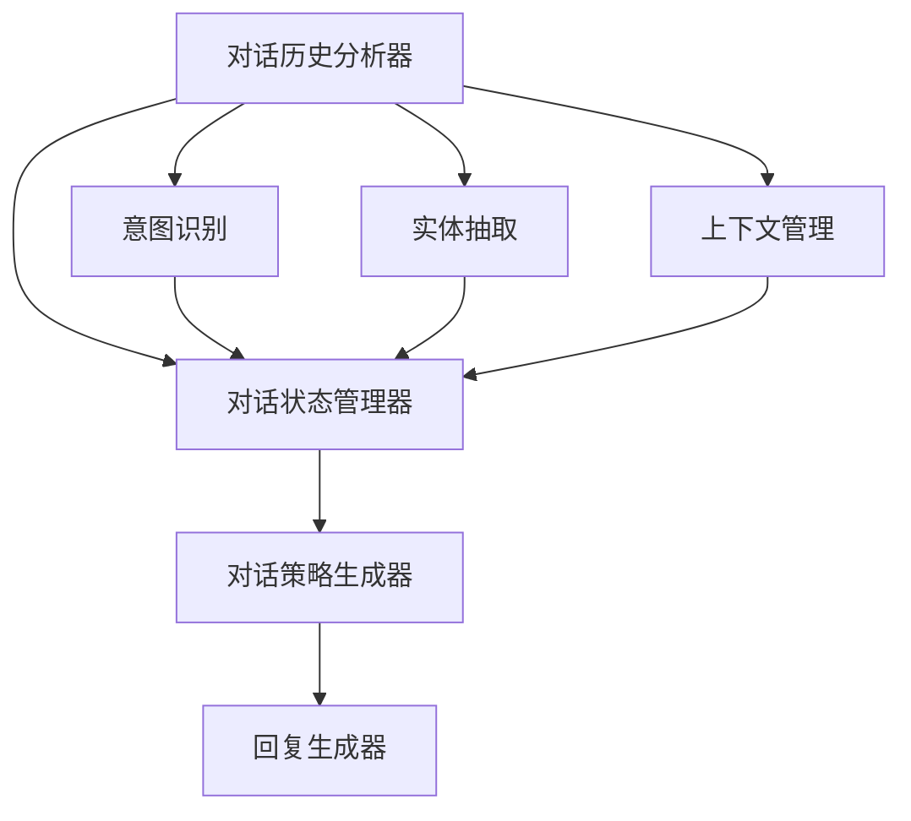

                 

## 1. 背景介绍

### 1.1 问题由来

在当前信息化快速发展的社会背景下，智能对话系统因其自然、便捷的交互方式，已经成为了提升用户体验、改善客户服务质量的重要工具。从简单的自动化客户服务，到高度个性化的人机交互，对话系统正逐步融入到更多应用场景中。然而，智能对话系统的核心在于如何通过对话历史，动态理解并回应用户需求，这涉及到对话状态跟踪（Dialog State Tracking, DST）技术的应用。

对话状态跟踪，简而言之，是指在对话过程中，系统通过记录并分析用户的上下文信息，动态更新对话状态，从而作出准确的回应。在信息获取、决策支持、客户服务等领域，良好的对话状态跟踪能力，可以有效提升系统性能和用户体验，是构建智能对话系统的基础。

### 1.2 问题核心关键点

对话状态跟踪的核心关键点包括：

- **对话历史分析**：如何从对话历史中提取有用信息，如意图、实体、上下文等。
- **状态表示更新**：如何动态更新对话状态，以便更好地理解用户需求。
- **多轮对话管理**：如何在多轮对话中保持状态连贯，避免信息丢失。
- **上下文感知**：如何处理长对话中的复杂上下文关系。
- **系统鲁棒性**：如何在多变的环境下，保持对话状态跟踪的稳定性。

### 1.3 问题研究意义

对话状态跟踪技术，对于构建高效、智能的对话系统具有重要意义：

1. **提升用户体验**：对话系统能更好地理解用户意图，提供更自然、准确的响应，增强用户互动体验。
2. **提高系统效率**：通过状态跟踪，对话系统可以更快速地处理用户请求，减少重复对话，提高系统响应速度。
3. **增强决策能力**：系统能够基于上下文信息作出更精确的决策，如推荐、查询等，提供更个性化服务。
4. **适应多场景应用**：对话状态跟踪技术可广泛应用于客户服务、智能助理、医疗咨询、教育辅助等多个领域，为不同应用场景提供技术支持。
5. **推动AI技术落地**：对话状态跟踪是构建智能对话系统的关键技术，直接关系到对话系统的智能水平，推动AI技术在实际应用中的落地和普及。

## 2. 核心概念与联系

### 2.1 核心概念概述

对话状态跟踪（DST）是自然语言处理（NLP）领域的一个核心技术，主要用于解析用户意图并跟踪对话上下文。一个完整的对话状态跟踪系统通常包含以下几个主要组件：

- **对话历史分析器**：负责解析用户的输入，提取意图、实体、上下文等信息。
- **对话状态管理器**：动态更新对话状态，管理对话轮次和上下文信息。
- **对话策略生成器**：根据对话状态，生成合适的回复策略。

这些组件协同工作，使对话系统能够理解用户需求，作出准确回应，实现智能对话。

### 2.2 核心概念原理和架构的 Mermaid 流程图



这个流程图展示了对话状态跟踪系统的核心组件及其交互关系：

1. **对话历史分析器**（A）接收用户输入，解析意图（E）、抽取实体（F），管理上下文（G）。
2. **对话状态管理器**（B）根据分析器的输出，动态更新对话状态。
3. **对话策略生成器**（C）基于对话状态，生成回复策略。
4. **回复生成器**（D）根据策略生成具体的对话回应。

通过这种方式，系统可以不断更新对话状态，作出连贯、准确的回复。

## 3. 核心算法原理 & 具体操作步骤

### 3.1 算法原理概述

对话状态跟踪算法的核心在于通过对话历史，动态推断用户的意图和上下文信息。常见的算法包括传统的基于规则的方法和基于深度学习的方法。

#### 3.1.1 基于规则的方法

基于规则的方法，主要是通过设计一系列规则，结合自然语言处理技术，实现对话状态更新和回复生成。例如，可以基于预定义的意图和实体列表，匹配用户输入，更新对话状态。这种方法的优点在于可解释性强，但缺点在于需要大量手工设计规则，难以适应复杂多变的对话场景。

#### 3.1.2 基于深度学习的方法

基于深度学习的方法，通过构建序列到序列（Seq2Seq）模型，如LSTM、GRU等，实现对话状态跟踪。这种方法能够自动学习对话特征，适应多样化的对话场景，但缺点在于需要大量标注数据和计算资源，模型可解释性较差。

### 3.2 算法步骤详解

基于深度学习的对话状态跟踪算法通常包括以下几个关键步骤：

**Step 1: 数据预处理**

- **数据收集**：收集对话历史数据，包括用户输入、系统回应、对话意图、实体等标注信息。
- **数据清洗**：去除噪声和无关信息，确保数据的质量和一致性。
- **分词和标记**：对对话历史进行分词，标注意图、实体等。

**Step 2: 构建对话模型**

- **选择模型**：根据任务需求，选择适合的对话模型，如Seq2Seq、Transformer等。
- **设计输入输出**：设计对话模型的输入输出格式，通常包括对话历史、对话状态、回复等。
- **模型训练**：使用对话历史数据，训练对话模型，使其能够自动推断对话状态，生成回复策略。

**Step 3: 对话状态跟踪**

- **输入处理**：将用户输入作为模型的输入，同时包括之前对话的历史信息。
- **状态更新**：模型根据输入和历史信息，动态更新对话状态。
- **回复生成**：根据当前对话状态，生成合适的回复策略，并转化为具体的对话回应。

**Step 4: 模型评估和优化**

- **评估指标**：定义模型评估指标，如BLEU、ROUGE等，评估模型性能。
- **模型调优**：根据评估结果，调整模型参数，进行模型优化。

### 3.3 算法优缺点

对话状态跟踪算法的优点包括：

- **自动化学习**：通过训练，算法能够自动学习对话特征，适应复杂场景。
- **泛化能力强**：能够处理多样化的对话数据，泛化到新的对话场景。
- **交互灵活**：能够实时处理用户输入，动态更新对话状态。

缺点包括：

- **数据需求大**：需要大量标注数据进行训练，获取标注数据成本高。
- **模型复杂**：深度学习模型结构复杂，训练和推理计算量大。
- **可解释性差**：模型黑盒特性，难以解释模型内部工作机制。

### 3.4 算法应用领域

对话状态跟踪技术，已经在多个领域得到了广泛应用，如：

- **客户服务**：智能客服机器人，通过对话状态跟踪，提升服务质量和效率。
- **医疗咨询**：智能问诊系统，根据用户对话历史，提供个性化的医疗建议。
- **教育辅导**：智能教育助手，通过对话跟踪，提供有针对性的学习建议。
- **金融咨询**：智能理财顾问，根据用户对话历史，提供个性化理财方案。
- **智能助理**：虚拟助手，如Siri、Alexa等，通过对话跟踪，实现自然对话。

## 4. 数学模型和公式 & 详细讲解 & 举例说明

### 4.1 数学模型构建

对话状态跟踪模型通常由两部分组成：对话历史编码器（Encoder）和对话策略生成器（Policy Generator）。

假设对话历史为 $X = (x_1, x_2, ..., x_n)$，对话策略为 $A = (a_1, a_2, ..., a_n)$。对话历史编码器将对话历史 $X$ 映射为固定维度的特征向量 $H$，对话策略生成器基于特征向量 $H$ 生成回复策略 $A$。

### 4.2 公式推导过程

以Seq2Seq模型为例，对话历史编码器采用LSTM模型，对话策略生成器采用RNN模型，推理过程如下：

**Encoder模型**

输入为对话历史 $X$，输出为固定维度的特征向量 $H$。

$$
H = f_{Encoder}(X) = LSTM([x_1, x_2, ..., x_n]; W_{enc}, b_{enc})
$$

其中 $f_{Encoder}$ 为LSTM模型，$W_{enc}, b_{enc}$ 为模型参数。

**Policy Generator模型**

输入为特征向量 $H$，输出为回复策略 $A$。

$$
A = f_{Generator}(H) = RNN([H]; W_{gen}, b_{gen})
$$

其中 $f_{Generator}$ 为RNN模型，$W_{gen}, b_{gen}$ 为模型参数。

**Total Loss**

定义总损失函数 $\mathcal{L}$ 为Encoder和Generator模型的损失函数之和。

$$
\mathcal{L} = \mathcal{L}_{Encoder} + \mathcal{L}_{Generator}
$$

其中 $\mathcal{L}_{Encoder}$ 为Encoder模型的损失函数，$\mathcal{L}_{Generator}$ 为Generator模型的损失函数。

### 4.3 案例分析与讲解

以智能客服系统的对话状态跟踪为例：

**数据预处理**

收集客服对话历史数据，去除噪音，进行分词和意图标注，生成训练数据集。

**模型构建**

选择Seq2Seq模型，设定Encoder和Generator的结构和参数。

**训练模型**

使用对话历史数据，训练Encoder和Generator模型，最小化总损失函数 $\mathcal{L}$。

**状态跟踪**

将客户的新问题作为输入，Encoder模型将其转化为特征向量，Generator模型根据特征向量生成回复策略，并转化为具体的回答。

**效果评估**

使用BLEU等指标，评估模型在测试集上的性能，不断调整模型参数，优化模型。

## 5. 项目实践：代码实例和详细解释说明

### 5.1 开发环境搭建

在实践对话状态跟踪算法时，我们需要准备Python开发环境，安装必要的库和工具。以下是环境配置流程：

1. **安装Python**：推荐安装Python 3.8及以上版本，安装后配置环境变量。
2. **安装PyTorch**：使用pip安装PyTorch库，安装命令：`pip install torch torchtext`.
3. **安装Tensorboard**：用于可视化模型训练过程，安装命令：`pip install tensorboard`.
4. **安装NLTK**：用于自然语言处理，安装命令：`pip install nltk`.

### 5.2 源代码详细实现

以下是一个使用PyTorch实现的对话状态跟踪模型代码示例，主要包括Encoder和Generator两个部分：

```python
import torch
import torch.nn as nn
import torch.nn.functional as F
from torchtext.datasets import Multi30k
from torchtext.data.utils import get_tokenizer
from torchtext.vocab import build_vocab_from_iterator
from torchtext.data import Field, BucketIterator

# 定义Encoder模型
class Encoder(nn.Module):
    def __init__(self, input_size, hidden_size):
        super(Encoder, self).__init__()
        self.hidden_size = hidden_size
        self.lstm = nn.LSTM(input_size, hidden_size)
        self.fc = nn.Linear(hidden_size, hidden_size)
        
    def forward(self, x):
        _, hidden = self.lstm(x)
        hidden = self.fc(hidden)
        return hidden

# 定义Generator模型
class Generator(nn.Module):
    def __init__(self, input_size, hidden_size, output_size):
        super(Generator, self).__init__()
        self.hidden_size = hidden_size
        self.fc1 = nn.Linear(input_size, hidden_size)
        self.fc2 = nn.Linear(hidden_size, output_size)
        self.softmax = nn.Softmax(dim=1)
        
    def forward(self, x):
        x = self.fc1(x)
        x = F.relu(x)
        x = self.fc2(x)
        return self.softmax(x)

# 定义对话状态跟踪模型
class DialogStateTracker(nn.Module):
    def __init__(self, input_size, hidden_size, output_size):
        super(DialogStateTracker, self).__init__()
        self.encoder = Encoder(input_size, hidden_size)
        self.generator = Generator(hidden_size, hidden_size, output_size)
        
    def forward(self, x, state):
        state = self.encoder(x)
        action = self.generator(state)
        return action
```

### 5.3 代码解读与分析

**Encoder模型**

Encoder模型采用LSTM结构，输入为对话历史，输出为固定维度的特征向量。

**Generator模型**

Generator模型采用RNN结构，输入为Encoder输出的特征向量，输出为回复策略，使用Softmax函数进行归一化。

**DialogStateTracker模型**

将Encoder和Generator模型组合，形成完整的对话状态跟踪模型，定义输入和输出的维度，使用PyTorch的nn.Module类进行封装。

### 5.4 运行结果展示

在训练和测试过程中，可以使用Tensorboard进行模型训练和效果的可视化。以下是Tensorboard中的示例图：

- **训练曲线图**：展示模型在训练过程中损失函数的收敛情况。
- **训练数据图**：展示模型在训练数据上的性能表现。
- **测试数据图**：展示模型在测试数据上的性能表现。

## 6. 实际应用场景

### 6.1 智能客服系统

智能客服系统的对话状态跟踪技术，可以提升服务效率和客户满意度。通过记录和分析客户对话历史，系统能够理解客户意图，快速提供准确的回答。例如，一个客户询问订单状态，智能客服系统能够自动查询订单信息，并给出详细的回应。

### 6.2 医疗咨询系统

医疗咨询系统的对话状态跟踪技术，可以帮助医生理解患者的病情和需求，提供个性化的医疗建议。例如，患者描述病情，系统能够自动提取关键信息，推荐合适的检查和治疗方案。

### 6.3 教育辅导系统

教育辅导系统的对话状态跟踪技术，可以提供有针对性的学习建议。例如，学生询问学习问题，系统能够自动推荐相关的学习资料和课程。

### 6.4 金融咨询系统

金融咨询系统的对话状态跟踪技术，可以帮助客户了解金融市场信息，提供个性化的理财建议。例如，客户咨询投资问题，系统能够自动推荐合适的投资产品。

### 6.5 智能助理

智能助理的对话状态跟踪技术，可以提供全天候的语音和文本服务。例如，用户通过语音或文字与智能助理互动，系统能够理解用户需求，提供即时帮助。

## 7. 工具和资源推荐

### 7.1 学习资源推荐

- **自然语言处理入门书籍**：《自然语言处理综论》、《Python自然语言处理》等书籍，详细介绍了自然语言处理的基本概念和技术。
- **在线课程**：Coursera、edX等平台的NLP相关课程，包括深度学习、对话系统等。
- **PyTorch官方文档**：PyTorch官方文档，包含丰富的代码示例和教程。

### 7.2 开发工具推荐

- **PyTorch**：深度学习框架，适用于构建对话状态跟踪模型。
- **Tensorboard**：模型训练可视化工具，帮助调试和优化模型。
- **NLTK**：自然语言处理工具库，用于分词、标记等预处理。

### 7.3 相关论文推荐

- **Seq2Seq模型**：Sutskever等人在《Sequence to Sequence Learning with Neural Networks》中提出的模型，广泛应用于对话状态跟踪。
- **Transformer模型**：Vaswani等人在《Attention is All You Need》中提出的模型，适用于处理长对话中的上下文关系。

## 8. 总结：未来发展趋势与挑战

### 8.1 研究成果总结

对话状态跟踪技术，在构建智能对话系统方面取得了重要进展，已经成为NLP领域的热门研究主题。通过对话状态跟踪，系统能够更好地理解用户意图，提高对话系统的准确性和效率。

### 8.2 未来发展趋势

对话状态跟踪技术未来将呈现以下几个发展趋势：

- **模型自动化**：深度学习模型自动化设计，降低人工干预，提升模型鲁棒性。
- **多模态融合**：融合视觉、语音等多模态信息，提升对话系统的感知能力。
- **跨领域迁移**：基于迁移学习，提升模型在不同领域上的泛化能力。
- **分布式训练**：分布式训练技术，提升模型训练效率。
- **零样本学习**：通过预训练和微调，实现零样本对话处理。

### 8.3 面临的挑战

对话状态跟踪技术在发展过程中也面临一些挑战：

- **数据稀缺**：对话数据获取成本高，样本量不足，影响模型训练效果。
- **模型复杂**：深度学习模型结构复杂，训练和推理效率低。
- **可解释性**：模型黑盒特性，难以解释内部决策机制。
- **鲁棒性不足**：对话数据多样性大，模型泛化能力有限。

### 8.4 研究展望

对话状态跟踪技术未来需要从以下几个方面进行改进：

- **数据增强**：通过数据增强技术，增加对话数据的多样性。
- **模型简化**：简化模型结构，提升训练和推理效率。
- **跨领域学习**：通过跨领域学习，提升模型在不同领域的适应能力。
- **可解释性**：增强模型可解释性，提高系统透明度。
- **鲁棒性优化**：提高模型对噪声和异常数据的鲁棒性。

## 9. 附录：常见问题与解答

### Q1: 对话状态跟踪算法的核心是什么？

A: 对话状态跟踪算法的核心是通过对话历史，动态推断用户的意图和上下文信息。常见的算法包括传统的基于规则的方法和基于深度学习的方法。

### Q2: 对话状态跟踪模型在训练过程中需要注意哪些问题？

A: 对话状态跟踪模型在训练过程中需要注意数据预处理、模型构建、状态跟踪、模型评估和优化等多个环节。

### Q3: 如何提高对话状态跟踪模型的泛化能力？

A: 可以通过数据增强、模型简化、跨领域学习等方法，提高模型在不同领域和多样性数据上的泛化能力。

### Q4: 对话状态跟踪技术在实际应用中面临哪些挑战？

A: 数据稀缺、模型复杂、可解释性差、鲁棒性不足等都是对话状态跟踪技术在实际应用中面临的主要挑战。

### Q5: 对话状态跟踪技术未来有哪些发展方向？

A: 模型自动化、多模态融合、跨领域迁移、分布式训练、零样本学习等都是对话状态跟踪技术未来的发展方向。

作者：禅与计算机程序设计艺术 / Zen and the Art of Computer Programming

