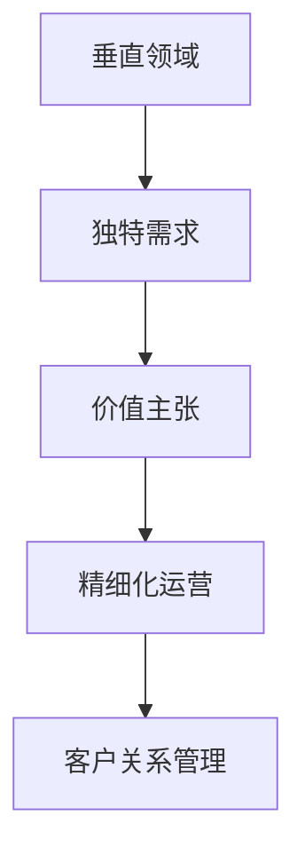

                 

## 1. 背景介绍

在当前快速变化的商业环境中，小公司面临的挑战日益严峻。市场竞争激烈，资源有限，如何在有限条件下实现盈利和成长，成为小公司生存发展的关键。本文将探讨小公司如何通过精准服务垂直领域，满足独特需求与价值主张，以实现业务的可持续发展。

### 1.1 问题由来

小公司在资源、人力、资金等方面都处于劣势，很难与大公司直接竞争。但小公司也有其优势，比如灵活性高、决策速度快、市场响应迅速等。如何利用这些优势，将小公司的服务精准化、差异化，是其生存的重要策略。

### 1.2 问题核心关键点

小公司要实现精准服务，首先需要识别目标客户群体的独特需求。通过深入分析市场调研数据，了解客户的具体痛点，制定针对性解决方案。其次，要构建独特的服务价值主张，即产品或服务的差异化价值，使客户感受到与市场上其他竞争者相比的优势。最后，要通过精细化的运营和客户关系管理，实现对客户需求的持续响应和满足。

### 1.3 问题研究意义

研究小公司如何精准服务垂直领域，对于提升小公司的市场竞争力，推动创新和业务增长具有重要意义：

1. 提升盈利能力：通过精准服务，小公司可以专注于高价值客户群体，提供高质量的服务，提高客户满意度和忠诚度，从而增加销售额和利润。
2. 加速业务增长：精准服务能够帮助小公司更快地响应市场变化，抓住新机遇，实现快速增长。
3. 增强市场竞争力：通过差异化的服务价值主张，小公司能够在竞争激烈的市场中脱颖而出，增强竞争力。
4. 促进可持续发展：精准服务使小公司能够持续满足客户需求，建立长期稳定的客户关系，实现可持续发展。

## 2. 核心概念与联系

### 2.1 核心概念概述

为更好地理解小公司如何通过精准服务垂直领域，满足独特需求与价值主张，本节将介绍几个密切相关的核心概念：

- **垂直领域（Vertical Field）**：指市场中的特定行业或细分市场，具有相似的客户需求、竞争对手和行业特点。小公司应专注于某个垂直领域，提供专业化的服务。
- **独特需求（Unique Needs）**：指目标客户群体的具体、个性化的需求。小公司需要深入了解客户需求，提供定制化服务。
- **价值主张（Value Proposition）**：指产品或服务相对于竞争对手的优势和独特卖点，吸引客户选择。
- **精细化运营（Fine-grained Operations）**：指通过细致的管理和优化，提高运营效率和服务质量。
- **客户关系管理（Customer Relationship Management, CRM）**：指对客户信息、互动和反馈进行系统管理，以提升客户满意度和忠诚度。

这些核心概念之间的逻辑关系可以通过以下Mermaid流程图来展示：



这个流程图展示了几者之间的关系：

1. 小公司选择某个垂直领域，通过市场调研和数据分析，识别目标客户群体的独特需求。
2. 基于这些需求，设计独特的价值主张，形成差异化的服务优势。
3. 通过精细化的运营管理，实现高效的服务交付。
4. 利用客户关系管理系统，持续跟踪和改进客户满意度，实现长期稳定的客户关系。

## 3. 核心算法原理 & 具体操作步骤
### 3.1 算法原理概述

小公司通过精准服务垂直领域，满足独特需求与价值主张，本质上是一种基于客户需求的个性化服务和差异化竞争策略。其核心思想是：

1. **市场细分**：识别和选择具有共同需求的客户群体。
2. **需求分析**：深入了解目标客户的具体需求和痛点。
3. **服务定制**：根据客户需求，提供定制化的解决方案和产品。
4. **差异化竞争**：构建独特的价值主张，形成差异化的市场竞争优势。
5. **持续改进**：通过客户反馈和市场变化，不断优化服务质量和运营效率。

### 3.2 算法步骤详解

基于上述核心思想，小公司精准服务的步骤包括以下几个关键环节：

**Step 1: 市场调研与客户细分**
- 收集市场数据，进行客户画像分析，识别潜在客户群体的特点和需求。
- 根据客户需求和痛点，划分垂直领域，选择目标市场。

**Step 2: 需求分析与客户调研**
- 深入了解目标客户的具体需求、偏好和痛点。
- 通过问卷调查、访谈等方式，收集客户反馈和建议。

**Step 3: 服务设计**
- 根据客户需求，设计独特的服务方案和产品，确保能够满足客户的具体需求。
- 考虑成本效益，合理分配资源，实现高效的服务交付。

**Step 4: 服务推广与价值主张**
- 制定独特的价值主张，突出服务优势，吸引客户选择。
- 使用多渠道推广手段，扩大服务影响力。

**Step 5: 精细化运营与客户关系管理**
- 优化服务流程，提高运营效率和服务质量。
- 利用客户关系管理系统，跟踪客户反馈，不断改进服务。

**Step 6: 持续改进与市场适应**
- 定期分析市场变化和客户需求变化，调整服务策略。
- 引入新技术和新方法，提升服务质量和竞争力。

### 3.3 算法优缺点

精准服务垂直领域、满足独特需求与价值主张，具有以下优点：

1. **客户满意度提升**：通过精准的服务和差异化的价值主张，能够显著提升客户满意度。
2. **市场竞争力增强**：差异化的服务优势使小公司能够在竞争激烈的市场中脱颖而出。
3. **业务增长加速**：精准服务使小公司能够快速响应市场变化，抓住新机遇，实现快速增长。
4. **运营效率提高**：精细化的运营管理有助于提高服务质量和效率。

同时，该方法也存在一定的局限性：

1. **市场进入壁垒高**：垂直领域的选择和切入需要深入市场调研和数据分析，难度较大。
2. **客户需求多样**：客户需求多样，定制化服务可能导致成本高、管理复杂。
3. **资源限制**：小公司资源有限，难以实现大规模市场推广和精细化运营。
4. **竞争激烈**：垂直领域往往集中了大量小公司，市场竞争激烈，容易陷入价格战。

尽管存在这些局限性，但就目前而言，精准服务垂直领域、满足独特需求与价值主张，仍是小公司竞争的重要策略。未来相关研究的重点在于如何进一步优化市场细分、需求分析和服务设计方法，提升运营效率，同时兼顾客户满意度和市场竞争力。

### 3.4 算法应用领域

基于小公司精准服务垂直领域的方法，在多个行业领域得到了广泛应用，例如：

- **电子商务**：通过市场细分和个性化推荐，提升客户购物体验，增加销售额。
- **金融服务**：针对不同客户群体提供定制化的理财方案，增强客户黏性。
- **医疗健康**：提供个性化健康咨询和定制化治疗方案，满足不同患者的独特需求。
- **教育培训**：针对不同学习阶段和需求的学生提供定制化课程，提高教学效果。
- **旅游服务**：根据客户偏好和需求设计定制化旅游线路，提升客户满意度。

除了上述这些行业外，精准服务垂直领域的方法也在更多场景中得到了应用，如企业IT支持、餐饮服务、娱乐休闲等，为小公司带来了新的发展机遇。

## 4. 数学模型和公式 & 详细讲解 & 举例说明
### 4.1 数学模型构建

本节将使用数学语言对小公司精准服务垂直领域、满足独特需求与价值主张的过程进行更加严格的刻画。

记目标客户群体为 $C$，每个客户的独特需求为 $D_C$，服务价值主张为 $V$。假设服务成本为 $C_V$，市场推广成本为 $C_M$。则小公司的优化目标是最大化客户满意度与市场份额之和，即：

$$
\max \sum_{C \in C} \frac{S_C}{C_V} + \frac{M_C}{C_M}
$$

其中，$S_C$ 表示客户 $C$ 对服务的满意度，$M_C$ 表示客户 $C$ 的购买量。

### 4.2 公式推导过程

以下我们通过数学公式推导，找到最大化目标函数的条件。

假设 $S_C$ 和 $M_C$ 为连续变量，优化问题可转化为：

$$
\max \sum_{C \in C} S_C + M_C \\
\text{s.t.} \quad S_C = f(V_C), \quad M_C = g(V_C, C_V)
$$

其中 $f$ 和 $g$ 为特定函数，表示服务满意度和服务购买量与价值主张和服务成本的关系。

将上述优化问题转化为拉格朗日乘子问题，设 $\lambda$ 为拉格朗日乘子：

$$
L(S_C, M_C, \lambda) = S_C + M_C - \lambda(f(S_C) + g(M_C, C_V) - C_V)
$$

对 $S_C$ 和 $M_C$ 求偏导数，得：

$$
\frac{\partial L}{\partial S_C} = 1 + \lambda f'(S_C) - \lambda g'(M_C, C_V) = 0
$$

$$
\frac{\partial L}{\partial M_C} = 1 + \lambda g'(M_C, C_V) = 0
$$

解得：

$$
S_C = \lambda f'(S_C)
$$

$$
M_C = \lambda g'(M_C, C_V)
$$

进一步简化，得：

$$
\lambda = \frac{1}{f'(S_C)} = \frac{1}{g'(M_C, C_V)}
$$

由于 $\lambda$ 为常数，可以推断出服务满意度 $S_C$ 和服务购买量 $M_C$ 成正比关系。因此，小公司应优先提供满足客户需求的服务，同时控制服务成本，实现收益最大化。

### 4.3 案例分析与讲解

假设某电商小公司专注于中高端用户市场，主要服务项目为定制化家居产品。公司通过市场调研，识别出中高端用户群体对家居产品的主要需求为设计感和实用性。公司根据这些需求，设计了独特的价值主张，即提供高品质、个性化、高性价比的家居产品。

公司采用多渠道推广手段，如社交媒体广告、搜索引擎优化等，吸引了大量目标客户。通过精细化的运营管理，公司实现了高效的服务交付和客户满意度提升。

为了持续改进服务质量，公司利用客户关系管理系统，定期收集客户反馈，调整产品设计和服务流程。通过市场适应和持续改进，公司在激烈的市场竞争中取得了不错的业绩和客户满意度。

## 5. 项目实践：代码实例和详细解释说明
### 5.1 开发环境搭建

在进行项目实践前，我们需要准备好开发环境。以下是使用Python进行Django开发的环境配置流程：

1. 安装Anaconda：从官网下载并安装Anaconda，用于创建独立的Python环境。

2. 创建并激活虚拟环境：
```bash
conda create -n django-env python=3.8 
conda activate django-env
```

3. 安装Django：通过pip安装Django框架及其依赖库。
```bash
pip install django
```

4. 安装其他依赖库：
```bash
pip install pandas numpy matplotlib
```

5. 安装Gunicorn：用于Django应用程序的运行。
```bash
pip install gunicorn
```

6. 安装Django管理员面板：用于管理用户、产品和订单等数据。
```bash
pip install django-admin-panel
```

完成上述步骤后，即可在`django-env`环境中开始项目开发。

### 5.2 源代码详细实现

下面我们以Django项目为例，给出小公司精准服务的代码实现。

首先，创建Django项目和应用：

```bash
django-admin startproject shop_project
cd shop_project
python manage.py startapp products
```

然后，配置Django项目和应用设置：

```python
# shop_project/settings.py

INSTALLED_APPS = [
    'django.contrib.admin',
    'django.contrib.auth',
    'django.contrib.contenttypes',
    'django.contrib.sessions',
    'django.contrib.messages',
    'django.contrib.staticfiles',
    'products',
]

# products/apps.py

from django.apps import AppConfig

class ProductsConfig(AppConfig):
    name = 'products'
```

接着，定义数据模型和模型管理界面：

```python
# shop_project/models.py

from django.db import models

class Product(models.Model):
    name = models.CharField(max_length=100)
    description = models.TextField()
    price = models.DecimalField(max_digits=10, decimal_places=2)
    quantity = models.IntegerField(default=0)

class ProductAdmin(models.ModelAdmin):
    list_display = ('name', 'price', 'quantity')
    search_fields = ('name', 'description')
```

定义服务定制和客户关系管理：

```python
# shop_project/services.py

from django.http import HttpResponse

def custom_service(request):
    if request.method == 'GET':
        name = request.GET.get('name')
        price = request.GET.get('price')
        quantity = request.GET.get('quantity')
        product = Product.objects.create(name=name, description=f'{name} {price}', price=price, quantity=quantity)
        return HttpResponse(f'Product {product.name} created with price {product.price} and quantity {product.quantity}')
```

最后，启动Django项目：

```bash
python manage.py runserver
```

在`http://127.0.0.1:8000`访问`/admin/`，输入用户名和密码后，进入Django管理员面板，可以对产品信息进行管理。

### 5.3 代码解读与分析

让我们再详细解读一下关键代码的实现细节：

**models.py**：
- 定义了产品模型，包含产品名称、描述、价格和库存量。
- 实现了与Django管理员面板的同步。

**services.py**：
- 定义了自定义服务接口，接收产品名称、价格和库存量，创建并返回新产品的信息。

**settings.py**：
- 配置了Django项目和应用设置，包括Django管理员面板的安装。

**admin.py**：
- 实现了自定义服务的管理界面，用户可以通过界面进行操作。

**urls.py**：
- 定义了Django项目的URL路由，包含自定义服务接口的访问路径。

以上代码实现了小公司精准服务的核心功能，即根据客户需求，通过Web界面提供定制化服务。开发者可以通过此框架进行进一步的开发和优化。

## 6. 实际应用场景
### 6.1 电子商务

小公司可以通过精准服务垂直领域，满足特定客户群体的独特需求，提升客户购物体验。例如，通过市场调研和数据分析，识别出中高端用户的特定需求，如高品质、个性化、高性价比的产品。小公司可以根据这些需求，设计独特的价值主张，推出定制化产品，并通过多渠道推广，吸引目标客户。

### 6.2 金融服务

金融小公司可以利用精准服务垂直领域，针对特定客户群体提供定制化的金融服务，如理财方案、贷款产品等。通过深入了解客户的财务状况和需求，设计个性化的金融产品，同时提供专业的理财咨询和投资建议，增强客户黏性。

### 6.3 医疗健康

医疗健康小公司可以通过精准服务垂直领域，提供个性化健康咨询和定制化治疗方案。通过分析客户健康数据和需求，设计符合客户要求的健康计划，同时提供全面的健康监测和咨询服务，提升客户满意度和忠诚度。

### 6.4 教育培训

教育培训小公司可以利用精准服务垂直领域，针对不同学习阶段和需求的学生提供定制化课程。通过了解学生的学习目标和兴趣，设计个性化的学习计划和课程内容，同时提供个性化辅导和反馈，提升教学效果和学生满意度。

## 7. 工具和资源推荐
### 7.1 学习资源推荐

为了帮助开发者系统掌握小公司精准服务垂直领域的方法，这里推荐一些优质的学习资源：

1. 《精益创业》系列书籍：提供了一系列的创业实战案例和理论基础，帮助创业者理解市场细分和需求分析的重要性。
2. 《用户体验要素》书籍：探讨了用户体验设计的核心原则和方法，帮助开发者理解客户需求和用户界面的优化。
3. 《数据分析实战》课程：介绍了数据分析的基本方法和工具，帮助小公司进行市场调研和需求分析。
4. 《Python Web开发实战》书籍：提供了Django框架的详细教程，帮助开发者实现小公司的Web服务。
5. 《Django官方文档》：提供了Django框架的全面教程和示例，帮助开发者掌握Django的使用。

通过对这些资源的学习实践，相信你一定能够快速掌握小公司精准服务的精髓，并用于解决实际的商业问题。

### 7.2 开发工具推荐

高效的开发离不开优秀的工具支持。以下是几款用于小公司精准服务开发的常用工具：

1. Django：基于Python的Web开发框架，易于上手，具有良好的可扩展性和社区支持。
2. SQL：用于数据存储和管理的数据库，适合小公司的数据需求。
3. Git：版本控制系统，用于代码管理和协作开发。
4. Docker：容器化技术，用于应用程序的快速部署和扩展。
5. Kubernetes：容器编排工具，用于微服务架构的应用部署和扩展。

合理利用这些工具，可以显著提升小公司精准服务的开发效率，加速创新迭代的步伐。

### 7.3 相关论文推荐

小公司精准服务垂直领域的研究源于学界的持续研究。以下是几篇奠基性的相关论文，推荐阅读：

1. 《市场细分与客户需求分析》：探讨了市场细分的理论和方法，强调客户需求分析的重要性。
2. 《服务定制化与差异化竞争》：介绍了服务定制化的原理和实践，强调差异化竞争的策略。
3. 《用户满意度与市场份额的优化》：研究了用户满意度与市场份额的关系，提供了优化策略。
4. 《定制化服务的成本效益分析》：分析了定制化服务的成本和效益，提供了优化思路。
5. 《智能服务的市场需求与实现》：探讨了智能服务的需求和实现，强调技术创新和应用。

这些论文代表了大公司精准服务的研究方向，对于小公司具有重要的指导意义。通过学习这些前沿成果，可以帮助研究者把握学科前进方向，激发更多的创新灵感。

## 8. 总结：未来发展趋势与挑战
### 8.1 总结

本文对小公司如何精准服务垂直领域，满足独特需求与价值主张进行了全面系统的介绍。首先阐述了小公司在资源、人力、资金等方面面临的挑战，明确了精准服务的必要性和重要性。其次，从原理到实践，详细讲解了精准服务的数学原理和关键步骤，给出了具体案例和代码实现。最后，探讨了精准服务在多个行业领域的应用前景，强调了其对小公司竞争力和业务增长的重要影响。

通过本文的系统梳理，可以看到，精准服务垂直领域、满足独特需求与价值主张，对于小公司实现业务可持续发展具有重要意义。它不仅能够提升客户满意度，增强市场竞争力，还能够加速业务增长，实现长远发展。

### 8.2 未来发展趋势

展望未来，小公司精准服务垂直领域的方法将呈现以下几个发展趋势：

1. **市场细分和客户画像的精确化**：随着数据分析技术的进步，市场细分和客户画像将更加精确，能够更好地识别和定位目标客户群体。
2. **服务定制化的多样化**：小公司将根据不同客户群体的需求，提供更多样化的定制化服务，增强客户体验。
3. **服务流程的智能化**：引入人工智能和大数据分析技术，实现服务流程的智能化和自动化，提升运营效率。
4. **客户关系管理的数字化**：通过CRM系统的应用，实现客户信息的数字化管理和分析，提升客户满意度和忠诚度。
5. **新兴技术的融合**：引入新兴技术，如区块链、物联网等，提升服务的可靠性和安全性。

以上趋势凸显了小公司精准服务发展的广阔前景。这些方向的探索发展，必将进一步提升小公司的市场竞争力，推动创新和业务增长。

### 8.3 面临的挑战

尽管小公司精准服务垂直领域的方法具有显著的优势，但在实施过程中仍面临诸多挑战：

1. **市场调研的复杂性**：市场调研需要大量数据和分析，过程复杂且耗时。如何高效进行市场调研，识别目标客户群体，是一个难题。
2. **客户需求的复杂性**：客户需求多样且不断变化，如何设计满足不同需求的服务，是一个挑战。
3. **服务定制化的高成本**：定制化服务的设计、生产和推广成本较高，小公司难以承受。
4. **技术实现的难度**：精准服务需要利用多技术和工具，技术实现复杂，需要较强的技术能力。
5. **市场竞争的激烈**：垂直领域竞争激烈，小公司如何保持竞争力，需要持续创新和优化。

尽管存在这些挑战，但通过不断优化市场细分、需求分析、服务设计等环节，小公司仍然可以克服困难，实现精准服务的目标。

### 8.4 研究展望

面对小公司精准服务面临的挑战，未来的研究需要在以下几个方面寻求新的突破：

1. **市场调研方法**：开发更加高效、便捷的市场调研方法，降低调研成本和时间。
2. **服务定制化工具**：开发更加灵活、易用的服务定制化工具，降低设计成本。
3. **服务流程自动化**：引入自动化技术，提升服务流程的效率和准确性。
4. **客户关系管理平台**：开发更加集成、智能的CRM平台，提升客户管理和分析能力。
5. **新兴技术的集成**：探索新兴技术在小公司精准服务中的应用，提升服务质量和安全。

这些研究方向的探索，必将引领小公司精准服务技术的进一步发展，为小公司带来新的竞争优势和业务机会。总之，小公司需要不断创新和优化，才能在激烈的市场竞争中脱颖而出，实现业务的可持续发展。

## 9. 附录：常见问题与解答

**Q1: 小公司如何选择合适的垂直领域？**

A: 小公司在选择垂直领域时，需要进行详细市场调研和数据分析。首先，分析市场规模、增长趋势和竞争格局，确定有潜力的细分市场。其次，分析目标客户群体的特点和需求，确保市场机会与公司资源相匹配。最后，根据公司能力和资源，选择具有可行性的垂直领域。

**Q2: 如何设计独特的价值主张？**

A: 设计独特的价值主张，需要深入了解目标客户的需求和痛点，分析市场上的竞争对手。首先，明确客户最关心的因素，如品质、价格、服务、体验等。其次，基于客户需求，设计符合其期望的服务或产品，形成差异化的优势。最后，通过市场推广和客户反馈，不断优化价值主张，使其更具吸引力和竞争力。

**Q3: 如何降低服务定制化的成本？**

A: 降低服务定制化的成本，需要采用一些策略和方法。首先，利用通用的标准组件和模块，快速实现定制化服务。其次，引入自动化和标准化流程，减少人工操作和重复工作。最后，通过规模效应和批量生产，降低单次定制化服务的成本。

**Q4: 如何提升客户满意度？**

A: 提升客户满意度，需要持续关注客户反馈和需求变化，不断改进服务质量。首先，利用客户关系管理系统，收集和分析客户反馈，及时调整服务策略。其次，提供个性化的服务方案，满足客户的独特需求。最后，建立稳定的客户关系，通过情感营销和品牌建设，提升客户忠诚度和满意度。

**Q5: 如何实现服务流程的智能化？**

A: 实现服务流程的智能化，需要引入人工智能和大数据分析技术。首先，利用机器学习算法，分析客户数据和行为，优化服务流程。其次，引入自动化工具和机器人流程自动化(RPA)，提升服务效率和准确性。最后，建立智能化的客户服务平台，提供自助服务和智能推荐。

这些问题的解答，有助于小公司更好地理解和应用精准服务的方法，在激烈的竞争中实现可持续发展。

