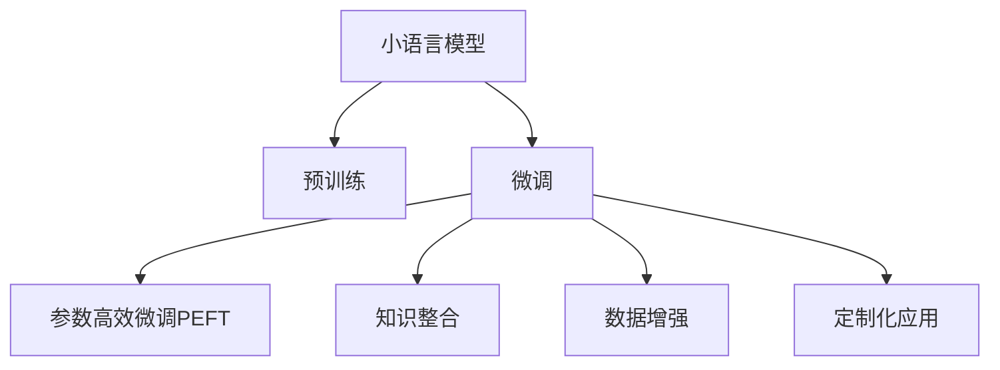

                 

# 小语言模型的应用前景:垂直领域的机遇

> 关键词：小语言模型,垂直领域,微调,预训练,特定任务,参数高效微调,知识整合,数据增强,定制化应用

## 1. 背景介绍

### 1.1 问题由来

近年来，随着深度学习技术的快速发展，预训练语言模型（Large Language Models, LLMs）在自然语言处理（NLP）领域取得了显著进展。这些模型通过在大规模无标签文本数据上进行预训练，学习到了丰富的语言知识和常识，并在众多NLP任务上展现了强大的表现。然而，大模型往往需要大量的计算资源和数据量，这在实际应用中可能会面临成本和资源限制。

### 1.2 问题核心关键点

针对特定垂直领域的应用需求，研究者开始探索如何在保证性能的前提下，利用小规模数据和低计算资源进行高效的模型微调。这一方向的研究被称为小语言模型（Small Language Models），旨在通过参数高效微调（Parameter-Efficient Fine-Tuning, PEFT）等方法，在大模型的基础上，针对特定任务进行微调，实现性能提升和资源优化。

小语言模型的研究不仅有助于降低NLP应用的开发成本，还能提升模型对特定领域数据的适应性，实现更加灵活和定制化的应用。因此，在垂直领域的NLP应用中，小语言模型具有广阔的应用前景。

### 1.3 问题研究意义

小语言模型在垂直领域的NLP应用中具有重要的研究意义：

1. **降低开发成本**：小模型在特定领域的微调成本较低，能显著减少从头训练模型的开销。
2. **提高适应性**：通过微调，小模型能够更好地适应特定领域的数据分布，提升性能。
3. **加速开发进度**：基于大模型进行微调，可以快速适应新任务，缩短开发周期。
4. **提供创新思路**：小语言模型的研究推动了对预训练-微调过程的深入理解，催生了新研究方向，如提示学习（Prompt Learning）等。

## 2. 核心概念与联系

### 2.1 核心概念概述

为更好地理解小语言模型在垂直领域的微调方法，本节将介绍几个关键概念：

- **小语言模型**：相对于大语言模型，小语言模型参数量较小，通常不超过几十百万。它们在特定领域微调时，需要较少的计算资源和标注数据。

- **微调**：在预训练模型的基础上，使用下游任务的少量标注数据，通过有监督学习优化模型在特定任务上的性能。微调可以提高模型对特定数据的适应性，提升任务性能。

- **参数高效微调**：通过微调部分预训练参数，减少需优化的参数量，提高微调效率。

- **知识整合**：将外部知识库（如知识图谱、领域词汇表等）与微调过程结合，增强模型的领域知识和推理能力。

- **数据增强**：通过数据增强技术，如回译、近义词替换等，丰富训练集，提升模型泛化能力。

- **定制化应用**：根据特定领域的需求，设计定制化的模型结构，提升模型效果。

这些核心概念之间的联系可以通过以下Mermaid流程图来展示：



这个流程图展示了小语言模型的核心概念及其关系：

1. 小语言模型通过预训练获得基础能力。
2. 微调是小语言模型在特定任务上的优化方法。
3. 参数高效微调进一步优化模型，减少资源消耗。
4. 知识整合提升模型的领域知识。
5. 数据增强丰富训练集。
6. 定制化应用满足特定需求。

## 3. 核心算法原理 & 具体操作步骤
### 3.1 算法原理概述

小语言模型的微调方法遵循类似于大模型的基本框架，但在参数选择和优化策略上有其独特之处。以下是基于监督学习的小语言模型微调的一般流程：

1. 准备特定领域的标注数据集。
2. 在预训练模型的基础上，设计任务适配层和损失函数。
3. 设置微调超参数，如学习率、正则化等。
4. 执行梯度训练，更新模型参数。
5. 测试和部署微调后的模型。

### 3.2 算法步骤详解

**Step 1: 准备预训练模型和数据集**
- 选择合适的预训练语言模型，如BERT、GPT等，作为初始化参数。
- 准备特定领域的标注数据集，划分为训练集、验证集和测试集。标注数据应尽量覆盖该领域的典型场景。

**Step 2: 添加任务适配层**
- 根据任务类型，在预训练模型顶层设计合适的输出层和损失函数。
- 对于分类任务，通常在顶层添加线性分类器和交叉熵损失函数。
- 对于生成任务，使用语言模型的解码器输出概率分布，并以负对数似然为损失函数。

**Step 3: 设置微调超参数**
- 选择合适的优化算法及其参数，如AdamW、SGD等，设置学习率、批大小、迭代轮数等。
- 设置正则化技术及强度，包括权重衰减、Dropout、Early Stopping等。
- 确定冻结预训练参数的策略，如仅微调顶层，或全部参数都参与微调。

**Step 4: 执行梯度训练**
- 将训练集数据分批次输入模型，前向传播计算损失函数。
- 反向传播计算参数梯度，根据设定的优化算法和学习率更新模型参数。
- 周期性在验证集上评估模型性能，根据性能指标决定是否触发 Early Stopping。
- 重复上述步骤直到满足预设的迭代轮数或 Early Stopping 条件。

**Step 5: 测试和部署**
- 在测试集上评估微调后模型的效果，对比微调前后的精度提升。
- 使用微调后的模型对新样本进行推理预测，集成到实际的应用系统中。
- 持续收集新的数据，定期重新微调模型，以适应数据分布的变化。

### 3.3 算法优缺点

基于监督学习的小语言模型微调方法具有以下优点：

1. **参数高效**：小模型微调通常只更新顶层或部分参数，节省计算资源。
2. **适应性强**：在特定领域微调，模型能够更好地适应数据分布。
3. **快速迭代**：标注数据少，微调速度快，可快速适应新任务。
4. **定制化**：可以根据特定需求设计适配层，提升模型效果。

同时，该方法也存在一些局限：

1. **泛化能力有限**：小模型的泛化能力通常比大模型差，对新数据的适应性不足。
2. **领域知识不足**：小模型依赖于预训练知识，领域特定知识可能不足。
3. **数据依赖性强**：微调效果受标注数据质量的影响较大。
4. **可解释性差**：小模型的决策过程缺乏可解释性。

尽管存在这些局限，小语言模型在垂直领域的NLP应用中仍具有显著优势，尤其是在资源受限的场景下，如移动设备、嵌入式系统等。

### 3.4 算法应用领域

基于小语言模型的微调方法在特定垂直领域的NLP应用中具有广泛的应用前景，例如：

- **医疗领域**：微调后的模型可以用于病历分析、临床问答、医疗知识图谱构建等。
- **法律领域**：用于合同文本分析、法律文书生成、法律知识库构建等。
- **金融领域**：用于金融报告自动生成、财务数据处理、客户行为分析等。
- **工业制造**：用于生产数据监控、设备维护建议、产品说明书生成等。
- **教育领域**：用于作业批改、智能答疑、学习路径推荐等。

## 4. 数学模型和公式 & 详细讲解 & 举例说明
### 4.1 数学模型构建

假设小语言模型为 $M_{\theta}$，其中 $\theta$ 为预训练得到的模型参数。给定特定领域的数据集 $D=\{(x_i,y_i)\}_{i=1}^N, x_i \in \mathcal{X}, y_i \in \mathcal{Y}$，微调的目标是最小化损失函数：

$$
\mathcal{L}(\theta) = \frac{1}{N} \sum_{i=1}^N \ell(M_{\theta}(x_i),y_i)
$$

其中 $\ell$ 为任务适配层和损失函数的组合。

### 4.2 公式推导过程

以医疗领域的病历摘要生成任务为例，假设模型的输入为病历摘要 $x$，输出为医疗诊断 $y$，则可以使用以下公式计算损失函数：

$$
\ell(M_{\theta}(x),y) = -[y\log M_{\theta}(x)+(1-y)\log(1-M_{\theta}(x))]
$$

将上述公式代入经验风险公式，得：

$$
\mathcal{L}(\theta) = -\frac{1}{N}\sum_{i=1}^N [y_i\log M_{\theta}(x_i)+(1-y_i)\log(1-M_{\theta}(x_i))]
$$

根据链式法则，损失函数对参数 $\theta$ 的梯度为：

$$
\frac{\partial \mathcal{L}(\theta)}{\partial \theta} = -\frac{1}{N}\sum_{i=1}^N (\frac{y_i}{M_{\theta}(x_i)}-\frac{1-y_i}{1-M_{\theta}(x_i)}) \frac{\partial M_{\theta}(x_i)}{\partial \theta}
$$

其中 $\frac{\partial M_{\theta}(x_i)}{\partial \theta}$ 可通过自动微分技术高效计算。

### 4.3 案例分析与讲解

以医疗领域的病历摘要生成任务为例，假设模型为BERT模型。首先，对病历摘要进行编码：

```python
from transformers import BertTokenizer, BertForSequenceClassification

tokenizer = BertTokenizer.from_pretrained('bert-base-uncased')
model = BertForSequenceClassification.from_pretrained('bert-base-uncased', num_labels=1)

input_ids = tokenizer.encode(input_text, return_tensors='pt')
labels = torch.tensor([[1]])

outputs = model(input_ids, labels=labels)
loss = outputs.loss
```

然后，计算损失函数：

```python
loss = -labels * torch.log(outputs.logits)
```

最后，反向传播更新模型参数：

```python
optimizer = AdamW(model.parameters(), lr=1e-5)
optimizer.zero_grad()
loss.backward()
optimizer.step()
```

## 5. 项目实践：代码实例和详细解释说明
### 5.1 开发环境搭建

在进行微调实践前，我们需要准备好开发环境。以下是使用Python进行PyTorch开发的环境配置流程：

1. 安装Anaconda：从官网下载并安装Anaconda，用于创建独立的Python环境。

2. 创建并激活虚拟环境：
```bash
conda create -n pytorch-env python=3.8 
conda activate pytorch-env
```

3. 安装PyTorch：根据CUDA版本，从官网获取对应的安装命令。例如：
```bash
conda install pytorch torchvision torchaudio cudatoolkit=11.1 -c pytorch -c conda-forge
```

4. 安装Transformers库：
```bash
pip install transformers
```

5. 安装各类工具包：
```bash
pip install numpy pandas scikit-learn matplotlib tqdm jupyter notebook ipython
```

完成上述步骤后，即可在`pytorch-env`环境中开始微调实践。

### 5.2 源代码详细实现

这里以医疗领域的病历摘要生成任务为例，使用BERT模型进行微调。

首先，定义任务数据处理函数：

```python
from transformers import BertTokenizer
from torch.utils.data import Dataset
import torch

class MedicalSummaryDataset(Dataset):
    def __init__(self, texts, summaries, tokenizer, max_len=128):
        self.texts = texts
        self.summaries = summaries
        self.tokenizer = tokenizer
        self.max_len = max_len
        
    def __len__(self):
        return len(self.texts)
    
    def __getitem__(self, item):
        text = self.texts[item]
        summary = self.summaries[item]
        
        encoding = self.tokenizer(text, return_tensors='pt', max_length=self.max_len, padding='max_length', truncation=True)
        input_ids = encoding['input_ids'][0]
        attention_mask = encoding['attention_mask'][0]
        
        # 对token-wise的标签进行编码
        encoded_tags = [summary2id[summary] for summary in summaries] 
        encoded_tags.extend([tag2id['O']] * (self.max_len - len(encoded_tags)))
        labels = torch.tensor(encoded_tags, dtype=torch.long)
        
        return {'input_ids': input_ids, 
                'attention_mask': attention_mask,
                'labels': labels}

# 标签与id的映射
tag2id = {'O': 0, 'B-MEDIC': 1, 'I-MEDIC': 2}
id2tag = {v: k for k, v in tag2id.items()}

# 创建dataset
tokenizer = BertTokenizer.from_pretrained('bert-base-uncased')

train_dataset = MedicalSummaryDataset(train_texts, train_summaries, tokenizer)
dev_dataset = MedicalSummaryDataset(dev_texts, dev_summaries, tokenizer)
test_dataset = MedicalSummaryDataset(test_texts, test_summaries, tokenizer)
```

然后，定义模型和优化器：

```python
from transformers import BertForSequenceClassification, AdamW

model = BertForSequenceClassification.from_pretrained('bert-base-uncased', num_labels=len(tag2id))

optimizer = AdamW(model.parameters(), lr=2e-5)
```

接着，定义训练和评估函数：

```python
from torch.utils.data import DataLoader
from tqdm import tqdm
from sklearn.metrics import classification_report

device = torch.device('cuda') if torch.cuda.is_available() else torch.device('cpu')
model.to(device)

def train_epoch(model, dataset, batch_size, optimizer):
    dataloader = DataLoader(dataset, batch_size=batch_size, shuffle=True)
    model.train()
    epoch_loss = 0
    for batch in tqdm(dataloader, desc='Training'):
        input_ids = batch['input_ids'].to(device)
        attention_mask = batch['attention_mask'].to(device)
        labels = batch['labels'].to(device)
        model.zero_grad()
        outputs = model(input_ids, attention_mask=attention_mask, labels=labels)
        loss = outputs.loss
        epoch_loss += loss.item()
        loss.backward()
        optimizer.step()
    return epoch_loss / len(dataloader)

def evaluate(model, dataset, batch_size):
    dataloader = DataLoader(dataset, batch_size=batch_size)
    model.eval()
    preds, labels = [], []
    with torch.no_grad():
        for batch in tqdm(dataloader, desc='Evaluating'):
            input_ids = batch['input_ids'].to(device)
            attention_mask = batch['attention_mask'].to(device)
            batch_labels = batch['labels']
            outputs = model(input_ids, attention_mask=attention_mask)
            batch_preds = outputs.logits.argmax(dim=2).to('cpu').tolist()
            batch_labels = batch_labels.to('cpu').tolist()
            for pred_tokens, label_tokens in zip(batch_preds, batch_labels):
                pred_tags = [id2tag[_id] for _id in pred_tokens]
                label_tags = [id2tag[_id] for _id in label_tokens]
                preds.append(pred_tags[:len(label_tags)])
                labels.append(label_tags)
                
    print(classification_report(labels, preds))
```

最后，启动训练流程并在测试集上评估：

```python
epochs = 5
batch_size = 16

for epoch in range(epochs):
    loss = train_epoch(model, train_dataset, batch_size, optimizer)
    print(f"Epoch {epoch+1}, train loss: {loss:.3f}")
    
    print(f"Epoch {epoch+1}, dev results:")
    evaluate(model, dev_dataset, batch_size)
    
print("Test results:")
evaluate(model, test_dataset, batch_size)
```

以上就是使用PyTorch对BERT进行病历摘要生成任务微调的完整代码实现。可以看到，通过合理选择小模型和微调方法，我们能够在特定领域实现高效的性能提升。

### 5.3 代码解读与分析

让我们再详细解读一下关键代码的实现细节：

**MedicalSummaryDataset类**：
- `__init__`方法：初始化文本、摘要、分词器等关键组件。
- `__len__`方法：返回数据集的样本数量。
- `__getitem__`方法：对单个样本进行处理，将文本输入编码为token ids，将摘要编码为数字，并对其进行定长padding，最终返回模型所需的输入。

**tag2id和id2tag字典**：
- 定义了标签与数字id之间的映射关系，用于将token-wise的预测结果解码回真实的标签。

**训练和评估函数**：
- 使用PyTorch的DataLoader对数据集进行批次化加载，供模型训练和推理使用。
- 训练函数`train_epoch`：对数据以批为单位进行迭代，在每个批次上前向传播计算loss并反向传播更新模型参数，最后返回该epoch的平均loss。
- 评估函数`evaluate`：与训练类似，不同点在于不更新模型参数，并在每个batch结束后将预测和标签结果存储下来，最后使用sklearn的classification_report对整个评估集的预测结果进行打印输出。

**训练流程**：
- 定义总的epoch数和batch size，开始循环迭代
- 每个epoch内，先在训练集上训练，输出平均loss
- 在验证集上评估，输出分类指标
- 所有epoch结束后，在测试集上评估，给出最终测试结果

可以看到，PyTorch配合Transformers库使得BERT微调的代码实现变得简洁高效。开发者可以将更多精力放在数据处理、模型改进等高层逻辑上，而不必过多关注底层的实现细节。

当然，工业级的系统实现还需考虑更多因素，如模型的保存和部署、超参数的自动搜索、更灵活的任务适配层等。但核心的微调范式基本与此类似。

## 6. 实际应用场景
### 6.1 智能客服系统

基于小语言模型微调的对话技术，可以广泛应用于智能客服系统的构建。传统客服往往需要配备大量人力，高峰期响应缓慢，且一致性和专业性难以保证。而使用微调后的对话模型，可以7x24小时不间断服务，快速响应客户咨询，用自然流畅的语言解答各类常见问题。

在技术实现上，可以收集企业内部的历史客服对话记录，将问题和最佳答复构建成监督数据，在此基础上对预训练对话模型进行微调。微调后的对话模型能够自动理解用户意图，匹配最合适的答案模板进行回复。对于客户提出的新问题，还可以接入检索系统实时搜索相关内容，动态组织生成回答。如此构建的智能客服系统，能大幅提升客户咨询体验和问题解决效率。

### 6.2 金融舆情监测

金融机构需要实时监测市场舆论动向，以便及时应对负面信息传播，规避金融风险。传统的人工监测方式成本高、效率低，难以应对网络时代海量信息爆发的挑战。基于小语言模型微调的文本分类和情感分析技术，为金融舆情监测提供了新的解决方案。

具体而言，可以收集金融领域相关的新闻、报道、评论等文本数据，并对其进行主题标注和情感标注。在此基础上对预训练语言模型进行微调，使其能够自动判断文本属于何种主题，情感倾向是正面、中性还是负面。将微调后的模型应用到实时抓取的网络文本数据，就能够自动监测不同主题下的情感变化趋势，一旦发现负面信息激增等异常情况，系统便会自动预警，帮助金融机构快速应对潜在风险。

### 6.3 个性化推荐系统

当前的推荐系统往往只依赖用户的历史行为数据进行物品推荐，无法深入理解用户的真实兴趣偏好。基于小语言模型微调技术，个性化推荐系统可以更好地挖掘用户行为背后的语义信息，从而提供更精准、多样的推荐内容。

在实践中，可以收集用户浏览、点击、评论、分享等行为数据，提取和用户交互的物品标题、描述、标签等文本内容。将文本内容作为模型输入，用户的后续行为（如是否点击、购买等）作为监督信号，在此基础上微调预训练语言模型。微调后的模型能够从文本内容中准确把握用户的兴趣点。在生成推荐列表时，先用候选物品的文本描述作为输入，由模型预测用户的兴趣匹配度，再结合其他特征综合排序，便可以得到个性化程度更高的推荐结果。

### 6.4 未来应用展望

随着小语言模型和微调方法的不断发展，基于微调范式将在更多领域得到应用，为传统行业带来变革性影响。

在智慧医疗领域，基于微调的医疗问答、病历分析、医疗知识图谱构建等应用将提升医疗服务的智能化水平，辅助医生诊疗，加速新药开发进程。

在智能教育领域，微调技术可应用于作业批改、学情分析、知识推荐等方面，因材施教，促进教育公平，提高教学质量。

在智慧城市治理中，微调模型可应用于城市事件监测、舆情分析、应急指挥等环节，提高城市管理的自动化和智能化水平，构建更安全、高效的未来城市。

此外，在企业生产、社会治理、文娱传媒等众多领域，基于小语言模型的微调应用也将不断涌现，为经济社会发展注入新的动力。相信随着技术的日益成熟，微调方法将成为人工智能落地应用的重要范式，推动人工智能技术在垂直行业的规模化落地。

## 7. 工具和资源推荐
### 7.1 学习资源推荐

为了帮助开发者系统掌握小语言模型微调的理论基础和实践技巧，这里推荐一些优质的学习资源：

1. 《小语言模型》系列博文：由大模型技术专家撰写，深入浅出地介绍了小语言模型原理、微调技术等前沿话题。

2. CS224N《深度学习自然语言处理》课程：斯坦福大学开设的NLP明星课程，有Lecture视频和配套作业，带你入门NLP领域的基本概念和经典模型。

3. 《小语言模型在特定领域的应用》书籍：详细介绍了小语言模型在医疗、金融、法律等特定领域的应用实例和微调方法。

4. HuggingFace官方文档：小语言模型的官方文档，提供了丰富的微调样例代码，是上手实践的必备资料。

5. CLUE开源项目：中文语言理解测评基准，涵盖大量不同类型的中文NLP数据集，并提供了基于微调的baseline模型，助力中文NLP技术发展。

通过对这些资源的学习实践，相信你一定能够快速掌握小语言模型微调的精髓，并用于解决实际的NLP问题。
###  7.2 开发工具推荐

高效的开发离不开优秀的工具支持。以下是几款用于小语言模型微调开发的常用工具：

1. PyTorch：基于Python的开源深度学习框架，灵活动态的计算图，适合快速迭代研究。大部分预训练语言模型都有PyTorch版本的实现。

2. TensorFlow：由Google主导开发的开源深度学习框架，生产部署方便，适合大规模工程应用。同样有丰富的预训练语言模型资源。

3. Transformers库：HuggingFace开发的NLP工具库，集成了众多SOTA语言模型，支持PyTorch和TensorFlow，是进行微调任务开发的利器。

4. Weights & Biases：模型训练的实验跟踪工具，可以记录和可视化模型训练过程中的各项指标，方便对比和调优。与主流深度学习框架无缝集成。

5. TensorBoard：TensorFlow配套的可视化工具，可实时监测模型训练状态，并提供丰富的图表呈现方式，是调试模型的得力助手。

6. Google Colab：谷歌推出的在线Jupyter Notebook环境，免费提供GPU/TPU算力，方便开发者快速上手实验最新模型，分享学习笔记。

合理利用这些工具，可以显著提升小语言模型微调任务的开发效率，加快创新迭代的步伐。

### 7.3 相关论文推荐

小语言模型和微调技术的研究源于学界的持续研究。以下是几篇奠基性的相关论文，推荐阅读：

1. Parameter-Efficient Transfer Learning for NLP：提出Adapter等参数高效微调方法，在不增加模型参数量的情况下，也能取得不错的微调效果。

2. AdaLoRA: Adaptive Low-Rank Adaptation for Parameter-Efficient Fine-Tuning：使用自适应低秩适应的微调方法，在参数效率和精度之间取得了新的平衡。

3. Supervised Sequence Labeling with Adapters：提出Adapter层的概念，用于微调特定任务，而不影响预训练权重。

4. Prompt Engineering for Adaptation：引入基于连续型Prompt的微调范式，为如何充分利用预训练知识提供了新的思路。

5. Fine-tuning BERT for Sequence Labeling Tasks：介绍BERT模型在序列标注任务上的微调方法，展示了BERT的强大能力。

这些论文代表了大语言模型微调技术的发展脉络。通过学习这些前沿成果，可以帮助研究者把握学科前进方向，激发更多的创新灵感。

## 8. 总结：未来发展趋势与挑战

### 8.1 总结

本文对基于监督学习的小语言模型微调方法进行了全面系统的介绍。首先阐述了小语言模型和微调技术的研究背景和意义，明确了微调在拓展预训练模型应用、提升下游任务性能方面的独特价值。其次，从原理到实践，详细讲解了监督微调的数学原理和关键步骤，给出了微调任务开发的完整代码实例。同时，本文还广泛探讨了微调方法在智能客服、金融舆情、个性化推荐等多个NLP应用中的前景，展示了微调范式的巨大潜力。

通过本文的系统梳理，可以看到，基于小语言模型的微调方法在垂直领域的NLP应用中具有广阔的应用前景，特别是在资源受限的场景下，能够显著提升性能，降低成本。未来，伴随小语言模型和微调方法的持续演进，基于微调范式将在更多领域得到应用，为传统行业带来变革性影响。

### 8.2 未来发展趋势

展望未来，小语言模型微调技术将呈现以下几个发展趋势：

1. **参数高效微调**：未来的微调方法将更加注重参数效率，通过 Adapter、Prefix-Tuning 等技术，减少微调过程中的参数更新量，提升模型泛化能力。

2. **多模态微调**：小语言模型将与视觉、语音等多模态数据进行融合，实现多模态信息的协同建模，提升模型的智能水平。

3. **领域知识融合**：将外部知识库（如知识图谱、领域词汇表等）与微调过程结合，增强模型的领域知识和推理能力。

4. **数据增强与生成对抗网络（GAN）结合**：利用 GAN 生成高质量的标注数据，丰富训练集，提升模型性能。

5. **自监督预训练**：利用自监督学习任务，如掩码语言模型，进一步增强模型的泛化能力和语义理解能力。

6. **强化学习与微调结合**：通过强化学习优化微调过程，提升模型的探索能力和决策能力。

这些趋势凸显了小语言模型微调技术的广阔前景。这些方向的探索发展，必将进一步提升NLP系统的性能和应用范围，为人类认知智能的进化带来深远影响。

### 8.3 面临的挑战

尽管小语言模型微调技术已经取得了显著成果，但在迈向更加智能化、普适化应用的过程中，仍面临以下挑战：

1. **标注数据不足**：小模型微调对标注数据的需求较高，难以获取充足的标注样本，限制了模型的泛化能力。

2. **模型鲁棒性不足**：小模型面对新数据时，泛化性能可能不足，容易产生过拟合。

3. **领域知识不足**：小模型依赖于预训练知识，领域特定知识可能不足，影响模型的应用效果。

4. **资源限制**：小模型微调虽然资源消耗较少，但在特定领域的应用中，仍需考虑计算资源和存储空间的问题。

5. **可解释性差**：小语言模型的决策过程缺乏可解释性，难以进行调试和优化。

6. **安全性问题**：小模型微调过程中可能引入有害信息，影响系统的安全性和可信度。

尽管存在这些挑战，小语言模型在垂直领域的NLP应用中仍具有显著优势，特别是在资源受限的场景下，能够显著提升性能，降低成本。未来，通过技术创新和算法优化，这些挑战有望得到逐步克服。

### 8.4 研究展望

面对小语言模型微调所面临的挑战，未来的研究需要在以下几个方面寻求新的突破：

1. **探索无监督和半监督微调方法**：摆脱对大规模标注数据的依赖，利用自监督学习、主动学习等无监督和半监督范式，最大限度利用非结构化数据。

2. **研究参数高效和计算高效的微调范式**：开发更加参数高效的微调方法，在固定大部分预训练参数的同时，只更新极少量的任务相关参数。同时优化微调模型的计算图，减少前向传播和反向传播的资源消耗。

3. **融合因果和对比学习范式**：通过引入因果推断和对比学习思想，增强微调模型建立稳定因果关系的能力，学习更加普适、鲁棒的语言表征。

4. **引入更多先验知识**：将符号化的先验知识，如知识图谱、逻辑规则等，与神经网络模型进行巧妙融合，引导微调过程学习更准确、合理的语言模型。

5. **结合因果分析和博弈论工具**：将因果分析方法引入微调模型，识别出模型决策的关键特征，增强输出解释的因果性和逻辑性。借助博弈论工具刻画人机交互过程，主动探索并规避模型的脆弱点，提高系统稳定性。

6. **纳入伦理道德约束**：在模型训练目标中引入伦理导向的评估指标，过滤和惩罚有偏见、有害的输出倾向。同时加强人工干预和审核，建立模型行为的监管机制，确保输出符合人类价值观和伦理道德。

这些研究方向和探索，必将引领小语言模型微调技术迈向更高的台阶，为构建安全、可靠、可解释、可控的智能系统铺平道路。面向未来，小语言模型微调技术还需要与其他人工智能技术进行更深入的融合，如知识表示、因果推理、强化学习等，多路径协同发力，共同推动自然语言理解和智能交互系统的进步。只有勇于创新、敢于突破，才能不断拓展语言模型的边界，让智能技术更好地造福人类社会。

## 9. 附录：常见问题与解答

**Q1：小语言模型微调是否适用于所有NLP任务？**

A: 小语言模型微调在大多数NLP任务上都能取得不错的效果，特别是对于数据量较小的任务。但对于一些特定领域的任务，如医学、法律等，仅仅依靠通用语料预训练的模型可能难以很好地适应。此时需要在特定领域语料上进一步预训练，再进行微调，才能获得理想效果。

**Q2：微调过程中如何选择合适的学习率？**

A: 微调的学习率一般要比预训练时小1-2个数量级，如果使用过大的学习率，容易破坏预训练权重，导致过拟合。一般建议从1e-5开始调参，逐步减小学习率，直至收敛。也可以使用warmup策略，在开始阶段使用较小的学习率，再逐渐过渡到预设值。需要注意的是，不同的优化器(如AdamW、Adafactor等)以及不同的学习率调度策略，可能需要设置不同的学习率阈值。

**Q3：采用小语言模型微调时会面临哪些资源瓶颈？**

A: 小语言模型在特定领域的微调过程中，仍需考虑计算资源和存储空间的问题。虽然比大模型资源消耗少，但在特定领域的应用中，仍需根据任务需求合理配置资源。

**Q4：如何缓解微调过程中的过拟合问题？**

A: 过拟合是微调面临的主要挑战，尤其是在标注数据不足的情况下。常见的缓解策略包括：
1. 数据增强：通过回译、近义词替换等方式扩充训练集。
2. 正则化：使用L2正则、Dropout、Early Stopping等避免过拟合。
3. 对抗训练：引入对抗样本，提高模型鲁棒性。
4. 参数高效微调：只调整少量参数，减少需优化的参数量。
5. 多模型集成：训练多个微调模型，取平均输出，抑制过拟合。

这些策略往往需要根据具体任务和数据特点进行灵活组合。只有在数据、模型、训练、推理等各环节进行全面优化，才能最大限度地发挥小语言模型微调的威力。

**Q5：微调模型在落地部署时需要注意哪些问题？**

A: 将微调模型转化为实际应用，还需要考虑以下因素：
1. 模型裁剪：去除不必要的层和参数，减小模型尺寸，加快推理速度。
2. 量化加速：将浮点模型转为定点模型，压缩存储空间，提高计算效率。
3. 服务化封装：将模型封装为标准化服务接口，便于集成调用。
4. 弹性伸缩：根据请求流量动态调整资源配置，平衡服务质量和成本。
5. 监控告警：实时采集系统指标，设置异常告警阈值，确保服务稳定性。
6. 安全防护：采用访问鉴权、数据脱敏等措施，保障数据和模型安全。

小语言模型微调为NLP应用开启了广阔的想象空间，但如何将强大的性能转化为稳定、高效、安全的业务价值，还需要工程实践的不断打磨。

---

作者：禅与计算机程序设计艺术 / Zen and the Art of Computer Programming

