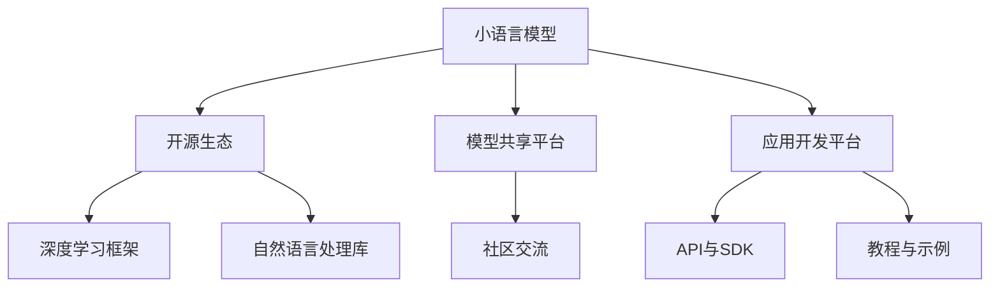

                 

# 小语言模型的开源生态:模型共享和应用开发平台

> 关键词：小语言模型,开源生态,模型共享,应用开发平台,深度学习,自然语言处理

## 1. 背景介绍

### 1.1 问题由来
在人工智能领域，深度学习尤其是自然语言处理(NLP)取得了巨大进展。然而，构建一个高效的NLP系统不仅仅是一个技术问题，更是需要一个强大的生态系统来支撑。对于大语言模型，尽管其具有强大的表征能力，但其部署和应用仍面临诸多挑战。为此，开源社区和学术界提出了一种基于小语言模型的解决方案，并逐渐形成了一个开放、协作的生态系统。

### 1.2 问题核心关键点
小语言模型(Bot)是由研究机构、公司或个人开发，专注于特定应用场景，并开放给公众使用的自然语言处理模型。这些模型通常具有高效率、高定制性和低复杂性，可以快速部署在各种NLP应用中。其核心关键点在于：

1. **开源**：模型代码和数据公开，便于研究者进一步改进。
2. **高定制性**：能够根据具体任务进行微调和优化。
3. **低复杂性**：模型规模较小，易于部署和维护。
4. **高效率**：部署快速，适用于各种设备。
5. **应用广泛**：可用于聊天机器人、智能客服、语音识别、情感分析等多种NLP应用。

这些特性使得小语言模型成为了构建NLP应用的重要基础。

### 1.3 问题研究意义
构建小语言模型的开源生态，对NLP领域具有重要意义：

1. **加速技术迭代**：开源社区的协作能够促进模型性能的快速提升和迭代更新。
2. **降低开发成本**：研究者可以基于已有模型快速构建新应用，节省时间和成本。
3. **提升系统鲁棒性**：社区的广泛应用使得模型能够在各种环境中测试和优化，提高系统稳定性。
4. **推动标准化**：标准化的模型接口和API有助于构建更一致和互操作性的NLP系统。
5. **推动产业化**：开源生态的蓬勃发展能够推动NLP技术在更多行业的应用和普及。

## 2. 核心概念与联系

### 2.1 核心概念概述

为了更好地理解小语言模型的开源生态，我们需要理解以下几个核心概念：

- **小语言模型(Bot)**：专注于特定应用场景，可自定义配置，具备高效率和低复杂性的NLP模型。
- **开源生态**：基于社区驱动的模型开发、共享和应用环境，包括模型、工具、文档和支持。
- **模型共享平台**：提供模型下载、版本管理、文档展示和社区交流的平台。
- **应用开发平台**：基于模型构建NLP应用的开发环境，提供API、SDK、教程和示例。
- **深度学习框架**：如TensorFlow、PyTorch等，提供模型的实现和训练工具。
- **自然语言处理库**：如spaCy、NLTK等，提供文本处理、分析等基本功能。

这些概念之间的逻辑关系可以通过以下Mermaid流程图来展示：



这个流程图展示小语言模型在开源生态中的核心概念及其之间的关系：

1. 小语言模型基于开源生态进行开发，具备高效率和低复杂性。
2. 模型共享平台提供了模型的下载和管理，社区交流提供了模型性能优化和更新。
3. 应用开发平台提供了构建NLP应用的基础API和SDK，以及丰富的教程和示例。
4. 深度学习框架和自然语言处理库为模型开发提供了底层支持。

## 3. 核心算法原理 & 具体操作步骤
### 3.1 算法原理概述

小语言模型的开源生态是基于深度学习和自然语言处理的，其核心算法原理与大语言模型类似，但更加注重模型的可定制性和效率。主要包括以下几个方面：

1. **预训练模型**：使用大规模语料进行预训练，学习通用的语言表征。
2. **微调优化**：根据具体任务需求，对模型进行微调，优化模型性能。
3. **模型压缩**：减小模型规模，提高模型部署效率。
4. **模型迁移**：将模型迁移到不同的平台和设备，支持多环境部署。
5. **数据增强**：通过数据扩充和增强技术，提升模型泛化能力。

### 3.2 算法步骤详解

以下是小语言模型在开源生态中开发和应用的一般步骤：

**Step 1: 模型设计与预训练**

1. 定义模型的任务和功能需求。
2. 选择合适的深度学习框架和自然语言处理库，设计模型架构。
3. 使用大规模语料进行预训练，学习通用的语言表征。

**Step 2: 模型微调和优化**

1. 根据具体任务需求，选择合适的数据集和标签。
2. 将预训练模型作为初始参数，使用微调算法优化模型性能。
3. 应用正则化、Dropout、Early Stopping等技术，避免过拟合。

**Step 3: 模型压缩与部署**

1. 对模型进行参数裁剪和量化，减小模型规模。
2. 使用模型压缩工具，如TensorFlow Lite、ONNX等，生成适合不同设备的模型。
3. 部署模型到服务器、移动设备、嵌入式设备等。

**Step 4: 模型共享与应用开发**

1. 将模型上传到开源模型共享平台，提供模型下载和版本管理。
2. 在应用开发平台基于模型构建NLP应用，使用API和SDK开发。
3. 使用文档和教程，帮助开发者快速上手，提供示例代码和应用场景。

**Step 5: 社区反馈与迭代**

1. 通过社区反馈，收集用户使用数据和改进建议。
2. 持续迭代和优化模型，提升模型性能和应用效果。
3. 发布新版本模型，更新API和SDK。

### 3.3 算法优缺点

小语言模型在开源生态中应用，具有以下优点：

1. **高效率**：小模型规模较小，部署和训练速度较快。
2. **高定制性**：可针对特定应用场景进行微调和优化。
3. **低复杂性**：模型结构简单，易于维护和更新。
4. **广泛应用**：适用于多种NLP应用，如聊天机器人、智能客服、情感分析等。

同时，这些小语言模型也存在一些局限性：

1. **数据依赖**：小模型通常在特定数据集上训练，对数据质量有较高要求。
2. **模型鲁棒性**：模型规模小，对噪声和干扰敏感。
3. **性能上限**：相对于大模型，小模型在复杂任务上性能有限。
4. **更新频率**：需要频繁迭代和更新，以保持模型性能。

### 3.4 算法应用领域

小语言模型在开源生态中已经应用于多个领域，包括但不限于：

- **智能客服**：通过小模型构建智能客服系统，提升客户咨询体验。
- **金融舆情监测**：利用小模型分析金融市场舆情，辅助金融决策。
- **医疗问答**：基于小模型构建医疗问答系统，辅助医生诊疗。
- **情感分析**：对社交媒体和用户评论进行情感分析，识别用户情绪。
- **机器翻译**：构建小规模语言模型进行机器翻译。

除了上述这些经典应用外，小语言模型还被创新性地应用于更多场景中，如语音识别、推荐系统、知识图谱等，为NLP技术带来了新的突破。

## 4. 数学模型和公式 & 详细讲解 & 举例说明

### 4.1 数学模型构建

在本节中，我们将详细讲解小语言模型在开源生态中的数学模型构建。

假设小语言模型为$f(x; \theta)$，其中$x$为输入文本，$\theta$为模型参数。模型的输出为$y=f(x; \theta)$。根据具体任务，可以选择不同的损失函数$\mathcal{L}(y, t)$，其中$t$为真实标签。

小语言模型的训练目标为最小化损失函数：

$$
\mathop{\min}_{\theta} \mathcal{L}(f(x; \theta), t)
$$

在深度学习框架中，使用反向传播算法计算损失函数的梯度，并使用优化算法如AdamW、SGD等更新模型参数。

### 4.2 公式推导过程

以下是小语言模型在开源生态中训练的数学公式推导过程：

1. **损失函数推导**：

假设模型为二分类任务，输出$f(x; \theta) \in [0, 1]$，真实标签$t \in \{0, 1\}$。则二分类交叉熵损失函数定义为：

$$
\ell(f(x; \theta), t) = -[t\log f(x; \theta) + (1-t)\log(1-f(x; \theta))]
$$

2. **梯度计算**：

通过反向传播算法计算损失函数对模型参数$\theta$的梯度：

$$
\frac{\partial \mathcal{L}(f(x; \theta), t)}{\partial \theta} = -[t \frac{\partial f(x; \theta)}{\partial \theta} - (1-t) \frac{\partial f(x; \theta)}{\partial \theta}]
$$

其中$\frac{\partial f(x; \theta)}{\partial \theta}$为模型输出对参数$\theta$的偏导数。

3. **模型更新**：

根据梯度计算结果，使用优化算法更新模型参数：

$$
\theta \leftarrow \theta - \eta \nabla_{\theta}\mathcal{L}(f(x; \theta), t)
$$

其中$\eta$为学习率，$\nabla_{\theta}\mathcal{L}(f(x; \theta), t)$为损失函数对模型参数的梯度。

### 4.3 案例分析与讲解

以情感分析任务为例，展示小语言模型的训练过程：

1. **数据准备**：准备情感标注数据集，如IMDb影评数据集。
2. **模型设计**：使用深度学习框架定义模型架构，如卷积神经网络。
3. **预训练**：使用大规模语料进行预训练，学习通用语言表征。
4. **微调**：在情感标注数据集上进行微调，优化模型性能。
5. **评估与部署**：使用测试集评估模型性能，并部署到生产环境。

## 5. 项目实践：代码实例和详细解释说明

### 5.1 开发环境搭建

在进行小语言模型开发前，需要搭建好开发环境。以下是使用Python进行TensorFlow开发的环境配置流程：

1. 安装Anaconda：从官网下载并安装Anaconda，用于创建独立的Python环境。

2. 创建并激活虚拟环境：
```bash
conda create -n tf-env python=3.8 
conda activate tf-env
```

3. 安装TensorFlow：根据CUDA版本，从官网获取对应的安装命令。例如：
```bash
conda install tensorflow==2.8 -c pytorch -c conda-forge
```

4. 安装自然语言处理库：
```bash
pip install spacy
pip install nltk
```

5. 安装TensorBoard：用于监控模型训练过程。

完成上述步骤后，即可在`tf-env`环境中开始模型开发。

### 5.2 源代码详细实现

以下是使用TensorFlow构建小语言模型的Python代码实现：

```python
import tensorflow as tf
from tensorflow.keras.models import Sequential
from tensorflow.keras.layers import Embedding, Dense, Conv1D, MaxPooling1D, GlobalMaxPooling1D, Dropout

model = Sequential()
model.add(Embedding(input_dim=10000, output_dim=128, input_length=500))
model.add(Conv1D(128, 5, activation='relu'))
model.add(MaxPooling1D(pool_size=4))
model.add(Dropout(0.2))
model.add(GlobalMaxPooling1D())
model.add(Dense(64, activation='relu'))
model.add(Dense(1, activation='sigmoid'))

model.compile(loss='binary_crossentropy', optimizer='adam', metrics=['accuracy'])

model.summary()
```

在代码中，我们定义了一个基于卷积神经网络的小语言模型，并编译了损失函数、优化器和评估指标。

### 5.3 代码解读与分析

以下是代码中关键部分的详细解读：

1. **模型定义**：使用`Sequential`模型定义了一个包含嵌入层、卷积层、池化层、Dropout层和全连接层的卷积神经网络。
2. **输入处理**：使用`Embedding`层将文本转换为向量表示。
3. **卷积层**：使用`Conv1D`层进行特征提取。
4. **池化层**：使用`MaxPooling1D`层对特征进行降维。
5. **Dropout层**：使用`Dropout`层防止过拟合。
6. **全连接层**：使用`Dense`层进行分类。
7. **编译**：使用`compile`方法编译模型，并设置损失函数、优化器和评估指标。

### 5.4 运行结果展示

在训练完毕后，可以使用以下代码评估模型性能：

```python
test_loss, test_acc = model.evaluate(x_test, y_test)
print('Test accuracy:', test_acc)
```

## 6. 实际应用场景

### 6.1 智能客服系统

基于小语言模型的开源生态，可以构建高效智能客服系统。传统客服依赖人力，高峰期响应缓慢，难以满足客户需求。小语言模型可以7x24小时不间断服务，快速响应客户咨询，提升客户满意度。

在实践中，可以收集企业内部的历史客服对话记录，将问题和最佳答复构建成监督数据，训练小语言模型。模型能够自动理解用户意图，匹配最合适的答复。对于新问题，还可以接入检索系统实时搜索相关内容，动态组织生成回答。

### 6.2 金融舆情监测

金融机构需要实时监测市场舆情，及时应对负面信息传播，规避金融风险。传统的人工监测方式成本高、效率低，难以应对海量信息爆发的挑战。小语言模型可以分析金融领域相关新闻、报道、评论等文本数据，自动判断舆情倾向，提高监测效率。

### 6.3 个性化推荐系统

当前的推荐系统依赖用户历史行为数据进行推荐，无法深入挖掘用户兴趣。小语言模型可以整合用户文本内容，结合自然语言处理技术，深度挖掘用户兴趣，提供更精准的推荐内容。

在实践中，收集用户浏览、点击、评论、分享等行为数据，提取文本内容，使用小语言模型进行情感分析和主题分类，结合用户行为数据进行推荐排序，生成个性化推荐列表。

### 6.4 未来应用展望

随着小语言模型和开源生态的不断发展，未来将涌现更多创新应用：

1. **多模态NLP**：将视觉、语音等多模态数据与文本数据结合，构建更全面的NLP应用。
2. **知识图谱**：整合知识图谱与小语言模型，提升模型的常识推理能力。
3. **边缘计算**：将小语言模型部署到边缘设备，提升系统响应速度和数据安全。
4. **实时交互**：利用小语言模型构建实时互动的对话系统，提升用户体验。
5. **增强学习**：将小语言模型与增强学习结合，提升模型的适应能力和智能水平。

## 7. 工具和资源推荐

### 7.1 学习资源推荐

为了帮助开发者系统掌握小语言模型的开发和应用，推荐以下学习资源：

1. **《TensorFlow官方文档》**：TensorFlow的官方文档，提供详细的API参考和示例代码。
2. **《深度学习入门与实践》**：介绍深度学习基础和常用框架，适合初学者入门。
3. **《Python自然语言处理》**：讲解自然语言处理基本概念和常用库。
4. **《自然语言处理综述》**：综述自然语言处理领域的研究进展和技术趋势。

### 7.2 开发工具推荐

使用以下工具，可以高效地进行小语言模型的开发和应用：

1. **TensorFlow**：开源的深度学习框架，提供丰富的模型和工具。
2. **Jupyter Notebook**：交互式的编程环境，便于模型开发和实验。
3. **Git**：版本控制系统，便于协作和迭代开发。
4. **AWS SageMaker**：云端机器学习平台，提供丰富的资源和服务。
5. **Google Colab**：免费的Jupyter Notebook环境，支持GPU/TPU算力。

### 7.3 相关论文推荐

小语言模型和开源生态的研究方向涵盖了自然语言处理、深度学习等多个领域。以下是几篇相关论文，推荐阅读：

1. **Attention is All You Need**：Transformer论文，提出自注意力机制，开启了NLP领域的预训练模型时代。
2. **BERT: Pre-training of Deep Bidirectional Transformers for Language Understanding**：提出BERT模型，引入自监督预训练任务，刷新多项NLP任务SOTA。
3. **Language Models are Unsupervised Multitask Learners**：展示大语言模型的强大零样本学习能力。
4. **Parameter-Efficient Transfer Learning for NLP**：提出Adapter等参数高效微调方法，在不增加模型参数量的情况下，仍能取得不错的微调效果。
5. **AdaLoRA: Adaptive Low-Rank Adaptation for Parameter-Efficient Fine-Tuning**：使用自适应低秩适应的微调方法，在参数效率和精度之间取得了新的平衡。

这些论文代表了大语言模型微调技术的发展脉络，深入理解这些前沿成果，可以帮助研究者把握学科前进方向，激发更多的创新灵感。

## 8. 总结：未来发展趋势与挑战

### 8.1 总结

本文对小语言模型在开源生态中的开发和应用进行了全面系统的介绍。首先，阐述了小语言模型的定义和应用场景，明确了其在NLP领域的重要价值。其次，从原理到实践，详细讲解了小语言模型的开发和应用过程，给出了完整的代码实例。同时，本文还广泛探讨了小语言模型在智能客服、金融舆情、个性化推荐等多种NLP领域的应用前景，展示了小语言模型的广阔应用空间。此外，本文精选了小语言模型及其开源生态的学习资源，力求为开发者提供全方位的技术指引。

通过本文的系统梳理，可以看到，小语言模型在开源生态中为NLP领域带来了全新的解决方案。得益于其高效率、高定制性和低复杂性，小语言模型可以广泛应用于各种NLP应用中，显著提升系统性能和用户体验。未来，随着小语言模型和开源生态的不断演进，NLP技术必将迈向更广泛的应用领域，为人类社会带来更深远的影响。

### 8.2 未来发展趋势

展望未来，小语言模型和开源生态将呈现以下几个发展趋势：

1. **模型规模持续增大**：随着算力成本的下降和数据规模的扩张，小语言模型的参数量还将持续增长。超大模量的模型将能够学习更加丰富的语言表征。
2. **模型压缩和量化**：通过模型压缩和量化技术，减小模型规模，提升部署效率。
3. **多模态融合**：将视觉、语音等多模态数据与文本数据结合，提升模型的泛化能力和应用范围。
4. **增强学习**：将小语言模型与增强学习结合，提升模型的适应能力和智能水平。
5. **实时交互**：利用小语言模型构建实时互动的对话系统，提升用户体验。
6. **知识图谱**：整合知识图谱与小语言模型，提升模型的常识推理能力。

以上趋势凸显了小语言模型在开源生态中的广阔前景。这些方向的探索发展，必将进一步提升NLP系统的性能和应用范围，为人类社会带来更深入的影响。

### 8.3 面临的挑战

尽管小语言模型和开源生态已经取得了显著进展，但在迈向更加智能化、普适化应用的过程中，仍然面临诸多挑战：

1. **数据依赖**：小模型通常在特定数据集上训练，对数据质量有较高要求。获取高质量标注数据仍需耗费大量人力和时间。
2. **模型鲁棒性**：模型规模小，对噪声和干扰敏感。如何在不增加模型规模的情况下提高模型鲁棒性，仍然是一个挑战。
3. **部署效率**：小语言模型需要在多个设备和平台上部署，资源优化技术仍然有待提升。
4. **知识整合**：小语言模型需要与外部知识库、规则库等专家知识结合，形成更加全面、准确的信息整合能力，还需要更多的研究和探索。
5. **模型更新频率**：小语言模型需要频繁迭代和更新，以保持模型性能。如何在不破坏模型原有性能的情况下，进行快速更新，仍然是一个挑战。

### 8.4 研究展望

面对小语言模型和开源生态面临的挑战，未来的研究需要在以下几个方面寻求新的突破：

1. **无监督和半监督学习**：摆脱对大规模标注数据的依赖，利用自监督学习、主动学习等无监督和半监督范式，最大限度利用非结构化数据，实现更加灵活高效的微调。
2. **多模态融合**：将视觉、语音等多模态数据与文本数据结合，提升模型的泛化能力和应用范围。
3. **知识图谱整合**：将知识图谱与小语言模型结合，提升模型的常识推理能力。
4. **实时交互**：利用小语言模型构建实时互动的对话系统，提升用户体验。
5. **边缘计算**：将小语言模型部署到边缘设备，提升系统响应速度和数据安全。
6. **增强学习**：将小语言模型与增强学习结合，提升模型的适应能力和智能水平。

这些研究方向将推动小语言模型和开源生态的发展，带来更广阔的应用前景和更深入的影响。

## 9. 附录：常见问题与解答

**Q1：小语言模型与大语言模型有什么区别？**

A: 小语言模型和大语言模型在规模、定制性和应用场景上有所不同：

1. **规模**：小语言模型规模较小，训练和部署效率高；大语言模型规模较大，具有更强的表征能力。
2. **定制性**：小语言模型针对特定应用场景进行微调和优化，灵活性高；大语言模型通常具备更通用的语言表征。
3. **应用场景**：小语言模型适用于实时互动、个性化推荐等场景；大语言模型适用于复杂的语言理解和生成任务。

**Q2：如何选择合适的小语言模型？**

A: 选择小语言模型时，需要考虑以下几个因素：

1. **任务类型**：根据具体任务需求选择适合的模型。
2. **数据规模**：根据数据规模选择合适的模型，小模型在大规模数据上表现更佳。
3. **部署要求**：根据部署环境选择适合的模型，如边缘计算等。
4. **开发者经验**：选择开发者熟悉和易于上手的模型。

**Q3：小语言模型如何进行参数压缩？**

A: 小语言模型的参数压缩方法包括：

1. **剪枝**：删除模型中不重要的权重，减小模型规模。
2. **量化**：将浮点模型转为定点模型，压缩存储空间，提高计算效率。
3. **蒸馏**：使用教师模型指导学生模型的训练，减小模型规模。

**Q4：小语言模型在开源生态中的优势和劣势是什么？**

A: 小语言模型在开源生态中的优势包括：

1. **高效率**：小模型规模较小，训练和部署效率高。
2. **高定制性**：可针对特定应用场景进行微调和优化。
3. **低复杂性**：模型结构简单，易于维护和更新。

劣势包括：

1. **数据依赖**：小模型通常在特定数据集上训练，对数据质量有较高要求。
2. **模型鲁棒性**：模型规模小，对噪声和干扰敏感。
3. **性能上限**：相对于大模型，小模型在复杂任务上性能有限。

**Q5：小语言模型在开源生态中如何迭代更新？**

A: 小语言模型在开源生态中的迭代更新通常包括：

1. **社区反馈**：通过社区反馈收集用户使用数据和改进建议。
2. **模型优化**：对模型进行参数裁剪、剪枝、量化等优化，减小模型规模。
3. **版本管理**：使用版本控制系统管理模型更新，提供新旧版本对比。
4. **文档更新**：更新文档和教程，帮助开发者快速上手。

---

作者：禅与计算机程序设计艺术 / Zen and the Art of Computer Programming

