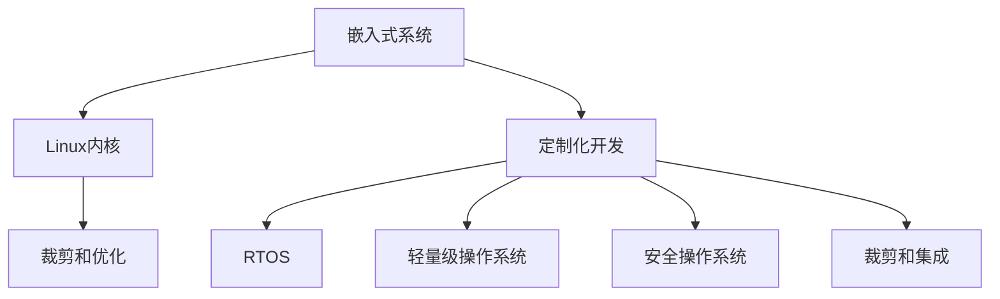

                 

# 嵌入式 Linux 定制：为设备优化 Linux

> 关键词：嵌入式系统, Linux, 定制化开发, 实时性, 轻量级, 安全, 定制优化, 开发者工具, 自动化测试, 原型设计, 资源管理

## 1. 背景介绍

### 1.1 问题由来

在嵌入式领域，尤其是物联网、工业控制等对实时性和资源要求极高的场景下，传统的通用操作系统如Windows、MacOS无法满足需求，而基于Linux内核的定制操作系统成为了一种理想的解决方案。嵌入式Linux系统通过优化内核、裁剪系统模块、裁剪库等手段，大幅提高了系统的性能和安全性，从而在工业自动化、汽车电子、医疗设备等领域获得了广泛的应用。

然而，由于嵌入式设备的硬件资源和应用需求各不相同，如何针对特定设备进行高效、安全的Linux定制，仍然是一个复杂而繁琐的过程。对于缺乏专业知识的开发者来说，从0开始搭建和定制Linux操作系统往往需要大量的时间和精力，且容易出现错误和遗漏，难以满足实际需求。

### 1.2 问题核心关键点

本节将介绍嵌入式Linux定制的核心关键点，包括：
- 定制化开发与通用开发的区别
- 硬件平台与Linux内核的交互方式
- 定制化开发的步骤和流程
- 嵌入式Linux系统的常见优化策略
- 嵌入式Linux开发中常用的工具和资源

这些核心点将帮助读者理解嵌入式Linux定制的复杂性和挑战，并为后续的内容做准备。

## 2. 核心概念与联系

### 2.1 核心概念概述

为更好地理解嵌入式Linux定制，本节将介绍几个密切相关的核心概念：

- **嵌入式系统**：指运行在特定硬件环境下的计算机系统，强调硬件与软件的紧密结合。
- **Linux内核**：基于Unix内核的现代操作系统内核，具有高度的灵活性和可定制性。
- **定制化开发**：根据硬件平台和应用需求对Linux内核、库文件、应用程序进行裁剪、编译、集成等操作，以达到特定的性能和功能目标。
- **实时操作系统（RTOS）**：指能够在严格时间限制内完成指定任务的操作系统，强调系统的响应时间和调度效率。
- **轻量级操作系统**：指在资源占用、启动时间、执行效率等方面都相对较轻的操作系统。
- **安全操作系统**：指对系统访问进行严格控制，防止恶意代码和未授权访问，保证系统的安全性和可靠性。

这些核心概念之间的逻辑关系可以通过以下Mermaid流程图来展示：



这个流程图展示了几者之间的逻辑关系：

1. 嵌入式系统通过裁剪和优化Linux内核，增强系统的实时性、安全性、轻量级等特性。
2. 定制化开发包括裁剪、编译、集成等步骤，以满足特定硬件和应用需求。
3. RTOS、轻量级操作系统和安全操作系统等特性，都是通过定制化开发得到的。

## 3. 核心算法原理 & 具体操作步骤
### 3.1 算法原理概述

嵌入式Linux定制的核心算法原理基于Linux内核的可定制性和硬件平台的特性。通过裁剪和优化Linux内核的各个组件，以及针对具体应用场景进行配置和集成，使得系统能够在资源有限的环境中高效运行，同时满足实时性、安全性和轻量级等需求。

### 3.2 算法步骤详解

嵌入式Linux定制的基本步骤如下：

1. **硬件平台选型**：根据应用场景选择合适的嵌入式硬件平台，确定CPU架构、存储容量、接口类型等。
2. **内核选择**：选择适合硬件平台的内核版本，考虑稳定性和功能需求。
3. **裁剪内核**：根据硬件资源和应用需求，裁剪内核模块，保留必要的组件。
4. **编译内核**：使用交叉编译工具链，将裁剪后的内核编译为目标平台的二进制文件。
5. **集成库文件和应用**：根据应用需求选择合适的库文件和应用程序，进行编译集成。
6. **配置和优化**：对内核、库文件和应用程序进行配置和优化，包括设置启动参数、优化调度算法、增加缓存等。
7. **测试和验证**：在测试环境中运行系统，验证系统的稳定性和性能。
8. **部署和维护**：将系统部署到实际应用环境中，进行持续的维护和更新。

### 3.3 算法优缺点

嵌入式Linux定制的优点包括：
- 高度灵活性：可以根据硬件平台和应用需求自由定制系统。
- 稳定性和安全性：通过裁剪和优化，避免不必要的组件和库文件，减少漏洞和安全隐患。
- 高性能和轻量级：优化后的系统在资源有限的环境中能够高效运行。

同时，该方法也存在一些缺点：
- 定制难度高：需要对Linux内核和硬件平台有深入的理解和经验。
- 开发周期长：定制过程涉及裁剪、编译、集成等多个环节，开发周期较长。
- 依赖工具链：需要选择合适的交叉编译工具链和开发环境。
- 兼容性问题：裁剪后的内核和库文件可能不兼容某些特定应用。

尽管存在这些局限性，但嵌入式Linux定制仍是工业领域广泛采用的一种操作系统方案，其灵活性和可定制性为系统开发和应用提供了极大的便利。

### 3.4 算法应用领域

嵌入式Linux定制广泛应用于各种嵌入式设备和系统，例如：

- 工业控制：如PLC、SCADA系统等，需要实时响应的控制算法和高稳定性。
- 汽车电子：如仪表盘、车载导航等，需要轻量级且安全的系统。
- 医疗设备：如心电图机、手术机器人等，需要实时数据处理和安全性。
- 物联网：如智能家居、智能穿戴设备等，需要高效通信和低功耗。

## 4. 数学模型和公式 & 详细讲解 & 举例说明

### 4.1 数学模型构建

本节将使用数学语言对嵌入式Linux定制的算法过程进行更加严格的刻画。

设嵌入式系统需要定制的内核版本为 $L$，裁剪后保留的模块为 $M$，编译后的内核文件为 $K$，库文件为 $S$，应用程序为 $A$。定义系统优化后的响应时间为 $T$，系统稳定运行的时间为 $U$，系统资源占用率 $\epsilon$，系统安全性评估分数为 $F$。

优化目标为：

$$
\min_{M,K,S,A} \left( \max_{L,T,U,F,\epsilon} \{ T+U+F+\epsilon \} \right)
$$

其中，目标函数 $f(M,K,S,A)$ 包括：
- $T$：优化后的响应时间
- $U$：系统稳定运行时间
- $F$：系统安全性评估分数
- $\epsilon$：系统资源占用率

约束条件为：
- $M$：裁剪后保留的模块集
- $K$：编译后的内核文件
- $S$：库文件
- $A$：应用程序

优化过程需要综合考虑上述因素，以达到最优的系统性能和安全性。

### 4.2 公式推导过程

以下我们以系统响应时间为优化目标，推导最小化响应时间的数学公式。

设优化后的系统响应时间为 $T$，系统可运行的任务数量为 $N$，系统执行每个任务的时间为 $t_i$，系统初始化时间为 $t_0$，系统运行周期为 $T_{cycle}$，系统时间片大小为 $t_{frame}$，系统调度算法为 $Sched$。优化目标为：

$$
\min_{N,t_i,t_0,t_{frame},Sched} T
$$

根据上述公式，我们需要寻找最优的任务数量 $N$、任务执行时间 $t_i$、系统初始化时间 $t_0$、时间片大小 $t_{frame}$ 和调度算法 $Sched$，以最小化系统响应时间 $T$。

假设任务执行时间是随机分布的，且满足一定的概率密度函数 $p(t_i)$，系统运行周期 $T_{cycle}$ 与时间片大小 $t_{frame}$ 成正比，即 $T_{cycle} = k \cdot t_{frame}$，其中 $k$ 为常数。则响应时间 $T$ 可以表示为：

$$
T = N \cdot t_i + t_0 + k \cdot t_{frame}
$$

在约束条件下，$N$ 和 $t_i$ 是决策变量，$t_0$、$t_{frame}$ 和调度算法 $Sched$ 是已定参数。最优解需要在满足性能要求的前提下，尽可能减小 $T$。

### 4.3 案例分析与讲解

假设我们要对一款低功耗的嵌入式设备进行Linux定制，该设备需要运行实时监控应用，且资源非常有限。以下是一个具体的案例分析：

**案例背景**：一款用于工业现场的嵌入式设备，CPU为ARM Cortex-M3，存储容量为64KB，接口类型为串口和以太网。该设备需要运行实时监控应用，要求高稳定性、低功耗和快速响应。

**优化目标**：最小化系统响应时间，提高系统稳定性，降低功耗。

**优化步骤**：

1. **内核裁剪**：裁剪掉不必要的外围驱动、文件系统和其他系统模块，保留必要的内核组件。例如，裁剪掉网络协议栈、文件系统，保留基本的调度、中断处理、定时器等功能。

2. **内核编译**：使用交叉编译工具链，将裁剪后的内核编译为ARM Cortex-M3的兼容格式。

3. **库文件选择**：选择必要的库文件，例如标准库、实用库和第三方库。根据应用需求，保留必要的函数和数据结构，去除不必要的库文件。

4. **应用程序集成**：将实时监控应用集成到系统，并进行优化。例如，采用轻量级的数据格式和通信协议，减少内存占用和通信延迟。

5. **调度算法优化**：采用实时调度算法，如时间片轮转、优先级调度等，保证系统的实时响应和稳定性。

6. **资源优化**：通过优化内存分配、缓存管理等手段，进一步减少系统的资源占用。

通过上述步骤，该设备最终实现了一个响应时间在1ms以内的实时监控系统，满足了实际应用的需求。

## 5. 项目实践：代码实例和详细解释说明

### 5.1 开发环境搭建

在进行嵌入式Linux定制之前，我们需要准备好开发环境。以下是使用Linux进行嵌入式开发的环境配置流程：

1. **安装交叉编译工具链**：在开发主机上安装支持目标平台的交叉编译工具链，例如arm-linux-gnueabihf-gcc。

2. **搭建交叉开发环境**：在开发主机上搭建交叉开发环境，包括编译器、调试器、库文件等。

3. **创建虚拟机或物理机**：在开发主机上创建虚拟化环境或直接使用物理机进行嵌入式开发。

4. **连接目标平台**：将目标平台通过串口或其他方式连接到开发主机。

5. **配置网络环境**：在开发主机上配置网络环境，确保能够访问目标平台的网络资源。

完成上述步骤后，即可在虚拟机或物理机上开始嵌入式Linux定制的开发工作。

### 5.2 源代码详细实现

下面我们以嵌入式Linux定制的基本步骤为例，给出详细的代码实现。

**内核裁剪**：

```bash
# 从预编译的内核中裁剪必要的部分
cp -f arch/arm/Makefile arch/arm/
# 编辑arch/arm/Makefile，删除不必要的目标
sed -i 's#.*#symvers.o##' arch/arm/Makefile
```

**内核编译**：

```bash
# 配置交叉编译环境
export CROSS_COMPILE=arm-linux-gnueabihf-
# 编译内核
make ARCH=arm CROSS_COMPILE=$CROSS_COMPILE -j4
```

**库文件选择和集成**：

```bash
# 选择需要集成的库文件
cp /usr/lib/libstdc++.so.6 /usr/lib/libstdc++.a
# 编译应用程序
gcc -o application application.c -lstdc++
```

### 5.3 代码解读与分析

让我们再详细解读一下关键代码的实现细节：

**内核裁剪**：
- `cp -f`：复制必要的内核文件，保留原有的文件结构。
- `sed`：修改Makefile，删除不必要的目标文件。

**内核编译**：
- `export CROSS_COMPILE`：设置交叉编译环境变量。
- `make`：使用Makefile编译内核，并指定CPU架构和交叉编译环境。

**库文件选择和集成**：
- `cp`：复制选择的库文件，确保应用程序可以正常运行。
- `gcc`：编译应用程序，并指定需要的库文件。

通过上述代码，可以实现对嵌入式Linux系统的基本裁剪和编译集成，以满足实际应用需求。

### 5.4 运行结果展示

运行裁剪和编译后的嵌入式Linux系统，可以验证其响应时间和稳定性是否满足设计要求。例如，通过监控工具可以观察系统的响应时间、内存占用、CPU负载等指标，确保系统运行稳定。

## 6. 实际应用场景

### 6.1 工业控制

嵌入式Linux定制在工业控制领域具有广泛的应用。工业控制设备需要实时响应的控制算法和高稳定性，如PLC、SCADA系统等。通过定制化开发，可以为不同的工业场景提供最优的解决方案。

### 6.2 汽车电子

汽车电子系统需要高安全性和实时性，如仪表盘、车载导航等。通过定制化开发，可以实现轻量级、高效的嵌入式Linux系统，满足汽车电子的特定需求。

### 6.3 医疗设备

医疗设备需要高稳定性和实时数据处理，如心电图机、手术机器人等。通过定制化开发，可以为医疗设备提供高稳定性、低功耗的嵌入式Linux系统。

### 6.4 物联网

物联网设备需要高效率和低功耗，如智能家居、智能穿戴设备等。通过定制化开发，可以实现高效率、低功耗的嵌入式Linux系统，满足物联网设备的特定需求。

## 7. 工具和资源推荐

### 7.1 学习资源推荐

为了帮助开发者系统掌握嵌入式Linux定制的理论基础和实践技巧，这里推荐一些优质的学习资源：

1. **嵌入式Linux开发手册**：系统介绍了嵌入式Linux开发的各个环节，包括硬件平台选型、内核裁剪、库文件选择、应用程序集成等。

2. **RTOS设计原理与实现**：介绍了实时操作系统的设计原理和实现方法，适合理解嵌入式Linux定制中的实时性和调度算法。

3. **嵌入式系统设计指南**：涵盖嵌入式系统的各个方面，包括硬件设计、软件架构、开发工具等。

4. **U-Boot源码解析**：解析了U-Boot引导加载器的源码，适合理解嵌入式Linux定制中的引导加载过程。

5. **Yocto Project官方文档**：介绍了Yocto开发平台的使用方法和实践案例，适合系统学习嵌入式Linux开发流程。

通过对这些资源的学习实践，相信你一定能够快速掌握嵌入式Linux定制的精髓，并用于解决实际的嵌入式系统问题。

### 7.2 开发工具推荐

高效的开发离不开优秀的工具支持。以下是几款用于嵌入式Linux定制开发的常用工具：

1. **U-Boot**：用于嵌入式Linux系统引导加载的开源项目，支持多种CPU架构和开发板。

2. **Yocto Project**：基于Linux内核的开放式开发平台，提供了一整套工具链和开发环境。

3. **QEMU**：用于模拟嵌入式Linux系统的开源项目，支持多种CPU架构和虚拟机。

4. **GDB**：嵌入式Linux系统调试的常用工具，支持多种CPU架构和调试模式。

5. **CLion**：基于JETBrains的IDE，支持嵌入式Linux开发的调试和测试。

6. **AVD Manager**：Android虚拟设备管理器，支持多种嵌入式开发板和调试工具。

合理利用这些工具，可以显著提升嵌入式Linux定制任务的开发效率，加快创新迭代的步伐。

### 7.3 相关论文推荐

嵌入式Linux定制技术的发展源于学界的持续研究。以下是几篇奠基性的相关论文，推荐阅读：

1. **Linux内核裁剪与优化技术研究**：介绍了Linux内核裁剪与优化的技术和方法，适合理解嵌入式Linux定制的基本流程。

2. **实时嵌入式Linux系统优化**：介绍了实时嵌入式Linux系统的优化方法和实践案例，适合理解嵌入式Linux定制中的实时性和调度算法。

3. **嵌入式Linux定制与移植**：介绍了嵌入式Linux定制与移植的技术和方法，适合理解嵌入式Linux定制的基本流程。

4. **嵌入式系统性能优化**：介绍了嵌入式系统性能优化的技术和方法，适合理解嵌入式Linux定制中的性能优化策略。

5. **嵌入式Linux系统安全性研究**：介绍了嵌入式Linux系统的安全性评估方法和实践案例，适合理解嵌入式Linux定制中的安全性需求。

这些论文代表了大规模嵌入式Linux定制技术的发展脉络。通过学习这些前沿成果，可以帮助研究者把握学科前进方向，激发更多的创新灵感。

## 8. 总结：未来发展趋势与挑战

### 8.1 研究成果总结

本文对嵌入式Linux定制进行了全面系统的介绍。首先阐述了嵌入式Linux定制的背景和意义，明确了嵌入式Linux定制在工业自动化、汽车电子、医疗设备等领域的重要价值。其次，从原理到实践，详细讲解了嵌入式Linux定制的数学模型和关键步骤，给出了定制任务开发的完整代码实例。同时，本文还广泛探讨了嵌入式Linux定制在多个行业领域的应用前景，展示了定制范式的巨大潜力。此外，本文精选了嵌入式Linux定制的各类学习资源，力求为读者提供全方位的技术指引。

通过本文的系统梳理，可以看到，嵌入式Linux定制技术正在成为嵌入式系统开发的重要范式，极大地拓展了Linux操作系统的应用边界，催生了更多的落地场景。受益于嵌入式Linux定制技术的不断发展，相信嵌入式系统将在更广阔的应用领域大放异彩。

### 8.2 未来发展趋势

展望未来，嵌入式Linux定制技术将呈现以下几个发展趋势：

1. **硬件兼容性增强**：未来的嵌入式Linux系统将能够支持更多种类的硬件平台，提高系统的通用性和兼容性。

2. **定制化水平提高**：随着嵌入式Linux开发工具的不断完善，开发者可以更快速、更高效地进行定制化开发。

3. **安全性进一步提升**：未来的嵌入式Linux系统将具备更强的安全性，通过完善的权限管理、安全策略等手段，保护系统的安全。

4. **轻量级系统优化**：未来的嵌入式Linux系统将更加轻量级，通过优化系统架构、优化资源管理等手段，提高系统的性能和响应时间。

5. **实时性和稳定性增强**：未来的嵌入式Linux系统将具备更强的实时性和稳定性，通过优化调度算法、优化内存管理等手段，提高系统的响应性和可靠性。

6. **定制化开发自动化**：未来的嵌入式Linux系统将实现定制化开发的自动化，通过配置管理工具、自动化构建工具等手段，提高开发效率和质量。

以上趋势凸显了嵌入式Linux定制技术的广阔前景。这些方向的探索发展，必将进一步提升嵌入式系统的性能和应用范围，为嵌入式系统的智能化、自动化提供新的技术路径。

### 8.3 面临的挑战

尽管嵌入式Linux定制技术已经取得了显著进展，但在迈向更加智能化、普适化应用的过程中，它仍面临诸多挑战：

1. **硬件复杂性增加**：未来的嵌入式设备将具备更多复杂功能，硬件平台的多样性和复杂性将大大增加，开发难度也随之增加。

2. **系统资源限制**：嵌入式设备的资源有限，如何优化系统架构和资源管理，以满足更多的应用需求，仍是一个挑战。

3. **安全性问题**：随着嵌入式系统的应用场景不断扩展，安全性问题也将更加突出，系统需要具备更强的安全防护能力。

4. **开发者门槛高**：嵌入式Linux定制需要开发者具备一定的硬件和软件开发经验，门槛较高，需要更多技术人才的加入。

5. **工具和资源不足**：现有的嵌入式Linux开发工具和资源仍需要进一步丰富，以满足开发者的需求。

6. **性能优化困难**：尽管优化技术不断进步，但在极端资源限制下，如何进一步提升系统的性能，仍是一个难点。

正视嵌入式Linux定制面临的这些挑战，积极应对并寻求突破，将是大规模嵌入式Linux定制技术迈向成熟的必由之路。相信随着学界和产业界的共同努力，这些挑战终将一一被克服，嵌入式Linux定制必将在构建高性能、高稳定性、高安全性的嵌入式系统中发挥更大的作用。

### 8.4 研究展望

面向未来，嵌入式Linux定制技术需要在以下几个方面进行深入研究：

1. **硬件平台兼容性增强**：开发更加通用的嵌入式Linux定制工具和框架，支持更多硬件平台。

2. **安全性和隐私保护**：研究嵌入式Linux系统的安全性和隐私保护技术，构建更加安全的系统环境。

3. **高性能优化**：研究嵌入式Linux系统的高性能优化技术，提升系统的响应时间和稳定性。

4. **自动化和智能化**：开发嵌入式Linux定制的自动化和智能化工具，提高开发效率和质量。

5. **开发者工具链丰富**：开发更加易用、高效的嵌入式Linux开发工具链，降低开发门槛。

6. **多模态数据融合**：研究嵌入式Linux系统与多模态数据的融合技术，增强系统的智能性和适应性。

这些研究方向的探索，必将引领嵌入式Linux定制技术迈向更高的台阶，为构建高性能、高安全性的嵌入式系统提供新的技术路径。

## 9. 附录：常见问题与解答

**Q1: 嵌入式Linux定制与通用Linux开发有什么区别？**

A: 嵌入式Linux定制主要针对特定的硬件平台和应用需求，裁剪内核、库文件和应用程序，以达到最优的性能和稳定性。而通用Linux开发则面向广泛的应用场景，使用标准化的开发流程和工具链。嵌入式Linux定制需要考虑硬件特性、资源限制、实时性等因素，而通用Linux开发则更注重通用性和兼容性。

**Q2: 嵌入式Linux定制开发中，如何选择合适的硬件平台？**

A: 嵌入式Linux定制开发中，选择合适的硬件平台是至关重要的。需要考虑以下几点：
1. 目标应用场景：根据应用需求，选择适合硬件平台。
2. 性能要求：根据性能要求，选择高性能CPU和存储设备。
3. 成本和功耗：根据成本和功耗要求，选择适合的硬件平台。
4. 可维护性和升级性：根据可维护性和升级性要求，选择适合的硬件平台。

**Q3: 嵌入式Linux定制开发中，如何优化系统的响应时间？**

A: 嵌入式Linux定制开发中，优化系统的响应时间可以采用以下方法：
1. 裁剪不必要的模块和库文件，减少系统负担。
2. 优化调度算法，提高系统响应速度。
3. 使用更高效的代码和数据结构，减少系统运行时间。
4. 增加缓存和内存管理，提高系统响应效率。

**Q4: 嵌入式Linux定制开发中，如何保证系统的安全性？**

A: 嵌入式Linux定制开发中，保证系统的安全性需要考虑以下几点：
1. 进行系统的安全审计和漏洞扫描，及时修复漏洞。
2. 使用安全内核和库文件，避免系统被恶意代码攻击。
3. 对系统访问进行严格控制，防止未授权访问。
4. 使用加密和认证技术，保护数据和通信安全。

**Q5: 嵌入式Linux定制开发中，如何优化系统的稳定性？**

A: 嵌入式Linux定制开发中，优化系统的稳定性可以采用以下方法：
1. 使用稳定性和可靠性高的内核和库文件。
2. 进行全面的系统测试和验证，确保系统稳定运行。
3. 使用可靠性高的电源管理方案，确保系统稳定供电。
4. 使用热插拔和故障恢复机制，保证系统高可靠性。

通过上述方法，可以有效提升嵌入式Linux系统的稳定性和安全性，满足实际应用需求。

---

作者：禅与计算机程序设计艺术 / Zen and the Art of Computer Programming

