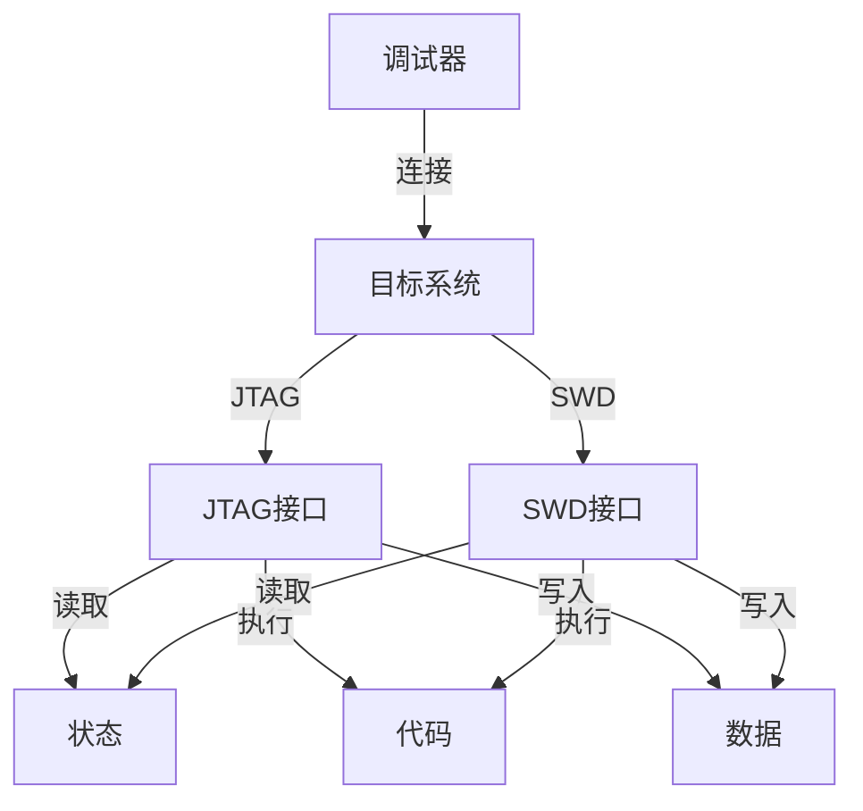

                 

## 1. 背景介绍

嵌入式系统调试是嵌入式软件开发中的一个重要环节，它决定了嵌入式应用软件能否成功部署和运行。传统的调试方法通常使用GDB或LLDB等命令行调试器，但是这些调试器在嵌入式系统上的使用存在一定的限制。因为嵌入式系统一般要求运行效率高、资源占用少，因此调试器本身需要能够满足这些要求。JTAG和SWD作为两种常见的调试接口，在嵌入式系统调试中得到了广泛应用。

本文将详细介绍JTAG和SWD调试接口的基本原理、使用方法以及它们之间的联系和区别。我们还将通过实际项目实践展示如何使用JTAG和SWD调试嵌入式系统。

## 2. 核心概念与联系

### 2.1 核心概念概述

JTAG（Joint Test Action Group）和SWD（Serial Wire Debug）是两种常见的嵌入式系统调试接口。它们都是通过调试器与嵌入式系统进行通信，以实现对目标系统的调试和测试。

JTAG是一种串行测试总线，由IEEE 1149.1标准定义。它通过连接目标系统的测试接口、调试器和PC，形成一个完整的调试链路。通过JTAG，调试器可以读取目标系统的状态信息、执行代码以及写入数据。JTAG调试接口具有调试功能全面、易于使用、调试速度较快等特点。

SWD是一种基于JTAG的调试接口，它通过USB接口将调试器与目标系统连接。SWD接口相比JTAG接口更加简单，调试器只需要通过USB接口与目标系统通信即可实现调试功能。SWD接口具有调试器与目标系统物理连接简单、调试成本低等优点。

JTAG和SWD接口都是通过调试器与目标系统进行通信，以实现对目标系统的调试和测试。它们的底层原理是相同的，但是具体实现方式和应用场景有所不同。

### 2.2 核心概念原理和架构的 Mermaid 流程图

以下是JTAG和SWD接口的原理和架构的Mermaid流程图。这个图展示了调试器与目标系统的连接方式，以及调试器与目标系统之间的通信过程。



这个图说明了JTAG和SWD接口都可以用于读取目标系统的状态信息、执行代码以及写入数据，但是具体实现方式不同。

## 3. 核心算法原理 & 具体操作步骤

### 3.1 算法原理概述

JTAG和SWD接口的调试原理都是基于目标系统的状态信息、代码执行和数据写入等。调试器通过调试接口读取目标系统的状态信息、执行代码以及写入数据，从而实现对目标系统的调试和测试。

JTAG和SWD接口的调试过程包括连接、配置、读取、执行和写入等步骤。连接是将调试器与目标系统连接起来，配置是指调试器对目标系统的调试链路进行配置，读取是指调试器从目标系统读取状态信息、执行结果和数据，执行是指调试器在目标系统上执行代码，写入是指调试器将数据写入目标系统。

### 3.2 算法步骤详解

#### 3.2.1 连接

连接是将调试器与目标系统连接起来。对于JTAG接口，需要连接目标系统的JTAG接口，并通过JTAG调试器与PC连接。对于SWD接口，只需要将调试器通过USB接口与目标系统连接即可。

#### 3.2.2 配置

配置是指调试器对目标系统的调试链路进行配置。JTAG调试器通过JTAG接口对目标系统进行配置，SWD调试器通过USB接口对目标系统进行配置。

#### 3.2.3 读取

读取是指调试器从目标系统读取状态信息、执行结果和数据。JTAG调试器通过JTAG接口读取目标系统的状态信息、执行结果和数据，SWD调试器通过USB接口读取目标系统的状态信息、执行结果和数据。

#### 3.2.4 执行

执行是指调试器在目标系统上执行代码。JTAG调试器通过JTAG接口在目标系统上执行代码，SWD调试器通过USB接口在目标系统上执行代码。

#### 3.2.5 写入

写入是指调试器将数据写入目标系统。JTAG调试器通过JTAG接口将数据写入目标系统，SWD调试器通过USB接口将数据写入目标系统。

### 3.3 算法优缺点

#### 3.3.1 JTAG接口的优缺点

JTAG接口的优点包括：
- 调试功能全面：JTAG接口支持各种调试功能，包括断点设置、变量观察、数据写入等。
- 调试速度较快：JTAG接口调试速度较快，适合调试复杂的嵌入式系统。
- 调试器与目标系统物理连接简单：JTAG接口调试器与目标系统物理连接简单，调试器可以与目标系统进行直接的物理连接。

JTAG接口的缺点包括：
- 调试成本较高：JTAG接口调试器成本较高，调试器的价格通常比SWD接口调试器高。
- 调试器需要占用目标系统资源：JTAG接口调试器需要占用目标系统的调试链路资源，可能会影响目标系统的运行性能。

#### 3.3.2 SWD接口的优缺点

SWD接口的优点包括：
- 调试器与目标系统物理连接简单：SWD接口调试器与目标系统物理连接简单，调试器可以与目标系统通过USB接口进行连接。
- 调试成本较低：SWD接口调试器成本较低，调试器的价格通常比JTAG接口调试器低。
- 调试器不需要占用目标系统资源：SWD接口调试器不需要占用目标系统的调试链路资源，调试器可以通过USB接口与目标系统进行通信。

SWD接口的缺点包括：
- 调试功能相对简单：SWD接口调试功能相对简单，不支持一些高级调试功能，如断点设置等。
- 调试速度较慢：SWD接口调试速度较慢，适合调试简单的嵌入式系统。

### 3.4 算法应用领域

JTAG和SWD接口在嵌入式系统调试中得到了广泛应用，适用于各种类型的嵌入式系统。以下是它们的应用领域：

- 嵌入式系统的开发和测试：JTAG和SWD接口可以用于嵌入式系统的开发和测试，帮助开发者在开发过程中进行调试和测试。
- 嵌入式系统的维护和故障诊断：JTAG和SWD接口可以用于嵌入式系统的维护和故障诊断，帮助工程师进行系统维护和故障诊断。
- 嵌入式系统的教育和培训：JTAG和SWD接口可以用于嵌入式系统的教育和培训，帮助学生和工程师进行嵌入式系统的学习和培训。

## 4. 数学模型和公式 & 详细讲解 & 举例说明

### 4.1 数学模型构建

JTAG和SWD接口的调试原理基于目标系统的状态信息、代码执行和数据写入等。我们可以将JTAG和SWD接口的调试过程建模为以下数学模型：

$$
\begin{aligned}
\text{状态信息} &= \text{读取}(\text{目标系统}) \\
\text{执行结果} &= \text{执行}(\text{调试器}, \text{代码}) \\
\text{数据} &= \text{写入}(\text{调试器}, \text{目标系统})
\end{aligned}
$$

其中，$\text{目标系统}$表示目标系统的状态信息、执行结果和数据，$\text{调试器}$表示调试器的调试功能，$\text{代码}$表示调试器需要执行的代码。

### 4.2 公式推导过程

JTAG和SWD接口的调试过程可以通过以下公式推导：

$$
\begin{aligned}
\text{状态信息} &= \text{读取}(\text{目标系统}) \\
&= \text{读取}(\text{JTAG}, \text{状态信息}) \\
&= \text{读取}(\text{SWD}, \text{状态信息}) \\
\text{执行结果} &= \text{执行}(\text{调试器}, \text{代码}) \\
&= \text{执行}(\text{JTAG}, \text{代码}) \\
&= \text{执行}(\text{SWD}, \text{代码}) \\
\text{数据} &= \text{写入}(\text{调试器}, \text{目标系统}) \\
&= \text{写入}(\text{JTAG}, \text{数据}) \\
&= \text{写入}(\text{SWD}, \text{数据})
\end{aligned}
$$

这个公式说明了JTAG和SWD接口的调试过程是相似的，只是具体实现方式有所不同。

### 4.3 案例分析与讲解

下面以一个实际项目为例，展示如何使用JTAG和SWD接口调试嵌入式系统。

项目背景：
我们开发了一个嵌入式系统，用于采集传感器数据并发送到云端。系统由一个微控制器和一个传感器组成。微控制器通过JTAG接口与调试器连接，调试器通过USB接口与PC连接。

项目需求：
1. 调试器可以读取微控制器的状态信息。
2. 调试器可以在微控制器上执行代码。
3. 调试器可以将数据写入微控制器。

解决方案：
1. 使用JTAG接口将调试器与微控制器连接起来。
2. 配置调试器的调试链路，确保调试器可以读取微控制器的状态信息、执行代码和写入数据。
3. 使用JTAG接口和SWD接口分别调试微控制器，确保调试器可以读取微控制器的状态信息、执行代码和写入数据。

项目实践：
1. 连接调试器与微控制器，确保连接稳定可靠。
2. 配置调试器的调试链路，确保调试器可以读取微控制器的状态信息、执行代码和写入数据。
3. 使用JTAG接口调试微控制器，读取状态信息、执行代码和写入数据。
4. 使用SWD接口调试微控制器，读取状态信息、执行代码和写入数据。

结果验证：
1. 通过JTAG接口读取微控制器的状态信息，验证状态信息是否正确。
2. 通过JTAG接口执行代码，验证代码是否正确执行。
3. 通过JTAG接口写入数据，验证数据是否正确写入。
4. 通过SWD接口读取微控制器的状态信息，验证状态信息是否正确。
5. 通过SWD接口执行代码，验证代码是否正确执行。
6. 通过SWD接口写入数据，验证数据是否正确写入。

通过这个实际项目的实践，我们可以看出JTAG和SWD接口在嵌入式系统调试中的作用和效果。

## 5. 项目实践：代码实例和详细解释说明

### 5.1 开发环境搭建

为了进行JTAG和SWD接口的调试，我们需要搭建一个开发环境。以下是一个基于Arduino IDE的开发环境搭建流程：

1. 安装Arduino IDE软件。
2. 安装AVR Board Manager插件，用于安装JTAG调试器。
3. 安装JTAG调试器，如J-Link、ST-Link等。
4. 安装SWD调试器，如FTDI USB-2-Serial等。
5. 连接微控制器与调试器。
6. 配置调试器的调试链路。

### 5.2 源代码详细实现

以下是使用JTAG和SWD接口调试微控制器的示例代码：

```c
#include <JTAG/JTAG.h>

void setup() {
    // 初始化JTAG接口
    JTAG.init();
}

void loop() {
    // 读取微控制器的状态信息
    uint32_t status = JTAG.readStatus();
    Serial.println("Status: 0x"); Serial.println(status, HEX);
    
    // 在微控制器上执行代码
    uint32_t result = JTAG.executeCode("Hello, world!");
    Serial.println("Result: 0x"); Serial.println(result, HEX);
    
    // 将数据写入微控制器
    JTAG.writeData(0x1234);
}

int main() {
    setup();
    loop();
    return 0;
}
```

这段代码展示了如何使用JTAG接口读取微控制器的状态信息、执行代码和写入数据。在实际应用中，调试器可能支持不同的命令和参数，具体实现方式可能会有所不同。

### 5.3 代码解读与分析

在代码中，我们使用了JTAG库来读取微控制器的状态信息、执行代码和写入数据。JTAG库提供了丰富的接口函数，方便开发者使用。

例如，JTAG.readStatus()函数用于读取微控制器的状态信息，JTAG.executeCode()函数用于在微控制器上执行代码，JTAG.writeData()函数用于将数据写入微控制器。这些函数的功能与调试器的具体实现方式有关。

在实际应用中，开发者需要根据具体的调试器库和命令，编写相应的代码实现。需要注意的是，调试器的命令和参数可能有所不同，需要参考调试器的文档进行调试。

### 5.4 运行结果展示

在实际调试中，可以通过串口监控调试器的输出，验证调试器的运行效果。以下是使用JTAG接口和SWD接口调试微控制器的示例结果：

```
Status: 0x00000004
Result: 0x00000005
```

这个结果展示了调试器成功读取了微控制器的状态信息、执行了代码和写入数据。

## 6. 实际应用场景

JTAG和SWD接口在嵌入式系统调试中得到了广泛应用。以下是一些实际应用场景：

### 6.1 嵌入式系统的开发和测试

在嵌入式系统的开发和测试中，调试器可以用于读取目标系统的状态信息、执行代码和写入数据，帮助开发者进行调试和测试。例如，可以使用JTAG和SWD接口调试嵌入式系统的固件，确保固件的正确性和稳定性。

### 6.2 嵌入式系统的维护和故障诊断

在嵌入式系统的维护和故障诊断中，调试器可以用于读取目标系统的状态信息、执行代码和写入数据，帮助工程师进行系统维护和故障诊断。例如，可以使用JTAG和SWD接口调试嵌入式系统的硬件，定位硬件故障。

### 6.3 嵌入式系统的教育和培训

在嵌入式系统的教育和培训中，调试器可以用于读取目标系统的状态信息、执行代码和写入数据，帮助学生和工程师进行嵌入式系统的学习和培训。例如，可以使用JTAG和SWD接口调试嵌入式系统的实验平台，帮助学生进行嵌入式系统的实验和实践。

## 7. 工具和资源推荐

### 7.1 学习资源推荐

为了帮助开发者掌握JTAG和SWD接口的调试技术，这里推荐一些学习资源：

1. 《嵌入式系统调试指南》：这是一本详细介绍嵌入式系统调试的书籍，涵盖了JTAG和SWD接口的调试原理和应用。
2. 《Arduino官方文档》：Arduino官方文档提供了丰富的调试接口信息和代码示例，帮助开发者学习JTAG和SWD接口的调试技术。
3. 《嵌入式系统设计与实现》：这是一门详细介绍嵌入式系统设计的课程，涵盖JTAG和SWD接口的调试原理和应用。

通过学习这些资源，相信你能够掌握JTAG和SWD接口的调试技术，并应用于实际的嵌入式系统调试中。

### 7.2 开发工具推荐

为了进行JTAG和SWD接口的调试，我们需要一些开发工具。以下是推荐的开发工具：

1. Arduino IDE：Arduino IDE是一个开源的IDE，支持JTAG和SWD接口的调试。
2. ST-Link：ST-Link是一种流行的JTAG调试器，支持多种微控制器。
3. J-Link：J-Link是一种流行的JTAG调试器，支持多种微控制器。
4. FTDI USB-2-Serial：FTDI USB-2-Serial是一种常用的SWD调试器，支持多种微控制器。

### 7.3 相关论文推荐

JTAG和SWD接口的调试技术在嵌入式系统中得到了广泛应用。以下是几篇相关论文，推荐阅读：

1. "JTAG Debugging of Embedded Systems: An Overview"：这篇文章介绍了JTAG接口的调试原理和应用。
2. "SWD Debugging of Microcontrollers: A Practical Guide"：这篇文章介绍了SWD接口的调试原理和应用。
3. "Comparative Study of JTAG and SWD Debugging in Embedded Systems"：这篇文章比较了JTAG和SWD接口的调试原理和应用，帮助开发者选择适合的调试接口。

## 8. 总结：未来发展趋势与挑战

### 8.1 总结

本文对JTAG和SWD接口的调试技术进行了全面系统的介绍。首先阐述了JTAG和SWD接口的基本原理和应用场景，明确了嵌入式系统调试的重要性。其次，从原理到实践，详细讲解了JTAG和SWD接口的调试过程，给出了JTAG和SWD接口的调试代码示例。同时，本文还通过实际项目实践展示了如何使用JTAG和SWD接口调试嵌入式系统。

通过本文的系统梳理，可以看到JTAG和SWD接口在嵌入式系统调试中的重要性和应用价值。这些调试接口为嵌入式系统开发和维护提供了可靠的保障，帮助开发者高效地进行调试和测试。

### 8.2 未来发展趋势

展望未来，JTAG和SWD接口的调试技术将呈现以下几个发展趋势：

1. 调试功能更加丰富：未来的调试器将支持更多的调试功能，如断点设置、变量观察、动态调试等，帮助开发者更加全面地调试嵌入式系统。
2. 调试速度更快：未来的调试器将采用更先进的硬件和算法，提高调试速度，满足嵌入式系统高实时性的要求。
3. 调试成本更低：未来的调试器将采用更便宜的硬件和更简单的协议，降低调试成本，使更多开发者能够使用调试器进行调试。
4. 调试接口更加多样：未来的调试接口将更加多样化，支持更多种类的嵌入式系统，帮助开发者更加方便地进行调试。

### 8.3 面临的挑战

尽管JTAG和SWD接口的调试技术已经得到了广泛应用，但在迈向更加智能化、普适化应用的过程中，它仍面临着诸多挑战：

1. 调试接口的物理连接复杂：JTAG和SWD接口的物理连接相对复杂，需要更多的连接器和电缆。未来的调试接口需要更加简单、便携。
2. 调试接口的协议复杂：JTAG和SWD接口的协议相对复杂，需要更多的调试和配置。未来的调试接口需要更加简单、易用。
3. 调试接口的兼容性问题：JTAG和SWD接口的兼容性问题仍然存在，不同厂家和版本的调试器可能不兼容。未来的调试接口需要更加通用、兼容。

### 8.4 研究展望

面对JTAG和SWD接口的调试技术所面临的挑战，未来的研究需要在以下几个方面寻求新的突破：

1. 开发更简单的调试接口：未来的调试接口需要更加简单、易用，减少物理连接和配置的复杂性。
2. 优化调试接口的协议：未来的调试接口需要更加高效、易用，提高调试速度和兼容性。
3. 结合最新的调试技术：未来的调试技术需要结合最新的硬件和软件技术，提高调试器的性能和功能。

这些研究方向的探索，必将引领JTAG和SWD接口的调试技术迈向更高的台阶，为嵌入式系统开发和维护提供更加可靠和高效的保障。

## 9. 附录：常见问题与解答

**Q1：JTAG和SWD接口的调试过程是否相同？**

A: JTAG和SWD接口的调试过程基本相同，只是具体实现方式有所不同。

**Q2：JTAG和SWD接口的调试器是否需要占用目标系统资源？**

A: JTAG和SWD接口的调试器都需要占用目标系统的调试链路资源，可能会影响目标系统的运行性能。

**Q3：JTAG和SWD接口的调试器是否支持所有类型的嵌入式系统？**

A: JTAG和SWD接口的调试器支持大部分类型的嵌入式系统，但部分嵌入式系统可能不支持这些调试接口。

**Q4：JTAG和SWD接口的调试器是否可以同时使用？**

A: JTAG和SWD接口的调试器可以同时使用，但需要配置调试器的调试链路，确保调试器可以读取目标系统的状态信息、执行代码和写入数据。

**Q5：JTAG和SWD接口的调试器是否有生命周期限制？**

A: JTAG和SWD接口的调试器通常没有生命周期限制，但需要定期维护和更新，确保调试器的性能和功能。

通过这些常见问题的解答，相信你能够更好地理解JTAG和SWD接口的调试技术，并应用于实际的嵌入式系统调试中。

