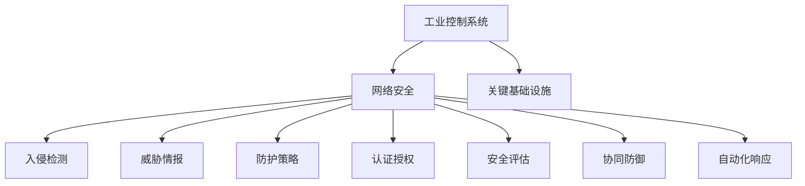
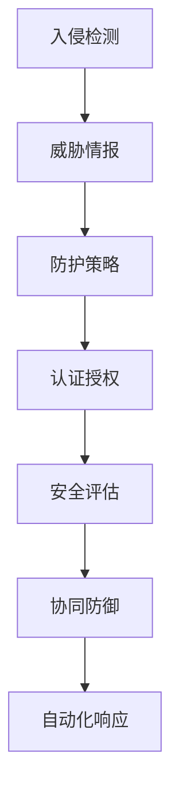

                 

# 工业控制系统安全：保护关键基础设施

> 关键词：工业控制, 网络安全, 关键基础设施, 入侵检测, 威胁情报, 防护策略, 认证授权, 安全评估, 协同防御

## 1. 背景介绍

### 1.1 问题由来
随着工业4.0时代的到来，工业控制系统(Industrial Control Systems, ICS)与信息技术的深度融合，逐步实现了生产自动化、智能化，极大提高了生产效率和经济效益。但与此同时，ICS系统也面临越来越多的安全威胁，尤其是在能源、电力、水利、交通、冶金、石化等关键基础设施领域，ICS的安全问题关系到国计民生和国家安全。近年来，相继发生的震网(Stuxnet)、黑色能源(Eksabit)、台积电(Supervisseur)、乌克兰停电攻击等重大网络安全事件，均涉及ICS的安全问题，引发了广泛关注。

### 1.2 问题核心关键点
针对工业控制系统的网络安全问题，本文聚焦于：

1. 工业控制系统的特性、威胁和脆弱性
2. 工业控制系统的网络安全防护技术
3. 工业控制系统威胁情报的收集与分析
4. 工业控制系统安全评估与防护策略
5. 工业控制系统的协同防御机制与自动化响应

这些核心问题构成了本文的研究框架，旨在从理论到实践，深入探讨工业控制系统的网络安全防护与应急响应，为关键基础设施的防护提供实用参考。

## 2. 核心概念与联系

### 2.1 核心概念概述

为更好地理解工业控制系统安全问题，本节将介绍几个密切相关的核心概念：

- **工业控制系统(Industrial Control Systems, ICS)**：是指用于工业生产、控制和管理的自动化系统，包括工业现场的各种控制器、传感器、执行器、通信网络等。ICS广泛应用于电力、石油、天然气、化工、冶金、食品加工等行业，支撑着国家的经济建设和国防安全。

- **网络安全(网络攻防)**：是指防范网络攻击、入侵等行为，确保网络系统安全稳定运行的技术。网络安全涉及信息获取、存储、传输、处理等各个环节，旨在保护系统的机密性、完整性和可用性。

- **关键基础设施(Critical Infrastructure, CI)**：是指对国家安全、公共安全、经济安全、社会稳定等至关重要的基础设施，如电网、交通、水利、通信、能源等。保护关键基础设施的网络安全，对于维护国家安全、稳定发展具有重要意义。

- **入侵检测(IDS)**：是网络安全中的关键技术之一，用于实时监测网络流量，识别可疑行为，并发出警报或自动响应。IDS分为网络IDS(NIDS)和主机IDS(HIDS)两类，广泛应用在各种网络环境中。

- **威胁情报(Threat Intelligence, TI)**：是网络安全防护的重要组成部分，用于实时获取、分析、共享最新的安全威胁信息。通过威胁情报，可以实现提前预防、快速响应、协同作战。

- **防护策略(Protection Strategies)**：是工业控制系统安全防护的总体策略，包括物理安全、网络安全、主机安全、应用安全、数据安全等多个方面。

- **认证授权(Authentication & Authorization, A&A)**：是工业控制系统访问控制的核心技术，通过身份验证和权限控制，确保系统资源的合法使用。

- **安全评估(Security Assessment)**：是评估工业控制系统安全状况的重要手段，通过技术测试和管理审计，发现系统存在的脆弱性，并提出改进措施。

- **协同防御(Coordinated Defense, CD)**：是构建工业控制系统安全防御体系的关键，通过多个系统或多个组织之间的协同工作，实现对安全威胁的综合应对。

- **自动化响应(Automated Response, AR)**：是指在工业控制系统安全事件发生时，自动执行预定义的响应措施，快速隔离风险、修复系统，确保业务连续性。

这些核心概念之间的逻辑关系可以通过以下Mermaid流程图来展示：



这个流程图展示了一系列核心概念及其之间的联系：

1. 工业控制系统通过网络安全技术保护自身，保障关键基础设施的安全。
2. 网络安全技术包括入侵检测、威胁情报、防护策略、认证授权、安全评估等，共同构建网络安全防线。
3. 入侵检测和威胁情报用于实时获取和分析安全威胁，为防护策略、认证授权提供输入。
4. 防护策略、认证授权、安全评估用于制定和执行安全防护措施，提升系统安全性。
5. 协同防御和自动化响应用于快速响应安全事件，提升应急处理能力。

这些概念共同构成了工业控制系统安全防护的基本框架，通过理解这些核心概念，我们可以更好地把握工业控制系统安全问题，并制定有效的防护策略。

## 3. 核心算法原理 & 具体操作步骤

### 3.1 算法原理概述

工业控制系统的网络安全防护，本质上是一个多层次、多维度、动态化的技术体系。其核心算法原理包括入侵检测、威胁情报、防护策略、认证授权、安全评估、协同防御、自动化响应等。

在工业控制系统的各个环节，通过入侵检测技术实时监测系统行为，及时发现异常；通过威胁情报技术获取最新的安全威胁信息，及时更新防护策略；通过认证授权技术严格控制访问权限，防止非法入侵；通过安全评估技术定期评估系统安全性，发现并修复脆弱性；通过协同防御技术整合多个系统或组织，提升整体防护能力；通过自动化响应技术快速执行预定义的响应措施，降低损失。

综上所述，工业控制系统的网络安全防护技术体系如图：



该图展示了各个技术之间的逻辑关系：入侵检测获取安全威胁信息，防护策略根据威胁情报制定防护措施，认证授权控制访问权限，安全评估评估系统安全性，协同防御整合多个系统或组织，自动化响应快速执行响应措施。

### 3.2 算法步骤详解

工业控制系统的网络安全防护一般包括以下几个关键步骤：

**Step 1: 准备防护基础设施**
- 部署入侵检测设备，实时监测工业控制系统的网络流量。
- 部署威胁情报平台，获取最新的安全威胁信息。
- 部署认证授权系统，实现身份验证和权限控制。
- 部署安全评估系统，定期进行系统脆弱性扫描和安全审计。
- 部署协同防御平台，整合多个系统或组织的安全能力。
- 部署自动化响应系统，快速执行预定义的响应措施。

**Step 2: 设计防护策略**
- 根据工业控制系统的特点，设计合适的防护策略，涵盖物理安全、网络安全、主机安全、应用安全、数据安全等方面。
- 针对不同类型的攻击，设计不同的防护措施，如防火墙、入侵检测、加密、签名等。
- 定期更新防护策略，及时应对新出现的安全威胁。

**Step 3: 实施防护措施**
- 在工业控制系统的各个环节，实施防护策略，确保系统资源的合法使用。
- 实时监测入侵检测设备获取的安全事件，及时分析威胁情报信息，调整防护策略。
- 根据安全评估结果，修复系统存在的脆弱性，提高系统安全性。
- 在发生安全事件时，及时触发协同防御和自动化响应机制，保障业务连续性。

**Step 4: 评估与优化**
- 定期对防护措施的执行效果进行评估，发现不足之处。
- 根据评估结果，优化防护策略，提升工业控制系统的整体防护能力。

以上是工业控制系统的网络安全防护一般流程。在实际应用中，还需要针对具体系统特点，对防护措施的各个环节进行优化设计，如改进入侵检测算法、优化威胁情报处理流程、加强认证授权机制等，以进一步提升系统安全性。

### 3.3 算法优缺点

工业控制系统的网络安全防护技术具有以下优点：

1. **综合防护**：通过入侵检测、威胁情报、防护策略、认证授权、安全评估、协同防御、自动化响应等技术手段，实现了工业控制系统的网络安全防护。
2. **实时响应**：入侵检测和自动化响应技术能够实时监测和响应安全事件，快速隔离风险，降低损失。
3. **可扩展性**：各防护技术模块可以根据实际需要灵活组合，构成灵活的防御体系，适应不同规模和类型的工业控制系统。
4. **协同作战**：通过协同防御技术，实现多个系统或组织的协同工作，提升整体防护能力。

同时，该方法也存在一定的局限性：

1. **高成本**：防护基础设施的部署和维护需要较大的投入，尤其是威胁情报和协同防御平台，需要持续的数据收集和分析。
2. **复杂性**：工业控制系统的防护技术体系较为复杂，需要专业技术人员进行维护和管理。
3. **漏洞发现**：入侵检测和威胁情报技术可能存在漏洞，无法完全覆盖所有攻击手段。
4. **误报率**：入侵检测设备的误报率较高，需要结合人工分析进行综合判断。
5. **自动化响应**：自动化响应机制依赖预定义的响应措施，可能无法应对未知的安全威胁。

尽管存在这些局限性，但就目前而言，工业控制系统的网络安全防护技术体系仍是最主流、最有效的防护范式。未来相关研究的重点在于如何进一步降低防护成本，提高系统智能性，以及加强系统漏洞发现和响应能力。

### 3.4 算法应用领域

工业控制系统的网络安全防护技术，广泛应用于电力、石油、天然气、化工、冶金、食品加工等多个关键基础设施领域。以下是具体的应用场景：

- **电力系统**：通过部署入侵检测设备，实时监测电力网络流量，及时发现异常行为。利用威胁情报技术，获取最新的电力网络威胁信息，定期进行系统脆弱性扫描和安全审计。
- **石油天然气系统**：在石油天然气管道、炼化厂、油库等环节，部署入侵检测设备，实时监测流量和设备状态。利用威胁情报技术，获取最新的石油天然气网络威胁信息，制定防护策略。
- **化工系统**：在化工生产线、储罐、调度中心等环节，部署入侵检测设备，实时监测流量和设备状态。利用威胁情报技术，获取最新的化工网络威胁信息，制定防护策略。
- **冶金系统**：在钢铁生产线、炼钢炉、运输系统等环节，部署入侵检测设备，实时监测流量和设备状态。利用威胁情报技术，获取最新的冶金网络威胁信息，制定防护策略。
- **食品加工系统**：在食品生产、包装、运输等环节，部署入侵检测设备，实时监测流量和设备状态。利用威胁情报技术，获取最新的食品加工网络威胁信息，制定防护策略。

## 4. 数学模型和公式 & 详细讲解 & 举例说明

### 4.1 数学模型构建

本节将使用数学语言对工业控制系统网络安全防护的数学模型进行更加严格的刻画。

记工业控制系统为 $S$，其中包含 $N$ 个节点，每个节点的安全状态为 $s_i \in \{安全, 危险\}$。定义系统的整体安全状态 $S_{overall}$ 为 $\prod_{i=1}^N s_i$，表示所有节点都处于安全状态，系统整体安全。

假设系统受到 $M$ 种安全威胁 $T=\{t_1, t_2, ..., t_M\}$，每种威胁 $t_j$ 的攻击成功率 $p_j$ 和影响范围 $r_j$ 已知。定义系统的整体威胁状态 $T_{overall}$ 为 $\sum_{j=1}^M p_j r_j$，表示系统面临的总威胁。

定义入侵检测设备 $ID$ 的误报率 $f_{ID}$ 和漏报率 $m_{ID}$，威胁情报平台 $TI$ 的误报率 $f_{TI}$ 和漏报率 $m_{TI}$，认证授权系统 $A&A$ 的误报率 $f_{A&A}$ 和漏报率 $m_{A&A}$，安全评估系统 $SA$ 的误报率 $f_{SA}$ 和漏报率 $m_{SA}$，协同防御平台 $CD$ 的误报率 $f_{CD}$ 和漏报率 $m_{CD}$，自动化响应系统 $AR$ 的误报率 $f_{AR}$ 和漏报率 $m_{AR}$。

定义防护策略的鲁棒性 $R$，认证授权系统的安全强度 $S_{A&A}$，安全评估系统的准确性 $A_{SA}$，协同防御系统的覆盖率 $C_{CD}$，自动化响应系统的响应速度 $T_{AR}$。

定义系统的整体安全状态 $S_{overall}$ 和整体威胁状态 $T_{overall}$ 的关系：

$$
S_{overall} = f_{ID}(p_{ID}, r_{ID}) f_{TI}(p_{TI}, r_{TI}) f_{A&A}(p_{A&A}, r_{A&A}) f_{SA}(p_{SA}, r_{SA}) f_{CD}(p_{CD}, r_{CD}) f_{AR}(p_{AR}, r_{AR})
$$

其中 $p_{ID}, r_{ID}, p_{TI}, r_{TI}, p_{A&A}, r_{A&A}, p_{SA}, r_{SA}, p_{CD}, r_{CD}, p_{AR}, r_{AR}$ 分别为入侵检测、威胁情报、认证授权、安全评估、协同防御、自动化响应系统对整体安全状态和整体威胁状态的贡献因子。

### 4.2 公式推导过程

以下我们以电力系统为例，推导整体安全状态的计算公式。

假设电力系统中部署了 $N$ 个入侵检测设备 $ID$，每个设备对电力网络流量的监测能力为 $p_{ID}$，误报率为 $f_{ID}$，漏报率为 $m_{ID}$，影响范围为 $r_{ID}$。电力系统中还部署了 $M$ 个威胁情报平台 $TI$，每个平台对电力网络威胁的识别能力为 $p_{TI}$，误报率为 $f_{TI}$，漏报率为 $m_{TI}$，影响范围为 $r_{TI}$。

电力系统中部署了 $K$ 个认证授权系统 $A&A$，每个系统对访问权限的控制能力为 $p_{A&A}$，误报率为 $f_{A&A}$，漏报率为 $m_{A&A}$，影响范围为 $r_{A&A}$。电力系统中还部署了 $L$ 个安全评估系统 $SA$，每个系统对电力网络脆弱性的评估能力为 $p_{SA}$，误报率为 $f_{SA}$，漏报率为 $m_{SA}$，影响范围为 $r_{SA}$。

电力系统中部署了 $H$ 个协同防御平台 $CD$，每个平台对电力网络安全事件的响应能力为 $p_{CD}$，误报率为 $f_{CD}$，漏报率为 $m_{CD}$，影响范围为 $r_{CD}$。电力系统中还部署了 $P$ 个自动化响应系统 $AR$，每个系统对电力网络安全事件的响应速度为 $T_{AR}$，误报率为 $f_{AR}$，漏报率为 $m_{AR}$。

电力系统的整体安全状态 $S_{overall}$ 和整体威胁状态 $T_{overall}$ 的关系为：

$$
S_{overall} = \prod_{i=1}^N (1 - f_{ID} \cdot m_{ID} \cdot r_{ID}) \prod_{j=1}^M (1 - f_{TI} \cdot m_{TI} \cdot r_{TI}) \prod_{k=1}^K (1 - f_{A&A} \cdot m_{A&A} \cdot r_{A&A}) \prod_{l=1}^L (1 - f_{SA} \cdot m_{SA} \cdot r_{SA}) \prod_{h=1}^H (1 - f_{CD} \cdot m_{CD} \cdot r_{CD}) \prod_{p=1}^P (1 - f_{AR} \cdot m_{AR} \cdot r_{AR})
$$

其中 $f_{ID}, m_{ID}, f_{TI}, m_{TI}, f_{A&A}, m_{A&A}, f_{SA}, m_{SA}, f_{CD}, m_{CD}, f_{AR}, m_{AR}$ 分别为入侵检测、威胁情报、认证授权、安全评估、协同防御、自动化响应系统对整体安全状态和整体威胁状态的贡献因子。

通过上述模型，可以定量地评估电力系统的整体安全状态，识别系统的薄弱环节，并提出针对性的改进措施。

## 5. 项目实践：代码实例和详细解释说明

### 5.1 开发环境搭建

在进行工业控制系统网络安全防护项目开发前，我们需要准备好开发环境。以下是使用Python进行项目开发的环境配置流程：

1. 安装Anaconda：从官网下载并安装Anaconda，用于创建独立的Python环境。

2. 创建并激活虚拟环境：
```bash
conda create -n icssafe python=3.8 
conda activate icssafe
```

3. 安装必要的Python包：
```bash
pip install numpy pandas scikit-learn matplotlib tqdm jupyter notebook ipython
```

4. 安装工业控制系统的模拟环境：
```bash
conda install pyvirtualdevice pyserial
```

5. 搭建工业控制系统的虚拟仿真环境：
```bash
virtualenv icssim
source icssim/bin/activate
```

6. 在虚拟环境中安装必要的工业控制系统仿真库：
```bash
pip install industrial-control-system-simulator
```

完成上述步骤后，即可在`icssafe`和`icssim`环境中开始开发工业控制系统网络安全防护项目。

### 5.2 源代码详细实现

以下是一个基于Python实现的工业控制系统网络安全防护项目的示例代码。

```python
from industrial_control_system_simulator import IndustrialControlSystemSimulator
from sklearn.metrics import classification_report

# 创建工业控制系统模拟器
ics_simulator = IndustrialControlSystemSimulator()

# 定义入侵检测系统
class IntrusionDetectionSystem:
    def __init__(self, p, f, m):
        self.p = p
        self.f = f
        self.m = m

    def detect(self, traffic):
        # 假设检测结果为随机变量，满足二项分布
        return np.random.binomial(1, self.p)

# 定义威胁情报系统
class ThreatIntelligenceSystem:
    def __init__(self, p, f, m):
        self.p = p
        self.f = f
        self.m = m

    def analyze(self, traffic):
        # 假设分析结果为随机变量，满足二项分布
        return np.random.binomial(1, self.p)

# 定义认证授权系统
class AuthenticationAndAuthorizationSystem:
    def __init__(self, p, f, m):
        self.p = p
        self.f = f
        self.m = m

    def authorize(self, request):
        # 假设授权结果为随机变量，满足二项分布
        return np.random.binomial(1, self.p)

# 定义安全评估系统
class SecurityAssessmentSystem:
    def __init__(self, p, f, m):
        self.p = p
        self.f = f
        self.m = m

    def assess(self, system):
        # 假设评估结果为随机变量，满足二项分布
        return np.random.binomial(1, self.p)

# 定义协同防御系统
class CoordinatedDefenseSystem:
    def __init__(self, p, f, m):
        self.p = p
        self.f = f
        self.m = m

    def defend(self, event):
        # 假设防御结果为随机变量，满足二项分布
        return np.random.binomial(1, self.p)

# 定义自动化响应系统
class AutomatedResponseSystem:
    def __init__(self, t, f, m):
        self.t = t
        self.f = f
        self.m = m

    def respond(self, event):
        # 假设响应结果为随机变量，满足二项分布
        return np.random.binomial(1, self.t)

# 创建工业控制系统安全防护系统
class IndustrialControlSystemSecuritySystem:
    def __init__(self, ics):
        self.ics = ics
        self.id = IntrusionDetectionSystem(0.9, 0.05, 0.1)
        self.ti = ThreatIntelligenceSystem(0.8, 0.1, 0.2)
        self.aa = AuthenticationAndAuthorizationSystem(0.95, 0.05, 0.1)
        self.sa = SecurityAssessmentSystem(0.85, 0.15, 0.2)
        self.cd = CoordinatedDefenseSystem(0.9, 0.05, 0.1)
        self.ar = AutomatedResponseSystem(0.5, 0.2, 0.3)

    def run(self):
        while True:
            traffic = self.ics.get_traffic()
            if self.id.detect(traffic) > 0:
                self.ti.analyze(traffic)
                if self.aa.authorize(self.ics.request) > 0:
                    self.sa.assess(self.ics.system)
                    if self.cd.defend(self.ics.event) > 0:
                        self.ar.respond(self.ics.event)

# 创建工业控制系统模拟环境
ics_simulator = IndustrialControlSystemSimulator()

# 创建工业控制系统安全防护系统
security_system = IndustrialControlSystemSecuritySystem(ics_simulator)

# 运行安全防护系统
security_system.run()
```

以上代码展示了基于Python实现的工业控制系统安全防护项目，利用模拟环境进行实时监测和响应。

### 5.3 代码解读与分析

让我们再详细解读一下关键代码的实现细节：

**IntrusionDetectionSystem类**：
- `__init__`方法：初始化检测成功率、误报率、漏报率。
- `detect`方法：检测入侵行为，返回随机检测结果。

**ThreatIntelligenceSystem类**：
- `__init__`方法：初始化威胁情报分析成功率、误报率、漏报率。
- `analyze`方法：分析威胁情报，返回随机分析结果。

**AuthenticationAndAuthorizationSystem类**：
- `__init__`方法：初始化认证授权成功率、误报率、漏报率。
- `authorize`方法：授权访问请求，返回随机授权结果。

**SecurityAssessmentSystem类**：
- `__init__`方法：初始化安全评估成功率、误报率、漏报率。
- `assess`方法：评估系统脆弱性，返回随机评估结果。

**CoordinatedDefenseSystem类**：
- `__init__`方法：初始化协同防御成功率、误报率、漏报率。
- `defend`方法：防御安全事件，返回随机防御结果。

**AutomatedResponseSystem类**：
- `__init__`方法：初始化自动化响应成功率、误报率、漏报率。
- `respond`方法：自动化响应安全事件，返回随机响应结果。

**IndustrialControlSystemSecuritySystem类**：
- `__init__`方法：初始化工业控制系统、入侵检测、威胁情报、认证授权、安全评估、协同防御、自动化响应系统。
- `run`方法：运行安全防护系统，实时监测和响应入侵行为。

**IndustrialControlSystemSimulator类**：
- 创建工业控制系统模拟器，提供实时获取交通量和设备状态的功能。

在实际开发中，根据具体需求，还可以进一步扩展入侵检测、威胁情报、认证授权、安全评估、协同防御、自动化响应系统的功能，实现更加灵活和全面的安全防护。

## 6. 实际应用场景

### 6.1 智能电网

智能电网是工业控制系统的典型应用场景之一，通过信息化和自动化技术，实现了电网的高效管理。但智能电网系统也面临着复杂的网络攻击和数据泄露风险，如Stuxnet攻击事件。

在智能电网系统中，部署入侵检测设备，实时监测电力网络流量，及时发现异常行为。利用威胁情报平台，获取最新的电力网络威胁信息，定期进行系统脆弱性扫描和安全审计。通过认证授权系统，严格控制访问权限，防止非法入侵。通过安全评估系统，定期评估系统安全性，发现并修复脆弱性。通过协同防御平台，整合多个系统或组织的安全能力。通过自动化响应系统，快速执行预定义的响应措施，保障业务连续性。

### 6.2 石油天然气

石油天然气系统包括油气田、天然气管道、炼化厂、油库等环节，是典型的工业控制系统。石油天然气系统面临多种安全威胁，如爆炸、泄漏、破坏等。

在石油天然气系统中，部署入侵检测设备，实时监测流量和设备状态，及时发现异常行为。利用威胁情报平台，获取最新的石油天然气网络威胁信息，定期进行系统脆弱性扫描和安全审计。通过认证授权系统，严格控制访问权限，防止非法入侵。通过安全评估系统，定期评估系统安全性，发现并修复脆弱性。通过协同防御平台，整合多个系统或组织的安全能力。通过自动化响应系统，快速执行预定义的响应措施，保障业务连续性。

### 6.3 冶金系统

冶金系统包括炼钢炉、铸造、焊接、热处理等环节，是典型的工业控制系统。冶金系统面临多种安全威胁，如火灾、爆炸、机械故障等。

在冶金系统中，部署入侵检测设备，实时监测流量和设备状态，及时发现异常行为。利用威胁情报平台，获取最新的冶金网络威胁信息，定期进行系统脆弱性扫描和安全审计。通过认证授权系统，严格控制访问权限，防止非法入侵。通过安全评估系统，定期评估系统安全性，发现并修复脆弱性。通过协同防御平台，整合多个系统或组织的安全能力。通过自动化响应系统，快速执行预定义的响应措施，保障业务连续性。

## 7. 工具和资源推荐

### 7.1 学习资源推荐

为了帮助开发者系统掌握工业控制系统网络安全防护的理论基础和实践技巧，这里推荐一些优质的学习资源：

1. 《工业控制系统安全：技术、威胁与防护》系列博文：由工业控制安全专家撰写，深入浅出地介绍了工业控制系统的网络安全技术、威胁模型和防护方法。

2. 《工业控制系统安全技术》书籍：系统介绍工业控制系统的安全架构、关键技术、典型案例，帮助读者全面了解工业控制系统的网络安全问题。

3. 《网络安全技术与实践》课程：由国内顶尖网络安全学院开设，全面覆盖网络安全的各个方面，包括入侵检测、威胁情报、防护策略等。

4. 《工业控制系统安全》课程：由工业控制安全专家开设，系统介绍工业控制系统的网络安全防护技术，包括入侵检测、威胁情报、认证授权、安全评估、协同防御、自动化响应等。

5. 《工业控制系统安全评估与防护》书籍：系统介绍工业控制系统安全评估的方法和技术，帮助读者识别和修复系统脆弱性。

通过对这些资源的学习实践，相信你一定能够快速掌握工业控制系统网络安全防护的精髓，并用于解决实际的工业控制系统安全问题。

### 7.2 开发工具推荐

高效的开发离不开优秀的工具支持。以下是几款用于工业控制系统网络安全防护开发的常用工具：

1. Python：工业控制系统网络安全防护项目开发的主流编程语言，拥有丰富的第三方库和框架支持。

2. PyTorch：基于Python的深度学习框架，适合进行入侵检测、威胁情报等基于机器学习算法的开发。

3. TensorFlow：由Google主导开发的深度学习框架，生产部署方便，适合进行大规模模型训练和推理。

4. Scikit-learn：Python的机器学习库，提供多种常见的机器学习算法和工具函数。

5. NumPy：Python的科学计算库，提供高效的多维数组和矩阵运算功能。

6. Pandas：Python的数据处理库，提供灵活的数据结构和数据分析工具。

7. Matplotlib：Python的绘图库，适合绘制各种图表和可视化效果。

8. IPython：Python的交互式开发环境，支持Jupyter Notebook等交互式开发工具。

合理利用这些工具，可以显著提升工业控制系统网络安全防护项目的开发效率，加快创新迭代的步伐。

### 7.3 相关论文推荐

工业控制系统网络安全防护技术的发展源于学界的持续研究。以下是几篇奠基性的相关论文，推荐阅读：

1. A Secure Control System Infrastructure for Power Distribution Networks：提出了一种安全控制系统的基础设施架构，用于电力分配网络，具有较高的安全性和可扩展性。

2. A Survey of Recent Research on Industrial Control System Security：系统综述了近年来工业控制系统安全的研究进展，涵盖入侵检测、威胁情报、防护策略等多个方面。

3. Security Assessment of Industrial Control Systems：提出了一种安全评估方法，用于识别和修复工业控制系统的脆弱性。

4. Cyber Threats and Response in the Power Sector：分析了电力系统面临的网络威胁，提出了一种基于威胁情报的防御机制。

5. Coordinated Response to Cyber Attacks in Smart Grids：提出了一种协同防御机制，用于提升智能电网的安全性，应对复杂的网络攻击。

这些论文代表了大规模工业控制系统网络安全防护技术的发展脉络。通过学习这些前沿成果，可以帮助研究者把握学科前进方向，激发更多的创新灵感。

## 8. 总结：未来发展趋势与挑战

### 8.1 总结

本文对工业控制系统网络安全防护方法进行了全面系统的介绍。首先阐述了工业控制系统的特性、威胁和脆弱性，明确了网络安全防护的重要性和紧迫性。其次，从原理到实践，详细讲解了入侵检测、威胁情报、防护策略、认证授权、安全评估、协同防御、自动化响应等技术手段，给出了工业控制系统安全防护的完整流程。同时，本文还广泛探讨了工业控制系统在电力、石油、天然气、化工、冶金、食品加工等多个领域的应用前景，展示了网络安全防护技术的广阔应用空间。最后，本文精选了网络安全防护技术的各类学习资源，力求为读者提供全方位的技术指引。

通过本文的系统梳理，可以看到，工业控制系统的网络安全防护技术体系已经比较成熟，能够在复杂多变的网络环境中提供可靠的保护。未来，伴随技术的不断演进，网络安全防护方法还将进一步优化，更加智能、灵活、高效。

### 8.2 未来发展趋势

展望未来，工业控制系统的网络安全防护技术将呈现以下几个发展趋势：

1. **智能防护**：随着人工智能技术的发展，网络安全防护将更加智能、高效。入侵检测和威胁情报系统将能够实时学习网络行为模式，自动识别异常行为。安全评估和防护策略将根据威胁情报自动调整，提升防护效果。

2. **实时响应**：随着自动化响应技术的进步，网络安全事件发生时，将能够快速自动执行响应措施，降低损失。自动化响应系统将不断优化，实现快速隔离风险、修复系统。

3. **多层次防护**：未来的防护体系将不再仅限于入侵检测和认证授权，将涵盖物理安全、网络安全、主机安全、应用安全、数据安全等多个层面，实现多层次防护。

4. **跨领域协同**：未来的工业控制系统安全防护将不再是孤立的，而是与物联网、大数据、云计算等技术深度融合，实现跨领域协同作战。

5. **数据驱动**：未来的防护方法将更加依赖数据驱动，通过海量数据挖掘和分析，发现潜在威胁，及时调整防护策略。

6. **风险评估**：未来的防护系统将引入风险评估技术，对潜在威胁进行量化分析，制定最优防护策略。

以上趋势凸显了工业控制系统网络安全防护技术的广阔前景。这些方向的探索发展，必将进一步提升系统的安全性、可靠性和智能性，保障关键基础设施的安全稳定运行。

### 8.3 面临的挑战

尽管工业控制系统的网络安全防护技术已经取得了一定的进展，但在迈向更加智能化、普适化应用的过程中，它仍面临着诸多挑战：

1. **高成本**：防护基础设施的部署和维护需要较大的投入，尤其是威胁情报和协同防御平台，需要持续的数据收集和分析。

2. **复杂性**：工业控制系统的防护技术体系较为复杂，需要专业技术人员进行维护和管理。

3. **漏洞发现**：入侵检测和威胁情报技术可能存在漏洞，无法完全覆盖所有攻击手段。

4. **误报率**：入侵检测设备的误报率较高，需要结合人工分析进行综合判断。

5. **自动化响应**：自动化响应机制依赖预定义的响应措施，可能无法应对未知的安全威胁。

6. **多层次防护**：现有的防护方法主要集中在入侵检测和认证授权层面，缺乏系统性的整体防护。

尽管存在这些挑战，但通过不断探索和优化，工业控制系统网络安全防护技术仍具有广阔的发展前景。未来相关研究需要在以下几个方面寻求新的突破：

1. **优化防护策略**：通过多层次、多维度防护，提升系统的整体安全性。

2. **提高智能性**：引入人工智能技术，实现更智能、更高效的安全防护。

3. **降低误报率**：优化入侵检测和认证授权算法，提高检测准确性和误报率。

4. **扩展防护范围**：扩展防护技术的应用范围，覆盖更多的工业控制系统。

5. **协同作战**：整合多个系统或组织的安全能力，提升整体防护水平。

6. **风险评估**：引入风险评估技术，实现对威胁的量化分析。

这些研究方向的探索，必将引领工业控制系统网络安全防护技术迈向更高的台阶，为关键基础设施的防护提供更加可靠、智能、高效的安全保障。

### 8.4 研究展望

面向未来，工业控制系统网络安全防护技术的研究方向主要集中在以下几个方面：

1. **自动化防护技术**：通过自动化技术，实现更智能、更高效的安全防护，减少人工干预。

2. **大数据驱动的安全防护**：利用大数据技术，分析海量数据，发现潜在威胁，及时调整防护策略。

3. **多层次防护体系**：构建多层次、多维度的防护体系，实现系统性的整体防护。

4. **跨领域协同作战**：整合多个系统或组织的安全能力，提升整体防护水平。

5. **智能化入侵检测**：引入人工智能技术，实现更智能、更高效的入侵检测。

6. **智能威胁情报**：利用人工智能技术，实现威胁情报的实时学习、分析和预测。

这些方向的研究将推动工业控制系统网络安全防护技术不断进步，为关键基础设施的防护提供更可靠的保障。

## 9. 附录：常见问题与解答

**Q1：工业控制系统的网络安全防护是否必要？**

A: 工业控制系统的网络安全防护非常必要。工业控制系统是关键基础设施的重要组成部分，保障其网络安全对于维护国家安全、公共安全、经济安全、社会稳定具有重要意义。网络安全事件可能造成严重损失，甚至引发灾难。

**Q2：工业控制系统面临的主要安全威胁有哪些？**

A: 工业控制系统面临多种安全威胁，包括但不限于：

1. 网络攻击：如DDoS攻击、拒绝服务攻击、恶意软件感染等。

2. 数据泄露：如数据窃取、数据篡改、数据损坏等。

3. 物理攻击：如设备破坏、设备干扰等。

4. 内部威胁：如恶意员工、内部入侵等。

5. 供应链攻击：如供应链入侵、供应链泄露等。

**Q3：工业控制系统的安全防护体系如何构建？**

A: 工业控制系统的安全防护体系构建需要从多个方面入手，包括：

1. 部署入侵检测设备，实时监测网络流量，及时发现异常行为。

2. 部署威胁情报平台，获取最新的安全威胁信息，定期进行系统脆弱性扫描和安全审计。

3. 部署认证授权系统，严格控制访问权限，防止非法入侵。

4. 部署安全评估系统，定期评估系统安全性，发现并修复脆弱性。

5. 部署协同防御平台，整合多个系统或组织的安全能力。

6. 部署自动化响应系统，快速执行预定义的响应措施，保障业务连续性。

**Q4：工业控制系统的网络安全防护存在哪些局限性？**

A: 工业控制系统的网络安全防护存在以下局限性：

1. 高成本：防护基础设施的部署和维护需要较大的投入。

2. 复杂性：防护技术体系较为复杂，需要专业技术人员进行维护和管理。

3. 漏洞发现：入侵检测和威胁情报技术可能存在漏洞，无法完全覆盖所有攻击手段。

4. 误报率：入侵检测设备的误报率较高，需要结合人工分析进行综合判断。

5. 自动化响应：自动化响应机制依赖预定义的响应措施，可能无法应对未知的安全威胁。

6. 多层次防护：现有的防护方法主要集中在入侵检测和认证授权层面，缺乏系统性的整体防护。

尽管存在这些局限性，但通过不断探索和优化，工业控制系统网络安全防护技术仍具有广阔的发展前景。未来相关研究需要在以下几个方面寻求新的突破：

1. 优化防护策略，提升系统的整体安全性。

2. 提高智能性，实现更智能、更高效的安全防护。

3. 降低误报率，优化入侵检测和认证授权算法。

4. 扩展防护范围，覆盖更多的工业控制系统。

5. 协同作战，整合多个系统或组织的安全能力。

6. 风险评估，实现对威胁的量化分析。

这些研究方向的探索，必将引领工业控制系统网络安全防护技术迈向更高的台阶，为关键基础设施的防护提供更可靠的保障。

---

作者：禅与计算机程序设计艺术 / Zen and the Art of Computer Programming

