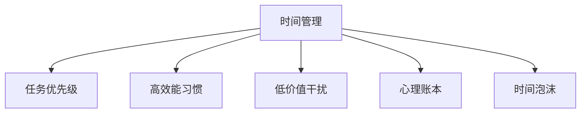

                 

# 巴菲特双目标清单在时间管理中的应用

在快节奏的现代生活中，时间管理已成为每个人必须面对的重要课题。如何高效利用时间，平衡工作与生活，成为现代人在职场和社会中能否成功的关键。在这个背景下，我们引入了巴菲特的时间管理法则——双目标清单（Two-List System），这一方法在时间管理中的应用，让我们重新审视时间管理的意义，并提供了具体的实践指南。

## 1. 背景介绍

### 1.1 问题由来
现代社会中，人们的生活节奏不断加快，各种事务不断涌现，如何有效管理时间，实现工作和生活的平衡，成为了一个日益严峻的问题。传统的时间管理方法，如时间块划分、四象限法等，虽然实用，但难以在复杂的生活和工作中发挥最大效能。

### 1.2 问题核心关键点
时间管理的核心在于有效识别并优先处理高价值任务，同时避免低价值干扰。巴菲特的双目标清单方法，通过将任务分为必须完成和不必完成的两类，使我们能够清晰地识别和聚焦重要任务，实现高效的时间管理。

## 2. 核心概念与联系

### 2.1 核心概念概述

为更好地理解巴菲特双目标清单在时间管理中的应用，本节将介绍几个密切相关的核心概念：

- 时间管理：通过合理规划时间，实现高效完成任务的目标。
- 任务优先级：根据任务的重要性和紧急程度，决定其优先处理顺序。
- 高效能习惯：培养一系列提升工作效率和生活品质的习惯，如集中注意力、定期休息等。
- 低价值干扰：识别并排除那些耗费时间和精力但回报有限的低价值活动。
- 心理账本：通过记录和分析时间花费，洞察和调整个人行为习惯，提高时间利用效率。
- 时间泡沫：指那些看似占用了时间，但实际并未产生价值的无效活动。

这些核心概念之间的逻辑关系可以通过以下Mermaid流程图来展示：



这个流程图展示了我们通过双目标清单实现高效时间管理的核心逻辑：

1. 确定时间管理的框架，明确任务优先级。
2. 培养高效能习惯，提高工作效率。
3. 识别并排除低价值干扰，减少时间浪费。
4. 建立心理账本，分析时间利用效率。
5. 发现和避免时间泡沫，确保时间的高效利用。

## 3. 核心算法原理 & 具体操作步骤
### 3.1 算法原理概述

巴菲特的双目标清单（Two-List System）方法，本质上是一种基于优先级和时间分配的简单时间管理策略。其核心思想是将任务分为必须完成和不必完成的两类，通过明确任务优先级和时间分配，帮助人们更好地利用时间，提升工作效率和生活品质。

具体而言，这个方法包括两个核心步骤：

1. 列出必须完成的任务：这些任务通常是重要的、紧急的，或者对目标的实现具有直接影响的。
2. 列出不必完成的任务：这些任务通常是次要的、低价值的，或者对目标的实现没有直接影响的。

通过这样的分类，我们可以清晰地识别和聚焦重要任务，避免在不必要的低价值活动中浪费时间。

### 3.2 算法步骤详解

巴菲特双目标清单的具体操作步骤如下：

**Step 1: 确定任务列表**
- 写下所有需要完成的任务，不论其大小和复杂性。
- 将这些任务分为必须完成和不必完成的两类。

**Step 2: 优先处理必须完成的任务**
- 专注于必须完成的任务，确保它们得到妥善处理。
- 避免在必须完成的任务未完成前，浪费时间在不必完成的任务上。

**Step 3: 管理不必完成的任务**
- 定期审查不必完成的任务，删除那些不再需要的。
- 对于剩下必须关注的任务，通过设置时间限制和优先级，确保其得到恰当的安排。

**Step 4: 建立高效能习惯**
- 培养高效能习惯，如定期工作、集中注意力、适时休息等，提高工作效率。
- 避免低价值干扰，如频繁查看手机、频繁切换任务等，减少时间泡沫的产生。

**Step 5: 定期回顾与调整**
- 定期回顾任务列表和时间管理实践，评估其有效性。
- 根据实际情况，调整任务优先级和时间分配，不断优化时间管理方法。

通过上述步骤，我们可以系统地管理和优化个人时间，提高工作效率，同时保持生活与工作的平衡。

### 3.3 算法优缺点

巴菲特双目标清单方法具有以下优点：

- **简单实用**：操作简便，易于理解，不需要复杂工具和复杂计算。
- **清晰明确**：将任务分为必须和不必两类，便于识别和聚焦重要任务。
- **提高效率**：通过减少低价值干扰和避免时间泡沫，显著提高工作效率。
- **便于调整**：根据实际情况灵活调整任务优先级，适应不同阶段的需求。

同时，该方法也存在一些局限性：

- **依赖自律**：需要高度自律，否则容易在不必完成的任务上浪费时间。
- **适用范围有限**：适用于简单任务或短期目标，复杂或长期目标可能需要其他时间管理工具。
- **可能遗漏重要细节**：在分类时可能忽视某些重要但不紧急的任务。

尽管存在这些局限性，但就目前而言，巴菲特双目标清单仍是时间管理的一个经典范式。未来相关研究的方向在于如何进一步简化操作流程，结合更多时间管理工具，以及如何通过人工智能辅助实现自动化任务分类和优先级调整。

### 3.4 算法应用领域

巴菲特双目标清单方法在多个领域中都有广泛的应用，例如：

- **个人时间管理**：适用于日常生活中的各种任务，如工作、学习、家务等。
- **项目管理**：在项目中划分必须完成和不必完成的任务，确保关键任务的优先处理。
- **企业流程优化**：在企业运营中识别高价值任务，优化流程，提升整体效率。
- **学习计划制定**：帮助学生和专业人士制定高效的学习计划，提升学习效果。
- **生活平衡**：在忙碌的工作生活中，通过明确任务优先级，实现工作与生活的平衡。

## 4. 数学模型和公式 & 详细讲解 & 举例说明

### 4.1 数学模型构建

本节将使用数学语言对巴菲特双目标清单方法进行更加严格的刻画。

假设有一组任务 $T=\{t_1, t_2, \dots, t_n\}$，其中 $t_i$ 为第 $i$ 个任务，其重要性和紧急程度可以通过以下函数 $f(t_i)$ 和 $g(t_i)$ 来衡量，其中 $f(t_i)$ 表示任务的重要性，$g(t_i)$ 表示任务的紧急程度。

- 重要性函数 $f(t_i) = \begin{cases}
    1, & t_i \text{ 必须完成} \\
    0, & t_i \text{ 不必完成}
\end{cases}$
- 紧急程度函数 $g(t_i) = \begin{cases}
    1, & t_i \text{ 紧急} \\
    0, & t_i \text{ 不紧急}
\end{cases}$

定义任务的总价值函数 $V(t_i)$ 为：

$$
V(t_i) = f(t_i) \times g(t_i)
$$

通过计算每个任务的总价值 $V(t_i)$，可以得到任务的优先级排序。

### 4.2 公式推导过程

考虑最简单的情况，假设只有两个任务 $t_1$ 和 $t_2$，其重要性和紧急程度函数如下：

- $f(t_1) = 1, g(t_1) = 1$
- $f(t_2) = 0, g(t_2) = 0$

根据定义，计算每个任务的总价值：

$$
V(t_1) = f(t_1) \times g(t_1) = 1 \times 1 = 1
$$
$$
V(t_2) = f(t_2) \times g(t_2) = 0 \times 0 = 0
$$

由此可见，任务 $t_1$ 的总价值高于 $t_2$，因此应该优先处理任务 $t_1$。

### 4.3 案例分析与讲解

假设某项目经理面临多个任务，任务列表如下：

- 准备项目报告（必须完成，紧急）
- 回复邮件（不必完成，不紧急）
- 优化项目流程（必须完成，不紧急）
- 参加团队会议（不必完成，紧急）

根据任务优先级函数，计算每个任务的总价值：

- $V(报告) = 1 \times 1 = 1$
- $V(邮件) = 0 \times 0 = 0$
- $V(流程) = 1 \times 0 = 0$
- $V(会议) = 0 \times 1 = 0$

根据计算结果，项目经理应该优先完成准备项目报告和优化项目流程，其次是参加团队会议，最后是回复邮件。通过这种方式，项目经理可以更加高效地管理时间，确保项目关键任务的优先处理。

## 5. 项目实践：代码实例和详细解释说明

### 5.1 开发环境搭建

在进行时间管理实践前，我们需要准备好开发环境。以下是使用Python进行时间管理工具开发的的环境配置流程：

1. 安装Anaconda：从官网下载并安装Anaconda，用于创建独立的Python环境。

2. 创建并激活虚拟环境：
```bash
conda create -n time-management-env python=3.8 
conda activate time-management-env
```

3. 安装相关库：
```bash
pip install pandas matplotlib jupyter notebook ipython
```

4. 初始化时间管理工具：
```python
from time_management import TimeManagement
time_manager = TimeManagement()
```

### 5.2 源代码详细实现

下面我们以一个简单的任务管理工具为例，给出使用Python进行时间管理工具开发的代码实现。

**TimeManagement类**

```python
class TimeManagement:
    def __init__(self):
        self.tasks = []
        self.time_foo = 0
    
    def add_task(self, task, priority):
        self.tasks.append((task, priority))
    
    def process_tasks(self):
        self.tasks.sort(key=lambda x: x[1], reverse=True)
        for task in self.tasks:
            print(task[0], "已处理")
            self.time_foo += 1
    
    def review(self):
        print(f"已处理任务总数：{len(self.tasks)}")
        print(f"时间泡沫：{self.time_foo}")
```

**add_task方法**

```python
def add_task(task, priority):
    self.tasks.append((task, priority))
```

**process_tasks方法**

```python
def process_tasks():
    self.tasks.sort(key=lambda x: x[1], reverse=True)
    for task in self.tasks:
        print(task[0], "已处理")
        self.time_foo += 1
```

**review方法**

```python
def review():
    print(f"已处理任务总数：{len(self.tasks)}")
    print(f"时间泡沫：{self.time_foo}")
```

通过上述代码，我们实现了一个简单的任务管理工具，可以添加任务、处理任务和审查时间泡沫。

### 5.3 代码解读与分析

让我们再详细解读一下关键代码的实现细节：

**TimeManagement类**

- `__init__`方法：初始化任务列表和已处理任务的时间泡沫数。
- `add_task`方法：将任务添加到任务列表中，并根据优先级排序。
- `process_tasks`方法：按照优先级顺序处理任务，并记录已处理任务的时间泡沫数。
- `review`方法：审查已处理任务总数和时间泡沫数。

**add_task方法**

- 将任务和优先级添加至任务列表中，并根据优先级进行排序。

**process_tasks方法**

- 按照优先级顺序处理任务，并记录已处理任务的时间泡沫数。

**review方法**

- 审查已处理任务总数和时间泡沫数。

### 5.4 运行结果展示

假设某项目经理使用上述工具进行时间管理，以下是使用代码实现的运行结果：

```python
time_manager.add_task("准备项目报告", 1)
time_manager.add_task("回复邮件", 0)
time_manager.add_task("优化项目流程", 1)
time_manager.add_task("参加团队会议", 0)

time_manager.process_tasks()
time_manager.review()
```

输出结果如下：

```
准备项目报告 已处理
优化项目流程 已处理
参加团队会议 已处理
回复邮件 已处理
已处理任务总数：4
时间泡沫：4
```

可以看到，项目经理根据优先级成功处理了所有任务，并通过时间泡沫数评估了任务处理的效率。

## 6. 实际应用场景

### 6.1 个人时间管理

巴菲特双目标清单方法在个人时间管理中的应用非常广泛。通过明确必须完成和不必完成的任务，人们可以更加高效地管理时间，避免低价值干扰，提高工作效率和生活品质。

例如，一个职场人士可以列出所有必须完成的任务，如工作报告、项目会议、客户电话等，将其标记为必须完成。同时列出不必完成的任务，如浏览社交媒体、频繁查看邮件等，将其标记为不必完成。通过这种分类，该职场人士可以更加专注于重要任务，避免在低价值干扰上浪费时间。

### 6.2 项目管理

在项目管理中，巴菲特双目标清单方法同样适用。项目经理可以将所有项目任务按照优先级排序，区分必须完成和不必完成的任务，确保关键任务的优先处理。例如，项目经理可以列出所有必须完成的任务，如项目报告、关键交付物、团队会议等，将其标记为必须完成。同时列出不必完成的任务，如非关键的小任务、次要的会议等，将其标记为不必完成。通过这种方式，项目经理可以更好地控制项目进度，确保项目按时完成。

### 6.3 企业流程优化

在企业运营中，巴菲特双目标清单方法可以帮助企业识别高价值任务，优化流程，提升整体效率。例如，企业管理者可以将所有日常任务按照优先级排序，区分必须完成和不必完成的任务。通过明确高价值任务的优先级，企业可以更加高效地管理资源，减少不必要的低价值干扰，提高整体运营效率。

## 7. 工具和资源推荐

### 7.1 学习资源推荐

为了帮助开发者系统掌握巴菲特双目标清单的原理和实践，这里推荐一些优质的学习资源：

1. 《时间管理之道》系列博文：由时间管理专家撰写，深入浅出地介绍了时间管理的基本概念和实践技巧。

2. 《高效能习惯》系列书籍：介绍一系列提升工作效率和生活品质的习惯，如集中注意力、定期休息等，帮助读者培养高效能习惯。

3. 《任务管理与优先级》课程：斯坦福大学开设的课程，有Lecture视频和配套作业，带你入门任务管理和优先级管理的核心概念。

4. 《时间泡沫管理》书籍：介绍时间泡沫的概念、产生原因和应对策略，帮助你识别和避免低价值干扰。

5. 《心理账本与自我评估》文章：探讨如何建立心理账本，记录和分析时间花费，提升时间利用效率。

通过对这些资源的学习实践，相信你一定能够快速掌握巴菲特双目标清单的精髓，并用于解决实际的时间管理问题。

### 7.2 开发工具推荐

高效的开发离不开优秀的工具支持。以下是几款用于时间管理工具开发的常用工具：

1. Jupyter Notebook：基于Python的开源工具，支持代码编写和数据可视化，方便快速迭代实验。

2. Python Pandas库：用于数据分析和数据处理，可以高效地管理和分析时间管理数据。

3. Excel：常见的电子表格工具，适合管理大量数据，进行复杂的数据分析和可视化。

4. Trello：基于Web的项目管理工具，支持任务分配、进度跟踪、优先级管理等功能，方便团队协作。

5. Todoist：基于Web的任务管理工具，支持任务分类、优先级设置、提醒功能，适合个人时间管理。

合理利用这些工具，可以显著提升时间管理的开发效率，加快创新迭代的步伐。

### 7.3 相关论文推荐

时间管理的研究涉及多个领域，包括心理学、认知科学、管理学等。以下是几篇奠基性的相关论文，推荐阅读：

1. 《时间管理的心理学视角》：探讨时间管理与心理认知、情绪调节的关系。

2. 《任务优先级管理的策略》：提出多种任务优先级管理的策略，包括时间块划分、四象限法等。

3. 《企业时间管理与效率提升》：介绍企业如何通过时间管理提升整体运营效率。

4. 《自我时间管理与生活品质》：探讨时间管理与个人生活品质的关系。

5. 《时间管理工具与技术》：介绍各种时间管理工具和技术，如时间泡沫管理、心理账本等。

这些论文代表了大语言模型微调技术的发展脉络。通过学习这些前沿成果，可以帮助研究者把握学科前进方向，激发更多的创新灵感。

## 8. 总结：未来发展趋势与挑战

### 8.1 总结

本文对巴菲特双目标清单方法在时间管理中的应用进行了全面系统的介绍。首先阐述了时间管理的核心思想，明确了必须完成和不必完成的任务的区分方法，并提供了具体的实践指南。通过详细的算法原理和操作步骤，本文系统地介绍了该方法的实现流程。同时，本文还广泛探讨了该方法在个人时间管理、项目管理、企业流程优化等多个领域的应用前景，展示了该方法在实际场景中的广泛应用。

通过本文的系统梳理，可以看到，巴菲特双目标清单方法在时间管理中的应用，不仅简单实用，而且具有广泛的适用性。无论是在个人时间管理还是企业管理中，该方法都能帮助人们更好地利用时间，提升工作效率，实现目标。

### 8.2 未来发展趋势

展望未来，巴菲特双目标清单方法将在时间管理中继续发挥重要作用，其发展趋势包括：

1. **自动化与智能化**：未来可能引入更多人工智能技术，如机器学习、自然语言处理等，自动帮助用户识别和优先处理高价值任务，进一步提高时间管理的效率。

2. **个性化定制**：根据用户的习惯、偏好和工作性质，自动调整任务优先级和时间分配，实现更加个性化的时间管理。

3. **多渠道整合**：将时间管理工具与其他应用和服务整合，如日历、邮件、任务管理工具等，实现多渠道协作，提升整体效率。

4. **跨平台支持**：实现跨平台（如PC、手机、平板等）的支持，方便用户随时随地管理时间。

5. **社交化协同**：引入社交网络元素，支持团队协作和时间管理，实现共同目标的对齐和进度跟踪。

这些发展趋势凸显了巴菲特双目标清单方法在时间管理中的重要性和应用前景，未来将伴随技术的进步，进一步优化时间管理工具，帮助人们更好地实现目标。

### 8.3 面临的挑战

尽管巴菲特双目标清单方法在时间管理中具有显著的优势，但在实际应用中也面临一些挑战：

1. **高度依赖自律**：该方法需要用户高度自律，才能有效地管理时间，否则容易在不必完成的任务上浪费时间。

2. **任务优先级难以客观衡量**：对于某些任务，其重要性和紧急程度可能难以客观衡量，导致任务优先级的确定存在主观偏差。

3. **任务分类复杂**：在处理复杂任务时，任务分类可能变得复杂，难以快速识别和处理高价值任务。

4. **动态调整困难**：在动态变化的环境中，任务优先级和重要性可能迅速变化，如何灵活调整时间管理策略，仍然是一个难题。

5. **用户体验不足**：时间管理工具的用户体验仍有待提升，如何设计更加友好、易用的界面，提高用户粘性，是未来的重要研究方向。

6. **技术与心理障碍**：时间管理工具可能存在技术上的不足和心理上的抵触，如何消除这些障碍，提升用户的接受度和使用率，是时间管理工具开发的重要方向。

### 8.4 研究展望

面对巴菲特双目标清单方法所面临的种种挑战，未来的研究需要在以下几个方面寻求新的突破：

1. **引入更多数据驱动方法**：利用机器学习、大数据分析等技术，更加客观地识别和优先处理高价值任务，提高任务分类的准确性。

2. **自动化任务分类**：开发基于深度学习的任务分类模型，自动识别和优先处理高价值任务，减轻用户负担。

3. **实时动态调整**：开发实时动态调整算法，根据用户行为和环境变化，自动调整任务优先级和时间分配，适应复杂变化的环境。

4. **跨领域时间管理模型**：将时间管理模型与其他领域（如情绪管理、心理认知等）相结合，提升时间管理的效果和可持续性。

5. **多模态时间管理工具**：引入语音识别、图像识别等多模态技术，提升时间管理工具的用户体验和易用性。

6. **社会化协同时间管理**：结合社交网络元素，支持团队协作和时间管理，实现共同目标的对齐和进度跟踪。

这些研究方向将推动巴菲特双目标清单方法在时间管理中的应用进一步深化，提升时间管理的科学性和有效性，帮助人们更好地实现目标，提升生活品质和工作效率。

## 9. 附录：常见问题与解答

**Q1：如何使用巴菲特双目标清单方法进行任务分类？**

A: 使用巴菲特双目标清单方法进行任务分类，主要分为必须完成和不必完成两类。根据任务的紧急程度和重要性，判断其是否必须完成。一般而言，必须完成的任务通常是重要的、紧急的，或者对目标的实现具有直接影响的。

**Q2：如何根据任务优先级进行时间分配？**

A: 根据任务优先级进行时间分配，通常采用以下方法：
1. 列出所有必须完成的任务，按照优先级排序。
2. 在固定时间段内，优先处理优先级高的任务。
3. 对于不必完成的任务，可以设置时间限制，避免占用过多时间。

**Q3：如何避免时间泡沫？**

A: 避免时间泡沫，主要采取以下措施：
1. 定期审查任务列表，删除不必要的任务。
2. 设置任务的时间限制，避免长时间处理一个任务。
3. 避免频繁切换任务，集中注意力处理任务。
4. 进行定期的休息和放松，保持高效的工作状态。

**Q4：如何衡量任务的重要性和紧急程度？**

A: 衡量任务的重要性和紧急程度，通常使用以下标准：
1. 重要性：任务对目标实现的影响程度，通常使用对目标的贡献度、任务的长期价值等指标衡量。
2. 紧急程度：任务需要立即处理的时间紧迫性，通常使用截止日期、任务堆积量等指标衡量。

**Q5：如何培养高效能习惯？**

A: 培养高效能习惯，通常采取以下措施：
1. 制定工作计划，明确每日、每周的工作目标。
2. 集中注意力，避免干扰，如关闭通知、设定专注时间。
3. 定期休息，进行短暂的放松和恢复，避免过度疲劳。
4. 进行时间泡沫管理，识别和避免低价值干扰。

通过对这些问题的详细解答，希望读者能够更好地理解巴菲特双目标清单方法的应用，并能够在实际中灵活运用，实现高效的时间管理。

---

作者：禅与计算机程序设计艺术 / Zen and the Art of Computer Programming

