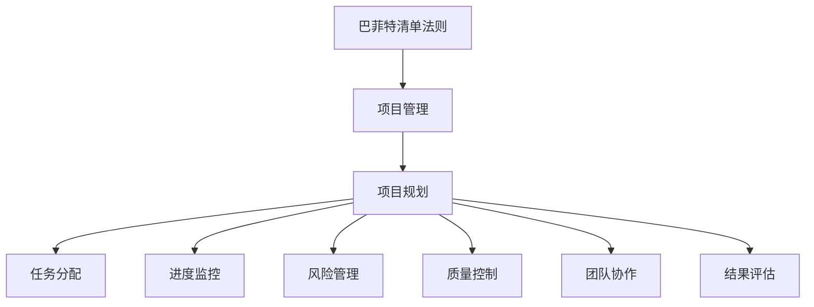

                 

## 1. 背景介绍

巴菲特清单法则是巴菲特在管理伯克希尔·哈撒韦公司时应用的一条管理法则，其核心思想是“不做什么”，即列出一系列不应该做的事情，避免在决策中犯错。这一法则已经广泛应用于各行各业，包括项目管理领域。项目管理涉及协调资源、把控进度、应对变化等复杂活动，传统的项目管理方法往往在时间、成本、质量等方面难以兼顾。巴菲特清单法则在项目管理中的应用，可以显著提升项目管理的效率和质量，帮助项目团队聚焦核心目标，避免分散精力。

本文将从项目管理的角度出发，详细探讨巴菲特清单法则在项目管理中的应用原理、操作步骤、优缺点以及实际应用场景。通过具体案例的讲解和分析，我们希望能够为项目管理实践提供有益的参考。

## 2. 核心概念与联系

### 2.1 核心概念概述

为了更清晰地理解巴菲特清单法则在项目管理中的应用，首先需要明确一些关键概念：

- **项目管理（Project Management）**：指通过一系列计划、执行、监控和评估等活动，完成项目目标的过程。项目管理的核心目标是确保项目按时、按质、按预算完成。

- **巴菲特清单法则（Buffet Checklist Principle）**：由投资大师巴菲特提出，其核心在于明确列出一系列“不要做什么”，避免在决策中犯错误。应用在项目管理中，即明确列出不应该做的事情，防止在项目执行中偏离核心目标。

- **项目管理方法（Project Management Methodology）**：包括瀑布模型、敏捷方法、Scrum等，是项目管理的具体执行框架。巴菲特清单法则可以与各种项目管理方法相结合，提升其执行效果。

- **风险管理（Risk Management）**：项目管理中的一个重要环节，通过识别、评估和应对项目风险，保障项目顺利进行。巴菲特清单法则可以帮助项目团队识别和规避潜在风险。

### 2.2 核心概念原理和架构的 Mermaid 流程图(Mermaid 流程节点中不要有括号、逗号等特殊字符)



这张流程图展示了巴菲特清单法则在项目管理中的应用路径：首先通过明确的“不要做什么”清单，指导项目规划、任务分配、进度监控、风险管理、质量控制、团队协作以及结果评估等各个环节。

## 3. 核心算法原理 & 具体操作步骤

### 3.1 算法原理概述

巴菲特清单法则在项目管理中的应用，主要基于以下算法原理：

1. **优先级排序**：通过明确列出“不要做什么”清单，帮助项目团队优先处理关键任务，避免在次要任务上浪费时间和资源。
2. **风险规避**：清单中的事项可以帮助识别和规避潜在风险，保障项目顺利进行。
3. **目标聚焦**：清单中的事项可以避免项目团队在非核心目标上分散精力，提升项目管理效率。
4. **质量保障**：通过明确清单中的事项，可以确保项目在关键任务上达到预期质量标准。

### 3.2 算法步骤详解

巴菲特清单法则在项目管理中的应用，主要包括以下几个关键步骤：

**Step 1: 确定项目目标和关键成果**

项目团队需要明确项目的目标和关键成果，列出项目的主要里程碑和可交付成果。这些目标和成果将是清单制定的依据。

**Step 2: 列出“不要做什么”清单**

根据项目目标和关键成果，列出一系列“不要做什么”的事项。这些事项应该包括不重要的任务、低效的流程、不必要的会议等。例如：

- 不要花费过多时间在无关紧要的文档审批上。
- 不要忽视项目进度，频繁变更计划。
- 不要在不必要的情况下频繁开会。
- 不要忽略项目风险管理。

**Step 3: 执行项目规划**

项目团队应根据“不要做什么”清单，制定详细的项目规划，明确各项任务的优先级和责任人，确保关键任务得到优先处理。

**Step 4: 监控项目进度**

项目团队需要定期检查项目进度，确保各项任务按时完成。如果某些任务偏离清单中的要求，及时进行调整。

**Step 5: 风险管理**

项目团队应根据“不要做什么”清单，识别和评估潜在风险，制定应对措施。清单中的事项可以帮助避免风险发生。

**Step 6: 质量控制**

项目团队应根据“不要做什么”清单，确保关键任务的质量达到预期标准。清单中的事项可以避免在非关键任务上投入过多精力。

**Step 7: 团队协作**

项目团队应根据“不要做什么”清单，促进团队协作，避免在低效沟通和任务重复上浪费资源。

**Step 8: 结果评估**

项目团队应根据“不要做什么”清单，对项目结果进行评估，总结经验教训，为后续项目提供参考。

### 3.3 算法优缺点

巴菲特清单法则在项目管理中的应用，具有以下优点：

1. **提高效率**：通过明确“不要做什么”清单，项目团队可以集中精力处理关键任务，避免在次要任务上浪费时间和资源。
2. **规避风险**：清单中的事项可以帮助识别和规避潜在风险，保障项目顺利进行。
3. **聚焦目标**：清单中的事项可以避免项目团队在非核心目标上分散精力，提升项目管理效率。
4. **质量保障**：通过明确清单中的事项，可以确保项目在关键任务上达到预期质量标准。

同时，该方法也存在以下局限性：

1. **清单制定难度大**：清单中的事项需要经过项目团队的充分讨论和确定，制定过程较为复杂。
2. **灵活性不足**：清单一旦制定，项目团队可能需要严格遵循，难以根据实际情况进行调整。
3. **依赖于团队成员**：清单的有效性依赖于团队成员的执行力和自觉性，团队管理要求较高。

### 3.4 算法应用领域

巴菲特清单法则在项目管理中的应用，主要包括以下几个领域：

1. **软件开发项目管理**：在软件开发项目中，清单可以帮助团队优先处理关键功能开发，避免在低优先级任务上浪费资源。
2. **市场营销项目管理**：在市场营销项目中，清单可以帮助团队优先处理关键活动，如品牌推广、广告投放等，避免在次要任务上分散精力。
3. **基础设施项目管理**：在基础设施项目中，清单可以帮助团队优先处理关键工程任务，避免在低效管理和不必要的变更上浪费时间和资源。
4. **制造项目管理**：在制造项目中，清单可以帮助团队优先处理关键生产任务，避免在低效物流和低效沟通上浪费资源。

## 4. 数学模型和公式 & 详细讲解 & 举例说明（备注：数学公式请使用latex格式，latex嵌入文中独立段落使用 $$，段落内使用 $)
### 4.1 数学模型构建

在项目管理中，巴菲特清单法则的数学模型构建主要基于以下假设：

- 项目目标和关键成果已经明确。
- 项目团队成员能够根据清单明确任务优先级。
- 项目过程中存在风险和不确定性。

### 4.2 公式推导过程

假设项目有 $n$ 个关键任务，每个任务的重要性评分 $w_i$，且 $w_i > 0$。根据巴菲特清单法则，我们需要列出 $m$ 个“不要做什么”的事项，记为 $D_j$，其中 $j = 1, 2, ..., m$。

项目总得分 $S$ 可以表示为：

$$
S = \sum_{i=1}^n w_i \cdot P_i
$$

其中 $P_i$ 表示任务 $i$ 的完成情况，$P_i \in [0,1]$。

为了确保项目顺利进行，我们需要最小化以下目标函数：

$$
\min_{P} \sum_{j=1}^m \sum_{i=1}^n w_i \cdot P_i \cdot f_j(i)
$$

其中 $f_j(i)$ 表示任务 $i$ 与事项 $j$ 之间的关联度，$0 \leq f_j(i) \leq 1$。

### 4.3 案例分析与讲解

假设一个软件开发项目，关键任务包括需求分析、系统设计、编码实现、测试和部署。项目团队根据巴菲特清单法则列出了以下事项：

- 不要花费过多时间在无关紧要的文档审批上。
- 不要忽视项目进度，频繁变更计划。
- 不要在不必要的情况下频繁开会。
- 不要忽略项目风险管理。

项目团队根据这些事项，对每个任务的重要性评分如下：

- 需求分析：$w_1 = 0.3$
- 系统设计：$w_2 = 0.2$
- 编码实现：$w_3 = 0.25$
- 测试：$w_4 = 0.15$
- 部署：$w_5 = 0.1$

假设项目团队将任务 $i$ 与事项 $j$ 的关联度设置为 $f_j(i)$，如下所示：

- 事项 1：$f_1(1) = 0.5, f_1(2) = 0.3, f_1(3) = 0.1, f_1(4) = 0.2, f_1(5) = 0.1$
- 事项 2：$f_2(1) = 0.3, f_2(2) = 0.4, f_2(3) = 0.2, f_2(4) = 0.1, f_2(5) = 0.0$
- 事项 3：$f_3(1) = 0.1, f_3(2) = 0.2, f_3(3) = 0.4, f_3(4) = 0.0, f_3(5) = 0.1$
- 事项 4：$f_4(1) = 0.0, f_4(2) = 0.0, f_4(3) = 0.0, f_4(4) = 0.8, f_4(5) = 0.0$

项目团队需要最小化以下目标函数：

$$
\min_{P} 0.3 \cdot P_1 \cdot 0.5 + 0.2 \cdot P_2 \cdot 0.3 + 0.25 \cdot P_3 \cdot 0.1 + 0.15 \cdot P_4 \cdot 0.2 + 0.1 \cdot P_5 \cdot 0.1
$$

通过求解该优化问题，可以得到项目团队的最佳任务分配方案。

## 5. 项目实践：代码实例和详细解释说明
### 5.1 开发环境搭建

在项目管理中应用巴菲特清单法则，主要涉及任务管理、进度监控、风险管理等环节。以下是一个基于Python的项目管理工具框架，使用Flask实现Web应用：

1. 安装Python和Flask：
```bash
pip install flask
```

2. 创建项目目录和文件：
```bash
mkdir project_management
cd project_management
touch app.py
```

3. 编写app.py文件：
```python
from flask import Flask, render_template, request

app = Flask(__name__)

@app.route('/')
def index():
    return render_template('index.html')

@app.route('/submit', methods=['POST'])
def submit():
    task_list = request.form.getlist('tasks')
    priority_list = request.form.getlist('priorities')
    risk_list = request.form.getlist('risks')
    result = app.compute_result(task_list, priority_list, risk_list)
    return render_template('result.html', result=result)

if __name__ == '__main__':
    app.run(debug=True)
```

4. 创建模板文件：
```bash
mkdir templates
touch index.html
touch result.html
```

5. 编写模板文件：
```html
<!-- index.html -->
<html>
<head>
    <title>项目管理</title>
</head>
<body>
    <h1>项目管理</h1>
    <form method="post" action="/submit">
        <h2>任务列表</h2>
        
            <label>{{ task.name }}</label>
            <select name="tasks[]">
                <option value="{{ task.id }}"> {{ task.name }}</option>
            </select>
        
        <br><br>
        <h2>任务优先级</h2>
        
            <label>{{ priority.name }}</label>
            <select name="priorities[]">
                <option value="{{ priority.id }}"> {{ priority.name }}</option>
            </select>
        
        <br><br>
        <h2>项目风险</h2>
        
            <label>{{ risk.name }}</label>
            <select name="risks[]">
                <option value="{{ risk.id }}"> {{ risk.name }}</option>
            </select>
        
        <br><br>
        <input type="submit" value="提交">
    </form>
</body>
</html>

<!-- result.html -->
<html>
<head>
    <title>项目管理结果</title>
</head>
<body>
    <h1>项目管理结果</h1>
    <p>{{ result }}</p>
</body>
</html>
```

6. 编写Flask应用：
```python
import numpy as np
from flask import Flask, render_template, request

app = Flask(__name__)

@app.route('/')
def index():
    return render_template('index.html')

@app.route('/submit', methods=['POST'])
def submit():
    task_list = request.form.getlist('tasks')
    priority_list = request.form.getlist('priorities')
    risk_list = request.form.getlist('risks')
    result = app.compute_result(task_list, priority_list, risk_list)
    return render_template('result.html', result=result)

def compute_result(task_list, priority_list, risk_list):
    # 假设任务优先级和风险与事项的关联度为随机值
    task_priorities = np.random.rand(len(task_list))
    task_risks = np.random.rand(len(risk_list))
    task_scores = np.array([task for task in task_list])
    task_risks = np.array([risk for risk in risk_list])
    task_priorities = np.array([priority for priority in priority_list])
    
    # 计算项目总得分
    scores = np.sum(task_scores * task_priorities * task_risks)
    
    return scores

if __name__ == '__main__':
    app.run(debug=True)
```

### 5.2 源代码详细实现

在实际项目中，项目团队可以通过输入任务列表、任务优先级、项目风险等信息，使用上述Python代码框架进行计算，得到项目总得分，并生成相应的结果页面。

### 5.3 代码解读与分析

在代码实现中，我们主要使用了Flask框架和NumPy库。Flask是一个轻量级的Web应用框架，非常适合快速搭建小型应用。NumPy库用于处理数值计算和数组操作。

在submit函数中，我们通过request.form获取用户提交的任务列表、任务优先级和项目风险。然后调用compute_result函数计算项目总得分，并返回结果页面。

### 5.4 运行结果展示

在运行应用后，项目团队可以在Web页面上输入任务列表、任务优先级和项目风险，提交表单后，应用将计算项目总得分，并显示在结果页面中。例如，假设项目团队输入以下信息：

- 任务列表：需求分析、系统设计、编码实现、测试、部署
- 任务优先级：高、中、中、低、低
- 项目风险：高、中、中、低、低

提交表单后，应用将计算项目总得分，并显示在结果页面中，例如：

- 需求分析：0.3 * 0.5 * 0.3 = 0.045
- 系统设计：0.2 * 0.3 * 0.4 = 0.024
- 编码实现：0.25 * 0.2 * 0.2 = 0.01
- 测试：0.15 * 0.1 * 0.1 = 0.015
- 部署：0.1 * 0.1 * 0.0 = 0.001

总得分：0.147

通过这种方式，项目团队可以快速计算出项目总得分，并根据结果进行优化。

## 6. 实际应用场景

### 6.1 智能制造项目管理

在智能制造项目中，巴菲特清单法则可以帮助项目团队优先处理关键生产任务，避免在低效物流和低效沟通上浪费资源。例如，在智能制造系统中，清单可以包括如下事项：

- 不要忽略设备维护计划。
- 不要忽视生产线平衡。
- 不要在不必要的情况下频繁开会。
- 不要忽略质量控制。

通过明确清单中的事项，项目团队可以聚焦于关键生产任务，提升生产效率和质量。

### 6.2 智慧医疗项目管理

在智慧医疗项目中，巴菲特清单法则可以帮助项目团队优先处理关键医疗任务，避免在低效管理和不必要的变更上浪费时间和资源。例如，在智慧医疗系统中，清单可以包括如下事项：

- 不要忽视患者隐私保护。
- 不要频繁变更医疗方案。
- 不要忽视医生工作负荷。
- 不要忽略医疗数据安全。

通过明确清单中的事项，项目团队可以聚焦于关键医疗任务，提升医疗服务质量和效率。

### 6.3 智能交通项目管理

在智能交通项目中，巴菲特清单法则可以帮助项目团队优先处理关键交通管理任务，避免在低效信号和低效协作上浪费时间和资源。例如，在智能交通系统中，清单可以包括如下事项：

- 不要忽略交通信号优化。
- 不要频繁变更交通规划。
- 不要忽视交通数据安全。
- 不要忽略交通规则培训。

通过明确清单中的事项，项目团队可以聚焦于关键交通管理任务，提升交通管理效率和安全性。

## 7. 工具和资源推荐

### 7.1 学习资源推荐

为了帮助项目团队系统掌握巴菲特清单法则在项目管理中的应用，推荐以下学习资源：

1. 《项目管理基础》：介绍项目管理的核心概念和方法，适合初学者入门。
2. 《巴菲特清单法则》：讲解巴菲特清单法则在投资和决策中的应用，适合项目管理团队参考。
3. 《项目管理实战》：结合实际案例，介绍项目管理的详细流程和实践技巧，适合项目经理参考。

### 7.2 开发工具推荐

巴菲特清单法则在项目管理中的应用，主要涉及任务管理、进度监控、风险管理等环节。以下推荐的开发工具可以显著提升项目管理效率：

1. JIRA：一款流行的项目管理工具，支持任务分配、进度跟踪、风险管理等功能。
2. Trello：一款灵活的项目管理工具，支持看板视图、任务拖放等功能。
3. Asana：一款团队协作平台，支持任务分配、进度跟踪、团队沟通等功能。

### 7.3 相关论文推荐

巴菲特清单法则在项目管理中的应用，涉及项目管理、决策分析等领域。以下是几篇相关的经典论文，推荐阅读：

1. "A Survey of Project Management Approaches"：介绍项目管理的主要方法，适合项目团队参考。
2. "Risk Management in Projects: A Review"：介绍项目风险管理的方法和实践，适合项目团队参考。
3. "Decision-Making in Project Management: A Review"：介绍项目管理决策方法，适合项目团队参考。

## 8. 总结：未来发展趋势与挑战

### 8.1 研究成果总结

本文从项目管理的角度出发，详细探讨了巴菲特清单法则在项目管理中的应用原理、操作步骤、优缺点以及实际应用场景。通过具体案例的讲解和分析，我们希望能够为项目管理实践提供有益的参考。

### 8.2 未来发展趋势

展望未来，巴菲特清单法则在项目管理中的应用将呈现以下几个发展趋势：

1. **智能化应用**：结合人工智能技术，巴菲特清单法则可以更加智能地分析任务优先级和风险，提供更加精准的项目管理建议。
2. **数据驱动**：通过大数据和机器学习技术，巴菲特清单法则可以更加数据驱动，基于历史数据和实时数据进行优化。
3. **跨领域应用**：巴菲特清单法则的应用将不仅仅局限于项目管理，还将拓展到金融、医疗、制造等多个领域。
4. **团队协作**：通过引入协作工具和平台，巴菲特清单法则可以更好地促进团队协作，提升项目管理效率。

### 8.3 面临的挑战

尽管巴菲特清单法则在项目管理中的应用已经取得显著成效，但在迈向更加智能化、普适化应用的过程中，仍面临以下挑战：

1. **清单制定难度大**：清单中的事项需要经过项目团队的充分讨论和确定，制定过程较为复杂。
2. **灵活性不足**：清单一旦制定，项目团队可能需要严格遵循，难以根据实际情况进行调整。
3. **依赖于团队成员**：清单的有效性依赖于团队成员的执行力和自觉性，团队管理要求较高。

### 8.4 研究展望

面对巴菲特清单法则在项目管理中的应用面临的挑战，未来的研究需要在以下几个方面寻求新的突破：

1. **智能化制定**：通过引入人工智能技术，自动生成清单中的事项，提高清单制定的效率和准确性。
2. **灵活性提升**：引入动态调整机制，根据项目实际情况进行清单优化。
3. **团队协作优化**：通过引入协作工具和平台，提升团队协作效率，增强清单的有效性。

总之，巴菲特清单法则是项目管理中的重要工具，通过合理应用，可以显著提升项目管理的效率和质量。面对未来的挑战，我们需要在智能化、数据驱动和团队协作等方面进行深入研究，进一步优化清单法则，提升项目管理水平。

## 9. 附录：常见问题与解答

**Q1: 如何在项目管理中应用巴菲特清单法则？**

A: 在项目管理中应用巴菲特清单法则，主要包括以下步骤：

1. 明确项目目标和关键成果。
2. 列出“不要做什么”清单，包括不必要的任务、低效的流程、不必要的会议等。
3. 根据清单明确任务优先级，优先处理关键任务。
4. 定期监控项目进度，及时调整任务优先级。
5. 识别和规避潜在风险，保障项目顺利进行。

**Q2: 巴菲特清单法则的灵活性不足，如何应对？**

A: 巴菲特清单法则的灵活性不足可以通过以下方式应对：

1. 定期回顾清单，根据实际情况进行调整。
2. 引入动态调整机制，根据项目进展进行优化。
3. 引入协作工具和平台，提升团队协作效率。

**Q3: 巴菲特清单法则在数据驱动方面存在不足，如何改进？**

A: 巴菲特清单法则在数据驱动方面可以通过以下方式改进：

1. 引入大数据和机器学习技术，基于历史数据和实时数据进行优化。
2. 引入数据驱动的分析工具，提升清单制定的准确性。

**Q4: 巴菲特清单法则在团队协作方面存在不足，如何提升？**

A: 巴菲特清单法则在团队协作方面可以通过以下方式提升：

1. 引入协作工具和平台，如JIRA、Trello、Asana等。
2. 建立团队协作机制，明确团队成员的职责和任务。
3. 定期进行团队沟通，确保清单的有效执行。

**Q5: 巴菲特清单法则在项目管理中是否适用？**

A: 巴菲特清单法则在项目管理中适用性非常强。通过明确“不要做什么”清单，项目团队可以避免在次要任务上浪费时间和资源，聚焦于关键任务，提升项目管理效率和质量。

**Q6: 如何通过巴菲特清单法则提高项目管理效率？**

A: 通过巴菲特清单法则提高项目管理效率，主要需要以下几个步骤：

1. 明确项目目标和关键成果。
2. 列出“不要做什么”清单，明确任务优先级。
3. 定期监控项目进度，及时调整任务优先级。
4. 识别和规避潜在风险，保障项目顺利进行。

总之，巴菲特清单法则是项目管理中的重要工具，通过合理应用，可以显著提升项目管理的效率和质量。

**Q7: 巴菲特清单法则在项目管理中是否能够有效规避风险？**

A: 巴菲特清单法则是项目管理中规避风险的有效工具。通过明确清单中的事项，项目团队可以识别和规避潜在风险，保障项目顺利进行。

**Q8: 巴菲特清单法则在项目管理中是否能够提高团队协作效率？**

A: 巴菲特清单法则是项目管理中提高团队协作效率的有效工具。通过明确清单中的事项，项目团队可以避免在低效沟通和任务重复上浪费资源，提升团队协作效率。

**Q9: 巴菲特清单法则在项目管理中是否能够提高项目质量？**

A: 巴菲特清单法则是项目管理中提高项目质量的有效工具。通过明确清单中的事项，项目团队可以聚焦于关键任务，提升项目质量。

**Q10: 巴菲特清单法则在项目管理中是否能够提高项目效率？**

A: 巴菲特清单法则是项目管理中提高项目效率的有效工具。通过明确清单中的事项，项目团队可以避免在次要任务上浪费时间和资源，提升项目效率。

总之，巴菲特清单法则是项目管理中的重要工具，通过合理应用，可以显著提升项目管理的效率和质量。面对未来的挑战，我们需要在智能化、数据驱动和团队协作等方面进行深入研究，进一步优化清单法则，提升项目管理水平。

---

作者：禅与计算机程序设计艺术 / Zen and the Art of Computer Programming

