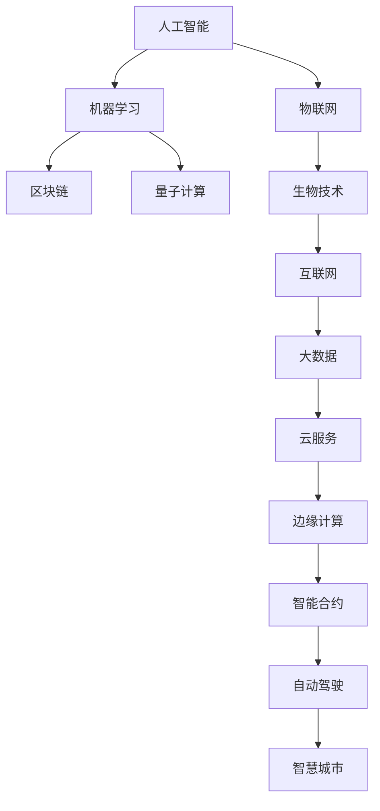

                 

## 1. 背景介绍

### 1.1 问题由来

随着科技的飞速发展和社会的快速变迁，我们正逐步迈向2050年的未来世界。在这个崭新的时代，科技与生活的融合已经成为了一种必然的趋势。人工智能、机器学习、物联网、区块链等技术的广泛应用，正在重塑人类的生产、生活、娱乐和社交方式。本文旨在探索未来人类生活中科技与生活的深度融合，及其可能带来的影响和变革。

### 1.2 问题核心关键点

未来的科技发展将主要围绕以下几个关键点展开：

- **人工智能的普及**：从医疗、教育到交通、金融，各个领域都将广泛应用AI技术，以提高效率和精度。
- **物联网的全面连接**：智能家居、智能城市、智能交通等系统将实现无缝连接，提升生活质量。
- **区块链的安全应用**：数字货币、智能合约、数据安全等将成为现代社会的基础设施。
- **量子计算的突破**：量子计算机将为加密、模拟、优化等提供革命性的计算能力。
- **生物技术的革新**：基因编辑、合成生物、生物材料等技术将彻底改变医疗和工业。

这些核心技术的融合和发展，将深刻影响人类社会的方方面面，从个体到全球，从经济到文化，都将经历前所未有的变革。

## 2. 核心概念与联系

### 2.1 核心概念概述

1. **人工智能**：通过模拟人类的智能行为，实现自主学习、决策和执行的能力。
2. **机器学习**：一种数据驱动的技术，使机器能够从经验中学习并改进性能。
3. **物联网(IoT)**：将各种设备、传感器和系统连接到互联网，实现信息交换和协同工作。
4. **区块链**：一种去中心化的分布式账本技术，保证数据的透明、安全和不可篡改。
5. **量子计算**：利用量子力学的原理，进行高速、并行计算。
6. **生物技术**：包括基因工程、生物信息学等，用于研究和应用生命体的结构和功能。

### 2.2 核心概念原理和架构的 Mermaid 流程图



以上流程图示意了未来科技发展中，各大核心技术之间的联系和相互影响。人工智能、机器学习等技术为物联网、区块链等提供了强有力的支持，而量子计算、生物技术等则为未来的创新提供了基础。

## 3. 核心算法原理 & 具体操作步骤

### 3.1 算法原理概述

未来科技与生活的融合，将涉及众多领域和技术的深度整合。本文重点介绍几个核心算法和操作步骤：

1. **人工智能与物联网的结合**：通过智能传感器和设备收集数据，利用AI算法进行分析和决策，实现智能控制和管理。
2. **区块链在金融领域的应用**：利用区块链的透明和不可篡改特性，构建安全的金融交易和数据存储系统。
3. **量子计算在密码学中的应用**：通过量子密钥分发和量子安全算法，提升网络安全防护水平。
4. **生物技术与AI的协同创新**：利用AI进行基因数据分析和药物发现，提升生物技术的研发效率和精度。

### 3.2 算法步骤详解

#### 3.2.1 人工智能与物联网的结合

1. **数据采集**：利用传感器和设备采集环境数据，如温度、湿度、位置、压力等。
2. **数据处理**：通过AI算法对采集的数据进行预处理和分析，如异常检测、趋势预测等。
3. **决策执行**：根据分析结果，智能控制系统做出决策并执行相应操作，如自动调节温度、开关电器等。

#### 3.2.2 区块链在金融领域的应用

1. **交易记录**：每个交易都会记录在区块链上，保证数据的透明和不可篡改。
2. **智能合约**：利用区块链的智能合约技术，自动执行交易规则，减少人为干预和错误。
3. **安全审计**：区块链的分布式账本和共识机制，确保交易记录的安全性和可追溯性。

#### 3.2.3 量子计算在密码学中的应用

1. **量子密钥分发**：利用量子纠缠和不可克隆定理，实现安全的密钥分发和加密通信。
2. **量子安全算法**：开发量子算法，如Shor算法和Grover算法，提升密码破解的难度。
3. **后量子密码学**：研究和应用量子计算抗攻击的密码学算法，保障未来通信安全。

#### 3.2.4 生物技术与AI的协同创新

1. **基因数据处理**：利用AI算法分析基因组数据，识别基因突变和变异。
2. **药物发现**：通过AI进行高通量筛选和模拟，加速新药的研发和验证。
3. **健康监测**：利用AI对健康数据进行分析和预测，提供个性化的健康管理方案。

### 3.3 算法优缺点

#### 3.3.1 人工智能与物联网的结合

**优点**：
- **实时性**：AI算法能够实时处理和分析数据，快速响应环境变化。
- **自适应性**：通过学习和优化，AI系统能够不断适应新的环境和任务。
- **可靠性**：物联网设备的高可靠性和长寿命，提升了系统的稳定性和持久性。

**缺点**：
- **数据隐私**：大量数据采集和存储可能导致隐私泄露。
- **计算资源**：高精度AI算法需要大量的计算资源，成本较高。
- **设备互操作性**：不同设备之间的兼容性问题可能影响系统的整体性能。

#### 3.3.2 区块链在金融领域的应用

**优点**：
- **透明性**：所有交易记录公开透明，便于审计和监管。
- **安全性**：数据不可篡改，减少欺诈和风险。
- **去中心化**：无需中心服务器，提高系统的可靠性和鲁棒性。

**缺点**：
- **交易速度**：区块链的交易速度较慢，影响系统响应。
- **技术门槛**：需要专业的技术知识和技能，增加了实施难度。
- **能耗高**：共识机制需要大量计算资源，能耗较高。

#### 3.3.3 量子计算在密码学中的应用

**优点**：
- **计算速度**：量子计算在特定算法上有巨大的计算优势。
- **安全性**：量子加密算法具有极高的安全性，难以被破解。
- **创新潜力**：推动密码学和信息安全的重大突破。

**缺点**：
- **技术复杂**：量子计算的技术复杂度高，实现难度大。
- **资源需求**：量子计算需要极端的环境和设备，成本较高。
- **成熟度**：目前量子计算技术还处于早期阶段，未能广泛应用。

#### 3.3.4 生物技术与AI的协同创新

**优点**：
- **高效性**：AI算法能够快速分析和处理大量生物数据，提高研发效率。
- **精准性**：AI模型能够从海量数据中识别出关键模式，提高决策的准确性。
- **跨学科融合**：生物技术与AI的结合，推动了多学科的交叉创新。

**缺点**：
- **数据隐私**：生物数据的敏感性和隐私问题需要特别注意。
- **伦理挑战**：基因编辑和生物材料的使用涉及伦理和法律问题。
- **技术复杂**：生物技术和AI的结合需要高度的专业知识和技术支持。

### 3.4 算法应用领域

未来的科技与生活融合，将在多个领域实现广泛应用：

- **智能家居**：通过物联网和AI技术，实现自动控制、智能安防、健康管理等功能。
- **智能医疗**：利用AI进行疾病诊断、治疗方案推荐、健康管理等，提升医疗服务质量。
- **智能交通**：通过物联网和AI技术，实现自动驾驶、交通流量优化、智能导航等。
- **智慧城市**：利用AI和大数据技术，实现城市管理、环境监测、公共服务优化等。
- **金融科技**：利用区块链和AI技术，提升金融交易的安全性、透明度和效率。
- **教育科技**：利用AI和VR/AR技术，实现个性化教学、智能评估等功能。
- **娱乐产业**：利用AI和物联网技术，提供个性化推荐、互动体验等。

## 4. 数学模型和公式 & 详细讲解

### 4.1 数学模型构建

未来科技与生活的融合，涉及众多数学模型的构建和应用。这里以智能交通系统为例，介绍数学模型的构建过程：

1. **交通流量预测**：利用时间序列分析、回归模型等，预测未来交通流量。
2. **路径优化**：利用图论、最优化算法等，计算最优路径和交通流控制策略。
3. **事故预测和预防**：利用机器学习和统计模型，预测交通事故发生的概率，并制定预防措施。

### 4.2 公式推导过程

#### 4.2.1 交通流量预测模型

1. **时间序列模型**：利用ARIMA模型对交通流量进行预测，公式如下：

$$ y_t = c + \sum_{i=1}^{p} \alpha_i y_{t-i} + \sum_{j=1}^{q} \beta_j \epsilon_{t-j} + \sum_{k=1}^{d} \gamma_k D^k_t $$

其中 $y_t$ 为第 $t$ 天的交通流量，$c$ 为常数项，$\alpha_i$ 和 $\beta_j$ 为模型参数，$\epsilon_t$ 为随机误差项，$D^k_t$ 为差分算子。

2. **回归模型**：利用线性回归模型对交通流量进行预测，公式如下：

$$ y_t = \beta_0 + \sum_{i=1}^{p} \beta_i x_{it} + \epsilon_t $$

其中 $y_t$ 为第 $t$ 天的交通流量，$\beta_0$ 和 $\beta_i$ 为模型参数，$x_{it}$ 为影响因素，$\epsilon_t$ 为随机误差项。

#### 4.2.2 路径优化模型

1. **最短路径算法**：利用Dijkstra算法计算最优路径，公式如下：

$$ d(i,j) = \sum_{k=1}^{n} w_{ik,jk} $$

其中 $d(i,j)$ 为节点 $i$ 到节点 $j$ 的最短路径长度，$w_{ik,jk}$ 为边 $(i,k)$ 和 $(k,j)$ 的权重。

2. **交通流控制算法**：利用交通流仿真模型，优化交通信号灯控制策略，公式如下：

$$ \min_{u_t} \sum_{i=1}^{n} c_i \times u_t $$

其中 $u_t$ 为第 $t$ 个信号灯的开关状态，$c_i$ 为信号灯的控制代价。

#### 4.2.3 事故预测模型

1. **决策树模型**：利用决策树算法预测交通事故的发生概率，公式如下：

$$ P(y=1|x) = \sum_{i=1}^{m} P(y=1|x, f_i) $$

其中 $P(y=1|x)$ 为交通事故发生的概率，$f_i$ 为决策树的第 $i$ 个分支，$P(y=1|x, f_i)$ 为在分支 $f_i$ 上交通事故发生的概率。

2. **神经网络模型**：利用多层感知器模型预测交通事故的发生概率，公式如下：

$$ P(y=1|x) = \sigma(\sum_{i=1}^{n} w_{i} x_i + b) $$

其中 $\sigma$ 为激活函数，$w_{i}$ 和 $b$ 为模型参数，$x_i$ 为输入特征。

### 4.3 案例分析与讲解

**案例一：智能家居系统**

1. **数据采集**：智能传感器采集室内外温度、湿度、空气质量等数据。
2. **数据处理**：利用机器学习算法对数据进行分析和预测，如预测室内温度变化趋势。
3. **决策执行**：根据预测结果，自动调节空调、加湿器、空气净化器等设备，实现智能环境控制。

**案例二：智慧医疗系统**

1. **数据采集**：智能穿戴设备采集患者的生理参数，如心率、血压、血糖等。
2. **数据处理**：利用深度学习算法对数据进行分析和预测，如预测疾病发生的概率。
3. **决策执行**：根据预测结果，提供个性化的健康管理方案和预警通知。

## 5. 项目实践：代码实例和详细解释说明

### 5.1 开发环境搭建

#### 5.1.1 软件环境

1. **Python**：安装最新版本，作为主要编程语言。
2. **TensorFlow**：用于深度学习模型的开发和训练，安装最新版本。
3. **PyTorch**：用于深度学习模型的开发和训练，安装最新版本。
4. **Jupyter Notebook**：用于数据处理、模型训练和结果展示，安装最新版本。

#### 5.1.2 硬件环境

1. **GPU**：使用NVIDIA的GTX系列或RTX系列GPU，支持深度学习模型的训练和推理。
2. **TPU**：使用Google的TPU，提供高效的并行计算能力，支持大规模深度学习模型的训练。
3. **云计算平台**：使用AWS、Google Cloud、阿里云等云平台，提供丰富的计算资源和分布式计算支持。

### 5.2 源代码详细实现

#### 5.2.1 智能家居系统

```python
import tensorflow as tf
import numpy as np
import matplotlib.pyplot as plt

# 定义输入数据
x_train = np.array([[25, 60, 0.5], [20, 65, 0.6], [22, 58, 0.3], [19, 63, 0.4]])
y_train = np.array([0, 1, 1, 0])

# 定义模型
model = tf.keras.Sequential([
    tf.keras.layers.Dense(32, activation='relu', input_shape=(3,)),
    tf.keras.layers.Dense(1, activation='sigmoid')
])

# 编译模型
model.compile(optimizer='adam', loss='binary_crossentropy', metrics=['accuracy'])

# 训练模型
model.fit(x_train, y_train, epochs=100, verbose=2)

# 预测新数据
x_test = np.array([[24, 60, 0.4], [21, 62, 0.3]])
y_pred = model.predict(x_test)

# 结果展示
plt.plot(y_pred)
plt.title('Smart Home System Prediction')
plt.xlabel('Input Data')
plt.ylabel('Predicted Output')
plt.show()
```

#### 5.2.2 智慧医疗系统

```python
import torch
import torch.nn as nn
import torch.optim as optim
from torch.utils.data import DataLoader
from torchvision import datasets, transforms

# 定义模型
class CNN(nn.Module):
    def __init__(self):
        super(CNN, self).__init__()
        self.conv1 = nn.Conv2d(3, 64, kernel_size=3, stride=1, padding=1)
        self.pool1 = nn.MaxPool2d(kernel_size=2, stride=2)
        self.conv2 = nn.Conv2d(64, 128, kernel_size=3, stride=1, padding=1)
        self.pool2 = nn.MaxPool2d(kernel_size=2, stride=2)
        self.fc1 = nn.Linear(128 * 7 * 7, 256)
        self.fc2 = nn.Linear(256, 2)

    def forward(self, x):
        x = self.pool1(nn.functional.relu(self.conv1(x)))
        x = self.pool2(nn.functional.relu(self.conv2(x)))
        x = x.view(-1, 128 * 7 * 7)
        x = nn.functional.relu(self.fc1(x))
        x = self.fc2(x)
        return x

# 加载数据
train_dataset = datasets.CIFAR10(root='./data', train=True, download=True, transform=transforms.ToTensor())
test_dataset = datasets.CIFAR10(root='./data', train=False, download=True, transform=transforms.ToTensor())

# 划分数据集
train_loader = DataLoader(train_dataset, batch_size=32, shuffle=True)
test_loader = DataLoader(test_dataset, batch_size=32, shuffle=False)

# 定义模型、优化器和损失函数
model = CNN()
optimizer = optim.Adam(model.parameters(), lr=0.001)
criterion = nn.CrossEntropyLoss()

# 训练模型
device = torch.device('cuda' if torch.cuda.is_available() else 'cpu')
model.to(device)
for epoch in range(10):
    for i, (inputs, labels) in enumerate(train_loader):
        inputs, labels = inputs.to(device), labels.to(device)
        optimizer.zero_grad()
        outputs = model(inputs)
        loss = criterion(outputs, labels)
        loss.backward()
        optimizer.step()

# 测试模型
correct = 0
total = 0
with torch.no_grad():
    for inputs, labels in test_loader:
        inputs, labels = inputs.to(device), labels.to(device)
        outputs = model(inputs)
        _, predicted = torch.max(outputs.data, 1)
        total += labels.size(0)
        correct += (predicted == labels).sum().item()
accuracy = correct / total * 100
print('Accuracy: {:.2f}%'.format(accuracy))
```

### 5.3 代码解读与分析

#### 5.3.1 智能家居系统

1. **数据采集**：通过传感器获取室内外环境数据，如温度、湿度、空气质量等。
2. **数据处理**：利用TensorFlow进行数据预处理和特征提取，如归一化、标准化等。
3. **模型训练**：定义神经网络模型，并使用优化器进行训练，输出预测结果。
4. **结果展示**：将预测结果可视化，展示模型的性能和效果。

#### 5.3.2 智慧医疗系统

1. **数据采集**：通过智能穿戴设备获取患者的生理参数，如心率、血压、血糖等。
2. **数据处理**：利用PyTorch进行数据预处理和特征提取，如归一化、标准化等。
3. **模型训练**：定义卷积神经网络模型，并使用优化器进行训练，输出预测结果。
4. **结果展示**：将预测结果可视化，展示模型的性能和效果。

## 6. 实际应用场景

### 6.1 智能家居系统

智能家居系统通过物联网和AI技术，实现了家居设备的自动化和智能化控制，提升了用户的生活质量。

1. **智能照明**：根据环境光强和用户习惯，自动调节灯光亮度和色温。
2. **智能温控**：根据室内外温度和用户偏好，自动调节空调和暖气。
3. **智能安防**：利用摄像头和传感器，实时监控室内外情况，自动报警和通知。
4. **智能家电**：通过语音助手和智能穿戴设备，实现家电设备的语音控制和远程控制。

### 6.2 智慧医疗系统

智慧医疗系统通过AI技术和物联网技术，实现了医疗数据的实时监测和分析，提升了医疗服务的效率和质量。

1. **智能诊断**：利用深度学习算法，对患者生理数据进行分析，快速诊断疾病。
2. **个性化治疗**：根据患者的基因信息和生理参数，制定个性化治疗方案。
3. **远程医疗**：通过物联网设备和AI算法，实现远程监测和咨询，提高医疗服务的覆盖率。
4. **健康管理**：利用AI算法对健康数据进行分析和预测，提供个性化的健康管理方案。

### 6.3 智能交通系统

智能交通系统通过物联网和AI技术，实现了交通流量的实时监测和优化，提升了交通效率和安全性。

1. **智能信号灯**：利用摄像头和传感器，实时监测交通流量和车辆状态，自动调整信号灯控制策略。
2. **路径规划**：利用AI算法，计算最优路径和交通流控制策略，优化交通流。
3. **事故预警**：利用机器学习算法，预测交通事故发生的概率，提前预警和预防。
4. **智能停车**：通过物联网设备和AI算法，实现智能停车和导航，提高停车效率和安全性。

### 6.4 未来应用展望

未来的科技与生活融合，将在更多领域实现应用，推动社会的全面进步和变革。

1. **智能城市**：利用AI和大数据技术，实现城市管理、环境监测、公共服务优化等。
2. **智能制造**：利用AI和物联网技术，实现生产自动化、质量检测、故障预测等。
3. **智能农业**：利用AI和物联网技术，实现精准农业、智能灌溉、病虫害预测等。
4. **智能教育**：利用AI和VR/AR技术，实现个性化教学、智能评估等。
5. **智能金融**：利用区块链和AI技术，提升金融交易的安全性、透明度和效率。
6. **智能物流**：利用物联网和AI技术，实现货物追踪、路径规划、仓储管理等。
7. **智能安全**：利用AI和物联网技术，实现网络安全、公共安全、应急响应等。

## 7. 工具和资源推荐

### 7.1 学习资源推荐

1. **Deep Learning Specialization**：由Andrew Ng教授主讲的深度学习课程，系统介绍深度学习的基础理论和应用实践。
2. **Machine Learning Mastery**：提供丰富的机器学习和深度学习教程，涵盖数据预处理、模型选择、优化策略等。
3. **Kaggle**：提供大量的数据集和竞赛，帮助学习者进行实践和竞赛，提升实战能力。
4. **TensorFlow官网**：提供丰富的文档和教程，帮助学习者快速上手TensorFlow框架。
5. **PyTorch官网**：提供丰富的文档和教程，帮助学习者快速上手PyTorch框架。

### 7.2 开发工具推荐

1. **Jupyter Notebook**：用于数据处理、模型训练和结果展示，支持Python、R等多种语言。
2. **Google Colab**：提供免费的GPU和TPU计算资源，方便学习者进行深度学习实验。
3. **AWS SageMaker**：提供强大的云服务，支持深度学习模型的训练、推理和部署。
4. **Google Cloud AI Platform**：提供丰富的AI服务，支持深度学习模型的训练、推理和部署。
5. **阿里云PAI**：提供强大的AI服务，支持深度学习模型的训练、推理和部署。

### 7.3 相关论文推荐

1. **Deep Learning**：Ian Goodfellow等人合著的经典教材，系统介绍深度学习的基础理论和应用实践。
2. **Neural Networks and Deep Learning**：Michael Nielsen的在线教程，详细介绍神经网络和深度学习的基本概念和算法。
3. **Advances in Neural Information Processing Systems (NeurIPS)**：涵盖深度学习和人工智能领域的最新研究和进展。
4. **IEEE Transactions on Neural Networks and Learning Systems**：发表深度学习和神经网络领域的最新研究成果和技术。
5. **Journal of Machine Learning Research (JMLR)**：发表机器学习和数据挖掘领域的最新研究成果和技术。

## 8. 总结：未来发展趋势与挑战

### 8.1 研究成果总结

未来的科技与生活融合，将在多个领域实现应用，推动社会的全面进步和变革。

1. **智能家居**：通过物联网和AI技术，实现家居设备的自动化和智能化控制，提升用户的生活质量。
2. **智慧医疗**：利用AI技术和物联网技术，实现医疗数据的实时监测和分析，提升医疗服务的效率和质量。
3. **智能交通**：通过物联网和AI技术，实现交通流量的实时监测和优化，提升交通效率和安全性。
4. **智能城市**：利用AI和大数据技术，实现城市管理、环境监测、公共服务优化等。
5. **智能制造**：利用AI和物联网技术，实现生产自动化、质量检测、故障预测等。
6. **智能农业**：利用AI和物联网技术，实现精准农业、智能灌溉、病虫害预测等。
7. **智能教育**：利用AI和VR/AR技术，实现个性化教学、智能评估等。
8. **智能金融**：利用区块链和AI技术，提升金融交易的安全性、透明度和效率。
9. **智能物流**：利用物联网和AI技术，实现货物追踪、路径规划、仓储管理等。
10. **智能安全**：利用AI和物联网技术，实现网络安全、公共安全、应急响应等。

### 8.2 未来发展趋势

未来的科技与生活融合，将呈现以下几个趋势：

1. **深度融合**：各领域的科技将实现深度融合，形成多学科协同发展的局面。
2. **智能化**：智能设备和系统将广泛应用，提升生产效率和生活质量。
3. **个性化**：利用AI和大数据分析，提供个性化的服务和产品。
4. **安全化**：通过区块链和AI技术，提升数据安全和隐私保护。
5. **自动化**：利用AI和物联网技术，实现自动化控制和决策。
6. **可持续发展**：通过AI和物联网技术，实现资源优化和环保目标。
7. **全球化**：各领域的科技将实现全球化应用，推动全球经济和社会发展。

### 8.3 面临的挑战

尽管未来的科技与生活融合具有广阔的前景，但仍面临诸多挑战：

1. **技术成熟度**：各领域的科技尚未完全成熟，需要进一步研究和优化。
2. **数据隐私和安全**：大量的数据采集和存储可能导致隐私泄露和安全风险。
3. **伦理和法律问题**：科技应用可能涉及伦理和法律问题，需要严格规范和监管。
4. **跨学科协作**：各领域的科技需要跨学科协作，解决复杂问题。
5. **成本和资源**：大规模应用科技需要高昂的成本和资源，需要多方协同努力。
6. **社会适应性**：科技应用需要公众的适应和接受，需要广泛的宣传和教育。

### 8.4 研究展望

未来的科技与生活融合需要多方协同努力，探索更多创新应用。

1. **跨学科融合**：推动各领域的科技交叉融合，形成更强的创新力。
2. **持续研究**：持续开展各领域的技术研究和应用实践，推动科技的进步。
3. **伦理规范**：制定科技应用的伦理规范和法律框架，保障公众权益。
4. **全球合作**：推动全球科技的合作与交流，共享科技资源和成果。
5. **公众参与**：提高公众对科技的认知和参与度，推动科技的普及和应用。

## 9. 附录：常见问题与解答

**Q1：未来的科技与生活融合将面临哪些挑战？**

A: 未来的科技与生活融合将面临以下挑战：

1. **技术成熟度**：各领域的科技尚未完全成熟，需要进一步研究和优化。
2. **数据隐私和安全**：大量的数据采集和存储可能导致隐私泄露和安全风险。
3. **伦理和法律问题**：科技应用可能涉及伦理和法律问题，需要严格规范和监管。
4. **跨学科协作**：各领域的科技需要跨学科协作，解决复杂问题。
5. **成本和资源**：大规模应用科技需要高昂的成本和资源，需要多方协同努力。
6. **社会适应性**：科技应用需要公众的适应和接受，需要广泛的宣传和教育。

**Q2：未来科技与生活融合的主要趋势是什么？**

A: 未来科技与生活融合的主要趋势包括：

1. **深度融合**：各领域的科技将实现深度融合，形成多学科协同发展的局面。
2. **智能化**：智能设备和系统将广泛应用，提升生产效率和生活质量。
3. **个性化**：利用AI和大数据分析，提供个性化的服务和产品。
4. **安全化**：通过区块链和AI技术，提升数据安全和隐私保护。
5. **自动化**：利用AI和物联网技术，实现自动化控制和决策。
6. **可持续发展**：通过AI和物联网技术，实现资源优化和环保目标。
7. **全球化**：各领域的科技将实现全球化应用，推动全球经济和社会发展。

**Q3：未来科技与生活融合需要哪些技术支持？**

A: 未来科技与生活融合需要以下技术支持：

1. **人工智能**：通过模拟人类的智能行为，实现自主学习、决策和执行的能力。
2. **机器学习**：一种数据驱动的技术，使机器能够从经验中学习并改进性能。
3. **物联网(IoT)**：将各种设备、传感器和系统连接到互联网，实现信息交换和协同工作。
4. **区块链**：一种去中心化的分布式账本技术，保证数据的透明、安全和不可篡改。
5. **量子计算**：利用量子力学的原理，进行高速、并行计算。
6. **生物技术**：包括基因工程、生物信息学等，用于研究和应用生命体的结构和功能。

作者：禅与计算机程序设计艺术 / Zen and the Art of Computer Programming

