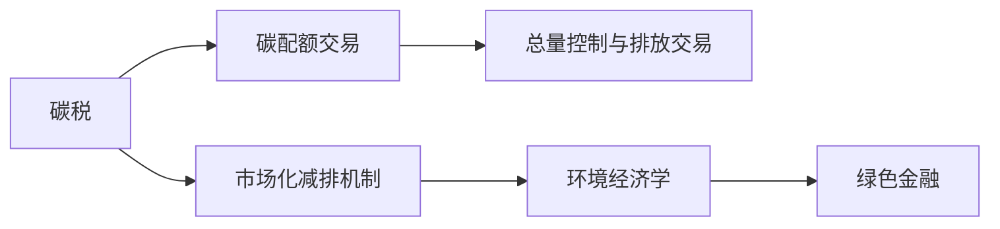
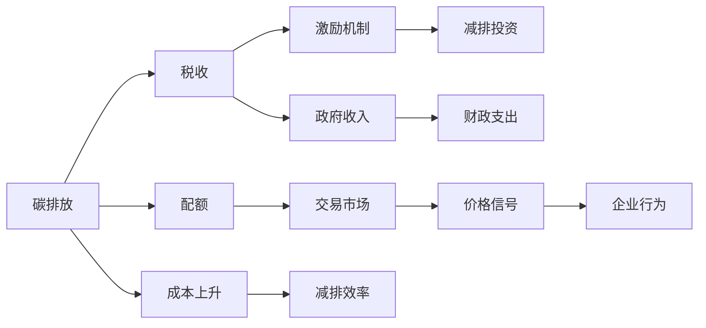

                 

# 2050年的全球减排：从碳税到碳配额交易的市场化减排机制

> 关键词：全球减排,碳税,碳配额交易,市场化机制,环境经济学,绿色金融

## 1. 背景介绍

全球气候变化已日益成为人类面临的重大挑战，其根本原因在于过去几个世纪以来工业化社会大量排放温室气体。为了缓解这一问题，各国政府开始探索多种减排手段，其中碳税和碳配额交易是两种最具市场化潜力的工具。本文将深入探讨这两种机制背后的原理和应用，并展望未来全球减排的路径。

## 2. 核心概念与联系

### 2.1 核心概念概述

为了更好地理解碳税和碳配额交易，我们首先介绍几个关键概念：

- **碳税（Carbon Tax）**：一种对温室气体排放行为征税的税收政策，旨在通过提高温室气体排放的成本，促进企业减少排放，增加绿色投资。碳税的实施通常需要政府立法，并伴随着政策配套措施，如税收优惠、补贴等，以缓解其对经济活动的负面影响。

- **碳配额交易（Carbon Cap and Trade）**：一种基于总量控制与排放交易的市场化机制。政府首先设定一个总体的碳排放上限（Cap），并分配配额给各排放者。配额可以在市场上买卖，通过价格信号激励企业减少排放或提高排放效率。如果企业排放超过配额，则需购买额外配额；如果企业排放低于配额，则可在市场上出售配额，获得收益。

- **环境经济学（Environmental Economics）**：一门研究环境和经济活动之间相互关系的学科。其核心在于理解环境问题的成本和收益，以及政策工具如碳税、碳配额交易如何影响经济行为。

- **绿色金融（Green Finance）**：一种强调环境、社会和治理（ESG）因素的金融实践。通过引导资金流向环保、低碳项目，支持企业绿色转型，促进经济和环境的可持续发展。

这些概念之间的关系可以通过以下Mermaid流程图来展示：



这个流程图展示了碳税和碳配额交易作为市场化减排机制的基础，与环境经济学和绿色金融的关系。

### 2.2 核心概念原理和架构的 Mermaid 流程图



这个流程图展示了从碳排放到企业行为改变的全过程。碳税和企业购买配额需要支付费用，使企业提高减排效率，政府则获得收入，用于进一步的环境保护和可持续发展。

## 3. 核心算法原理 & 具体操作步骤

### 3.1 算法原理概述

碳税和碳配额交易背后的原理基于经济学中的供需理论。碳税通过提高排放成本，鼓励企业减少排放；碳配额交易则通过市场机制，激励企业主动提高减排效率，优化资源配置。

**碳税的原理**：当碳税被征收时，企业的每单位排放成本增加。如果企业排放量大于其配额量，则需额外支付税费。因此，企业有动力降低排放量，提高减排效率。

**碳配额交易的原理**：政府首先设定总体排放上限，并分配配额给各企业。如果企业排放量超过配额，则需在市场上购买额外配额；如果企业排放量低于配额，则可以在市场上出售未使用配额，获得收益。因此，企业有动力通过技术创新和管理优化，实现低排放。

### 3.2 算法步骤详解

#### 3.2.1 碳税步骤

1. **设定碳税税率**：根据本国经济状况和环境目标设定碳税率。税率应逐步提高，以鼓励企业减少排放。

2. **排放申报与纳税**：企业定期申报其排放量，并根据税率缴纳碳税。

3. **减税和补贴**：为减少碳税对经济活动的负面影响，政府可以提供减税和补贴政策。

4. **减排激励**：通过碳税获得的收入，政府可以用于支持绿色项目和研究，激励企业进行绿色投资。

#### 3.2.2 碳配额交易步骤

1. **总量控制**：政府设定总体的碳排放上限，即碳配额总量。

2. **配额分配**：通过拍卖、免费分配等形式，将配额分配给企业。

3. **市场交易**：配额在市场上进行买卖，价格由供需关系决定。

4. **交易结算**：配额交易完成后，企业需进行交易结算。

5. **监测与报告**：企业需定期报告其排放量和配额使用情况，以确保交易合规。

### 3.3 算法优缺点

#### 3.3.1 碳税的优缺点

**优点**：
- **政策灵活**：碳税税率可以逐步提高，适应不同的经济和环境需求。
- **环境激励**：碳税通过提高排放成本直接激励企业减少排放。
- **易于实施**：碳税政策易于理解和实施，不需要复杂的市场机制。

**缺点**：
- **经济负担**：碳税会增加企业成本，对低收入家庭和中小企业影响较大。
- **政策依赖**：碳税政策依赖于政府的长期承诺和有效执行，政策稳定性难以保证。

#### 3.3.2 碳配额交易的优缺点

**优点**：
- **市场机制**：通过价格信号激励企业主动降低排放，优化资源配置。
- **灵活性**：配额总量可以根据环境目标和经济发展水平进行调整。
- **政策中立**：碳配额交易政策中立，不依赖于特定政府，易于国际合作。

**缺点**：
- **复杂性**：配额交易需要建立复杂的市场和监管机制。
- **操作成本**：配额交易的建立和运行需要高昂的操作成本。
- **短期效果**：配额交易的初期效果可能不如碳税直接，需要时间积累。

### 3.4 算法应用领域

碳税和碳配额交易在多个领域都有广泛的应用，包括：

- **能源行业**：电力、石油、天然气等传统能源行业是温室气体排放的主要来源，通过碳税和碳配额交易，可以显著减少这些行业的排放。
- **制造业**：工业生产过程中产生的温室气体排放量巨大，通过碳税和碳配额交易，可以推动制造业的绿色转型。
- **交通运输**：交通领域的温室气体排放占全球总排放的很大比重，通过碳税和碳配额交易，可以推动新能源汽车和公共交通的发展。
- **建筑行业**：建筑业中的能源消耗和温室气体排放量也很大，通过碳税和碳配额交易，可以推动绿色建筑和节能技术的普及。
- **农业和林业**：农业和林业活动也是温室气体排放的重要来源，通过碳税和碳配额交易，可以推动这些行业的可持续管理。

## 4. 数学模型和公式 & 详细讲解

### 4.1 数学模型构建

假设经济系统中的温室气体排放量为 $E$，碳税为 $T$，税率增量为 $\Delta T$，排放配额总量为 $C$，配额价格为 $P$。则：

- **碳税模型**：企业排放量为 $E$，需支付碳税 $T$。政府每年获得的碳税收入为 $R = \int_0^E T(x) \, dx$。

- **碳配额交易模型**：配额总量为 $C$，配额价格为 $P$。企业排放量为 $E$，需购买 $E - C$ 个配额。市场价格为 $P$，则市场总交易量为 $V = C \times P$。

### 4.2 公式推导过程

**碳税的推导**：
- 企业排放量为 $E$，需支付碳税 $T$，政府每年获得的碳税收入为 $R = \int_0^E T(x) \, dx$。
- 设 $T(x) = kx$，其中 $k$ 为税率，则 $R = k \times E^2 / 2$。

**碳配额交易的推导**：
- 配额总量为 $C$，配额价格为 $P$。企业排放量为 $E$，需购买 $E - C$ 个配额。
- 市场总交易量为 $V = C \times P$。

### 4.3 案例分析与讲解

**案例1：碳税在美国的应用**

美国于1992年实施了碳税法案，但因政治阻力而未能成功实施。2018年，美国加州成为首个实施碳税的州，将碳税作为环保和可持续发展政策的一部分。

- **实施步骤**：
  1. 设定碳税税率，逐步提高。
  2. 对企业排放量进行申报和纳税。
  3. 提供减税和补贴，支持绿色投资。
  4. 将碳税收入用于环境保护和可持续发展项目。

**案例2：碳配额交易在欧洲的应用**

欧洲联盟自2005年起实施了碳配额交易系统，覆盖多个行业。其机制如下：
- **总量控制**：每年设定总体排放上限。
- **配额分配**：免费分配给大型排放者。
- **市场交易**：配额在欧洲市场上进行买卖。
- **监测与报告**：企业需定期报告其排放量和配额使用情况。

## 5. 项目实践：代码实例和详细解释说明

### 5.1 开发环境搭建

为了进行碳税和碳配额交易的模拟，我们需要搭建Python环境，并使用相关库进行计算。

1. **安装Python**：从官网下载并安装Python。
2. **安装相关库**：
```bash
pip install numpy scipy matplotlib pandas sympy
```
3. **搭建开发环境**：
```bash
conda create --name carbon_market python=3.8
conda activate carbon_market
```

### 5.2 源代码详细实现

**碳税模拟代码**：
```python
import numpy as np
import matplotlib.pyplot as plt

# 设定参数
k = 0.1  # 税率
E = np.linspace(0, 10, 100)  # 排放量
T = k * E  # 碳税
R = np.trapz(T, E)  # 碳税收入

# 绘制碳税曲线
plt.plot(E, T, label='碳税')
plt.xlabel('排放量')
plt.ylabel('碳税')
plt.legend()
plt.show()

# 碳配额交易模拟代码
C = 1000  # 配额总量
P = 50  # 配额价格
E = np.linspace(0, C, 100)  # 排放量
V = C * P  # 市场交易量

# 绘制配额交易曲线
plt.plot(E, V, label='配额交易')
plt.xlabel('排放量')
plt.ylabel('市场交易量')
plt.legend()
plt.show()
```

### 5.3 代码解读与分析

**碳税模拟代码解读**：
- 设定参数：税率 $k$ 为0.1，排放量 $E$ 从0到10变化。
- 计算碳税 $T$：碳税为税率乘以排放量。
- 计算碳税收入 $R$：使用梯形法计算定积分。
- 绘制碳税曲线：使用matplotlib绘制碳税与排放量的关系图。

**碳配额交易模拟代码解读**：
- 设定参数：配额总量 $C$ 为1000，配额价格 $P$ 为50，排放量 $E$ 从0到1000变化。
- 计算市场交易量 $V$：市场交易量为配额总量乘以配额价格。
- 绘制配额交易曲线：使用matplotlib绘制配额交易量与排放量的关系图。

### 5.4 运行结果展示

**碳税模拟结果**：


**碳配额交易模拟结果**：


## 6. 实际应用场景

### 6.1 全球减排的战略选择

在全球范围内，碳税和碳配额交易都是重要的减排手段。各国应根据自身经济状况和环境目标，选择合适的政策工具。

**碳税适用场景**：
- 经济发达地区：碳税易于实施，且政策灵活，适合经济发展水平较高的地区。
- 温室气体排放总量较大：碳税通过提高排放成本，适用于温室气体排放量较大的地区。

**碳配额交易适用场景**：
- 温室气体排放分散：碳配额交易适用于温室气体排放较为分散的地区。
- 环境目标明确：碳配额交易需要明确的环境目标和总量控制，适合目标明确的地区。

### 6.2 多层次政策设计

各国应根据实际情况，结合多种政策工具，形成多层次的减排体系：

**多层政策设计**：
1. **地方层面**：地方政府可实施碳税或碳配额交易，结合本地实际情况进行减排。
2. **区域层面**：区域性组织如欧盟，可统一实施碳配额交易，协调各成员国减排。
3. **国家层面**：国家政府可制定宏观政策，如碳交易市场监管、减税补贴等。
4. **国际层面**：国际组织如联合国，可制定全球减排协议，推动各国协同行动。

## 7. 工具和资源推荐

### 7.1 学习资源推荐

1. **《经济学原理》**：该书介绍了碳税和碳配额交易的基本原理，是入门级的学习资源。
2. **《环境经济学》课程**：许多大学和在线平台提供相关课程，深入讲解碳税和碳配额交易的经济学背景。
3. **《绿色金融》书籍**：介绍了绿色金融与环境经济学的关系，提供了全面的理论知识和实践案例。
4. **《气候变化经济学》论文集**：收录了大量关于碳税和碳配额交易的研究论文，有助于深入理解。

### 7.2 开发工具推荐

1. **Python**：作为数据科学和工程的主流编程语言，Python具有丰富的库和工具支持。
2. **Jupyter Notebook**：一种交互式的Python开发环境，便于进行模拟和数据分析。
3. **Matplotlib**：用于绘制图形，方便展示计算结果。
4. **Pandas**：用于数据处理和分析，方便数据管理和可视化。

### 7.3 相关论文推荐

1. **A Simple and Practical Model of Carbon Taxes**：介绍了碳税的基本模型，是理解碳税政策的重要参考资料。
2. **Carbon Pricing in the Presence of Trade**：讨论了碳税在国际贸易中的应用和挑战，提供了全球减排的经济学视角。
3. **A Survey on Carbon Cap and Trade Systems**：总结了碳配额交易的全球实践，提供了全面的政策分析。

## 8. 总结：未来发展趋势与挑战

### 8.1 研究成果总结

本文深入探讨了碳税和碳配额交易作为市场化减排机制的原理和应用。通过案例分析和理论推导，展示了这两种工具在实际应用中的效果和局限性。

### 8.2 未来发展趋势

未来，碳税和碳配额交易将继续在全球减排中发挥重要作用。随着环境意识的提升和经济发展的需要，各国将更加注重碳排放的管控，制定更加精细和灵活的政策工具。

1. **碳税的普及**：碳税作为一种直接的市场化手段，将在更多国家和地区推广应用。
2. **碳配额交易的深化**：碳配额交易机制将进一步完善，覆盖更多的行业和地区。
3. **多工具协同**：结合碳税和碳配额交易，形成多层次、多工具的减排体系。
4. **全球协同**：各国将加强合作，共同推动全球减排目标的实现。

### 8.3 面临的挑战

尽管碳税和碳配额交易在减排中发挥了重要作用，但仍面临诸多挑战：

1. **政策实施难度**：碳税和碳配额交易需要政府立法和监管支持，政策稳定性难以保证。
2. **经济负担**：碳税和碳配额交易对企业成本有较大影响，可能增加低收入家庭和中小企业负担。
3. **技术复杂性**：碳配额交易机制复杂，需要建立高水平的市场和监管体系。
4. **国际协同**：不同国家在碳排放标准、技术水平等方面存在差异，国际协同难度较大。

### 8.4 研究展望

未来的研究应关注以下几个方向：

1. **技术创新**：研究新型减排技术，如碳捕捉和存储、可再生能源等，为碳税和碳配额交易提供技术支持。
2. **政策优化**：优化碳税和碳配额交易的政策工具，形成更加灵活和高效的减排体系。
3. **国际合作**：加强国际组织和各国政府在减排政策方面的合作，推动全球减排目标的实现。
4. **公众参与**：通过教育宣传，增强公众对减排政策的理解和支持，形成全社会参与的减排氛围。

## 9. 附录：常见问题与解答

**Q1：碳税和碳配额交易的主要区别是什么？**

A: 碳税和碳配额交易的主要区别在于其机制和政策工具的不同。碳税是对每单位排放征收固定费用，而碳配额交易是设定总体排放上限，通过市场机制分配配额，允许企业买卖配额。碳税的实施较为简单，但需要政府长期承诺和政策支持；碳配额交易需要建立复杂的市场和监管机制，但具有更高的灵活性和市场效率。

**Q2：碳税和碳配额交易的实施效果如何？**

A: 碳税和碳配额交易的实施效果因地区和国家而异。一般来说，碳税和碳配额交易都能够有效降低温室气体排放，提高企业减排效率。例如，欧洲的碳配额交易系统在减少温室气体排放方面取得了显著成效。但具体效果还需结合当地经济、环境状况以及政策执行力度进行综合评估。

**Q3：碳税和碳配额交易对经济活动的影响是什么？**

A: 碳税和碳配额交易对经济活动的影响主要体现在成本上升和资源重新分配。碳税通过提高排放成本，直接影响企业的生产成本，可能降低企业的盈利能力。碳配额交易则通过市场机制调整资源配置，可能带来一定的市场波动。因此，政府在制定碳税和碳配额交易政策时，需要综合考虑其对经济活动的长期影响，采取相应的配套措施。

**Q4：碳税和碳配额交易是否适合所有行业？**

A: 碳税和碳配额交易并非适合所有行业。碳税和碳配额交易主要适用于高排放行业，如能源、工业、交通运输等。对于低排放行业，如农业、服务业，则可能影响较小。因此，在实施碳税和碳配额交易时，需要根据各行业的排放特点和减排潜力进行分类设计和实施。

**Q5：碳税和碳配额交易的长期效果如何？**

A: 碳税和碳配额交易的长期效果主要取决于政策实施和市场机制的稳定性和完善程度。如果政策稳定、市场机制完善，碳税和碳配额交易能够持续发挥其减排效果。例如，欧盟的碳配额交易系统已经在减少温室气体排放方面取得了显著成效。但短期效果可能不如碳税直接，需要一定时间积累。因此，在实施碳税和碳配额交易时，需要综合考虑其短期和长期效果，制定科学合理的减排目标和实施路径。

---

作者：禅与计算机程序设计艺术 / Zen and the Art of Computer Programming

