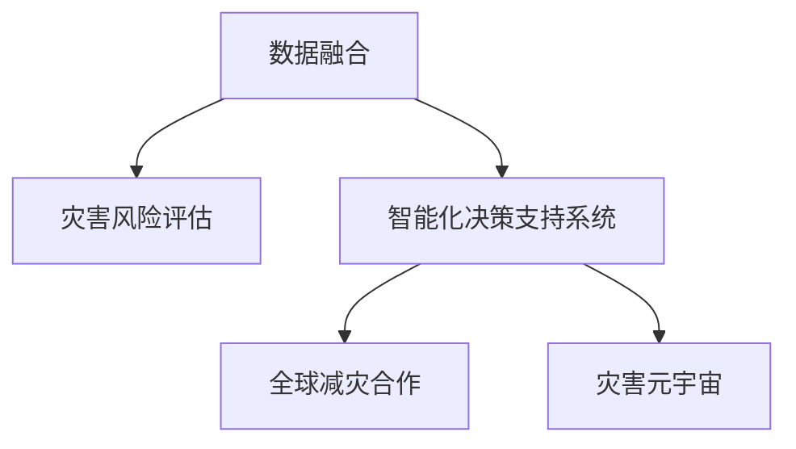

                 

# 2050年的全球减灾：从灾害元宇宙到全球减灾合作的减灾体系升级

> 关键词：灾害元宇宙, 全球减灾合作, 减灾体系升级, 数据融合, 灾害风险评估, 智能化决策系统, 自然灾害响应, 全球协同响应

## 1. 背景介绍

### 1.1 问题由来

随着全球气候变化加剧和城市化进程加速，自然灾害频发，给人类社会带来了巨大威胁。传统的减灾体系主要依赖于人力、物资和技术的有限投入，缺乏系统的数据支持、预警能力和智能决策支持。然而，技术的进步特别是人工智能和大数据技术的兴起，为构建新型减灾体系提供了可能。

为了应对这些挑战，全球各大科研机构、政府和私营部门开始探索并尝试通过技术手段，建立一个以数据为核心，以人工智能为驱动力的减灾体系。这种新的减灾体系不仅能够更好地预警和应对灾害，还能提升救援效率，减少灾害带来的损失。

### 1.2 问题核心关键点

构建新型减灾体系的核心在于：

1. **数据融合与处理**：整合各类灾害数据，包括气象、地质、环境等，构建统一的灾害数据库。
2. **风险评估与预警**：利用机器学习和大数据技术，对灾害数据进行深度分析和模型训练，实现精准的风险评估和预警。
3. **智能化决策支持**：通过建立智能化决策支持系统，提供快速响应和救援方案。
4. **全球协同响应**：通过区块链和物联网技术，实现国际间的灾害信息共享与协作。
5. **元宇宙与虚拟仿真**：构建灾害元宇宙，利用虚拟仿真技术进行灾前演练和灾后恢复，提升应急响应能力。

## 2. 核心概念与联系

### 2.1 核心概念概述

要构建2050年的全球减灾体系，需要理解以下核心概念及其相互关系：

- **灾害元宇宙（Disaster Metaverse）**：基于虚拟现实（VR）和增强现实（AR）技术构建的灾害场景模拟和训练平台，用于灾害应急演练、灾后恢复、灾害教育和公众意识提升。
- **全球减灾合作**：通过国际协作机制，实现灾害信息的共享和协同响应，提升全球减灾能力。
- **减灾体系升级**：通过对现有减灾体系进行数字化、智能化改造，实现更高效、更精准的灾害应对。
- **数据融合（Data Fusion）**：整合多种来源的数据，构建统一的灾害数据库，为减灾决策提供坚实的数据基础。
- **灾害风险评估**：通过机器学习和大数据分析，预测和评估灾害风险，为减灾决策提供科学依据。
- **智能化决策支持系统**：基于人工智能技术，构建集成的减灾决策支持系统，提高灾害应对的速度和效率。

这些概念共同构成了未来减灾体系的框架，使得技术能够更好地服务于减灾事业。

### 2.2 核心概念原理和架构的 Mermaid 流程图



这个流程图展示了减灾体系的核心组件及其相互关系：

- 数据融合为灾害风险评估提供数据支持。
- 灾害风险评估为智能化决策支持系统提供科学依据。
- 智能化决策支持系统与全球减灾合作共同构成减灾体系的智能化层。
- 灾害元宇宙提供了灾前演练和灾后恢复的虚拟平台。

## 3. 核心算法原理 & 具体操作步骤

### 3.1 算法原理概述

构建新型减灾体系的核心算法主要包括数据融合、灾害风险评估、智能化决策支持和全球减灾合作等几个方面。

### 3.2 算法步骤详解

#### 数据融合算法

数据融合算法旨在整合多源数据，构建统一的灾害数据库。具体步骤包括：

1. **数据采集与清洗**：从不同来源（如气象站、地质监测站、卫星数据等）获取数据，并进行清洗，去除噪声和异常值。
2. **数据标准化**：对不同格式和单位的数据进行标准化处理，确保数据一致性。
3. **数据融合算法**：采用加权平均、最大最小值法、多级融合等算法，将多源数据融合为一个综合的数据集。

#### 灾害风险评估算法

灾害风险评估算法利用机器学习和大数据技术，对整合后的数据进行深度分析，预测和评估灾害风险。具体步骤包括：

1. **数据预处理**：对整合后的数据进行归一化、特征提取等预处理。
2. **模型选择与训练**：选择适当的机器学习模型（如随机森林、支持向量机、神经网络等），并使用历史数据进行训练。
3. **风险预测**：将实时数据输入训练好的模型，预测未来一段时间内的灾害风险。

#### 智能化决策支持系统算法

智能化决策支持系统利用人工智能技术，提供快速响应和救援方案。具体步骤包括：

1. **模型选择与训练**：选择适当的机器学习模型，并使用历史数据进行训练。
2. **实时数据处理**：对实时数据进行预处理，提取关键特征。
3. **决策输出**：根据处理后的数据，输出相应的救援方案和决策建议。

#### 全球减灾合作算法

全球减灾合作算法利用区块链和物联网技术，实现国际间的灾害信息共享与协作。具体步骤包括：

1. **数据共享协议**：制定国际数据共享协议，明确各方数据共享的责任和权利。
2. **数据同步机制**：建立实时数据同步机制，确保全球范围内灾害信息的及时共享。
3. **协同响应平台**：构建协同响应平台，实现跨国界的灾害预警和响应。

#### 灾害元宇宙算法

灾害元宇宙算法利用虚拟现实（VR）和增强现实（AR）技术，构建灾害场景模拟和训练平台。具体步骤包括：

1. **虚拟环境构建**：使用VR和AR技术，构建逼真的灾害场景。
2. **灾害模拟与演练**：在虚拟环境中进行灾害模拟和应急演练，提升应急响应能力。
3. **灾害教育与公众意识提升**：通过虚拟平台进行灾害教育和公众意识提升，增强公众对灾害的认知和应对能力。

### 3.3 算法优缺点

#### 数据融合算法

**优点**：
- 能够整合多种来源的数据，构建统一的灾害数据库。
- 提供更全面、更准确的数据支持，提升减灾决策的科学性。

**缺点**：
- 数据来源多样，数据质量和格式不一致，增加了数据整合的难度。
- 数据量大，对计算资源和存储资源的需求较高。

#### 灾害风险评估算法

**优点**：
- 利用机器学习和大数据技术，提高预测的准确性和及时性。
- 提供科学的灾害风险评估，为减灾决策提供依据。

**缺点**：
- 模型复杂，对训练数据的数量和质量要求较高。
- 预测结果可能存在一定的误差，需要持续优化和调整。

#### 智能化决策支持系统算法

**优点**：
- 利用人工智能技术，提供快速响应和救援方案。
- 提升减灾决策的效率和精度。

**缺点**：
- 对模型的训练和维护要求较高。
- 系统复杂，对技术团队的要求较高。

#### 全球减灾合作算法

**优点**：
- 利用区块链和物联网技术，实现全球范围内的信息共享和协同响应。
- 提升全球减灾的效率和协调性。

**缺点**：
- 涉及多方协作，协调难度较大。
- 数据共享协议和机制的制定需要时间和成本。

#### 灾害元宇宙算法

**优点**：
- 提供虚拟平台进行灾前演练和灾后恢复，提升应急响应能力。
- 增强公众对灾害的认知和应对能力。

**缺点**：
- 技术实现复杂，对硬件和软件资源的要求较高。
- 成本较高，需要持续投入和维护。

### 3.4 算法应用领域

新型减灾体系涵盖多个领域，包括但不限于：

1. **气象灾害**：利用气象数据进行预测和预警，制定应急响应方案。
2. **地质灾害**：利用地质监测数据进行风险评估，制定灾害应对策略。
3. **环境灾害**：利用环境数据进行生态灾害预测和预警。
4. **城市灾害**：利用城市基础设施数据进行灾害风险评估，提升城市应急响应能力。
5. **农业灾害**：利用气象和土壤数据进行农作物病虫害预测，制定应对措施。

## 4. 数学模型和公式 & 详细讲解 & 举例说明

### 4.1 数学模型构建

灾害风险评估和智能化决策支持系统的核心在于数学模型的构建。这里以随机森林模型为例，说明如何构建灾害风险评估模型。

**输入**：历史气象数据、地质监测数据、环境数据等。

**输出**：未来一段时间内的灾害风险。

### 4.2 公式推导过程

假设我们有 $n$ 个历史样本，每个样本包含 $m$ 个特征 $(x_i, y_i)$，其中 $x_i$ 为特征向量，$y_i$ 为二元标签（0 表示未发生灾害，1 表示发生灾害）。

**训练过程**：
1. 随机选取 $n$ 个样本，分为训练集和测试集。
2. 对训练集进行特征提取和归一化。
3. 采用随机森林算法，训练模型。
4. 使用测试集验证模型，调整参数。

**预测过程**：
1. 对实时数据进行特征提取和归一化。
2. 将处理后的数据输入训练好的模型。
3. 输出预测结果，表示未来一段时间内的灾害风险。

### 4.3 案例分析与讲解

以地震风险评估为例，具体分析如下：

**数据**：历史地震数据、地质监测数据、气象数据等。

**模型选择**：随机森林模型。

**训练数据**：历史地震数据和地质监测数据。

**训练过程**：
1. 对数据进行特征提取和归一化。
2. 随机选取部分数据作为训练集，剩余数据作为验证集。
3. 使用随机森林算法，训练模型。
4. 在验证集上评估模型性能，调整参数。

**预测过程**：
1. 对实时地质监测数据和气象数据进行特征提取和归一化。
2. 将处理后的数据输入训练好的模型。
3. 输出预测结果，表示未来一定时间内的地震风险。

## 5. 项目实践：代码实例和详细解释说明

### 5.1 开发环境搭建

构建新型减灾体系的开发环境搭建主要涉及以下步骤：

1. **安装Python环境**：安装Python 3.x版本，推荐使用Anaconda或Miniconda。
2. **安装依赖库**：安装必要的依赖库，如NumPy、Pandas、Scikit-learn、TensorFlow、PyTorch等。
3. **配置环境变量**：配置环境变量，确保能够正常使用依赖库。

### 5.2 源代码详细实现

这里以随机森林模型为例，给出Python代码实现。

```python
import pandas as pd
import numpy as np
from sklearn.ensemble import RandomForestClassifier
from sklearn.model_selection import train_test_split
from sklearn.metrics import accuracy_score

# 加载数据
data = pd.read_csv('disaster_data.csv')

# 数据预处理
features = data[['weather', 'earthquake', 'pollution']]
labels = data['risk']

# 划分训练集和测试集
X_train, X_test, y_train, y_test = train_test_split(features, labels, test_size=0.2)

# 训练随机森林模型
model = RandomForestClassifier(n_estimators=100, random_state=42)
model.fit(X_train, y_train)

# 预测和评估
y_pred = model.predict(X_test)
print('Accuracy:', accuracy_score(y_test, y_pred))
```

### 5.3 代码解读与分析

上述代码实现了随机森林模型的训练和评估。具体解读如下：

1. **数据加载**：使用Pandas库加载灾害数据。
2. **数据预处理**：选择历史气象数据、地质监测数据和环境数据作为特征，二元标签表示灾害风险。
3. **数据划分**：使用train_test_split函数将数据划分为训练集和测试集。
4. **模型训练**：使用RandomForestClassifier训练随机森林模型。
5. **预测和评估**：使用模型对测试集进行预测，计算准确率。

## 6. 实际应用场景

### 6.1 气象灾害预警

气象灾害预警是新型减灾体系的重要应用场景之一。利用气象数据进行预测和预警，能够提升灾害应对的速度和效率。

具体实现步骤如下：

1. **数据采集**：收集历史气象数据和实时气象数据。
2. **数据预处理**：对数据进行清洗和归一化。
3. **模型训练**：使用机器学习模型进行训练，生成气象灾害预警系统。
4. **实时预警**：将实时气象数据输入模型，生成预警结果。

### 6.2 地质灾害风险评估

地质灾害风险评估通过地质监测数据和历史灾害数据，预测地质灾害的发生概率。

具体实现步骤如下：

1. **数据采集**：收集地质监测数据和历史灾害数据。
2. **数据预处理**：对数据进行清洗和归一化。
3. **模型训练**：使用机器学习模型进行训练，生成地质灾害风险评估系统。
4. **风险预测**：将实时地质监测数据输入模型，生成未来一段时间内的风险评估结果。

### 6.3 城市应急响应

城市应急响应系统通过城市基础设施数据和历史灾害数据，预测城市灾害风险，制定应急响应策略。

具体实现步骤如下：

1. **数据采集**：收集城市基础设施数据和历史灾害数据。
2. **数据预处理**：对数据进行清洗和归一化。
3. **模型训练**：使用机器学习模型进行训练，生成城市应急响应系统。
4. **应急响应**：根据预测结果，制定相应的应急响应策略。

### 6.4 全球协同响应

全球协同响应系统利用区块链和物联网技术，实现国际间的灾害信息共享和协同响应。

具体实现步骤如下：

1. **数据共享协议**：制定国际数据共享协议。
2. **数据同步机制**：建立实时数据同步机制。
3. **协同响应平台**：构建协同响应平台，实现跨国界的灾害预警和响应。

## 7. 工具和资源推荐

### 7.1 学习资源推荐

1. **《Python数据科学手册》**：详细介绍了Python在数据科学和机器学习中的应用。
2. **Coursera《机器学习》课程**：由斯坦福大学Andrew Ng教授主讲，涵盖了机器学习的基础知识和算法实现。
3. **Kaggle竞赛平台**：提供大量数据集和竞赛机会，帮助学习者实践和提升技能。
4. **GitHub开源项目**：提供大量开源项目和代码示例，供学习者参考和学习。

### 7.2 开发工具推荐

1. **Anaconda**：强大的Python环境管理工具，支持虚拟环境管理、包安装等。
2. **Jupyter Notebook**：交互式Python编程环境，方便调试和展示代码。
3. **TensorFlow**：开源机器学习框架，支持分布式计算和深度学习。
4. **PyTorch**：开源机器学习框架，支持动态计算图和深度学习。
5. **AWS SageMaker**：云端机器学习平台，提供丰富的开发和部署工具。

### 7.3 相关论文推荐

1. **《深度学习》（Ian Goodfellow等著）**：深度学习领域的经典教材，涵盖了深度学习的理论基础和实践应用。
2. **《机器学习实战》（Peter Harrington著）**：详细介绍了机器学习算法和代码实现。
3. **《Python深度学习》（Francois Chollet著）**：介绍TensorFlow和Keras的使用和深度学习模型的构建。

## 8. 总结：未来发展趋势与挑战

### 8.1 研究成果总结

新型减灾体系的成功构建，得益于数据融合、灾害风险评估、智能化决策支持和全球减灾合作等关键技术的综合应用。这些技术的不断进步，使得减灾决策更加科学、精准和高效。

### 8.2 未来发展趋势

1. **数据融合技术的持续进步**：随着物联网和传感器技术的普及，将有更多数据源可供整合，提升减灾决策的全面性和准确性。
2. **灾害风险评估模型的优化**：利用深度学习和强化学习技术，提升预测模型的准确性和鲁棒性。
3. **智能化决策系统的智能化提升**：通过引入自然语言处理和知识图谱技术，提升决策系统的智能水平。
4. **全球协同响应的深化**：利用区块链和物联网技术，实现更高效、更紧密的国际协作。
5. **灾害元宇宙的拓展应用**：构建更逼真的虚拟仿真环境，提升应急演练和公众教育的效果。

### 8.3 面临的挑战

1. **数据获取和处理**：数据来源多样，数据质量和格式不一致，增加了数据整合的难度。
2. **模型复杂度**：大规模模型的训练和维护需要大量资源和时间。
3. **技术协同**：涉及多方协作，协调难度较大。
4. **成本问题**：技术实施成本较高，需要持续投入和维护。

### 8.4 研究展望

未来，新型减灾体系需要进一步优化和完善，以应对更多挑战和提升减灾效果。

1. **跨学科合作**：加强与其他学科的合作，如气象学、地质学、城市规划等，提升减灾决策的科学性。
2. **技术集成**：将灾害元宇宙、区块链、物联网等技术深度集成，构建更加全面的减灾体系。
3. **公众参与**：通过灾害元宇宙和公众教育平台，提升公众对灾害的认知和应对能力。
4. **持续改进**：根据灾害数据和反馈，不断优化和改进减灾体系，确保其有效性和可靠性。

## 9. 附录：常见问题与解答

**Q1：数据融合技术在减灾决策中的作用是什么？**

A: 数据融合技术通过整合多种来源的数据，构建统一的灾害数据库，为减灾决策提供坚实的数据基础。通过数据融合，可以获取更全面、更准确的灾害信息，提升减灾决策的科学性和精准性。

**Q2：如何选择合适的机器学习模型进行灾害风险评估？**

A: 选择合适的机器学习模型需要考虑以下因素：
1. 数据类型和分布：如分类问题、回归问题、时间序列等。
2. 模型复杂度：如线性模型、决策树、随机森林、神经网络等。
3. 数据量：如大数据集适合使用深度学习模型，小数据集适合使用传统机器学习模型。
4. 计算资源：如计算资源充足，可以使用复杂的深度学习模型，否则可以选择简单的模型。

**Q3：全球协同响应系统的实现需要注意哪些关键问题？**

A: 全球协同响应系统的实现需要注意以下关键问题：
1. 数据共享协议：制定国际数据共享协议，明确各方数据共享的责任和权利。
2. 数据同步机制：建立实时数据同步机制，确保全球范围内灾害信息的及时共享。
3. 协同响应平台：构建协同响应平台，实现跨国界的灾害预警和响应。

**Q4：如何提高灾害元宇宙平台的实用性？**

A: 提高灾害元宇宙平台的实用性需要从以下几方面入手：
1. 构建逼真的虚拟环境：使用VR和AR技术，构建逼真的灾害场景。
2. 灾害模拟和演练：在虚拟环境中进行灾害模拟和应急演练，提升应急响应能力。
3. 灾害教育和公众意识提升：通过虚拟平台进行灾害教育和公众意识提升，增强公众对灾害的认知和应对能力。

**Q5：减灾体系的持续改进需要注意哪些关键问题？**

A: 减灾体系的持续改进需要注意以下关键问题：
1. 数据更新和维护：持续更新灾害数据，保持数据的准确性和及时性。
2. 模型优化和调整：根据新数据和反馈，不断优化和调整模型，提高预测的准确性和鲁棒性。
3. 技术升级和创新：引入最新的技术和算法，提升减灾决策的效率和精度。
4. 反馈机制和用户参与：建立用户反馈机制，提升公众对减灾体系的认知和参与度。

---

作者：禅与计算机程序设计艺术 / Zen and the Art of Computer Programming

