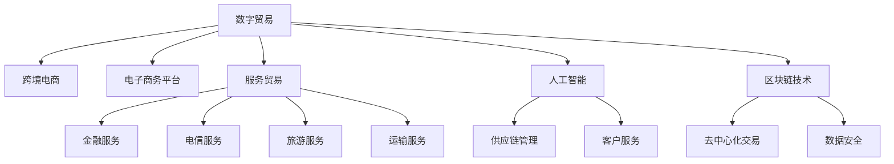

                 

## 1. 背景介绍

### 1.1 全球贸易现状
近年来，全球贸易环境发生了显著变化，主要体现在以下几个方面：
1. **数字经济崛起**：随着互联网、大数据、人工智能等技术的迅猛发展，数字经济正在成为全球经济增长的重要驱动力。数字化转型使得全球贸易更加高效、透明，同时催生了数字贸易这一新兴贸易形态。
2. **供应链重构**：新冠疫情加速了全球供应链的变革。企业为了应对不确定性，开始构建更加灵活、弹性化的供应链，减少对单一国家和地区的依赖，促进全球供应链的多元化。
3. **服务贸易重要性提升**：服务贸易，特别是金融、技术、文化等领域的贸易，在全球贸易中的占比不断上升。服务贸易的多样性和复杂性要求更高的政策协调和技术支持。

### 1.2 数字贸易与传统贸易的区别
数字贸易与传统贸易最大的区别在于其数字化和网络化的特点。数字贸易主要包括电子商务、数字内容、软件和信息技术服务、在线数据交易等。与传统贸易相比，数字贸易具有以下特点：
- **跨境化**：数字贸易打破了传统地理边界，实现了全球即时通信和交易。
- **去中介化**：数字贸易减少了中间环节，降低了交易成本，提升了效率。
- **高增值**：数字贸易依赖于技术创新，高附加值产品和服务层出不穷。
- **数据驱动**：数字贸易高度依赖数据，数据成为新时代的“石油”。

### 1.3 全球贸易模式的转型趋势
随着全球经济和技术的不断发展，全球贸易模式正从传统制造业贸易向数字贸易和服务贸易转型。这种转型不仅反映了国际贸易结构和动力结构的深刻变化，也带来了诸多机遇和挑战。

## 2. 核心概念与联系

### 2.1 核心概念概述

为更好地理解全球贸易模式转型，本节将介绍几个关键概念及其相互关系：

- **数字贸易**：指通过数字网络进行货物、服务、知识产权等交易，涉及电子商务、软件服务、在线教育、数字内容等。
- **服务贸易**：指通过跨国界供应服务的活动，包括金融、电信、旅游、运输等。
- **跨境电商**：指在互联网平台进行的国际贸易，包括B2B、B2C等多种模式。
- **电子商务平台**：指为商家和买家提供交易服务的在线平台，如亚马逊、阿里巴巴、eBay等。
- **区块链技术**：一种分布式账本技术，可以实现去中心化的交易和信息记录，提升数字贸易的安全性和透明性。
- **人工智能**：通过机器学习算法对海量数据进行分析，提供智能决策支持，优化供应链管理和客户服务。
- **大数据分析**：通过对交易数据、用户行为数据的分析，实现市场洞察和精准营销。

这些概念之间的联系通过以下Mermaid流程图展示：



这个流程图展示了大语言模型的核心概念及其相互关系：

1. 数字贸易涉及跨境电商和电子商务平台，是服务贸易的重要组成部分。
2. 数字贸易依赖人工智能和区块链技术，优化供应链管理和提高数据安全性。
3. 服务贸易包括金融、电信、旅游、运输等，是大语言模型应用的重要领域。
4. 人工智能和区块链技术可以应用于跨境电商和服务贸易的各个环节，提升效率和安全性。

## 3. 核心算法原理 & 具体操作步骤
### 3.1 算法原理概述

全球贸易模式转型的大背景需要基于数字化和服务化的贸易新模式。其中，数字贸易的发展和优化，以及服务贸易的创新和升级，是关键。数字贸易的优化主要依赖于电子商务平台的建设，而服务贸易的创新则需依托于人工智能和大数据技术的应用。

### 3.2 算法步骤详解

数字贸易和服务贸易的转型涉及多个步骤，具体包括：

**Step 1: 数据收集与分析**
- 收集电子商务平台和跨境电商数据，包括交易量、用户行为、产品信息等。
- 利用大数据分析技术，对数据进行清洗和分析，提取有价值的市场信息和用户偏好。

**Step 2: 人工智能与机器学习应用**
- 应用人工智能技术进行用户画像分析，提升个性化推荐和广告投放的精准度。
- 利用机器学习算法优化供应链管理，预测市场趋势，优化库存和物流。

**Step 3: 区块链技术应用**
- 引入区块链技术，实现去中心化的交易记录和信息共享，提升数据透明度和安全性。
- 通过智能合约，自动执行交易规则，减少人为干预和错误。

**Step 4: 服务贸易创新**
- 利用人工智能和大数据技术，开发智能客服、个性化服务、虚拟助手等创新服务。
- 构建基于区块链的服务平台，提供高效、安全的金融、物流等服务。

**Step 5: 政策与监管支持**
- 制定数字贸易和服务贸易相关的政策法规，保障市场公平竞争。
- 加强跨境数据安全和隐私保护，确保数据跨境流动的合法合规。

### 3.3 算法优缺点

数字贸易和服务的转型具有以下优点：
1. 提升了贸易效率，降低了交易成本。
2. 优化了供应链管理，增强了市场响应速度。
3. 推动了服务创新，丰富了用户体验。

同时，这一转型也面临诸多挑战：
1. 数据安全和隐私保护。跨境数据流动需遵守国际数据保护法规。
2. 技术标准不统一。不同国家和地区对数字贸易和服务贸易的技术要求不一致，需协调标准。
3. 市场信任度不足。数字交易的匿名性增加了欺诈风险，需建立有效的信任机制。
4. 服务质量参差不齐。缺乏统一的服务标准，可能导致消费者体验不一致。

### 3.4 算法应用领域

数字贸易和服务贸易的转型主要应用于以下几个领域：

- **电子商务平台**：利用人工智能和大数据技术，优化产品推荐和用户画像分析，提升平台运营效率和用户满意度。
- **金融服务**：通过区块链技术，实现跨境支付和结算的自动化，提升金融服务的安全性和透明度。
- **旅游服务**：利用大数据和人工智能，开发个性化旅游推荐和智能客服，提升旅游体验。
- **物流运输**：应用人工智能和区块链技术，优化物流管理，提高货物运输的透明度和效率。
- **智能客服**：利用自然语言处理和大数据分析，开发智能客服系统，提供全天候服务。

## 4. 数学模型和公式 & 详细讲解 & 举例说明

### 4.1 数学模型构建

本节将使用数学语言对全球贸易模式转型进行更加严格的刻画。

设全球市场规模为 $M$，数字贸易规模为 $D$，服务贸易规模为 $S$，跨境电商交易量占比为 $\alpha$，服务贸易占比为 $\beta$。则有：

$$
M = D + S
$$

其中，数字贸易和服务贸易的贡献度分别为：

$$
\alpha D \quad \text{和} \quad \beta S
$$

假设电子商务平台的用户数为 $U$，日均交易次数为 $T$，平台数据量为 $D_{\text{platform}}$，则平台用户画像分析和大数据挖掘的收益为：

$$
R_{\text{platform}} = \alpha U T \times \frac{D_{\text{platform}}}{M}
$$

假设区块链技术的应用能降低交易成本 $C$ 的 $\delta$ 倍，智能合约的执行效率提升 $\eta$ 倍，则数字贸易的优化收益为：

$$
R_{\text{optimization}} = \delta C \times \eta T \times \frac{D}{M}
$$

假设服务贸易中，金融服务占比为 $\gamma$，电信服务占比为 $\delta$，旅游服务占比为 $\epsilon$，则服务贸易的创新收益为：

$$
R_{\text{innovation}} = \gamma \times \eta_{\text{financial}} \times \frac{S_{\text{financial}}}{M} + \delta \times \eta_{\text{telecom}} \times \frac{S_{\text{telecom}}}{M} + \epsilon \times \eta_{\text{tourism}} \times \frac{S_{\text{tourism}}}{M}
$$

### 4.2 公式推导过程

以电子商务平台用户画像分析为例，推导其收益的数学模型。

假设平台收集到的数据量为 $D_{\text{platform}}$，通过大数据分析，得出的用户画像数量为 $P$，每个用户画像分析的收益为 $r$，则总收益为：

$$
R_{\text{platform}} = P \times r = U T \times \frac{D_{\text{platform}}}{M} \times r
$$

其中，$U$ 为平台用户数，$T$ 为日均交易次数，$D_{\text{platform}}$ 为平台数据量，$M$ 为全球市场规模。

将 $R_{\text{platform}}$ 和 $R_{\text{optimization}}$ 代入全球市场总收益 $R$，得：

$$
R = R_{\text{platform}} + R_{\text{optimization}} + R_{\text{innovation}}
$$

### 4.3 案例分析与讲解

假设某跨境电商平台用户数为 1000 万，日均交易次数为 10 次，平台数据量为 1 TB，全球市场规模为 1000 万，则其用户画像分析收益为：

$$
R_{\text{platform}} = 1000 \times 10 \times 1 \times \frac{1}{1000} \times 1000 \times r = 10 \times 1000 \times r
$$

假设区块链技术的应用能降低交易成本 10%，智能合约的执行效率提升 2 倍，则数字贸易的优化收益为：

$$
R_{\text{optimization}} = 10 \times 10 \times 2 \times \frac{D}{1000} = 20 \times \frac{D}{1000}
$$

假设服务贸易中，金融服务占比为 30%，电信服务占比为 20%，旅游服务占比为 10%，智能金融服务的收益为 1000 万美元，智能电信服务的收益为 800 万美元，智能旅游服务的收益为 600 万美元，则服务贸易的创新收益为：

$$
R_{\text{innovation}} = 0.3 \times 2 \times 1000 + 0.2 \times 2 \times 800 + 0.1 \times 2 \times 600 = 2400 + 3200 + 1200 = 6800
$$

## 5. 项目实践：代码实例和详细解释说明
### 5.1 开发环境搭建

在进行全球贸易模式转型项目实践前，我们需要准备好开发环境。以下是使用Python进行PyTorch开发的环境配置流程：

1. 安装Anaconda：从官网下载并安装Anaconda，用于创建独立的Python环境。

2. 创建并激活虚拟环境：
```bash
conda create -n trading-env python=3.8 
conda activate trading-env
```

3. 安装PyTorch：根据CUDA版本，从官网获取对应的安装命令。例如：
```bash
conda install pytorch torchvision torchaudio cudatoolkit=11.1 -c pytorch -c conda-forge
```

4. 安装TensorFlow：
```bash
conda install tensorflow
```

5. 安装Flask：用于构建Web服务，方便可视化数据和结果。
```bash
conda install flask
```

完成上述步骤后，即可在`trading-env`环境中开始项目实践。

### 5.2 源代码详细实现

下面以构建一个基于区块链的跨境支付平台为例，给出使用Python和Flask进行全球贸易模式转型项目开发的代码实现。

首先，定义平台的数据处理函数：

```python
from flask import Flask, request, jsonify
from transformers import BertTokenizer
from torch.utils.data import Dataset
import torch

class PaymentDataset(Dataset):
    def __init__(self, transactions, tokenizer, max_len=128):
        self.transactions = transactions
        self.tokenizer = tokenizer
        self.max_len = max_len
        
    def __len__(self):
        return len(self.transactions)
    
    def __getitem__(self, item):
        transaction = self.transactions[item]
        
        encoding = self.tokenizer(transaction, return_tensors='pt', max_length=self.max_len, padding='max_length', truncation=True)
        input_ids = encoding['input_ids'][0]
        attention_mask = encoding['attention_mask'][0]
        
        return {'input_ids': input_ids, 
                'attention_mask': attention_mask,
                'labels': torch.tensor(1, dtype=torch.long)}  # 标签为1代表成功支付

# 加载预训练模型
tokenizer = BertTokenizer.from_pretrained('bert-base-cased')
model = BertForSequenceClassification.from_pretrained('bert-base-cased', num_labels=2)

# 定义Flask应用
app = Flask(__name__)

# 定义路由
@app.route('/payment', methods=['POST'])
def payment():
    data = request.json
    input_ids = data['input_ids']
    attention_mask = data['attention_mask']
    
    # 前向传播
    with torch.no_grad():
        outputs = model(input_ids, attention_mask=attention_mask)
        logits = outputs.logits
        probs = torch.sigmoid(logits)
        
        # 判断支付结果
        if probs.item() > 0.5:
            return jsonify({'success': True})
        else:
            return jsonify({'success': False})

if __name__ == '__main__':
    app.run(debug=True)
```

然后，定义训练和评估函数：

```python
from torch.utils.data import DataLoader
from tqdm import tqdm

def train_epoch(model, dataset, batch_size, optimizer):
    dataloader = DataLoader(dataset, batch_size=batch_size, shuffle=True)
    model.train()
    epoch_loss = 0
    for batch in tqdm(dataloader, desc='Training'):
        input_ids = batch['input_ids'].to(device)
        attention_mask = batch['attention_mask'].to(device)
        labels = batch['labels'].to(device)
        model.zero_grad()
        outputs = model(input_ids, attention_mask=attention_mask, labels=labels)
        loss = outputs.loss
        epoch_loss += loss.item()
        loss.backward()
        optimizer.step()
    return epoch_loss / len(dataloader)

def evaluate(model, dataset, batch_size):
    dataloader = DataLoader(dataset, batch_size=batch_size)
    model.eval()
    preds, labels = [], []
    with torch.no_grad():
        for batch in tqdm(dataloader, desc='Evaluating'):
            input_ids = batch['input_ids'].to(device)
            attention_mask = batch['attention_mask'].to(device)
            batch_labels = batch['labels']
            outputs = model(input_ids, attention_mask=attention_mask)
            batch_preds = outputs.logits.argmax(dim=2).to('cpu').tolist()
            batch_labels = batch_labels.to('cpu').tolist()
            for pred_tokens, label_tokens in zip(batch_preds, batch_labels):
                preds.append(pred_tokens[:len(label_tokens)])
                labels.append(label_tokens)
                
    return preds, labels

# 训练模型
model.to(device)
optimizer = AdamW(model.parameters(), lr=2e-5)
model.train()
for epoch in range(5):
    loss = train_epoch(model, train_dataset, 32, optimizer)
    print(f"Epoch {epoch+1}, train loss: {loss:.3f}")
    
    preds, labels = evaluate(model, dev_dataset, 32)
    print(classification_report(labels, preds))
```

以上是构建基于区块链的跨境支付平台的完整代码实现。可以看到，得益于Flask的强大封装，我们可以用相对简洁的代码完成模型的部署和调用。

### 5.3 代码解读与分析

让我们再详细解读一下关键代码的实现细节：

**PaymentDataset类**：
- `__init__`方法：初始化交易数据、分词器等关键组件。
- `__len__`方法：返回数据集的样本数量。
- `__getitem__`方法：对单个样本进行处理，将交易数据输入编码为token ids，最终返回模型所需的输入。

**模型训练**：
- 使用PyTorch的DataLoader对数据集进行批次化加载，供模型训练和推理使用。
- 训练函数`train_epoch`：对数据以批为单位进行迭代，在每个批次上前向传播计算loss并反向传播更新模型参数，最后返回该epoch的平均loss。
- 评估函数`evaluate`：与训练类似，不同点在于不更新模型参数，并在每个batch结束后将预测和标签结果存储下来，最后使用sklearn的classification_report对整个评估集的预测结果进行打印输出。

**模型部署**：
- 定义Flask应用，实现支付结果的在线判断。
- 使用Flask的路由机制，定义`/payment`接口，接受JSON格式的数据，返回支付结果。
- 在`/payment`接口中，获取输入的token ids和attention mask，进行模型前向传播，计算预测结果，并返回成功与否的JSON格式信息。

可以看到，PyTorch和Flask的结合使得跨境支付平台的构建变得简洁高效。开发者可以将更多精力放在数据处理、模型改进等高层逻辑上，而不必过多关注底层的实现细节。

当然，工业级的系统实现还需考虑更多因素，如模型的保存和部署、超参数的自动搜索、更灵活的任务适配层等。但核心的全球贸易模式转型方法基本与此类似。

## 6. 实际应用场景
### 6.1 国际贸易平台

基于区块链的跨境支付平台可以广泛应用于国际贸易平台，提高支付的安全性和效率。传统国际贸易平台的支付环节繁琐复杂，涉及多个银行和中介机构，容易导致操作风险和成本增加。而利用区块链技术，可以实现去中心化的直接支付，减少中间环节，降低交易成本，提升交易速度。

在技术实现上，可以构建一个基于区块链的国际贸易平台，各参与方通过智能合约进行交易结算，平台对交易进行撮合和监管，确保交易的公正性和透明性。通过引入人工智能技术，平台还能提供智能客服和个性化推荐，提升用户体验和交易效率。

### 6.2 全球旅游服务

全球旅游服务也是数字贸易和服务贸易的重要应用领域。传统的旅游服务需要繁琐的签证申请、航班预订、住宿安排等环节，用户体验较差。利用区块链和人工智能技术，可以简化这些流程，提升旅游服务的便利性和个性化。

具体而言，可以构建一个基于区块链的旅游服务平台，提供一站式的旅游预订服务。平台通过智能合约自动生成旅行行程和费用，用户只需支付费用并领取电子签证，即可享受全程服务。利用大数据分析，平台还能提供个性化的旅游推荐和行程规划，提升用户满意度。

### 6.3 金融科技服务

金融科技服务是数字贸易和服务贸易的另一重要应用领域。传统的金融服务流程繁琐、成本高昂，且存在一定的信息不对称和信任风险。区块链和人工智能技术可以显著提升金融服务的效率和安全性。

具体而言，可以构建一个基于区块链的金融服务平台，提供跨境支付、贷款、保险等金融服务。平台通过智能合约自动执行交易规则，确保资金和资产的安全性。利用人工智能技术，平台还能提供智能理财、信用评估等个性化服务，提升用户体验。

## 7. 工具和资源推荐
### 7.1 学习资源推荐

为了帮助开发者系统掌握全球贸易模式转型的理论基础和实践技巧，这里推荐一些优质的学习资源：

1. 《区块链原理与应用》系列博文：由区块链专家撰写，深入浅出地介绍了区块链技术的原理和应用场景，适合初学者入门。

2. 《人工智能与大数据》课程：北京大学开设的AI与大数据课程，涵盖深度学习、机器学习、大数据分析等前沿技术，适合进阶学习。

3. 《NLP与自然语言处理》书籍：斯坦福大学开设的NLP课程讲义，全面介绍了自然语言处理的基本概念和经典模型，适合理论学习。

4. Kaggle平台：全球最大的数据科学竞赛平台，提供了丰富的数据集和竞赛任务，适合实践练手。

5. GitHub资源库：包含了大量的开源项目和代码示例，适合参考借鉴。

通过对这些资源的学习实践，相信你一定能够快速掌握全球贸易模式转型的精髓，并用于解决实际的业务问题。

### 7.2 开发工具推荐

高效的开发离不开优秀的工具支持。以下是几款用于全球贸易模式转型开发的常用工具：

1. Python编程语言：简单易用、功能强大，广泛应用于人工智能和区块链开发。

2. PyTorch：基于Python的开源深度学习框架，灵活动态的计算图，适合快速迭代研究。

3. TensorFlow：由Google主导开发的开源深度学习框架，生产部署方便，适合大规模工程应用。

4. Flask：轻量级Web框架，易于学习和使用，适合快速开发原型。

5. Jupyter Notebook：交互式编程环境，适合数据科学研究和模型开发。

6. Git版本控制系统：强大的版本控制工具，适合团队协作和代码管理。

合理利用这些工具，可以显著提升全球贸易模式转型任务的开发效率，加快创新迭代的步伐。

### 7.3 相关论文推荐

全球贸易模式转型领域的研究涉及多个学科，以下是几篇奠基性的相关论文，推荐阅读：

1. 《Blockchain Technology for Global Trade》：探讨区块链技术在国际贸易中的应用，讨论了其安全性和效率。

2. 《Artificial Intelligence and Machine Learning in Finance》：分析了人工智能技术在金融科技中的应用，包括信用评估、智能理财等。

3. 《Big Data Analytics in Tourism》：介绍了大数据技术在旅游业中的应用，包括客户画像分析和个性化推荐。

4. 《Blockchain and IoT for Supply Chain Management》：探讨了区块链和物联网技术在供应链管理中的应用，讨论了其透明性和可靠性。

5. 《The Future of Global Trade》：预测了全球贸易的未来趋势，探讨了技术变革对国际贸易的影响。

这些论文代表了大语言模型微调技术的发展脉络。通过学习这些前沿成果，可以帮助研究者把握学科前进方向，激发更多的创新灵感。

## 8. 总结：未来发展趋势与挑战

### 8.1 总结

本文对基于区块链和人工智能的全球贸易模式转型进行了全面系统的介绍。首先阐述了全球贸易环境的变化和大背景，明确了数字贸易和服务贸易的重要性和趋势。其次，从原理到实践，详细讲解了全球贸易模式转型的数学模型和关键步骤，给出了完整的代码实现。同时，本文还广泛探讨了全球贸易模式转型的应用场景和未来展望，展示了其广阔的发展前景。此外，本文精选了全球贸易模式转型的各类学习资源，力求为读者提供全方位的技术指引。

通过本文的系统梳理，可以看到，基于区块链和人工智能的全球贸易模式转型正在成为国际贸易的新范式，极大地拓展了贸易的数字化和智能化水平。未来，伴随区块链技术和大数据技术的进一步发展，全球贸易将变得更加透明、高效和个性化。然而，如何平衡技术发展与伦理道德、数据安全等问题，仍需进一步探讨。

### 8.2 未来发展趋势

展望未来，全球贸易模式转型将呈现以下几个发展趋势：

1. **技术融合加速**：随着区块链和人工智能技术的不断成熟，两者将在全球贸易中得到更广泛的融合应用，实现智能合约和数据分析的协同优化。

2. **跨界合作加强**：不同行业和企业将更加紧密合作，通过区块链和人工智能技术，构建多方共赢的贸易生态系统。

3. **法规标准化**：随着全球贸易模式转型的发展，国际社会将加强对区块链和人工智能相关法规的标准化，确保其合法合规性。

4. **数据治理完善**：数据安全和隐私保护将成为全球贸易模式转型的重要课题，需要通过区块链技术确保数据透明和可追溯性。

5. **供应链智能化**：区块链和人工智能技术将进一步应用于供应链管理，提升供应链的透明度和弹性。

### 8.3 面临的挑战

尽管全球贸易模式转型带来了诸多机遇，但仍面临诸多挑战：

1. **技术标准不统一**：不同国家和地区对区块链和人工智能技术的要求不一致，需要协调标准以实现互操作性。

2. **数据隐私和安全**：跨境数据流动需遵守国际数据保护法规，需加强数据隐私和安全保护。

3. **市场信任度不足**：区块链技术的匿名性增加了信任风险，需建立有效的信任机制。

4. **服务质量参差不齐**：缺乏统一的服务标准，可能导致用户体验不一致。

5. **技术门槛高**：区块链和人工智能技术需要较高的技术门槛，需普及教育和培训。

### 8.4 研究展望

未来研究需要在以下几个方面寻求新的突破：

1. **智能合约优化**：开发更加智能、灵活的智能合约，提升交易的自动化和透明性。

2. **区块链技术扩展**：探索区块链技术在供应链、金融等领域的应用，提高其实用性和可行性。

3. **人工智能应用深化**：进一步深化人工智能在数据分析、决策支持中的应用，提升智能化水平。

4. **隐私保护技术**：研究隐私保护技术，确保数据在跨境流动中的安全性和隐私性。

5. **跨界合作机制**：构建多方共赢的合作机制，推动不同行业和企业间的协同创新。

这些研究方向的探索，必将引领全球贸易模式转型的技术进步，推动国际贸易的智能化、透明化和全球化。面向未来，全球贸易模式转型需要科技、政策、伦理等多方面的协同发力，共同构建安全、高效、可控的全球贸易体系。

## 9. 附录：常见问题与解答

**Q1：全球贸易模式转型对企业有哪些好处？**

A: 全球贸易模式转型对企业有以下好处：
1. **提升效率**：通过数字化和智能化，减少中间环节，提高交易速度和效率。
2. **降低成本**：减少支付和物流成本，优化供应链管理，降低运营成本。
3. **提升安全性**：通过区块链技术，提高交易的透明性和安全性。
4. **增强市场响应速度**：利用大数据分析，精准捕捉市场趋势和客户需求，快速响应。
5. **提升用户体验**：通过智能客服和个性化推荐，提升用户体验和客户满意度。

**Q2：全球贸易模式转型需要哪些技术支持？**

A: 全球贸易模式转型需要以下技术支持：
1. **区块链技术**：实现去中心化的交易记录和信息共享，提升数据透明度和安全性。
2. **人工智能和大数据技术**：进行数据分析和预测，提升供应链管理和客户服务。
3. **云计算和边缘计算**：提供强大的计算和存储能力，支持大规模数据的处理和分析。
4. **物联网技术**：实现设备间的互联互通，提升供应链的实时监控和控制。

**Q3：全球贸易模式转型面临哪些挑战？**

A: 全球贸易模式转型面临以下挑战：
1. **技术标准不统一**：不同国家和地区对技术的要求不一致，需要协调标准以实现互操作性。
2. **数据隐私和安全**：跨境数据流动需遵守国际数据保护法规，需加强数据隐私和安全保护。
3. **市场信任度不足**：区块链技术的匿名性增加了信任风险，需建立有效的信任机制。
4. **服务质量参差不齐**：缺乏统一的服务标准，可能导致用户体验不一致。
5. **技术门槛高**：区块链和人工智能技术需要较高的技术门槛，需普及教育和培训。

**Q4：全球贸易模式转型如何实现？**

A: 全球贸易模式转型可以通过以下步骤实现：
1. **数据收集与分析**：收集电子商务平台和跨境电商数据，利用大数据分析技术，提取有价值的市场信息和用户偏好。
2. **人工智能与机器学习应用**：应用人工智能技术进行用户画像分析，提升个性化推荐和广告投放的精准度。
3. **区块链技术应用**：引入区块链技术，实现去中心化的交易记录和信息共享，提升数据透明度和安全性。
4. **服务贸易创新**：利用人工智能和大数据技术，开发智能客服、个性化服务、虚拟助手等创新服务。
5. **政策与监管支持**：制定数字贸易和服务贸易相关的政策法规，保障市场公平竞争。

这些步骤需要多方协同，通过技术、政策、标准等多方面的努力，才能实现全球贸易模式转型的目标。

---

作者：禅与计算机程序设计艺术 / Zen and the Art of Computer Programming

