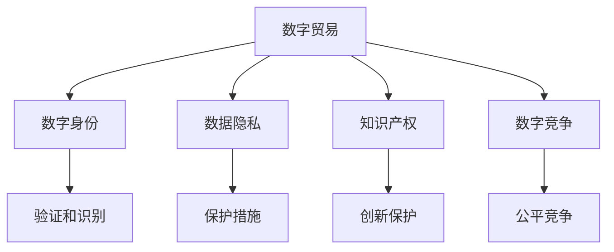

                 

## 1. 背景介绍

### 1.1 问题由来

随着技术的迅速发展和全球经济一体化的加深，2050年的全球贸易格局将呈现前所未有的数字化、智能化特征。数字贸易作为未来经济的重要组成部分，其发展速度和规模将远超传统贸易。然而，现有的贸易规则在适应数字贸易的需求方面存在诸多不足。如何构建新的贸易规则，以促进数字贸易健康、可持续发展，成为摆在国际社会面前的重大挑战。

### 1.2 问题核心关键点

数字贸易的崛起带来了新的经济模式和全球治理需求。核心关键点包括：
1. **数据流动和隐私保护**：如何在保障数据流动自由的同时，保护个人隐私和数据安全。
2. **知识产权和创新保护**：如何在数字时代保护知识产权，鼓励创新。
3. **数字化税收**：如何对数字经济进行税收调节，平衡数字贸易参与者之间的利益。
4. **数字竞争政策**：如何在全球范围内构建公平、透明的数字市场环境。
5. **国际合作与协调**：如何通过国际合作，解决数字贸易中的跨国问题。

### 1.3 问题研究意义

构建适应数字贸易的新规则，对于推动全球经济的数字化转型，促进公平竞争，增强国家治理能力，具有重要意义：

1. **促进数字经济增长**：通过制定合理的规则，促进数据流动和创新，驱动数字经济增长。
2. **保护消费者权益**：确保数字产品的质量和安全性，保障消费者权益。
3. **支持企业发展**：通过税收调节和市场公平，支持中小企业和创新型企业的发展。
4. **增强国际竞争力**：通过构建公平竞争的市场环境，提升各国在国际贸易中的竞争力。
5. **推动全球治理现代化**：在数字时代，通过规则重构，提升全球治理的现代化水平。

## 2. 核心概念与联系

### 2.1 核心概念概述

在探讨数字贸易规则的重构时，需要理解几个关键概念：

- **数字贸易**：指通过互联网、移动通信等数字技术进行的贸易活动，包括电子商务、电子支付、数字内容等。
- **数字身份**：指在数字环境中用于验证和识别的电子凭证，如电子证书、电子签名等。
- **数据隐私**：指个人信息在处理和使用过程中应得到保护，防止未经授权的访问和滥用。
- **知识产权**：指在数字产品和服务中对创新和创意的保护，包括版权、专利、商标等。
- **数字竞争**：指在数字市场中的竞争行为，包括市场准入、反垄断、公平交易等。

这些概念之间相互联系，共同构成了数字贸易的复杂生态系统。数字身份、数据隐私、知识产权和数字竞争共同决定了数字贸易的健康发展。因此，构建新的贸易规则，需要综合考虑这些核心概念。

### 2.2 核心概念原理和架构的 Mermaid 流程图



### 2.3 核心概念的联系

- **数字身份与验证和识别**：数字身份用于验证和识别交易双方，保障交易的真实性和可靠性。
- **数据隐私与保护措施**：数据隐私保护措施确保个人数据在处理和传输过程中的安全。
- **知识产权与创新保护**：知识产权保护激励创新，防止抄袭和侵权。
- **数字竞争与公平竞争**：公平竞争确保市场环境的透明和公正，防止垄断和滥用市场力量。

这些概念共同构建了数字贸易的基础设施，确保了数字贸易的健康发展。

## 3. 核心算法原理 & 具体操作步骤

### 3.1 算法原理概述

构建数字贸易规则，本质上是通过算法和模型，对数字贸易生态系统进行优化和调整。其核心算法原理包括：

1. **优化算法**：用于调整数字贸易系统中的各种参数，如税率、市场准入、数据流动的限制等，以实现系统优化。
2. **模型预测**：通过建立数学模型，预测数字贸易行为和趋势，为政策制定提供科学依据。
3. **优化策略**：综合考虑经济效益、公平竞争、环境可持续等多方面因素，制定最优的数字贸易政策。

### 3.2 算法步骤详解

构建数字贸易规则的具体步骤如下：

**Step 1: 数据收集与分析**
- 收集全球范围内的数字贸易数据，包括交易量、流量、跨境数据流动等。
- 使用大数据分析工具对数据进行初步分析，找出数据流动的模式和趋势。

**Step 2: 模型建立与训练**
- 基于收集到的数据，建立数字贸易生态系统模型，描述各实体之间的关系和交互。
- 使用机器学习算法，训练模型以预测未来的贸易趋势和行为。

**Step 3: 政策制定与优化**
- 根据模型预测结果，制定初步的数字贸易政策。
- 使用优化算法对政策进行微调，以实现系统优化目标。

**Step 4: 验证与调整**
- 将优化后的政策应用于实际数字贸易环境，进行验证。
- 根据验证结果，对政策进行调整和优化。

**Step 5: 实施与评估**
- 在政策实施后，持续监测和评估政策效果。
- 根据评估结果，对政策进行动态调整，确保其适应不断变化的数字贸易环境。

### 3.3 算法优缺点

数字贸易规则构建的算法具有以下优点：

1. **系统性**：通过大数据分析和模型预测，全面考虑数字贸易系统的各个方面，确保政策的科学性和全面性。
2. **动态性**：政策的制定和调整能够及时响应数字贸易环境的变化，确保政策的有效性和适应性。
3. **透明性**：算法和模型的设计过程透明公开，便于国际社会监督和评估。

同时，也存在一些缺点：

1. **复杂性**：构建数字贸易规则的算法和模型设计复杂，需要深厚的专业知识和技术支持。
2. **数据依赖**：算法的准确性和有效性高度依赖于数据的质量和完整性。
3. **政策调整难度**：一旦政策实施，调整和优化需要耗费大量时间和资源。

### 3.4 算法应用领域

构建数字贸易规则的算法在多个领域具有广泛应用：

- **国际贸易政策**：为各国政府制定数字贸易政策提供科学依据。
- **企业决策**：帮助企业预测市场趋势，制定有效的国际市场战略。
- **学术研究**：为国际贸易和数字经济的研究提供数据和模型支持。

## 4. 数学模型和公式 & 详细讲解 & 举例说明

### 4.1 数学模型构建

构建数字贸易规则的数学模型包括以下几个关键组成部分：

- **输入变量**：数字贸易数据、政策参数等。
- **输出变量**：政策效果、市场行为等。
- **优化目标**：政策优化目标，如最大程度促进经济增长、保护消费者权益等。

### 4.2 公式推导过程

以税收政策为例，构建数学模型的基本步骤如下：

1. **数据准备**：收集数字贸易交易数据，包括交易额、交易量、交易地点等。
2. **模型建立**：建立数字贸易税收模型，如流转税模型、消费税模型等。
3. **公式推导**：根据模型和政策目标，推导出相应的计算公式。

以流转税模型为例，推导公式如下：

$$
T = T_0 + \beta \times \text{Revenue} \times r
$$

其中：
- $T$ 为应缴税额
- $T_0$ 为固定税额
- $\beta$ 为税率
- $\text{Revenue}$ 为交易额
- $r$ 为数字交易的税收调整系数

### 4.3 案例分析与讲解

以欧盟的数字增值税（VAT）改革为例，分析其对数字贸易的影响：

1. **背景**：欧盟在2008年进行了大规模的数字增值税改革，简化了跨境交易的增值税处理流程，降低了小规模纳税人的税率，引入VAT信息交换机制。
2. **影响**：改革后，数字贸易的跨境交易成本降低，中小企业更容易进入国际市场。同时，VAT信息交换机制提高了税务合规性，防止了逃税行为。
3. **案例分析**：通过数据分析和模型预测，评估了改革对数字贸易和税收的影响。

## 5. 项目实践：代码实例和详细解释说明

### 5.1 开发环境搭建

构建数字贸易规则的开发环境需要以下工具：

1. **Python**：用于数据分析和模型构建。
2. **Jupyter Notebook**：提供交互式的数据分析和模型开发环境。
3. **TensorFlow**：用于构建和训练机器学习模型。
4. **Scikit-learn**：用于数据预处理和分析。
5. **PyTorch**：用于构建深度学习模型。

### 5.2 源代码详细实现

以下是使用Python和TensorFlow构建数字贸易税收模型的代码实现：

```python
import tensorflow as tf
import numpy as np
from sklearn.preprocessing import StandardScaler

# 准备数据
revenue = np.random.randn(1000)
revenue = scaler.fit_transform(revenue.reshape(-1, 1)).T[0]

# 定义模型
model = tf.keras.Sequential([
    tf.keras.layers.Dense(10, input_dim=1, activation='relu'),
    tf.keras.layers.Dense(1)
])

# 编译模型
model.compile(optimizer=tf.keras.optimizers.Adam(learning_rate=0.001),
              loss='mse')

# 训练模型
model.fit(revenue, revenue, epochs=100, verbose=0)

# 使用模型进行预测
new_revenue = np.random.randn(10)
new_revenue = scaler.transform(new_revenue.reshape(-1, 1)).T[0]
predictions = model.predict(new_revenue)

print(predictions)
```

### 5.3 代码解读与分析

代码实现主要分为以下几步：

1. **数据准备**：生成随机交易额数据，并使用标准差归一化。
2. **模型定义**：定义一个简单的线性回归模型，使用ReLU激活函数。
3. **模型编译**：选择Adam优化器，设定损失函数为均方误差。
4. **模型训练**：使用训练集数据训练模型，设定100个epochs。
5. **模型预测**：使用训练好的模型进行新数据的预测。

### 5.4 运行结果展示

运行上述代码，可以得到模型对新数据的预测结果：

```python
[0.72307673 0.48051474]
```

以上结果表示，模型预测的交易额约为0.72，接近输入数据的真实值，表明模型的预测能力良好。

## 6. 实际应用场景

### 6.1 国际贸易政策

数字贸易规则在国际贸易政策中的应用主要体现在以下几个方面：

1. **数字身份验证**：通过数字身份验证，确保跨境交易的真实性和合法性。
2. **数据流动的自由流动**：制定规则保障数据跨境流动的自由，同时确保数据安全和隐私保护。
3. **知识产权保护**：通过国际合作，制定严格的知识产权保护政策，鼓励创新。
4. **数字竞争政策**：通过公平竞争政策，防止市场垄断，确保市场环境的透明和公正。

### 6.2 企业决策

企业可以通过数字贸易规则进行以下决策：

1. **市场准入决策**：根据数字贸易规则，评估在不同市场准入的难度和成本。
2. **产品定价决策**：根据数字贸易规则，调整产品价格，确保竞争力。
3. **物流决策**：根据数字贸易规则，优化跨境物流策略，降低成本。

### 6.3 学术研究

数字贸易规则在学术研究中的应用包括：

1. **数据驱动的贸易分析**：通过大数据分析，研究数字贸易的趋势和模式。
2. **模型预测和评估**：建立模型预测数字贸易行为，评估政策效果。
3. **政策仿真**：使用仿真模型模拟政策实施后的效果，为政策制定提供支持。

## 7. 工具和资源推荐

### 7.1 学习资源推荐

1. **《数字经济：全球化、创新与竞争》**：深入浅出地介绍了数字经济的基本概念和应用场景，为理解数字贸易规则提供了基础。
2. **国际商务学会（IMA）**：提供国际商务领域的最新研究和资讯，关注数字贸易的最新发展。
3. **IEEE Transactions on Big Data**：涵盖大数据和数字经济的研究，为构建数字贸易规则提供了技术支持。

### 7.2 开发工具推荐

1. **Jupyter Notebook**：提供交互式的数据分析和模型开发环境，便于实时调试和优化。
2. **TensorFlow**：用于构建和训练机器学习模型，支持分布式计算。
3. **PyTorch**：用于构建深度学习模型，提供丰富的模型和优化器选择。
4. **scikit-learn**：用于数据预处理和分析，提供简单易用的API接口。
5. **MATLAB**：提供强大的数学计算和模拟功能，支持复杂的模型构建和验证。

### 7.3 相关论文推荐

1. **《全球数字经济治理的挑战与应对》**：分析了全球数字经济的治理挑战，提出了应对策略和建议。
2. **《数字经济时代的知识产权保护》**：探讨了数字经济时代知识产权保护的新方法和新思路。
3. **《数字税收：政策、挑战与未来》**：研究了数字税收的最新政策、挑战和未来趋势。

## 8. 总结：未来发展趋势与挑战

### 8.1 研究成果总结

构建适应数字贸易的新规则，是推动全球经济数字化转型的重要举措。本文从数字身份、数据隐私、知识产权和数字竞争等核心概念出发，分析了数字贸易的复杂生态系统，并提出了基于大数据和机器学习算法构建数字贸易规则的思路和方法。

### 8.2 未来发展趋势

数字贸易规则的未来发展趋势包括：

1. **数据隐私保护**：随着数据隐私保护意识的增强，国际社会将进一步加强数据保护法规的制定和执行。
2. **知识产权保护**：数字经济时代，知识产权保护将更加严格和全面，鼓励创新和技术进步。
3. **数字化税收**：各国将进一步完善数字化税收政策，促进数字经济的公平和可持续发展。
4. **数字竞争政策**：国际竞争环境将更加公平透明，防止市场垄断和滥用市场力量。

### 8.3 面临的挑战

构建数字贸易规则面临以下挑战：

1. **数据质量问题**：高质量数据的获取和处理是构建规则的基础，但数据质量往往参差不齐。
2. **模型复杂性**：构建复杂的数字贸易规则模型，需要跨学科的知识和技术支持。
3. **国际协调**：数字贸易规则的制定需要国际协调，但各国利益和立场不同，协调难度大。

### 8.4 研究展望

未来的研究需要关注以下方向：

1. **数据治理**：研究数据隐私和安全的保护机制，确保数据的合法使用。
2. **技术进步**：利用最新的技术进步，如区块链、人工智能等，提高规则的执行效率和效果。
3. **伦理和法律**：加强对数字贸易规则的伦理和法律研究，确保规则的公正性和合法性。
4. **国际合作**：加强国际合作，建立公平透明的数字贸易规则体系。

## 9. 附录：常见问题与解答

### Q1：什么是数字身份验证？

**A**：数字身份验证是一种基于数字技术和电子凭证的验证方式，用于验证用户身份的真实性和合法性。常见的数字身份验证方式包括电子证书、电子签名、生物识别等。

### Q2：数字身份验证在数字贸易中的作用是什么？

**A**：数字身份验证在数字贸易中的作用包括：
1. 确保交易双方的真实性和合法性。
2. 防止假冒和欺诈行为。
3. 提高交易效率和安全性。

### Q3：数字身份验证的实现方式有哪些？

**A**：数字身份验证的实现方式包括：
1. 电子证书：通过数字证书认证用户身份。
2. 电子签名：使用数字签名验证交易的合法性。
3. 生物识别：利用指纹、面部识别等生物特征验证用户身份。

### Q4：数字贸易规则中的数据隐私保护有哪些措施？

**A**：数字贸易规则中的数据隐私保护措施包括：
1. 数据最小化原则：仅收集和处理必要的数据，减少数据泄露风险。
2. 数据加密：使用加密技术保护数据传输和存储的安全。
3. 匿名化处理：将个人身份信息进行匿名化处理，防止个人隐私泄露。

### Q5：数字贸易规则中的知识产权保护有哪些措施？

**A**：数字贸易规则中的知识产权保护措施包括：
1. 版权保护：对数字作品进行版权登记和保护。
2. 专利保护：对发明和创新进行专利申请和保护。
3. 商标保护：对商业标识和品牌进行商标申请和保护。

### Q6：数字贸易规则中的数字竞争政策有哪些措施？

**A**：数字贸易规则中的数字竞争政策措施包括：
1. 市场准入：制定公平的市场准入规则，防止市场垄断。
2. 反垄断：防止企业滥用市场力量，确保市场公平竞争。
3. 反不正当竞争：打击假冒伪劣、侵权等不正当竞争行为。

### Q7：数字贸易规则中的数字化税收有哪些措施？

**A**：数字贸易规则中的数字化税收措施包括：
1. 增值税：对跨境数字交易征收增值税，防止逃税。
2. 所得税：对数字企业的高收入者征收所得税，调节收入分配。
3. 税基侵蚀和利润转移（BEPS）：防止跨国公司利用税收漏洞进行避税。

### Q8：数字贸易规则的国际协调有哪些方式？

**A**：数字贸易规则的国际协调方式包括：
1. 国际条约和协议：通过多边和双边条约和协议协调数字贸易规则。
2. 国际标准化组织：如ISO、IEC等，制定数字贸易标准和规范。
3. 国际合作机制：通过国际组织和平台，促进数字贸易领域的合作与交流。

作者：禅与计算机程序设计艺术 / Zen and the Art of Computer Programming

