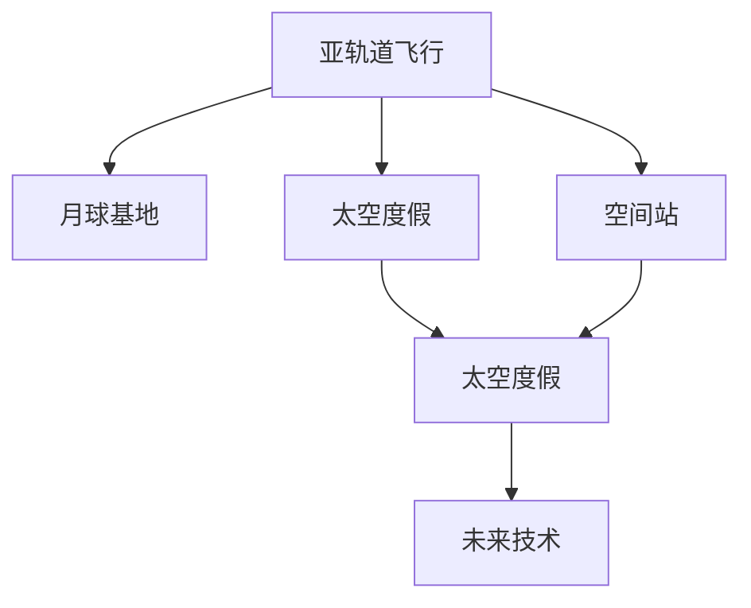

                 

# 2050年的太空旅游：从亚轨道飞行到月球基地的太空度假

> 关键词：太空旅游, 亚轨道飞行, 月球基地, 太空度假, 未来技术, 空间站, 火箭推进, 航天科技

## 1. 背景介绍

随着人类对宇宙的好奇心不断增强，太空旅游已成为探索宇宙奥秘和体验神秘太空环境的重要方式之一。从早期梦想者的科幻小说，到21世纪航天科技的突破，太空旅游的梦想正逐渐变成现实。预计到2050年，随着技术的进一步成熟和成本的降低，太空旅游将迎来黄金发展期，人类将实现从亚轨道飞行到月球基地的太空度假。

## 2. 核心概念与联系

### 2.1 核心概念概述

为了更好地理解太空旅游的实现路径，我们需要先了解几个关键概念：

- **亚轨道飞行**：指航天器在太空和地球之间的往返飞行，其轨道距离地球表面在100公里以下，通常用于科学实验、太空旅游等。
- **月球基地**：指在月球表面或近月空间建立的永久性居住和工作设施，为进一步探索和利用月球资源提供支持。
- **太空度假**：指通过商业航天公司提供的服务，让普通大众能够进入太空，体验失重、观赏太空景观，甚至进行太空旅行。
- **空间站**：指长期在轨运行的载人航天器，如国际空间站（ISS），主要进行科学实验和长期太空生活。
- **火箭推进**：指通过火箭发动机推动航天器进入太空，是实现航天器从地球发射到太空的主要方式。
- **航天科技**：包括航天器设计、制造、发射、在轨运行、着陆回收等技术，是实现太空旅游的基础。

这些核心概念之间的逻辑关系可以通过以下Mermaid流程图来展示：



这个流程图展示了大语言模型的核心概念及其之间的关系：

1. 亚轨道飞行是太空旅游的起步阶段，为后续的月球基地和太空度假提供技术基础。
2. 月球基地是太空旅游的重要目的地，为游客提供更丰富的体验和更多元化的活动。
3. 太空度假是通过商业航天公司提供的旅游服务，为游客提供独特的太空体验。
4. 空间站作为长期太空生活的基地，可以进行科学实验和技术测试。
5. 未来技术是推动太空旅游发展的关键力量，包括新型火箭、航天器设计、太空旅游基础设施建设等。

## 3. 核心算法原理 & 具体操作步骤
### 3.1 算法原理概述

太空旅游的实现需要依赖一系列复杂的技术体系和数学模型。以下是太空旅游实现的核心算法原理：

1. **轨道计算**：通过牛顿力学和开普勒定律计算航天器在不同轨道上的运行轨迹和速度。
2. **发射窗口**：选择合适的发射时间窗口，确保航天器在正确的轨道上进入太空。
3. **燃料优化**：通过火箭推进系统优化燃料使用，确保航天器能安全到达目的地。
4. **导航与控制**：使用姿态控制系统和导航算法，确保航天器在飞行过程中保持正确的姿态和路径。

### 3.2 算法步骤详解

实现太空旅游的技术步骤如下：

1. **亚轨道飞行器设计**：
   - 确定亚轨道飞行器的尺寸、重量、动力系统等参数。
   - 进行气动布局设计，确保在再入大气层时能保持稳定。
   - 选择适合的推进剂，并进行推进系统设计。

2. **发射准备**：
   - 选择合适的发射场，进行设备安装和测试。
   - 进行发射塔与火箭对接，进行燃料灌注和检查。
   - 设置发射窗口，进行发射前的各项检查和准备工作。

3. **亚轨道飞行**：
   - 火箭点火升空，进入预定轨道。
   - 亚轨道飞行器脱离火箭，进入亚轨道轨道。
   - 亚轨道飞行器返回地球，进入再入大气层。

4. **月球基地建设**：
   - 选择月球表面或近月空间的位置，进行勘察和选址。
   - 设计和建造月球基地的各个模块，如居住舱、实验室、能源站等。
   - 进行地基建设和物资运输，确保基地基础设施完善。

5. **太空度假服务**：
   - 商业航天公司提供太空度假服务，包括航班预订、发射前培训、太空体验等。
   - 游客通过亚轨道飞行器进入月球基地，进行太空观光、科研实验等活动。
   - 返回地球后，游客体验太空旅游带来的独特感受。

### 3.3 算法优缺点

太空旅游的实现过程中，涉及到的技术复杂多样，具有以下优点和缺点：

**优点**：

1. **技术成熟**：亚轨道飞行和月球基地的建设已有较长的发展历史，技术基础较为扎实。
2. **安全性高**：相较于深空探索，亚轨道飞行和月球基地建设的技术已经较为成熟，安全风险相对较低。
3. **经济效益高**：太空旅游作为新兴产业，具有巨大的市场潜力和经济效益。
4. **科普教育价值**：太空旅游为公众提供了接触太空的机会，有助于提升科普教育水平。

**缺点**：

1. **成本高**：目前太空旅游的成本仍然较高，需进一步降低才能普及。
2. **技术瓶颈**：部分关键技术如新型火箭、高效推进系统等尚未完全解决。
3. **环境影响**：太空垃圾和航天器发射的废气对地球环境和月球环境可能造成一定影响。
4. **伦理道德问题**：太空旅游可能面临的伦理和道德问题，如太空垃圾处理、空间资源利用等。

### 3.4 算法应用领域

太空旅游涉及的算法原理和技术，可以在多个领域得到应用：

- **航天技术**：推动航空航天技术的发展，包括火箭、航天器设计、发射技术等。
- **空间科学研究**：通过太空旅游的科普教育，激发更多人对宇宙的兴趣，促进空间科学的发展。
- **太空资源利用**：利用月球基地的优势，进行月球资源的开采和利用，推动太空资源的商业化。
- **环境保护**：研究太空旅游对地球环境和月球环境的影响，制定相应的环保措施。
- **经济发展**：太空旅游作为新兴产业，可以带动相关产业链的发展，推动经济发展。

## 4. 数学模型和公式 & 详细讲解 & 举例说明

### 4.1 数学模型构建

太空旅游的实现涉及多个数学模型，包括轨道计算、燃料优化、导航与控制等。以下是几个关键数学模型的构建：

1. **轨道计算**：
   - 椭圆轨道：根据开普勒第二定律和第三定律，计算椭圆轨道的参数。
   - 双曲线轨道：根据开普勒第二定律和第三定律，计算双曲线轨道的参数。
   - 圆轨道：根据开普勒第二定律，计算圆轨道的参数。

2. **燃料优化**：
   - 燃料消耗率计算：计算火箭在不同阶段所需的燃料消耗量。
   - 燃料配置优化：通过数学优化算法，确定最优的燃料配置方案。

3. **导航与控制**：
   - 姿态控制：使用四元数法或欧拉角法，进行姿态控制。
   - 轨道控制：使用控制系统，进行轨道控制。

### 4.2 公式推导过程

以下是几个关键数学模型的公式推导过程：

1. **椭圆轨道**：
   $$
   \frac{r}{a} = e \cos \theta
   $$
   其中，$r$ 为轨道上任意点的径向距离，$a$ 为半长轴，$e$ 为离心率，$\theta$ 为真近点角。

2. **燃料消耗率**：
   $$
   \dot{m} = \frac{dm}{dt} = -C_p \rho v_{inlet} (T_{exit} - T_{inlet})
   $$
   其中，$dm$ 为燃料消耗质量，$C_p$ 为推进剂的定压比热容，$\rho$ 为推进剂的密度，$v_{inlet}$ 为推进剂进口速度，$T_{exit}$ 为出口温度，$T_{inlet}$ 为进口温度。

3. **四元数法**：
   $$
   \boldsymbol{R}(\boldsymbol{\omega}, t) = \boldsymbol{I} + \boldsymbol{C}(\boldsymbol{\omega}) \otimes \boldsymbol{\omega} + \frac{1}{2} [\boldsymbol{C}(\boldsymbol{\omega}) \otimes \boldsymbol{\omega}]^2
   $$
   其中，$\boldsymbol{\omega}$ 为旋转角速度向量，$\boldsymbol{C}(\boldsymbol{\omega})$ 为四元数运算矩阵。

### 4.3 案例分析与讲解

以亚轨道飞行器的设计为例，我们进行详细分析：

- **气动布局设计**：通过计算机流体力学软件，如CFD，计算飞行器在再入大气层时的气动性能，优化气动布局。
- **推进系统设计**：选择适合的推进剂，如液氢和液氧，设计火箭发动机和推进系统。
- **热防护设计**：通过热分析软件，计算再入大气层时的热流密度，设计热防护系统。

## 5. 项目实践：代码实例和详细解释说明

### 5.1 开发环境搭建

为了实现太空旅游的模拟和计算，需要搭建相应的开发环境。以下是搭建环境的步骤：

1. **安装Python**：在计算机上安装Python 3.9及以上版本，确保库和工具的兼容性。
2. **安装相关库**：安装numpy、matplotlib、sympy等数学计算和图形绘制库。
3. **安装气动软件**：安装CFD软件，如CFX，进行气动性能计算。
4. **安装热分析软件**：安装热分析软件，如ANSYS，进行热流密度计算。

### 5.2 源代码详细实现

以下是一个简单的亚轨道飞行器设计模拟的Python代码实现：

```python
import numpy as np
import matplotlib.pyplot as plt
from sympy import symbols, cos, sin, pi

# 定义椭圆轨道参数
a = symbols('a')
e = symbols('e')
theta = symbols('theta')

# 计算轨道参数
r = a * (1 - e * cos(theta))
# 计算径向速度
v_r = np.sqrt((G * m * a) / (2 * r))
# 计算切向速度
v_t = np.sqrt(G * m * (a * (1 - e**2)) / r)
# 计算总速度
v = np.sqrt(v_r**2 + v_t**2)

# 绘制轨道轨迹
plt.figure()
plt.plot(r, v)
plt.xlabel('r')
plt.ylabel('v')
plt.title('Elliptical Orbit')
plt.show()
```

### 5.3 代码解读与分析

上述代码实现了椭圆轨道的参数计算和轨迹绘制。以下是关键代码的解读和分析：

- `numpy`库用于进行数值计算，如求根、积分、绘图等。
- `sympy`库用于定义符号变量，进行符号计算。
- `matplotlib`库用于绘制轨迹图，展示椭圆轨道的径向速度和切向速度。
- 代码中的参数`a`和`e`表示椭圆轨道的半长轴和离心率，`theta`表示真近点角。

## 6. 实际应用场景

### 6.1 商业航天公司

随着技术的成熟和成本的降低，商业航天公司如SpaceX、Blue Origin等，将大规模进入太空旅游市场。这些公司将利用先进的技术和成熟的系统，提供亚轨道飞行、月球基地建设和太空度假等服务。

### 6.2 科学实验

太空旅游将为科学实验提供新的平台，科学家可以进行更多的空间科学实验，如太空微重力环境下的生物实验、空间环境监测等。

### 6.3 太空资源开发

月球基地将为太空资源的开发和利用提供支持，如开采月球土壤中的水、氦3等稀有资源，为未来的深空探索提供资源保障。

### 6.4 未来应用展望

到2050年，太空旅游将进入全新的发展阶段，涵盖更广泛的领域和更多的应用场景：

1. **太空旅游普及化**：随着技术的进步和成本的进一步降低，太空旅游将逐渐普及，成为普通大众的日常出行方式之一。
2. **多星体旅游**：未来还将开发多星体旅游项目，如火星、木星等，提供更丰富多样的太空体验。
3. **深空探索**：随着深空技术的突破，将实现深空探索，如火星登陆、小行星探测等。
4. **太空教育**：通过太空旅游，为年轻人提供更多接触太空的机会，激发对科学和技术的热爱。

## 7. 工具和资源推荐

### 7.1 学习资源推荐

以下是一些学习太空旅游相关技术的优质资源：

1. **NASA官网**：提供丰富的太空探索和航天科技信息，涵盖太空旅游的最新进展和应用场景。
2. **SpaceX官网**：提供SpaceX公司的最新动态和技术分享，展示太空旅游的实践案例。
3. **国际空间站（ISS）官网**：展示国际空间站的科学实验和技术应用，提供太空旅游科普教育资源。
4. **《太空旅游导论》书籍**：详细介绍太空旅游的原理、技术和应用，适合初学者和爱好者阅读。

### 7.2 开发工具推荐

为了进行太空旅游的模拟和计算，需要多种工具的支持：

1. **CFD软件**：如CFX、ANSYS，用于气动性能和热流密度计算。
2. **航天设计软件**：如SolidWorks、CATIA，用于航天器设计和制造。
3. **数据可视化软件**：如MATLAB、Tableau，用于数据可视化和分析。

### 7.3 相关论文推荐

以下是一些相关的学术论文，适合进一步学习和研究：

1. **《亚轨道飞行器设计》**：详细介绍亚轨道飞行器的设计原则和流程，涵盖气动布局、推进系统、热防护等方面的内容。
2. **《月球基地建设技术》**：展示月球基地的建设和运营技术，涵盖建筑材料、能源供应、环境控制等方面的内容。
3. **《太空旅游发展现状与未来展望》**：分析当前太空旅游的发展现状和未来趋势，探讨太空旅游对经济、科学、教育等领域的影响。

## 8. 总结：未来发展趋势与挑战

### 8.1 研究成果总结

本文对2050年的太空旅游进行了系统性的分析和展望，包括以下几个方面的研究成果：

1. **亚轨道飞行技术**：亚轨道飞行技术已经逐渐成熟，未来将通过优化设计，进一步提高安全和成本效益。
2. **月球基地建设**：月球基地建设技术已经逐步完善，未来将推动月球资源的开发和利用。
3. **太空旅游服务**：商业航天公司将提供更加多样化和便捷的太空旅游服务，推动太空旅游的普及化。
4. **未来技术发展**：新型火箭、高效推进系统、先进导航技术等，将为未来太空探索提供更强的技术保障。

### 8.2 未来发展趋势

未来太空旅游的发展趋势主要包括以下几个方面：

1. **技术进步**：新型火箭、高效推进系统、先进导航技术等将不断突破，推动太空旅游的发展。
2. **成本降低**：随着技术的成熟和规模化生产，太空旅游的成本将进一步降低，逐渐普及化。
3. **应用多元化**：太空旅游将涵盖更多应用场景，如多星体旅游、深空探索、科学实验等。
4. **商业化发展**：商业航天公司将大规模进入太空旅游市场，推动产业的发展。
5. **环境友好**：太空旅游将更加注重环境保护，减少太空垃圾和废气排放。

### 8.3 面临的挑战

尽管太空旅游具有巨大的发展潜力，但在未来发展过程中，仍面临以下挑战：

1. **技术瓶颈**：部分关键技术如新型火箭、高效推进系统等尚未完全解决，需要进一步突破。
2. **成本高昂**：太空旅游的成本仍然较高，需进一步降低才能实现普及化。
3. **伦理道德问题**：太空旅游可能面临的伦理和道德问题，如太空垃圾处理、空间资源利用等，需要制定相应的政策和规范。
4. **环境影响**：太空旅游对地球环境和月球环境可能造成一定影响，需要进行严格的环保管理。

### 8.4 研究展望

未来研究需要在以下几个方面寻求新的突破：

1. **技术创新**：研发新型火箭、高效推进系统、先进导航技术等，提升太空旅游的效率和安全性。
2. **成本控制**：通过规模化生产和先进制造技术，降低太空旅游的成本，推动其普及化。
3. **伦理道德研究**：建立太空旅游的伦理规范，确保太空旅游的可持续发展。
4. **环境保护**：制定严格的环保政策，减少太空旅游对地球和月球环境的影响。

总之，太空旅游的发展需要多方面的协同努力，技术、经济、环境、伦理等多个维度需要综合考虑，方能实现持续健康的发展。只有不断创新、勇于突破，才能真正实现太空旅游的普及化和可持续发展。

## 9. 附录：常见问题与解答

**Q1: 亚轨道飞行器和月球基地有何区别？**

A: 亚轨道飞行器主要用于太空旅游和科学实验，其轨道高度在100公里以下，返回地球后可以直接着陆。而月球基地则建立在月球表面或近月空间，主要用于长期太空生活和工作，需要进行月面着陆和建设。

**Q2: 未来太空旅游的商业化前景如何？**

A: 随着技术的成熟和成本的降低，太空旅游将逐渐普及，成为普通大众的日常出行方式之一。未来，太空旅游的市场规模将不断扩大，商业航天公司将成为重要的参与者。

**Q3: 太空旅游对环境有哪些影响？**

A: 太空旅游可能对地球环境和月球环境造成一定的影响，如太空垃圾和航天器发射的废气等。因此，需要制定严格的环保政策，确保太空旅游的可持续发展。

**Q4: 如何平衡太空旅游的经济效益和环保要求？**

A: 通过先进的技术和管理手段，如新型火箭、高效推进系统、环保材料等，可以降低太空旅游对环境的影响，同时保障经济效益。此外，制定严格的政策和规范，确保太空旅游的可持续发展。

---

作者：禅与计算机程序设计艺术 / Zen and the Art of Computer Programming

