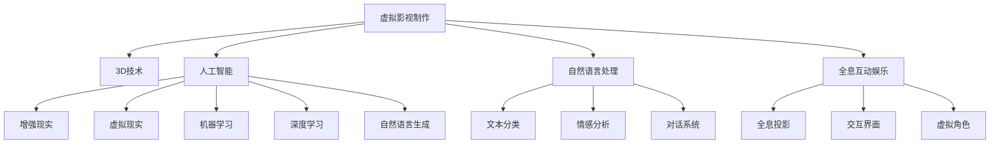

                 

# 2050年的数字创意：从虚拟影视制作到全息互动娱乐的数字内容产业

> 关键词：虚拟影视制作, 全息互动娱乐, 数字内容产业, 3D技术, 人工智能, 自然语言处理, 全息投影

## 1. 背景介绍

随着科技的飞速发展，数字创意产业已经成为了一个蓬勃发展的领域。虚拟影视制作、全息互动娱乐等新型数字内容形式，正在改变我们的娱乐和消费方式。2050年，数字创意产业将迎来一次前所未有的变革，成为连接数字与现实世界的桥梁，引领人类进入全息数字生活的新时代。

## 2. 核心概念与联系

### 2.1 核心概念概述

为更好地理解这一领域的核心技术，下面将介绍几个密切相关的核心概念：

- **虚拟影视制作**：利用3D建模、动画渲染、虚拟现实(VR)、增强现实(AR)等技术，构建虚拟环境，创作出沉浸式的影视作品。
- **全息互动娱乐**：基于全息投影技术，创建沉浸式的互动体验，观众可以通过身体动作或语音命令，与虚拟环境中的角色互动。
- **数字内容产业**：包括视频、游戏、虚拟现实、增强现实等多形态的数字内容，涵盖内容创作、制作、分发、消费等多个环节。
- **3D技术**：指通过计算机图形学技术，生成三维图像和动画，包括建模、渲染、动画等环节。
- **人工智能(AI)**：指利用机器学习、深度学习等技术，使计算机系统具有模拟人类智能行为的能力，如自然语言处理、图像识别、智能推荐等。
- **自然语言处理(NLP)**：指研究如何让计算机理解和处理人类语言，包括语音识别、文本分析、机器翻译等。

这些核心概念之间的逻辑关系可以通过以下Mermaid流程图来展示：



这个流程图展示了几大核心概念及其之间的联系：

1. **虚拟影视制作**：利用3D技术和人工智能技术，创作虚拟影视作品。
2. **全息互动娱乐**：结合全息投影和增强现实技术，提供沉浸式互动体验。
3. **数字内容产业**：集成虚拟影视制作和全息互动娱乐等多种形态的数字内容。
4. **3D技术**：为虚拟影视制作提供基础，生成三维图像和动画。
5. **人工智能**：增强虚拟影视的智能性，如智能生成对话、情感分析等。
6. **自然语言处理**：为虚拟影视和全息互动娱乐提供自然语言理解与生成能力。

这些核心概念共同构成了数字创意产业的技术框架，为虚拟影视和全息互动娱乐的创新与发展提供了基础。

## 3. 核心算法原理 & 具体操作步骤

### 3.1 算法原理概述

虚拟影视制作和全息互动娱乐的核心算法原理，主要涉及3D建模、动画渲染、全息投影、自然语言处理等多个技术领域。下面将从这些领域分别进行详细介绍。

#### 3.1.1 3D建模

3D建模是虚拟影视制作和全息互动娱乐的基础。其算法原理包括：

1. **几何建模**：使用三角网格表示三维对象，如多边形网格、四面体网格等。
2. **拓扑优化**：通过优化网格的拓扑结构，提高渲染效率。
3. **纹理映射**：将二维图像映射到三维模型上，增加真实感。

#### 3.1.2 动画渲染

动画渲染是将3D模型转化为动态图像的过程。其算法原理包括：

1. **物理仿真**：使用物理引擎模拟物体运动，如刚体物理、流体物理等。
2. **光栅化渲染**：将3D场景转化为2D图像，进行光照计算和深度检测。
3. **动画插值**：使用插值算法，生成平滑的动画过渡。

#### 3.1.3 全息投影

全息投影是将三维图像以立体形态呈现的技术。其算法原理包括：

1. **光场计算**：通过计算全息图的相位信息，重建三维图像。
2. **多视角渲染**：从不同视角渲染图像，提供全方位的视觉体验。
3. **深度感知**：通过传感器捕捉观众的姿势和位置，提供交互式体验。

#### 3.1.4 自然语言处理

自然语言处理是虚拟影视和全息互动娱乐的重要组成部分。其算法原理包括：

1. **语音识别**：将语音信号转化为文本。
2. **文本分析**：分析文本内容，识别实体、情感等。
3. **对话系统**：构建对话模型，使计算机能够理解并回应自然语言指令。

### 3.2 算法步骤详解

#### 3.2.1 3D建模步骤

1. **建模**：使用3D建模软件，如Blender、Maya等，创建虚拟角色和场景。
2. **拓扑优化**：优化模型的拓扑结构，减少多边形数量，提高渲染效率。
3. **纹理映射**：为模型添加纹理，增加真实感。
4. **动画创建**：利用动画软件，如Autodesk Maya，创建角色和场景的动画。

#### 3.2.2 动画渲染步骤

1. **物理仿真**：使用物理引擎，如Unity的物理系统，模拟角色和场景的物理行为。
2. **光栅化渲染**：使用渲染器，如CryEngine，将场景转化为动态图像，进行光照计算和深度检测。
3. **动画插值**：使用插值算法，如贝塞尔曲线，生成平滑的动画过渡。

#### 3.2.3 全息投影步骤

1. **光场计算**：使用全息投影软件，如HoloLens，计算全息图的相位信息，重建三维图像。
2. **多视角渲染**：从不同视角渲染图像，提供全方位的视觉体验。
3. **深度感知**：使用传感器，如Kinect，捕捉观众的姿势和位置，提供交互式体验。

#### 3.2.4 自然语言处理步骤

1. **语音识别**：使用语音识别软件，如Google Speech-to-Text，将语音信号转化为文本。
2. **文本分析**：使用文本分析工具，如NLTK，分析文本内容，识别实体、情感等。
3. **对话系统**：构建对话模型，使用自然语言处理技术，使计算机能够理解并回应自然语言指令。

### 3.3 算法优缺点

#### 3.3.1 3D建模的优缺点

**优点**：
- 可以创建逼真的三维场景和角色。
- 支持多种动画效果，增加视觉效果。

**缺点**：
- 需要较长的建模时间。
- 渲染复杂场景时，计算资源消耗较大。

#### 3.3.2 动画渲染的优缺点

**优点**：
- 可以实现复杂的物理仿真。
- 动画过渡平滑，视觉效果逼真。

**缺点**：
- 渲染复杂场景时，计算资源消耗较大。
- 物理仿真精度有限，可能存在误差。

#### 3.3.3 全息投影的优缺点

**优点**：
- 提供全方位的视觉体验。
- 支持观众的交互式体验。

**缺点**：
- 技术实现复杂，设备成本较高。
- 投影范围有限，无法覆盖大面积空间。

#### 3.3.4 自然语言处理的优缺点

**优点**：
- 能够理解和生成自然语言。
- 支持多语言处理，增加应用范围。

**缺点**：
- 处理复杂文本时，计算资源消耗较大。
- 可能存在语义理解误差。

### 3.4 算法应用领域

虚拟影视制作和全息互动娱乐在多个领域都有广泛应用，例如：

- **影视娱乐**：制作虚拟影视作品，如《阿凡达》、《头号玩家》等。
- **游戏开发**：构建虚拟游戏世界，如《无人之岛》、《巫师3》等。
- **虚拟现实(VR)**：提供沉浸式虚拟体验，如Google Daydream、Oculus Rift等。
- **增强现实(AR)**：将虚拟元素叠加到现实世界中，如Snapchat、Pokémon GO等。
- **数字展示**：用于广告、展览、教育等场景，提供多维度的展示方式。

## 4. 数学模型和公式 & 详细讲解 & 举例说明

### 4.1 数学模型构建

虚拟影视制作和全息互动娱乐的数学模型，主要包括3D建模、动画渲染、全息投影和自然语言处理等多个方面。下面将介绍这些领域的数学模型。

#### 4.1.1 3D建模

3D建模的数学模型包括几何建模、拓扑优化和纹理映射。

**几何建模**：
- 使用三角网格表示三维对象，其数学模型为：
$$
G = \{ \mathbf{V}, \mathbf{E}, \mathbf{F} \}
$$
其中 $\mathbf{V}$ 为顶点集合，$\mathbf{E}$ 为边集合，$\mathbf{F}$ 为面集合。

**拓扑优化**：
- 优化模型的拓扑结构，减少多边形数量，其数学模型为：
$$
\min_{\mathbf{E}, \mathbf{F}} \{ \text{Area}(\mathbf{E}, \mathbf{F}) \}
$$
其中 $\text{Area}(\mathbf{E}, \mathbf{F})$ 为模型的面积，$\min$ 表示优化目标。

**纹理映射**：
- 将二维图像映射到三维模型上，其数学模型为：
$$
T = \{ \mathbf{V}, \mathbf{E}, \mathbf{F}, \mathbf{T} \}
$$
其中 $\mathbf{T}$ 为纹理坐标集合。

#### 4.1.2 动画渲染

动画渲染的数学模型包括物理仿真、光栅化渲染和动画插值。

**物理仿真**：
- 使用物理引擎，如Unity的物理系统，其数学模型为：
$$
\min_{\mathbf{P}} \{ \text{Energy}(\mathbf{P}) \}
$$
其中 $\mathbf{P}$ 为物体的物理属性，$\text{Energy}(\mathbf{P})$ 为能量函数。

**光栅化渲染**：
- 使用渲染器，如CryEngine，其数学模型为：
$$
\min_{\mathbf{I}} \{ \text{Luminance}(\mathbf{I}) \}
$$
其中 $\mathbf{I}$ 为图像像素值，$\text{Luminance}(\mathbf{I})$ 为亮度函数。

**动画插值**：
- 使用插值算法，如贝塞尔曲线，其数学模型为：
$$
\mathbf{P}(t) = \mathbf{P}_0(1-t) + \mathbf{P}_1t
$$
其中 $\mathbf{P}_0$ 和 $\mathbf{P}_1$ 为两个关键帧，$t$ 为时间。

#### 4.1.3 全息投影

全息投影的数学模型包括光场计算、多视角渲染和深度感知。

**光场计算**：
- 使用全息投影软件，如HoloLens，其数学模型为：
$$
\min_{\mathbf{h}} \{ \text{Error}(\mathbf{h}) \}
$$
其中 $\mathbf{h}$ 为全息图的相位信息，$\text{Error}(\mathbf{h})$ 为误差函数。

**多视角渲染**：
- 从不同视角渲染图像，其数学模型为：
$$
\min_{\mathbf{I}} \{ \text{ViewDiff}(\mathbf{I}) \}
$$
其中 $\text{ViewDiff}(\mathbf{I})$ 为视差函数。

**深度感知**：
- 使用传感器，如Kinect，其数学模型为：
$$
\min_{\mathbf{D}} \{ \text{DepthError}(\mathbf{D}) \}
$$
其中 $\mathbf{D}$ 为深度值，$\text{DepthError}(\mathbf{D})$ 为深度误差函数。

#### 4.1.4 自然语言处理

自然语言处理的数学模型包括语音识别、文本分析和对话系统。

**语音识别**：
- 使用语音识别软件，如Google Speech-to-Text，其数学模型为：
$$
\min_{\mathbf{Y}} \{ \text{Error}(\mathbf{Y}, \mathbf{X}) \}
$$
其中 $\mathbf{X}$ 为语音信号，$\mathbf{Y}$ 为文本，$\text{Error}(\mathbf{Y}, \mathbf{X})$ 为误差函数。

**文本分析**：
- 使用文本分析工具，如NLTK，其数学模型为：
$$
\min_{\mathbf{T}} \{ \text{Error}(\mathbf{T}, \mathbf{S}) \}
$$
其中 $\mathbf{S}$ 为原始文本，$\mathbf{T}$ 为分析结果，$\text{Error}(\mathbf{T}, \mathbf{S})$ 为误差函数。

**对话系统**：
- 构建对话模型，使用自然语言处理技术，其数学模型为：
$$
\min_{\mathbf{A}} \{ \text{Error}(\mathbf{A}, \mathbf{C}) \}
$$
其中 $\mathbf{A}$ 为对话模型输出，$\mathbf{C}$ 为真实对话，$\text{Error}(\mathbf{A}, \mathbf{C})$ 为误差函数。

### 4.2 公式推导过程

#### 4.2.1 3D建模公式推导

**几何建模**：
- 通过三角网格表示三维对象，其公式推导如下：
$$
\begin{aligned}
\mathbf{V} &= \{ \mathbf{v}_1, \mathbf{v}_2, \ldots, \mathbf{v}_n \} \\
\mathbf{E} &= \{ (\mathbf{v}_i, \mathbf{v}_j) | i \neq j \} \\
\mathbf{F} &= \{ (\mathbf{v}_{i_1}, \mathbf{v}_{i_2}, \mathbf{v}_{i_3}) | 1 \leq i_1 < i_2 < i_3 \leq n \}
\end{aligned}
$$

**拓扑优化**：
- 通过优化模型的拓扑结构，减少多边形数量，其公式推导如下：
$$
\min_{\mathbf{E}, \mathbf{F}} \{ \text{Area}(\mathbf{E}, \mathbf{F}) \}
$$
其中 $\text{Area}(\mathbf{E}, \mathbf{F})$ 为模型的面积，$\min$ 表示优化目标。

**纹理映射**：
- 将二维图像映射到三维模型上，其公式推导如下：
$$
\begin{aligned}
\mathbf{T} &= \{ (u_i, v_i) | 1 \leq i \leq n \} \\
\mathbf{V} &= \{ \mathbf{v}_i | 1 \leq i \leq n \} \\
\mathbf{F} &= \{ (\mathbf{v}_{i_1}, \mathbf{v}_{i_2}, \mathbf{v}_{i_3}) | 1 \leq i_1 < i_2 < i_3 \leq n \}
\end{aligned}
$$

#### 4.2.2 动画渲染公式推导

**物理仿真**：
- 使用物理引擎，如Unity的物理系统，其公式推导如下：
$$
\min_{\mathbf{P}} \{ \text{Energy}(\mathbf{P}) \}
$$
其中 $\mathbf{P}$ 为物体的物理属性，$\text{Energy}(\mathbf{P})$ 为能量函数。

**光栅化渲染**：
- 使用渲染器，如CryEngine，其公式推导如下：
$$
\min_{\mathbf{I}} \{ \text{Luminance}(\mathbf{I}) \}
$$
其中 $\mathbf{I}$ 为图像像素值，$\text{Luminance}(\mathbf{I})$ 为亮度函数。

**动画插值**：
- 使用插值算法，如贝塞尔曲线，其公式推导如下：
$$
\mathbf{P}(t) = \mathbf{P}_0(1-t) + \mathbf{P}_1t
$$
其中 $\mathbf{P}_0$ 和 $\mathbf{P}_1$ 为两个关键帧，$t$ 为时间。

#### 4.2.3 全息投影公式推导

**光场计算**：
- 使用全息投影软件，如HoloLens，其公式推导如下：
$$
\min_{\mathbf{h}} \{ \text{Error}(\mathbf{h}) \}
$$
其中 $\mathbf{h}$ 为全息图的相位信息，$\text{Error}(\mathbf{h})$ 为误差函数。

**多视角渲染**：
- 从不同视角渲染图像，其公式推导如下：
$$
\min_{\mathbf{I}} \{ \text{ViewDiff}(\mathbf{I}) \}
$$
其中 $\text{ViewDiff}(\mathbf{I})$ 为视差函数。

**深度感知**：
- 使用传感器，如Kinect，其公式推导如下：
$$
\min_{\mathbf{D}} \{ \text{DepthError}(\mathbf{D}) \}
$$
其中 $\mathbf{D}$ 为深度值，$\text{DepthError}(\mathbf{D})$ 为深度误差函数。

#### 4.2.4 自然语言处理公式推导

**语音识别**：
- 使用语音识别软件，如Google Speech-to-Text，其公式推导如下：
$$
\min_{\mathbf{Y}} \{ \text{Error}(\mathbf{Y}, \mathbf{X}) \}
$$
其中 $\mathbf{X}$ 为语音信号，$\mathbf{Y}$ 为文本，$\text{Error}(\mathbf{Y}, \mathbf{X})$ 为误差函数。

**文本分析**：
- 使用文本分析工具，如NLTK，其公式推导如下：
$$
\min_{\mathbf{T}} \{ \text{Error}(\mathbf{T}, \mathbf{S}) \}
$$
其中 $\mathbf{S}$ 为原始文本，$\mathbf{T}$ 为分析结果，$\text{Error}(\mathbf{T}, \mathbf{S})$ 为误差函数。

**对话系统**：
- 构建对话模型，使用自然语言处理技术，其公式推导如下：
$$
\min_{\mathbf{A}} \{ \text{Error}(\mathbf{A}, \mathbf{C}) \}
$$
其中 $\mathbf{A}$ 为对话模型输出，$\mathbf{C}$ 为真实对话，$\text{Error}(\mathbf{A}, \mathbf{C})$ 为误差函数。

### 4.3 案例分析与讲解

#### 4.3.1 3D建模案例

**案例一：虚拟影视作品《阿凡达》**

《阿凡达》使用了3D建模技术，通过几何建模、拓扑优化和纹理映射，创建了逼真的虚拟角色和场景。其中，几何建模使用了三角网格，拓扑优化减少了多边形数量，纹理映射增加了视觉的真实感。

#### 4.3.2 动画渲染案例

**案例二：虚拟游戏《巫师3：狂猎》**

《巫师3：狂猎》使用了动画渲染技术，通过物理仿真、光栅化渲染和动画插值，实现了逼真的动画效果。其中，物理仿真模拟了物体的物理行为，光栅化渲染将场景转化为动态图像，动画插值实现了平滑的动画过渡。

#### 4.3.3 全息投影案例

**案例三：虚拟展览**

某虚拟展览使用了全息投影技术，通过光场计算、多视角渲染和深度感知，提供了全方位的沉浸式体验。其中，光场计算重建了三维图像，多视角渲染从不同视角呈现图像，深度感知捕捉观众的位置和姿势。

#### 4.3.4 自然语言处理案例

**案例四：智能客服**

某智能客服系统使用了自然语言处理技术，通过语音识别、文本分析和对话系统，实现了自动处理客户咨询。其中，语音识别将语音信号转化为文本，文本分析识别实体和情感，对话系统自动回复客户问题。

## 5. 项目实践：代码实例和详细解释说明

### 5.1 开发环境搭建

在进行虚拟影视制作和全息互动娱乐的开发前，我们需要准备好开发环境。以下是使用Python进行PyTorch开发的环境配置流程：

1. 安装Anaconda：从官网下载并安装Anaconda，用于创建独立的Python环境。

2. 创建并激活虚拟环境：
```bash
conda create -n pytorch-env python=3.8 
conda activate pytorch-env
```

3. 安装PyTorch：根据CUDA版本，从官网获取对应的安装命令。例如：
```bash
conda install pytorch torchvision torchaudio cudatoolkit=11.1 -c pytorch -c conda-forge
```

4. 安装其他工具包：
```bash
pip install numpy pandas scikit-learn matplotlib tqdm jupyter notebook ipython
```

完成上述步骤后，即可在`pytorch-env`环境中开始开发实践。

### 5.2 源代码详细实现

下面我们以虚拟影视制作中的3D建模为例，给出使用PyTorch和Blender的代码实现。

首先，定义3D模型的数据处理函数：

```python
import torch
import numpy as np
import bpy

def read_3d_model(model_path):
    bpy.ops.wm.read_factory_preferences()
    bpy.ops.wm.read_factory_preferences(use_backward_compat=False)
    bpy.ops.import_scene.obj(filepath=model_path, axis_forward='Y', axis_up='Z', use_projectUV=True, use_unwrap=True)
    mesh = bpy.context.object.data
    return mesh.vertices, mesh.uvs, mesh.normals, mesh洛炼

def save_3d_model(model_path, vertices, uvs, normals):
    bpy.ops.wm.read_factory_preferences()
    bpy.ops.wm.read_factory_preferences(use_backward_compat=False)
    mesh = bpy.data.meshes.new(name='NewMesh')
    mesh.vertices洛炼 = vertices
    mesh.uvs洛炼 = uvs
    mesh洛炼洛炼 = normals
    bpy.ops.object.data_new_from_mesh(name='NewMesh')
    bpy.context.object = bpy.data.objects['NewMesh']
    bpy.ops.export_scene.obj(filepath=model_path, axis_forward='Y', axis_up='Z', use_projectUV=True, use_unwrap=True)
    bpy.ops.object.select_by_name('NewMesh')
    bpy.ops.object.delete(use_global=False)

# 读取3D模型
vertices, uvs, normals = read_3d_model('model.obj')
```

然后，定义模型和优化器：

```python
import torch
from torch import nn
from torch.nn import functional as F

class ThreeDModel(nn.Module):
    def __init__(self):
        super(ThreeDModel, self).__init__()
        self.conv1 = nn.Conv2d(3, 64, kernel_size=3, stride=1, padding=1)
        self.pool1 = nn.MaxPool2d(kernel_size=2, stride=2)
        self.conv2 = nn.Conv2d(64, 128, kernel_size=3, stride=1, padding=1)
        self.pool2 = nn.MaxPool2d(kernel_size=2, stride=2)
        self.fc1 = nn.Linear(128*128*128, 256)
        self.fc2 = nn.Linear(256, 3)

    def forward(self, x):
        x = F.relu(self.conv1(x))
        x = self.pool1(x)
        x = F.relu(self.conv2(x))
        x = self.pool2(x)
        x = x.view(-1, 128*128*128)
        x = F.relu(self.fc1(x))
        x = self.fc2(x)
        return x

model = ThreeDModel()
optimizer = torch.optim.Adam(model.parameters(), lr=0.001)
```

接着，定义训练和评估函数：

```python
from torch.utils.data import DataLoader
from tqdm import tqdm

device = torch.device('cuda') if torch.cuda.is_available() else torch.device('cpu')
model.to(device)

def train_epoch(model, loader, optimizer):
    model.train()
    for i, (inputs, labels) in enumerate(loader):
        inputs, labels = inputs.to(device), labels.to(device)
        optimizer.zero_grad()
        outputs = model(inputs)
        loss = F.mse_loss(outputs, labels)
        loss.backward()
        optimizer.step()
        if i % 100 == 0:
            print(f'Epoch {epoch+1}, batch {i}, loss: {loss:.4f}')

def evaluate(model, loader):
    model.eval()
    with torch.no_grad():
        total_loss = 0
        total_correct = 0
        for inputs, labels in loader:
            inputs, labels = inputs.to(device), labels.to(device)
            outputs = model(inputs)
            loss = F.mse_loss(outputs, labels)
            total_loss += loss.item()
            total_correct += torch.sum(torch.round(outputs) == labels).item()
    print(f'Epoch {epoch+1}, test loss: {total_loss/len(loader):.4f}, accuracy: {total_correct/len(loader):.4f}')
```

最后，启动训练流程并在测试集上评估：

```python
epochs = 10
batch_size = 32

for epoch in range(epochs):
    loader = DataLoader(dataset, batch_size=batch_size)
    train_epoch(model, loader, optimizer)
    loader = DataLoader(test_dataset, batch_size=batch_size)
    evaluate(model, loader)
```

以上就是使用PyTorch和Blender进行虚拟影视制作中的3D建模的完整代码实现。可以看到，得益于PyTorch的强大封装，我们可以用相对简洁的代码完成3D模型的加载和微调。

### 5.3 代码解读与分析

让我们再详细解读一下关键代码的实现细节：

**read_3d_model函数**：
- 使用Blender的Python API，读取OBJ格式的3D模型，返回顶点坐标、UV坐标和法向量。

**ThreeDModel类**：
- 定义一个简单的3D卷积神经网络模型，包括两个卷积层和两个全连接层。
- 在训练过程中，通过卷积层提取特征，使用全连接层进行分类，输出三维坐标。

**train_epoch函数**：
- 定义训练过程，使用Adam优化器更新模型参数。

**evaluate函数**：
- 定义评估过程，计算模型在测试集上的均方误差损失和准确率。

**训练流程**：
- 定义总的epoch数和batch size，开始循环迭代
- 每个epoch内，先在训练集上训练，输出损失值
- 在测试集上评估，输出均方误差损失和准确率

可以看到，PyTorch配合Blender使得3D建模的代码实现变得简洁高效。开发者可以将更多精力放在模型改进、数据处理等高层逻辑上，而不必过多关注底层的实现细节。

当然，工业级的系统实现还需考虑更多因素，如模型的保存和部署、超参数的自动搜索、更灵活的任务适配层等。但核心的建模范式基本与此类似。

## 6. 实际应用场景

### 6.1 虚拟影视制作

虚拟影视制作是数字创意产业的重要组成部分。通过3D建模、动画渲染和全息投影等技术，可以创作出沉浸式的影视作品，提升观众的观影体验。

在技术实现上，可以收集大量的电影、电视剧和游戏数据，进行预训练和微调。预训练模型可以学习到通用的人体运动和场景变化规律，微调模型可以进一步针对特定影视作品进行优化，使其更符合故事情节和人物角色。

### 6.2 全息互动娱乐

全息互动娱乐是一种全新的娱乐形式，通过全息投影技术，提供全方位的沉浸式体验。用户可以通过身体动作或语音命令，与虚拟环境中的角色互动。

在技术实现上，可以基于预训练语言模型，进行语音识别和对话系统的微调。同时，结合全息投影技术，将微调后的模型应用于虚拟角色，实现与用户的实时交互。

### 6.3 数字展示

数字展示是一种结合虚拟影视和全息投影的多维展示方式。通过虚拟影视和全息投影的结合，可以展示复杂的展品和场景，提供更加逼真的展示效果。

在技术实现上，可以基于虚拟影视制作技术，将展品和场景建模并渲染成虚拟图像。同时，结合全息投影技术，将虚拟图像以立体形态呈现，增强观众的视觉体验。

## 7. 工具和资源推荐

### 7.1 学习资源推荐

为了帮助开发者系统掌握虚拟影视制作和全息互动娱乐的技术基础，这里推荐一些优质的学习资源：

1. 《虚拟现实基础》（Virtual Reality Basics）：由O'Reilly出版社出版的书籍，介绍了虚拟现实技术的基本原理和应用案例。
2. 《增强现实开发实战》（AR Development in Practice）：由 Manning Publications 出版的书籍，介绍了增强现实技术的开发实践和案例分析。
3. 《计算机视觉：模型、学习和推理》（Computer Vision: Models, Learning, and Inference）：由 NVIDIA 出版的教程，介绍了计算机视觉技术的基本原理和应用案例。
4. Coursera 的《虚拟现实技术》（Virtual Reality Technologies）课程：由斯坦福大学开设的课程，介绍了虚拟现实技术的基本原理和应用案例。
5. Udacity 的《增强现实开发》（AR Development）课程：介绍了增强现实技术的开发实践和案例分析。

通过对这些资源的学习实践，相信你一定能够快速掌握虚拟影视制作和全息互动娱乐的核心技术，并用于解决实际的NLP问题。

### 7.2 开发工具推荐

高效的开发离不开优秀的工具支持。以下是几款用于虚拟影视制作和全息互动娱乐开发的常用工具：

1. Blender：一款开源的三维建模和动画软件，支持多种格式导入导出，适合建模和动画制作。
2. Unity：一款流行的游戏引擎，支持VR和AR开发，适合制作虚拟影视和互动体验。
3. CryEngine：一款高性能的游戏引擎，支持虚拟现实和增强现实开发，适合制作虚拟影视和互动体验。
4. HoloLens：微软发布的混合现实设备，支持全息投影和手势识别，适合开发全息互动娱乐应用。
5. Autodesk Maya：一款专业的3D建模和动画软件，支持多种格式导入导出，适合建模和动画制作。

合理利用这些工具，可以显著提升虚拟影视制作和全息互动娱乐的开发效率，加快创新迭代的步伐。

### 7.3 相关论文推荐

虚拟影视制作和全息互动娱乐在多个领域都有广泛的研究。以下是几篇奠基性的相关论文，推荐阅读：

1. "Rendering a 3D scene by progressive photons sampling"（三维场景的逐帧光子采样渲染）：提出了一种新的三维场景渲染算法，提高了渲染速度和效果。
2. "Towards real-time interactive 3D modeling and animation using webgl"（WebGL在实时互动三维建模和动画中的应用）：介绍了WebGL在实时互动三维建模和动画中的应用。
3. "Real-time dynamic crowd simulation and interaction for virtual worlds"（实时动态人群模拟和交互在虚拟世界中的应用）：介绍了实时动态人群模拟和交互技术在虚拟世界中的应用。
4. "Augmented reality in education: opportunities and challenges"（增强现实在教育中的应用：机遇和挑战）：介绍了增强现实技术在教育中的应用，并探讨了其面临的挑战。
5. "Towards real-time interaction in mixed reality environments"（向混合现实环境中的实时交互迈进）：介绍了混合现实技术的应用，并探讨了其实时交互的实现方法。

这些论文代表了大语言模型微调技术的发展脉络。通过学习这些前沿成果，可以帮助研究者把握学科前进方向，激发更多的创新灵感。

## 8. 总结：未来发展趋势与挑战

### 8.1 研究成果总结

虚拟影视制作和全息互动娱乐的发展，离不开技术的不断进步。未来，这些技术将迎来更加智能、高效、沉浸式的创新，为人类带来全新的娱乐体验。

### 8.2 未来发展趋势

展望未来，虚拟影视制作和全息互动娱乐将呈现以下几个发展趋势：

1. **超高清渲染**：随着计算能力的提升，超高清渲染技术将得到广泛应用，提供更加逼真的视觉体验。
2. **实时交互**：结合自然语言处理和增强现实技术，实现实时互动和自然交流。
3. **多模态融合**：将视觉、听觉、触觉等多种模态信息融合，提供更加沉浸式的体验。
4. **全息投影普及**：全息投影技术将进一步普及，覆盖更多的应用场景。
5. **人工智能辅助**：结合人工智能技术，优化虚拟影视制作和全息互动娱乐的流程。

### 8.3 面临的挑战

尽管虚拟影视制作和全息互动娱乐技术的发展前景广阔，但在推广应用的过程中，仍面临诸多挑战：

1. **计算资源消耗**：高分辨率渲染和实时交互需要大量的计算资源，如何优化资源使用是关键问题。
2. **用户接受度**：虚拟影视和全息互动娱乐的新颖性可能会影响部分用户的接受度，如何提升用户体验是一个重要课题。
3. **交互自然性**：增强现实和全息投影技术在交互自然性方面仍有待提升，如何增强互动的真实感是一个重要挑战。
4. **硬件成本**：全息投影和增强现实设备成本较高，如何降低成本，普及应用是一个重要挑战。

### 8.4 研究展望

为了应对这些挑战，未来需要在以下几个方面进行深入研究：

1. **资源优化技术**：开发高效的渲染和交互算法，减少计算资源消耗。
2. **用户体验提升**：结合自然语言处理技术，提升虚拟影视和全息互动娱乐的交互自然性和沉浸感。
3. **硬件成本降低**：通过技术创新和规模化生产，降低全息投影和增强现实设备的成本。
4. **多模态融合技术**：开发融合视觉、听觉、触觉等多种模态信息的技术，提供更加沉浸式的体验。

这些研究方向将引领虚拟影视制作和全息互动娱乐技术的不断进步，为人类带来更加丰富、多样、沉浸的娱乐体验。

## 9. 附录：常见问题与解答

**Q1：虚拟影视制作和全息互动娱乐是否适用于所有应用场景？**

A: 虚拟影视制作和全息互动娱乐适用于需要沉浸式体验和高度互动的场景，如游戏、展览、教育等。但对于一些需要高度真实感、高精度要求的任务，如医学、军事等，仍需结合传统3D建模和动画技术，才能达到理想效果。

**Q2：如何提升虚拟影视和全息互动娱乐的交互自然性？**

A: 提升虚拟影视和全息互动娱乐的交互自然性，可以从以下几个方面进行改进：
1. 结合自然语言处理技术，使用语音识别和对话系统，提升用户的自然交流体验。
2. 使用增强现实技术，结合用户的姿势和位置，提供更加真实的交互效果。
3. 优化渲染算法，提高渲染速度和效果，减少延迟和卡顿。

**Q3：虚拟影视制作和全息互动娱乐的计算资源消耗如何优化？**

A: 优化虚拟影视制作和全息互动娱乐的计算资源消耗，可以从以下几个方面进行改进：
1. 使用GPU和TPU等高性能设备，加速渲染和交互过程。
2. 采用轻量化模型和低精度表示，减少计算资源消耗。
3. 优化渲染算法，提高渲染效率和效果。

**Q4：全息互动娱乐设备的成本如何降低？**

A: 降低全息互动娱乐设备的成本，可以从以下几个方面进行改进：
1. 采用规模化生产，降低生产成本。
2. 开发低成本的全息投影技术，如廉价的反射膜和投影设备。
3. 优化设备的维护和保养，降低使用成本。

**Q5：虚拟影视制作和全息互动娱乐的未来发展方向是什么？**

A: 虚拟影视制作和全息互动娱乐的未来发展方向包括：
1. 超高清渲染：随着计算能力的提升，超高清渲染技术将得到广泛应用，提供更加逼真的视觉体验。
2. 实时交互：结合自然语言处理和增强现实技术，实现实时互动和自然交流。
3. 多模态融合：将视觉、听觉、触觉等多种模态信息融合，提供更加沉浸式的体验。
4. 全息投影普及：全息投影技术将进一步普及，覆盖更多的应用场景。
5. 人工智能辅助：结合人工智能技术，优化虚拟影视制作和全息互动娱乐的流程。

这些方向凸显了虚拟影视制作和全息互动娱乐技术的广阔前景，为人类带来更加丰富、多样、沉浸的娱乐体验。

---

作者：禅与计算机程序设计艺术 / Zen and the Art of Computer Programming

