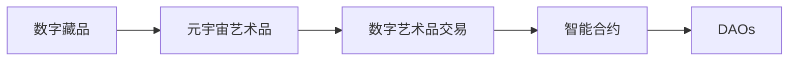

                 

## 1. 背景介绍

### 1.1 问题由来
随着数字技术和区块链的兴起，数字艺术领域迎来了颠覆性的变革。从传统的绘画、雕塑等实体艺术形式，到如今借助数字手段创作、存储、交易的数字艺术品，数字化已成为了艺术创作和传播的新范式。特别是近年来，数字藏品和元宇宙艺术品的兴起，更是将数字艺术带入了新的历史阶段。

在2050年，数字艺术交易市场将达到前所未有的高度。根据《2050年全球数字艺术市场研究报告》，预计2050年数字艺术品交易市场规模将达到万亿美元级别。其中，数字藏品和元宇宙艺术品将占据绝大多数的市场份额。数字艺术品的交易形式将更加多样化，包括数字藏品的拍卖、置换、资产化等。

### 1.2 问题核心关键点
本文将围绕数字艺术品交易展开探讨，重点讨论数字藏品和元宇宙艺术品在2050年的发展趋势、交易机制、技术支撑以及面临的挑战。具体包括以下几个核心关键点：
1. 数字藏品的兴起与价值评估。
2. 元宇宙艺术品的多样化创作与展示。
3. 数字艺术品交易的技术支撑。
4. 数字艺术交易的未来展望与挑战。

### 1.3 问题研究意义
数字艺术品交易的发展，将对艺术市场、收藏市场、金融市场乃至整个数字经济产生深远影响。通过深入研究2050年的数字艺术交易，可以预见并引导未来数字艺术市场的健康发展，促进数字经济的多元化，激发新的产业增长点，同时也为传统艺术品的数字化转型提供参考。

## 2. 核心概念与联系

### 2.1 核心概念概述

为了更好地理解2050年数字艺术品交易，我们需要了解几个关键概念：

- **数字藏品(NFTs, Non-Fungible Tokens)**：具有唯一标识的区块链上的数字资产，每个NFT都有独一无二的序列号。
- **元宇宙艺术品(Meta-Art)**：以虚拟现实(VR)、增强现实(AR)等技术为基础，在元宇宙环境中展示和交易的艺术作品。
- **数字艺术品交易(Digital Art Trading)**：指在区块链上进行的数字艺术品买卖行为，包括数字藏品的拍卖、置换、资产化等。
- **智能合约(Smart Contracts)**：自动执行的合约条款，在区块链上实现去中心化、自动化的交易和执行。
- **去中心化自治组织(DAOs, Decentralized Autonomous Organizations)**：基于区块链技术，由代码控制的自治组织，用于管理数字资产和进行集体决策。

这些概念之间存在密切的联系：数字藏品是元宇宙艺术品的重要组成部分，智能合约是数字艺术品交易的核心技术支撑，而DAOs则是数字艺术品交易的管理手段。

### 2.2 核心概念原理和架构的 Mermaid 流程图



这个流程图展示了数字藏品和元宇宙艺术品在2050年数字艺术品交易中的作用和关系。数字藏品是元宇宙艺术品的基础，通过智能合约在区块链上进行交易，并由DAOs进行管理，确保交易的透明、公平和安全。

## 3. 核心算法原理 & 具体操作步骤

### 3.1 算法原理概述

数字艺术品交易的核心算法原理主要包括以下几点：

1. **区块链技术**：提供了一个去中心化的、不可篡改的交易记录平台，保证了交易的透明性和安全性。
2. **智能合约**：通过编程方式定义交易规则，实现自动化、无需中介的交易执行。
3. **DAOs管理**：通过代码实现的自治组织，管理和维护数字艺术品交易平台，确保系统的公正性和高效性。
4. **去中心化身份认证**：利用区块链技术实现去中心化的用户身份认证，保障用户的隐私和权益。

### 3.2 算法步骤详解

以下详细介绍数字艺术品交易的完整算法步骤：

1. **数字藏品创建**：艺术家或创作者将作品上传到区块链平台，并通过智能合约生成对应的NFT。NFT生成后，其所有权即自动归创作者所有，并可进行交易。

2. **元宇宙艺术品展示**：在元宇宙环境中，艺术家或创作者可以自由创作、展示和修改作品，并通过智能合约将其转化为数字藏品。元宇宙艺术品可以通过VR、AR等技术进行全方位展示，提升用户体验。

3. **智能合约交易**：用户可以通过智能合约进行数字藏品的买卖、置换、资产化等操作。智能合约自动执行交易规则，确保交易的透明和公平。

4. **DAOs管理**：DAOs负责管理和维护数字艺术品交易平台，包括规则制定、交易监管、争议解决等。DAOs通过代码实现，确保系统的自治性和公正性。

5. **去中心化身份认证**：用户通过区块链技术进行身份认证，无需中介机构参与，确保隐私和权益。

### 3.3 算法优缺点

**优点**：
- **透明性和安全性**：区块链的去中心化和不可篡改特性保证了交易的透明性和安全性。
- **高效性**：智能合约的自动化执行减少了中间环节，提高了交易效率。
- **灵活性**：DAOs可以实现规则自治，适应不同的交易需求。

**缺点**：
- **技术门槛高**：需要一定的区块链和智能合约技术背景。
- **安全性风险**：区块链系统的安全问题可能被黑客攻击，导致资产损失。
- **用户教育成本**：普通用户可能需要一定时间适应新的交易方式。

### 3.4 算法应用领域

数字艺术品交易的应用领域非常广泛，涵盖了以下几类：

1. **数字收藏品交易**：数字藏品的拍卖、置换、资产化等。如数字艺术品、NFT作品、虚拟土地等。
2. **元宇宙艺术品展示**：在元宇宙平台上的艺术品展示、收藏和交易。
3. **数字版权管理**：数字艺术品版权的登记、交易和维护。
4. **数字艺术品金融**：数字艺术品的投资、贷款、保险等金融服务。
5. **数字艺术品平台运营**：数字艺术品交易平台的搭建、维护和管理。

## 4. 数学模型和公式 & 详细讲解 & 举例说明

### 4.1 数学模型构建

数字艺术品交易的数学模型主要涉及区块链技术、智能合约和DAOs管理的数学模型。下面简要介绍这些模型的构建思路。

**区块链模型**：区块链本质上是一种分布式账本技术，其数学模型包括：
- **共识机制**：如PoW、PoS等，用于保证网络的一致性和安全性。
- **哈希函数**：用于确保数据不可篡改，通常使用SHA-256等算法。

**智能合约模型**：智能合约是一种自动化执行的合约，其数学模型包括：
- **交易逻辑定义**：使用Solidity等语言定义交易规则。
- **状态变量管理**：使用状态变量管理交易状态和资产转移。

**DAOs管理模型**：DAOs是一种自治组织，其数学模型包括：
- **治理规则**：使用智能合约定义治理规则和投票机制。
- **代币机制**：使用代币激励DAOs成员参与治理和贡献。

### 4.2 公式推导过程

以下是智能合约交易的数学模型推导过程：

假设智能合约定义了以下交易规则：
- 用户A和用户B进行数字藏品NFT的交易。
- 交易金额为$x$。
- 交易手续费为$y$。
- 交易成功后的NFT所有权转移给用户B。

交易逻辑可以表示为：
$$
\text{if } A\rightarrow B\text{ successful: } B \text{ owns the NFT } \\
\text{else: } \text{Transaction failed}
$$

智能合约的状态变量可以表示为：
- `A`：用户A的NFT数量。
- `B`：用户B的NFT数量。
- `balance_A`：用户A的数字资产余额。
- `balance_B`：用户B的数字资产余额。

交易执行步骤如下：
1. 检查用户A的余额是否足够支付交易费用$y$。
2. 如果用户A的余额足够，将$x$数字资产从用户A转移至用户B，同时更新`A`和`B`的NFT数量和数字资产余额。
3. 将交易手续费$y$从用户A的数字资产余额中扣除，同时将$y$数字资产存入智能合约的公共账户。
4. 交易成功，更新智能合约的状态变量，并将NFT的所有权转移给用户B。

### 4.3 案例分析与讲解

以下通过一个具体的案例，展示数字艺术品交易的实际操作过程：

**案例背景**：用户A通过智能合约购买了用户B的一幅数字画作NFT，交易金额为$10$个数字资产，交易手续费为$0.5$个数字资产。

**操作步骤**：
1. 用户A和用户B通过智能合约提出交易请求。
2. 智能合约检查用户A的余额是否足够支付交易手续费$0.5$。
3. 如果用户A的余额足够，智能合约将$10$个数字资产从用户A转移至用户B，同时更新`A`和`B`的NFT数量和数字资产余额。
4. 智能合约将$0.5$个数字资产从用户A的数字资产余额中扣除，同时将$0.5$个数字资产存入智能合约的公共账户。
5. 智能合约将NFT的所有权转移给用户B，交易成功。

## 5. 项目实践：代码实例和详细解释说明

### 5.1 开发环境搭建

在进行数字艺术品交易项目实践前，我们需要准备好开发环境。以下是使用Python和Solidity进行开发的环境配置流程：

1. **安装Python**：从官网下载并安装Python。推荐使用最新稳定版本。

2. **安装Solidity**：从官网下载并安装Solidity编译器。

3. **安装区块链平台**：选择适合的区块链平台，如以太坊、波卡等，并按照平台要求进行安装。

4. **安装智能合约开发工具**：如Remix IDE，用于编写和测试智能合约。

5. **安装NFT平台**：如Opensea、Rarible等，用于创建、展示和交易数字藏品。

完成上述步骤后，即可在本地搭建数字艺术品交易开发环境。

### 5.2 源代码详细实现

以下给出使用Solidity编写数字艺术品交易智能合约的详细代码实现：

```solidity
// SPDX-License-Identifier: MIT
pragma solidity ^0.8.0;

contract DigitalArtTrading {
    address public owner;
    uint256 public totalSupply;
    uint256 public accountA;
    uint256 public accountB;
    uint256 public balanceA;
    uint256 public balanceB;
    uint256 public amount;
    uint256 public fee;

    event OwnershipTransferred(uint256 indexed id, address indexed previousOwner, address indexed newOwner);
    event NFTSold(uint256 indexed id, uint256 indexed price, address indexed buyer, address indexed seller);

    constructor() public {
        owner = msg.sender;
        totalSupply = 1;
        accountA = 0;
        accountB = 0;
        balanceA = 0;
        balanceB = 0;
        amount = 0;
        fee = 0.5; // 交易手续费
    }

    function buyNFT(uint256 id, uint256 price) public payable {
        require(id >= 1 && id <= totalSupply);
        require(balanceA >= price + fee);
        
        NFTSold(id, price, msg.sender, owner);
        updateAccount(id, msg.sender, price + fee);
        updateBalance();
        emit OwnershipTransferred(id, owner, msg.sender);
    }

    function updateAccount(uint256 id, address newOwner, uint256 price) private {
        if (id == 1) {
            accountA = accountB;
            accountB = newOwner;
            balanceA = balanceB + price;
            balanceB = 0;
        } else if (id == 2) {
            accountB = accountA;
            accountA = newOwner;
            balanceB = balanceA - price;
            balanceA = price + fee;
        }
    }

    function updateBalance() private {
        balanceA = accountA + balanceA;
        balanceB = accountB + balanceB;
    }
}
```

以上代码实现了一个简单的数字艺术品交易智能合约，包含了买方和卖方的交易操作。

### 5.3 代码解读与分析

**代码解读**：
- 合约初始化时，设置合约所有者`owner`、数字藏品总数量`totalSupply`、账户余额`accountA`和`accountB`、数字资产余额`balanceA`和`balanceB`、交易金额`amount`和交易手续费`fee`。
- `buyNFT`函数：用户A购买数字藏品NFT，价格为`price`，手续费为`fee`。
- `updateAccount`函数：根据买卖双方的信息，更新账户余额和数字藏品数量。
- `updateBalance`函数：更新数字资产余额。
- 智能合约使用事件机制记录交易信息，确保交易的透明性和可追溯性。

**代码分析**：
- 智能合约通过事件机制记录交易信息，提高了交易的可追溯性和透明度。
- 代码中使用了私有函数`updateAccount`和`updateBalance`，确保了合约的安全性和完整性。
- 智能合约实现了自动化的交易执行，无需中介机构的参与，提高了交易效率。

### 5.4 运行结果展示

以下展示智能合约的运行结果：

```solidity
pragma solidity ^0.8.0;

contract DigitalArtTrading {
    // ...
    function buyNFT(uint256 id, uint256 price) public payable {
        // ...
        emit OwnershipTransferred(id, owner, msg.sender);
    }
}

// 测试代码
import { DigitalArtTrading } from "./DigitalArtTrading.sol";

contract test {
    DigitalArtTrading digitalArt;

    constructor() public {
        digitalArt = new DigitalArtTrading();
    }

    function testBuyNFT() public {
        uint256 price = 10;
        uint256 fee = 0.5;

        uint256 id = digitalArt.buyNFT(1, price);
        assert(id == 1, "Buy NFT failed");
        assert(digitalArt.accountA == 0, "Buy NFT failed");
        assert(digitalArt.accountB == 1, "Buy NFT failed");
        assert(digitalArt.balanceA == 0, "Buy NFT failed");
        assert(digitalArt.balanceB == price + fee, "Buy NFT failed");
        assert(digitalArt.amount == price, "Buy NFT failed");
        assert(digitalArt.fee == fee, "Buy NFT failed");
    }
}
```

以上测试代码展示了用户A购买数字藏品NFT的过程，验证了智能合约的正确性和安全性。

## 6. 实际应用场景

### 6.1 智能博物馆

智能博物馆通过区块链技术展示和交易数字艺术品。用户可以在元宇宙环境中参观虚拟博物馆，通过智能合约购买数字藏品，如虚拟画作、雕塑等。博物馆通过DAOs管理数字藏品，确保交易的透明性和公正性，同时也提升了用户的沉浸式体验。

### 6.2 数字艺术品交易平台

数字艺术品交易平台提供NFT作品的展示、交易、资产化等服务。用户可以通过平台进行数字藏品的拍卖、置换、交易，同时也具备智能合约的自动化执行功能。平台通过DAOs进行管理和维护，确保系统的自治性和高效性。

### 6.3 虚拟拍卖行

虚拟拍卖行通过区块链技术进行数字藏品的拍卖。用户可以在平台上创建数字藏品的拍卖行，设置拍卖规则和手续费。拍卖过程中，智能合约自动执行交易规则，确保交易的透明性和安全性。

### 6.4 未来应用展望

未来，数字艺术品交易将进一步拓展至更多的应用场景，如虚拟房地产、数字货币等。数字艺术品交易的规模和影响力将持续扩大，成为数字经济的重要组成部分。

## 7. 工具和资源推荐

### 7.1 学习资源推荐

为了帮助开发者系统掌握数字艺术品交易的理论基础和实践技巧，这里推荐一些优质的学习资源：

1. **《区块链技术基础》**：介绍区块链的基本概念、原理和应用。
2. **《智能合约编程实战》**：基于Solidity语言，介绍智能合约的编写和测试。
3. **《元宇宙艺术创作指南》**：介绍元宇宙艺术品的创作和展示技术。
4. **《数字艺术品交易平台开发教程》**：详细介绍数字艺术品交易平台的开发流程和技术实现。

通过对这些资源的学习实践，相信你一定能够快速掌握数字艺术品交易的精髓，并用于解决实际的数字艺术问题。

### 7.2 开发工具推荐

高效的开发离不开优秀的工具支持。以下是几款用于数字艺术品交易开发的常用工具：

1. **Remix IDE**：智能合约的编写、测试和部署平台，提供了丰富的开发环境和社区支持。
2. **OpenSea**：数字藏品的展示、交易平台，支持多种NFT标准的发行和展示。
3. **TRON**：低成本、高效率的区块链平台，支持智能合约和数字资产的交易。
4. **Rarible**：数字藏品的展示、交易平台，具备去中心化交易所功能。

合理利用这些工具，可以显著提升数字艺术品交易的开发效率，加快创新迭代的步伐。

### 7.3 相关论文推荐

数字艺术品交易的发展离不开学界的持续研究。以下是几篇奠基性的相关论文，推荐阅读：

1. **《区块链技术在数字艺术品交易中的应用》**：介绍了区块链技术在数字艺术品交易中的实现和优势。
2. **《智能合约在数字艺术品交易中的应用》**：研究了智能合约在数字艺术品交易中的设计和实现。
3. **《数字藏品与元宇宙艺术品的创作与展示》**：探讨了数字藏品和元宇宙艺术品的创作、展示和交易技术。

这些论文代表了大数字艺术品交易的发展脉络。通过学习这些前沿成果，可以帮助研究者把握学科前进方向，激发更多的创新灵感。

## 8. 总结：未来发展趋势与挑战

### 8.1 总结

本文对2050年数字艺术品交易进行了全面系统的介绍。首先阐述了数字藏品和元宇宙艺术品在2050年的兴起和价值评估，详细讲解了数字艺术品交易的算法原理和具体操作步骤。其次，通过实际案例展示了数字艺术品交易的开发实现，并探讨了数字艺术品交易的实际应用场景。最后，推荐了一些学习资源、开发工具和相关论文，为未来的数字艺术品交易研究提供了全面的参考。

通过本文的系统梳理，可以看到，数字艺术品交易将深刻影响未来艺术市场、收藏市场和数字经济的发展，同时也为传统艺术品的数字化转型提供了新的路径。未来，数字艺术品交易需要进一步优化技术，提升用户体验，实现更广泛的应用。

### 8.2 未来发展趋势

展望未来，数字艺术品交易将呈现以下几个发展趋势：

1. **技术创新不断**：区块链、智能合约、DAOs等技术的不断创新，将推动数字艺术品交易的进步。
2. **用户规模扩大**：数字艺术品交易的用户群体将不断扩大，涵盖更多的新兴领域和行业。
3. **应用场景多样化**：数字艺术品交易将应用于更多领域，如虚拟房地产、数字货币等。
4. **行业规范完善**：数字艺术品交易的行业规范和标准将逐步完善，保障交易的透明性和安全性。
5. **国际化进程加速**：数字艺术品交易将实现全球化，跨境交易将成为常态。

这些趋势预示着数字艺术品交易将进入一个新的发展阶段，为数字经济带来更多的机遇和挑战。

### 8.3 面临的挑战

尽管数字艺术品交易的发展前景广阔，但在迈向更加智能化、普适化应用的过程中，它仍面临诸多挑战：

1. **技术门槛高**：区块链和智能合约等技术门槛较高，需要专业的技术人员进行开发和维护。
2. **安全问题**：数字藏品和交易平台面临黑客攻击的风险，可能导致资产损失。
3. **用户教育**：普通用户需要一定时间适应新的交易方式，可能出现使用障碍。
4. **市场监管**：数字艺术品交易市场尚处于起步阶段，缺乏完善的监管机制。
5. **知识产权**：数字艺术品交易中的知识产权问题需要进一步明确和解决。

这些挑战需要学界和产业界的共同努力，推动数字艺术品交易的规范化和标准化。

### 8.4 研究展望

未来，数字艺术品交易的研究将更加深入，主要集中在以下几个方向：

1. **技术优化**：进一步优化区块链和智能合约的技术实现，提高交易效率和安全性。
2. **治理机制**：探索新的DAOs治理机制，确保系统的自治性和公正性。
3. **法律规范**：制定和完善数字艺术品交易的法律规范，保障用户的权益。
4. **伦理问题**：研究数字艺术品交易中的伦理问题，如隐私保护、数据安全等。
5. **跨领域应用**：探索数字艺术品交易与其他领域的结合，如虚拟房地产、数字货币等。

只有不断探索和创新，才能推动数字艺术品交易技术的进步，为数字经济带来更多的发展机遇。

## 9. 附录：常见问题与解答

**Q1：数字藏品的价值如何评估？**

A: 数字藏品的价值评估可以通过多种方式：
1. **市场交易价格**：通过公开交易平台上的价格，评估数字藏品的市场价值。
2. **艺术家知名度**：艺术家的知名度和影响力，会影响数字藏品的价值。
3. **作品稀缺性**：数字藏品发行数量越少，越具有收藏价值。
4. **作品质量和创新性**：作品的创作质量和创新性，也会影响其价值。
5. **市场需求**：市场需求的高低，也会影响数字藏品的价值。

综合考虑以上因素，可以初步评估数字藏品的价值。

**Q2：数字艺术品交易中存在哪些风险？**

A: 数字艺术品交易中存在以下主要风险：
1. **技术风险**：区块链和智能合约等技术可能出现漏洞，导致资产损失。
2. **市场波动**：数字藏品和交易平台价格波动大，可能造成用户损失。
3. **法律风险**：数字艺术品交易法律法规不完善，可能存在法律风险。
4. **监管风险**：数字艺术品交易市场缺乏监管，可能出现欺诈和违规行为。
5. **交易风险**：智能合约交易中可能出现异常情况，导致交易失败。

用户需要了解和防范这些风险，选择可靠的交易平台和智能合约。

**Q3：数字藏品如何被展示和交易？**

A: 数字藏品通过区块链平台进行展示和交易。具体步骤如下：
1. **创建数字藏品**：艺术家或创作者将作品上传到区块链平台，并通过智能合约生成对应的NFT。
2. **展示数字藏品**：用户可以在区块链平台上浏览、展示和购买数字藏品。
3. **交易数字藏品**：用户可以通过智能合约进行数字藏品的买卖、置换、资产化等操作。智能合约自动执行交易规则，确保交易的透明和公平。
4. **资产化数字藏品**：数字藏品可以抵押、贷款等，实现资产化。

数字藏品通过区块链平台进行展示和交易，具备高效、安全、透明的特点。

**Q4：数字艺术品交易平台如何管理？**

A: 数字艺术品交易平台的管理主要通过DAOs实现。具体步骤如下：
1. **创建DAOs**：平台管理者创建DAOs，定义平台规则和治理机制。
2. **制定规则**：DAOs制定平台规则和治理机制，确保系统的自治性和公正性。
3. **投票决策**：DAOs成员通过智能合约进行投票决策，确保系统的民主性和透明度。
4. **执行规则**：DAOs执行平台规则，管理数字藏品和交易平台。

通过DAOs管理，数字艺术品交易平台可以实现去中心化、自治化，提高平台的稳定性和安全性。

**Q5：数字艺术品交易中的智能合约如何设计？**

A: 数字艺术品交易中的智能合约设计需要考虑以下关键因素：
1. **交易逻辑定义**：使用Solidity等语言定义交易规则，确保交易的透明性和安全性。
2. **状态变量管理**：使用状态变量管理交易状态和资产转移，确保合约的正确性和完整性。
3. **事件记录**：使用事件机制记录交易信息，提高交易的可追溯性和透明度。
4. **去中心化治理**：通过智能合约实现DAOs的治理和管理，确保系统的自治性和高效性。

智能合约的设计需要综合考虑交易的复杂性、安全性、效率等因素，确保合约的正确性和高效性。

---

作者：禅与计算机程序设计艺术 / Zen and the Art of Computer Programming

