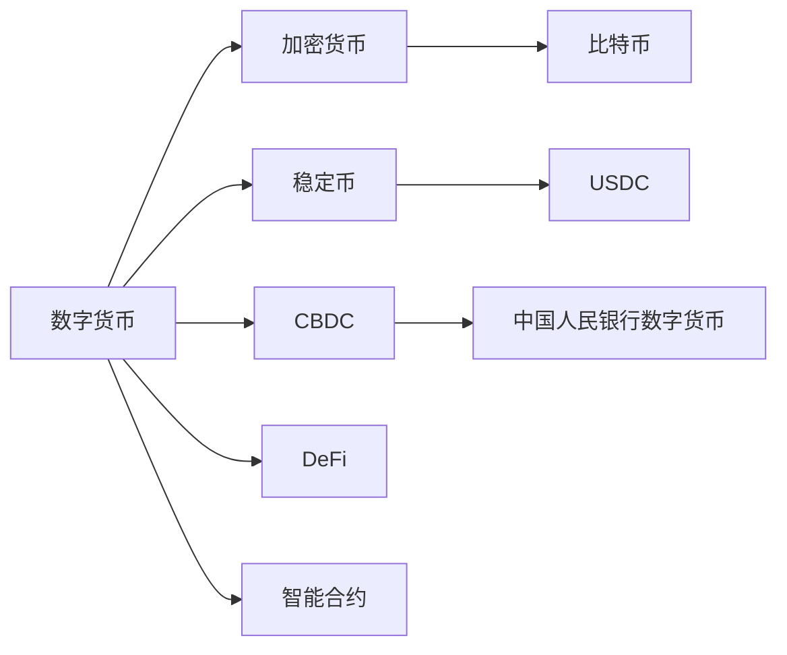

                 

# 2050年的数字货币：从加密货币到全球数字货币的货币体系重构

## 1. 背景介绍

### 1.1 数字货币的发展历程

数字货币的概念最早可以追溯到1980年代，当时戴维·乔姆（David Chaum）提出了盲签名（Blind Signature）和无痕迹支付（Untraceable Payments）的概念。这些早期的探索为后来的加密货币奠定了基础。

然而，直到2008年，中本聪（Satoshi Nakamoto）发表了《比特币：一种点对点的电子现金系统》白皮书，数字货币才开始真正走向大众视野。比特币的诞生，标志着去中心化、开放、无需信任的区块链技术的诞生，也引发了全球加密货币浪潮。

短短十余年间，数字货币从最初的比特币，发展出了以太坊（Ethereum）、莱特币（Litecoin）、瑞波币（Ripple）等数千种货币，其中比特币和以太坊的价值已经超过了很多国家的货币。

### 1.2 数字货币的特性和优势

数字货币的特性和优势主要体现在以下几点：

- **去中心化**：没有中央权威机构的控制，所有交易记录和账本数据都存储在分布式网络上。
- **安全性**：使用加密技术保证交易的安全性，防止双花攻击和篡改。
- **透明性**：所有交易历史都公开可查，任何人都可以在网络上验证和追踪交易。
- **低成本**：交易成本低，甚至可以忽略不计。
- **可编程性**：智能合约可以实现自动化和智能化的金融服务。
- **高效性**：实时交易，不存在中间机构导致的时间延误。

这些特性和优势使得数字货币成为传统金融体系的有力补充，也为未来数字货币的发展提供了广阔前景。

## 2. 核心概念与联系

### 2.1 核心概念概述

为了更好地理解数字货币的未来发展，本节将介绍几个关键概念：

- **数字货币**：以加密技术为基础，通过区块链等分布式账本技术实现的一种新型货币。
- **加密货币**：最早出现的一种数字货币，通常基于区块链技术。
- **稳定币**：以某种资产或算法为基础，实现价格稳定的数字货币。
- **CBDC（中央银行数字货币）**：由中央银行发行的数字货币，旨在实现货币政策的数字化。
- **DeFi（去中心化金融）**：基于区块链技术构建的金融服务体系，包括借贷、保险、交易等。
- **智能合约**：一种基于区块链技术的自动执行合约，可以无需中介完成交易。

这些概念之间存在紧密的联系，共同构成了未来数字货币货币体系的基石。通过理解这些概念，可以更好地把握数字货币的发展脉络和未来趋势。

### 2.2 核心概念原理和架构的 Mermaid 流程图



这个流程图展示了数字货币及其相关概念之间的逻辑关系：

1. 数字货币是加密货币的一种形式，基于区块链技术。
2. 加密货币包括比特币、莱特币等，是最早出现的数字货币。
3. 稳定币如USDC等，基于某种资产或算法，实现价格稳定。
4. CBDC是中央银行发行的数字货币，实现货币政策的数字化。
5. DeFi是建立在区块链技术上的金融服务体系，包括借贷、保险、交易等。
6. 智能合约基于区块链技术，实现自动化的金融服务。

## 3. 核心算法原理 & 具体操作步骤

### 3.1 算法原理概述

数字货币的算法原理主要包括以下几个方面：

- **加密算法**：保障数字货币的安全性，如公钥密码学、哈希算法等。
- **共识机制**：在分布式网络上达成一致，保证账本的正确性和可信度，如工作量证明（PoW）、权益证明（PoS）、权益证明链（DPoS）等。
- **智能合约**：基于区块链技术，实现自动化的金融服务，如智能合约自动执行、去中心化金融应用等。
- **去中心化存储**：利用分布式网络进行数据存储和传输，保证数据的安全性和可靠性。

### 3.2 算法步骤详解

数字货币的算法步骤通常包括以下几个关键步骤：

1. **初始化区块链**：定义区块链的参数和规则，如区块大小、共识机制、奖励机制等。
2. **生成区块**：记录交易数据并打包成区块。
3. **验证区块**：网络节点验证区块的数据完整性和正确性。
4. **共识机制**：网络节点通过共识机制达成一致，将区块添加到链上。
5. **交易验证**：验证交易的有效性和合法性。
6. **智能合约执行**：执行智能合约中的自动化金融服务。

### 3.3 算法优缺点

数字货币的算法具有以下优点：

- **安全性高**：加密技术和分布式账本保证交易的安全性和不可篡改性。
- **去中心化**：去中心化网络减少中间机构，降低交易成本。
- **透明度高**：所有交易数据公开可查，提高透明度和信任度。
- **高效性**：实时交易，降低时间延误。

然而，数字货币也存在一些缺点：

- **波动性大**：加密货币的价格波动较大，影响其稳定性。
- **监管难度**：去中心化的特性导致监管难度较大，容易滋生非法交易。
- **技术门槛高**：需要一定的区块链和加密技术基础，门槛较高。

### 3.4 算法应用领域

数字货币的应用领域非常广泛，主要包括以下几个方面：

- **金融支付**：实现跨国家、跨地域的支付和转账。
- **供应链金融**：提升供应链管理的透明度和效率。
- **跨境电商**：简化跨境支付和结算流程。
- **房地产交易**：实现房地产市场的数字化和去中心化。
- **物联网**：实现物联网设备的智能交互和支付。
- **社交网络**：实现用户身份认证和支付功能。

这些应用领域展示了数字货币在各个方面的潜力，未来随着技术的不断进步，数字货币的应用范围还将进一步拓展。

## 4. 数学模型和公式 & 详细讲解 & 举例说明

### 4.1 数学模型构建

数字货币的数学模型主要包括以下几个部分：

- **加密算法**：如公钥密码学、哈希算法等。
- **共识机制**：如PoW、PoS等。
- **智能合约**：基于区块链技术的自动化合约。

### 4.2 公式推导过程

这里仅以PoW共识机制为例，推导其工作原理。

PoW（Proof of Work）机制的核心在于通过工作量证明算力，选择最优的区块。其计算公式如下：

$$
P(\text{miner}, \text{block}) = \frac{1}{\sum_{i=1}^{n} h_i(\text{hash}(\text{block}, i))}
$$

其中，$h_i$ 表示对区块和迭代次数 $i$ 进行哈希运算，$n$ 表示迭代次数。算力的工作量 $P$ 与计算哈希的次数成反比，即迭代次数越多，算力越高。

### 4.3 案例分析与讲解

以比特币网络为例，比特币的共识机制为PoW。矿工通过不断计算哈希值，试图找到满足条件的哈希值，一旦找到，就将该区块广播给网络，并通过验证机制确认。

## 5. 项目实践：代码实例和详细解释说明

### 5.1 开发环境搭建

在进行数字货币开发前，我们需要准备好开发环境。以下是使用Python进行比特币开发的环境配置流程：

1. 安装Anaconda：从官网下载并安装Anaconda，用于创建独立的Python环境。

2. 创建并激活虚拟环境：
```bash
conda create -n bitcoin-env python=3.8 
conda activate bitcoin-env
```

3. 安装比特币库和相关依赖：
```bash
pip install bitcoin python-bitcoinlib
```

完成上述步骤后，即可在`bitcoin-env`环境中开始开发。

### 5.2 源代码详细实现

下面我们以比特币挖矿为例，给出使用Python-bitcoinlib库进行比特币挖矿的代码实现。

```python
from bitcoin import *

def mine_block(bitcoin_node, difficulty):
    block = bitcoin.Node.get_new_block(bitcoin_node, difficulty)
    raw_hash = bitcoin.Node.hash_block(block)
    block['raw_hash'] = raw_hash
    block['height'] = bitcoin.Node.get_height(bitcoin_node)
    bitcoin.Node.add_block(bitcoin_node, block)
    return block['hash']

bitcoin_node = bitcoin.Node()
block_hash = mine_block(bitcoin_node, 1000000)
print("Block mined:", block_hash)
```

### 5.3 代码解读与分析

让我们再详细解读一下关键代码的实现细节：

**Python-bitcoinlib库**：
- `bitcoin.Node`：用于连接比特币网络，进行挖矿和交易。
- `bitcoin.Node.get_new_block`：获取新的区块，计算哈希值。
- `bitcoin.Node.hash_block`：计算区块哈希值。
- `bitcoin.Node.add_block`：将区块添加到区块链中。

**挖矿函数**：
- `mine_block`函数：连接比特币节点，生成新的区块，计算哈希值，并将区块添加到区块链中。
- `block`参数：存储区块数据。
- `difficulty`参数：难度参数，用于计算哈希值。
- `raw_hash`参数：存储计算得到的哈希值。
- `block['raw_hash']`：将哈希值存储到区块中。
- `block['height']`：设置区块的高度。
- `bitcoin.Node.add_block`：将区块添加到区块链中。

以上代码实现了比特币挖矿的基本流程，展示了如何连接比特币网络，生成新的区块，并计算哈希值。

### 5.4 运行结果展示

运行上述代码后，控制台输出新矿的哈希值，标志着新矿块成功添加到比特币区块链中。

## 6. 实际应用场景

### 6.1 金融支付

数字货币在金融支付领域的应用非常广泛，其去中心化的特性使得跨境支付和转账变得更加便捷和低成本。数字货币可以有效降低中间机构的费用，提高支付效率，实现实时交易。

### 6.2 供应链金融

在供应链金融领域，数字货币可以实现多方协作，提高供应链管理的透明度和效率。通过区块链技术，各方可以实时共享供应链信息，减少信息不对称和欺诈风险。

### 6.3 跨境电商

数字货币在跨境电商中的应用可以简化跨境支付和结算流程，降低交易成本和风险。数字货币的跨境支付可以直接在双方账户之间进行，无需依赖中间机构，实现高效、低成本的交易。

### 6.4 房地产交易

数字货币可以用于房地产市场的数字化和去中心化。通过智能合约和区块链技术，实现房产的登记、交易和交付，提高交易的透明度和安全性。

### 6.5 物联网

数字货币在物联网中的应用可以实现设备之间的智能交互和支付，通过区块链技术实现设备身份认证和支付功能。物联网设备可以直接使用数字货币进行支付，提高支付效率和安全性。

### 6.6 社交网络

数字货币可以用于社交网络的支付和身份认证。用户可以使用数字货币进行微支付，实现社交媒体平台的货币化，同时保证用户身份的安全性。

## 7. 工具和资源推荐

### 7.1 学习资源推荐

为了帮助开发者系统掌握数字货币的理论基础和实践技巧，这里推荐一些优质的学习资源：

1. 《区块链原理与实践》系列博文：由区块链专家撰写，深入浅出地介绍了区块链原理、比特币技术、智能合约等。
2. CS223《区块链技术》课程：斯坦福大学开设的区块链课程，有Lecture视频和配套作业，带你入门区块链领域的基本概念和经典模型。
3. 《区块链技术与金融创新》书籍：区块链技术的先驱者之一，全面介绍了区块链在金融领域的应用。
4. 区块链官方文档：比特币和以太坊的官方文档，提供了完整的区块链开发指南和样例代码。
5. ConsenSys学院：以太坊和区块链开发者的官方培训平台，提供丰富的课程和实战项目。

通过对这些资源的学习实践，相信你一定能够快速掌握数字货币的精髓，并用于解决实际的区块链问题。

### 7.2 开发工具推荐

高效的开发离不开优秀的工具支持。以下是几款用于数字货币开发常用的工具：

1. Python-bitcoinlib：比特币开发常用的Python库，提供了比特币网络连接、交易处理、区块生成等功能。
2. Web3.py：以太坊和智能合约开发的Python库，支持以太坊网络的连接和智能合约的部署。
3. Truffle：以太坊开发工具，支持智能合约的开发、测试和部署。
4. Hyperledger Fabric：Hyperledger联盟推出的区块链框架，支持联盟链和私链的开发和部署。
5. Corda：Hyperledger联盟推出的区块链平台，专注于金融领域的智能合约和应用开发。
6. AWS Blockchain：亚马逊提供的区块链平台，支持多种区块链网络和服务。

合理利用这些工具，可以显著提升数字货币开发和实验的效率，加快创新迭代的步伐。

### 7.3 相关论文推荐

数字货币的发展源于学界的持续研究。以下是几篇奠基性的相关论文，推荐阅读：

1. On the Implementation of a Block-Chaining Protocol: 1970s-2010s：回顾了比特币和区块链技术的发展历程，展示了区块链技术的不断演进。
2. Bitcoin: A Peer-to-Peer Electronic Cash System：比特币的开创性论文，展示了比特币网络的工作原理和实现细节。
3. Smart Contracts: A Survey: 对智能合约技术的全面综述，介绍了智能合约的实现方法和应用场景。
4. Blockchain Technology Overview: 区块链技术的全面介绍，涵盖了区块链的基本概念、工作原理和应用场景。
5. Consensus Algorithms in Blockchain Systems: 对区块链共识算法的全面综述，介绍了PoW、PoS等共识算法的原理和优缺点。

这些论文代表了大规模语言模型微调技术的发展脉络。通过学习这些前沿成果，可以帮助研究者把握学科前进方向，激发更多的创新灵感。

## 8. 总结：未来发展趋势与挑战

### 8.1 总结

本文对数字货币的未来发展进行了全面系统的介绍。首先阐述了数字货币和加密货币的发展历程，明确了数字货币的特性和优势。其次，从原理到实践，详细讲解了数字货币的算法原理和具体实现步骤。同时，本文还广泛探讨了数字货币在金融支付、供应链金融、跨境电商、房地产交易、物联网、社交网络等多个领域的应用前景，展示了数字货币在各个方面的潜力。此外，本文精选了数字货币技术的各类学习资源，力求为读者提供全方位的技术指引。

通过本文的系统梳理，可以看到，数字货币作为一种新型的货币体系，正在逐渐取代传统的银行支付系统，成为未来金融体系的基石。数字货币在提高交易效率、降低成本、提升透明度等方面具有不可比拟的优势，未来在各个领域的应用前景广阔。

### 8.2 未来发展趋势

展望未来，数字货币的发展趋势主要体现在以下几个方面：

1. **普及化**：随着技术的不断成熟和监管政策的完善，数字货币将逐渐普及，成为主流支付方式。
2. **去中心化**：去中心化金融（DeFi）的发展将进一步推动数字货币的去中心化，减少中间机构的费用和风险。
3. **标准化**：数字货币的标准化将有助于提升互操作性和安全性，减少技术壁垒。
4. **跨链互操作**：数字货币的跨链技术将实现不同区块链网络之间的互操作性，提升交易效率和用户体验。
5. **监管合规**：数字货币的监管政策和合规标准将逐渐完善，保障其健康发展。
6. **智能化**：数字货币将与人工智能、大数据等技术深度融合，提升金融服务的智能化水平。

这些趋势凸显了数字货币在未来的广阔前景，必将深刻改变未来的金融和商业生态。

### 8.3 面临的挑战

尽管数字货币在发展过程中取得了不少进展，但仍面临诸多挑战：

1. **市场波动性**：数字货币的价格波动较大，影响其稳定性和普及性。
2. **监管难度**：去中心化的特性导致监管难度较大，容易滋生非法交易。
3. **技术门槛高**：数字货币和区块链技术的门槛较高，需要一定的技术基础。
4. **隐私和安全问题**：数字货币的交易和存储可能面临隐私泄露和安全性问题。
5. **数据和算法偏见**：数字货币的算法和数据可能存在偏见，影响其公平性和可信度。
6. **法律和伦理问题**：数字货币的发展可能带来法律和伦理问题，需要进一步规范和引导。

这些挑战需要各方共同努力，逐步解决，才能实现数字货币的健康发展。

### 8.4 研究展望

未来的研究需要在以下几个方面进行突破：

1. **普及化技术**：提升数字货币的普及性和安全性，降低技术门槛。
2. **标准化和互操作性**：推进数字货币的标准化，实现跨链互操作性。
3. **监管合规**：制定合理的监管政策，保障数字货币的健康发展。
4. **智能化**：结合人工智能、大数据等技术，提升数字货币的智能化水平。
5. **隐私和安全**：研究隐私保护和安全技术，提升数字货币的安全性。
6. **公平性和可信度**：提升算法的公平性和可信度，减少偏见和歧视。

这些研究方向的探索，必将引领数字货币技术迈向更高的台阶，为构建安全、可靠、智能的数字货币体系铺平道路。

## 9. 附录：常见问题与解答

**Q1：数字货币和加密货币有什么区别？**

A: 数字货币是一种基于加密技术的货币形式，包括加密货币和中央银行数字货币（CBDC）。加密货币是最早出现的一种数字货币，如比特币、莱特币等，通常基于区块链技术。而CBDC是由中央银行发行的数字货币，旨在实现货币政策的数字化。

**Q2：数字货币的未来发展趋势是什么？**

A: 数字货币的未来发展趋势主要体现在普及化、去中心化、标准化、跨链互操作、监管合规、智能化等方面。随着技术的不断成熟和监管政策的完善，数字货币将逐渐普及，成为主流支付方式。去中心化金融（DeFi）的发展将进一步推动数字货币的去中心化，减少中间机构的费用和风险。数字货币的标准化将有助于提升互操作性和安全性，减少技术壁垒。数字货币的跨链技术将实现不同区块链网络之间的互操作性，提升交易效率和用户体验。数字货币的监管政策和合规标准将逐渐完善，保障其健康发展。数字货币将与人工智能、大数据等技术深度融合，提升金融服务的智能化水平。

**Q3：数字货币在实际应用中面临哪些挑战？**

A: 数字货币在实际应用中面临的挑战包括市场波动性、监管难度、技术门槛高、隐私和安全问题、数据和算法偏见、法律和伦理问题等。数字货币的价格波动较大，影响其稳定性和普及性。去中心化的特性导致监管难度较大，容易滋生非法交易。数字货币和区块链技术的门槛较高，需要一定的技术基础。数字货币的交易和存储可能面临隐私泄露和安全性问题。数字货币的算法和数据可能存在偏见，影响其公平性和可信度。数字货币的发展可能带来法律和伦理问题，需要进一步规范和引导。

**Q4：数字货币在实际应用中需要注意哪些问题？**

A: 在实际应用中，数字货币需要注意以下问题：

1. 安全问题：确保数字货币的安全性和隐私保护，防止黑客攻击和欺诈行为。
2. 法规合规：遵守相关法律法规，确保数字货币的合法性和合规性。
3. 标准化和互操作性：推进数字货币的标准化，实现跨链互操作性，提升用户体验。
4. 技术升级：及时升级数字货币的技术，提升其安全性和性能。
5. 数据安全：确保数字货币的交易和存储数据的安全性，防止数据泄露和滥用。
6. 市场监管：建立有效的市场监管机制，防止市场波动和欺诈行为。

通过合理解决这些问题，可以最大限度地发挥数字货币的优势，提升其在实际应用中的效果。

---

作者：禅与计算机程序设计艺术 / Zen and the Art of Computer Programming

