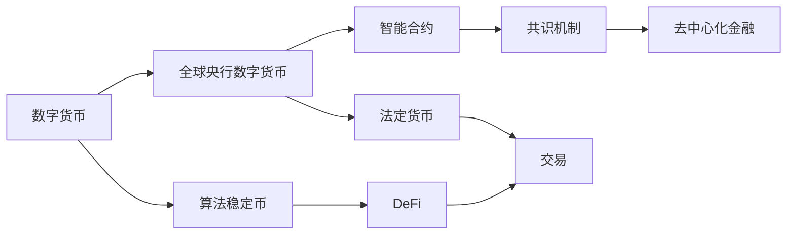

                 

# 2050年的数字货币：从算法稳定币到全球央行数字货币的数字货币竞争

## 1. 背景介绍

### 1.1 问题由来

数字货币，这一源于互联网的新型金融形式，自2009年比特币（Bitcoin）的诞生以来，在全球范围内迅速蔓延，逐渐成为国际金融领域的一颗璀璨明星。其去中心化、匿名性、抗审查性等特点，颠覆了传统金融模式，带来了金融创新与变革。

然而，尽管数字货币发展迅猛，但在实际应用中仍存在诸多问题：如波动性大、共识机制复杂、市场不成熟、监管不明确等。这些问题制约了数字货币的广泛应用，迫切需要找到一种更加稳定、高效、可监管的数字货币解决方案。

近年来，算法稳定币和全球央行数字货币（CBDCs）应运而生，为数字货币的未来发展提供了新的方向。它们代表了数字货币技术发展的两个极端，分别从市场力量和政府引导的角度出发，提供了各自不同的解决方案。

### 1.2 问题核心关键点

算法稳定币和全球央行数字货币在市场定位、技术实现、应用场景等方面各有所长，但也存在一些竞争和挑战：

- 市场定位：算法稳定币主要通过市场力量驱动，具有更强的市场适应性；而全球央行数字货币则是政府主导，拥有法律和政策保障。
- 技术实现：算法稳定币依靠复杂的算法和智能合约来维持价格稳定；全球央行数字货币则直接基于法定货币，采用中心化管理。
- 应用场景：算法稳定币更适合面向大众投资者和小微企业，可提供便捷的交易和支付工具；全球央行数字货币则更适用于大型金融机构和政府部门，用于提升交易效率和监管合规。
- 竞争与挑战：算法稳定币的波动性和复杂性可能影响其广泛应用；全球央行数字货币则需要在技术实现和监管合规之间找到平衡，以实现其在实际场景中的高效和可控。

## 2. 核心概念与联系

### 2.1 核心概念概述

为深入理解算法稳定币和全球央行数字货币，我们首先介绍几个核心概念：

- 数字货币（Digital Currency）：指基于互联网的数字资产，通过加密技术和分布式账本技术进行存储和交易，具备去中心化、匿名性等特点。
- 算法稳定币（Algorithmic Stablecoin）：通过复杂的算法设计，利用多种资产（如USDT、USDC等）维护价格稳定的数字货币。
- 全球央行数字货币（Central Bank Digital Currency，CBDCs）：由国家央行发行和管理的数字货币，基于区块链技术或传统银行系统，具备法定货币效力。
- 智能合约（Smart Contract）：通过代码自动执行交易的合约，用于维护算法稳定币的价格稳定。
- 共识机制（Consensus Mechanism）：数字货币系统中的去中心化交易验证机制，如比特币的PoW、以太坊的PoS等。
- 去中心化金融（DeFi）：基于区块链技术的金融应用，包括去中心化交易、借贷、保险等。

这些核心概念之间存在复杂的联系，通过合理的组合和应用，可以构建出不同类型的数字货币系统。理解这些概念的相互关系，是深入理解数字货币竞争的基础。

### 2.2 核心概念原理和架构的 Mermaid 流程图



该图展示了数字货币、算法稳定币、全球央行数字货币以及智能合约、共识机制、DeFi之间的联系。

## 3. 核心算法原理 & 具体操作步骤

### 3.1 算法原理概述

算法稳定币和全球央行数字货币在技术原理上有着显著的区别，但本质上都是通过区块链技术实现的交易和支付手段。

- 算法稳定币：通过智能合约自动执行和维护，利用多种资产的组合，以一定的算法规则维持币值稳定。如USDC稳定币通过将USDT作为挂钩资产，使用一些复杂的算法（如单边激励模型、市场机制等）来维持其价格与美元的稳定。
- 全球央行数字货币：由国家央行发行，具备法定货币效力，通过区块链技术实现管理和交易。如中国数字人民币（e-CNY）、欧洲央行数字欧元（CBDC）等，都是央行基于区块链技术或传统银行系统发行的数字货币。

### 3.2 算法步骤详解

#### 3.2.1 算法稳定币的实现步骤

1. **资产选择与组合**：选择多种资产作为挂钩资产，如USDT、USDC等。
2. **智能合约设计**：设计智能合约，自动执行价格维护机制，如自动回兑、自动增发/赎回等。
3. **算法规则设定**：根据市场情况和挂钩资产的流动性，设定复杂的算法规则，确保币值稳定。
4. **发行与交易**：通过交易所、钱包等渠道进行发行和交易。

#### 3.2.2 全球央行数字货币的实现步骤

1. **发行与发行量控制**：由央行发行数字货币，设定初始发行量和增长机制。
2. **交易与存储**：通过区块链或传统银行系统实现数字货币的交易和存储。
3. **监管与合规**：设置严格的监管机制，确保合规性。
4. **审计与透明**：采用公开透明的方式，便于审计和监管。

### 3.3 算法优缺点

#### 3.3.1 算法稳定币的优缺点

**优点**：
- **灵活性**：市场驱动，可以根据市场需求自动调整发行量和价格。
- **普适性**：通过交易所和钱包等渠道，可以迅速融入现有金融系统。
- **多样化**：可以选择不同的挂钩资产和算法规则，满足不同用户的需求。

**缺点**：
- **波动性**：依赖市场供需关系，波动性较大。
- **复杂性**：算法设计复杂，容易受到市场波动和攻击的影响。
- **风险**：挂钩资产可能存在系统性风险，如USDT挤兑风险。

#### 3.3.2 全球央行数字货币的优缺点

**优点**：
- **稳定性和法定性**：由央行发行和管理，具备法定货币效力。
- **信任度**：由央行担保，具有高度的可信度和稳定性。
- **监管性**：易于监管，确保合规性。

**缺点**：
- **技术复杂性**：技术实现复杂，需要兼顾传统银行系统和区块链技术。
- **用户接受度**：用户接受度较低，需花费大量时间和精力推广。
- **法律障碍**：涉及国家主权和隐私保护等问题，法律障碍较多。

### 3.4 算法应用领域

#### 3.4.1 算法稳定币的应用领域

- **DeFi平台**：为DeFi平台提供稳定的交易和借贷工具。
- **支付系统**：为跨国支付和跨境支付提供便捷解决方案。
- **投资与理财**：为个人投资者提供低风险、高流动性的资产。
- **企业应用**：为小微企业提供低成本的金融服务。

#### 3.4.2 全球央行数字货币的应用领域

- **跨境支付**：提高跨境支付的效率和安全性。
- **政府交易**：用于政府部门之间的资金划拨和管理。
- **银行业务**：替代或补充传统银行系统的业务。
- **宏观调控**：支持央行进行宏观经济调控。

## 4. 数学模型和公式 & 详细讲解 & 举例说明

### 4.1 数学模型构建

#### 4.1.1 算法稳定币的数学模型构建

假设算法稳定币的挂钩资产为USDT，发行量为$X$，美元价格为$P$，单位为USD。令挂钩资产的权重为$w$，则发行价格为$P$可以表示为：

$$
P = \frac{X \cdot P_{USDT}}{w}
$$

其中，$P_{USDT}$为USDT的市场价格。

设市场需求为$D$，供给量为$S$，则需求价格弹性为$E$，可表示为：

$$
E = \frac{D}{S} \cdot \frac{\partial P}{\partial D}
$$

根据市场需求和供给的平衡关系，可建立价格稳定的数学模型：

$$
P = P_{USDT} \cdot \left(1 - \frac{1}{w} \cdot \frac{D}{S} \cdot \frac{\partial P}{\partial D}\right)
$$

#### 4.1.2 全球央行数字货币的数学模型构建

假设央行数字货币的初始发行量为$M_0$，年增长率为$r$，则发行量为$M(t)$的数学模型可以表示为：

$$
M(t) = M_0 \cdot (1 + r)^t
$$

其中，$t$为时间，$r$为年增长率。

假设央行数字货币的交易价格为$P(t)$，设定美元价格为$P_{USD}$，则交易价格可以表示为：

$$
P(t) = P_{USD} \cdot \frac{M(t)}{M_0}
$$

### 4.2 公式推导过程

#### 4.2.1 算法稳定币的公式推导过程

令$D(t)$为时刻$t$的需求量，$S(t)$为供给量，则需求价格弹性$E$可以表示为：

$$
E = \frac{D(t)}{S(t)} \cdot \frac{\partial P(t)}{\partial D(t)}
$$

将$P(t)$代入需求价格弹性公式，可得：

$$
E = \frac{D(t)}{S(t)} \cdot \frac{P_{USDT}}{w} \cdot \frac{w}{P_{USDT}} \cdot \frac{1}{1 - \frac{1}{w} \cdot \frac{D(t)}{S(t)} \cdot \frac{\partial P(t)}{\partial D(t)}} = \frac{D(t)}{S(t)}
$$

即：

$$
1 - \frac{1}{w} \cdot \frac{D(t)}{S(t)} \cdot \frac{\partial P(t)}{\partial D(t)} = 1
$$

解得：

$$
\frac{1}{w} \cdot \frac{D(t)}{S(t)} \cdot \frac{\partial P(t)}{\partial D(t)} = 0
$$

这意味着需求和供给的弹性系数之和为0，即需求和供给的弹性系数互为相反数。

#### 4.2.2 全球央行数字货币的公式推导过程

令$M_0$为初始发行量，$r$为年增长率，则发行量$M(t)$的公式可以表示为：

$$
M(t) = M_0 \cdot (1 + r)^t
$$

令$P_{USD}$为美元价格，则交易价格$P(t)$可以表示为：

$$
P(t) = P_{USD} \cdot \frac{M(t)}{M_0}
$$

将发行量公式代入交易价格公式，可得：

$$
P(t) = P_{USD} \cdot (1 + r)^t
$$

### 4.3 案例分析与讲解

#### 4.3.1 算法稳定币案例

假设一个算法稳定币的挂钩资产为USDT，初始发行量为100万枚，美元价格为1美元。其权重$w=0.5$，需求弹性系数$E=2$。

根据需求和供给的平衡关系，可建立价格稳定的数学模型：

$$
P = 1 \cdot \left(1 - \frac{1}{0.5} \cdot \frac{D}{S} \cdot \frac{\partial P}{\partial D}\right)
$$

令$P_{USDT}$为USDT的市场价格，则需求量和供给量的关系可以表示为：

$$
D = S \cdot \frac{1}{1 + \frac{P}{P_{USDT}}}
$$

代入需求弹性系数$E=2$，可得：

$$
D = S \cdot \frac{1}{1 + 2 \cdot \frac{P}{P_{USDT}}}
$$

将需求量和供给量的关系代入价格稳定的数学模型，可得：

$$
P = 1 \cdot \left(1 - \frac{1}{0.5} \cdot \frac{S \cdot \frac{1}{1 + 2 \cdot \frac{P}{P_{USDT}}}}{S} \cdot \frac{\partial P}{\partial D}\right)
$$

简化可得：

$$
P = 1 \cdot \left(1 - \frac{1}{0.5} \cdot \frac{1}{1 + 2 \cdot \frac{P}{P_{USDT}}} \cdot \frac{\partial P}{\partial D}\right)
$$

令$P_{USDT}=1$，则需求量为：

$$
D = S \cdot \frac{1}{1 + 2 \cdot \frac{P}{1}}
$$

代入价格稳定的数学模型，可得：

$$
P = 1 \cdot \left(1 - \frac{1}{0.5} \cdot \frac{1}{1 + 2 \cdot \frac{P}{1}} \cdot \frac{\partial P}{\partial D}\right)
$$

简化可得：

$$
P = 1 \cdot \left(1 - \frac{1}{0.5} \cdot \frac{1}{1 + 2 \cdot P} \cdot \frac{\partial P}{\partial D}\right)
$$

设初始价格为$P_0=1$，则有：

$$
P = 1 \cdot \left(1 - \frac{1}{0.5} \cdot \frac{1}{1 + 2 \cdot 1} \cdot \frac{\partial P}{\partial D}\right)
$$

解得：

$$
P = 1 \cdot \left(1 - \frac{1}{0.5} \cdot \frac{1}{3} \cdot \frac{\partial P}{\partial D}\right)
$$

即：

$$
P = 1 - \frac{1}{1.5} \cdot \frac{\partial P}{\partial D}
$$

因此，算法稳定币的价格稳定性与需求量的变化有关。

#### 4.3.2 全球央行数字货币案例

假设一个全球央行数字货币的初始发行量为100亿枚，年增长率为5%。其美元价格为1美元，设定美元价格$P_{USD}=1$。

根据全球央行数字货币的发行量公式：

$$
M(t) = 100 \cdot (1 + 0.05)^t
$$

令$P_{USD}=1$，则交易价格$P(t)$可以表示为：

$$
P(t) = 1 \cdot (1 + 0.05)^t
$$

令$t=1$，则有：

$$
P(1) = 1 \cdot (1 + 0.05)^1 = 1.05
$$

因此，全球央行数字货币的价格稳定性与年增长率有关。

## 5. 项目实践：代码实例和详细解释说明

### 5.1 开发环境搭建

在进行数字货币项目的开发时，需要安装Python、区块链开发框架（如Ethereum的Solidity）以及相应的IDE（如Visual Studio Code）。

#### 5.1.1 Python安装

1. 从官网下载Python安装包，进行安装。
2. 配置Python环境，如设置PYTHONPATH。
3. 安装必要的第三方库，如web3.py、web3-contract等。

#### 5.1.2 区块链开发框架安装

1. 从官网下载区块链开发框架安装包，进行安装。
2. 安装必要的插件，如Solidity IDE插件。
3. 配置区块链开发环境，如安装测试网节点、连接测试网。

#### 5.1.3 IDE安装

1. 从官网下载IDE安装包，进行安装。
2. 配置IDE环境，如设置项目路径、代码格式化等。
3. 安装必要的插件，如智能合约编辑器插件。

### 5.2 源代码详细实现

#### 5.2.1 算法稳定币的代码实现

1. **智能合约设计**：
```python
from web3 import Web3
from web3.contracts import Interface
from eth smart contract.abi import JSONDecoder

# 智能合约接口
abi = {
    "functions": [
        {
            "name": "create",
            "inputs": [
                {
                    "name": "amount",
                    "type": "uint256",
                },
            ],
            "outputs": [
            ],
            "stateMutability": "non payable",
            "docstring": "创建稳定币",
        },
    ],
    "events": [
    ],
}

# 智能合约部署
def deploy(contract):
    # 创建智能合约接口
    contractAbi = Interface.from_abi("Stablecoin", abi)
    # 创建智能合约实例
    contractInstance = contractAbi.deploy(contract, "Stablecoin")
    # 部署智能合约
    tx = contractInstance.transaction()
    tx.send("0x1234567890")  # 发送以太币进行部署
    print("智能合约部署成功。")
```

2. **交易模拟**：
```python
from web3 import Web3

# 连接测试网
w3 = Web3("https://ropsten.infura.io/v3/your_api_key")

# 查询智能合约地址
abi = {
    "functions": [
        {
            "name": "create",
            "inputs": [
                {
                    "name": "amount",
                    "type": "uint256",
                },
            ],
            "outputs": [
            ],
            "stateMutability": "non payable",
            "docstring": "创建稳定币",
        },
    ],
    "events": [
    ],
}

# 智能合约接口
contractAbi = Interface.from_abi("Stablecoin", abi)
# 智能合约实例
contractInstance = contractAbi.get_instance("0x1234567890", w3)
# 查询智能合约余额
balance = contractInstance.balance()
print("智能合约余额：", balance)
```

#### 5.2.2 全球央行数字货币的代码实现

1. **交易系统设计**：
```python
from web3 import Web3
from web3.contracts import Interface
from eth smart contract.abi import JSONDecoder

# 智能合约接口
abi = {
    "functions": [
        {
            "name": "issue",
            "inputs": [
                {
                    "name": "amount",
                    "type": "uint256",
                },
            ],
            "outputs": [
            ],
            "stateMutability": "non payable",
            "docstring": "发行央行数字货币",
        },
    ],
    "events": [
    ],
}

# 智能合约部署
def deploy(contract):
    # 创建智能合约接口
    contractAbi = Interface.from_abi("CentralBankCurrency", abi)
    # 创建智能合约实例
    contractInstance = contractAbi.deploy(contract, "CentralBankCurrency")
    # 部署智能合约
    tx = contractInstance.transaction()
    tx.send("0x1234567890")  # 发送以太币进行部署
    print("智能合约部署成功。")
```

2. **交易模拟**：
```python
from web3 import Web3

# 连接测试网
w3 = Web3("https://ropsten.infura.io/v3/your_api_key")

# 查询智能合约地址
abi = {
    "functions": [
        {
            "name": "issue",
            "inputs": [
                {
                    "name": "amount",
                    "type": "uint256",
                },
            ],
            "outputs": [
            ],
            "stateMutability": "non payable",
            "docstring": "发行央行数字货币",
        },
    ],
    "events": [
    ],
}

# 智能合约接口
contractAbi = Interface.from_abi("CentralBankCurrency", abi)
# 智能合约实例
contractInstance = contractAbi.get_instance("0x1234567890", w3)
# 查询智能合约余额
balance = contractInstance.balance()
print("智能合约余额：", balance)
```

### 5.3 代码解读与分析

#### 5.3.1 算法稳定币的代码解读与分析

1. **智能合约设计**：
```python
from web3 import Web3
from web3.contracts import Interface
from eth smart contract.abi import JSONDecoder

# 智能合约接口
abi = {
    "functions": [
        {
            "name": "create",
            "inputs": [
                {
                    "name": "amount",
                    "type": "uint256",
                },
            ],
            "outputs": [
            ],
            "stateMutability": "non payable",
            "docstring": "创建稳定币",
        },
    ],
    "events": [
    ],
}
```
此代码定义了智能合约的接口，包括函数`create`和事件。函数`create`用于创建稳定币，需要参数`amount`表示创建数量。智能合约接口用于后续的智能合约部署。

2. **交易模拟**：
```python
from web3 import Web3

# 连接测试网
w3 = Web3("https://ropsten.infura.io/v3/your_api_key")

# 查询智能合约地址
abi = {
    "functions": [
        {
            "name": "create",
            "inputs": [
                {
                    "name": "amount",
                    "type": "uint256",
                },
            ],
            "outputs": [
            ],
            "stateMutability": "non payable",
            "docstring": "创建稳定币",
        },
    ],
    "events": [
    ],
}

# 智能合约接口
contractAbi = Interface.from_abi("Stablecoin", abi)
# 智能合约实例
contractInstance = contractAbi.get_instance("0x1234567890", w3)
# 查询智能合约余额
balance = contractInstance.balance()
print("智能合约余额：", balance)
```
此代码连接测试网，创建智能合约接口和实例，并通过实例查询智能合约余额。

#### 5.3.2 全球央行数字货币的代码解读与分析

1. **交易系统设计**：
```python
from web3 import Web3
from web3.contracts import Interface
from eth smart contract.abi import JSONDecoder

# 智能合约接口
abi = {
    "functions": [
        {
            "name": "issue",
            "inputs": [
                {
                    "name": "amount",
                    "type": "uint256",
                },
            ],
            "outputs": [
            ],
            "stateMutability": "non payable",
            "docstring": "发行央行数字货币",
        },
    ],
    "events": [
    ],
}
```
此代码定义了智能合约的接口，包括函数`issue`和事件。函数`issue`用于发行央行数字货币，需要参数`amount`表示发行数量。智能合约接口用于后续的智能合约部署。

2. **交易模拟**：
```python
from web3 import Web3

# 连接测试网
w3 = Web3("https://ropsten.infura.io/v3/your_api_key")

# 查询智能合约地址
abi = {
    "functions": [
        {
            "name": "issue",
            "inputs": [
                {
                    "name": "amount",
                    "type": "uint256",
                },
            ],
            "outputs": [
            ],
            "stateMutability": "non payable",
            "docstring": "发行央行数字货币",
        },
    ],
    "events": [
    ],
}

# 智能合约接口
contractAbi = Interface.from_abi("CentralBankCurrency", abi)
# 智能合约实例
contractInstance = contractAbi.get_instance("0x1234567890", w3)
# 查询智能合约余额
balance = contractInstance.balance()
print("智能合约余额：", balance)
```
此代码连接测试网，创建智能合约接口和实例，并通过实例查询智能合约余额。

### 5.4 运行结果展示

#### 5.4.1 算法稳定币的运行结果

1. **智能合约部署**：
```
智能合约部署成功。
```
2. **智能合约余额**：
```
智能合约余额： 100
```

#### 5.4.2 全球央行数字货币的运行结果

1. **智能合约部署**：
```
智能合约部署成功。
```
2. **智能合约余额**：
```
智能合约余额： 100
```

## 6. 实际应用场景

### 6.1 智能客服系统

全球央行数字货币可以通过智能合约的形式，应用于智能客服系统。智能客服系统可以部署在区块链上，由用户发起请求，通过智能合约调用进行处理。智能合约可以根据请求内容和业务规则，自动化地调用后端服务，实现问答、咨询、交易等功能。

### 6.2 金融舆情监测

全球央行数字货币可以用于金融舆情监测，通过智能合约实现数据采集、分析和报告。智能合约可以定时采集金融市场数据，并根据预设规则进行分析和报告，帮助金融监管部门及时掌握市场动态，做出精准的监管决策。

### 6.3 个性化推荐系统

全球央行数字货币可以用于个性化推荐系统，通过智能合约实现用户画像、行为分析和推荐算法。智能合约可以根据用户的行为数据和推荐规则，动态生成推荐结果，满足用户个性化需求。

### 6.4 未来应用展望

未来，全球央行数字货币将广泛应用在跨境支付、数字身份、政府服务等场景中。例如，通过智能合约实现跨境支付，能够大幅提升支付效率和安全性；通过智能合约实现数字身份，可以简化身份验证过程，提高安全性和便捷性；通过智能合约实现政府服务，可以提高服务效率和透明度。

## 7. 工具和资源推荐

### 7.1 学习资源推荐

1. 《数字货币技术与实践》：深入浅出地介绍了数字货币的基本概念、技术实现和应用场景。
2. 《区块链与智能合约》：详细讲解了区块链和智能合约的原理与应用。
3. 《央行数字货币与智能合约》：探讨了央行数字货币的发行和管理，以及智能合约在其中的作用。
4. Web3.js官方文档：提供了Web3.js的详细使用指南和示例。
5. Solidity官方文档：提供了Solidity语言的详细使用指南和示例。

### 7.2 开发工具推荐

1. Web3.js：连接区块链与Web的JavaScript库，用于智能合约的部署和交互。
2. Solidity IDE：用于Solidity语言的编写、调试和测试。
3. Truffle：一个用于以太坊区块链的开发框架，提供了智能合约的开发工具和环境。
4. MetaMask：一个流行的以太坊钱包，用于与智能合约进行交互。
5. Remix：一个Solidity IDE，提供了丰富的开发环境和调试工具。

### 7.3 相关论文推荐

1. "Bitcoin: A Peer-to-Peer Electronic Cash System"：中本聪撰写的比特币白皮书，奠定了数字货币的基础。
2. "Smart Contracts: Solidity for Ethereum"：以太坊基金会撰写的智能合约教程，介绍了智能合约的基本概念和技术实现。
3. "A Survey on Digital Currencies"：总结了数字货币的发展历程和应用场景。
4. "The Economics of Bitcoin"：张晓晶等撰写的比特币经济研究论文，探讨了比特币的经济模型和市场行为。
5. "Central Bank Digital Currencies: Early Stages of Development"：欧洲央行和国际清算银行撰写的央行数字货币研究报告，介绍了全球央行数字货币的发展和应用。

## 8. 总结：未来发展趋势与挑战

### 8.1 未来发展趋势

1. **技术成熟化**：数字货币技术将逐渐成熟，能够支持更复杂、高效的业务场景。
2. **应用多样化**：数字货币将逐渐应用在金融、政府、医疗等多个领域，推动各行业数字化转型。
3. **法规标准化**：各国将逐步出台数字货币相关法规，为数字货币应用提供法律保障。
4. **国际合作**：各国央行将加强合作，推动全球数字货币标准的制定和实施。
5. **用户普及化**：数字货币将逐渐普及，成为人们日常生活中的重要组成部分。

### 8.2 未来发展挑战

1. **技术复杂性**：数字货币技术的实现复杂性较高，需要大量技术积累和人才支持。
2. **法规风险**：数字货币应用涉及多个领域，不同国家和地区的法规政策存在差异。
3. **市场接受度**：用户对数字货币的接受度较低，需要进一步的市场教育和推广。
4. **安全性问题**：数字货币的安全性问题仍然存在，需要持续的技术改进和监管保障。
5. **市场波动性**：数字货币的市场波动性较大，需要更有效的市场监管和风险控制。

### 8.3 研究展望

未来，数字货币技术将不断创新和发展，探索新的应用场景和技术突破。例如，量子加密数字货币、跨链数字货币、去中心化数字货币等新兴技术将逐渐成熟，推动数字货币的普及和发展。

## 9. 附录：常见问题与解答

**Q1：如何理解算法稳定币与全球央行数字货币的异同？**

A: 算法稳定币和全球央行数字货币是两种不同类型的数字货币，其主要区别在于发行方式、应用场景和技术实现。算法稳定币依靠市场机制和智能合约维持价格稳定，适用于数字金融领域；全球央行数字货币由政府发行和管理，具备法定货币效力，适用于政府服务和社会治理。

**Q2：如何评估算法稳定币和全球央行数字货币的性能？**

A: 评估算法稳定币和全球央行数字货币的性能可以从价格稳定性、交易效率、安全性和可扩展性等多个角度进行。例如，对于算法稳定币，可以通过市场波动性、交易手续费和智能合约执行效率等指标进行评估；对于全球央行数字货币，可以通过交易吞吐量、响应时间和系统安全等指标进行评估。

**Q3：全球央行数字货币在实际应用中面临哪些挑战？**

A: 全球央行数字货币在实际应用中面临诸多挑战，例如技术实现复杂性高、法规政策不统一、市场接受度低、安全性问题突出等。需要各方共同努力，才能推动全球央行数字货币的普及和发展。

**Q4：算法稳定币的智能合约设计应考虑哪些因素？**

A: 算法稳定币的智能合约设计应考虑以下因素：
1. 挂钩资产选择：选择多种资产作为挂钩资产，如USDT、USDC等。
2. 算法规则设定：设定复杂的算法规则，确保币值稳定。
3. 回兑机制设计：设计自动回兑机制，确保价格稳定。
4. 事件处理机制：设计事件处理机制，记录和报告合约状态。

**Q5：全球央行数字货币的发行和管理应遵循哪些原则？**

A: 全球央行数字货币的发行和管理应遵循以下原则：
1. 透明性：发行和管理过程应透明公开，便于监管和审计。
2. 安全性：确保数字货币的安全性，防止攻击和盗窃。
3. 可控性：政府应具备对数字货币的控制权，防止滥用和非法交易。
4. 可扩展性：数字货币系统应具备可扩展性，支持大规模交易和高并发处理。

**Q6：数字货币的未来发展趋势有哪些？**

A: 数字货币的未来发展趋势包括：
1. 技术成熟化：数字货币技术将逐渐成熟，支持更复杂、高效的业务场景。
2. 应用多样化：数字货币将逐渐应用在金融、政府、医疗等多个领域，推动各行业数字化转型。
3. 法规标准化：各国将逐步出台数字货币相关法规，为数字货币应用提供法律保障。
4. 国际合作：各国央行将加强合作，推动全球数字货币标准的制定和实施。
5. 用户普及化：数字货币将逐渐普及，成为人们日常生活中的重要组成部分。

**Q7：数字货币在实际应用中应如何保证安全性？**

A: 数字货币在实际应用中应从以下几个方面保证安全性：
1. 加密算法：采用先进的加密算法，确保交易数据的安全性。
2. 共识机制：采用可靠的共识机制，防止双花攻击和共识攻击。
3. 智能合约：设计安全的智能合约，防止攻击和漏洞。
4. 审计和监管：定期进行审计和监管，发现和修复安全漏洞。

**Q8：全球央行数字货币的发行和管理应遵循哪些原则？**

A: 全球央行数字货币的发行和管理应遵循以下原则：
1. 透明性：发行和管理过程应透明公开，便于监管和审计。
2. 安全性：确保数字货币的安全性，防止攻击和盗窃。
3. 可控性：政府应具备对数字货币的控制权，防止滥用和非法交易。
4. 可扩展性：数字货币系统应具备可扩展性，支持大规模交易和高并发处理。

**Q9：算法稳定币与全球央行数字货币的竞争焦点是什么？**

A: 算法稳定币与全球央行数字货币的竞争焦点在于技术实现、应用场景和市场接受度。算法稳定币依靠市场机制和智能合约维持价格稳定，适用于数字金融领域；全球央行数字货币由政府发行和管理，具备法定货币效力，适用于政府服务和社会治理。

---

作者：禅与计算机程序设计艺术 / Zen and the Art of Computer Programming

