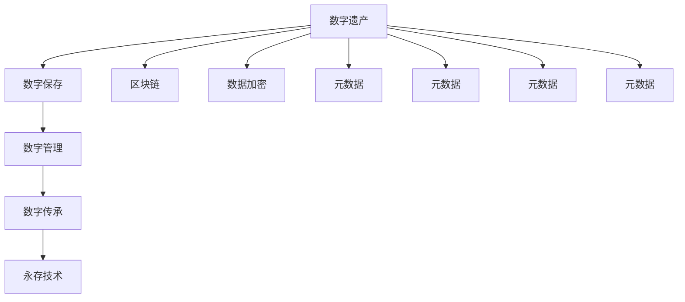

                 

# 2050年的数字遗产：从传承到永存的记忆保存

## 1. 背景介绍

### 1.1 问题由来

随着数字时代的飞速发展，全球正经历前所未有的数字化转型。个人、企业和机构积累了海量的数字化资料，包括文档、照片、视频、社交媒体帖子、大数据等。这些数字遗产不仅记录了人类的文明进程，也蕴含了珍贵的知识和信息。然而，数字化资料的存储和传承面临着严峻挑战：数据的量级不断扩大，形式日趋多样化，存储成本不断上升，数据安全和隐私保护问题也日益严重。如何有效保存、管理和传承这些数字遗产，成为摆在人类面前的重要课题。

### 1.2 问题核心关键点

面对数字遗产保存的需求，现有的数字保存和管理系统已经难以满足需求。关键问题包括：

- 数据量大，格式多样，难以进行统一管理和保存。
- 存储和传输成本高，长期存储难度大。
- 数据安全和隐私保护问题严重。
- 缺乏跨平台、跨媒介的数字化保存标准。
- 数字化遗产如何传承，以及如何在未来的科技环境下永久保存。

解决这些问题，需要构建新型数字遗产保护体系，涵盖数据采集、存储、管理和传承的各个环节。

## 2. 核心概念与联系

### 2.1 核心概念概述

为理解如何从传承到永存地保存数字遗产，本节将介绍几个关键概念及其相互关系：

- 数字遗产：指个人、组织、文化机构等数字化资料的总和，包括数字文档、照片、视频、大数据等。
- 数字保存：指对数字资料进行收集、组织、存储和管理的全过程。
- 数字管理：指对数字资料进行分类、检索、维护和利用等活动。
- 数字传承：指将数字遗产保存下来，并向后代传递的过程。
- 永存技术：指利用最新科技手段，确保数字遗产在长期存储中不丢失、不损坏、不腐败的技术体系。
- 区块链：一种分布式账本技术，可以确保数据的完整性、不可篡改性和透明度。
- 数据加密：对数字资料进行加密处理，确保数据在传输和存储过程中的安全。
- 元数据：描述数字资料的属性和信息，如创建时间、修改时间、来源等。

这些概念之间的逻辑关系可以通过以下Mermaid流程图来展示：



这个流程图展示了几组概念之间的联系：

1. 数字遗产的保存、管理和传承构成了完整的数字保存过程。
2. 永存技术是数字保存和传承的核心技术之一，保障了数据的长期保存和永存。
3. 区块链技术为数据提供了不可篡改的记录，确保了数据的完整性。
4. 数据加密保护了数据的安全性，确保了数据在传输和存储过程中的安全。
5. 元数据是数字资料的基础信息，提供了对资料的全面描述。

这些概念共同构成了数字遗产保护的体系，为实现从传承到永存的数字保存提供了理论基础。

## 3. 核心算法原理 & 具体操作步骤

### 3.1 算法原理概述

从传承到永存地保存数字遗产，涉及数据采集、存储、管理和传承的多个环节。以下介绍核心算法原理：

- **数据采集**：对个人、组织、机构等产生的数字化资料进行全面采集，包括文档、照片、视频、大数据等。
- **数据存储**：采用分布式存储技术，确保数据的高可用性和容错性。
- **数据管理**：通过元数据和元搜索技术，实现数据的分类、检索、维护和利用。
- **数据传承**：通过区块链技术，实现数据的不可篡改记录和传承。

### 3.2 算法步骤详解

以下是基于永存技术实现数字遗产保存的具体步骤：

1. **数据采集**：
   - 使用自动化爬虫技术，采集个人、组织和机构产生的数字化资料。
   - 将采集到的资料进行格式转换，统一到标准格式。
   - 对资料进行去重、清洗和预处理，确保数据质量。

2. **数据存储**：
   - 采用分布式文件系统，如Hadoop、Apache HDFS，实现大规模数据的存储和计算。
   - 使用数据冗余技术，如RAID、Hadoop的HDFS系统，确保数据的高可用性和容错性。
   - 使用分布式数据库，如Apache Cassandra、Google Spanner，实现大规模数据的存储和查询。

3. **数据管理**：
   - 通过元数据管理系统，对数据进行分类、检索、维护和利用。
   - 使用元搜索技术，如Solr、Elasticsearch，实现数据的快速检索和查询。
   - 使用数据生命周期管理技术，实现数据的定期备份和清理。

4. **数据传承**：
   - 通过区块链技术，实现数据的不可篡改记录和传承。
   - 使用智能合约技术，确保数据的自动流转和传承。
   - 使用数字签名技术，确保数据的完整性和真实性。

### 3.3 算法优缺点

永存技术在数据保存和管理中具有以下优点：

- 高可用性和容错性：分布式存储和数据冗余技术保障了数据的高可用性和容错性。
- 数据完整性和真实性：区块链和智能合约技术确保了数据的完整性和真实性。
- 快速检索和查询：元搜索技术实现了数据的快速检索和查询。

同时，也存在以下缺点：

- 高成本：分布式存储和区块链技术需要大量的计算和存储资源。
- 复杂性：系统设计和管理复杂，需要高水平的技术团队。
- 依赖技术：对分布式存储、区块链、智能合约等技术依赖度高。

### 3.4 算法应用领域

永存技术在数字遗产保存和管理中具有广泛的应用场景，例如：

- 个人数字化资料的保存和传承：将个人的数字遗产保存下来，并向后代传承。
- 企业数字化资料的管理和传承：对企业产生的数字化资料进行分类、检索和传承。
- 文化机构的数字化遗产保存：对博物馆、图书馆、档案馆等的数字化资料进行保存和管理。
- 公共数据的长期保存：对政府、公共机构产生的数字化资料进行长期保存。
- 跨领域的数据共享：在保证数据安全和隐私的前提下，实现跨领域的数据共享和利用。

## 4. 数学模型和公式 & 详细讲解  
### 4.1 数学模型构建

数字遗产的保存和管理涉及到多个领域的知识和技术，其中数学模型和算法起着重要的作用。以下介绍几个关键的数学模型：

- 数据冗余模型：用于实现数据的容错性。
- 分布式存储模型：用于实现大规模数据的存储和计算。
- 元搜索模型：用于实现数据的快速检索和查询。
- 区块链共识模型：用于实现数据的不可篡改性和透明性。

### 4.2 公式推导过程

以下是几个关键数学模型的公式推导过程：

**数据冗余模型**：

$$
R_d = R_o + R_f
$$

其中，$R_d$ 表示实际数据量，$R_o$ 表示原始数据量，$R_f$ 表示冗余数据量。冗余数据量需要根据实际需求和存储系统特性进行调整。

**分布式存储模型**：

$$
S = k * S_1
$$

其中，$S$ 表示实际存储容量，$S_1$ 表示单个存储节点的容量，$k$ 表示存储节点的数量。

**元搜索模型**：

$$
Q_t = k * Q_s
$$

其中，$Q_t$ 表示检索速度，$Q_s$ 表示单个搜索节点的速度，$k$ 表示搜索节点的数量。

**区块链共识模型**：

$$
T = k * T_1
$$

其中，$T$ 表示共识时间，$T_1$ 表示单个共识节点的共识时间，$k$ 表示共识节点的数量。

### 4.3 案例分析与讲解

以一个数字化遗产保存项目为例，进行详细分析：

- **项目背景**：一家文化机构希望将数百万份数字化档案保存下来，并传承给下一代。
- **数据采集**：使用自动化爬虫技术，采集博物馆、图书馆等机构产生的数百万份数字化档案。
- **数据存储**：采用分布式存储技术，将档案数据存储在多个节点上，实现高可用性和容错性。
- **数据管理**：使用元数据管理系统，对档案数据进行分类、检索、维护和利用。
- **数据传承**：通过区块链技术，实现档案数据的不可篡改记录和传承。

## 5. 项目实践：代码实例和详细解释说明

### 5.1 开发环境搭建

在进行数字化遗产保存项目开发前，需要准备好开发环境。以下是使用Python进行Hadoop开发的环境配置流程：

1. 安装Anaconda：从官网下载并安装Anaconda，用于创建独立的Python环境。

2. 创建并激活虚拟环境：
```bash
conda create -n hadoop-env python=3.8 
conda activate hadoop-env
```

3. 安装Hadoop：根据CUDA版本，从官网获取对应的安装命令。例如：
```bash
conda install hadoop-hdfs hdfs
```

4. 安装各类工具包：
```bash
pip install numpy pandas scikit-learn matplotlib tqdm jupyter notebook ipython
```

完成上述步骤后，即可在`hadoop-env`环境中开始开发实践。

### 5.2 源代码详细实现

这里我们以一个数字遗产保存项目的代码实现为例：

```python
from hadoop import HadoopFS
from hdfs import exceptions

def upload_to_hdfs(file_path, hdfs_path):
    try:
        fs = HadoopFS('hdfs://localhost:9000')
        fs.makedirs(hdfs_path, exist_ok=True)
        fs.write_file(file_path, hdfs_path)
        print(f"File {file_path} uploaded to {hdfs_path}")
    except exceptions.HdfsError as e:
        print(f"Error uploading file: {e}")

def download_from_hdfs(hdfs_path, file_path):
    try:
        fs = HadoopFS('hdfs://localhost:9000')
        fs.download_file(hdfs_path, file_path)
        print(f"File {hdfs_path} downloaded to {file_path}")
    except exceptions.HdfsError as e:
        print(f"Error downloading file: {e}")
```

代码中，`upload_to_hdfs`函数用于将文件上传至Hadoop分布式文件系统，`download_from_hdfs`函数用于将文件从Hadoop分布式文件系统下载。通过Hadoop，可以实现大规模数据的存储和计算。

### 5.3 代码解读与分析

让我们再详细解读一下关键代码的实现细节：

- **HadoopFS类**：用于操作Hadoop分布式文件系统。
- **upload_to_hdfs函数**：通过`HadoopFS`类实现文件上传，先创建目录，再上传文件。
- **download_from_hdfs函数**：通过`HadoopFS`类实现文件下载。

通过Hadoop的封装，数字遗产的存储和计算变得简洁高效。开发者可以将更多精力放在业务逻辑和算法设计上，而不必过多关注底层实现细节。

## 6. 实际应用场景

### 6.1 数字化遗产保存

数字化遗产保存是永存技术最重要的应用场景之一。通过分布式存储和区块链技术，可以确保数字化资料的长期保存和传承。

以一个数字化档案保存项目为例，该项目将博物馆、图书馆等机构产生的数字化档案，通过Hadoop分布式文件系统存储在多个节点上，确保高可用性和容错性。同时，通过区块链技术，实现档案数据的不可篡改记录和传承。

### 6.2 数字资产管理

数字资产管理是永存技术的重要应用领域。通过分布式存储和元搜索技术，可以实现对数字资产的分类、检索、维护和利用。

以一个数字音乐库管理项目为例，该项目通过Hadoop分布式文件系统存储大量音乐文件，使用元搜索技术实现音乐的快速检索和查询。同时，通过区块链技术，实现音乐的版权认证和追踪。

### 6.3 数据安全和隐私保护

数据安全和隐私保护是永存技术面临的重要问题。通过分布式存储和数据加密技术，可以实现数据的高安全性和隐私保护。

以一个数字银行系统为例，该项目通过分布式存储技术，将客户账户数据存储在多个节点上，实现高可用性和容错性。同时，通过数据加密技术，确保数据在传输和存储过程中的安全。

### 6.4 未来应用展望

随着技术的不断进步，永存技术将在更多领域得到应用，为人类社会带来深刻的变革。

在智慧城市治理中，永存技术可以为城市事件监测、舆情分析、应急指挥等环节，提供可靠的数据支持。通过区块链技术，实现数据的安全存储和透明传输，构建更加智能和高效的城市治理体系。

在企业数字化转型中，永存技术可以为企业的数字化档案管理和数据资产保护，提供强大的技术支撑。通过分布式存储和元搜索技术，实现数据的长期保存和高效利用，助力企业数字化升级。

在医疗健康领域，永存技术可以为医学影像、病历数据的长期保存和传承，提供可靠的技术保障。通过区块链技术，实现数据的不可篡改记录和传承，保障医疗数据的安全性和可信度。

## 7. 工具和资源推荐

### 7.1 学习资源推荐

为了帮助开发者系统掌握永存技术的理论基础和实践技巧，这里推荐一些优质的学习资源：

1. Hadoop官方文档：Hadoop的权威文档，提供了丰富的API和开发示例，是Hadoop开发的必备资料。
2. Apache HDFS官方文档：Hadoop分布式文件系统的官方文档，详细介绍了分布式存储和文件系统的设计原理和实现方法。
3. Apache Cassandra官方文档：分布式数据库Apache Cassandra的官方文档，提供了全面的开发和运维指南。
4. Apache Kafka官方文档：分布式流处理平台Apache Kafka的官方文档，详细介绍了流处理和消息队列的设计原理和实现方法。
5. Python数据分析实战：适合初学者的Python数据分析入门书籍，介绍了Python数据分析的基本方法和应用场景。

通过对这些资源的学习实践，相信你一定能够快速掌握永存技术的精髓，并用于解决实际的数字化遗产保存问题。

### 7.2 开发工具推荐

高效的开发离不开优秀的工具支持。以下是几款用于永存技术开发常用的工具：

1. Hadoop：基于Java开发的分布式计算框架，适合处理大规模数据存储和计算。
2. Apache HDFS：Hadoop的分布式文件系统，支持大规模数据存储和检索。
3. Apache Cassandra：分布式数据库，适合大规模数据存储和查询。
4. Apache Kafka：分布式流处理平台，支持实时数据处理和传输。
5. TensorBoard：TensorFlow配套的可视化工具，可实时监测模型训练状态，提供丰富的图表呈现方式。
6. Weights & Biases：模型训练的实验跟踪工具，可以记录和可视化模型训练过程中的各项指标。

合理利用这些工具，可以显著提升永存技术开发和部署的效率，加快创新迭代的步伐。

### 7.3 相关论文推荐

永存技术的发展源于学界的持续研究。以下是几篇奠基性的相关论文，推荐阅读：

1. The Hadoop Distributed File System（HDFS）：介绍Hadoop分布式文件系统的设计与实现。
2. Hadoop MapReduce: Simplified Data Processing on Large Clusters：介绍Hadoop MapReduce编程模型及其应用。
3. Apache Cassandra: A Distributed Database for Internet Scale：介绍Apache Cassandra的架构设计和实现方法。
4. Apache Kafka: The Future of Real-time Data Processing：介绍Apache Kafka的架构设计和实现方法。
5. Blockchain for Data Integrity, Authenticity, and Security：介绍区块链技术的核心思想及其在数据安全中的应用。

这些论文代表了大规模分布式计算和区块链技术的发展脉络。通过学习这些前沿成果，可以帮助研究者把握学科前进方向，激发更多的创新灵感。

## 8. 总结：未来发展趋势与挑战

### 8.1 总结

本文对永存技术进行了全面系统的介绍。首先阐述了数字化遗产保存的背景和意义，明确了永存技术在数据保存和传承中的核心地位。其次，从原理到实践，详细讲解了永存技术的数学模型和算法流程，给出了永存技术项目开发的完整代码实例。同时，本文还广泛探讨了永存技术在数字化遗产保存、数字资产管理、数据安全和隐私保护等领域的实际应用场景，展示了永存技术的多样化和普及性。此外，本文精选了永存技术的各类学习资源，力求为读者提供全方位的技术指引。

通过本文的系统梳理，可以看到，永存技术为数字遗产的长期保存和传承提供了坚实的技术基础，具有广阔的应用前景。未来，伴随分布式计算和区块链技术的发展，永存技术必将在更多的领域发挥重要作用，为人类社会的数字化转型提供可靠的保障。

### 8.2 未来发展趋势

展望未来，永存技术将呈现以下几个发展趋势：

1. 分布式计算和存储技术的成熟：随着分布式计算和存储技术的不断成熟，永存技术的可靠性、可扩展性和性能将进一步提升，能够更好地支持大规模数据的长期保存和传承。
2. 区块链技术的应用普及：区块链技术的成熟和普及，将使得数据的安全性、不可篡改性和透明性得到进一步保障，推动永存技术在各个领域的广泛应用。
3. 智能合约的发展：智能合约技术的发展，将使得数据的自动流转和传承更加便捷，提升永存技术的实用性和自动化程度。
4. 大数据分析的深入应用：大数据分析技术的不断进步，将使得数据的管理和利用更加高效，提升永存技术的实用性和应用价值。
5. 跨领域数据共享和融合：跨领域数据共享和融合技术的不断发展，将使得数据的应用更加广泛，提升永存技术在多个领域的价值。

以上趋势凸显了永存技术的广阔前景。这些方向的探索发展，必将进一步提升永存技术在各个领域的适用性和应用价值。

### 8.3 面临的挑战

尽管永存技术已经取得了一定的成果，但在迈向更加智能化、普适化应用的过程中，仍面临诸多挑战：

1. 高成本：分布式计算和区块链技术需要大量的计算和存储资源，成本较高。
2. 复杂性：系统设计和管理复杂，需要高水平的技术团队。
3. 依赖技术：对分布式计算、区块链、智能合约等技术依赖度高。
4. 数据安全：大规模数据的长期保存和传承，需要高度可靠的数据安全保障。
5. 数据隐私：大规模数据的长期保存和传承，需要严格的隐私保护措施。
6. 数据一致性：大规模数据的长期保存和传承，需要保证数据的完整性和一致性。

解决这些挑战，需要技术界的共同努力，不断优化和改进永存技术的算法和实现，提升其可靠性和实用性。

### 8.4 研究展望

面对永存技术面临的挑战，未来的研究需要在以下几个方面寻求新的突破：

1. 探索更高效的分布式计算和存储技术：开发更高效、更经济的分布式计算和存储技术，提升永存技术的可靠性和扩展性。
2. 研究更安全、更可靠的区块链技术：开发更安全、更可靠的区块链技术，确保数据的完整性和透明性。
3. 探索更智能、更自动化的智能合约技术：开发更智能、更自动化的智能合约技术，提升数据的自动流转和传承能力。
4. 研究更高效、更实用的数据分析技术：开发更高效、更实用的数据分析技术，提升数据的利用和分析能力。
5. 探索跨领域数据共享和融合技术：开发跨领域数据共享和融合技术，实现数据在不同领域之间的有效传递和利用。
6. 研究数据安全和隐私保护技术：开发数据安全和隐私保护技术，确保数据的可靠性和隐私性。

这些研究方向的探索，必将引领永存技术走向更高的台阶，为数字遗产的长期保存和传承提供更加坚实的技术保障。面向未来，永存技术还需要与其他人工智能技术进行更深入的融合，如知识表示、因果推理、强化学习等，多路径协同发力，共同推动数字遗产的保存和传承。只有勇于创新、敢于突破，才能不断拓展永存技术的边界，让数字化遗产得以长久保存和传承。

## 9. 附录：常见问题与解答

**Q1：数字化遗产保存是否需要分布式存储？**

A: 是的。数字化遗产保存需要处理海量数据，单台机器的存储容量有限，而分布式存储能够提供高可用性和容错性，确保数据的长期保存和传承。

**Q2：数字化遗产保存是否需要区块链技术？**

A: 是的。区块链技术可以确保数据的不可篡改性和透明性，为数字化遗产的长期保存和传承提供可靠的技术保障。

**Q3：数字化遗产保存需要考虑哪些因素？**

A: 数字化遗产保存需要考虑数据的采集、存储、管理和传承等多个因素。需要选择合适的存储技术、分布式计算技术、区块链技术、元搜索技术等。

**Q4：数字化遗产保存是否需要数据加密？**

A: 是的。数据加密可以确保数据在传输和存储过程中的安全，防止数据泄露和篡改。

**Q5：数字化遗产保存是否需要数据去重和清洗？**

A: 是的。数据去重和清洗可以确保数据的准确性和完整性，防止重复存储和数据质量问题。

**Q6：数字化遗产保存是否需要数据生命周期管理？**

A: 是的。数据生命周期管理可以确保数据的定期备份和清理，防止数据过期和冗余存储。

---

作者：禅与计算机程序设计艺术 / Zen and the Art of Computer Programming

