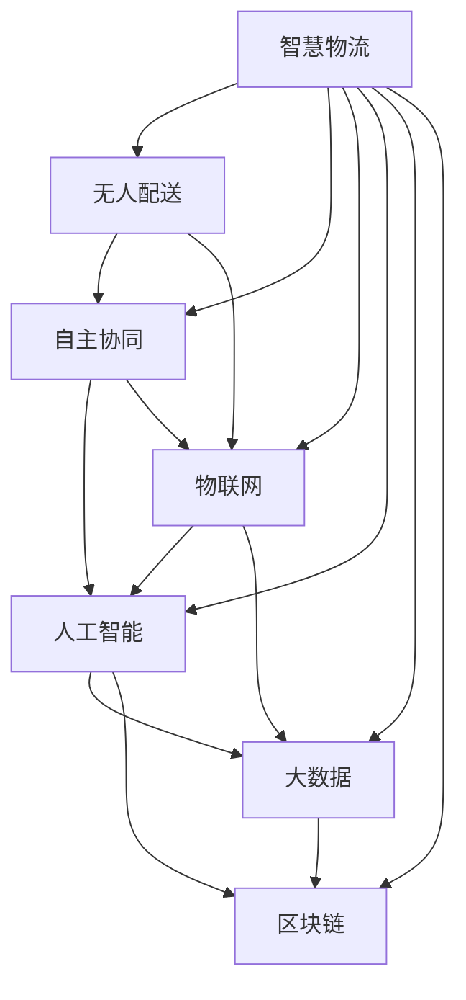

                 

# 2050年的智慧物流：从无人配送到自主协同的智慧供应链

> 关键词：智慧物流,无人配送,自主协同,供应链管理,物联网,人工智能,大数据,区块链

## 1. 背景介绍

### 1.1 问题由来

随着科技的进步和电商的迅猛发展，全球物流行业面临着前所未有的挑战与机遇。一方面，货物运输需求急剧增加，配送环节的压力倍增；另一方面，消费者对物流服务的时效性和个性化需求日益强烈，要求物流企业能够提供更加精准、灵活的定制化服务。

物流行业传统的运作模式已无法满足日益增长的需求，亟需一场新的变革。大数据、物联网、人工智能等前沿技术的应用，为智慧物流的实现提供了新的契机。与此同时，物流供应链的复杂性和不确定性也在增加，如何实现各环节的自主协同，构建稳定高效的智慧供应链，成为未来物流发展的关键问题。

### 1.2 问题核心关键点

智慧物流的核心在于通过智能技术提升物流效率，降低运营成本，实现更高的供应链协同与透明度。在这一过程中，无人配送、自主协同等新兴技术的应用尤为关键。无人配送通过自动化、智能化设备提升配送效率，减少人力成本。自主协同则通过先进的决策算法和通信技术，实现各环节的自动化交互，提升供应链的整体协同效率。

本文将深入探讨智慧物流的实现路径，尤其是在无人配送和自主协同方面的前沿技术及其应用场景。通过系统性的介绍，希望能为物流企业及决策者提供有价值的参考。

## 2. 核心概念与联系

### 2.1 核心概念概述

为更好地理解智慧物流的内涵，本节将介绍几个紧密相关的核心概念：

- **智慧物流(Wisdom Logistics)**：利用先进的信息技术、物联网技术、人工智能技术等，实现物流系统的智能化、自动化、透明化，提升物流效率，降低运营成本，实现供应链的自主协同。

- **无人配送(UAV and Robot Delivery)**：使用无人机、无人车、自动化分拣系统等技术，实现货物的自动配送。

- **自主协同(Autonomous Collaboration)**：通过算法和通信技术，实现物流各环节的自主交互和协作，提升供应链的整体效率。

- **物联网(IoT)**：通过传感器、标签等设备，实时收集和传输物流环节的信息数据，实现对物流全过程的监控和控制。

- **人工智能(AI)**：通过机器学习、深度学习等技术，提升物流决策的智能性和准确性。

- **大数据(Big Data)**：通过对海量物流数据的分析，揭示物流运营规律，为决策提供数据支持。

- **区块链(Blockchain)**：通过分布式账本技术，提升物流数据的安全性和透明性，防止篡改和欺诈。

这些核心概念之间的逻辑关系可以通过以下Mermaid流程图来展示：



这个流程图展示了智慧物流涉及的主要技术方向及其相互关系。

## 3. 核心算法原理 & 具体操作步骤

### 3.1 算法原理概述

智慧物流的核心算法原理包括以下几个方面：

- **路径规划算法**：通过算法计算最优的货物配送路径，以减少运输时间和成本。
- **需求预测算法**：通过数据分析预测未来货物的需求量，从而优化库存管理和运输计划。
- **异常检测算法**：实时监控物流环节的异常情况，及时采取措施，避免延误和损失。
- **自主协同算法**：通过算法实现各物流环节的自动交互和协作，提升供应链的整体效率。

这些算法通常基于机器学习、深度学习、强化学习等技术，在收集、处理物流数据后进行训练，优化模型参数，最终应用于物流系统的各个环节。

### 3.2 算法步骤详解

智慧物流的算法步骤一般包括：

**Step 1: 数据收集与预处理**

- 通过传感器、RFID标签等设备，实时收集物流环节的数据，如位置信息、货物状态、车辆状况等。
- 对数据进行清洗、过滤、归一化等预处理，确保数据质量。

**Step 2: 数据存储与分析**

- 使用数据库系统存储物流数据，支持数据的快速查询和更新。
- 利用大数据技术进行数据挖掘和分析，揭示物流运营规律，提供决策支持。

**Step 3: 算法模型训练**

- 选择合适的算法，构建模型。如路径规划算法、需求预测算法等。
- 在历史数据上训练模型，调整模型参数，以优化预测准确性和效率。

**Step 4: 模型部署与应用**

- 将训练好的模型部署到实际物流系统中，进行实时数据处理和决策。
- 实时监控模型性能，根据反馈调整模型参数，持续优化模型效果。

### 3.3 算法优缺点

智慧物流的算法具有以下优点：

- **效率提升**：通过算法优化路径规划和运输计划，显著提升物流效率，减少时间和成本。
- **决策支持**：数据分析和算法模型为物流决策提供数据支持，提升决策的科学性和准确性。
- **自主协同**：自主协同算法实现各物流环节的自动交互和协作，提升供应链的整体效率。

同时，也存在一些局限性：

- **算法复杂度**：复杂的算法模型需要大量的计算资源和时间，难以在实时环境中应用。
- **数据质量**：数据收集和处理的质量直接影响算法的性能，需要高质量的数据支持。
- **模型更新**：物流运营环境和需求不断变化，需要定期更新和优化算法模型。

### 3.4 算法应用领域

智慧物流的算法广泛应用于多个领域：

- **快递物流**：通过路径规划算法，优化快递包裹的配送路径，提升配送效率。
- **仓储管理**：利用需求预测算法，优化库存管理，减少库存成本。
- **物流监控**：通过异常检测算法，实时监控物流环节的异常情况，及时处理问题。
- **货物追踪**：通过物联网设备，实时追踪货物位置，提高货物安全性。

这些应用场景展示了智慧物流算法的多样性和实用性，为物流行业的数字化转型提供了新的动力。

## 4. 数学模型和公式 & 详细讲解

### 4.1 数学模型构建

智慧物流的数学模型通常包括以下几个部分：

- **路径规划模型**：描述货物配送路径的最优解，如最小时间路径、最小成本路径等。
- **需求预测模型**：描述未来需求量的预测方法，如时间序列分析、回归分析等。
- **异常检测模型**：描述物流环节异常情况的检测方法，如基于统计学的方法、基于机器学习的方法等。

以路径规划为例，一个常见的数学模型为：

$$
P = \arg\min_{i\in I} \sum_{k=1}^n d_{ik}
$$

其中 $P$ 为路径集合，$i$ 为起点，$k$ 为中间节点，$d_{ik}$ 为节点间的距离。

### 4.2 公式推导过程

路径规划模型的推导过程如下：

- **步骤1: 构建图模型**：将物流路线转化为图结构，节点为地点，边为距离。
- **步骤2: 计算路径长度**：对每条路径计算总长度。
- **步骤3: 选择最优路径**：根据总长度选择最优路径。

需求预测模型和异常检测模型也有类似的过程。通过数学建模，将物流运营规律和异常情况转化为可计算的数学表达式，进而为算法训练提供数据基础。

### 4.3 案例分析与讲解

以路径规划为例，假设物流公司有多个仓库和配送中心，需要选择最优的货物配送路径。通过路径规划算法，可以优化路径长度，减少运输时间和成本。例如：

1. **图结构构建**：
   - 创建图结构，节点为各仓库和配送中心，边为两点间的距离。
   - 每个节点存储相关信息，如仓库容量、配送中心位置等。

2. **路径生成**：
   - 使用Dijkstra算法或A*算法生成从仓库到配送中心的路径。
   - 计算每条路径的总长度。

3. **路径选择**：
   - 选择总长度最短的一条路径。
   - 生成配送计划，并执行路径规划。

通过以上步骤，物流公司可以优化配送路径，降低成本，提升配送效率。

## 5. 项目实践：代码实例和详细解释说明

### 5.1 开发环境搭建

进行智慧物流项目开发时，需要搭建一个包含数据收集、处理、存储、分析以及算法训练和部署的完整系统。以下是一般的开发环境配置流程：

1. 安装Python：Python是智慧物流开发的主要编程语言，需要搭建Python环境。

2. 安装数据库系统：如MySQL、MongoDB等，用于存储和管理物流数据。

3. 安装大数据平台：如Hadoop、Spark等，用于处理和分析大规模数据。

4. 安装机器学习框架：如TensorFlow、PyTorch等，用于算法模型训练。

5. 安装容器化工具：如Docker、Kubernetes等，用于系统部署和容器化管理。

6. 安装可视化工具：如Jupyter Notebook、Tableau等，用于数据可视化和模型评估。

### 5.2 源代码详细实现

以下是一个简单的路径规划算法实现，用于演示无人配送的路径规划过程：

```python
import networkx as nx
import numpy as np

# 定义节点和边
G = nx.DiGraph()
G.add_edge('仓库1', '配送中心1', weight=10)
G.add_edge('仓库1', '配送中心2', weight=15)
G.add_edge('配送中心1', '配送中心2', weight=5)
G.add_edge('配送中心1', '最终地点1', weight=3)
G.add_edge('配送中心2', '最终地点2', weight=4)

# 定义距离矩阵
distance_matrix = np.array([[0, 10, 15, 5, 3],
                           [0, 0, 5, 0, 0],
                           [0, 0, 0, 0, 4],
                           [0, 0, 0, 0, 0],
                           [0, 0, 0, 0, 0]])

# 计算最短路径
shortest_path = nx.shortest_path(G, '仓库1', '最终地点2', weight='weight')
print(shortest_path)
```

### 5.3 代码解读与分析

**代码解析**：
- 使用networkx库创建图结构，表示物流路径。
- 定义距离矩阵，表示各节点间的距离。
- 使用nx.shortest_path函数计算最短路径。

**结果展示**：
- 输出结果为路径序列，如['仓库1', '配送中心1', '配送中心2', '最终地点2']，表示从仓库1到最终地点2的最短路径。

### 5.4 运行结果展示

运行上述代码，可以得到从仓库1到最终地点2的最短路径，为物流公司提供了最优的配送方案。

## 6. 实际应用场景

### 6.1 智能仓库管理

智能仓库通过物联网设备和传感器，实时监测货物状态、位置等信息，并通过算法实现库存管理和货物配送。

**应用场景**：
- 使用RFID标签实时追踪货物位置，确保货物安全。
- 使用机器视觉检测货物质量，及时发现异常。
- 使用路径规划算法优化货物配送路径，减少运输时间和成本。

**技术实现**：
- 通过物联网设备收集货物信息。
- 使用传感器监测仓库环境，如温度、湿度等。
- 利用机器学习算法预测货物需求量，优化库存管理。

### 6.2 无人驾驶配送

无人驾驶技术结合了人工智能和物联网技术，可以实现无人配送车、无人机的自动化运输。

**应用场景**：
- 在城市道路中，无人配送车自动行驶并完成货物配送。
- 在偏远地区，无人机自动飞行并投递包裹。

**技术实现**：
- 使用高精度地图和定位系统，实现无人车的精准定位。
- 利用激光雷达、摄像头等传感器，实时感知周围环境。
- 使用路径规划算法，规划最优配送路径。

### 6.3 供应链管理

智慧供应链通过算法和通信技术，实现各环节的自主协同，提升供应链的整体效率。

**应用场景**：
- 供应链中的各节点（如供应商、制造商、零售商）通过网络协同工作。
- 实时监控供应链中的异常情况，及时采取措施。

**技术实现**：
- 使用区块链技术，记录供应链中的所有交易信息。
- 利用大数据分析，预测供应链需求变化。
- 使用异常检测算法，实时监控供应链异常情况。

## 7. 工具和资源推荐

### 7.1 学习资源推荐

为了帮助开发者系统掌握智慧物流的理论基础和实践技巧，这里推荐一些优质的学习资源：

1. **《智能物流技术与应用》**：系统介绍了智慧物流的各类技术，包括物联网、大数据、人工智能等。
2. **《无人驾驶技术及其应用》**：详细介绍无人驾驶技术的基本原理和应用场景。
3. **《供应链管理与优化》**：讲解了供应链管理的核心概念和优化方法。
4. **《区块链技术与智慧物流》**：探讨了区块链技术在物流中的应用和优势。

### 7.2 开发工具推荐

高效的开发离不开优秀的工具支持。以下是几款用于智慧物流开发的常用工具：

1. **Python**：Python是智慧物流开发的主要编程语言，具有强大的数据处理和机器学习能力。
2. **TensorFlow**：Google开发的深度学习框架，支持大规模分布式计算，适用于智慧物流中复杂算法的训练和部署。
3. **Hadoop**：Apache开发的分布式计算平台，适用于大规模数据的存储和处理。
4. **Jupyter Notebook**：支持Python代码的交互式执行和数据可视化，方便开发者进行算法实验和调试。
5. **Docker**：Docker容器化技术，方便开发者部署和管理智慧物流系统。

### 7.3 相关论文推荐

智慧物流领域的研究近年来取得了长足进展，以下是几篇奠基性的相关论文，推荐阅读：

1. **《路径规划算法综述》**：系统总结了各种路径规划算法，包括Dijkstra、A*、遗传算法等。
2. **《基于物联网的智能仓库管理》**：探讨了物联网技术在智能仓库中的应用。
3. **《无人驾驶配送系统研究》**：详细介绍了无人驾驶配送系统的实现方法和技术挑战。
4. **《区块链在智慧供应链中的应用》**：探讨了区块链技术在供应链中的应用，提升供应链透明度和安全性。

## 8. 总结：未来发展趋势与挑战

### 8.1 研究成果总结

智慧物流技术的发展，极大地提升了物流行业的效率和可靠性。通过物联网、人工智能、区块链等前沿技术的融合应用，物流行业实现了数字化、智能化、透明化，为供应链的自主协同奠定了坚实的基础。

### 8.2 未来发展趋势

展望未来，智慧物流将呈现以下几个发展趋势：

1. **自动化与智能化**：自动化设备和智能化算法将进一步提升物流效率，减少人力成本。
2. **数据驱动决策**：基于大数据分析的决策将更加科学和精准，优化供应链管理。
3. **多模态融合**：物流系统将融合多种技术，如物联网、人工智能、大数据等，实现更全面的智能管理。
4. **透明化与安全性**：通过区块链技术，提升物流数据的透明性和安全性，防止数据篡改和欺诈。

### 8.3 面临的挑战

尽管智慧物流技术取得了显著进展，但在实现全流程自动化和智能化方面仍面临诸多挑战：

1. **技术成熟度**：一些关键技术如无人驾驶、智能仓库等仍需进一步成熟，才能大规模应用。
2. **数据隐私与安全**：物联网设备的广泛应用带来了数据隐私和安全问题，需要制定相应的标准和政策。
3. **跨平台集成**：不同系统之间的兼容性和互操作性需进一步提升，实现无缝集成。

### 8.4 研究展望

未来的智慧物流研究需要在以下几个方向进行深入探索：

1. **技术融合创新**：探索将人工智能、大数据、物联网等技术进行融合，提升物流系统的智能性和稳定性。
2. **数据隐私保护**：研究如何保护物流数据的隐私和安全，防止数据泄露和滥用。
3. **多模态融合**：推动多模态数据融合技术的发展，提升物流系统的感知和决策能力。
4. **自主协同优化**：研究自主协同算法，实现物流各环节的自动交互和协作，提升供应链的整体效率。

## 9. 附录：常见问题与解答

**Q1：智慧物流的主要技术方向有哪些？**

A: 智慧物流的主要技术方向包括物联网、大数据、人工智能、区块链等，这些技术的融合应用，为物流行业的数字化转型提供了新的动力。

**Q2：无人配送技术面临哪些技术挑战？**

A: 无人配送技术面临的技术挑战包括高精度定位、环境感知、路径规划、安全性等。解决这些挑战需要多学科的协同合作，如自动化、计算机视觉、机器学习等。

**Q3：如何提升智慧物流系统的安全性？**

A: 提升智慧物流系统的安全性，需要从数据安全、系统安全两个方面进行。具体措施包括数据加密、访问控制、异常检测等，确保物流数据的安全性和系统的稳定运行。

**Q4：智慧物流的发展前景如何？**

A: 智慧物流的发展前景广阔，未来将实现全流程自动化和智能化，大幅提升物流效率和可靠性。同时，智慧物流将成为推动全球物流行业数字化转型的重要力量。

---

作者：禅与计算机程序设计艺术 / Zen and the Art of Computer Programming

