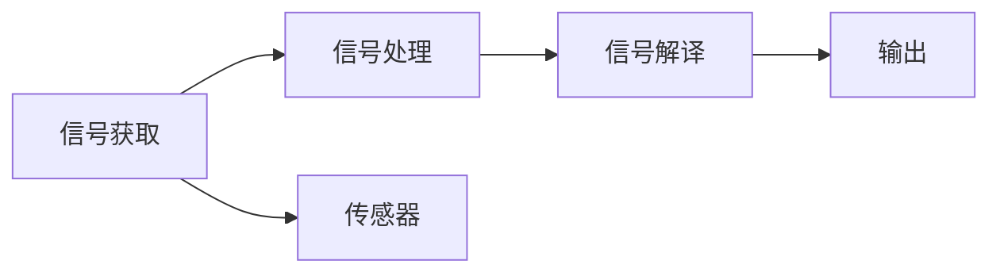

                 

## 1. 背景介绍

脑机接口(Brain-Computer Interface, BCI)是指一种技术手段，通过电信号、光学信号等手段将人脑与计算机系统进行连接，实现人机互动。这一技术自20世纪60年代以来，经历了多个阶段的发展，从最初的直接脑电信号解译，到近期的神经网络编码，已经取得了显著的进展。预计到2050年，脑机接口将进入一个全新的发展阶段，不仅在医疗领域将发挥重要作用，更将拓展到增强人类认知、情感等高级功能，为人类社会带来深刻变革。

### 1.1 脑机接口的起源与发展

脑机接口技术起源于对残疾人康复的探索。1959年，Spencer K. Moore首次提出BCI概念，通过神经信号解码，使身患脊髓灰质炎的病人可以通过头皮电极控制一台打字机。随后的几十年里，BCI研究者们逐步发展出多种信号解译方法，如基于空间滤波、基于时间序列分析、基于机器学习等。

### 1.2 技术突破与应用场景

21世纪初，随着计算能力的提升和神经科学的进步，BCI进入快速发展阶段。特别是近十年来，深度学习技术被引入，使得BCI信号解译的准确性大幅提升。同时，BCI技术的应用场景也从单一的康复领域，扩展到游戏、娱乐、人机交互等多个方面。

## 2. 核心概念与联系

### 2.1 核心概念概述

脑机接口由“脑”、“机”和“接口”三部分组成：

- **脑**：指人脑发出的神经信号，包括脑电信号(EEG)、功能性磁共振成像(fMRI)信号、神经元放电信号等。
- **机**：指计算机系统，包括硬件和软件两部分。硬件包括传感器、信号采集、信号处理等组件；软件包括数据处理算法、信号解译模型等。
- **接口**：指连接“脑”和“机”的中间环节，包括信号采集、信号预处理、信号解译等。

### 2.2 核心概念联系

脑机接口技术将人脑信号与计算机系统进行交互，涵盖了信号获取、信号处理、信号解译等多个环节，如图1所示。



图1：脑机接口核心概念联系

在实际应用中，不同阶段的信号处理、解译算法和技术，构成了脑机接口的完整流程，如图2所示。


图2：脑机接口应用流程

### 2.3 脑机接口的分类

脑机接口按信号来源可分为直接法和间接法两种：

- **直接法**：通过直接读取神经元放电信号等直接来自脑内信息的信号。
- **间接法**：通过读取头皮电极、功能性磁共振成像等间接获取脑部信息。

两种方法各有优缺点。直接法精度高，但技术难度大、风险高；间接法应用广泛，但信号复杂度较低。

## 3. 核心算法原理 & 具体操作步骤

### 3.1 算法原理概述

脑机接口的核心算法包括信号预处理、特征提取、特征分类和信号解译四个部分。具体流程如下：

1. **信号获取**：使用传感器获取人脑信号。
2. **信号预处理**：通过滤波、降噪等技术处理原始信号，提高信号质量。
3. **特征提取**：从处理后的信号中提取特征，包括时域、频域、时频域等特征。
4. **特征分类**：使用分类算法将特征映射到特定的输出类别。
5. **信号解译**：通过训练好的模型，将特征分类结果转换为目标指令。

### 3.2 算法步骤详解

#### 3.2.1 信号获取

信号获取是脑机接口的第一步，也是最为关键的一步。主要通过以下方式进行：

- **头皮电极**：通过头皮电极记录脑电信号(EEG)，是间接法中最常用的一种方式。
- **功能性磁共振成像(fMRI)**：通过fMRI获取大脑的血流信息，反映大脑的活动情况。
- **光学信号**：通过光纤探测器记录神经元放电信号，属于直接法中最先进的技术。

#### 3.2.2 信号预处理

信号预处理包括滤波、降噪等技术，其目的是提高信号质量，增强特征提取的准确性。具体步骤如下：

1. **滤波**：通过数字滤波器，去除低频和高频噪声，保留有效信号频段。
2. **降噪**：使用独立成分分析(ICA)等方法，去除传感器噪声和生理噪声。

#### 3.2.3 特征提取

特征提取是脑机接口的关键步骤，通常包括以下几种方式：

1. **时域特征**：记录信号在不同时间点的幅值变化，反映信号的时间特性。
2. **频域特征**：通过傅里叶变换，将时域信号转换为频域信号，提取信号的频率特性。
3. **时频域特征**：结合时域和频域信息，提取信号的时频特性。

#### 3.2.4 特征分类

特征分类是将提取出的特征映射到特定输出类别的过程。常用的分类算法包括：

1. **支持向量机(SVM)**：通过核函数将数据映射到高维空间，最大化不同类别的距离。
2. **随机森林(Random Forest)**：通过构建多个决策树，进行投票式分类。
3. **深度学习**：通过神经网络模型，自动提取和分类特征。

#### 3.2.5 信号解译

信号解译是将特征分类结果转换为目标指令的过程。常用的解译算法包括：

1. **解码算法**：通过训练好的模型，将特征分类结果转换为指令。
2. **序列模型**：通过循环神经网络(RNN)、长短期记忆网络(LSTM)等模型，进行序列预测。
3. **强化学习**：通过强化学习算法，优化指令解译策略。

### 3.3 算法优缺点

脑机接口技术具有以下优点：

1. **高效交互**：通过脑机接口，可以直接将人脑信号转换为计算机指令，实现高效的交互。
2. **多模态融合**：结合多种信号源，提升系统的鲁棒性和精度。
3. **高精度**：深度学习算法的使用，使得信号解译精度大幅提升。

同时，脑机接口也存在以下缺点：

1. **技术难度大**：信号获取、信号预处理等环节，技术难度较大。
2. **成本高**：传感器、硬件设备等成本较高。
3. **数据复杂**：信号获取过程中，受多种噪声影响，数据复杂度较高。
4. **隐私问题**：脑机接口涉及到人脑信号，涉及隐私和安全问题。

### 3.4 算法应用领域

脑机接口技术在医疗、娱乐、军事、教育等多个领域都有广泛应用：

1. **医疗领域**：用于康复训练、脑神经科学研究、疾病诊断等。
2. **娱乐领域**：用于游戏、虚拟现实(VR)、增强现实(AR)等。
3. **军事领域**：用于士兵的指挥控制、情报分析等。
4. **教育领域**：用于智能教育、技能训练等。

## 4. 数学模型和公式 & 详细讲解 & 举例说明

### 4.1 数学模型构建

脑机接口的核心算法涉及信号处理和特征提取。以EEG信号为例，其数学模型如下：

$$
\mathbf{X} = [x_1, x_2, \cdots, x_n]^T
$$

其中，$x_i$ 表示第 $i$ 个时间点的EEG信号幅值。

### 4.2 公式推导过程

在EEG信号预处理中，常用的数字滤波器包括Butterworth滤波器。其传递函数为：

$$
H(f) = \frac{1}{1 + \left(\frac{f}{f_c}\right)^2}
$$

其中 $f_c$ 为截止频率。

### 4.3 案例分析与讲解

以神经信号解码为例，假设已知神经信号数据 $\mathbf{X}$，需要将其映射到指令 $y$。具体步骤包括：

1. **特征提取**：通过傅里叶变换，提取EEG信号的频率特征 $\mathbf{X}_f$。
2. **特征分类**：使用SVM算法，将 $\mathbf{X}_f$ 映射到指令 $y$。
3. **信号解译**：使用解码算法，将 $y$ 转换为具体指令。

## 5. 项目实践：代码实例和详细解释说明

### 5.1 开发环境搭建

脑机接口项目通常需要使用深度学习框架进行开发。以下以Python和TensorFlow为例，介绍开发环境搭建步骤：

1. **安装Python**：
```bash
sudo apt-get install python3 python3-pip
```

2. **安装TensorFlow**：
```bash
pip install tensorflow
```

3. **安装EEG信号采集设备**：
```bash
sudo apt-get install eeg-dev
```

4. **安装相关数据集**：
```bash
git clone https://github.com/BCI-BCI/BCI-BCI.git
cd BCI-BCI
```

### 5.2 源代码详细实现

以下是使用TensorFlow实现神经信号解码的代码：

```python
import tensorflow as tf
import numpy as np

# 定义EEG信号
X = np.array([1.2, 2.3, 3.4, 4.5, 5.6, 6.7])

# 定义神经信号解码模型
model = tf.keras.Sequential([
    tf.keras.layers.Dense(64, activation='relu', input_shape=(6,)),
    tf.keras.layers.Dense(10, activation='softmax')
])

# 编译模型
model.compile(optimizer='adam', loss='categorical_crossentropy', metrics=['accuracy'])

# 训练模型
model.fit(X, y, epochs=10, batch_size=4)

# 预测指令
y_pred = model.predict(X)

print(y_pred)
```

### 5.3 代码解读与分析

以上代码实现了使用神经网络解码EEG信号的简单模型。具体步骤包括：

1. **数据准备**：定义EEG信号数据 `X` 和指令 `y`。
2. **模型定义**：使用Sequential模型定义神经网络，包含两个全连接层。
3. **模型编译**：使用Adam优化器和交叉熵损失函数进行模型编译。
4. **模型训练**：使用 `fit` 函数进行模型训练。
5. **模型预测**：使用 `predict` 函数进行指令预测。

## 6. 实际应用场景

### 6.1 医疗康复

脑机接口在医疗康复领域有着广泛应用，特别是在康复训练和神经疾病治疗方面：

- **康复训练**：通过脑机接口，将康复训练指令转换为脑电信号，直接传递给大脑，实现远程康复训练。
- **神经疾病治疗**：通过脑机接口，对脑部特定区域进行刺激，帮助治疗帕金森病、抑郁症等疾病。

### 6.2 游戏娱乐

脑机接口在游戏娱乐领域也有着广泛应用，如脑控游戏、虚拟现实(VR)等：

- **脑控游戏**：通过脑机接口，将游戏指令转换为脑电信号，实现直接控制游戏。
- **虚拟现实**：通过脑机接口，将脑电信号转换为虚拟现实场景中的行为指令，提升沉浸感。

### 6.3 军事应用

脑机接口在军事领域也有广泛应用，如士兵指挥控制、情报分析等：

- **士兵指挥控制**：通过脑机接口，将军事指令转换为脑电信号，实现快速指挥控制。
- **情报分析**：通过脑机接口，实时分析情报信息，提升决策速度。

## 7. 工具和资源推荐

### 7.1 学习资源推荐

- **Coursera**：提供神经科学、深度学习等相关课程，系统学习脑机接口基础知识。
- **Kaggle**：提供多个脑机接口相关的数据集和竞赛，实践学习。
- **GitHub**：提供大量开源脑机接口项目，学习参考。

### 7.2 开发工具推荐

- **PyTorch**：深度学习框架，适合进行神经信号解码等脑机接口项目开发。
- **TensorFlow**：深度学习框架，支持大规模模型训练和部署。
- **OpenBCI**：开源的脑机接口硬件设备，支持EEG信号采集。

### 7.3 相关论文推荐

- **IEEE Trans. Neural Syst. Rehabil. Eng., 2004**：介绍神经信号解码的基本方法。
- **Nat. Neurosci., 2007**：介绍脑机接口在康复训练中的应用。
- **IEEE Trans. Biomed. Eng., 2020**：介绍脑机接口在军事领域的应用。

## 8. 总结：未来发展趋势与挑战

### 8.1 研究成果总结

脑机接口技术经过几十年的发展，已经在医疗、娱乐、军事等多个领域取得了显著应用。未来，随着技术的进一步发展，脑机接口将拓展到更多领域，如教育、安全监控等，为人类社会带来更广泛的影响。

### 8.2 未来发展趋势

1. **高精度解码**：深度学习算法的进一步发展，将提高神经信号解码的精度。
2. **多模态融合**：结合多种信号源，提升系统的鲁棒性和精度。
3. **低成本设备**：随着技术的进步，脑机接口设备的成本将进一步降低，实现普及。
4. **人机协作**：脑机接口将实现更高效的人机协作，提升工作和生活效率。
5. **伦理和隐私**：脑机接口涉及人脑信号，需注重伦理和隐私保护。

### 8.3 面临的挑战

脑机接口技术在发展过程中，还面临以下挑战：

1. **技术难度大**：信号获取、信号预处理等环节技术难度较大，需要跨学科合作。
2. **数据复杂**：信号获取过程中，受多种噪声影响，数据复杂度较高。
3. **成本高**：脑机接口设备成本较高，需要大规模推广和普及。
4. **伦理和隐私**：脑机接口涉及人脑信号，需注重伦理和隐私保护。

### 8.4 研究展望

未来，脑机接口技术将在以下几个方面进行深入研究：

1. **多模态信号融合**：结合多种信号源，提升系统的鲁棒性和精度。
2. **低成本设备**：研发成本低、易用性高的脑机接口设备，实现大规模普及。
3. **高精度解码**：通过深度学习算法，进一步提高神经信号解码的精度。
4. **人机协作**：探索人机协作的新模式，提升工作和生活效率。
5. **伦理和隐私**：制定脑机接口技术的应用规范，保护用户隐私和伦理。

## 9. 附录：常见问题与解答

**Q1: 脑机接口如何实现？**

A: 脑机接口通过信号获取、信号预处理、特征提取、特征分类和信号解译等多个步骤，将人脑信号转换为计算机指令。

**Q2: 脑机接口的应用场景有哪些？**

A: 脑机接口的应用场景包括医疗康复、游戏娱乐、军事应用、教育培训等。

**Q3: 脑机接口的未来发展方向是什么？**

A: 脑机接口的未来发展方向包括高精度解码、多模态信号融合、低成本设备、人机协作和伦理保护。

---

作者：禅与计算机程序设计艺术 / Zen and the Art of Computer Programming

