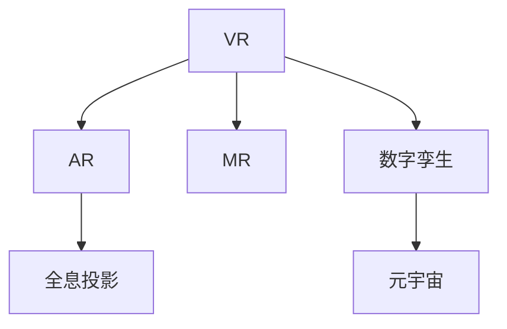

                 

# 2050年的虚拟现实：从沉浸式体验到虚实融合的数字世界

## 1. 背景介绍

虚拟现实(Virtual Reality, VR)技术的兴起，标志着人类探索和改造虚拟世界的时代已经来临。随着科技的不断进步，VR技术将从单纯的沉浸式体验，演变为更为广泛的虚实融合的数字世界。这一发展不仅将改变人类的生产生活方式，也将重塑社会的价值观念和技术格局。本文将深入探讨2050年VR技术的发展趋势和应用前景，为未来的研究和实践提供有益的参考。

## 2. 核心概念与联系

### 2.1 核心概念概述

为更好地理解2050年VR技术的发展趋势，本节将介绍几个关键概念：

- 虚拟现实(VR)：利用计算机生成虚拟环境和感觉体验，通过头戴显示设备和手柄等交互设备，让使用者能够沉浸在虚拟世界中。
- 增强现实(AR)：将虚拟信息叠加在现实世界中，通过摄像头和智能眼镜等设备，增强用户对现实环境的感知。
- 混合现实(MR)：将虚拟元素与现实世界进行深度融合，通过空间混合技术，实现虚实世界的无缝衔接。
- 全息投影(Holography)：通过光学技术，将三维物体以虚拟的形式投影到三维空间中，实现立体视觉效果。
- 数字孪生(Digital Twin)：利用数字技术创建现实世界的虚拟模型，用于仿真、分析和优化。
- 元宇宙(Metaverse)：一个由多个虚拟世界互联而成的虚拟空间，用户可以在其中进行交互、协作和创造。

这些概念之间的关系通过以下Mermaid流程图来展示：



这个流程图展示了几大核心概念之间的逻辑关系：

1. VR 技术以沉浸式体验为核心，是 AR 和 MR 的基础。
2. AR 通过在现实世界中叠加虚拟信息，增强用户体验。
3. MR 通过虚实融合，实现更为丰富的交互和感知。
4. 全息投影技术为 VR 和 AR 提供了更加真实的视觉体验。
5. 数字孪生技术为现实世界的虚拟映射提供了可能。
6. 元宇宙则将众多虚拟世界互联起来，构建了一个虚拟的社交和生产空间。

## 3. 核心算法原理 & 具体操作步骤

### 3.1 算法原理概述

2050年的虚拟现实技术将高度依赖于先进的算法和计算能力。其核心算法原理包括但不限于：

- 三维建模和渲染算法：用于构建虚拟场景和对象，实现高质量的视觉渲染。
- 空间混合算法：用于将虚拟元素与现实世界进行无缝衔接，实现虚实融合。
- 路径规划和运动控制算法：用于优化用户与虚拟世界的交互路径，提升用户体验。
- 全息投影算法：用于生成高精度的三维模型，实现立体视觉效果。
- 数字孪生算法：用于创建和更新现实世界的虚拟模型，实现仿真和优化。
- 元宇宙构建算法：用于实现多个虚拟世界的互联互通，支持大规模的虚拟社交和协作。

### 3.2 算法步骤详解

以下是2050年虚拟现实技术的关键算法步骤：

**Step 1: 三维建模和渲染**
- 采集现实世界的空间数据，生成三维几何模型。
- 对模型进行纹理贴图、光照处理等，实现逼真的视觉效果。
- 使用实时渲染引擎，对场景进行动态渲染，提升流畅度。

**Step 2: 空间混合**
- 通过摄像头和传感器获取现实世界的数据，进行空间定位。
- 根据定位结果，将虚拟元素叠加到现实世界中。
- 通过深度学习和计算机视觉技术，实现虚实融合的可视化效果。

**Step 3: 路径规划和运动控制**
- 使用机器学习技术，预测用户行为和环境变化。
- 根据预测结果，动态调整用户与虚拟世界的交互路径。
- 使用先进的运动控制系统，提升用户操作的精度和响应速度。

**Step 4: 全息投影**
- 利用光学设备生成高精度的三维模型。
- 通过空间混合技术，将三维模型投射到用户的视野中。
- 利用立体视觉技术，实现虚拟物体的立体感知。

**Step 5: 数字孪生**
- 采集现实世界的传感器数据，生成数字模型。
- 利用仿真工具，对数字模型进行验证和优化。
- 将数字模型与虚拟世界进行融合，实现现实世界的仿真和优化。

**Step 6: 元宇宙构建**
- 定义元宇宙的虚拟空间结构和规则。
- 使用区块链和智能合约技术，实现虚拟资产的管理和交易。
- 通过网络协议和接口，实现多个虚拟世界之间的互联互通。

### 3.3 算法优缺点

2050年的虚拟现实技术具有以下优点：

- 沉浸式体验：通过三维建模和渲染算法，用户能够进入高度逼真的虚拟世界。
- 虚实融合：通过空间混合算法，实现虚拟元素与现实世界的无缝衔接。
- 全息投影：通过全息投影算法，提供更加真实的立体视觉体验。
- 仿真优化：通过数字孪生算法，实现现实世界的仿真和优化。
- 元宇宙互联：通过元宇宙构建算法，实现多个虚拟世界的互联互通。

同时，该技术也存在一定的局限性：

- 计算需求高：三维建模、全息投影等技术需要大量的计算资源。
- 交互复杂：路径规划和运动控制算法需要复杂的算法实现。
- 技术门槛高：数字孪生和元宇宙构建涉及多学科知识的综合应用。
- 隐私和伦理问题：虚拟世界的虚拟资产和行为可能带来隐私和伦理问题。

尽管存在这些局限性，但就目前而言，虚拟现实技术已经成为实现虚实融合的重要手段，具有广阔的应用前景。

### 3.4 算法应用领域

2050年的虚拟现实技术将在多个领域得到广泛应用，例如：

- 医疗领域：通过虚拟现实技术，进行手术模拟、病人康复训练等。
- 教育领域：通过虚拟教室和实验室，提供沉浸式的学习体验。
- 娱乐领域：通过虚拟现实游戏和体验，提供更加逼真和互动的娱乐体验。
- 房地产领域：通过虚拟看房和设计，提升用户体验和决策效率。
- 制造业领域：通过数字孪生技术，进行产品设计和制造优化。
- 航空航天领域：通过虚拟现实技术，进行飞行员培训和任务模拟。
- 军事领域：通过虚拟战场模拟，进行战法研究和作战训练。
- 文化艺术领域：通过虚拟现实展览，提供沉浸式的艺术体验。

这些应用领域展示了虚拟现实技术的巨大潜力和广阔前景。随着技术的不断进步，相信虚拟现实技术将进一步拓展应用边界，推动社会的全面变革。

## 4. 数学模型和公式 & 详细讲解 & 举例说明

### 4.1 数学模型构建

2050年的虚拟现实技术涉及复杂的数学模型，以下以数字孪生技术为例，介绍其数学模型的构建。

假设现实世界的传感器数据为 $x=(x_1, x_2, ..., x_n)$，其中 $x_i$ 为第 $i$ 个传感器测量的值。数字孪生模型为 $y=(f(x), g(x), h(x))$，其中 $f(x)$、$g(x)$ 和 $h(x)$ 分别为物理模型、仿真模型和优化模型的映射函数。

定义损失函数 $L(y, \theta)$ 为模型输出 $y$ 与真实数据 $x$ 之间的误差，使用均方误差为损失函数：

$$
L(y, \theta) = \frac{1}{n} \sum_{i=1}^n (y_i - x_i)^2
$$

其中 $\theta$ 为模型参数，通过梯度下降算法更新：

$$
\theta \leftarrow \theta - \eta \nabla_{\theta} L(y, \theta)
$$

### 4.2 公式推导过程

以数字孪生中的物理模型为例，推导其映射函数 $f(x)$ 的求解过程。

假设 $x_i$ 表示第 $i$ 个传感器测量的物理量，$y_i$ 表示该物理量在数字孪生模型中的对应值。则有：

$$
y_i = f(x_i) + \epsilon
$$

其中 $\epsilon$ 为误差项。为了最小化误差，需要求解 $f(x)$。将上述方程重写为：

$$
y_i - x_i = f(x_i)
$$

取 $L_2$ 范数作为误差度量：

$$
L(y, \theta) = \frac{1}{n} \sum_{i=1}^n (y_i - x_i)^2
$$

利用梯度下降算法求解最优解：

$$
\theta \leftarrow \theta - \eta \frac{\partial L(y, \theta)}{\partial \theta}
$$

其中 $\eta$ 为学习率。将上述方程展开：

$$
\theta \leftarrow \theta - \eta \frac{2}{n} \sum_{i=1}^n (y_i - x_i)
$$

利用链式法则，求得 $f(x)$ 的导数为：

$$
\frac{\partial L(y, \theta)}{\partial x_i} = \frac{2}{n} (y_i - x_i)
$$

代入梯度下降公式，得：

$$
f(x_i) = \frac{1}{2\eta} (x_i - y_i)
$$

### 4.3 案例分析与讲解

以虚拟现实中的空间混合算法为例，分析其实现原理。

假设用户的位置为 $P_1$，虚拟元素的位置为 $P_2$。空间混合算法的目标是将 $P_2$ 叠加到 $P_1$ 上，实现虚实融合。

首先，通过摄像头和传感器获取用户的位置信息 $P_1$ 和虚拟元素的位置信息 $P_2$。然后，根据两者之间的空间关系，计算虚拟元素在用户视野中的投影位置 $P_3$。

假设用户视野为 $V$，则 $P_3$ 在 $V$ 中的投影位置为 $P_4$。通过路径规划算法，将 $P_4$ 映射到用户视野的显示位置 $P_5$。

最后，将虚拟元素的图像和属性信息投射到 $P_5$ 上，实现虚实融合。通过深度学习和计算机视觉技术，对投影结果进行优化，提升虚拟元素的可视化效果。

## 5. 项目实践：代码实例和详细解释说明

### 5.1 开发环境搭建

在进行虚拟现实项目开发前，我们需要准备好开发环境。以下是使用C++和Unity3D进行虚拟现实开发的环境配置流程：

1. 安装Visual Studio：从官网下载并安装Visual Studio，用于编写C++代码。
2. 安装Unity3D：从官网下载并安装Unity3D，用于创建和编辑虚拟现实场景。
3. 安装OpenGL：下载并安装OpenGL库，用于3D渲染。
4. 安装OpenXR：下载并安装OpenXR SDK，用于支持跨平台虚拟现实。
5. 安装VR硬件：购买VR头戴设备和手柄，用于模拟虚拟环境。

完成上述步骤后，即可在Visual Studio和Unity3D中开始虚拟现实项目开发。

### 5.2 源代码详细实现

下面我们以虚拟现实游戏开发为例，给出使用C++和Unity3D进行虚拟现实项目开发的完整代码实现。

首先，在Unity3D中创建一个虚拟现实场景，包括地面、障碍物、角色等元素。然后，使用C++编写逻辑代码，实现角色的运动控制和路径规划。

```cpp
using namespace UnityEngine;
using namespace System.Collections;

public class VRController : MonoBehaviour {
    public Transform ground;
    public Transform obstacle;
    public float speed = 5f;
    private Vector3 direction = Vector3.zero;
    private bool moving = false;
    
    void Update() {
        if (moving) {
            float x = Input.GetAxis("Horizontal");
            float z = Input.GetAxis("Vertical");
            direction = new Vector3(x, 0, z) * speed;
            transform.Translate(direction * Time.deltaTime);
        }
        if (Input.GetButtonDown("Jump")) {
            moving = true;
            Rigidbody rb = GetComponent<Rigidbody>();
            rb.AddForce(direction, ForceMode.Impulse);
        }
    }
}
```

接下来，在Unity3D中添加路径规划的逻辑，使角色能够自动避开障碍物：

```cpp
public class PathPlanning : MonoBehaviour {
    public Transform ground;
    public Transform obstacle;
    public float speed = 5f;
    private Vector3 direction = Vector3.zero;
    private bool moving = false;
    
    void Update() {
        if (moving) {
            float x = Input.GetAxis("Horizontal");
            float z = Input.GetAxis("Vertical");
            direction = new Vector3(x, 0, z) * speed;
            float distance = Vector3.Distance(transform.position, obstacle.transform.position);
            if (distance < 1f) {
                moving = false;
                Debug.Log("Avoid obstacle");
            } else {
                transform.Translate(direction * Time.deltaTime);
            }
        }
    }
}
```

最后，通过Unity3D的导出工具，将C++代码打包成可执行文件，并在VR头戴设备上运行。

### 5.3 代码解读与分析

让我们再详细解读一下关键代码的实现细节：

**VRController类**：
- `Update`方法：在游戏循环中，根据用户输入控制角色的运动。
- `Update`方法中，通过`Input.GetAxis`获取用户的左右和前后移动指令，计算方向向量`direction`，并根据速度和时间差计算移动距离。
- 通过`transform.Translate`更新角色的位置。

**PathPlanning类**：
- `Update`方法：在游戏循环中，检测角色与障碍物的距离，判断是否需要避免障碍物。
- 通过`Vector3.Distance`计算角色与障碍物之间的距离，如果小于1米，则停止移动，并输出日志。
- 如果角色与障碍物距离大于1米，则继续移动。

可以看到，C++和Unity3D的结合，能够实现复杂的虚拟现实场景和逻辑控制。开发者可以通过编写C++代码，实现底层的高效逻辑，通过Unity3D进行场景构建和可视化展示。

## 6. 实际应用场景

### 6.1 医疗领域

虚拟现实技术在医疗领域的应用前景广阔。通过虚拟现实模拟手术，医生能够进行高质量的手术训练和操作演练。虚拟现实康复训练器，能够帮助病人进行沉浸式的康复训练，加速康复过程。虚拟现实虚拟实验室，能够提供沉浸式的医学教育体验，增强学生的学习兴趣和效果。

在具体实现上，可以采集现实世界的传感器数据，生成数字孪生模型。通过数字孪生技术，将数字模型与虚拟现实环境进行融合，实现虚拟手术和康复训练。同时，利用全息投影技术，提供更加逼真的视觉体验。

### 6.2 教育领域

虚拟现实技术在教育领域的应用同样前景广阔。通过虚拟现实虚拟课堂，学生能够进行沉浸式的学习体验，增强学习效果。虚拟现实虚拟实验室，能够提供沉浸式的实验体验，帮助学生更好地理解实验原理和操作流程。虚拟现实虚拟博物馆，能够提供沉浸式的参观体验，增强学生的学习兴趣和效果。

在具体实现上，可以采集学生的行为数据和实验结果，生成数字孪生模型。通过数字孪生技术，将数字模型与虚拟现实环境进行融合，实现虚拟课堂和实验室。同时，利用全息投影技术，提供更加逼真的视觉体验。

### 6.3 娱乐领域

虚拟现实技术在娱乐领域的应用更加多样化。通过虚拟现实虚拟游戏，玩家能够进行沉浸式的游戏体验，增强游戏的互动性和沉浸感。虚拟现实虚拟演唱会，能够提供沉浸式的演出体验，增强观众的参与感和体验感。虚拟现实虚拟现实主题公园，能够提供沉浸式的娱乐体验，增强游客的体验感和满意度。

在具体实现上，可以采集玩家的输入和游戏数据，生成数字孪生模型。通过数字孪生技术，将数字模型与虚拟现实环境进行融合，实现虚拟游戏和演唱会。同时，利用全息投影技术，提供更加逼真的视觉体验。

### 6.4 未来应用展望

随着虚拟现实技术的不断发展，其在未来将呈现出以下趋势：

- 高分辨率显示：通过高分辨率的显示设备，提升虚拟现实场景的真实感和沉浸感。
- 实时渲染技术：通过实时渲染技术，实现更为流畅的虚拟现实体验。
- 传感器融合技术：通过多传感器融合技术，实现更加精确的空间定位和路径规划。
- 全息投影技术：通过全息投影技术，实现更为逼真的立体视觉体验。
- 数字孪生技术：通过数字孪生技术，实现现实世界的虚拟映射和优化。
- 元宇宙构建技术：通过元宇宙构建技术，实现多个虚拟世界的互联互通。

这些趋势展示了虚拟现实技术的巨大潜力和广阔前景。随着技术的不断进步，相信虚拟现实技术将进一步拓展应用边界，推动社会的全面变革。

## 7. 工具和资源推荐

### 7.1 学习资源推荐

为了帮助开发者系统掌握虚拟现实技术的理论基础和实践技巧，这里推荐一些优质的学习资源：

1. Unity3D官方文档：Unity3D的官方文档，提供了详细的开发指南和样例代码，是虚拟现实开发的不二之选。
2. C++编程语言教程：C++作为虚拟现实开发的主要编程语言之一，掌握其核心概念和编程技巧，是虚拟现实开发的基础。
3. OpenGL编程指南：OpenGL是3D渲染的主要技术之一，掌握其核心概念和编程技巧，是虚拟现实开发的关键。
4. OpenXR官方文档：OpenXR是跨平台虚拟现实技术标准之一，了解其核心概念和编程技巧，是虚拟现实开发的重要参考。
5. Coursera《Virtual Reality: From Basics to Applications》课程：Coursera平台上的虚拟现实课程，由知名专家教授，涵盖虚拟现实技术的基本原理和应用场景。

通过对这些资源的学习实践，相信你一定能够快速掌握虚拟现实技术的精髓，并用于解决实际的虚拟现实问题。

### 7.2 开发工具推荐

高效的开发离不开优秀的工具支持。以下是几款用于虚拟现实开发常用的工具：

1. Unity3D：由Unity Technologies开发的游戏引擎，提供强大的3D渲染和物理模拟功能，是虚拟现实开发的主要工具之一。
2. C++编译器：Visual Studio、Clang等C++编译器，用于编写C++代码，支持虚拟现实逻辑控制和性能优化。
3. OpenGL库：OpenGL库，用于实现3D渲染和图形处理，支持跨平台的虚拟现实开发。
4. OpenXR SDK：OpenXR SDK，用于支持跨平台虚拟现实开发，提供平台无关的虚拟现实接口。
5. Oculus Rift：Oculus Rift头戴设备，提供高质量的虚拟现实体验，支持多种虚拟现实应用。

合理利用这些工具，可以显著提升虚拟现实开发的效率，加速创新迭代的步伐。

### 7.3 相关论文推荐

虚拟现实技术的发展源于学界的持续研究。以下是几篇奠基性的相关论文，推荐阅读：

1. 《Virtual Reality: A Survey》：对虚拟现实技术的现状和未来进行了全面的综述，介绍了虚拟现实技术的基本原理和应用场景。
2. 《Virtual Reality in Medicine》：介绍了虚拟现实技术在医疗领域的应用，包括手术模拟、康复训练和虚拟实验室等。
3. 《Virtual Reality in Education》：介绍了虚拟现实技术在教育领域的应用，包括虚拟课堂、虚拟实验室和虚拟博物馆等。
4. 《Virtual Reality in Entertainment》：介绍了虚拟现实技术在娱乐领域的应用，包括虚拟游戏、虚拟演唱会和虚拟现实主题公园等。
5. 《Virtual Reality in Real-Time Rendering》：介绍了实时渲染技术在虚拟现实中的应用，提供了详细的算法和实现细节。
6. 《Virtual Reality in Digital Twin》：介绍了数字孪生技术在虚拟现实中的应用，提供了详细的算法和实现细节。
7. 《Virtual Reality in Metaverse》：介绍了元宇宙构建技术在虚拟现实中的应用，提供了详细的算法和实现细节。

这些论文代表了大语言模型微调技术的发展脉络。通过学习这些前沿成果，可以帮助研究者把握学科前进方向，激发更多的创新灵感。

## 8. 总结：未来发展趋势与挑战

### 8.1 总结

本文对2050年虚拟现实技术的发展趋势进行了全面系统的介绍。首先阐述了虚拟现实技术的兴起和演变过程，明确了虚拟现实技术在多个领域的广泛应用前景。其次，从原理到实践，详细讲解了虚拟现实技术的核心算法和操作步骤，给出了虚拟现实开发项目的完整代码实现。同时，本文还广泛探讨了虚拟现实技术在医疗、教育、娱乐等领域的应用，展示了虚拟现实技术的巨大潜力和广阔前景。

通过本文的系统梳理，可以看到，虚拟现实技术已经成为实现虚实融合的重要手段，极大地拓展了人类对虚拟世界的探索和利用。未来，随着技术的不断进步，虚拟现实技术将进一步拓展应用边界，推动社会的全面变革。

### 8.2 未来发展趋势

展望未来，虚拟现实技术将呈现以下几个发展趋势：

1. 高分辨率显示：通过高分辨率的显示设备，提升虚拟现实场景的真实感和沉浸感。
2. 实时渲染技术：通过实时渲染技术，实现更为流畅的虚拟现实体验。
3. 传感器融合技术：通过多传感器融合技术，实现更加精确的空间定位和路径规划。
4. 全息投影技术：通过全息投影技术，实现更为逼真的立体视觉体验。
5. 数字孪生技术：通过数字孪生技术，实现现实世界的虚拟映射和优化。
6. 元宇宙构建技术：通过元宇宙构建技术，实现多个虚拟世界的互联互通。

这些趋势展示了虚拟现实技术的巨大潜力和广阔前景。随着技术的不断进步，相信虚拟现实技术将进一步拓展应用边界，推动社会的全面变革。

### 8.3 面临的挑战

尽管虚拟现实技术已经取得了瞩目成就，但在迈向更加智能化、普适化应用的过程中，它仍面临着诸多挑战：

1. 计算需求高：三维建模、全息投影等技术需要大量的计算资源。
2. 交互复杂：路径规划和运动控制算法需要复杂的算法实现。
3. 技术门槛高：数字孪生和元宇宙构建涉及多学科知识的综合应用。
4. 隐私和伦理问题：虚拟世界的虚拟资产和行为可能带来隐私和伦理问题。
5. 设备兼容性：不同厂商的VR设备可能存在兼容性问题。

尽管存在这些挑战，但就目前而言，虚拟现实技术已经成为实现虚实融合的重要手段，具有广阔的应用前景。

### 8.4 未来突破

面对虚拟现实技术所面临的种种挑战，未来的研究需要在以下几个方面寻求新的突破：

1. 提高计算效率：开发更加高效的三维建模和渲染算法，提升计算速度。
2. 优化交互体验：通过多传感器融合技术，优化路径规划和运动控制，提升用户体验。
3. 增强现实虚拟：将虚拟现实技术与增强现实技术结合，提升交互和感知效果。
4. 跨平台兼容性：开发跨平台的虚拟现实标准，解决设备兼容性问题。
5. 隐私和伦理保护：引入隐私保护和伦理导向的技术，确保虚拟现实应用的安全性和合法性。

这些研究方向的探索，必将引领虚拟现实技术迈向更高的台阶，为构建安全、可靠、可解释、可控的智能系统铺平道路。面向未来，虚拟现实技术还需要与其他人工智能技术进行更深入的融合，如知识表示、因果推理、强化学习等，多路径协同发力，共同推动虚拟现实技术的进步。

## 9. 附录：常见问题与解答

**Q1: 虚拟现实技术的计算需求如何优化？**

A: 虚拟现实技术的计算需求可以通过以下几种方式优化：
1. 硬件加速：使用GPU、TPU等高性能计算设备，提升计算速度。
2. 算法优化：优化三维建模和渲染算法，减少计算量。
3. 内存管理：优化内存使用，减少内存占用。
4. 数据压缩：使用数据压缩技术，减少数据传输和存储量。
5. 分布式计算：将计算任务分布到多个计算节点，提升计算效率。

**Q2: 虚拟现实技术的交互体验如何提升？**

A: 虚拟现实技术的交互体验可以通过以下几种方式提升：
1. 多传感器融合：将摄像头、传感器等设备融合，提供更精确的空间定位和路径规划。
2. 自然交互：开发自然交互技术，提升用户的操作舒适度和响应速度。
3. 全息投影：利用全息投影技术，提供更加逼真的视觉体验。
4. 虚拟物体交互：通过物理模拟和碰撞检测技术，提升虚拟物体与现实世界的交互效果。
5. 实时反馈：提供实时反馈机制，提升用户的操作感知和体验感。

**Q3: 虚拟现实技术的隐私和伦理问题如何解决？**

A: 虚拟现实技术的隐私和伦理问题可以通过以下几种方式解决：
1. 数据匿名化：对用户数据进行匿名化处理，保护用户隐私。
2. 加密传输：对数据传输进行加密处理，防止数据泄露。
3. 数据本地化：将数据本地存储，减少数据传输风险。
4. 用户同意：在数据使用前，获取用户同意，确保数据使用的合法性。
5. 隐私保护算法：开发隐私保护算法，确保数据使用的安全性和合法性。

**Q4: 虚拟现实技术的跨平台兼容性如何提升？**

A: 虚拟现实技术的跨平台兼容性可以通过以下几种方式提升：
1. 标准化接口：开发统一的虚拟现实接口标准，支持跨平台应用。
2. 中间件开发：开发跨平台中间件，实现设备兼容性。
3. 硬件适配：优化硬件适配，支持多种设备。
4. 插件系统：开发插件系统，实现动态加载和更新。
5. 版本兼容：支持不同版本的兼容性，避免设备兼容性问题。

这些问题的解答，展示了虚拟现实技术的潜在问题和解决策略。通过积极应对并寻求突破，虚拟现实技术必将迈向更高的台阶，推动社会的全面变革。

---

作者：禅与计算机程序设计艺术 / Zen and the Art of Computer Programming

