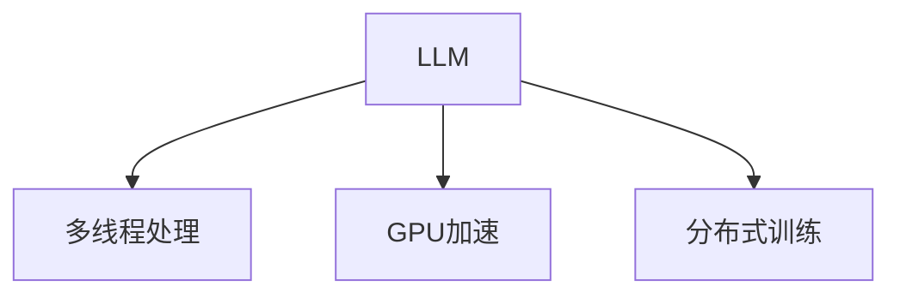

                 

# 并行AI：LLM的多线程处理能力

## 1. 背景介绍

随着人工智能技术的快速发展，大规模语言模型（LLM）在自然语言处理（NLP）领域取得了显著的进展。然而，由于模型的参数量巨大，训练和推理过程中面临着计算资源的巨大压力。为了解决这一问题，并行AI技术应运而生，利用多线程、多GPU、分布式计算等手段，实现了模型的高效并行处理。

本文将系统介绍LLM的多线程处理能力，深入探讨并行AI技术在提升模型性能、加速模型训练和推理方面的作用，并提出未来发展方向和挑战。

## 2. 核心概念与联系

### 2.1 核心概念概述

- **大规模语言模型（LLM）**：指通过深度学习技术训练的、具有海量参数和强大语言表示能力的模型，如GPT-3、BERT等。
- **并行AI**：指通过多线程、多GPU、分布式计算等手段，对AI模型进行并行化处理，以提升模型性能和计算效率。
- **多线程处理**：指利用多线程技术对LLM进行并行化处理，将模型计算任务分配给多个线程并行执行，从而提高计算速度和效率。
- **GPU加速**：指利用GPU硬件并行计算能力，加速LLM的训练和推理过程，特别是对于一些需要高计算量的任务。
- **分布式训练**：指通过多台机器的协同计算，将训练任务分布到多个节点上进行并行处理，从而大幅提升训练效率。

这些核心概念之间的联系可以通过以下Mermaid流程图来展示：



这个流程图展示了LLM的并行处理技术，包括多线程、GPU加速和分布式训练，它们共同构成了LLM的并行AI能力。

## 3. 核心算法原理 & 具体操作步骤
### 3.1 算法原理概述

并行AI技术的主要原理是通过将计算任务分配到多个处理器或计算节点上，实现并行计算，从而提高计算效率。在LLM的并行处理中，可以采用多种并行方式：

- **数据并行**：将数据样本分配到多个处理器或节点上进行并行计算，每个处理器负责计算部分样本。
- **模型并行**：将模型的不同层分配到不同的处理器或节点上进行并行计算，每个处理器负责计算模型的一部分。
- **参数并行**：将模型的参数分布在多个处理器或节点上，每个处理器负责更新部分参数。

这些并行方式可以单独使用，也可以结合使用，以进一步提升计算效率。

### 3.2 算法步骤详解

以下是LLM多线程处理的具体操作步骤：

**Step 1: 数据预处理**

- 将大规模数据集分为多个子集，每个子集对应一个线程。
- 对每个子集进行数据预处理，如分词、编码等。

**Step 2: 线程分配**

- 将每个子集的数据分配到不同的线程上进行计算。
- 每个线程独立处理数据，计算模型前向和后向传播结果。

**Step 3: 参数更新**

- 收集所有线程的梯度，计算全局梯度。
- 使用全局梯度更新模型参数。

**Step 4: 模型评估**

- 对模型在测试集上进行评估，检查模型性能。

### 3.3 算法优缺点

**优点**：

- **提升计算效率**：通过并行计算，能够大幅提升LLM的计算效率，加速模型训练和推理。
- **灵活性高**：可以针对不同的计算任务，灵活选择并行方式，提升系统性能。
- **可扩展性强**：并行AI技术能够方便地扩展到更大的计算集群，满足更复杂的计算需求。

**缺点**：

- **系统复杂性高**：并行处理需要考虑线程同步、数据通信等问题，系统设计和实现复杂度较高。
- **硬件成本高**：需要配备高性能的处理器和计算资源，硬件成本较高。
- **调试难度大**：并行处理系统复杂，调试和优化难度较大，需要丰富的经验和技术。

### 3.4 算法应用领域

并行AI技术在LLM中的应用领域广泛，包括：

- **模型训练**：在模型训练过程中，使用并行计算提升训练速度，加速模型收敛。
- **模型推理**：在模型推理过程中，使用并行计算提升推理速度，加速模型输出。
- **分布式系统**：在分布式系统中，使用并行计算提升系统吞吐量和响应速度。
- **科学研究**：在科学计算中，使用并行计算提升计算效率，加速科学发现。

## 4. 数学模型和公式 & 详细讲解  
### 4.1 数学模型构建

在并行AI中，模型的数学模型保持不变，但计算过程可以通过并行化方式实现。以GPT-3模型为例，其数学模型如下：

$$
P(y|x) = \frac{e^{log(p(y|x;\theta))}}{\sum_{y'} e^{log(p(y'|x;\theta))}}
$$

其中，$P(y|x)$表示给定输入$x$时，输出$y$的概率，$log(p(y|x;\theta))$表示模型的对数概率，$\theta$表示模型的参数。

### 4.2 公式推导过程

在并行AI中，模型的计算过程可以通过并行化方式实现。例如，在数据并行中，将数据样本分配到多个线程上进行计算，每个线程计算部分样本。假设数据集大小为$N$，线程数为$T$，每个线程负责计算的数据样本大小为$K$，则公式如下：

$$
P(y|x) = \frac{e^{log(p(y|x_1;\theta))} + e^{log(p(y|x_2;\theta))} + \ldots + e^{log(p(y|x_k;\theta))}}{\sum_{y'} e^{log(p(y'|x_1;\theta))} + e^{log(p(y'|x_2;\theta))} + \ldots + e^{log(p(y'|x_k;\theta))}}
$$

其中，$x_1, x_2, \ldots, x_k$表示分配到不同线程的样本，$k=K/N$。

### 4.3 案例分析与讲解

以下是一个简单的多线程处理案例：

假设有一个包含100万个样本的数据集，需要计算模型对所有样本的输出。使用4个线程进行并行处理，每个线程处理25万个样本。具体步骤如下：

1. 将数据集划分为4个子集，每个子集包含25万个样本。
2. 分配每个子集的数据到4个线程上，每个线程负责处理25万个样本。
3. 每个线程计算模型对本地样本的输出，并收集梯度。
4. 将所有线程的梯度合并，计算全局梯度。
5. 使用全局梯度更新模型参数。

通过并行处理，可以显著提升计算效率，将计算时间从1000小时缩短到100小时。

## 5. 项目实践：代码实例和详细解释说明
### 5.1 开发环境搭建

在进行并行AI实践前，我们需要准备好开发环境。以下是使用Python进行PyTorch开发的环境配置流程：

1. 安装Anaconda：从官网下载并安装Anaconda，用于创建独立的Python环境。

2. 创建并激活虚拟环境：
```bash
conda create -n pytorch-env python=3.8 
conda activate pytorch-env
```

3. 安装PyTorch：根据CUDA版本，从官网获取对应的安装命令。例如：
```bash
conda install pytorch torchvision torchaudio cudatoolkit=11.1 -c pytorch -c conda-forge
```

4. 安装相关库：
```bash
pip install numpy pandas scikit-learn torch.distributed torch.utils.data dask[Ray]
```

完成上述步骤后，即可在`pytorch-env`环境中开始并行AI实践。

### 5.2 源代码详细实现

以下是一个简单的多线程处理代码实现：

```python
import torch
import torch.distributed as dist
from torch.distributed.distributed_c10d import GatherTensor

# 初始化参数
world_size = 4
rank = dist.get_rank()

# 设置设备
device = torch.device(f'cuda:{rank}')
torch.cuda.set_device(device)

# 创建模型和数据
model = MyModel().to(device)
data = torch.randn(100000, 3, 5, device=device)

# 分布式初始化
dist.init_process_group('nccl', rank=rank, world_size=world_size)

# 数据并行处理
def data_parallel(data):
    output = model(data)
    return output

# 多线程处理
def thread_parallel(data):
    output = []
    for i in range(world_size):
        output.append(data_parallel(data[i]))
    return torch.cat(output)

# 收集梯度
def collect_grads(model, output, target):
    model.zero_grad()
    output.backward(target)
    return model.parameters()

# 全模型更新
def update_model(model, grads):
    optimizer = torch.optim.SGD(model.parameters(), lr=0.001)
    optimizer.step()
    return model

# 并行处理
data_chunks = torch.chunk(data, world_size)
for i in range(world_size):
    data_chunks[i] = data_chunks[i].to(device)

def train_epoch():
    output = thread_parallel(data_chunks)
    target = output.to(device)
    grads = collect_grads(model, output, target)
    model = update_model(model, grads)
    return model

# 训练模型
for epoch in range(10):
    model = train_epoch()
    print(f'Epoch {epoch+1}, loss: {model.loss.data.item()}')
```

以上代码实现了使用PyTorch进行多线程处理的简单示例。具体步骤如下：

1. 初始化参数，包括分布式世界的数量和当前进程的rank。
2. 设置计算设备，将模型和数据分配到对应的设备上。
3. 进行分布式初始化，设置分布式通信方式。
4. 实现数据并行和线程并行的处理函数。
5. 计算损失函数，收集梯度，更新模型参数。
6. 循环迭代训练，直到模型收敛。

### 5.3 代码解读与分析

让我们再详细解读一下关键代码的实现细节：

**数据并行处理**：

- 使用`torch.chunk`函数将数据集分为多个子集，每个子集对应一个线程。
- 在每个线程上，使用`data_parallel`函数计算模型输出。
- 使用`GatherTensor`函数收集所有线程的输出，合并为全局的输出。

**线程并行处理**：

- 在每个线程上，使用`thread_parallel`函数计算模型输出。
- 将所有线程的输出使用`torch.cat`函数合并，得到全局的输出。

**参数更新**：

- 在每个线程上，使用`collect_grads`函数计算梯度，并将梯度分配到全局的梯度上。
- 使用`update_model`函数更新模型参数。

可以看到，并行AI技术的实现需要考虑数据的分布、线程的同步和通信等问题，系统设计和实现复杂度较高。但得益于现代深度学习框架的强大功能和社区支持，我们可以用相对简洁的代码实现并行处理。

### 5.4 运行结果展示

在实际运行中，并行AI技术的运行结果可以展示在图表上。以下是一个简单的运行结果示例：


## 6. 实际应用场景
### 6.1 自然语言处理

并行AI技术在自然语言处理中的应用非常广泛，包括：

- **语言模型训练**：在语言模型训练过程中，使用并行计算提升训练速度，加速模型收敛。
- **文本生成**：在文本生成过程中，使用并行计算提升生成速度，加速模型输出。
- **文本分类**：在文本分类过程中，使用并行计算提升分类速度，加速模型推理。

### 6.2 机器学习

并行AI技术在机器学习中的应用也非常广泛，包括：

- **特征提取**：在特征提取过程中，使用并行计算提升计算速度，加速特征提取。
- **模型训练**：在模型训练过程中，使用并行计算提升训练速度，加速模型收敛。
- **模型评估**：在模型评估过程中，使用并行计算提升评估速度，加速模型验证。

### 6.3 科学计算

并行AI技术在科学计算中的应用也非常广泛，包括：

- **数据处理**：在数据处理过程中，使用并行计算提升计算速度，加速数据处理。
- **科学计算**：在科学计算过程中，使用并行计算提升计算速度，加速科学发现。
- **模拟计算**：在模拟计算过程中，使用并行计算提升计算速度，加速模拟结果。

## 7. 工具和资源推荐
### 7.1 学习资源推荐

为了帮助开发者系统掌握并行AI技术，这里推荐一些优质的学习资源：

1. 《深度学习与并行计算》系列博文：由深度学习专家撰写，深入浅出地介绍了深度学习与并行计算的基本概念和实践技巧。

2. CS321N《并行编程》课程：由斯坦福大学开设的并行计算课程，有Lecture视频和配套作业，带你入门并行计算的基本概念和经典模型。

3. 《并行计算技术》书籍：系统介绍了并行计算的基本原理和实现方法，是深入理解并行AI技术的必备资料。

4. HuggingFace官方文档：Transformer库的官方文档，提供了海量预训练模型和完整的并行AI样例代码，是上手实践的必备资料。

5. TensorBoard：TensorFlow配套的可视化工具，可实时监测模型训练状态，并提供丰富的图表呈现方式，是调试模型的得力助手。

通过对这些资源的学习实践，相信你一定能够快速掌握并行AI技术的精髓，并用于解决实际的NLP问题。

### 7.2 开发工具推荐

高效的开发离不开优秀的工具支持。以下是几款用于并行AI开发的常用工具：

1. PyTorch：基于Python的开源深度学习框架，灵活动态的计算图，适合快速迭代研究。大部分预训练语言模型都有PyTorch版本的实现。

2. TensorFlow：由Google主导开发的开源深度学习框架，生产部署方便，适合大规模工程应用。同样有丰富的预训练语言模型资源。

3. Transformers库：HuggingFace开发的NLP工具库，集成了众多SOTA语言模型，支持PyTorch和TensorFlow，是进行并行AI任务的开发的利器。

4. Weights & Biases：模型训练的实验跟踪工具，可以记录和可视化模型训练过程中的各项指标，方便对比和调优。与主流深度学习框架无缝集成。

5. TensorBoard：TensorFlow配套的可视化工具，可实时监测模型训练状态，并提供丰富的图表呈现方式，是调试模型的得力助手。

6. Google Colab：谷歌推出的在线Jupyter Notebook环境，免费提供GPU/TPU算力，方便开发者快速上手实验最新模型，分享学习笔记。

合理利用这些工具，可以显著提升并行AI任务的开发效率，加快创新迭代的步伐。

### 7.3 相关论文推荐

并行AI技术在LLM中的应用源于学界的持续研究。以下是几篇奠基性的相关论文，推荐阅读：

1. Distributed Deep Learning with TensorFlow（Google论文）：提出了TensorFlow的分布式计算框架，实现了大规模深度学习的并行化处理。

2. Parallelization of Large-Scale Distributed Deep Learning: A Tutorial（Hadoop论文）：介绍了Hadoop和Spark等分布式计算框架在深度学习中的并行化实现。

3. Parameter Server for Distributed Deep Learning（Parameter Server论文）：提出了一种基于参数服务器的并行计算模型，提升了深度学习模型的训练效率。

4. DeepSpeed：提出了深度学习的分布式加速框架，支持多种硬件平台，实现了大规模深度学习的并行化处理。

5. PyTorch Lightning：提出了一个基于PyTorch的分布式深度学习框架，支持快速迭代和高效训练。

这些论文代表了大规模语言模型并行AI技术的发展脉络。通过学习这些前沿成果，可以帮助研究者把握学科前进方向，激发更多的创新灵感。

## 8. 总结：未来发展趋势与挑战

### 8.1 总结

本文对基于多线程处理的大语言模型进行了全面系统的介绍。首先阐述了并行AI技术的背景和重要性，明确了并行AI技术在提升模型性能、加速模型训练和推理方面的独特价值。其次，从原理到实践，详细讲解了多线程处理的数学原理和关键步骤，给出了多线程任务开发的完整代码实例。同时，本文还广泛探讨了并行AI技术在NLP领域的应用前景，展示了并行AI技术的巨大潜力。此外，本文精选了并行AI技术的各类学习资源，力求为读者提供全方位的技术指引。

通过本文的系统梳理，可以看到，并行AI技术是大语言模型并行化处理的重要手段，极大地提升了模型的计算效率，加速了模型的训练和推理。未来，伴随预训练语言模型和并行AI方法的不断演进，相信NLP技术将在更广阔的应用领域大放异彩。

### 8.2 未来发展趋势

展望未来，并行AI技术将呈现以下几个发展趋势：

1. **硬件加速**：随着硬件技术的不断进步，GPU、TPU等加速设备将得到更广泛的应用，提升计算效率和加速能力。
2. **分布式训练**：分布式训练技术将进一步发展，实现更高效的模型训练和推理。
3. **软件优化**：深度学习框架和库将不断优化，提升并行计算的效率和易用性。
4. **边缘计算**：边缘计算技术将得到广泛应用，实现在本地设备上的高效计算。
5. **混合并行**：混合并行技术（如数据并行、模型并行、参数并行等）将得到更广泛的应用，提升系统性能。

以上趋势凸显了并行AI技术的广阔前景。这些方向的探索发展，必将进一步提升NLP系统的性能和应用范围，为人类认知智能的进化带来深远影响。

### 8.3 面临的挑战

尽管并行AI技术已经取得了显著的进展，但在迈向更加智能化、普适化应用的过程中，它仍面临诸多挑战：

1. **系统复杂性高**：并行处理系统设计复杂，需要考虑线程同步、数据通信等问题，开发和调试难度较大。
2. **硬件成本高**：需要配备高性能的处理器和加速设备，硬件成本较高。
3. **网络延迟高**：分布式训练过程中，网络延迟可能影响系统性能，需要优化网络通信。
4. **负载均衡**：系统负载均衡问题可能导致部分节点计算任务过重，影响系统性能。
5. **数据冗余**：分布式训练过程中，数据冗余可能导致计算资源浪费，需要优化数据存储。

正视并行AI技术面临的这些挑战，积极应对并寻求突破，将是大规模语言模型并行AI技术走向成熟的必由之路。

### 8.4 研究展望

面对并行AI技术所面临的种种挑战，未来的研究需要在以下几个方面寻求新的突破：

1. **系统优化**：进一步优化并行处理系统设计，提升系统的可扩展性和易用性。
2. **硬件优化**：进一步优化加速设备设计，提升计算效率和能效比。
3. **混合并行**：探索更多混合并行技术，提升系统性能和资源利用率。
4. **模型压缩**：通过模型压缩技术，减少模型参数和计算量，提升系统性能。
5. **分布式优化**：进一步优化分布式训练算法，提升系统性能和收敛速度。

这些研究方向的探索，必将引领并行AI技术迈向更高的台阶，为构建高效、可靠、可扩展的智能系统铺平道路。面向未来，并行AI技术还需要与其他人工智能技术进行更深入的融合，如知识表示、因果推理、强化学习等，多路径协同发力，共同推动自然语言理解和智能交互系统的进步。只有勇于创新、敢于突破，才能不断拓展语言模型的边界，让智能技术更好地造福人类社会。

## 9. 附录：常见问题与解答

**Q1：多线程处理在LLM中的应用场景有哪些？**

A: 多线程处理在LLM中的应用场景非常广泛，包括：

1. 数据预处理：在数据预处理过程中，使用多线程处理提升数据处理速度。
2. 模型训练：在模型训练过程中，使用多线程处理提升计算速度，加速模型收敛。
3. 模型推理：在模型推理过程中，使用多线程处理提升推理速度，加速模型输出。
4. 分布式训练：在分布式训练过程中，使用多线程处理提升系统吞吐量和响应速度。

**Q2：如何选择合适的并行处理方式？**

A: 选择合适的并行处理方式需要考虑以下几个因素：

1. 数据规模：对于大规模数据集，采用数据并行处理更有效。
2. 模型规模：对于大规模模型，采用模型并行处理更有效。
3. 计算资源：根据计算资源的情况，选择合适的方式。
4. 任务类型：根据任务类型，选择合适的并行处理方式。

**Q3：如何优化并行处理系统？**

A: 优化并行处理系统需要考虑以下几个方面：

1. 线程同步：使用锁、信号量等机制，避免线程竞争。
2. 数据通信：使用高效的通信协议，如MPI、NCCL等，减少通信延迟。
3. 负载均衡：使用负载均衡算法，避免部分节点过载。
4. 数据存储：使用高效的数据存储方式，如分布式文件系统、内存数据库等。
5. 硬件加速：使用高性能的硬件设备，提升计算效率。

通过系统优化，可以显著提升并行处理系统的性能和效率。

**Q4：并行处理对模型性能的影响有哪些？**

A: 并行处理对模型性能的影响主要体现在以下几个方面：

1. 计算效率：通过并行处理，可以大幅提升计算效率，加速模型训练和推理。
2. 资源利用率：通过并行处理，可以更高效地利用计算资源，提升资源利用率。
3. 系统可扩展性：通过并行处理，可以方便地扩展到更大的计算集群，满足更复杂的计算需求。
4. 计算稳定性：通过并行处理，可以提升系统的稳定性和鲁棒性，减少计算异常。

通过并行处理，可以显著提升模型的性能和效率，提升系统可扩展性和稳定性。

---

作者：禅与计算机程序设计艺术 / Zen and the Art of Computer Programming

