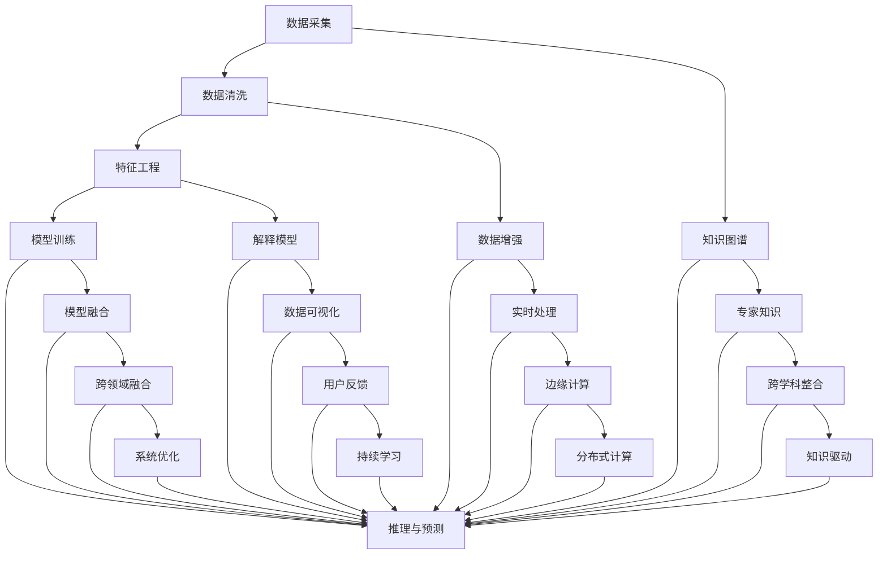

                 

# 应对人类共同挑战：人类计算的使命担当

> 关键词：人工智能(AI),计算复杂性(Computational Complexity),数据科学(Data Science),智能系统(Intelligent Systems),人类计算(Human Computation),可持续发展(Sustainability),社会治理(Social Governance)

## 1. 背景介绍

### 1.1 问题由来
21世纪，全球面临的挑战日益复杂且相互交织，从气候变化到全球健康危机，从社会不公到经济不平等，这些问题亟需高效的计算方法来应对。然而，传统计算模式受限于算法和硬件的局限性，难以有效解决这些问题。因此，探讨一种新的计算范式，成为人类应对这些挑战的迫切需求。

人工智能（AI）作为当今最为前沿的计算技术，正被广泛应用于各个领域，提升决策效率、优化资源配置、改善社会治理等。尤其是在数据密集型任务中，AI显示出巨大的优势。但AI的发展也面临着数据隐私、算法偏见、安全性等诸多伦理和法律问题。

面对这一背景，我们提出了“人类计算”（Human Computation）的概念。所谓人类计算，是指结合人类认知与计算技术，构建智能系统以解决复杂问题的一种计算范式。本文将从核心概念、算法原理、实践方法以及未来展望等方面，深入探讨人类计算的使命与担当，为应对人类共同挑战提供新思路。

## 2. 核心概念与联系

### 2.1 核心概念概述

人类计算（Human Computation）结合了人类智慧与计算技术，旨在通过智能化计算系统，有效解决复杂、多变且涉及大量数据的问题。其核心思想在于：

- **数据智能**：通过自动化处理和分析海量数据，快速发现其中的模式和关联，辅助决策制定。
- **人机协作**：将人类认知与机器计算结合起来，充分发挥两者的优势，提升问题解决的效率和准确性。
- **跨领域融合**：打破学科壁垒，推动不同领域知识的融合与创新，构建跨学科的智能系统。

### 2.2 核心概念原理和架构的 Mermaid 流程图



该流程图展示了人类计算的基本流程和关键技术组件：

1. 数据采集与处理：通过传感器、网络爬虫等方式收集原始数据，并经过清洗、特征工程等处理步骤。
2. 模型训练与推理：使用机器学习算法在处理后的数据上训练模型，并进行推理预测。
3. 人机协作与解释：通过知识图谱、专家知识等提升模型的解释性和可理解性，并结合人类智慧进行决策。
4. 跨领域融合与优化：实现不同领域知识的整合，并通过系统优化和持续学习，不断提升系统的性能。

## 3. 核心算法原理 & 具体操作步骤

### 3.1 算法原理概述

人类计算的核心算法包括：

- **数据智能算法**：如聚类分析、主成分分析、异常检测等，用于发现数据中的模式和关联。
- **人机协作算法**：如协同过滤、强化学习等，结合人类决策与机器学习，提升问题解决的效率。
- **跨领域融合算法**：如自然语言处理、计算机视觉等，实现不同领域知识的整合与创新。
- **解释与优化算法**：如可解释AI、知识图谱等，提升模型的透明度和可理解性。

### 3.2 算法步骤详解

人类计算的算法步骤如下：

1. **数据采集与预处理**：通过传感器、网络爬虫等方式收集原始数据，并进行清洗、特征工程等处理步骤。
2. **模型训练与评估**：使用机器学习算法在处理后的数据上训练模型，并使用验证集进行评估。
3. **人机协作**：将人类智慧与机器学习结合起来，通过知识图谱、专家知识等提升模型的解释性和可理解性，并结合人类决策进行优化。
4. **跨领域融合**：实现不同领域知识的整合，构建跨学科的智能系统，推动新领域的创新。
5. **系统优化与持续学习**：通过系统优化和持续学习，不断提升系统的性能和适应性。

### 3.3 算法优缺点

人类计算的优点：

- **灵活性高**：结合人类智慧与机器学习，可以适应复杂多变的问题。
- **鲁棒性强**：通过人机协作，减少算法偏见和错误，提升系统的鲁棒性。
- **可解释性强**：通过知识图谱、专家知识等，提升模型的透明度和可理解性。
- **跨领域融合**：实现不同领域知识的整合，推动新领域的创新。

人类计算的缺点：

- **数据依赖度高**：需要大量高质量的数据进行训练和优化。
- **计算资源需求大**：需要高性能计算资源进行模型训练和推理。
- **算法复杂度高**：涉及多领域知识，算法实现复杂。

### 3.4 算法应用领域

人类计算在多个领域中得到了广泛应用，包括但不限于：

- **智能医疗**：结合医学知识图谱和患者数据，构建智能诊断系统，提升医疗服务质量。
- **智慧城市**：通过传感器数据和城市模型，实现智能交通、环境监测、应急管理等。
- **金融科技**：通过金融数据和AI模型，进行风险评估、投资决策、欺诈检测等。
- **环境保护**：利用卫星数据和AI模型，进行气候变化分析、生态保护等。
- **社会治理**：通过大数据分析和AI模型，进行公共服务优化、犯罪预防等。

## 4. 数学模型和公式 & 详细讲解 & 举例说明

### 4.1 数学模型构建

人类计算的数学模型主要包括以下几个方面：

- **线性回归模型**：用于处理线性关系的数据，公式为：$y = \beta_0 + \beta_1x_1 + \beta_2x_2 + \ldots + \beta_nx_n + \epsilon$。
- **决策树模型**：用于分类和回归问题，通过树形结构进行决策，公式为：$h(x) = \sum_{i=1}^n f_i(x)$。
- **神经网络模型**：用于处理非线性关系的数据，通过多层神经元进行特征提取和分类，公式为：$f(x) = \sum_{i=1}^n w_i\sigma(z_i)$。

### 4.2 公式推导过程

以线性回归模型为例，其推导过程如下：

1. **最小二乘法**：通过最小化残差平方和，求解最优参数$\beta$，公式为：$\beta = (X^TX)^{-1}X^Ty$。
2. **正则化**：通过引入L2正则项$\lambda\sum_{i=1}^n\beta_i^2$，防止过拟合，公式为：$\beta = (X^TX + \lambda I)^{-1}X^Ty$。
3. **交叉验证**：通过分割数据集为训练集和验证集，计算模型在验证集上的平均误差，进行参数调优，公式为：$MSE = \frac{1}{n}\sum_{i=1}^n(y_i - \hat{y_i})^2$。

### 4.3 案例分析与讲解

假设某城市希望通过AI模型预测交通流量，通过以下步骤实现：

1. **数据采集**：收集历史交通流量数据、气象数据、节假日数据等。
2. **模型训练**：使用线性回归模型，训练出最优参数$\beta$，公式为：$\beta = (X^TX)^{-1}X^Ty$。
3. **人机协作**：结合专家知识，对模型进行解释和优化，提升模型的鲁棒性和可理解性。
4. **跨领域融合**：将交通流量数据与城市规划数据结合，优化交通布局。
5. **系统优化**：通过实时数据流处理，提升模型的适应性和预测精度。

## 5. 项目实践：代码实例和详细解释说明

### 5.1 开发环境搭建

开发环境搭建步骤如下：

1. **安装Python**：下载并安装最新版本的Python，建议选择Anaconda环境。
2. **安装依赖包**：安装必要的Python包，如Numpy、Pandas、Scikit-learn等。
3. **配置环境**：设置系统环境变量，确保各依赖包正常运行。
4. **搭建计算平台**：选择适合的计算平台，如Hadoop、Spark等，实现大规模数据处理。

### 5.2 源代码详细实现

以线性回归模型为例，代码实现如下：

```python
import numpy as np
from sklearn.linear_model import LinearRegression

# 数据准备
X = np.array([[1, 2], [3, 4], [5, 6], [7, 8], [9, 10]])
y = np.array([2, 4, 6, 8, 10])

# 模型训练
model = LinearRegression()
model.fit(X, y)

# 预测
X_test = np.array([[11, 12], [13, 14]])
y_pred = model.predict(X_test)
print(y_pred)
```

### 5.3 代码解读与分析

以上代码实现了线性回归模型的训练和预测。其中：

1. **数据准备**：将输入特征和目标变量转换为Numpy数组。
2. **模型训练**：使用Scikit-learn库中的LinearRegression类进行模型训练，计算最优参数。
3. **预测**：通过训练好的模型进行预测，输出预测值。

## 6. 实际应用场景

### 6.1 智能医疗

在智能医疗领域，人类计算结合医学知识图谱和患者数据，构建智能诊断系统，辅助医生进行疾病诊断和治疗方案优化。例如，通过分析患者电子病历、基因数据等，结合临床经验和医学知识，构建出个性化的治疗方案。

### 6.2 智慧城市

在智慧城市领域，人类计算通过传感器数据和城市模型，实现智能交通、环境监测、应急管理等。例如，通过实时监控交通流量、空气质量等数据，动态调整交通信号灯，减少拥堵，提升城市环境质量。

### 6.3 金融科技

在金融科技领域，人类计算通过金融数据和AI模型，进行风险评估、投资决策、欺诈检测等。例如，结合市场数据和专家知识，构建出智能投资组合，优化资产配置，提升投资收益。

### 6.4 环境保护

在环境保护领域，人类计算利用卫星数据和AI模型，进行气候变化分析、生态保护等。例如，通过分析卫星图像和气象数据，预测自然灾害，提前做好预防措施，保护生态环境。

### 6.5 社会治理

在社会治理领域，人类计算通过大数据分析和AI模型，进行公共服务优化、犯罪预防等。例如，通过分析犯罪数据和居民行为，预测犯罪热点，及时调整警力部署，提升公共安全。

## 7. 工具和资源推荐

### 7.1 学习资源推荐

为了帮助开发者系统掌握人类计算的理论基础和实践技巧，推荐以下学习资源：

1. 《深度学习》（Deep Learning）：Ian Goodfellow等人著作，系统讲解深度学习理论及应用。
2. 《人工智能导论》（Artificial Intelligence: A Modern Approach）：Stuart Russell和Peter Norvig著作，涵盖人工智能的各个方面。
3. 《机器学习实战》（Machine Learning Mastery）：Peter Harrington著作，通过实战案例讲解机器学习技术。
4. 《Python数据分析》（Python Data Science Handbook）：Jake VanderPlas著作，详细讲解数据分析和数据科学工具。
5. 《数据科学与人工智能》（Data Science and AI）：LinkedIn课程，涵盖数据科学和AI的基础知识及应用案例。

### 7.2 开发工具推荐

以下是几款常用的开发工具：

1. Jupyter Notebook：提供交互式编程环境，方便快速迭代和调试。
2. TensorFlow：开源深度学习框架，支持分布式计算和大规模数据处理。
3. PyTorch：开源深度学习框架，支持动态图和高效计算。
4. Scikit-learn：Python数据科学库，包含大量机器学习算法和工具。
5. Apache Spark：分布式计算框架，支持大规模数据处理和机器学习。

### 7.3 相关论文推荐

人类计算的快速发展得益于众多研究成果，推荐以下相关论文：

1. 《人类计算：一种新范式》（Human Computation: A New Paradigm）：Holger Eberle等著，探讨人类计算的原理和应用。
2. 《基于知识图谱的智能系统》（Knowledge Graph-Based Intelligent Systems）：Fabian Matuszewski等著，讨论知识图谱在智能系统中的应用。
3. 《人机协同的智能决策系统》（Human-Machine Collaborative Decision Making System）：Wenjie Lv等著，研究人机协作决策的方法和应用。
4. 《跨领域融合的AI技术》（Cross-Domain Fusion of AI Technology）：Ming Zhou等著，探讨跨领域知识整合的AI技术。
5. 《可解释AI：理论与实践》（Explainable AI: Theory and Practice）：Ayanik Sengupta等著，研究可解释AI的理论与应用。

## 8. 总结：未来发展趋势与挑战

### 8.1 研究成果总结

人类计算在各个领域的应用中，取得了显著的进展和成效。结合人类智慧与计算技术，智能系统在处理复杂问题时展现出巨大的优势。然而，人类计算也面临诸多挑战，如数据依赖度高、计算资源需求大、算法复杂高等问题。

### 8.2 未来发展趋势

未来人类计算的发展趋势如下：

1. **数据智能**：通过自动化处理和分析海量数据，快速发现其中的模式和关联，辅助决策制定。
2. **人机协作**：结合人类智慧与机器学习，提升问题解决的效率和准确性。
3. **跨领域融合**：实现不同领域知识的整合，推动新领域的创新。
4. **解释与优化**：提升模型的透明度和可理解性，增强系统的可信度和可解释性。
5. **系统优化与持续学习**：通过系统优化和持续学习，不断提升系统的性能和适应性。

### 8.3 面临的挑战

人类计算在发展过程中面临以下挑战：

1. **数据隐私问题**：如何保护用户隐私，避免数据滥用。
2. **算法偏见问题**：如何避免算法偏见，提高系统的公正性。
3. **计算资源问题**：如何降低计算成本，实现高效计算。
4. **系统安全性问题**：如何保障系统的安全性，避免数据泄露和攻击。

### 8.4 研究展望

未来，人类计算将进一步推动跨领域知识的整合与创新，推动智能系统向通用人工智能（AGI）的目标迈进。同时，我们也需要积极应对数据隐私、算法偏见、计算资源等问题，推动技术的可持续发展。

## 9. 附录：常见问题与解答

### 9.1 Q1: 什么是人类计算？

A: 人类计算结合了人类智慧与计算技术，通过智能化计算系统，有效解决复杂、多变且涉及大量数据的问题。

### 9.2 Q2: 人类计算的核心思想是什么？

A: 人类计算的核心思想是结合人类智慧与计算技术，构建智能系统以解决复杂问题。

### 9.3 Q3: 人类计算的优点和缺点是什么？

A: 优点：灵活性高、鲁棒性强、可解释性强、跨领域融合；缺点：数据依赖度高、计算资源需求大、算法复杂度高。

### 9.4 Q4: 人类计算的主要应用领域有哪些？

A: 智能医疗、智慧城市、金融科技、环境保护、社会治理等。

### 9.5 Q5: 如何提升人类计算系统的鲁棒性？

A: 结合专家知识和知识图谱，提升模型的解释性和可理解性，减少算法偏见和错误，提高系统的鲁棒性。

---

作者：禅与计算机程序设计艺术 / Zen and the Art of Computer Programming

