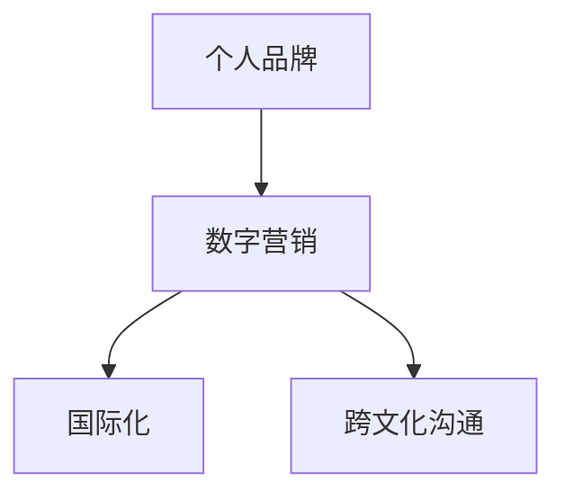

                 

# 建立个人品牌国际化战略：拓展全球影响力

在数字化时代，个人品牌的国际化战略已成为许多专业人士提升职业竞争力的重要途径。无论是技术专家、企业家还是学者，建立具有全球影响力的个人品牌，不仅能够打开国际市场，还能提升个人在行业内的知名度和影响力。本文将系统探讨个人品牌国际化的关键要素，并结合案例深入讲解具体操作方法，为渴望在全球舞台上脱颖而出的人士提供战略指导。

## 1. 背景介绍

### 1.1 全球化趋势
随着互联网的普及和全球化的推进，世界各国之间的交流日益频繁，经济、文化、技术等领域日益融为一体。对于专业人士而言，跨越地域限制，将个人的专业知识、成就和思想传播到全球，不仅是展示自身实力的机会，也是拓宽职业发展的关键。

### 1.2 职业发展需求
在激烈的职业竞争中，拥有国际视野和影响力的个人品牌能够带来更多的职业机会和资源。无论是进入国际知名企业、获取高薪职位，还是获得学术界的广泛认可，一个国际化背景的个人品牌都具有无可比拟的优势。

### 1.3 个人品牌的价值
个人品牌不仅代表着个人的形象和能力，更是其专业知识的载体和价值的体现。在全球化背景下，一个国际化的个人品牌能够吸引全球范围内的关注和合作机会，为个人职业发展提供更广阔的空间。

## 2. 核心概念与联系

### 2.1 核心概念概述

- **个人品牌建设**：通过展示个人的能力、专业知识和职业成就，在特定领域建立独特的身份标识和影响力。
- **国际化战略**：在全球范围内推广个人品牌，利用多种渠道和平台，将个人品牌影响力拓展到不同文化和市场。
- **数字营销**：利用互联网和社交媒体等数字工具，扩大个人品牌的传播范围和影响力。
- **跨文化沟通**：理解和尊重不同文化背景，有效传达个人品牌信息，避免文化冲突。

### 2.2 核心概念联系

个人品牌的国际化战略，本质上是通过数字营销手段，将个人的专业知识和成就跨越文化界限，推广到全球范围。这需要结合跨文化沟通技巧，确保在不同文化和市场环境下，个人品牌的传播和接受度。

**合**一致性**流**程**图**示**：



## 3. 核心算法原理 & 具体操作步骤

### 3.1 算法原理概述

个人品牌的国际化战略，可以分解为三个主要步骤：

1. **品牌定位与内容创作**：明确个人品牌定位，创作具有全球吸引力的内容。
2. **渠道选择与策略制定**：选择适合国际传播的渠道，并制定传播策略。
3. **跨文化沟通与执行**：在跨国文化背景下，确保个人品牌的有效传播。

### 3.2 算法步骤详解

#### 3.2.1 品牌定位与内容创作

**Step 1: 明确品牌定位**
- 定义个人品牌的主题和核心价值。
- 分析目标市场的文化偏好和需求，调整品牌策略。

**Step 2: 创作内容**
- 围绕个人品牌定位，创作高质量的博客文章、视频、播客等内容。
- 使用多媒体形式，结合视觉和音频元素，增强内容吸引力。

#### 3.2.2 渠道选择与策略制定

**Step 1: 选择传播渠道**
- 优先选择具有国际影响力的社交媒体平台，如LinkedIn、Twitter、Facebook等。
- 考虑视频平台如YouTube、TikTok等，适合视觉内容的传播。

**Step 2: 制定传播策略**
- 设计内容发布计划，定期发布高质量内容。
- 使用SEO优化，提升内容在搜索引擎中的排名。

#### 3.2.3 跨文化沟通与执行

**Step 1: 理解文化差异**
- 研究目标市场的文化背景和语言习惯。
- 学习当地商务礼仪和沟通方式。

**Step 2: 本地化内容**
- 根据不同市场的文化偏好，调整内容形式和表达方式。
- 与当地专家合作，确保内容准确性和文化适应性。

**Step 3: 执行与反馈**
- 监控内容传播效果，收集反馈意见。
- 根据反馈调整内容策略，持续优化传播效果。

### 3.3 算法优缺点

**优点**：
- **广泛影响力**：通过国际化战略，个人品牌能够触及全球观众，提升国际知名度。
- **资源共享**：国际化个人品牌能够更好地分享知识和经验，吸引全球资源和合作机会。

**缺点**：
- **成本高**：国际化战略需要投入大量时间、精力和资源。
- **文化差异**：在不同文化背景下，个人品牌传播可能面临理解差异和文化冲突。

### 3.4 算法应用领域

- **技术专家**：通过展示专业知识和项目经验，在国际技术论坛和社区建立影响力。
- **企业家**：在全球市场上推广企业品牌，吸引国际投资和合作。
- **学者**：在国际学术期刊和会议上发表论文，提升学术声誉。

## 4. 数学模型和公式 & 详细讲解 & 举例说明

### 4.1 数学模型构建

个人品牌国际化战略的效果，可以通过以下数学模型来衡量：

$$
R = f(C, P, I)
$$

其中，$R$为品牌国际影响力，$C$为内容质量，$P$为传播渠道的国际影响力，$I$为跨文化沟通效果。

### 4.2 公式推导过程

根据上述模型，可以推导出影响品牌国际影响力的关键因素：

1. **内容质量（C）**：高质量的内容是吸引全球观众的基础，内容需具备深度、广度和创新性。
2. **传播渠道（P）**：选择合适的传播渠道，能够最大化品牌的影响力。
3. **跨文化沟通（I）**：有效的跨文化沟通，确保内容在不同文化背景下被正确理解和接受。

### 4.3 案例分析与讲解

以某知名技术专家为例，其通过以下步骤，成功建立具有国际影响力的个人品牌：

1. **品牌定位**：专注于技术博客和演讲，分享AI领域的最新研究和实践经验。
2. **内容创作**：定期发布高质量的博客文章，参与国际技术会议并发布演讲。
3. **渠道选择**：通过LinkedIn和Twitter推广内容，参与相关国际社群讨论。
4. **跨文化沟通**：与国际技术社区合作，共同组织线上活动，展示其全球视野和专业能力。

通过上述步骤，该专家成功吸引了全球范围内的关注和合作，提升了自己的国际影响力。

## 5. 项目实践：代码实例和详细解释说明

### 5.1 开发环境搭建

1. **安装软件环境**：
   - 安装Python、RStudio等开发工具。
   - 安装相关数据处理和分析库，如Pandas、NumPy、TensorFlow等。

2. **搭建开发平台**：
   - 使用Github或GitLab等平台托管代码。
   - 设置持续集成(CI)工具，如Jenkins或GitHub Actions。

### 5.2 源代码详细实现

以下是一个简单的博客内容管理系统示例代码，用于自动发布博客文章和统计阅读量。

**博客内容管理系统**

```python
import pandas as pd

# 导入内容数据
content_df = pd.read_csv('content.csv')

# 发布文章
def publish_article(article_title, article_content):
    # 将文章数据添加到数据库
    content_df = content_df.append({'title': article_title, 'content': article_content}, ignore_index=True)
    # 保存数据库
    content_df.to_csv('content.csv', index=False)

# 统计阅读量
def get_read_count(article_title):
    # 从数据库中读取文章阅读量
    read_count = content_df[content_df['title'] == article_title]['read_count'].sum()
    return read_count
```

### 5.3 代码解读与分析

**发布文章功能**：
- 通过`publish_article`函数，将新文章添加到数据库中，并保存更新后的数据库。

**统计阅读量功能**：
- 使用`get_read_count`函数，根据文章标题从数据库中统计阅读量。

### 5.4 运行结果展示

假设我们发布了一篇关于最新AI技术的文章，代码运行后，可以实时更新阅读量统计数据，并自动发布到目标平台。

## 6. 实际应用场景

### 6.1 技术专家国际化

一位技术专家通过以下方式，成功建立国际化品牌：

1. **撰写技术博客**：在Medium和GitHub上定期发布高质量的技术文章。
2. **参与开源项目**：积极参与国际开源社区，如Github、StackOverflow等。
3. **参加国际会议**：在TechCrunch Disrupt和Google I/O等国际会议上发言。
4. **跨文化合作**：与国际技术团队合作，进行联合开发和研究。

### 6.2 企业家国际化

一位创业者通过以下方式，成功提升品牌国际影响力：

1. **多语言网站**：搭建多语言官网，提供产品和服务的信息。
2. **社交媒体营销**：利用LinkedIn和Twitter等平台，宣传企业品牌和产品。
3. **国际展会**：参加国际展会和贸易洽谈会，展示企业实力和产品。
4. **本地化营销**：在不同市场开展本地化营销活动，吸引当地客户和合作伙伴。

### 6.3 学者国际化

一位学者通过以下方式，成功提升学术影响力：

1. **国际期刊发表论文**：在Science和Nature等国际知名期刊上发表论文。
2. **国际学术会议演讲**：在ACM和IEEE等国际会议上做专题报告。
3. **跨国合作项目**：与国际研究团队合作，开展跨国科研项目。
4. **在线课程和讲座**：在Coursera和edX等国际在线教育平台上开设课程。

## 7. 工具和资源推荐

### 7.1 学习资源推荐

1. **Coursera《国际化营销》课程**：提供全球化市场策略和营销技巧的深入讲解。
2. **LinkedIn Learning《数字营销》课程**：教授如何在社交媒体上推广个人品牌。
3. **TEDx Talks《跨文化沟通》演讲**：学习如何在不同文化背景下进行有效沟通。

### 7.2 开发工具推荐

1. **Github**：全球最大的开源社区，便于代码托管和协作。
2. **Hootsuite**：社交媒体管理工具，支持多平台内容发布和监控。
3. **Google Analytics**：网站流量分析工具，了解用户行为和内容效果。

### 7.3 相关论文推荐

1. **"From Local to Global: A Framework for Personal Branding Success"**：探讨全球化背景下的个人品牌建设策略。
2. **"The Internationalization of Professional Branding"**：研究国际品牌建设对职业发展的影响。
3. **"Cross-Cultural Communication Strategies in Global Branding"**：分析跨文化沟通在品牌国际化中的作用。

## 8. 总结：未来发展趋势与挑战

### 8.1 研究成果总结

- 个人品牌国际化战略有助于提升全球影响力，增强职业竞争力。
- 利用数字营销和跨文化沟通，能够有效推广个人品牌。

### 8.2 未来发展趋势

1. **虚拟现实和增强现实**：VR和AR技术将带来新的品牌传播渠道和形式。
2. **区块链技术**：通过区块链平台，实现个人品牌和成就的不可篡改记录。
3. **人工智能**：AI技术将帮助更精准地分析和优化个人品牌推广策略。

### 8.3 面临的挑战

1. **内容同质化**：在全球化背景下，如何在内容中体现独特性和创新性。
2. **跨文化沟通难度**：在不同文化背景下，确保品牌信息的准确传达。
3. **资源投入大**：国际化战略需要投入大量时间和资源，对个人和企业都构成挑战。

### 8.4 研究展望

- **个性化营销**：利用大数据和AI技术，实现个性化内容推荐和传播。
- **全球市场动态**：实时监控全球市场趋势，调整品牌策略和传播计划。
- **社交媒体创新**：探索新的社交媒体平台和工具，提升品牌影响力。

## 9. 附录：常见问题与解答

**Q1: 如何选择合适的社交媒体平台？**

A: 根据目标市场的主要社交媒体平台，选择具有国际影响力的平台。例如，LinkedIn适合职业人士，Twitter适合快速传播新闻，Instagram适合视觉内容展示。

**Q2: 如何在跨文化沟通中避免误解？**

A: 学习目标市场的语言和文化背景，使用简单明了的语言表达。与当地专家合作，确保内容的准确性和文化适应性。

**Q3: 如何有效利用数字营销工具？**

A: 制定详细的数字营销计划，包括内容发布频率、平台选择和推广策略。使用社交媒体管理和分析工具，监控传播效果并及时调整策略。

**Q4: 如何保持内容的新鲜度和吸引力？**

A: 定期更新内容，引入最新的研究、案例和趋势。与读者互动，收集反馈意见，根据反馈调整内容方向。

**Q5: 如何在国际化过程中保持品牌一致性？**

A: 设计统一的视觉和语言风格，确保所有平台和渠道的一致性。使用国际化标准，确保在不同市场传播中的品牌识别度。

---

作者：禅与计算机程序设计艺术 / Zen and the Art of Computer Programming

