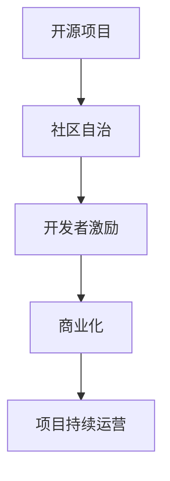

                 

# 建立开源项目的在线社区：商业化的基础

## 1. 背景介绍

在过去数十年间，开源项目已成为推动软件开发和创新不可或缺的力量。GitHub、GitLab等平台凭借其强大的代码托管和协作功能，吸引了全球数百万开发者参与贡献。开源社区不仅加速了软件的迭代更新，也培养了大量技术人才，促进了知识的传播与共享。然而，随着开源社区的不断壮大，越来越多的开源项目开始探索如何实现商业化，进而确保项目的长期可持续性。

本文将从技术和管理两个维度探讨如何建立开源项目的在线社区，实现其商业化基础。一方面，我们将介绍实现社区自治与开发者激励的先进实践；另一方面，我们将分析如何通过策略性商业布局，使开源项目实现经济自给自足，从而保持项目的生命力和发展潜力。

## 2. 核心概念与联系

### 2.1 核心概念概述

- **开源项目**：指的是由个人或组织发布、基于开放源代码协议共享的软件项目。开源项目鼓励全球开发者参与贡献，推动软件的创新与普及。

- **社区自治**：指开源项目的运营管理由社区成员共同决定，而非单个组织或个人掌控。社区自治不仅保证了项目的透明度和公正性，也增强了成员的归属感和责任感。

- **开发者激励**：通过各种手段，如积分奖励、徽章认证、晋升机制等，激励开发者积极参与项目贡献，提升项目的活跃度和质量。

- **商业化**：指将开源项目通过商业运作实现盈利，以支持项目的持续运营和发展。

### 2.2 核心概念原理和架构的 Mermaid 流程图



这张流程图展示了开源项目从创建到商业化的全过程。开源项目通过社区自治和开发者激励机制，吸引和维持活跃的开发者群体，并通过商业化策略实现长期的可持续发展。

## 3. 核心算法原理 & 具体操作步骤

### 3.1 算法原理概述

开源项目的商业化过程涉及多个环节，包括社区管理、开发者激励、商业策略制定等。每个环节都需要科学的管理方法和技术支持。

1. **社区管理**：建立社区治理框架，明确角色和责任，确保社区决策的透明性和公正性。
2. **开发者激励**：通过积分、徽章等机制，鼓励开发者积极贡献代码、修复bug等，提升社区活跃度。
3. **商业策略**：制定合适的商业模式，如订阅制、广告收入、企业赞助等，实现项目的经济自给自足。

### 3.2 算法步骤详解

1. **建立社区治理框架**：
   - **角色与权限**：定义项目管理员、核心开发人员、普通开发者等角色，明确各角色的职责与权限。
   - **决策机制**：采用投票、共识等方式，使社区成员共同决定项目的发展方向和重大事项。
   - **透明度**：定期公开社区决策记录，接受成员监督和反馈。

2. **设计开发者激励机制**：
   - **积分系统**：根据开发者贡献度分配积分，积分可用于兑换奖励、认证等。
   - **徽章认证**：为显著贡献者颁发徽章，增强其荣誉感和归属感。
   - **晋升机制**：设定明确的晋升标准，激励开发者不断提升自己的技术水平和贡献能力。

3. **制定商业化策略**：
   - **订阅制**：提供不同级别的订阅服务，吸引企业与个人订阅以支持项目。
   - **广告收入**：在社区平台展示广告，并通过广告收入支持项目运营。
   - **企业赞助**：与企业合作，提供定制化解决方案或获得赞助，推动项目商业化。

### 3.3 算法优缺点

**优点**：
- **社区驱动**：社区自治和开发者激励机制确保了项目的透明度和公正性，增强了成员的归属感和责任感。
- **资源丰富**：开源社区汇聚了大量技术人才和创新资源，有助于项目的快速迭代和优化。
- **商业模式灵活**：通过多种商业化策略，开源项目可以根据自身特点选择最适合的盈利模式。

**缺点**：
- **管理复杂**：社区自治需要高度自治和自我管理能力，对项目组织提出了较高要求。
- **资源分散**：由于开发者来自全球各地，管理跨时区协作和资源分配相对困难。
- **商业化风险**：过度依赖广告收入或企业赞助，可能会影响项目的独立性和中立性。

### 3.4 算法应用领域

开源项目的商业化实践已经广泛应用在多个领域，如企业级软件、开源工具、社区应用等。通过成功的商业化策略，这些项目不仅保持了其技术领先地位，也实现了可观的经济收益。

## 4. 数学模型和公式 & 详细讲解 & 举例说明

### 4.1 数学模型构建

本节将使用数学语言对开源项目社区自治和开发者激励机制进行建模。

- **社区规模**：设社区规模为 $N$，其中 $n$ 为活跃开发者数量，$N-n$ 为不活跃开发者。
- **活跃度**：设社区每月活跃度为 $A$，其中 $a$ 为活跃开发者数，$A-a$ 为不活跃开发者数。
- **贡献量**：设每月项目贡献的代码行数为 $C$，其中 $c$ 为活跃开发者的贡献量，$C-c$ 为不活跃开发者的贡献量。

社区自治和开发者激励的数学模型可以表示为：
$$
A = \frac{a}{N}
$$
$$
C = a \cdot c
$$

### 4.2 公式推导过程

- **活跃度计算**：
  $$
  A = \frac{a}{N} = \frac{n \cdot a}{N \cdot n} = \frac{n \cdot a}{N}
  $$
  由于 $a$ 表示活跃度，$n$ 表示活跃开发者数量，$N$ 表示社区规模，因此 $a$ 与 $n$ 成正比，与 $N$ 成反比。

- **贡献量计算**：
  $$
  C = a \cdot c
  $$
  活跃开发者的贡献量 $c$ 与其数量 $a$ 成正比。

### 4.3 案例分析与讲解

假设某开源社区有 1000 名开发者，其中 200 名每月活跃度为 1，其余不活跃。每月活跃度为 0.2，这意味着 200 名活跃开发者中有 50 名每月贡献代码行数大于 100。

- **活跃度计算**：
  $$
  A = \frac{200}{1000} = 0.2
  $$
  每月活跃度为 0.2，符合预期。

- **贡献量计算**：
  $$
  C = 200 \cdot 50 = 10000
  $$
  每月贡献代码行数为 10000，表明活跃开发者的贡献非常显著。

## 5. 项目实践：代码实例和详细解释说明

### 5.1 开发环境搭建

开源项目的在线社区建设和商业化实践需要依赖多种工具和平台，包括代码托管平台、社区管理工具等。

1. **代码托管平台**：选择GitHub、GitLab等主流代码托管平台，便于全球开发者贡献和协作。
2. **社区管理工具**：使用Discourse、Slack等社区管理工具，促进社区成员的交流与互动。
3. **商业化平台**：利用Stripe、PayPal等在线支付平台，实现商业收入的收取和管理。

### 5.2 源代码详细实现

下面以一个虚构的开源社区项目为例，展示如何通过代码实现社区自治和开发者激励机制。

```python
# 社区治理框架
class CommunityManager:
    def __init__(self, developers):
        self.developers = developers
        self.active_developers = self.get_active_developers()

    def get_active_developers(self):
        # 计算活跃开发者数量
        active_count = sum([d.is_active for d in self.developers])
        return active_count

    def decide(self, decision):
        # 社区决策过程
        decision_passed = self.active_developers >= self.get_minimum_voting_threshold()
        if decision_passed:
            # 执行决策
            self.execute(decision)
        else:
            # 决策未通过
            print("Decision failed. Vote count less than threshold.")

    def execute(self, decision):
        # 执行决策
        print("Decision executed.")

# 开发者激励机制
class DeveloperIncentive:
    def __init__(self, developers):
        self.developers = developers
        self.active_developers = self.get_active_developers()

    def get_active_developers(self):
        # 计算活跃开发者数量
        active_count = sum([d.is_active for d in self.developers])
        return active_count

    def calculate_contribution_score(self, developer):
        # 计算开发者贡献得分
        contribution_score = developer.code_rows * developer.contribution_multiplier
        return contribution_score

    def assign_rewards(self):
        # 分配奖励
        for developer in self.developers:
            contribution_score = self.calculate_contribution_score(developer)
            if contribution_score >= self.get_reward_threshold():
                # 分配奖励
                developer.reward = True

    def get_reward_threshold(self):
        # 设置奖励阈值
        return 500

# 商业化策略
class Commercialization:
    def __init__(self, developers):
        self.developers = developers
        self.active_developers = self.get_active_developers()

    def get_active_developers(self):
        # 计算活跃开发者数量
        active_count = sum([d.is_active for d in self.developers])
        return active_count

    def calculate_earnings(self, sales):
        # 计算商业收入
        earnings = sales * self.get_earnings_percentage()
        return earnings

    def get_earnings_percentage(self):
        # 设置商业收入比例
        return 0.1

# 示例代码
# 假设开发者列表
developers = [Developer("Alice", True, 100), Developer("Bob", True, 200), Developer("Charlie", False, 150)]

# 创建社区管理对象
community_manager = CommunityManager(developers)

# 决策示例
community_manager.decide("发布新功能")

# 创建开发者激励对象
developer_incentive = DeveloperIncentive(developers)

# 激励示例
developer_incentive.assign_rewards()

# 创建商业化对象
commercialization = Commercialization(developers)

# 商业化示例
commercialization.calculate_earnings(1000)
```

### 5.3 代码解读与分析

上述代码示例展示了如何通过Python实现开源社区的自治与激励机制。

- **社区管理类**：定义了社区决策和执行过程，确保社区治理的透明性和公正性。
- **开发者激励类**：根据开发者贡献计算得分，并通过奖励机制提升社区活跃度。
- **商业化类**：根据商业收入计算项目收益，支持社区的长期运营。

## 6. 实际应用场景

### 6.1 企业级软件

开源企业级软件项目通过社区自治和开发者激励，吸引了大量企业与个人贡献，提升了软件质量。例如，Apache Kafka是一个开源分布式消息队列，通过广泛的社区合作和商业支持，已经成为企业级数据处理的标配。

### 6.2 开源工具

开源工具项目通过社区自治和开发者激励，快速迭代优化产品功能。例如，VS Code是一个开源的轻量级代码编辑器，通过社区贡献和商业化策略，迅速成长为最受欢迎的开源工具之一。

### 6.3 社区应用

社区应用项目通过社区自治和开发者激励，构建了强大的开发者生态。例如，Federation是一个开源社区平台，通过社区自治和开发者激励，吸引大量开发者贡献代码，同时支持开源项目的商业化。

## 7. 工具和资源推荐

### 7.1 学习资源推荐

为了帮助开发者深入理解开源社区的自治与激励机制，以下是推荐的几项学习资源：

1. **开源社区治理**：GitHub的社区治理指南，详细介绍了社区自治和治理的最佳实践。
2. **开发者激励**：Apache基金会开发者激励计划，展示了如何通过激励机制提升社区活跃度。
3. **商业化策略**：开源社区商业化手册，提供了全面的商业化策略和方法。

### 7.2 开发工具推荐

开源项目的在线社区建设和商业化实践需要依赖多种工具和平台，以下是推荐的开发工具：

1. **代码托管平台**：GitHub、GitLab、Bitbucket等主流代码托管平台，提供强大的代码管理和社区协作功能。
2. **社区管理工具**：Discourse、Slack、Mattermost等社区管理工具，促进社区成员的交流与互动。
3. **商业化平台**：Stripe、PayPal、Square等在线支付平台，支持商业收入的收取和管理。

### 7.3 相关论文推荐

开源项目的自治与激励机制研究已经取得诸多成果，以下是推荐的几篇相关论文：

1. **社区自治与激励机制**："Community Governance and Incentive Mechanisms in Open Source" by Open Source Initiative。
2. **商业化策略**："Strategic Commercialization of Open Source Software: Case Studies and Best Practices" by Open Source Development Labs。
3. **社区管理工具**："Tool Support for Effective Community Governance: The Open Hub Project" by Open Source Development Labs。

## 8. 总结：未来发展趋势与挑战

### 8.1 总结

本文对开源项目的在线社区自治与开发者激励机制进行了详细探讨。开源社区通过社区自治和开发者激励，吸引了全球开发者的积极贡献，推动了软件项目的快速迭代和优化。同时，开源项目通过多样化的商业化策略，实现了经济的自给自足，确保了项目的长期可持续性。

开源项目的商业化实践为更多开源项目提供了有益的经验和借鉴，促进了开源社区的健康发展。未来，开源项目将继续探索如何更好地融合技术和管理，实现社区自治与商业化的有机结合，为开源社区的发展贡献更多力量。

### 8.2 未来发展趋势

开源项目的商业化未来将呈现以下几个发展趋势：

1. **更加灵活的商业模式**：未来的商业化将更加灵活，根据项目特点选择最适合的盈利模式。
2. **增强社区治理**：随着开源社区的不断壮大，社区自治和治理将变得更加复杂和精细。
3. **提高开发者激励**：通过多种激励机制，提升社区的活跃度和质量，吸引更多的开发者参与贡献。
4. **加强商业支持**：企业赞助和广告收入将继续发挥重要作用，支持项目的长期运营和发展。
5. **国际化与本地化**：开源项目将更加注重全球化布局，同时考虑本地化需求，提升社区的多样性和包容性。

### 8.3 面临的挑战

尽管开源项目的商业化已经取得了显著成效，但仍面临以下挑战：

1. **社区管理复杂**：社区自治和治理需要高度自治和自我管理能力，对项目组织提出了较高要求。
2. **开发者激励不足**：开发者激励机制的设计需要考虑多方面因素，确保激励的有效性和公正性。
3. **商业化风险**：过度依赖商业收入可能会影响项目的独立性和中立性。
4. **国际化难题**：开源项目在国际化过程中面临文化差异和法律问题，需要考虑全球化的策略和措施。

### 8.4 研究展望

面对开源项目商业化面临的挑战，未来的研究需要在以下几个方面寻求新的突破：

1. **社区治理优化**：引入更多有效的治理机制，提高社区自治的效率和效果。
2. **开发者激励创新**：设计更加多样化和个性化的激励机制，提升社区的活跃度和质量。
3. **多样化商业模式**：探索更多商业化策略，实现项目的经济自给自足。
4. **国际化布局**：研究全球化与本地化的平衡策略，提升项目的国际竞争力。

这些研究方向将引领开源项目的商业化实践进入新的阶段，为更多开源项目提供有益的参考和指导。

## 9. 附录：常见问题与解答

**Q1：开源项目如何实现社区自治？**

A: 开源项目的社区自治主要通过以下方式实现：
- **角色与权限**：定义项目管理员、核心开发人员、普通开发者等角色，明确各角色的职责与权限。
- **决策机制**：采用投票、共识等方式，使社区成员共同决定项目的发展方向和重大事项。
- **透明度**：定期公开社区决策记录，接受成员监督和反馈。

**Q2：开发者激励机制如何设计？**

A: 开发者激励机制的设计需要考虑多方面因素，主要包括：
- **积分系统**：根据开发者贡献度分配积分，积分可用于兑换奖励、认证等。
- **徽章认证**：为显著贡献者颁发徽章，增强其荣誉感和归属感。
- **晋升机制**：设定明确的晋升标准，激励开发者不断提升自己的技术水平和贡献能力。

**Q3：开源项目如何实现商业化？**

A: 开源项目的商业化主要通过以下方式实现：
- **订阅制**：提供不同级别的订阅服务，吸引企业与个人订阅以支持项目。
- **广告收入**：在社区平台展示广告，并通过广告收入支持项目运营。
- **企业赞助**：与企业合作，提供定制化解决方案或获得赞助，推动项目商业化。

**Q4：开源项目如何管理跨时区协作？**

A: 开源项目在管理跨时区协作时，可以采取以下措施：
- **时间规划**：合理安排开发时间，确保各时区成员有充足的时间参与协作。
- **任务分配**：根据各时区成员的工作时间，合理分配任务，避免高峰期的冲突。
- **沟通工具**：使用Slack、Discourse等工具，实现跨时区的实时沟通和协作。

**Q5：开源项目如何处理商业化风险？**

A: 开源项目在处理商业化风险时，可以采取以下措施：
- **多样化收入**：通过多种商业化策略，分散商业化风险。
- **透明沟通**：与社区成员保持透明沟通，共同决策商业化策略。
- **长期规划**：制定长期规划，确保项目的独立性和中立性。

---

作者：禅与计算机程序设计艺术 / Zen and the Art of Computer Programming

