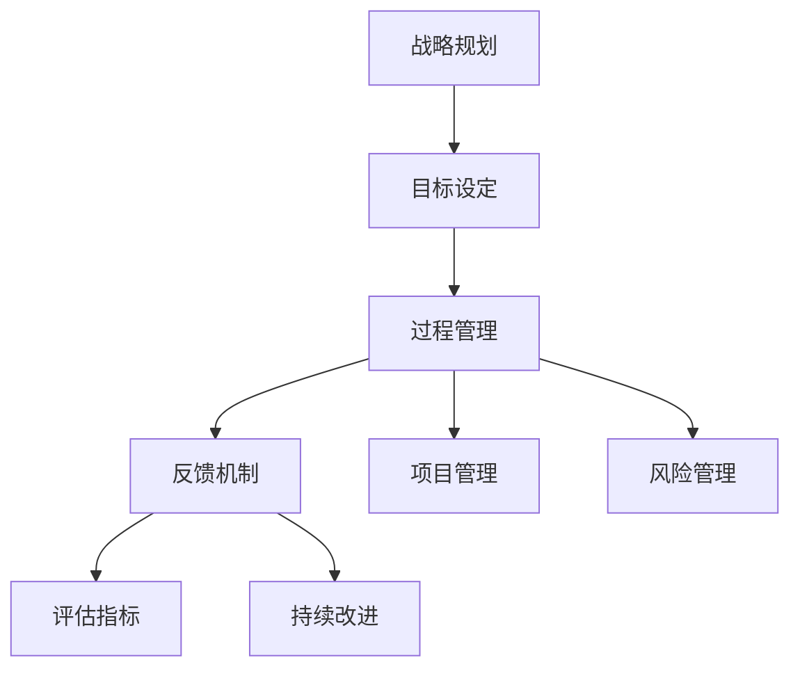

                 

## 1. 背景介绍

### 1.1 问题由来
在现代信息社会，高速发展的技术环境使得个人和企业面临着前所未有的挑战。个人需要快速适应新技能，企业需要敏捷应对市场变化，因而构建高效行动体系变得尤为关键。一个高效的行动体系能够使个人和企业更好地适应复杂多变的环境，抓住机遇，避免风险，实现持续发展。

### 1.2 问题核心关键点
建立高效行动体系的核心在于通过战略规划、目标设定、过程管理、反馈机制等步骤，形成一个闭环管理流程。这一过程不仅需要关注效率的提升，还要重视资源的优化配置、流程的标准化和风险的防控。

### 1.3 问题研究意义
高效行动体系的构建能够显著提升个人和企业的工作效率、资源利用率和创新能力，对于应对日益复杂的市场竞争环境，保持可持续的竞争力具有重要意义。

## 2. 核心概念与联系

### 2.1 核心概念概述
- **行动体系**：指在战略指导下，通过设定明确的目标、制定详细的计划、实施有效的执行、进行定期的评估与反馈，以确保目标实现的系统化管理框架。
- **战略规划**：指对未来发展的长期方向和具体措施进行系统的规划，旨在实现组织的目标。
- **目标设定**：指根据战略规划，制定明确、可衡量、可达成、相关性强、时限明确的目标。
- **过程管理**：指通过项目管理等方法，确保各阶段任务的顺利推进和最终目标的达成。
- **反馈机制**：指通过定期评估和反馈，对行动体系进行修正和优化，以提高执行效率和质量。

这些核心概念通过相互联系、相互支撑，形成了一个闭环管理流程，使得行动体系更加科学、高效。

### 2.2 核心概念原理和架构的 Mermaid 流程图


## 3. 核心算法原理 & 具体操作步骤
### 3.1 算法原理概述

建立高效行动体系的本质是一种结构化的管理方法，其核心原理可以归纳为以下几个方面：

1. **目标导向**：明确且可衡量的目标是行动体系的基础，所有的活动都应围绕目标展开。
2. **系统性规划**：通过战略规划确定长远方向，确保资源和行动的合理配置。
3. **执行细节**：通过过程管理确保执行的精确性和时间节点控制。
4. **动态反馈**：通过持续的评估和反馈，及时调整行动策略，优化执行效果。

### 3.2 算法步骤详解

建立高效行动体系的具体步骤可归纳为以下五个方面：

**Step 1: 战略规划**
- 对外部环境和内部资源进行深入分析，确定组织的长期目标和战略方向。
- 使用SWOT分析、PESTEL分析等工具，综合评估各种因素对战略的影响。

**Step 2: 目标设定**
- 根据战略规划，设定具体、可衡量、可达成的短期和长期目标。
- 使用SMART原则（Specific, Measurable, Achievable, Relevant, Time-bound）确保目标的质量。

**Step 3: 过程管理**
- 制定详细的项目计划，包括任务分解、时间安排和资源配置。
- 使用敏捷开发、精益管理等方法，确保计划的灵活性和执行力。

**Step 4: 反馈机制**
- 设立评估指标和标准，定期对项目进展进行评估。
- 建立反馈循环，根据评估结果及时调整行动策略，确保目标的实现。

**Step 5: 持续改进**
- 收集反馈信息，进行系统性分析和优化。
- 定期更新战略和目标，确保行动体系的动态适应性和持续改进。

### 3.3 算法优缺点

建立高效行动体系具有以下优点：
1. **目标导向**：明确的目标设定使得团队成员有清晰的执行方向。
2. **系统性规划**：全面的战略规划有助于资源的最优配置。
3. **过程管理**：详细的计划和执行控制提高任务完成的效率和质量。
4. **动态反馈**：持续的评估和改进机制确保行动体系的有效性和适应性。

然而，也存在一些不足之处：
1. **复杂性高**：建立和维护一个高效的行动体系需要较高的专业水平和资源投入。
2. **灵活性差**：高度结构化的流程可能导致在变化环境中响应速度较慢。
3. **沟通难度**：复杂的管理体系可能增加沟通和协作的成本。

### 3.4 算法应用领域

高效行动体系广泛应用于以下领域：

- **项目管理**：企业通过项目管理的行动体系确保项目按时、按质完成。
- **组织管理**：政府、非营利组织通过行动体系实现高效运营和公共服务。
- **个人发展**：个人通过自我管理行动体系提升职业能力和生活质量。
- **业务流程**：企业通过流程管理行动体系优化运营效率和客户体验。

## 4. 数学模型和公式 & 详细讲解 & 举例说明

### 4.1 数学模型构建

建立高效行动体系的过程可以抽象为一个多阶段决策过程，其中每个阶段的目标和行动策略需要通过数学模型来描述和优化。设战略规划为 $S$，目标设定为 $T$，过程管理为 $P$，反馈机制为 $F$，持续改进为 $I$。

模型的目标是最大化最终的行动效果 $E$，即：
$$
E(S, T, P, F, I) = \max\limits_{S, T, P, F, I} \sum_{i=1}^n E_i(S, T, P, F, I)
$$

其中 $E_i$ 表示第 $i$ 阶段的目标实现度，可定义为：
$$
E_i = \begin{cases}
0, & \text{目标未达成} \\
1, & \text{目标达成}
\end{cases}
$$

### 4.2 公式推导过程

**Step 1: 战略规划** 
- 通过最大化外部环境的适应度 $\alpha$ 和内部资源的有效利用度 $\beta$，确定最佳战略 $S^*$：
$$
S^* = \arg\max\limits_{S} (\alpha(S) + \beta(S))
$$

**Step 2: 目标设定** 
- 使用SMART原则，确保目标 $T$ 的质量：
$$
T = (S, T, A, R, T)
$$

**Step 3: 过程管理**
- 制定项目计划 $P$，确保各任务 $j$ 按时完成：
$$
P = \sum_{j=1}^m P_j
$$

**Step 4: 反馈机制**
- 设立评估指标 $F$，定期评估项目进展：
$$
F = \sum_{i=1}^n F_i
$$

**Step 5: 持续改进**
- 根据反馈信息，进行系统性优化 $I$：
$$
I = \sum_{k=1}^K I_k
$$

### 4.3 案例分析与讲解

以某大型制造企业的行动体系构建为例，分析各个阶段的具体实施和优化过程。

**Step 1: 战略规划**
- 使用PESTEL分析工具，综合评估宏观经济、政治、社会、技术、环境、法律因素，确定最佳战略方向。

**Step 2: 目标设定**
- 结合战略规划，设定明确的短期和长期目标，如提高生产效率、扩大市场份额等。

**Step 3: 过程管理**
- 制定详细的生产计划和市场推广计划，包括生产流程、销售策略、财务预算等。

**Step 4: 反馈机制**
- 设立生产效率、市场份额、客户满意度等评估指标，定期监测并评估项目进展。

**Step 5: 持续改进**
- 根据评估结果，及时调整生产流程、营销策略，优化资源配置。

## 5. 项目实践：代码实例和详细解释说明

### 5.1 开发环境搭建

为了便于系统地学习和实践建立高效行动体系，以下给出Python开发环境搭建的详细流程：

1. 安装Anaconda：从官网下载并安装Anaconda，用于创建独立的Python环境。
2. 创建并激活虚拟环境：
```bash
conda create -n action-env python=3.8 
conda activate action-env
```
3. 安装必要的Python库：
```bash
pip install numpy pandas scikit-learn matplotlib tqdm jupyter notebook ipython
```
4. 准备数据集和模型文件：获取所需的数据集和预训练模型文件，确保数据和模型能够在Python中正确加载。

### 5.2 源代码详细实现

以下是一个简单的行动体系管理系统的代码实现示例，具体使用Python和Pandas库：

```python
import pandas as pd

class ActionSystem:
    def __init__(self, data_path):
        self.data = pd.read_csv(data_path)
        self.goals = self.data['goals'].tolist()
        self.plans = self.data['plans'].tolist()
        self.performance = self.data['performance'].tolist()
        self.improvements = self.data['improvements'].tolist()

    def strategy_planning(self, data):
        # 实施PESTEL分析等战略规划步骤
        pass

    def goal_setting(self, data):
        # 使用SMART原则设定目标
        pass

    def process_management(self, data):
        # 制定详细的项目计划
        pass

    def feedback_mechanism(self, data):
        # 设立评估指标并定期评估项目进展
        pass

    def continuous_improvement(self, data):
        # 根据反馈信息进行系统性优化
        pass

    def run_system(self):
        for i in range(len(self.data)):
            self.strategy_planning(self.data.iloc[i])
            self.goal_setting(self.data.iloc[i])
            self.process_management(self.data.iloc[i])
            self.feedback_mechanism(self.data.iloc[i])
            self.continuous_improvement(self.data.iloc[i])

        return self.data

# 加载数据
action_system = ActionSystem('action_system.csv')
result = action_system.run_system()

# 输出结果
print(result)
```

### 5.3 代码解读与分析

在上述代码中，我们定义了一个`ActionSystem`类，用于模拟一个行动体系管理系统的构建和运行。通过读取CSV文件，加载数据，并调用各个步骤的函数，最终输出优化后的行动体系数据。

**代码详细解释：**

- `__init__`方法：初始化数据，读取CSV文件并加载目标、计划、性能和改进数据。
- `strategy_planning`方法：模拟战略规划步骤，实际应用时需进行具体分析。
- `goal_setting`方法：模拟目标设定步骤，使用SMART原则。
- `process_management`方法：模拟过程管理步骤，制定详细计划。
- `feedback_mechanism`方法：模拟反馈机制步骤，设立评估指标并定期评估。
- `continuous_improvement`方法：模拟持续改进步骤，根据反馈信息优化。
- `run_system`方法：依次执行各步骤，返回优化后的行动体系数据。

### 5.4 运行结果展示

运行上述代码，将得到优化后的行动体系数据，可以直观地展示各个阶段的目标达成度和改进措施的效果。

## 6. 实际应用场景

### 6.1 企业项目管理

在大型制造企业中，建立高效行动体系可以显著提升项目管理效率。通过战略规划、目标设定、过程管理、反馈机制等步骤，企业能够确保项目的按时、按质完成，同时进行持续的优化改进。

**案例分析：**
某大型汽车制造企业通过建立高效行动体系，成功管理了多个新车型项目的研发和生产。在战略规划阶段，公司结合市场趋势和技术创新，确定了研发方向。目标设定阶段，明确了各项目的具体目标和时间节点。过程管理阶段，制定了详细的研发计划和生产流程。反馈机制阶段，定期评估研发进展和生产效率，及时调整策略。持续改进阶段，根据评估结果优化资源配置和研发流程，最终实现了多个车型的成功上市。

### 6.2 政府公共服务

政府在提供公共服务时，通过建立高效行动体系，可以实现服务的高效、公平和透明。

**案例分析：**
某市政府通过建立高效行动体系，成功提升了公共服务质量。在战略规划阶段，明确了公共服务的长期目标和方向。目标设定阶段，制定了具体的短期目标，如提升服务覆盖率、优化服务流程等。过程管理阶段，制定了详细的服务计划和流程，确保服务按时提供。反馈机制阶段，设立了服务满意度、服务覆盖率等评估指标，定期进行评估。持续改进阶段，根据评估结果优化服务流程，最终实现了服务质量的显著提升。

### 6.3 个人职业发展

个人通过建立高效行动体系，可以实现职业目标的达成和生活质量的提升。

**案例分析：**
某IT从业人员通过建立高效行动体系，成功实现了职业转型。在战略规划阶段，明确了长期职业目标和转型方向。目标设定阶段，制定了具体的短期目标，如提升技术能力、完成项目等。过程管理阶段，制定了详细的学习计划和项目计划，确保目标按时达成。反馈机制阶段，设立了学习进度、项目完成度等评估指标，定期进行评估。持续改进阶段，根据评估结果优化学习方法和工作策略，最终实现了职业转型成功。

## 7. 工具和资源推荐

### 7.1 学习资源推荐

为了帮助读者系统掌握建立高效行动体系的理论和实践，以下推荐一些优质的学习资源：

1. **《项目管理》（Project Management Body of Knowledge，PMBOK）**：PMI官方出版的项目管理经典书籍，详细介绍了项目管理的各个方面，是行动体系构建的基础。
2. **《敏捷开发：原则、模式与实践》**：Robert C. Martin著，介绍了敏捷开发的核心原则和方法，适合行动体系中的过程管理。
3. **《高效能人士的七个习惯》**：Stephen R. Covey著，介绍了时间管理、目标设定等高效能人士的实践方法。
4. **《精益创业》**：Eric Ries著，介绍了精益创业方法论，适合行动体系中的持续改进。
5. **Coursera《行动体系与项目管理》课程**：由知名大学和专家共同讲授，系统介绍了行动体系和项目管理的方法和实践。

### 7.2 开发工具推荐

为了便于开发和应用高效行动体系，以下推荐一些开发工具：

1. **JIRA**：项目管理和任务跟踪工具，适合企业管理项目。
2. **Trello**：任务管理和团队协作工具，适合小型项目和敏捷开发。
3. **Confluence**：文档管理和知识分享工具，适合团队协作和知识积累。
4. **Asana**：任务管理和团队协作工具，适合项目跟踪和进度控制。
5. **Microsoft Project**：企业级项目管理工具，适合大型项目的管理。

### 7.3 相关论文推荐

以下推荐一些相关的学术和工业界论文，以供参考：

1. **《项目管理知识体系（PMBOK）指南》**：PMI发布的项目管理标准指南，系统介绍了项目管理的理论和实践。
2. **《敏捷开发：原则、模式与实践》**：Robert C. Martin著，介绍了敏捷开发的核心原则和方法。
3. **《精益创业》**：Eric Ries著，介绍了精益创业方法论。
4. **《行动体系与项目管理》**：相关的学术和工业界论文，系统介绍了行动体系和项目管理的方法和实践。

## 8. 总结：未来发展趋势与挑战

### 8.1 研究成果总结

建立高效行动体系的理论和方法已经广泛应用于企业、政府和个人领域，取得了显著的成效。其核心理念包括目标导向、系统性规划、过程管理、动态反馈和持续改进，通过闭环管理流程，提升组织的执行效率和创新能力。

### 8.2 未来发展趋势

未来，高效行动体系将继续朝着以下几个方向发展：

1. **自动化和智能化**：通过引入AI和大数据分析技术，实现自动化的战略规划和目标设定，提升决策效率和质量。
2. **灵活化和敏捷化**：采用敏捷开发和精益管理方法，提高行动体系的灵活性和适应性，快速响应市场变化。
3. **跨领域融合**：结合其他领域的理论和方法，如心理学、社会学等，构建更加全面、科学的管理体系。
4. **多层次整合**：将行动体系与组织文化、企业文化、领导力等结合，形成更加系统、协同的管理模式。

### 8.3 面临的挑战

尽管高效行动体系在实践中取得了良好的效果，但在应用过程中仍面临一些挑战：

1. **高成本**：建立和维护高效行动体系需要较高的成本投入，包括培训、工具采购等。
2. **复杂性**：行动体系的管理流程复杂，需要较高的专业水平和技能。
3. **适应性差**：在快速变化的环境中，行动体系可能难以快速适应和调整。
4. **沟通难度**：不同层次、不同部门之间的沟通和协作可能面临较大挑战。

### 8.4 研究展望

为了克服这些挑战，未来需要在以下几个方面进行深入研究：

1. **降低成本**：开发更高效、更经济的行动体系管理工具和流程。
2. **提升灵活性**：结合敏捷开发和精益管理等方法，提升行动体系的适应性。
3. **增强透明度**：通过数据分析和可视化技术，提高行动体系管理的透明度和可控性。
4. **优化沟通**：建立更加灵活的沟通机制，促进不同部门和层次之间的协作。

通过不断优化和改进，高效行动体系将成为更加科学、高效的管理方法，为个人和企业提供坚实的保障。

## 9. 附录：常见问题与解答

**Q1: 如何确保行动体系的高效性？**

A: 高效行动体系的高效性主要依赖于系统性的规划、明确的目标设定、详尽的过程管理、动态的反馈机制和持续的改进。通过闭环管理流程，不断优化和调整，确保行动体系的科学性和高效性。

**Q2: 如何应对行动体系中的变化和挑战？**

A: 行动体系需要根据实际情况进行灵活调整和优化。定期进行回顾和评估，收集反馈信息，及时调整行动策略，确保行动体系能够动态适应变化和挑战。

**Q3: 如何实现行动体系的自动化？**

A: 引入AI和大数据分析技术，通过机器学习和自然语言处理等方法，实现自动化战略规划和目标设定。同时，通过数据驱动的决策机制，提高行动体系的透明度和可控性。

**Q4: 如何提高行动体系的灵活性？**

A: 采用敏捷开发和精益管理等方法，建立灵活的行动体系。通过持续改进和优化，确保行动体系能够快速适应变化，提高组织的灵活性和适应性。

**Q5: 如何提高行动体系的透明度？**

A: 通过数据分析和可视化技术，实现行动体系管理的透明化。定期收集和分析数据，提供可视化的报告和分析结果，帮助决策者及时了解行动体系的状态和进展。

通过系统化的学习和实践，相信每一位读者都能够掌握建立高效行动体系的方法和技巧，将其应用到实际工作中，提升个人和企业的工作效率和创新能力。

---

作者：禅与计算机程序设计艺术 / Zen and the Art of Computer Programming

