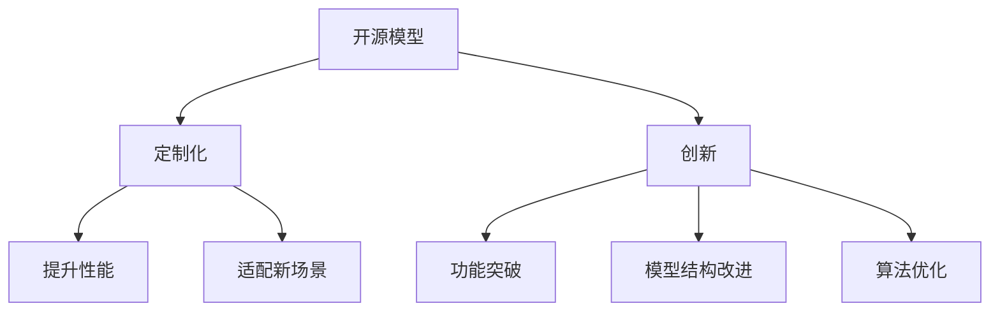

                 

# 开源模型发展：贾扬清观点，创新定制化优势助力发展

> 关键词：开源模型,深度学习,定制化,创新,科研贡献,产业应用

## 1. 背景介绍

### 1.1 问题由来
深度学习模型的开源化是过去十年中人工智能领域最重要的里程碑之一。从2010年开源社区开始在GitHub上托管深度学习项目开始，到2015年深度学习先驱、Facebook人工智能研究院(Facebook AI Research, FAIR)主任Yann LeCun在NIPS 2015大会上提倡公开共享深度学习代码和模型，深度学习开源运动势如破竹。

如今，深度学习领域已经拥有了数千个开源项目，许多开源模型如TensorFlow、PyTorch、MXNet等已经被广泛应用于工业界和学术界。开源社区不仅推动了深度学习的普及和应用，也促进了产业界与学术界的合作与创新。

在深度学习开源化大背景下，对开源模型的使用与创新已经成为研究人员和开发者不可或缺的技能。然而，开源模型的发展也面临一些挑战，如多样性不足、定制化难度高等问题。本文将通过探讨如何通过定制化创新克服这些挑战，助力开源模型向更加智能化、普适化方向发展。

## 2. 核心概念与联系

### 2.1 核心概念概述

为了更好地理解开源模型和定制化创新的关系，我们首先需要介绍几个关键概念：

- 开源模型：即公开发布源码，供用户自由使用、修改和再发布的深度学习模型。开源模型通常具有较高的灵活性，能够适应不同应用场景的需求。

- 定制化：即针对特定任务或需求，对开源模型进行适应性的修改和优化，以提升其性能或适配性。定制化是深度学习应用过程中的重要环节，有助于开源模型在特定场景下发挥最大效能。

- 创新：在定制化的基础上，通过引入新思想、新技术，或对模型结构、算法进行改进，实现模型功能的突破性提升。创新是开源模型持续进步的源泉，驱动其在更多应用场景中取得成功。

以上核心概念之间的逻辑关系可以通过以下Mermaid流程图来展示：



这个流程图展示了开源模型、定制化、创新三者之间的关系：

1. 开源模型是基础，提供了灵活、强大的模型架构。
2. 定制化是在开源模型基础上的具体应用，针对不同场景进行调整。
3. 创新是在定制化的基础上进一步提升，引入新方法和新思想。

## 3. 核心算法原理 & 具体操作步骤

### 3.1 算法原理概述

开源模型的定制化创新，本质上是一个从通用的深度学习模型到特定任务模型的过程。其核心思想是：根据具体任务的需求，选择合适的开源模型作为基线，通过定制化调整，提升模型在该任务上的性能。

形式化地，假设开源模型为 $M_{\text{open}}$，其中包含通用模型参数 $\theta_{\text{open}}$。给定任务 $T$ 的标注数据集 $D=\{(x_i, y_i)\}_{i=1}^N$，定制化的目标是通过调整模型参数，使得 $M_{\text{open}}$ 在该任务上表现最优。即：

$$
\theta_{\text{custom}} = \mathop{\arg\min}_{\theta_{\text{open}}} \mathcal{L}(M_{\theta_{\text{open}}},D)
$$

其中 $\mathcal{L}$ 为针对任务 $T$ 设计的损失函数，用于衡量模型预测输出与真实标签之间的差异。常见的损失函数包括交叉熵损失、均方误差损失等。

### 3.2 算法步骤详解

基于定制化创新的开源模型微调一般包括以下几个关键步骤：

**Step 1: 选择合适的开源模型**
- 根据任务类型和数据规模，选择合适的开源深度学习模型，如TensorFlow、PyTorch、MXNet等。
- 考虑模型的可扩展性、维护成本、社区活跃度等因素，选择最符合需求的模型。

**Step 2: 添加任务适配层**
- 在开源模型的基础上添加任务特定的适配层，以适配新任务的要求。例如，对于图像分类任务，可以添加卷积层和池化层；对于文本分类任务，可以添加全连接层和softmax层。
- 根据任务类型，选择合适的损失函数，如交叉熵损失、均方误差损失等。

**Step 3: 设置定制化超参数**
- 选择合适的优化算法及其参数，如Adam、SGD等，设置学习率、批大小、迭代轮数等。
- 设置正则化技术及强度，包括权重衰减、Dropout、Early Stopping等。
- 确定冻结开源模型的策略，如仅微调顶层，或全部参数都参与定制化。

**Step 4: 执行定制化训练**
- 将训练集数据分批次输入模型，前向传播计算损失函数。
- 反向传播计算参数梯度，根据设定的优化算法和学习率更新模型参数。
- 周期性在验证集上评估模型性能，根据性能指标决定是否触发 Early Stopping。
- 重复上述步骤直到满足预设的迭代轮数或 Early Stopping 条件。

**Step 5: 测试和部署**
- 在测试集上评估定制化后模型 $M_{\theta_{\text{custom}}}$ 的性能，对比定制化前后的精度提升。
- 使用定制化后的模型对新样本进行推理预测，集成到实际的应用系统中。
- 持续收集新的数据，定期重新定制化模型，以适应数据分布的变化。

以上是基于定制化创新的开源模型微调的一般流程。在实际应用中，还需要针对具体任务的特点，对定制化过程的各个环节进行优化设计，如改进训练目标函数，引入更多的正则化技术，搜索最优的超参数组合等，以进一步提升模型性能。

### 3.3 算法优缺点

定制化创新的开源模型具有以下优点：
1. 快速迭代。通过修改开源模型的部分组件，可以快速适应新任务，缩短项目开发周期。
2. 灵活性高。开源模型可以根据具体需求进行定制化，不受原模型设计限制。
3. 成本低。开源模型通常提供社区支持和文档，便于快速上手和问题解决。

同时，定制化创新也存在一定的局限性：
1. 定制化难度大。定制化过程中需要对模型结构、算法进行深入理解，甚至修改源码。
2. 可扩展性差。定制化后的模型难以直接应用于其他新任务。
3. 缺乏通用性。定制化模型只适用于特定任务，难以扩展到更多应用场景。
4. 依赖社区。开源模型的定制化往往需要社区支持和文档，开发者需要具备一定的技术背景。

尽管存在这些局限性，但就目前而言，定制化创新的开源模型仍是深度学习应用的主流范式。未来相关研究的重点在于如何进一步降低定制化难度，提高模型的少样本学习和跨领域迁移能力，同时兼顾可解释性和伦理安全性等因素。

### 3.4 算法应用领域

定制化创新的开源模型在深度学习领域已经得到了广泛的应用，覆盖了几乎所有常见任务，例如：

- 图像分类：如猫狗识别、车辆分类等。通过微调CNN模型，可显著提升分类精度。
- 自然语言处理：如情感分析、文本分类、机器翻译等。通过微调RNN、Transformer等模型，可以实现多种语言处理任务。
- 计算机视觉：如目标检测、图像分割、图像生成等。通过微调CNN、GAN等模型，可实现高性能的视觉任务。
- 语音识别：如语音情感识别、语音合成等。通过微调RNN、Transformer等模型，可实现语音交互和情感分析。
- 强化学习：如自动驾驶、机器人控制等。通过微调深度强化学习模型，可实现智能决策和交互。

除了上述这些经典任务外，定制化创新的开源模型也被创新性地应用到更多场景中，如可控图像生成、智能推荐系统、虚拟现实等，为深度学习技术带来了全新的突破。随着开源模型和定制化方法的不断进步，相信深度学习技术将在更广阔的应用领域大放异彩。

## 4. 数学模型和公式 & 详细讲解 & 举例说明

### 4.1 数学模型构建

本节将使用数学语言对基于定制化创新的开源模型微调过程进行更加严格的刻画。

记开源模型为 $M_{\text{open}}$，其中包含通用模型参数 $\theta_{\text{open}}$。假设微调任务的训练集为 $D=\{(x_i,y_i)\}_{i=1}^N$，其中 $x_i \in \mathcal{X}$，$y_i \in \mathcal{Y}$。

定义模型 $M_{\theta_{\text{open}}}$ 在数据样本 $(x,y)$ 上的损失函数为 $\ell(M_{\theta_{\text{open}}}(x),y)$，则在数据集 $D$ 上的经验风险为：

$$
\mathcal{L}(\theta_{\text{open}}) = \frac{1}{N} \sum_{i=1}^N \ell(M_{\theta_{\text{open}}}(x_i),y_i)
$$

定制化的优化目标是最小化经验风险，即找到最优参数：

$$
\theta_{\text{custom}} = \mathop{\arg\min}_{\theta_{\text{open}}} \mathcal{L}(\theta_{\text{open}})
$$

在实践中，我们通常使用基于梯度的优化算法（如Adam、SGD等）来近似求解上述最优化问题。设 $\eta$ 为学习率，$\lambda$ 为正则化系数，则参数的更新公式为：

$$
\theta_{\text{open}} \leftarrow \theta_{\text{open}} - \eta \nabla_{\theta_{\text{open}}}\mathcal{L}(\theta_{\text{open}}) - \eta\lambda\theta_{\text{open}}
$$

其中 $\nabla_{\theta_{\text{open}}}\mathcal{L}(\theta_{\text{open}})$ 为损失函数对参数 $\theta_{\text{open}}$ 的梯度，可通过反向传播算法高效计算。

### 4.2 公式推导过程

以下我们以图像分类任务为例，推导交叉熵损失函数及其梯度的计算公式。

假设模型 $M_{\theta_{\text{open}}}$ 在输入 $x$ 上的输出为 $\hat{y}=M_{\theta_{\text{open}}}(x)$，表示样本属于正类的概率。真实标签 $y \in \{0,1\}$。则二分类交叉熵损失函数定义为：

$$
\ell(M_{\theta_{\text{open}}}(x),y) = -[y\log \hat{y} + (1-y)\log (1-\hat{y})]
$$

将其代入经验风险公式，得：

$$
\mathcal{L}(\theta_{\text{open}}) = -\frac{1}{N}\sum_{i=1}^N [y_i\log M_{\theta_{\text{open}}}(x_i)+(1-y_i)\log(1-M_{\theta_{\text{open}}}(x_i))]
$$

根据链式法则，损失函数对参数 $\theta_{\text{open}}$ 的梯度为：

$$
\frac{\partial \mathcal{L}(\theta_{\text{open}})}{\partial \theta_{\text{open}}} = -\frac{1}{N}\sum_{i=1}^N (\frac{y_i}{M_{\theta_{\text{open}}}(x_i)}-\frac{1-y_i}{1-M_{\theta_{\text{open}}}(x_i)}) \frac{\partial M_{\theta_{\text{open}}}(x_i)}{\partial \theta_{\text{open}}}
$$

其中 $\frac{\partial M_{\theta_{\text{open}}}(x_i)}{\partial \theta_{\text{open}}}$ 可进一步递归展开，利用自动微分技术完成计算。

在得到损失函数的梯度后，即可带入参数更新公式，完成模型的迭代优化。重复上述过程直至收敛，最终得到适应下游任务的最优模型参数 $\theta_{\text{custom}}$。

## 5. 项目实践：代码实例和详细解释说明

### 5.1 开发环境搭建

在进行定制化实践前，我们需要准备好开发环境。以下是使用Python进行TensorFlow开发的环境配置流程：

1. 安装Anaconda：从官网下载并安装Anaconda，用于创建独立的Python环境。

2. 创建并激活虚拟环境：
```bash
conda create -n tf-env python=3.8 
conda activate tf-env
```

3. 安装TensorFlow：根据CUDA版本，从官网获取对应的安装命令。例如：
```bash
conda install tensorflow tensorflow==2.7 -c tf -c conda-forge
```

4. 安装各类工具包：
```bash
pip install numpy pandas scikit-learn matplotlib tqdm jupyter notebook ipython
```

完成上述步骤后，即可在`tf-env`环境中开始定制化实践。

### 5.2 源代码详细实现

这里我们以图像分类任务为例，给出使用TensorFlow对VGG模型进行定制化的PyTorch代码实现。

首先，定义图像分类任务的训练和评估函数：

```python
import tensorflow as tf
from tensorflow.keras import layers, models

# 定义模型
model = models.Sequential([
    layers.Conv2D(32, (3, 3), activation='relu', input_shape=(32, 32, 3)),
    layers.MaxPooling2D((2, 2)),
    layers.Conv2D(64, (3, 3), activation='relu'),
    layers.MaxPooling2D((2, 2)),
    layers.Conv2D(64, (3, 3), activation='relu'),
    layers.Flatten(),
    layers.Dense(64, activation='relu'),
    layers.Dense(10)
])

# 编译模型
model.compile(optimizer=tf.keras.optimizers.Adam(learning_rate=0.001),
              loss=tf.keras.losses.SparseCategoricalCrossentropy(from_logits=True),
              metrics=['accuracy'])

# 训练模型
model.fit(train_images, train_labels, epochs=10, validation_data=(val_images, val_labels))
```

然后，定义测试和评估函数：

```python
# 评估模型
test_loss, test_acc = model.evaluate(test_images, test_labels)
print('Test accuracy:', test_acc)
```

最后，启动训练流程并在测试集上评估：

```python
train_images = ...
train_labels = ...
val_images = ...
val_labels = ...
test_images = ...
test_labels = ...

# 训练模型
model.fit(train_images, train_labels, epochs=10, validation_data=(val_images, val_labels))

# 评估模型
test_loss, test_acc = model.evaluate(test_images, test_labels)
print('Test accuracy:', test_acc)
```

以上就是使用TensorFlow对VGG模型进行图像分类任务定制化的完整代码实现。可以看到，通过TensorFlow的模块化设计和动态计算图，代码实现变得简单高效。

### 5.3 代码解读与分析

让我们再详细解读一下关键代码的实现细节：

**定义模型**：
- `Sequential`：通过堆叠层的方式构建序列模型。
- `Conv2D`：定义卷积层，参数包括卷积核大小、激活函数等。
- `MaxPooling2D`：定义池化层，参数包括池化窗口大小等。
- `Dense`：定义全连接层，参数包括神经元数量、激活函数等。

**编译模型**：
- `Adam`：定义优化器，使用Adam优化器进行梯度更新。
- `SparseCategoricalCrossentropy`：定义损失函数，使用交叉熵损失函数计算预测输出和真实标签之间的差异。

**训练模型**：
- `fit`：调用模型的fit方法，传入训练数据、标签、批大小、轮数等参数。
- `validation_data`：传入验证集数据，用于在训练过程中评估模型性能。

**评估模型**：
- `evaluate`：调用模型的evaluate方法，计算模型在测试集上的准确率。

可以看到，TensorFlow的模块化设计使得模型定义、编译、训练、评估等过程变得简单易懂，适合快速迭代和实验。

当然，工业级的系统实现还需考虑更多因素，如模型的保存和部署、超参数的自动搜索、更灵活的任务适配层等。但核心的定制化范式基本与此类似。

## 6. 实际应用场景

### 6.1 智能推荐系统

基于定制化创新的开源模型，智能推荐系统可以实现个性化的推荐内容。推荐系统通过分析用户的浏览、点击、购买等行为数据，预测用户的兴趣偏好，并推荐最符合用户口味的商品。

在实践中，可以使用开源的TensorFlow或PyTorch，通过微调推荐模型，提升预测精度和用户满意度。例如，通过微调深度学习模型，可以根据用户的历史行为数据预测其感兴趣的商品，实现更加精准的推荐。同时，通过引入多模态数据（如文本、图片、视频等），进一步提升推荐系统的表现。

### 6.2 语音识别系统

基于定制化创新的开源模型，语音识别系统可以实现高效的语音转文本。语音识别系统通过捕捉用户语音，将其转化为文本输出，方便用户在无法打字的情况下进行交互。

在实践中，可以使用开源的TensorFlow或PyTorch，通过微调语音识别模型，提升识别精度和响应速度。例如，通过微调深度学习模型，可以改进语音特征提取和声学建模，实现更加准确和流畅的语音转文本。同时，通过引入多模态数据（如语境、用户情绪等），进一步提升识别系统的表现。

### 6.3 医疗影像诊断系统

基于定制化创新的开源模型，医疗影像诊断系统可以实现精准的医学影像分析。医疗影像诊断系统通过分析患者的医学影像，如CT、MRI等，判断其健康状况，提供诊疗建议。

在实践中，可以使用开源的TensorFlow或PyTorch，通过微调医学影像分析模型，提升诊断精度和效率。例如，通过微调深度学习模型，可以改进图像特征提取和分类算法，实现更加精准的医学影像分析。同时，通过引入多模态数据（如病历、基因信息等），进一步提升诊断系统的表现。

### 6.4 未来应用展望

随着深度学习开源模型和定制化技术的不断发展，基于定制化创新的开源模型将在更多领域得到应用，为传统行业带来变革性影响。

在智慧城市治理中，开源模型可以实现实时监控和事件处理。例如，通过微调深度学习模型，可以实时分析城市交通流量、环境污染等数据，预测和应对各种突发事件，提升城市治理的智能化水平。

在教育领域，开源模型可以实现个性化教学和智能辅导。例如，通过微调深度学习模型，可以分析学生的学习行为和知识掌握情况，提供个性化的学习建议和辅导，提升教学效果。

在金融领域，开源模型可以实现智能投研和风险管理。例如，通过微调深度学习模型，可以分析金融市场数据，预测股票价格和市场趋势，提供投资建议和风险管理方案。

总之，基于定制化创新的开源模型将在更多领域大放异彩，推动深度学习技术的产业化进程，赋能各行各业数字化转型升级。

## 7. 工具和资源推荐

### 7.1 学习资源推荐

为了帮助开发者系统掌握深度学习开源模型和定制化创新的理论基础和实践技巧，这里推荐一些优质的学习资源：

1. TensorFlow官方文档：提供详细的TensorFlow教程和API文档，涵盖从入门到进阶的所有内容。

2. PyTorch官方文档：提供详细的PyTorch教程和API文档，适合深度学习初学者和专业人士。

3. Coursera深度学习课程：由深度学习先驱Andrew Ng开设的在线课程，内容深入浅出，适合各类人群学习。

4. Fast.ai课程：提供实践导向的深度学习课程，涵盖图像、文本、推荐系统等多种任务，适合实战训练。

5. GitHub开源项目：全球最大的开源社区，可以浏览和学习各种深度学习开源项目，获取社区支持和文档。

通过对这些资源的学习实践，相信你一定能够快速掌握深度学习开源模型和定制化创新的精髓，并用于解决实际的深度学习问题。

### 7.2 开发工具推荐

高效的开发离不开优秀的工具支持。以下是几款用于深度学习开源模型和定制化创新的常用工具：

1. TensorFlow：由Google主导开发的开源深度学习框架，生产部署方便，适合大规模工程应用。

2. PyTorch：由Facebook主导开发的开源深度学习框架，灵活性高，适合快速迭代研究。

3. Keras：高层次的深度学习API，基于TensorFlow或Theano实现，适合初学者上手。

4. MXNet：由Apache维护的深度学习框架，支持多种语言和硬件，适合跨平台部署。

5. Jupyter Notebook：交互式笔记本，支持Python、R等多种语言，适合快速实验和数据可视化。

6. Colab：Google提供的在线Jupyter Notebook环境，免费提供GPU/TPU算力，适合远程实验。

合理利用这些工具，可以显著提升深度学习开源模型和定制化创新的开发效率，加快创新迭代的步伐。

### 7.3 相关论文推荐

深度学习开源模型和定制化创新的发展源于学界的持续研究。以下是几篇奠基性的相关论文，推荐阅读：

1. Imagenet Classification with Deep Convolutional Neural Networks：提出AlexNet模型，标志着深度学习在图像分类领域的突破。

2. Deep Residual Learning for Image Recognition：提出ResNet模型，解决深度网络训练中的梯度消失问题，推动深度学习模型的进一步发展。

3. Google's Neural Machine Translation System：提出深度学习模型在机器翻译中的应用，实现流畅的跨语言翻译。

4. TensorFlow: A System for Large-Scale Machine Learning：介绍TensorFlow框架的实现和应用，为深度学习开源化奠定基础。

5. PyTorch: An Interactive Deep Learning Research Platform：介绍PyTorch框架的实现和应用，推动深度学习研究的普及和应用。

这些论文代表了大模型开源和定制化创新的发展脉络。通过学习这些前沿成果，可以帮助研究者把握学科前进方向，激发更多的创新灵感。

## 8. 总结：未来发展趋势与挑战

### 8.1 总结

本文对基于定制化创新的深度学习开源模型进行了全面系统的介绍。首先阐述了深度学习开源模型的重要性，探讨了定制化创新的核心思想和应用场景。接着，从原理到实践，详细讲解了定制化创新的数学模型和关键步骤，给出了定制化实践的代码实例和详细解释说明。

通过本文的系统梳理，可以看到，基于定制化创新的深度学习开源模型正成为深度学习应用的重要范式，极大地拓展了开源模型的应用边界，催生了更多的落地场景。受益于深度学习开源化大趋势，开发者可以快速上手和迭代优化开源模型，推动深度学习技术在更多领域取得突破。

### 8.2 未来发展趋势

展望未来，基于定制化创新的深度学习开源模型将呈现以下几个发展趋势：

1. 模型多样性增加。随着开源社区的不断壮大，深度学习模型的多样性将进一步增加。更多的开源模型将满足不同应用场景的需求，提升深度学习技术的应用覆盖率。

2. 模型可定制性提升。未来的开源模型将更加灵活，支持更广泛的定制化需求，提升模型的适配性和通用性。

3. 模型可扩展性增强。未来的开源模型将支持更高效的分布式训练和推理，适应更大规模的计算任务。

4. 开源生态完善。开源社区将更加活跃，提供更丰富的文档、工具和支持，推动深度学习技术的普及和应用。

5. 科研贡献增多。深度学习开源模型将成为科研创新和产业应用的重要平台，催生更多前沿研究方向和应用场景。

以上趋势凸显了深度学习开源模型和定制化创新的广阔前景。这些方向的探索发展，必将进一步提升深度学习技术的性能和应用范围，为经济社会发展注入新的动力。

### 8.3 面临的挑战

尽管深度学习开源模型和定制化创新已经取得了瞩目成就，但在迈向更加智能化、普适化应用的过程中，仍面临一些挑战：

1. 开源社区分裂。由于各开源社区之间的技术路线和生态体系不同，开源模型之间的互操作性仍存在问题。如何统一开源标准，推动社区融合，成为亟需解决的问题。

2. 开源模型可维护性差。由于开源模型体积庞大，维护和更新成本高，难以适应快速迭代的开发需求。如何提升开源模型的可维护性，提升开发效率，将是重要的优化方向。

3. 开源模型的资源占用大。深度学习模型通常需要大量计算资源，难以在资源有限的场景下部署。如何优化模型结构，降低计算资源消耗，是未来需要关注的问题。

4. 开源模型的可解释性不足。深度学习模型的决策过程通常缺乏可解释性，难以对其内部工作机制和推理逻辑进行分析和调试。如何赋予深度学习模型更强的可解释性，将是亟待攻克的难题。

5. 开源模型的安全性问题。深度学习模型在应用过程中，可能受到恶意攻击和数据泄露的风险。如何保护开源模型的安全性，确保数据和模型安全，将是重要的研究课题。

6. 开源模型的伦理道德问题。深度学习模型在应用过程中，可能存在偏见和歧视，导致有害输出。如何确保模型的伦理道德合规，避免恶意用途，是重要的研究方向。

正视开源模型和定制化创新面临的这些挑战，积极应对并寻求突破，将是深度学习开源模型向成熟迈进的关键。

### 8.4 研究展望

面向未来，深度学习开源模型和定制化创新的研究需要在以下几个方面寻求新的突破：

1. 开源模型的统一标准。推动开源社区之间的合作与融合，建立统一的开源标准，提升开源模型的互操作性和可维护性。

2. 深度学习模型的可解释性。引入可解释性技术，如注意力机制、因果推断等，提升深度学习模型的可解释性和透明性。

3. 深度学习模型的安全性。引入安全性和隐私保护技术，如对抗训练、差分隐私等，保障深度学习模型的安全性。

4. 深度学习模型的伦理道德。引入伦理导向的评估指标，过滤和惩罚有害输出，确保深度学习模型的伦理道德合规。

5. 深度学习模型的可扩展性。提升深度学习模型的分布式训练和推理能力，适应更大规模的计算任务。

这些研究方向的探索，必将引领深度学习开源模型和定制化创新技术迈向更高的台阶，为构建安全、可靠、可解释、可控的智能系统铺平道路。面向未来，深度学习开源模型和定制化创新技术还需要与其他人工智能技术进行更深入的融合，如知识表示、因果推理、强化学习等，多路径协同发力，共同推动深度学习技术的进步。只有勇于创新、敢于突破，才能不断拓展深度学习模型的边界，让智能技术更好地造福人类社会。

## 9. 附录：常见问题与解答

**Q1：如何选择合适的深度学习开源模型？**

A: 选择合适的深度学习开源模型需要考虑以下因素：

1. 任务类型：根据任务类型选择合适的模型，如图像分类选择CNN，文本分类选择RNN等。

2. 数据规模：根据数据规模选择合适的模型，如数据量较小，可以选择轻量级模型，如MobileNet等；数据量较大，可以选择大模型，如ResNet等。

3. 性能要求：根据性能要求选择合适的模型，如对精度要求较高，可以选择高性能模型，如Inception等。

4. 社区支持：选择有活跃社区支持、文档齐全的模型，便于问题解决和模型维护。

**Q2：定制化过程中如何进行超参数调优？**

A: 进行超参数调优可以采用以下步骤：

1. 初步设置：根据经验设置一组超参数，如学习率、批大小、迭代轮数等。

2. 网格搜索：在一定范围内设置超参数的取值，进行网格搜索，找到最优超参数组合。

3. 随机搜索：通过随机生成超参数组合，进行随机搜索，找到最优超参数组合。

4. 贝叶斯优化：使用贝叶斯优化算法，根据历史实验结果不断调整超参数取值，找到最优超参数组合。

5. 模型验证：在验证集上评估模型性能，选择最优超参数组合进行训练。

**Q3：如何进行深度学习模型的评估？**

A: 进行深度学习模型的评估可以采用以下方法：

1. 训练集评估：在训练集上评估模型性能，判断模型是否过拟合。

2. 验证集评估：在验证集上评估模型性能，找到最优超参数组合。

3. 测试集评估：在测试集上评估模型性能，判断模型泛化能力。

4. 混淆矩阵：使用混淆矩阵评估分类模型性能，计算准确率、召回率、F1值等指标。

5. ROC曲线：绘制ROC曲线，评估分类模型性能，计算精确率、召回率、AUC等指标。

6. 均方误差：评估回归模型性能，计算均方误差、R²等指标。

**Q4：如何进行深度学习模型的微调？**

A: 进行深度学习模型的微调可以采用以下步骤：

1. 准备数据集：准备训练集、验证集和测试集，划分为批大小。

2. 定义模型：定义深度学习模型，添加任务适配层。

3. 编译模型：编译模型，选择优化器、损失函数和评估指标。

4. 训练模型：在训练集上训练模型，设置学习率、批大小、迭代轮数等参数。

5. 验证模型：在验证集上验证模型性能，防止过拟合。

6. 测试模型：在测试集上测试模型性能，评估模型泛化能力。

7. 部署模型：将模型部署到实际应用中，进行推理预测。

**Q5：如何提升深度学习模型的可解释性？**

A: 提升深度学习模型的可解释性可以采用以下方法：

1. 引入可解释性技术：引入可解释性技术，如LIME、SHAP等，解释模型的决策过程。

2. 可视化模型结构：使用可视化工具，如TensorBoard、PyTorch-vis等，可视化模型结构，理解模型工作机制。

3. 引入知识图谱：引入知识图谱，提升模型的知识整合能力，增加模型的可解释性。

4. 引入因果推断：引入因果推断方法，提升模型的因果解释能力，增加模型的透明性。

5. 引入符号计算：引入符号计算方法，提升模型的符号解释能力，增加模型的可解释性。

这些方法可以综合使用，提升深度学习模型的可解释性和透明性，使其能够更好地应用于实际场景。

---

作者：禅与计算机程序设计艺术 / Zen and the Art of Computer Programming

