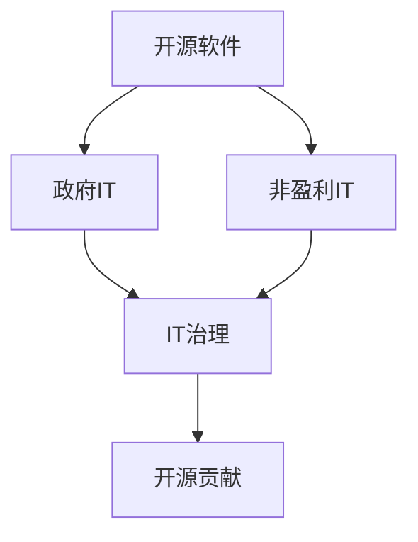

                 

# 开源贡献在政府和非盈利部门的机会

## 1. 背景介绍

在当今数字化时代，开源软件已成为推动技术进步和社会发展的重要力量。开源项目不仅促进了技术创新，还显著降低了软件成本，提高了软件质量和安全性。特别是在政府和非盈利部门，开源技术的广泛应用，为它们提供了强大的技术支持，使得它们能够在有限的预算内，实现高效、灵活的IT治理。本文将深入探讨开源贡献在政府和非盈利部门的机会，希望能为相关领域的开发者、IT人员和领导者提供有价值的见解和参考。

## 2. 核心概念与联系

### 2.1 核心概念概述

- **开源软件**：指由社区成员共同开发、共享的软件，其源代码公开，任何人可以自由修改、分享和使用。
- **政府IT**：指政府部门的信息技术应用，包括政府网站、电子政务、公共服务等。
- **非盈利部门**：指不以营利为目的的组织，如教育机构、科研机构、非政府组织等，它们依靠开源技术来提高工作效率和影响社会。
- **开源贡献**：指开发者向开源项目提供代码、文档、测试、社区服务等形式的贡献，推动项目发展。
- **政府和非盈利IT治理**：指政府和非盈利部门对IT资源的规划、开发、部署、维护和管理的综合管理活动。

这些概念之间的联系可以通过以下Mermaid流程图来展示：

这个流程图展示了开源软件如何在政府和非盈利部门中发挥作用，并最终通过开源贡献推动IT治理的提升。

## 3. 核心算法原理 & 具体操作步骤
### 3.1 算法原理概述

开源贡献的核心算法原理主要基于代码的共享和协作，通过开源社区的合作机制，开发者可以在开放的环境中交流、合作，共同推进技术进步。以下是从算法原理角度对开源贡献机制的概述：

1. **版本控制**：开源项目通常使用版本控制系统（如Git）进行代码管理，开发者可以通过版本控制工具协同编辑代码，并记录每个版本的变化。
2. **问题跟踪**：开源项目使用问题跟踪系统（如Jira、GitHub Issues）来记录和跟踪开发任务，确保每个问题都有专人负责解决。
3. **持续集成**：开源项目使用持续集成工具（如Jenkins、Travis CI）自动化地构建、测试和部署代码，提高开发效率和代码质量。
4. **代码审查**：开源项目通过代码审查机制（如Pull Requests），确保代码的完整性和安全性，提升代码质量。
5. **文档贡献**：开源项目鼓励开发者撰写和使用说明文档，帮助社区成员更好地理解和贡献代码。

### 3.2 算法步骤详解

开源贡献的一般步骤包括以下几个关键环节：

1. **注册账号**：在GitHub、GitLab等开源平台注册账号，并成为目标项目的贡献者。
2. **浏览项目**：浏览项目仓库，了解项目需求和代码结构。
3. **问题筛选**：在问题跟踪系统中筛选未解决或低优先级的问题，选择适合解决的问题。
4. **编写代码**：根据问题描述编写代码，并提交Pull Requests。
5. **代码审查**：项目维护者对代码进行审查，提出修改意见，开发者根据意见修改代码。
6. **合并代码**：代码审查通过后，合并到主分支中。
7. **测试部署**：通过持续集成工具自动化测试和部署代码，确保代码的正确性和稳定性。
8. **文档更新**：更新或撰写项目文档，帮助社区成员更好地使用和贡献代码。

### 3.3 算法优缺点

开源贡献的优点包括：

- **社区协作**：通过开源社区的协作机制，开发者可以快速解决问题，提升开发效率。
- **代码质量高**：开源项目通过持续集成、代码审查等机制，确保代码质量和安全性。
- **技术进步快**：开源社区的快速迭代和持续贡献，推动技术不断进步，保持竞争力。
- **成本低**：开源软件的使用和贡献成本低，显著降低IT治理成本。

开源贡献的缺点包括：

- **技术门槛高**：开源项目通常使用复杂的工具和技术栈，对开发者有一定技术要求。
- **贡献难衡量**：开源贡献的效果和贡献度难以量化和衡量，可能会影响部分开发者的积极性。
- **资源分散**：开源项目的贡献者通常来自不同背景和地区，资源和沟通成本较高。

### 3.4 算法应用领域

开源贡献广泛应用于多个领域，包括但不限于：

- **软件开发**：开发者通过贡献代码、文档和测试，提升软件质量和稳定性。
- **数据分析**：数据分析师通过贡献代码和算法，推动数据科学的发展和应用。
- **云计算**：云计算开发者通过贡献云平台和工具，提升云服务的稳定性和可扩展性。
- **人工智能**：AI开发者通过贡献模型和算法，推动AI技术的进步和应用。
- **医疗IT**：医疗IT开发者通过贡献医疗应用和工具，提升医疗服务的效率和质量。

## 4. 数学模型和公式 & 详细讲解 & 举例说明

在开源贡献的实践中，虽然涉及的算法和技术较多，但基于逻辑而非数学模型。不过，为了更好地理解开源贡献的流程和机制，我们可以使用数学语言来描述一些关键概念。

### 4.1 数学模型构建

我们假设开源项目有 $N$ 个问题和 $M$ 个贡献者，每个问题需要 $C_i$ 个贡献单位，每个贡献者的贡献效率为 $E_j$。

**总问题解决时间**：

$$
T_{\text{total}} = \sum_{i=1}^N C_i
$$

**每个问题的平均解决时间**：

$$
T_{\text{avg}} = \frac{T_{\text{total}}}{N}
$$

**每个问题的贡献度分布**：

$$
P_i = \frac{C_i}{T_{\text{avg}}}
$$

### 4.2 公式推导过程

考虑一个简单的问题解决模型，其中 $C_i$ 是问题 $i$ 需要贡献的单位数，$E_j$ 是第 $j$ 个贡献者的效率，$T_i$ 是问题 $i$ 的解决时间，$T_j$ 是贡献者 $j$ 的贡献时间。假设每个问题的贡献单位数独立且相同，即 $C_i = C_j$。

问题 $i$ 的解决时间 $T_i$ 可以表示为：

$$
T_i = \frac{C_i}{E_i}
$$

每个贡献者 $j$ 对问题 $i$ 的贡献时间 $T_{ij}$ 可以表示为：

$$
T_{ij} = \frac{C_i}{E_j}
$$

因此，每个问题的解决时间 $T_i$ 可以表示为：

$$
T_i = \sum_{j=1}^M T_{ij}
$$

将上述公式代入 $T_i$，可以得到：

$$
T_i = \frac{C_i}{E_i} \times \sum_{j=1}^M \frac{1}{E_j}
$$

### 4.3 案例分析与讲解

考虑一个开源项目，其中有两个问题，分别为 $A$ 和 $B$，问题 $A$ 需要 $C_A$ 个贡献单位，问题 $B$ 需要 $C_B$ 个贡献单位，贡献者 $j$ 的效率为 $E_j$。

问题 $A$ 的解决时间 $T_A$ 可以表示为：

$$
T_A = \frac{C_A}{E_A} \times \sum_{j=1}^M \frac{1}{E_j}
$$

问题 $B$ 的解决时间 $T_B$ 可以表示为：

$$
T_B = \frac{C_B}{E_B} \times \sum_{j=1}^M \frac{1}{E_j}
$$

假设问题 $A$ 和 $B$ 的贡献单位数相同，即 $C_A = C_B = C$，每个贡献者的效率相同，即 $E_A = E_B = E$，则：

$$
T_A = \frac{C}{E} \times M
$$

$$
T_B = \frac{C}{E} \times M
$$

因此，每个问题的平均解决时间为：

$$
T_{\text{avg}} = \frac{T_A + T_B}{2} = \frac{2C}{E} \times M
$$

这说明，问题的平均解决时间与贡献者的总数和每个问题的贡献单位数成正比，而与每个贡献者的效率成反比。

## 5. 项目实践：代码实例和详细解释说明

### 5.1 开发环境搭建

要参与开源贡献，首先需要搭建一个适合的开源开发环境。以下是一些建议：

1. **安装Git**：Git是最常用的版本控制工具，安装和配置Git后，可以开始进行版本控制和代码管理。
2. **选择合适的平台**：GitHub、GitLab等平台提供广泛的开源项目和社区资源，可以选择适合自己的平台进行贡献。
3. **配置IDE**：使用如Visual Studio Code、PyCharm等IDE，可以提升代码编写和调试的效率。
4. **安装必要的工具**：如IDE、持续集成工具（如Jenkins、Travis CI）、代码审查工具（如Review Board）等，确保开发环境完整。

### 5.2 源代码详细实现

以下是一个简单的示例，展示如何在GitHub上贡献代码：

1. **注册账号**：在GitHub注册账号，并成为项目贡献者。
2. **克隆项目**：使用Git克隆项目仓库到本地。
3. **编写代码**：在本地修改代码，并提交至Git仓库。
4. **创建Pull Request**：在GitHub上创建Pull Request，说明修改内容和原因。
5. **代码审查**：项目维护者审查代码，提出修改意见。
6. **合并代码**：代码审查通过后，合并到主分支中。

### 5.3 代码解读与分析

下面详细解读一下GitHub上的代码贡献流程：

1. **克隆项目**：使用命令 `git clone <repository-url>` 将项目仓库克隆到本地，确保本地有项目的最新代码。
2. **修改代码**：根据需求修改代码，并在本地提交修改，使用命令 `git add <file>` 添加修改文件，然后使用 `git commit -m <message>` 提交修改，并关联到问题ID。
3. **推送修改**：使用命令 `git push <remote>` 将本地修改推送到GitHub仓库，触发持续集成工具进行代码构建和测试。
4. **创建Pull Request**：在GitHub页面上创建Pull Request，并填写说明信息，包括修改原因、影响范围等。
5. **代码审查**：项目维护者对代码进行审查，并提出修改意见，开发者根据意见修改代码，提交新的Pull Request。
6. **合并代码**：代码审查通过后，项目维护者将代码合并到主分支中，并在问题跟踪系统中标记问题已解决。

### 5.4 运行结果展示

运行结果展示通常通过持续集成工具进行自动化测试和部署。以Jenkins为例，每次提交代码后，Jenkins会自动触发构建和测试，生成测试报告，并在问题跟踪系统中显示测试结果。如果测试通过，代码会被自动部署到生产环境。

## 6. 实际应用场景

### 6.1 政府IT

在政府IT领域，开源贡献可以为政府部门带来以下优势：

- **提高效率**：开源项目和工具可以快速部署，提升政府IT系统的建设和运维效率。
- **降低成本**：使用开源软件可以显著降低IT系统的建设和维护成本，提升公共服务的性价比。
- **保障安全**：开源项目的社区协作机制，有助于及时发现和修复安全漏洞，提高系统的安全性。
- **推动创新**：开源社区的快速迭代和持续贡献，推动技术进步和创新，提升公共服务的科技含量。

### 6.2 非盈利IT

非盈利部门通常面临资金和资源紧张的问题，开源贡献可以显著降低IT治理成本，提升服务质量。

- **降低成本**：非盈利部门可以免费使用开源软件和工具，大幅降低IT建设和管理成本。
- **提升服务**：开源项目的高质量和稳定性，可以提升非盈利部门的服务水平和用户体验。
- **推动创新**：开源社区的广泛参与和持续贡献，推动技术进步和应用创新，提升非盈利部门的服务质量。

## 7. 工具和资源推荐

### 7.1 学习资源推荐

以下是一些推荐的开源贡献学习资源：

1. **GitHub官方文档**：GitHub的官方文档详细介绍了Git和GitHub的使用方法，是入门开源贡献的必备资源。
2. **Linux Command Line Basics**：Linux命令行基础教程，可以帮助开发者掌握基本的Linux命令和环境配置。
3. **Open Source Guides**：Open Source Guides提供了大量开源贡献的教程和指南，涵盖Git、问题跟踪系统、持续集成等。
4. **Google Code Review Training**：Google的代码审查培训课程，介绍了代码审查的最佳实践和工具。
5. **Software Engineering in Practice**：Bruce Findler和Steve Second的《软件工程实践》，是一本关于软件工程和开源贡献的经典书籍。

### 7.2 开发工具推荐

以下是一些推荐的开源贡献开发工具：

1. **Git**：版本控制工具，用于管理代码变更和历史。
2. **Jenkins**：持续集成工具，自动构建、测试和部署代码。
3. **Review Board**：代码审查工具，帮助社区成员进行代码审查和协作。
4. **GitHub Issues**：问题跟踪系统，记录和跟踪开发任务。
5. **Visual Studio Code**：轻量级IDE，支持多种语言和插件。

### 7.3 相关论文推荐

以下是一些推荐的相关论文：

1. **Community and Collaboration in Open Source**：Martin Fowler的论文，探讨了开源社区和协作机制。
2. **Collaborative Software Development: Practices and Principles**：Martin Fowler的另一篇论文，讨论了开源协作的最佳实践。
3. **Evolving Open Source Software: The New Way to Build Software**：Joel Spolsky的书籍，深入探讨了开源软件的发展和实践。

## 8. 总结：未来发展趋势与挑战

### 8.1 总结

开源贡献在政府和非盈利部门具有广阔的应用前景。通过开源社区的协作和贡献，可以显著提升IT系统的建设和运维效率，降低成本，保障安全性，推动技术创新。但开源贡献也面临着一些挑战，如技术门槛高、贡献度难衡量、资源分散等。开发者、IT人员和领导者需要积极应对这些挑战，推动开源贡献的持续发展。

### 8.2 未来发展趋势

开源贡献的未来发展趋势包括：

1. **技术标准化**：开源项目的标准化和规范化，有助于提高代码质量和可维护性。
2. **社区生态化**：开源社区的生态化发展，促进资源共享和协作，提升贡献度。
3. **持续集成**：持续集成工具的普及，提升代码构建和测试的效率和质量。
4. **自动化部署**：自动化部署工具的应用，提升软件发布和部署的效率和可靠性。
5. **代码审查**：代码审查机制的普及，提高代码质量和安全性。

### 8.3 面临的挑战

开源贡献面临的挑战包括：

1. **技术门槛高**：开源项目使用复杂的技术栈和工具，对开发者有一定技术要求。
2. **贡献度难衡量**：开源贡献的效果和贡献度难以量化和衡量，可能会影响部分开发者的积极性。
3. **资源分散**：开源项目的贡献者来自不同背景和地区，资源和沟通成本较高。
4. **代码质量参差不齐**：开源社区的贡献者水平不一，代码质量难以保证。
5. **安全风险**：开源项目面临的安全风险可能通过贡献者传递到系统，影响安全性。

### 8.4 研究展望

开源贡献的未来研究方向包括：

1. **贡献度评估**：开发有效的贡献度评估机制，激励开发者积极贡献。
2. **社区管理**：研究开源社区的管理机制，提升社区的组织和协作效率。
3. **技术培训**：提供针对性的技术培训和支持，降低开源贡献的技术门槛。
4. **代码审查**：研究更加高效和智能的代码审查机制，提升代码质量和安全。
5. **安全保障**：开发和应用开源项目的安全保障机制，提升系统的安全性。

## 9. 附录：常见问题与解答

**Q1：开源贡献是否需要具备编程技能？**

A: 开源贡献需要一定的编程技能，但不需要非常高的技术水平。一般而言，掌握基本的编程语言（如Python、Java、C++等）和版本控制工具（如Git），即可参与开源贡献。

**Q2：如何选择合适的开源项目进行贡献？**

A: 选择开源项目时，可以参考项目的活跃度、维护者活跃度、社区讨论活跃度等因素。GitHub的Star数量、Issue数量、Pull Request数量等指标，可以帮助评估项目的活跃度和贡献难度。

**Q3：开源贡献是否需要提交Pull Request？**

A: 是的，提交Pull Request是开源贡献的标准流程，有助于项目维护者了解修改内容和原因，确保代码的质量和稳定性。

**Q4：开源贡献是否需要持续更新？**

A: 是的，开源贡献是持续的，需要开发者定期更新代码和文档，确保项目处于最新状态。持续更新也是贡献者展示自己技术能力和对项目贡献度的重要方式。

**Q5：开源贡献是否需要遵守许可证？**

A: 是的，开源贡献需要遵守项目所采用的许可证，了解和遵守许可证是开源社区的基本规范。

---

作者：禅与计算机程序设计艺术 / Zen and the Art of Computer Programming

