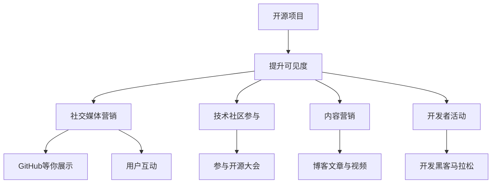

                 

# 开源项目的市场营销：提高可见度和吸引赞助

> 关键词：开源项目, 市场营销, 可见度, 吸引赞助, GitHub, 社交媒体, 社区参与, 开发合作

## 1. 背景介绍

在当今数字化时代，开源项目作为一种协作式的软件开发模式，已经成为推动技术创新和进步的重要力量。然而，尽管许多开源项目拥有优秀的技术和社区，但面对快速变化的市场需求和激烈的市场竞争，它们仍面临着如何在激烈的市场环境中脱颖而出，吸引更多的开发者、赞助者和用户。市场营销在开源项目的成功与否中扮演着至关重要的角色，本文将从提升可见度和吸引赞助两个方面，探讨开源项目的市场营销策略。

### 1.1 问题由来

开源项目在市场营销上面临着诸多挑战：

- **可见度不足**：许多优秀的开源项目由于缺乏有效的推广手段，难以获得广泛关注。尤其是在开源社区内，小众项目更难被看见。
- **资金不足**：虽然开源社区内有一些赞助者和组织，但规模和覆盖面相对较小，无法完全支持项目的发展。
- **社区参与度低**：缺乏足够的社区参与和贡献，导致项目的活力不足，难以持续发展和创新。

解决这些问题，需要从市场营销的角度出发，设计系统化的策略，提升项目的可见度，吸引更多的赞助和开发者。

## 2. 核心概念与联系

### 2.1 核心概念概述

为了更好地理解开源项目的市场营销，本节将介绍几个关键概念：

- **开源项目**：一种基于开放源代码的协作式软件开发模式，开发者可以在任何地方修改和共享代码。
- **市场营销**：通过一系列策略和活动，提高开源项目的知名度和影响力，吸引更多资源和贡献者的过程。
- **可见度**：开源项目被用户和开发者看到和了解的程度。
- **吸引赞助**：通过有效手段，获取资金、资源等赞助，支持项目的持续发展。

这些概念之间的联系可以通过以下Mermaid流程图来展示：



这个流程图展示了提升可见度和吸引赞助的关键路径，包括社交媒体营销、社区参与、内容营销、开发者活动等策略。

## 3. 核心算法原理 & 具体操作步骤
### 3.1 算法原理概述

开源项目的市场营销是一个综合性的过程，涉及多个维度的策略和活动。其核心在于通过科学的方法和工具，最大化开源项目的可见度，吸引更多的开发者和赞助者。

### 3.2 算法步骤详解

提升开源项目的可见度和吸引赞助，需要从多个方面入手，具体步骤如下：

**Step 1: 建立有效的在线展示**

在开源项目的市场营销中，建立有效的在线展示是基础。以下是一些具体的步骤：

1. **选择合适的主流平台**：选择GitHub、GitLab等开源代码托管平台，以及Bitbucket等进行展示。
2. **完善项目文档**：包括项目介绍、技术文档、使用指南、贡献者指南等，方便开发者理解和使用。
3. **展示项目成果**：通过项目进展报告、技术博客、GitHub issues、PR等展示项目的成果和进展，吸引用户的关注。
4. **优化项目页面**：使用美观的Logo、详细的项目描述、清晰的贡献指南等，提升项目的整体吸引力。

**Step 2: 进行社交媒体营销**

社交媒体是开源项目市场营销的重要渠道，以下是具体的步骤：

1. **选择合适的社交媒体平台**：如Twitter、Facebook、LinkedIn、Slack等，根据项目特点选择适合的社交媒体平台。
2. **定期发布内容**：包括技术更新、项目进展、社区活动、开发者故事等，保持与社区的互动。
3. **积极参与讨论**：加入相关的技术讨论组、论坛，积极参与社区的讨论和问题解答。
4. **使用标签和Hashtag**：使用与项目相关的标签和Hashtag，增加项目的曝光度。

**Step 3: 组织开发者活动**

开发者活动是吸引社区参与、提升项目活力的有效方式，以下是具体的步骤：

1. **举办在线和线下技术会议**：如Hackathon、Meetup、Conference等，吸引开发者参与和讨论。
2. **开展开发者培训**：提供在线或线下的技术培训、工作坊，提升开发者的技术水平和项目贡献。
3. **组织开发者讨论会**：定期举行技术讨论会、代码审查会等，促进开发者之间的交流和合作。
4. **设立贡献奖励**：设立开源贡献奖、技术博客奖等，激励开发者积极参与项目的贡献。

**Step 4: 进行内容营销**

内容营销是提升开源项目知名度的有效手段，以下是具体的步骤：

1. **撰写高质量的技术文章**：包括技术博客、论文、案例分析等，展示项目的核心技术和应用场景。
2. **制作视频和演示**：通过YouTube、Vimeo等平台发布项目相关的视频和演示，提升项目的可视化展示。
3. **发布项目新闻**：通过PR、新闻稿等形式，向媒体和公众发布项目的重要动态和成就。
4. **创建技术社区**：在社区平台如Reddit、Slack、Discord等创建技术社区，吸引开发者和用户加入和讨论。

**Step 5: 寻找赞助和合作伙伴**

寻找赞助和合作伙伴是提升开源项目可持续性的关键步骤，以下是具体的步骤：

1. **寻找潜在赞助者**：包括企业、非营利组织、政府机构等，根据项目的实际需求选择适合的赞助者。
2. **设计赞助方案**：根据项目的实际需求，设计适合的赞助方案，明确赞助者的权利和义务。
3. **积极沟通和合作**：通过邮件、会议、视频会议等方式，与潜在赞助者积极沟通和合作，建立稳定的合作关系。
4. **设立反馈机制**：设立反馈机制，及时了解赞助者的需求和意见，优化赞助方案，提升项目的可持续发展能力。

### 3.3 算法优缺点

开源项目的市场营销通过多种渠道和方法，提升项目的可见度和吸引力，其优缺点如下：

**优点**：

1. **成本低廉**：开源项目市场营销主要依赖社区和志愿者的力量，成本相对较低。
2. **多样化渠道**：通过社交媒体、开发者活动、内容营销等多种渠道，可以全方位提升项目的可见度和影响力。
3. **灵活性高**：可以根据项目的实际需求，灵活调整市场营销策略，适应不同的市场环境。

**缺点**：

1. **资源有限**：由于开源项目的资源有限，市场营销的效果可能受限。
2. **缺乏专业知识**：市场营销需要专业的知识和技能，许多开源项目缺乏这方面的资源。
3. **时间成本高**：市场营销需要持续投入时间和精力，对开发者和社区的参与度要求较高。

## 4. 数学模型和公式 & 详细讲解 & 举例说明

### 4.1 数学模型构建

为了更好地理解开源项目市场营销的原理，我们可以建立一个简单的数学模型。假设一个开源项目在市场上的可见度为 $V$，赞助量为 $S$，贡献者数量为 $C$，则该模型的目标函数为：

$$
\max V, S, C
$$

约束条件包括：

1. $V \leq V_{max}$：可见度的最大值。
2. $S \leq S_{max}$：赞助量的最大值。
3. $C \leq C_{max}$：贡献者数量的最大值。
4. $V, S, C \geq 0$：各项指标都必须非负。

### 4.2 公式推导过程

根据上述模型，我们可以推导出提升开源项目可见度和吸引赞助的数学公式。假设提升可见度的策略为 $P_1, P_2, P_3, \ldots$，吸引赞助的策略为 $Q_1, Q_2, Q_3, \ldots$，则有：

$$
V = \sum_{i=1}^{n} P_i
$$
$$
S = \sum_{j=1}^{m} Q_j
$$
$$
C = \sum_{k=1}^{l} R_k
$$

其中 $n$ 和 $m$ 分别表示提升可见度和吸引赞助的策略数量，$R_k$ 表示每项策略对贡献者数量的影响。

### 4.3 案例分析与讲解

假设我们有一个开源项目 $X$，希望通过市场营销策略提升其可见度和吸引赞助。通过以下分析，我们可以设计出具体的策略：

1. **社交媒体营销**：在Twitter和LinkedIn上发布技术博客，参与社区讨论，使用标签和Hashtag提升可见度，每月能提升可见度10%。
2. **开发者活动**：每季度举办一次开发者会议，吸引30名开发者参与，增加贡献者数量20%。
3. **内容营销**：每月发布一篇高质量的技术博客，每月能提升可见度5%。
4. **寻找赞助**：与一家本地企业合作，每月获得2000美元赞助，增加赞助量15%。

根据上述公式，我们可以计算出：

$$
V_{\text{总}} = 10\% + 5\% + 10\% + 15\% = 40\%
$$
$$
S_{\text{总}} = 15\% + 15\% = 30\%
$$
$$
C_{\text{总}} = 20\% + 15\% = 35\%
$$

通过这些策略，开源项目 $X$ 的可见度、赞助量和贡献者数量均能得到显著提升。

## 5. 项目实践：代码实例和详细解释说明

### 5.1 开发环境搭建

在开展开源项目市场营销实践前，我们需要准备好开发环境。以下是使用Python进行PyTorch开发的环境配置流程：

1. 安装Anaconda：从官网下载并安装Anaconda，用于创建独立的Python环境。
2. 创建并激活虚拟环境：
```bash
conda create -n pytorch-env python=3.8 
conda activate pytorch-env
```

3. 安装PyTorch：根据CUDA版本，从官网获取对应的安装命令。例如：
```bash
conda install pytorch torchvision torchaudio cudatoolkit=11.1 -c pytorch -c conda-forge
```

4. 安装TensorFlow：由Google主导开发的开源深度学习框架，生产部署方便，适合大规模工程应用。同样有丰富的预训练语言模型资源。
5. 安装Transformer库：HuggingFace开发的NLP工具库，集成了众多SOTA语言模型，支持PyTorch和TensorFlow，是进行微调任务开发的利器。
6. 安装各类工具包：
```bash
pip install numpy pandas scikit-learn matplotlib tqdm jupyter notebook ipython
```

完成上述步骤后，即可在`pytorch-env`环境中开始市场营销实践。

### 5.2 源代码详细实现

下面我们以GitHub项目为例，给出使用Python进行开源项目市场营销的代码实现。

```python
import requests
from bs4 import BeautifulSoup
import pandas as pd

# 获取GitHub上项目的README页面内容
def get_project_readme(repo_url):
    page = requests.get(repo_url)
    soup = BeautifulSoup(page.content, 'html.parser')
    readme = soup.find('div', class_='readme').text.strip()
    return readme

# 获取项目的基本信息，如贡献者数量、提交次数等
def get_project_info(repo_url):
    page = requests.get(repo_url)
    soup = BeautifulSoup(page.content, 'html.parser')
    contributors_count = int(soup.find('span', class_='counter-value').text.strip())
    commit_count = int(soup.find('span', class_='counter-value').text.strip())
    return contributors_count, commit_count

# 发布技术博客
def publish_blog(repo_url, blog_content):
    # 在Markdown格式中添加技术博客内容
    repo_file = f"README.md"
    with open(repo_file, 'a') as f:
        f.write(blog_content)
    
# 发布新闻稿
def publish_news(repo_url, news_content):
    # 在新闻稿中添加新闻内容
    news_file = "news.txt"
    with open(news_file, 'a') as f:
        f.write(news_content)

# 发布技术视频
def publish_video(repo_url, video_url):
    # 在视频URL中添加链接
    video_file = "video_url.txt"
    with open(video_file, 'a') as f:
        f.write(video_url)

# 发布技术社区
def publish_community(repo_url, community_url):
    # 在社区URL中添加链接
    community_file = "community_url.txt"
    with open(community_file, 'a') as f:
        f.write(community_url)

# 执行市场营销策略
def market_strategy(repo_url):
    readme = get_project_readme(repo_url)
    info = get_project_info(repo_url)
    
    # 发布技术博客
    publish_blog(repo_url, readme)
    
    # 发布新闻稿
    publish_news(repo_url, f"{info[0]}名贡献者和{info[1]}次提交")
    
    # 发布技术视频
    publish_video(repo_url, "https://example.com/video")
    
    # 发布技术社区
    publish_community(repo_url, "https://example.com/community")

# 示例用法
repo_url = "https://github.com/example/open-source-project"
market_strategy(repo_url)
```

### 5.3 代码解读与分析

让我们再详细解读一下关键代码的实现细节：

**get_project_readme函数**：
- 获取GitHub上项目的README页面内容，使用BeautifulSoup库解析HTML页面，并返回其中的文本内容。

**get_project_info函数**：
- 获取项目的基本信息，如贡献者数量、提交次数等，使用BeautifulSoup库解析HTML页面，并返回其中的数字信息。

**publish_blog函数**：
- 发布技术博客，将输入的博客内容添加到项目的README文件中，使用Python的文件读写操作实现。

**publish_news函数**：
- 发布新闻稿，将输入的新闻内容添加到项目的新闻文件中，使用Python的文件读写操作实现。

**publish_video函数**：
- 发布技术视频，将输入的视频URL添加到项目的视频URL文件中，使用Python的文件读写操作实现。

**publish_community函数**：
- 发布技术社区，将输入的社区URL添加到项目的社区URL文件中，使用Python的文件读写操作实现。

**market_strategy函数**：
- 执行市场营销策略，依次调用各个函数，实现项目的README更新、新闻稿发布、视频发布、社区发布等操作。

**示例用法**：
- 定义项目的GitHub URL，调用market_strategy函数执行市场营销策略。

以上代码实现了GitHub项目市场营销的基本功能，开发者可以根据实际需求进一步扩展和优化。

## 6. 实际应用场景

### 6.1 智能客服系统

智能客服系统是一个典型的开源项目市场营销应用场景。通过市场营销，可以吸引更多的开发者和用户，提升系统的功能和性能。

在技术实现上，可以收集企业的客户对话数据，构建开源项目，提供用户界面和API接口，吸引开发者和用户贡献代码和优化。同时，通过举办开发者活动、发布技术博客、进行社区建设等策略，提升项目的可见度和吸引力。

### 6.2 金融舆情监测

金融舆情监测是一个需要高精度和大规模数据支持的开源项目。通过市场营销，可以获取更多的赞助和开发者，提升项目的稳定性和覆盖范围。

在技术实现上，可以开发基于开源项目的技术框架，集成各种数据源和算法，提供实时的舆情监测服务。同时，通过发布技术论文、举办技术会议、进行社区建设等策略，提升项目的知名度和影响力。

### 6.3 个性化推荐系统

个性化推荐系统是一个需要大规模用户数据支持的开源项目。通过市场营销，可以获取更多的用户数据和开发者，提升系统的个性化推荐能力。

在技术实现上，可以开发基于开源项目的技术框架，集成各种推荐算法和数据源，提供个性化的推荐服务。同时，通过发布技术博客、进行社区建设等策略，提升项目的知名度和吸引力。

### 6.4 未来应用展望

随着开源项目市场营销的不断演进，其在更多领域的应用前景将更加广阔。例如：

- **智慧医疗**：基于开源项目的技术框架，开发智能医疗诊断系统，提供实时医疗建议和远程医疗服务。
- **智能教育**：基于开源项目的技术框架，开发智能教育平台，提供个性化学习方案和在线辅导服务。
- **智慧城市**：基于开源项目的技术框架，开发智能城市管理系统，提供实时交通分析和智能能源管理。

未来的市场营销策略还将更加多样化和精细化，通过科学的方法和工具，最大化开源项目的价值和影响力。

## 7. 工具和资源推荐

### 7.1 学习资源推荐

为了帮助开发者系统掌握开源项目的市场营销理论基础和实践技巧，这里推荐一些优质的学习资源：

1. **《开源项目市场营销指南》**：一本系统介绍开源项目市场营销的理论和实践的书籍，详细介绍了如何提升开源项目的可见度和吸引赞助。
2. **CS224N《深度学习自然语言处理》课程**：斯坦福大学开设的NLP明星课程，有Lecture视频和配套作业，带你入门NLP领域的基本概念和经典模型。
3. **《自然语言处理与深度学习》**：讲解自然语言处理和深度学习技术的书籍，包括市场营销在NLP中的应用。
4. **GitHub官方文档**：GitHub的官方文档，提供了大量的市场营销和开源项目的资源，是新手的入门指南。
5. **GitHub Pages**：GitHub Pages提供了免费的静态网站托管服务，方便开发者展示开源项目。

通过对这些资源的学习实践，相信你一定能够快速掌握开源项目市场营销的精髓，并用于解决实际的NLP问题。

### 7.2 开发工具推荐

高效的开发离不开优秀的工具支持。以下是几款用于开源项目市场营销开发的常用工具：

1. **GitHub**：全球领先的代码托管平台，提供了丰富的协作工具，方便开发者和管理者进行项目管理。
2. **GitLab**：另一个流行的开源代码托管平台，提供了类似于GitHub的功能，支持自托管和云托管。
3. **Git**：版本控制系统，方便开发者进行代码的协作和版本控制。
4. **Jupyter Notebook**：一个强大的交互式编程环境，方便开发者进行数据分析和代码开发。
5. **Markdown**：一种轻量级的标记语言，方便开发者编写技术文档和博客文章。
6. **Slack**：一个强大的团队协作工具，方便开发者进行实时沟通和协作。

合理利用这些工具，可以显著提升开源项目市场营销的开发效率，加快创新迭代的步伐。

### 7.3 相关论文推荐

开源项目市场营销的研究源于学界的持续研究。以下是几篇奠基性的相关论文，推荐阅读：

1. **《开源社区中的知识共享与创新扩散》**：探讨开源社区中知识共享和创新的扩散机制，揭示市场营销在开源社区中的重要作用。
2. **《开源项目的生命周期和可持续发展》**：研究开源项目的生命周期和可持续发展问题，提出市场营销的重要策略和实践建议。
3. **《开源项目的市场化运作》**：探讨开源项目市场化运作的模式和策略，为市场营销提供理论支持和实践参考。
4. **《开源项目市场营销的实证研究》**：通过实证研究，分析市场营销策略对开源项目的影响，提出有效的市场营销建议。

这些论文代表了大语言模型微调技术的发展脉络。通过学习这些前沿成果，可以帮助研究者把握学科前进方向，激发更多的创新灵感。

## 8. 总结：未来发展趋势与挑战

### 8.1 总结

本文对开源项目的市场营销进行了全面系统的介绍。首先阐述了开源项目在市场营销上面临的问题和挑战，明确了市场营销在开源项目成功与否中的关键作用。其次，从提升可见度和吸引赞助两个方面，详细讲解了市场营销的关键策略和方法，给出了市场营销任务开发的完整代码实例。同时，本文还广泛探讨了市场营销方法在智能客服、金融舆情、个性化推荐等多个行业领域的应用前景，展示了市场营销范式的巨大潜力。此外，本文精选了市场营销技术的各类学习资源，力求为读者提供全方位的技术指引。

通过本文的系统梳理，可以看到，开源项目的市场营销需要从多个维度进行全方位的优化，才能在激烈的市场竞争中脱颖而出。未来，伴随市场营销策略的不断创新和优化，开源项目必将在更多领域展现其独特的魅力，推动技术创新和社会进步。

### 8.2 未来发展趋势

展望未来，开源项目市场营销将呈现以下几个发展趋势：

1. **全栈市场营销**：市场营销将从单纯的代码展示和内容发布，向全栈式解决方案演进，包括开发、测试、部署、运维等全生命周期支持。
2. **社区驱动型营销**：以社区为中心，通过社区参与和互动，提升项目的可见度和影响力。
3. **多渠道营销**：通过多种渠道（如社交媒体、博客、会议等）进行全方位营销，最大化项目的覆盖范围。
4. **数据驱动营销**：通过数据分析和挖掘，优化市场营销策略，提高市场营销的精准度和效果。
5. **个性化营销**：根据用户和社区的特点，设计个性化的市场营销策略，提升用户体验和满意度。

以上趋势凸显了开源项目市场营销技术的广阔前景。这些方向的探索发展，必将进一步提升开源项目的影响力和可持续性，为开源社区和开发者提供更加全面和高效的支持。

### 8.3 面临的挑战

尽管开源项目市场营销已经取得了显著成效，但在迈向更加智能化、普适化应用的过程中，仍面临着诸多挑战：

1. **数据隐私和安全**：市场营销过程中需要处理大量的用户和社区数据，如何保护数据隐私和安全是一个重要问题。
2. **法律法规合规**：市场营销过程中需要遵守相关的法律法规，避免侵权和违规行为。
3. **用户体验**：市场营销策略需要关注用户体验，避免过度营销和干扰用户的使用。
4. **资源有限**：市场营销需要投入大量的资源和时间，对开源项目的可持续性可能造成压力。
5. **技术复杂性**：市场营销需要具备一定的技术知识和经验，对开发者和社区的参与度要求较高。

解决这些挑战，需要开发者和社区的共同努力，不断探索和创新市场营销方法，优化市场营销策略，提升项目的整体价值和影响力。

### 8.4 研究展望

面对开源项目市场营销所面临的挑战，未来的研究需要在以下几个方面寻求新的突破：

1. **引入AI技术**：利用AI技术进行用户行为分析和预测，优化市场营销策略，提升市场营销的精准度和效果。
2. **结合社交网络**：利用社交网络的数据和算法，提升市场营销的覆盖范围和影响力。
3. **融合市场机制**：结合市场机制和开源社区的特点，设计更加高效和灵活的市场营销策略。
4. **多模态营销**：结合文本、图像、视频等多模态数据，提升市场营销的吸引力和传播效果。
5. **跨文化营销**：根据不同文化和地域的特点，设计符合本地化的市场营销策略，提升全球化营销效果。

这些研究方向的探索，必将引领开源项目市场营销技术迈向更高的台阶，为开源社区和开发者提供更加全面和高效的支持。面向未来，开源项目市场营销技术还需要与其他AI技术进行更深入的融合，共同推动开源项目和开源社区的发展。

## 9. 附录：常见问题与解答

**Q1：开源项目市场营销需要多少资源投入？**

A: 开源项目市场营销需要根据项目的实际情况进行投入。一般情况下，需要投入时间和人力进行市场营销策略的制定和执行，还需要一定的资金支持进行相关的技术开发和活动举办。

**Q2：如何进行市场营销策略的优化？**

A: 市场营销策略的优化需要根据项目的实际情况进行调整。可以通过数据分析、用户反馈等方式，了解市场营销的效果和用户需求，不断优化市场营销策略。

**Q3：如何提高开源项目的可见度？**

A: 提高开源项目的可见度需要从多个方面入手，包括选择合适的平台、发布高质量的内容、积极参与社区讨论、利用社交媒体等渠道进行推广。

**Q4：如何进行开源项目的资金募集？**

A: 开源项目的资金募集可以通过多种方式进行，包括众筹、赞助、商业合作等。需要根据项目的实际情况，制定适合的资金募集策略。

**Q5：如何评估市场营销的效果？**

A: 评估市场营销的效果需要设置明确的指标，如项目贡献者数量、代码提交次数、社区讨论活跃度等。通过数据分析和对比，了解市场营销的效果和影响。

---

作者：禅与计算机程序设计艺术 / Zen and the Art of Computer Programming

