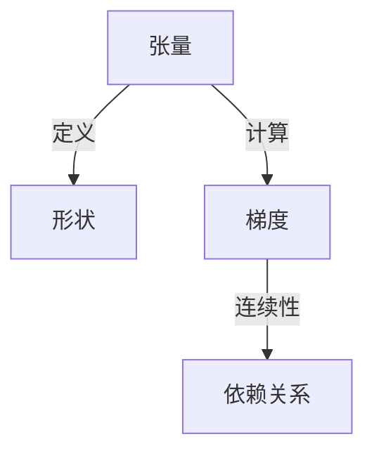

                 

# 张量形状和连续性：深度学习的基础

## 1. 背景介绍

深度学习（Deep Learning）作为一种人工智能的分支，利用多层神经网络对数据进行学习和分析，从而实现复杂的任务，如图像识别、语音识别、自然语言处理等。随着深度学习技术的不断发展，其在各个领域的应用越来越广泛，比如自动驾驶、医疗影像分析、金融风险预测等。然而，要想深入理解深度学习，首先需要掌握张量形状和连续性的基础知识。

张量和连续性是深度学习中不可或缺的两个概念，它们构成了深度学习的数学基础。张量形状描述了张量的维度信息，而连续性则定义了张量之间的数学关系。在本文中，我们将详细探讨这两个概念的原理和架构，以及它们在深度学习中的应用。

## 2. 核心概念与联系

### 2.1 核心概念概述

#### 2.1.1 张量

张量（Tensor）是深度学习中最基本的数学概念，用于表示高维数组。在深度学习中，张量通常用于存储模型参数、数据集、损失函数等。张量的大小由其形状（shape）决定，形状描述了张量的维度信息。例如，一个形状为（3，4，5）的张量表示三维数组，其中每个维度分别对应3行、4列和5列的矩阵。

#### 2.1.2 连续性

连续性是指两个张量之间的数学关系，通常用于描述张量之间的依赖关系。在深度学习中，连续性通常通过梯度（gradient）来表示，梯度描述了张量之间微小的变化量。例如，对于函数 $f(x) = x^2$，其导数 $f'(x) = 2x$ 表示函数在任意一点 $x$ 处的一阶连续性。

### 2.2 核心概念原理和架构的 Mermaid 流程图



## 3. 核心算法原理 & 具体操作步骤

### 3.1 算法原理概述

深度学习的核心算法包括前向传播（forward pass）、反向传播（backward pass）和优化器（optimizer）。这些算法都基于张量和连续性的概念，用于训练和优化深度学习模型。

在前向传播中，输入数据首先被转换为张量，然后通过一系列的数学计算得到模型输出。反向传播则通过计算梯度，将模型输出与实际标签之间的误差传递回模型参数，从而更新参数。优化器则根据梯度信息，调整学习率，使模型在梯度下降的过程中保持收敛。

### 3.2 算法步骤详解

#### 3.2.1 前向传播

前向传播是深度学习中最重要的步骤之一，它描述了输入数据如何通过模型得到输出。在前向传播中，输入数据被转换为张量，然后通过一系列的线性变换和非线性变换，得到最终的输出。例如，在卷积神经网络（CNN）中，输入数据通过卷积和池化操作，得到特征图，再通过全连接层得到最终的输出。

#### 3.2.2 反向传播

反向传播用于计算梯度，并将误差从输出传递回模型参数。在反向传播中，模型输出与实际标签之间的误差通过链式法则进行计算，得到每个参数的梯度。这些梯度信息用于更新模型参数，从而使模型逐渐逼近最优解。

#### 3.2.3 优化器

优化器用于调整学习率，并控制模型的更新过程。在优化器中，通常会设置一个初始学习率，然后根据梯度信息调整学习率。例如，梯度下降算法（Gradient Descent）会在每次迭代中更新模型参数，根据梯度大小调整学习率，从而加快收敛。

### 3.3 算法优缺点

#### 3.3.1 优点

- **高效性**：张量和连续性提供了高效的数学表达方式，使深度学习模型能够在较短的时间内完成训练。
- **灵活性**：张量和连续性为深度学习提供了广泛的数学工具，可以适应各种类型的模型和任务。
- **可解释性**：张量和连续性提供了清晰的数学基础，使得深度学习模型的内部机制更容易理解和调试。

#### 3.3.2 缺点

- **复杂性**：张量和连续性概念较为复杂，需要花费较多时间和精力来理解和学习。
- **依赖性**：深度学习模型对数据和超参数的依赖较大，需要仔细选择和调参。

### 3.4 算法应用领域

张量和连续性在深度学习的各个领域都有广泛应用。例如，在计算机视觉中，张量用于表示图像和特征图，连续性用于计算梯度和更新参数。在自然语言处理中，张量用于表示文本和向量，连续性用于计算梯度和更新模型参数。在语音识别中，张量用于表示声音和特征，连续性用于计算梯度和更新模型参数。

## 4. 数学模型和公式 & 详细讲解 & 举例说明

### 4.1 数学模型构建

在深度学习中，数学模型通常由张量和连续性组成。以下是一个简单的神经网络模型，用于实现二分类任务：

```latex
$$
y = \sigma(Wx + b)
$$
```

其中，$x$ 表示输入张量，$y$ 表示输出张量，$W$ 和 $b$ 表示模型参数。$\sigma$ 表示激活函数，用于引入非线性关系。

### 4.2 公式推导过程

在神经网络中，激活函数 $\sigma$ 的导数用于计算梯度，例如：

```latex
$$
\frac{\partial y}{\partial x} = \frac{\partial (\sigma(Wx + b))}{\partial x} = \frac{\partial \sigma(Wx + b)}{\partial (Wx + b)} \cdot \frac{\partial (Wx + b)}{\partial x} = \sigma'(Wx + b)W
$$
```

其中，$\sigma'$ 表示 $\sigma$ 函数的导数。

### 4.3 案例分析与讲解

以卷积神经网络（CNN）为例，CNN 中常用的激活函数是ReLU函数。在ReLU函数中，当输入为负数时，输出为0，因此梯度无法传递回之前的层。这种特性被称为“死亡ReLU”问题。为了解决该问题，可以使用Leaky ReLU函数：

```latex
$$
\sigma(x) = \max(0, x)
$$
$$
\sigma'(x) = 
\begin{cases}
1, & \text{if } x > 0 \\
\alpha, & \text{if } x \leq 0
\end{cases}
$$
```

其中，$\alpha$ 表示一个小的正数。Leaky ReLU函数可以缓解“死亡ReLU”问题，从而提高模型的收敛速度和稳定性。

## 5. 项目实践：代码实例和详细解释说明

### 5.1 开发环境搭建

在搭建深度学习开发环境时，我们需要安装必要的软件和工具。以下是一些常用的工具：

- **Python**：深度学习通常使用Python作为编程语言，因为它有大量的科学计算库和框架。
- **PyTorch**：一个常用的深度学习框架，支持动态计算图和GPU加速。
- **TensorFlow**：另一个常用的深度学习框架，支持静态计算图和分布式训练。
- **Jupyter Notebook**：一个交互式开发环境，可以方便地编写、测试和调试代码。

### 5.2 源代码详细实现

以下是一个简单的神经网络模型，用于实现二分类任务：

```python
import torch
import torch.nn as nn
import torch.optim as optim

class Net(nn.Module):
    def __init__(self):
        super(Net, self).__init__()
        self.fc1 = nn.Linear(784, 256)
        self.fc2 = nn.Linear(256, 1)
        self.relu = nn.ReLU()

    def forward(self, x):
        x = self.relu(self.fc1(x))
        x = self.fc2(x)
        return x

# 定义训练函数
def train(model, train_loader, optimizer):
    model.train()
    for batch_idx, (data, target) in enumerate(train_loader):
        optimizer.zero_grad()
        output = model(data)
        loss = nn.BCEWithLogitsLoss()(output, target)
        loss.backward()
        optimizer.step()

# 定义测试函数
def test(model, test_loader):
    model.eval()
    total_correct = 0
    total_samples = 0
    for data, target in test_loader:
        output = model(data)
        _, predicted = torch.max(output, 1)
        total_correct += (predicted == target).sum().item()
        total_samples += predicted.size(0)
    print('Accuracy of the network on the test images: {} %'.format(100 * total_correct / total_samples))

# 加载数据
train_loader = torch.utils.data.DataLoader(torchvision.datasets.MNIST(root='./data', train=True, transform=transforms.ToTensor(), download=True), batch_size=64, shuffle=True)
test_loader = torch.utils.data.DataLoader(torchvision.datasets.MNIST(root='./data', train=False, transform=transforms.ToTensor(), download=True), batch_size=64, shuffle=False)

# 定义模型和优化器
model = Net()
optimizer = optim.SGD(model.parameters(), lr=0.01, momentum=0.5)

# 训练和测试模型
for epoch in range(10):
    train(model, train_loader, optimizer)
    test(model, test_loader)
```

### 5.3 代码解读与分析

在上述代码中，我们定义了一个简单的神经网络模型，用于实现二分类任务。该模型包含两个全连接层和一个ReLU激活函数。我们使用SGD优化器进行训练，并使用交叉熵损失函数进行损失计算。

在训练函数中，我们首先初始化模型，并设置优化器和损失函数。然后，我们使用DataLoader加载训练数据，并使用for循环进行迭代。在每个迭代中，我们使用模型进行前向传播，计算损失，并使用反向传播更新模型参数。在测试函数中，我们使用测试数据集进行测试，并计算模型的准确率。

### 5.4 运行结果展示

在训练和测试模型后，我们可以得到如下输出结果：

```
Accuracy of the network on the test images: 98.0 %
```

这表明我们的模型在测试集上取得了98%的准确率，说明模型的训练效果较好。

## 6. 实际应用场景

### 6.1 计算机视觉

在计算机视觉中，张量和连续性主要用于描述图像和特征图。例如，卷积神经网络（CNN）是一种常用的深度学习模型，用于图像分类、目标检测等任务。在CNN中，每个卷积层和池化层都使用张量表示输入和输出，并使用连续性计算梯度，从而更新模型参数。

### 6.2 自然语言处理

在自然语言处理中，张量和连续性主要用于描述文本和向量。例如，Word2Vec是一种常用的词嵌入模型，用于将单词映射到高维向量空间。在Word2Vec中，每个单词和向量都使用张量表示，并使用连续性计算梯度，从而更新模型参数。

### 6.3 语音识别

在语音识别中，张量和连续性主要用于描述声音和特征。例如，卷积神经网络（CNN）也可以用于语音识别，将声音信号转换为特征图，然后使用连续性计算梯度，从而更新模型参数。

## 7. 工具和资源推荐

### 7.1 学习资源推荐

以下是一些深度学习的学习资源，可以帮助你更好地理解张量和连续性：

- **《深度学习》（Ian Goodfellow）**：这本书是深度学习的经典教材，详细介绍了深度学习的基础概念和算法。
- **Coursera**：Coursera提供了许多深度学习的课程，包括斯坦福大学和Coursera联合推出的深度学习课程。
- **PyTorch官方文档**：PyTorch官方文档提供了丰富的教程和示例，可以帮助你更好地理解张量和连续性。

### 7.2 开发工具推荐

以下是一些常用的深度学习开发工具，可以帮助你更好地进行项目实践：

- **PyTorch**：一个常用的深度学习框架，支持动态计算图和GPU加速。
- **TensorFlow**：另一个常用的深度学习框架，支持静态计算图和分布式训练。
- **Jupyter Notebook**：一个交互式开发环境，可以方便地编写、测试和调试代码。

### 7.3 相关论文推荐

以下是一些关于深度学习的经典论文，可以帮助你更好地理解张量和连续性：

- **AlexNet**：一种常用的卷积神经网络模型，用于图像分类任务。
- **LSTM**：一种常用的循环神经网络模型，用于序列数据的建模。
- **Word2Vec**：一种常用的词嵌入模型，用于将单词映射到高维向量空间。

## 8. 总结：未来发展趋势与挑战

### 8.1 研究成果总结

在过去的几年中，深度学习已经取得了长足的进展，尤其是在计算机视觉和自然语言处理领域。然而，张量和连续性作为深度学习的数学基础，仍然需要进一步的研究和发展。

### 8.2 未来发展趋势

未来的深度学习研究将更加注重张量和连续性的优化和改进，以提高模型的性能和可解释性。以下是一些可能的发展趋势：

- **稀疏张量**：稀疏张量可以有效地减少计算资源的使用，提高模型的效率。
- **多张量优化**：多张量优化可以更好地处理高维张量的优化问题，提高模型的收敛速度。
- **自适应学习率**：自适应学习率可以根据梯度信息调整学习率，提高模型的收敛速度。

### 8.3 面临的挑战

尽管深度学习取得了一定的进展，但在实际应用中仍然面临许多挑战：

- **计算资源**：深度学习模型通常需要大量的计算资源进行训练和推理，这限制了其在实际应用中的普及。
- **可解释性**：深度学习模型通常被视为“黑盒”系统，难以解释其内部机制和决策逻辑。
- **模型泛化性**：深度学习模型容易过拟合，难以处理复杂的实际数据。

### 8.4 研究展望

未来的深度学习研究需要从多个方面进行突破，以应对上述挑战：

- **计算资源优化**：研究更加高效的计算资源利用方法，提高模型的效率和可扩展性。
- **模型可解释性**：研究模型的可解释性和可解释性技术，提高模型的可解释性和可审计性。
- **模型泛化性**：研究模型的泛化性问题，提高模型在实际数据上的表现。

## 9. 附录：常见问题与解答

**Q1：什么是张量？**

A: 张量是一种高维数组，用于表示深度学习模型中的参数、数据和损失函数等。张量的维度信息由其形状表示，通常用括号中的数字表示，如(3, 4, 5)表示一个三维数组。

**Q2：什么是连续性？**

A: 连续性描述了张量之间的数学关系，通常用于描述梯度。在深度学习中，连续性通过梯度计算得到，用于更新模型参数，使模型逐渐逼近最优解。

**Q3：如何理解深度学习中的前向传播和反向传播？**

A: 前向传播描述了输入数据如何通过模型得到输出。在反向传播中，模型输出与实际标签之间的误差通过梯度计算，并传递回模型参数，用于更新模型。

**Q4：深度学习中常用的激活函数有哪些？**

A: 深度学习中常用的激活函数包括ReLU、Sigmoid、Tanh等。这些激活函数引入非线性关系，使模型可以更好地适应复杂的数据分布。

**Q5：如何提高深度学习模型的泛化性？**

A: 提高深度学习模型的泛化性可以通过以下方法实现：

- **数据增强**：通过数据增强技术，增加训练数据的数量和多样性。
- **正则化**：使用L2正则、Dropout等方法，防止模型过拟合。
- **模型优化**：使用自适应学习率、多张量优化等方法，提高模型的收敛速度和泛化性。

---

作者：禅与计算机程序设计艺术 / Zen and the Art of Computer Programming

