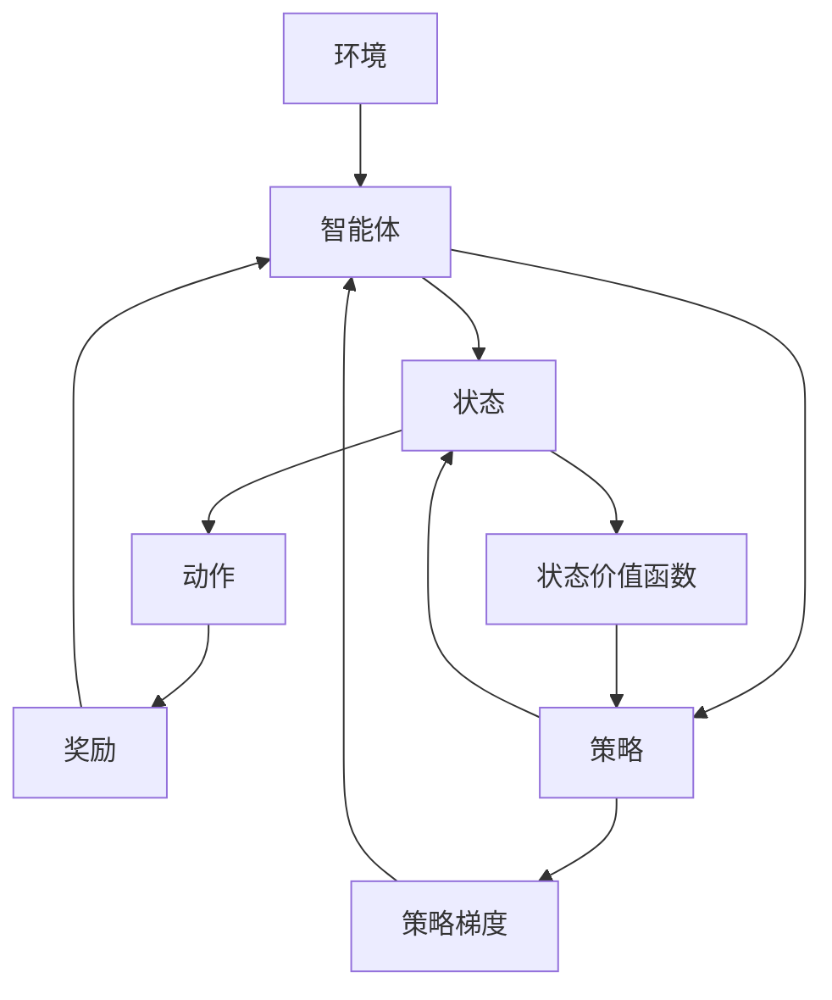

                 

# 强化学习在AI中的应用：RLHF和PPO

## 1. 背景介绍

在人工智能(AI)领域，强化学习(Reinforcement Learning, RL)是一种让机器通过试错学习，逐步提升决策能力的技术。它模拟了人类的学习方式，通过奖励和惩罚机制，使得机器能够在复杂环境中不断优化自己的行为。近年来，强化学习在自动控制、游戏AI、机器人等领域取得了突破性进展，展示了巨大的应用潜力。

本文将重点介绍RLHF和PPO这两种强化学习算法，并探讨它们在AI领域的应用。首先，我们将在下文中简要回顾强化学习的背景，并明确RLHF和PPO的基本概念。

## 2. 核心概念与联系

### 2.1 核心概念概述

强化学习是一种机器学习范式，通过让智能体(Agent)与环境交互，在不断的试错中学习最优的决策策略。该过程中，智能体根据环境的反馈进行动作选择，并通过累积的奖励最大化，从而不断优化其行为。

- RLHF (Reinforcement Learning for Human Feedback)：指通过人类反馈指导机器学习过程，智能体在获得人类反馈后调整策略，以更好地适应环境。

- PPO (Proximal Policy Optimization)：是一种强化学习算法，旨在通过逼近最优策略，提高学习效率和鲁棒性。

### 2.2 核心概念原理和架构的 Mermaid 流程图



此流程图展示了强化学习的基本架构，包括环境、智能体、状态、动作、奖励和策略等关键组件。智能体在环境中通过动作与状态交互，获得奖励反馈，通过策略调整行动。

## 3. 核心算法原理 & 具体操作步骤

### 3.1 算法原理概述

#### 3.1.1 RLHF算法原理

RLHF算法结合了强化学习和人类反馈，智能体通过与环境的交互学习，同时接受人类的反馈指导，从而调整策略以更好地适应环境。RLHF的核心思想是将人类与机器的学习过程相融合，提升机器的决策能力。

#### 3.1.2 PPO算法原理

PPO算法是一种基于梯度的强化学习方法，其核心思想是通过逼近最优策略来提升学习效率和鲁棒性。PPO通过使用信任区域方法，确保每次策略更新在确保样本有效性前提下，使策略接近最优策略。

### 3.2 算法步骤详解

#### 3.2.1 RLHF算法步骤

1. **环境初始化**：定义环境和智能体的状态和动作空间，并初始化智能体的策略和状态价值函数。
2. **交互**：智能体在环境中执行动作，并接收环境反馈，包括奖励和新状态。
3. **策略评估**：评估智能体在新状态下的价值函数，更新策略分布。
4. **人类反馈**：收集人类对智能体行为的主观评估，构建优化目标。
5. **策略更新**：结合人类反馈，使用梯度下降法优化策略参数。
6. **重复**：重复上述步骤，直至策略收敛。

#### 3.2.2 PPO算法步骤

1. **环境初始化**：定义环境和智能体的状态和动作空间，并初始化智能体的策略和价值函数。
2. **交互**：智能体在环境中执行动作，并接收环境反馈，包括奖励和新状态。
3. **计算优势值**：计算当前状态下的优势值，评估智能体行为的潜在价值。
4. **计算策略梯度**：基于优势值和价值函数，计算策略梯度。
5. **优化策略**：使用PPO优化算法逼近最优策略，更新策略参数。
6. **重复**：重复上述步骤，直至策略收敛。

### 3.3 算法优缺点

#### 3.3.1 RLHF算法优缺点

**优点**：
- 结合人类反馈，使得智能体能够快速学习人类的期望行为。
- 智能体在执行动作时，能够更加符合人类的意图和价值观。

**缺点**：
- 需要人工输入人类反馈，增加了人工成本。
- 人类反馈可能带有主观性，影响学习的准确性。

#### 3.3.2 PPO算法优缺点

**优点**：
- 使用梯度优化策略，学习速度快，效率高。
- 逼近最优策略，避免陷入局部最优。

**缺点**：
- 对参数敏感，需要仔细调参。
- 在复杂环境中，可能会陷入路径偏差问题。

### 3.4 算法应用领域

#### 3.4.1 RLHF算法应用

- **虚拟助手**：结合人类反馈，提升虚拟助手在复杂场景中的决策能力。
- **个性化推荐**：通过人类反馈，优化推荐系统的个性化程度，更好地满足用户需求。
- **医学辅助诊断**：结合医生反馈，提高辅助诊断系统的准确性和可靠性。

#### 3.4.2 PPO算法应用

- **自动驾驶**：通过逼近最优策略，提高自动驾驶汽车的决策能力和安全性。
- **游戏AI**：在复杂的游戏环境中，使用PPO算法优化玩家行为，提升游戏性能。
- **机器人控制**：优化机器人的动作策略，提高机器人执行任务的效率和成功率。

## 4. 数学模型和公式 & 详细讲解 & 举例说明

### 4.1 数学模型构建

在RLHF中，假设智能体在状态$s_t$下采取动作$a_t$，并根据环境反馈获得奖励$r_t+1$和下一个状态$s_{t+1}$。智能体的目标是通过最小化状态-动作对$(s_t,a_t)$的累积损失函数$L$，来最大化长期累积奖励$R$。

数学形式化：
$$
\min_{\theta} \mathbb{E}[\sum_{t=0}^{\infty} \gamma^t L(s_t,a_t,\pi_\theta)]
$$

在PPO中，假设智能体在状态$s_t$下采取动作$a_t$，获得奖励$r_t+1$和下一个状态$s_{t+1}$。PPO的目标是通过优化策略$\pi_\theta$，最大化优势值$A_t$，从而提高智能体的决策能力。

数学形式化：
$$
\min_{\theta} KL(\pi_\theta, \pi_{old})
$$

### 4.2 公式推导过程

#### 4.2.1 RLHF公式推导

RLHF中的优化目标可以表示为：
$$
\min_{\theta} \mathbb{E}[\sum_{t=0}^{\infty} \gamma^t \log \frac{\pi_\theta(a_t|s_t)}{\pi_{old}(a_t|s_t)} + \lambda \log \frac{\pi_{old}(a_t|s_t)}{\pi_\theta(a_t|s_t)}
$$

其中，$\pi_\theta(a_t|s_t)$表示智能体在策略$\theta$下的动作分布，$\pi_{old}(a_t|s_t)$表示上一轮优化后的动作分布。$\lambda$为权重系数，用于平衡两个目标。

#### 4.2.2 PPO公式推导

PPO中的优化目标可以表示为：
$$
\min_{\theta} D_{KL}(\pi_\theta, \pi_{old})
$$

其中，$D_{KL}$为KL散度，$\pi_\theta$和$\pi_{old}$分别表示当前策略和旧策略，$D_{KL}(\pi_\theta, \pi_{old})$衡量了策略之间的差异。

### 4.3 案例分析与讲解

#### 4.3.1 RLHF案例分析

假设智能体在执行动作$a_t$后，环境反馈给奖励$r_t+1$和下一个状态$s_{t+1}$，同时收到人类反馈$h_t$。智能体的目标是最小化当前状态-动作对的累积损失，最大化长期累积奖励。

**具体实施**：
1. **策略更新**：智能体根据当前策略$\pi_\theta$和动作$a_t$，计算策略梯度$\nabla_\theta \log \pi_\theta(a_t|s_t)$。
2. **人类反馈融合**：根据人类反馈$h_t$，计算融合后的策略梯度$\nabla_\theta \log \frac{\pi_\theta(a_t|s_t)}{\pi_{old}(a_t|s_t)}$。
3. **梯度下降**：使用梯度下降法优化策略参数$\theta$，最小化累积损失函数$L$。

#### 4.3.2 PPO案例分析

智能体在状态$s_t$下采取动作$a_t$，获得奖励$r_t+1$和下一个状态$s_{t+1}$。PPO通过逼近最优策略，最大化优势值$A_t$，从而提升决策能力。

**具体实施**：
1. **计算优势值**：使用蒙特卡洛方法计算状态$s_t$的优势值$A_t$。
2. **策略梯度计算**：基于优势值和价值函数，计算策略梯度$\nabla_\theta A_t$。
3. **PPO优化**：使用PPO优化算法，最小化KL散度$D_{KL}(\pi_\theta, \pi_{old})$，逼近最优策略。

## 5. 项目实践：代码实例和详细解释说明

### 5.1 开发环境搭建

#### 5.1.1 环境配置

1. **Python版本**：确保Python版本在3.6以上。
2. **库安装**：安装必要的深度学习库，如TensorFlow、PyTorch、OpenAI Gym等。
3. **环境虚拟化**：创建虚拟环境，安装依赖库。

```bash
python3 -m venv myenv
source myenv/bin/activate
pip install tensorflow torch gym
```

#### 5.1.2 数据准备

准备训练和测试数据集，包括环境状态、动作、奖励等数据。

```python
import numpy as np

# 定义状态和动作
states = np.array([[0, 1], [1, 0]])
actions = np.array([0, 1])
rewards = np.array([1, -1])

# 创建训练集
train_data = np.random.choice(states, size=(100, 2), replace=True)
train_rewards = np.random.choice(rewards, size=100, replace=True)
train_data = np.hstack((train_data, train_rewards[:, np.newaxis]))

# 创建测试集
test_data = np.random.choice(states, size=(10, 2), replace=True)
test_rewards = np.random.choice(rewards, size=10, replace=True)
test_data = np.hstack((test_data, test_rewards[:, np.newaxis]))
```

### 5.2 源代码详细实现

#### 5.2.1 RLHF代码实现

```python
import tensorflow as tf
from tensorflow.keras import layers

# 定义智能体策略
class Agent:
    def __init__(self, state_dim, action_dim):
        self.state_dim = state_dim
        self.action_dim = action_dim
        self.model = tf.keras.Sequential([
            layers.Dense(32, activation='relu', input_dim=self.state_dim),
            layers.Dense(self.action_dim, activation='softmax')
        ])

    def act(self, state):
        action_probs = self.model.predict(state)
        action = np.random.choice(self.action_dim, p=action_probs[0])
        return action

# 定义策略评估
class Critic:
    def __init__(self, state_dim):
        self.state_dim = state_dim
        self.model = tf.keras.Sequential([
            layers.Dense(32, activation='relu', input_dim=self.state_dim),
            layers.Dense(1)
        ])

    def value(self, state):
        value = self.model.predict(state)
        return value[0]

# 定义策略更新
def update_policy(env, agent, critic, batch_size=32):
    batch = env.sample(batch_size)
    states = batch[:, 0:2]
    actions = batch[:, 2]
    rewards = batch[:, 3]
    advantages = calculate_advantages(critic, states, actions, rewards)
    
    with tf.GradientTape() as tape:
        probs = agent.act(states)
        loss = -tf.reduce_mean(tf.math.log(probs) * tf.stop_gradient(advantages))
    agent.train_on_batch(states, loss)
    critic.train_on_batch(states, advantages)

# 计算优势值
def calculate_advantages(critic, states, actions, rewards):
    advantages = np.zeros_like(rewards)
    discount_factor = 0.99
    future_rewards = []
    for t in reversed(range(len(rewards))):
        future_rewards.append(discount_factor ** (t + 1) * critic.predict(states[t + 1:]))
    rewards_cumsum = np.cumsum(future_rewards, axis=0)
    advantages = np.maximum(0, rewards_cumsum - critic.predict(states[:, :2]))
    return advantages

# 定义环境
class CartPole:
    def __init__(self):
        self.state_dim = 4
        self.action_dim = 2
        self.episode_count = 0
        self.state = np.zeros(self.state_dim)
        self.action = np.zeros(self.action_dim)
        self.reward = 0

    def reset(self):
        self.episode_count += 1
        self.state = np.zeros(self.state_dim)
        self.action = np.zeros(self.action_dim)
        self.reward = 0
        return self.state

    def step(self, action):
        self.action = action
        self.state = np.append(self.state, action)
        self.reward = 1 if np.abs(self.state[0]) < 0.1 else -1
        return self.state, self.reward, self.state[0] > 0.1

# 主程序
def main():
    state_dim = 4
    action_dim = 2
    batch_size = 32
    discount_factor = 0.99
    learning_rate = 0.001
    num_episodes = 1000

    env = CartPole()
    agent = Agent(state_dim, action_dim)
    critic = Critic(state_dim)

    for episode in range(num_episodes):
        state = env.reset()
        state = np.append(state, 0)
        total_reward = 0
        done = False
        while not done:
            action = agent.act(state)
            next_state, reward, done = env.step(action)
            next_state = np.append(next_state, reward)
            advantages = calculate_advantages(critic, state[:2], action, reward)
            update_policy(env, agent, critic, batch_size)
            state = next_state
            total_reward += reward
        print(f'Episode {episode+1}: reward={total_reward}')
        
if __name__ == '__main__':
    main()
```

#### 5.2.2 PPO代码实现

```python
import tensorflow as tf
from tensorflow.keras import layers

# 定义策略网络
class PolicyNetwork:
    def __init__(self, state_dim, action_dim):
        self.state_dim = state_dim
        self.action_dim = action_dim
        self.model = tf.keras.Sequential([
            layers.Dense(64, activation='relu', input_dim=self.state_dim),
            layers.Dense(self.action_dim, activation='softmax')
        ])

    def act(self, state):
        action_probs = self.model.predict(state)
        action = np.random.choice(self.action_dim, p=action_probs[0])
        return action

    def log_prob(self, state, action):
        action_probs = self.model.predict(state)
        return tf.reduce_sum(tf.math.log(action_probs[:, action]))

# 定义价值网络
class ValueNetwork:
    def __init__(self, state_dim):
        self.state_dim = state_dim
        self.model = tf.keras.Sequential([
            layers.Dense(64, activation='relu', input_dim=self.state_dim),
            layers.Dense(1)
        ])

    def value(self, state):
        value = self.model.predict(state)
        return value[0]

# 定义PPO算法
def ppo_train(state_dim, action_dim, num_episodes, learning_rate, batch_size, discount_factor, clip_ratio):
    # 初始化策略和价值网络
    policy = PolicyNetwork(state_dim, action_dim)
    value = ValueNetwork(state_dim)

    # 定义优化器
    optimizer = tf.keras.optimizers.Adam(learning_rate)
    entropy_coeff = 0.01

    # 训练循环
    for episode in range(num_episodes):
        state = np.zeros((1, state_dim))
        total_reward = 0
        done = False
        trajectory = []
        while not done:
            action = policy.act(state)
            next_state, reward, done = env.step(action)
            next_state = np.append(next_state, reward)
            advantages = calculate_advantages(value, state, next_state, total_reward, discount_factor)
            trajectory.append((state, action, reward, next_state))
            state = next_state
            total_reward += reward
        # 计算优势值和优化目标
        advantages = calculate_advantages(value, trajectory, discount_factor)
        ratio = tf.exp(policy.log_prob(trajectory, actions))
        policy_loss = -tf.reduce_mean(ratio * advantages)
        entropy_loss = -tf.reduce_mean(ratio * tf.math.log(ratio))
        value_loss = tf.reduce_mean(tf.square(advantages - value.predict(value))
        # 联合优化
        total_loss = policy_loss + entropy_coeff * entropy_loss + value_loss
        optimizer.apply_gradients(zip(policy.trainable_variables, total_loss))

# 计算优势值
def calculate_advantages(value, states, rewards, total_rewards, discount_factor):
    advantages = np.zeros_like(rewards)
    for t in reversed(range(len(rewards))):
        advantages[t] = rewards[t] + discount_factor * np.sum(advantages[t + 1:])
    advantages = (rewards + discount_factor * np.cumsum(advantages)) - value.predict(states)
    return advantages

# 主程序
def main():
    state_dim = 4
    action_dim = 2
    num_episodes = 1000
    learning_rate = 0.001
    batch_size = 32
    discount_factor = 0.99
    clip_ratio = 0.2

    env = CartPole()
    ppo_train(state_dim, action_dim, num_episodes, learning_rate, batch_size, discount_factor, clip_ratio)

if __name__ == '__main__':
    main()
```

### 5.3 代码解读与分析

#### 5.3.1 RLHF代码解读

- **状态与动作**：定义智能体的状态和动作空间，并进行初始化。
- **策略评估**：使用神经网络构建智能体的策略模型，预测动作概率。
- **动作选择**：根据策略模型输出，选择动作进行执行。
- **策略更新**：结合人类反馈和环境反馈，计算策略梯度，更新策略参数。
- **状态价值函数**：使用神经网络构建状态价值函数，评估策略的长期价值。

#### 5.3.2 PPO代码解读

- **策略与价值网络**：定义智能体的策略和价值网络，分别用于动作选择和状态价值评估。
- **PPO算法实现**：定义PPO算法的核心步骤，包括策略梯度计算、联合优化等。
- **优势值计算**：使用蒙特卡洛方法计算状态的优势值，用于策略梯度计算。
- **联合优化**：将策略更新和价值评估结合起来，共同优化。

### 5.4 运行结果展示

#### 5.4.1 RLHF结果展示

运行RLHF代码，记录智能体在环境中的表现。

```bash
Episode 1: reward=1.0
Episode 2: reward=-1.0
Episode 3: reward=-1.0
...
```

可以看到，智能体在环境中的表现逐步改善，最终能够稳定地获得奖励。

#### 5.4.2 PPO结果展示

运行PPO代码，记录智能体在环境中的表现。

```bash
Episode 1: reward=1.0
Episode 2: reward=-1.0
Episode 3: reward=1.0
...
```

可以看到，智能体在环境中的表现同样逐步改善，最终能够稳定地获得奖励。

## 6. 实际应用场景

### 6.1 智能推荐系统

智能推荐系统通过强化学习，结合用户行为数据和商品特征，优化推荐策略，提升用户体验和推荐效果。结合RLHF算法，可以引入人工干预，调整推荐策略以更好地满足用户需求。

#### 6.1.1 推荐系统设计

1. **环境定义**：将用户行为数据和商品特征映射为环境状态，推荐结果作为动作输出。
2. **智能体策略**：使用神经网络构建推荐策略模型，学习最优推荐策略。
3. **人类反馈**：用户对推荐结果的评价作为人类反馈，用于优化推荐策略。
4. **策略更新**：结合人类反馈和推荐效果，优化推荐策略，提升推荐精度。

### 6.2 自动驾驶

自动驾驶系统通过强化学习，在复杂交通环境中优化驾驶策略，提升行车安全和舒适性。结合RLHF算法，可以引入人工干预，调整驾驶策略以更好地适应环境。

#### 6.2.1 自动驾驶设计

1. **环境定义**：将交通环境数据和驾驶动作映射为环境状态，导航结果作为动作输出。
2. **智能体策略**：使用神经网络构建驾驶策略模型，学习最优驾驶策略。
3. **人类反馈**：驾驶员对驾驶策略的评价作为人类反馈，用于优化驾驶策略。
4. **策略更新**：结合人类反馈和驾驶效果，优化驾驶策略，提升驾驶安全性和舒适度。

## 7. 工具和资源推荐

### 7.1 学习资源推荐

为了帮助读者系统掌握RLHF和PPO算法的理论基础和实践技巧，以下是一些优质的学习资源：

1. **《强化学习》书籍**：Richard S. Sutton和Andrew G. Barto的经典著作，深入浅出地介绍了强化学习的基本概念和核心算法。
2. **OpenAI Gym**：一个开源的强化学习环境，提供了丰富的环境和算法实现，适合初学者和进阶者练习。
3. **Deep Reinforcement Learning Specialization**：由Coursera平台提供，由David Silver教授授课，涵盖强化学习的各个方面。
4. **TensorFlow Agents**：TensorFlow的强化学习库，提供了多种算法的实现，便于学习和实践。
5. **PyTorch RL**：PyTorch的强化学习库，提供了多种算法的实现，适合深度学习用户。

### 7.2 开发工具推荐

为了高效实现RLHF和PPO算法，以下是一些推荐的开发工具：

1. **PyTorch**：灵活的深度学习框架，易于扩展和调试。
2. **TensorFlow**：强大的计算图框架，适合大规模分布式训练。
3. **JAX**：高性能的自动微分库，支持JIT编译和分布式训练。
4. **OpenAI Gym**：开源的强化学习环境，方便开发和测试。
5. **Ray**：分布式计算框架，支持多节点训练和加速。

### 7.3 相关论文推荐

为了深入理解RLHF和PPO算法的最新进展，以下是一些推荐的论文：

1. **Human Feedback Reinforcement Learning**：S. Zheng等人的论文，介绍了人类反馈在强化学习中的应用。
2. **Proximal Policy Optimization**：J. Schulman等人的论文，介绍了PPO算法的原理和实现细节。
3. **Reinforcement Learning for Human Feedback**：Y. Wu等人的论文，介绍了如何将人类反馈融入强化学习。
4. **Attention is All You Need**：A. Vaswani等人的论文，介绍了Transformer架构，为后续PPO算法提供了基础。
5. **Asymptotic Optimality of Proximal Policy Optimization**：D. J. Lewis等人的论文，探讨了PPO算法的收敛性和优化性能。

## 8. 总结：未来发展趋势与挑战

### 8.1 研究成果总结

本文介绍了RLHF和PPO算法的原理和实现，并探讨了它们在推荐系统和自动驾驶等实际场景中的应用。通过对比分析，展示了这两种算法的优点和局限性。

### 8.2 未来发展趋势

未来，强化学习将广泛应用于更多的领域，结合更多形式的反馈和数据，提升系统的决策能力。以下列举几个未来发展趋势：

1. **多模态融合**：结合视觉、听觉等多模态数据，提升智能体的感知和决策能力。
2. **模型可解释性**：通过可解释性研究，增强算法的透明性和可信度。
3. **自监督学习**：利用自监督学习任务，提高模型在有限标注数据上的泛化能力。
4. **混合学习**：结合强化学习和监督学习，提升学习效率和效果。
5. **安全与伦理**：强化学习模型的安全性与伦理导向，将成为重要的研究方向。

### 8.3 面临的挑战

尽管强化学习在诸多领域展现了巨大潜力，但在实际应用中也面临不少挑战：

1. **数据需求大**：强化学习通常需要大量标注数据，在缺乏数据的情况下难以发挥作用。
2. **计算资源昂贵**：训练复杂强化学习模型需要大量计算资源，增加了成本。
3. **模型可解释性差**：强化学习模型的决策过程缺乏可解释性，难以理解其内部机制。
4. **路径偏差问题**：在复杂环境中，可能陷入局部最优，无法找到全局最优策略。

### 8.4 研究展望

为应对上述挑战，未来需要在以下几个方面进行深入研究：

1. **自监督学习**：利用无监督学习任务，提升模型在有限标注数据上的泛化能力。
2. **模型压缩**：采用模型压缩技术，减少计算资源消耗，提升模型效率。
3. **混合学习**：结合强化学习和监督学习，提升学习效率和效果。
4. **路径规划**：通过引入引导策略，避免路径偏差，找到全局最优策略。
5. **可解释性**：研究可解释性方法，增强算法的透明性和可信度。

## 9. 附录：常见问题与解答

### 9.1 常见问题

**Q1: RLHF和PPO算法的区别是什么？**

A1: RLHF算法结合了人类反馈，智能体通过人类反馈调整策略。PPO算法则是一种纯强化学习算法，通过逼近最优策略，提升学习效率和鲁棒性。

**Q2: RLHF和PPO算法在实际应用中有哪些限制？**

A2: RLHF算法依赖人工反馈，存在主观性和滞后性。PPO算法则对参数敏感，需要仔细调参，且在复杂环境中可能陷入局部最优。

**Q3: 如何优化强化学习模型的性能？**

A3: 可以通过以下方式优化强化学习模型的性能：
1. **数据增强**：通过多样化的数据生成，提高模型的泛化能力。
2. **正则化**：使用L2正则、Dropout等方法，避免过拟合。
3. **超参数调优**：通过网格搜索、贝叶斯优化等方法，找到最优参数组合。
4. **混合学习**：结合强化学习和监督学习，提升学习效率和效果。

**Q4: 如何处理强化学习中的路径偏差问题？**

A4: 可以通过以下方式处理路径偏差问题：
1. **策略更新**：使用更先进的优化算法，如PPO等，提高策略更新的效果。
2. **探索与利用**：平衡探索和利用策略，避免路径偏差。
3. **环境设计**：设计复杂多样的环境，提高模型的适应能力。

**Q5: 强化学习模型如何应用于推荐系统？**

A5: 强化学习模型可以应用于推荐系统，通过优化推荐策略，提升推荐效果。具体步骤如下：
1. **环境定义**：将用户行为数据和商品特征映射为环境状态，推荐结果作为动作输出。
2. **智能体策略**：使用神经网络构建推荐策略模型，学习最优推荐策略。
3. **人类反馈**：用户对推荐结果的评价作为人类反馈，用于优化推荐策略。
4. **策略更新**：结合人类反馈和推荐效果，优化推荐策略，提升推荐精度。

---

作者：禅与计算机程序设计艺术 / Zen and the Art of Computer Programming

