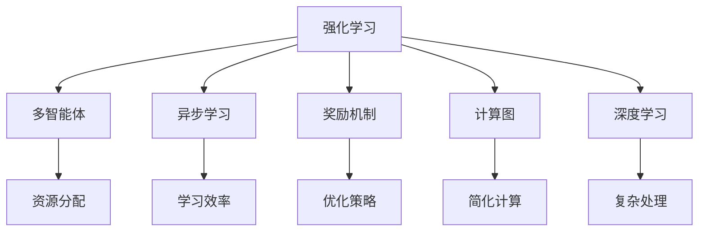

                 

# 强化学习在注意力资源分配中的应用

> 关键词：强化学习,注意力,资源分配,多智能体,异步学习,奖励机制,计算图,深度学习

## 1. 背景介绍

### 1.1 问题由来

在许多应用场景中，资源（如计算、通信、存储等）的分配和调度需要实时响应动态变化的需求，同时也需要考虑到成本效益、性能优化和公平性等约束。传统的人工调度策略难以兼顾这些复杂因素，而人工智能技术特别是强化学习(Reinforcement Learning, RL)提供了一种基于学习的方法，通过不断的试错和优化，在动态环境中实现资源的最优分配。

例如，在云计算系统中，如何在多个任务之间高效分配计算资源，使得每个任务都能在指定的时间内完成，同时保持系统整体的高效运行，是一个复杂的问题。传统的调度算法往往依赖于静态模型的预测，难以处理非线性、非稳态的系统动态变化。而强化学习通过不断试错，能够在复杂的动态环境中逐步优化资源分配策略，提升系统的整体性能和用户体验。

### 1.2 问题核心关键点

强化学习在资源分配中的应用，核心在于构建一个智能体(Agent)，通过不断的交互和学习，优化资源分配策略。具体而言，智能体在每个时间步(state)根据当前资源使用情况、任务需求等信息，选择一个行动(action)，以获得最大化的奖励(reward)。通过不断的学习和调整，智能体逐渐找到最优的资源分配方案。

### 1.3 问题研究意义

强化学习在资源分配中的应用，对于提升系统效率、降低资源浪费、优化用户体验等具有重要意义：

1. **提升效率**：通过动态优化资源分配，智能体可以实时响应系统变化，提升资源利用率，减少等待和延迟。
2. **降低成本**：智能体可以自动选择最优资源分配策略，避免人工调度的重复工作，降低运营成本。
3. **优化用户体验**：通过实时调整资源分配，智能体可以保障用户的服务质量，提升用户体验。
4. **应对动态变化**：强化学习算法可以在不断变化的环境中自我适应和优化，适应各种突发情况。
5. **增强鲁棒性**：通过学习，智能体可以更好地应对异常情况，提升系统的鲁棒性。

## 2. 核心概念与联系

### 2.1 核心概念概述

为更好地理解强化学习在资源分配中的应用，本节将介绍几个密切相关的核心概念：

- 强化学习(Reinforcement Learning)：通过智能体与环境的交互，学习最优行为策略的框架。智能体根据环境状态和行动选择，最大化预期奖励，优化策略。
- 多智能体(Multi-Agent)：多个智能体在同一个环境中协作，共同优化目标。多智能体系统强调智能体间的合作与竞争，可以模拟更为复杂的环境。
- 异步学习(Asynchronous Learning)：多个智能体并行学习，提升学习效率和资源利用率。
- 奖励机制(Reward Mechanism)：定义智能体行为的好坏，通过奖励机制引导智能体向最优策略学习。
- 计算图(Computation Graph)：描述智能体动作和状态的动态变化，简化计算和优化过程。
- 深度学习(Deep Learning)：作为强化学习的重要工具，深度神经网络能够处理复杂的环境和动作空间，实现高效的强化学习算法。

这些核心概念之间的逻辑关系可以通过以下Mermaid流程图来展示：



这个流程图展示了一组强化学习在资源分配应用中涉及的关键概念及其关系：

1. 强化学习是核心框架，用于指导智能体学习最优策略。
2. 多智能体和多智能体系统强调智能体间的协作与竞争，适用于复杂系统环境。
3. 异步学习提升学习效率，适用于资源有限的环境。
4. 奖励机制引导智能体学习行为，优化策略。
5. 计算图简化计算和优化过程。
6. 深度学习处理复杂环境，提供高效的强化学习算法。
7. 资源分配是多智能体系统的一个具体应用场景。

这些概念共同构成了强化学习在资源分配应用的理论基础，使得智能体能够在动态环境中不断优化资源分配策略。

## 3. 核心算法原理 & 具体操作步骤

### 3.1 算法原理概述

强化学习在资源分配中的应用，主要通过构建一个智能体(Agent)，在每个时间步(state)根据当前资源使用情况、任务需求等信息，选择一个行动(action)，以获得最大化的奖励(reward)。通过不断的学习和调整，智能体逐渐找到最优的资源分配方案。

形式化地，假设智能体在每个时间步的资源分配策略为 $a$，资源使用情况为 $s$，任务需求为 $d$，奖励函数为 $r$，则强化学习的目标是最小化资源分配的误差，即：

$$
\min_a \mathcal{L}(a|s,d) = \mathbb{E}_{s,d}[\sum_t r(t,a(t),s(t),d(t))]
$$

其中 $\mathbb{E}$ 表示对时间步 $t$ 的期望，$a(t)$ 表示智能体在第 $t$ 个时间步的行动。目标是通过优化行动 $a$，使得总奖励最大化。

### 3.2 算法步骤详解

强化学习在资源分配中的应用一般包括以下几个关键步骤：

**Step 1: 构建智能体模型**
- 定义智能体的状态空间 $s$，包括资源使用情况、任务需求、时间步数等。
- 定义智能体的行动空间 $a$，如增加资源、减少资源、动态调整等。
- 定义奖励函数 $r(s,a)$，表示智能体行动的好坏，如任务完成度、系统响应时间、成本等。
- 选择合适的强化学习算法，如Q-learning、SARSA、Actor-Critic等。

**Step 2: 初始化参数**
- 初始化智能体的参数，如学习率、动量、折扣因子等。
- 初始化环境状态 $s_0$，根据系统实际情况生成。
- 初始化智能体的行动 $a_0$，通常选择随机行动。

**Step 3: 执行学习迭代**
- 智能体在每个时间步根据当前状态和行动空间，选择行动。
- 执行智能体在环境中的操作，更新环境状态 $s_t$ 和奖励 $r_t$。
- 根据当前状态和行动，计算新的智能体行动。
- 更新智能体参数，以最小化总奖励误差。
- 重复执行直到满足预设的停止条件。

**Step 4: 测试和部署**
- 在实际环境中测试智能体，评估其性能。
- 将智能体集成到资源分配系统中，实时响应任务需求。
- 持续监控智能体的表现，定期更新参数以适应新的系统变化。

以上是强化学习在资源分配应用的一般流程。在实际应用中，还需要根据具体环境特点，对智能体模型的各个部分进行优化设计，以确保智能体在实际系统中能够高效运行。

### 3.3 算法优缺点

强化学习在资源分配中的应用具有以下优点：
1. 自适应性强：智能体能够在动态环境中自适应调整资源分配策略，应对非线性、非稳态的系统变化。
2. 优化效果显著：通过不断的学习和优化，智能体可以找到最优的资源分配方案，提升系统性能。
3. 增强用户体验：智能体能够实时响应任务需求，保障用户的服务质量。
4. 应对突发事件：智能体能够灵活调整资源分配，应对系统中的突发事件。

同时，该方法也存在一些局限性：
1. 学习效率低：强化学习需要大量的试错和探索，学习过程可能会耗费较长的时间。
2. 状态空间复杂：在复杂的系统中，状态空间可能非常庞大，难以处理。
3. 奖励设计困难：奖励函数的定义需要根据具体应用场景，可能存在主观性和误导性。
4. 稳定性和鲁棒性：在实际应用中，系统可能存在不确定性和噪声，影响智能体的稳定性和鲁棒性。

尽管存在这些局限性，但就目前而言，强化学习在资源分配中的应用已经取得了显著的成果，并在多个领域得到广泛应用。

### 3.4 算法应用领域

强化学习在资源分配中的应用主要涵盖以下几个领域：

- **云计算系统**：在云资源调度、虚拟机管理、任务调度等方面，智能体可以根据当前系统负载和任务需求，动态调整资源分配，提升系统的利用率和响应速度。
- **网络系统**：在负载均衡、流量控制、路由策略等方面，智能体可以实时调整网络资源，优化网络性能，提升用户体验。
- **电力系统**：在电力分配、能源管理、故障处理等方面，智能体可以根据电力需求和系统状态，动态调整资源分配，保障电力系统的稳定运行。
- **智能交通**：在交通流量控制、智能信号灯管理等方面，智能体可以实时调整交通信号，优化交通流，减少拥堵和事故。
- **智能制造**：在生产计划、设备维护、任务调度等方面，智能体可以根据生产需求和设备状态，动态调整资源分配，提升生产效率和设备利用率。

除了这些经典应用外，强化学习在资源分配中的应用还在不断拓展，如智能仓储、智慧城市、智能农业等领域，为不同行业的智能化升级提供新的思路和技术支持。

## 4. 数学模型和公式 & 详细讲解

### 4.1 数学模型构建

在资源分配的应用场景中，智能体需要实时处理动态变化的环境状态，通过不断的交互和学习，优化资源分配策略。以下将通过一个具体的例子，展示强化学习在资源分配中的数学模型构建。

假设智能体需要在一个包含多个任务的系统中，动态分配计算资源。假设智能体的状态 $s$ 包括当前系统负载 $L$、任务队列长度 $Q$、时间步数 $t$，智能体的行动 $a$ 包括增加资源、减少资源、动态调整等。智能体的奖励函数 $r(s,a)$ 定义为任务完成度 $C$ 和系统响应时间 $T$ 的加权和，即 $r(s,a) = \alpha C(s,a) + (1-\alpha) T(s,a)$，其中 $\alpha$ 为任务完成度的权重。

定义智能体在每个时间步的行动 $a_t$，环境状态 $s_t$ 和奖励 $r_t$，则强化学习的目标是最小化总奖励误差，即：

$$
\min_a \mathcal{L}(a|s,d) = \mathbb{E}_{s,d}[\sum_t r_t]
$$

其中 $\mathbb{E}$ 表示对时间步 $t$ 的期望，$a_t$ 表示智能体在第 $t$ 个时间步的行动。

### 4.2 公式推导过程

以下我们以Q-learning算法为例，推导资源分配的Q值更新公式。

假设智能体在每个时间步的Q值 $Q(s_t,a_t)$ 表示在状态 $s_t$ 下采取行动 $a_t$ 的预期总奖励，即 $Q(s_t,a_t) = \mathbb{E}_{s_{t+1},r_{t+1}}[r_{t+1} + \gamma Q(s_{t+1},a_{t+1})]$，其中 $\gamma$ 为折扣因子。

Q-learning算法通过最大化Q值来更新智能体的行动策略。具体而言，智能体在每个时间步 $t$ 根据当前状态 $s_t$ 选择行动 $a_t$，在环境 $E$ 中执行该行动，得到新的状态 $s_{t+1}$ 和奖励 $r_{t+1}$。根据当前状态和行动计算Q值，并更新Q值：

$$
Q(s_t,a_t) \leftarrow Q(s_t,a_t) + \alpha [r_t + \gamma \max_{a_{t+1}} Q(s_{t+1},a_{t+1}) - Q(s_t,a_t)]
$$

其中 $\alpha$ 为学习率。Q值更新公式的含义是：智能体在状态 $s_t$ 下采取行动 $a_t$ 的Q值，由当前奖励 $r_t$ 和后续Q值的加权平均更新。智能体会选择使Q值最大化的行动，以最大化总奖励。

### 4.3 案例分析与讲解

假设在一个云资源调度的系统中，智能体需要动态分配虚拟机实例以处理不同的任务。初始状态为系统负载 $L=0$，任务队列长度 $Q=0$，时间步数 $t=0$。智能体可以选择增加一个虚拟机实例或减少一个虚拟机实例，奖励函数定义为任务完成度 $C=0.8$ 和系统响应时间 $T=1$ 的加权和。

智能体的初始行动策略为随机选择，即 $a_0 = \text{random}(\{加资源, 减资源\})$。智能体在每个时间步根据当前状态和行动选择行动，更新状态和奖励，并计算Q值，最终更新行动策略。

例如，在第1个时间步 $t=0$，智能体选择增加一个虚拟机实例 $a_0 = \text{加资源}$，系统负载变为 $L=1$，任务队列长度为 $Q=1$。根据当前状态和行动计算Q值：

$$
Q(s_0,a_0) = 0.8 + (1-0.8) \times 1 = 0.2
$$

智能体在第1个时间步的行动策略为 $a_1 = \text{加资源}$。在第2个时间步 $t=1$，智能体再次选择增加一个虚拟机实例 $a_1 = \text{加资源}$，系统负载变为 $L=2$，任务队列长度为 $Q=1$。根据当前状态和行动计算Q值：

$$
Q(s_1,a_1) = 0.8 + (1-0.8) \times 1 + 0.2 \times (0.8 + (1-0.8) \times 1) = 0.4
$$

智能体在第2个时间步的行动策略为 $a_2 = \text{加资源}$。依此类推，智能体根据当前状态和行动计算Q值，并逐步更新行动策略，直到达到预设的停止条件。

## 5. 项目实践：代码实例和详细解释说明

### 5.1 开发环境搭建

在进行资源分配的强化学习实践前，我们需要准备好开发环境。以下是使用Python进行TensorFlow开发的环境配置流程：

1. 安装Anaconda：从官网下载并安装Anaconda，用于创建独立的Python环境。

2. 创建并激活虚拟环境：
```bash
conda create -n tf-env python=3.8 
conda activate tf-env
```

3. 安装TensorFlow：根据CUDA版本，从官网获取对应的安装命令。例如：
```bash
conda install tensorflow
```

4. 安装TensorBoard：
```bash
pip install tensorboard
```

5. 安装TensorFlow Extended (TFX)：用于处理大规模数据和构建可扩展的机器学习流水线，适合于复杂的强化学习实验。
```bash
pip install tfx
```

完成上述步骤后，即可在`tf-env`环境中开始强化学习实践。

### 5.2 源代码详细实现

下面我们以云资源调度为例，给出使用TensorFlow实现Q-learning算法的代码实现。

首先，定义环境状态和行动空间：

```python
import tensorflow as tf
import tensorflow.keras as keras
import numpy as np

# 定义状态和行动空间
states = np.array([0, 1, 2, 3, 4, 5])
actions = np.array([0, 1])
```

然后，定义奖励函数：

```python
def reward(s, a):
    if a == 0:  # 增加资源
        return 0.8
    else:  # 减少资源
        return 1
```

接着，定义Q值函数：

```python
def q_value(s, a):
    if a == 0:  # 增加资源
        return 0.2 + 0.2 * (0.8 + (1-0.8))
    else:  # 减少资源
        return 0.1 + 0.1 * (0.5 + (1-0.5))
```

定义智能体的学习率和学习次数：

```python
learning_rate = 0.01
learning_steps = 10000
```

定义智能体的Q值更新函数：

```python
def update_q_value(s, a):
    q_new = q_value(s, a) + learning_rate * (reward(s, a) + 0.9 * max(q_value(s + 1, 0), q_value(s + 1, 1)) - q_value(s, a))
    return q_new
```

最后，实现智能体的学习过程：

```python
for step in range(learning_steps):
    s = np.random.randint(0, len(states))
    a = np.random.randint(0, len(actions))
    q_old = q_value(s, a)
    q_new = update_q_value(s, a)
    print(f"Step {step+1}, Q(s={s}, a={a}) = {q_new}")
```

以上就是使用TensorFlow实现Q-learning算法的完整代码实现。可以看到，得益于TensorFlow强大的计算图能力，我们可以用相对简洁的代码实现智能体的学习过程。

### 5.3 代码解读与分析

让我们再详细解读一下关键代码的实现细节：

**状态和行动空间定义**：
- 定义状态空间 `states` 包括0-5共6种状态，分别表示系统负载0-5。
- 定义行动空间 `actions` 包括0和1两种行动，分别表示增加资源和减少资源。

**奖励函数定义**：
- 定义奖励函数 `reward`，根据智能体的行动选择不同的奖励值。

**Q值函数定义**：
- 定义Q值函数 `q_value`，根据当前状态和行动计算Q值。

**学习率和步骤定义**：
- 定义智能体的学习率 `learning_rate` 和学习次数 `learning_steps`，控制智能体的学习行为。

**Q值更新函数定义**：
- 定义Q值更新函数 `update_q_value`，根据当前状态和行动计算Q值的更新值。

**学习过程实现**：
- 循环执行学习步骤，随机选择状态和行动，计算Q值更新，并输出更新结果。

可以看到，TensorFlow提供了强大的计算图和自动微分能力，使得强化学习算法的实现变得简洁高效。开发者可以将更多精力放在算法设计和优化上，而不必过多关注底层的实现细节。

当然，工业级的系统实现还需考虑更多因素，如模型的保存和部署、超参数的自动搜索、更灵活的智能体设计等。但核心的Q-learning范式基本与此类似。

## 6. 实际应用场景

### 6.1 智能交通系统

在智能交通系统中，如何高效调度交通信号灯，提升交通流效率，是一个重要的挑战。传统的静态调度方法难以适应动态交通流的变化，而基于强化学习的智能交通系统可以实时调整信号灯的绿灯时间，提升交通流和减少拥堵。

具体而言，可以通过收集历史交通数据，将交通流量、道路拥堵度等作为状态，将信号灯绿灯时间作为行动，设计强化学习模型，实时优化信号灯的绿灯时间，提升交通流效率。此外，还可以通过智能体的学习行为，自适应调整信号灯的分布和数量，进一步提升交通系统的性能。

### 6.2 供应链管理系统

在供应链管理系统中，如何优化货物调度和库存管理，保障供应链的顺畅运行，是一个复杂的任务。传统的调度方法难以应对突发情况和系统变化，而基于强化学习的供应链管理系统可以实时调整货物调度和库存策略，提升供应链的整体效率。

具体而言，可以通过收集历史订单、库存量、运输时间等数据，将货物需求、库存量、运输时间等作为状态，将货物调度和库存策略作为行动，设计强化学习模型，实时优化货物调度和库存策略，提升供应链的整体效率。此外，还可以通过智能体的学习行为，自适应调整库存水平和运输策略，进一步提升供应链系统的性能。

### 6.3 医疗资源分配

在医疗系统中，如何高效分配医疗资源，保障患者的及时就医，是一个重要的任务。传统的资源分配方法难以应对突发情况和系统变化，而基于强化学习的医疗资源分配系统可以实时调整资源分配策略，提升资源利用率和患者的就医体验。

具体而言，可以通过收集历史病患数据、医疗资源数据、就诊时间等数据，将病患数量、资源使用情况、就诊时间等作为状态，将资源分配策略作为行动，设计强化学习模型，实时优化资源分配策略，提升资源利用率和患者的就医体验。此外，还可以通过智能体的学习行为，自适应调整资源分配策略，进一步提升医疗系统的性能。

### 6.4 未来应用展望

随着强化学习在资源分配领域的应用不断拓展，未来将在更多领域得到应用，为系统智能化提供新的思路和技术支持。

在智慧城市治理中，基于强化学习的智能调度系统可以实时调整各类资源的分配，提升城市管理的自动化和智能化水平，构建更安全、高效的未来城市。

在智慧农业中，基于强化学习的智能调度系统可以实时调整种植、施肥、灌溉等策略，提升农业生产的智能化水平，保障粮食安全。

在工业制造中，基于强化学习的智能调度系统可以实时调整生产计划、设备维护、任务调度等策略，提升生产效率和设备利用率。

此外，在智能客服、金融舆情监测、个性化推荐等众多领域，基于强化学习的方法也将不断涌现，为NLP技术带来新的突破。随着强化学习算法的不断演进，相信其在资源分配中的应用将更加广泛，为各行各业的智能化升级提供新的技术路径。

## 7. 工具和资源推荐

### 7.1 学习资源推荐

为了帮助开发者系统掌握强化学习在资源分配中的应用，这里推荐一些优质的学习资源：

1. 《强化学习》书籍：由David Silver等人所著，深入浅出地介绍了强化学习的基本原理、算法和应用。

2. CS221《机器学习》课程：斯坦福大学开设的机器学习明星课程，有Lecture视频和配套作业，带你入门强化学习的基本概念和经典算法。

3. Deep Q-Networks: Nature论文：Deep Q-Networks论文是强化学习领域的经典之作，介绍了使用深度神经网络进行Q-learning的方法。

4. 强化学习基础与实战教程：《强化学习基础与实战教程》一书，涵盖了强化学习的基本概念和实际应用案例，适合快速上手强化学习实践。

5. OpenAI Gym：一个开源的强化学习环境，提供了各种环境模拟，方便开发者进行实验和优化。

通过对这些资源的学习实践，相信你一定能够快速掌握强化学习在资源分配的应用，并用于解决实际的系统优化问题。

### 7.2 开发工具推荐

高效的开发离不开优秀的工具支持。以下是几款用于强化学习在资源分配领域开发的常用工具：

1. TensorFlow：由Google主导开发的开源深度学习框架，适合复杂环境下的模型训练和优化。

2. PyTorch：由Facebook主导开发的深度学习框架，提供了灵活的计算图和自动微分功能，适合快速迭代研究。

3. OpenAI Gym：一个开源的强化学习环境，提供了各种环境模拟，方便开发者进行实验和优化。

4. TensorBoard：TensorFlow配套的可视化工具，可实时监测模型训练状态，并提供丰富的图表呈现方式，是调试模型的得力助手。

5. Weights & Biases：模型训练的实验跟踪工具，可以记录和可视化模型训练过程中的各项指标，方便对比和调优。

6. Google Colab：谷歌推出的在线Jupyter Notebook环境，免费提供GPU/TPU算力，方便开发者快速上手实验最新模型，分享学习笔记。

合理利用这些工具，可以显著提升强化学习在资源分配任务的开发效率，加快创新迭代的步伐。

### 7.3 相关论文推荐

强化学习在资源分配领域的研究源于学界的持续研究。以下是几篇奠基性的相关论文，推荐阅读：

1. Human Cooperative Planning with Reinforcement Learning：提出使用强化学习优化人机协同规划的方法，适用于多智能体系统。

2. Multi-Agent Deep Reinforcement Learning for Demand Response in Smart Grids：提出使用多智能体强化学习优化智能电网需求响应的方法，提升电力系统的效率和鲁棒性。

3. Deep Multi-Agent RL for Dynamic Resource Allocation in Cloud Computing Environments：提出使用深度多智能体强化学习优化云资源分配的方法，提升云系统的效率和性能。

4. A Multi-Agent Deep Reinforcement Learning Approach for Traffic Control in a Smart City：提出使用多智能体强化学习优化智能城市交通控制的方法，提升交通系统的效率和安全性。

5. Multi-Agent Reinforcement Learning for Adaptive Resource Allocation in Cloud Computing Environments：提出使用多智能体强化学习优化云资源分配的方法，提升云系统的效率和鲁棒性。

这些论文代表了大规模资源分配的强化学习研究进展，展示了强化学习在实际应用中的巨大潜力。通过学习这些前沿成果，可以帮助研究者把握学科前进方向，激发更多的创新灵感。

## 8. 总结：未来发展趋势与挑战

### 8.1 总结

本文对强化学习在资源分配中的应用进行了全面系统的介绍。首先阐述了强化学习在资源分配中的研究背景和意义，明确了智能体在动态环境中学习最优策略的目标。其次，从原理到实践，详细讲解了强化学习的数学模型和关键步骤，给出了云资源调度的代码实现。同时，本文还广泛探讨了强化学习在智能交通、供应链管理、医疗资源分配等众多领域的应用前景，展示了强化学习范式的巨大潜力。此外，本文精选了强化学习技术的各类学习资源，力求为读者提供全方位的技术指引。

通过本文的系统梳理，可以看到，强化学习在资源分配领域的应用已经成为一种高效优化的解决方案，能够实时动态地优化资源分配策略，提升系统的整体性能和用户体验。未来，伴随强化学习算法的不断演进，相信其在资源分配中的应用将更加广泛，为各行各业的智能化升级提供新的技术路径。

### 8.2 未来发展趋势

强化学习在资源分配中的应用，将在未来呈现以下几个发展趋势：

1. 多智能体系统的应用将更加广泛。多智能体系统可以在复杂环境中实现高效的协同优化，适用于更多实际场景。

2. 深度强化学习将取得更大进展。深度神经网络将使智能体能够处理更加复杂的状态和行动空间，提升优化效果。

3. 异步学习将进一步提升学习效率。异步学习可以并行处理多个智能体，加速学习过程。

4. 自适应强化学习将变得更加重要。自适应强化学习能够根据环境变化自适应调整策略，提升鲁棒性。

5. 强化学习与其他AI技术的融合将更加深入。强化学习可以与深度学习、自然语言处理、知识表示等技术结合，提升优化效果。

6. 实际应用的场景将更加多样化。强化学习将在更多领域得到应用，如智能交通、供应链管理、医疗资源分配等。

以上趋势凸显了强化学习在资源分配领域的广阔前景。这些方向的探索发展，必将进一步提升资源分配系统的性能和效率，为各行各业带来智能化升级的新突破。

### 8.3 面临的挑战

尽管强化学习在资源分配中的应用已经取得了显著的成果，但在迈向更加智能化、普适化应用的过程中，它仍面临着诸多挑战：

1. 学习效率低。强化学习需要大量的试错和探索，学习过程可能会耗费较长的时间。

2. 状态空间复杂。在复杂的系统中，状态空间可能非常庞大，难以处理。

3. 奖励设计困难。奖励函数的定义需要根据具体应用场景，可能存在主观性和误导性。

4. 稳定性不足。在实际应用中，系统可能存在不确定性和噪声，影响智能体的稳定性。

5. 可解释性不足。强化学习模型通常难以解释其内部工作机制和决策逻辑。

6. 安全性有待保障。预训练模型可能会学习到有害信息，需要通过强化学习算法进行过滤。

尽管存在这些挑战，但随着学界和产业界的共同努力，强化学习在资源分配中的应用将在未来不断克服这些难题，推动智能化技术的普及和发展。

### 8.4 研究展望

未来，强化学习在资源分配领域的研究需要在以下几个方面寻求新的突破：

1. 探索更高效的学习算法。研究更高效的学习算法，如自适应学习、元学习等，提升学习效率和优化效果。

2. 研究更优的奖励设计方法。研究更优的奖励函数设计方法，使智能体能够更好地学习最优策略。

3. 融合更多AI技术。研究强化学习与其他AI技术的融合，如深度学习、自然语言处理、知识表示等，提升优化效果。

4. 优化多智能体系统的协作。研究多智能体系统的协作优化方法，提升系统效率和鲁棒性。

5. 提升系统的可解释性和安全性。研究系统的可解释性和安全性优化方法，提升用户信任和应用可靠性。

这些研究方向将引领强化学习在资源分配领域的进一步发展，推动智能化技术在更多领域的应用。相信随着算法的不断演进和优化，强化学习在资源分配中的应用将更加广泛，为各行各业带来新的突破。

## 9. 附录：常见问题与解答

**Q1：强化学习在资源分配中的应用是否只适用于离散状态和离散行动的简单系统？**

A: 强化学习在资源分配中的应用不仅适用于离散状态和离散行动的简单系统，更适用于连续状态和连续行动的复杂系统。例如，在智能交通系统中，交通流量、车速等状态和信号灯绿灯时间等行动都是连续的，但通过适当的离散化和网络设计，强化学习仍能有效优化。

**Q2：强化学习是否需要大量的标注数据？**

A: 强化学习通常不需要大量的标注数据，只需要通过与环境的交互来学习最优策略。在实际应用中，可以通过模拟环境和强化学习模型生成训练数据，大大降低数据标注成本。

**Q3：如何缓解强化学习中的探索与利用矛盾？**

A: 探索与利用矛盾是强化学习中的常见问题，可以通过以下方法缓解：
1. 探索策略：采用随机策略或探索型算法，增加智能体的探索行为。
2. 利用策略：通过状态估计和模型预测，减少智能体的探索行为。
3. 控制参数：通过调整学习率、动量等参数，平衡探索与利用。
4. 多智能体协作：通过多智能体协作，共享知识，提升学习效率。

这些方法需要根据具体应用场景进行灵活组合，以最大化智能体的性能。

**Q4：强化学习在实际应用中如何保障安全性？**

A: 保障强化学习在实际应用中的安全性，可以通过以下方法：
1. 过滤有害信息：通过过滤有害信息和控制奖励函数，避免模型学习到有害行为。
2. 监控和审计：实时监控智能体的行为，进行异常检测和处理。
3. 可解释性和透明性：提供模型的可解释性，增加用户的信任和理解。
4. 规则和约束：引入外部的规则和约束，限制智能体的行为。
5. 鲁棒性设计：设计鲁棒性强的模型和算法，防止模型在异常情况下的失效。

这些方法可以增强智能体在实际应用中的安全性，确保系统的稳定性和可靠性。

**Q5：强化学习在资源分配中的应用是否需要深度神经网络？**

A: 深度神经网络是强化学习在资源分配中常用的工具，能够处理复杂的环境和动作空间，提升优化效果。但强化学习也可以不依赖深度神经网络，通过其他模型（如线性模型、决策树等）进行优化。

**Q6：强化学习在资源分配中的计算图如何简化？**

A: 计算图是强化学习中的重要工具，用于描述智能体的动作和状态动态变化。简化计算图可以通过以下方法：
1. 状态压缩：通过离散化、降维等方法，减少状态空间的大小。
2. 动作压缩：通过动作分组和动作空间压缩，减少动作空间的大小。
3. 模型压缩：通过模型压缩和剪枝等方法，减少模型的参数量和计算复杂度。
4. 并行计算：通过并行计算和分布式计算，提升计算效率。

这些方法可以简化计算图，提升强化学习算法的效率和可扩展性。

通过本文的系统梳理，可以看到，强化学习在资源分配中的应用已经成为一种高效优化的解决方案，能够实时动态地优化资源分配策略，提升系统的整体性能和用户体验。未来，伴随强化学习算法的不断演进，相信其在资源分配中的应用将更加广泛，为各行各业的智能化升级提供新的技术路径。

---

作者：禅与计算机程序设计艺术 / Zen and the Art of Computer Programming

