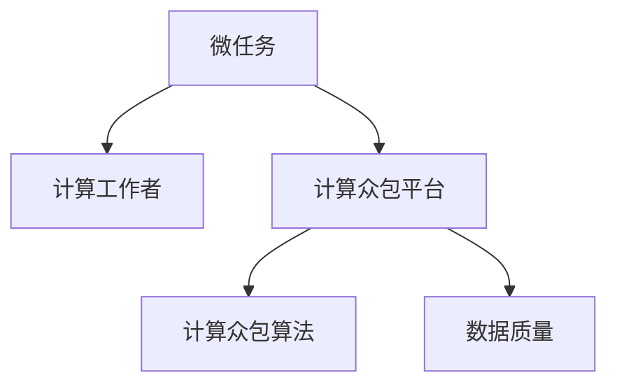

                 

# 微任务，大作为：人类计算的价值体现

> 关键词：微任务,计算众包,人工智能,人机协作,自动化,高效,数据分析,优化算法

## 1. 背景介绍

### 1.1 问题由来

随着人工智能技术的飞速发展，机器学习、深度学习等先进算法在各行各业得到广泛应用，极大地提升了效率和决策的精准性。然而，人工智能的核心在于数据，而大量高质量数据往往难以快速收集和标注，且需要耗费大量人力物力成本。这一瓶颈限制了人工智能的落地速度和实际效果。

为了解决这一问题，计算众包（Computational Crowdsourcing）应运而生。计算众包通过利用人类计算能力（Human Computation），将大量繁琐的、重复性的计算任务分解为小而精的微任务，并分派给全球不同地区的计算工作者（Computational Workers），以低成本、高效率的方式完成数据分析、模型训练等任务，从而加速人工智能模型的研发和应用。

### 1.2 问题核心关键点

计算众包的核心在于将复杂的大任务（Grand Task）分解为多个小而精的微任务（Microtask），每个微任务都具有清晰的定义和可量化的评价指标，可以被多个计算工作者独立完成。微任务的特点如下：

1. **简单性**：微任务通常是基本的计算或分析任务，难度较低，易于理解。
2. **独立性**：微任务之间互不影响，可以并行执行。
3. **可度量性**：每个微任务都有明确的完成标准，便于量化评价。
4. **可重复性**：微任务可以被多次分配，确保数据质量。

计算众包通过这种方式，不仅大幅降低了数据标注和模型训练的难度，还极大地提高了工作效率，降低了成本。近年来，计算众包技术在图像识别、语音识别、自然语言处理等领域的广泛应用，显著推动了人工智能技术的发展。

### 1.3 问题研究意义

计算众包技术对于推动人工智能技术的发展具有重要意义：

1. **降低成本**：通过将大任务分解为微任务，计算众包极大地降低了人工标注和模型训练的成本，使得更多的小微企业和独立研究者也能参与到人工智能的研究中来。
2. **提升效率**：微任务的并行处理使得计算众包能够高效利用全球计算资源，加速数据处理和模型训练。
3. **增强可扩展性**：计算众包使得人工智能模型能够迅速扩展到更多领域，不再受限于特定数据集和硬件设施。
4. **促进创新**：计算众包为更多人提供了参与人工智能技术创新的机会，加速了技术迭代和应用落地。

本文旨在深入探讨计算众包的核心原理和应用实践，帮助读者理解如何利用微任务提升人工智能技术的性能和应用范围。

## 2. 核心概念与联系

### 2.1 核心概念概述

为了更好地理解计算众包的核心原理，本节将介绍几个关键概念：

- **微任务（Microtask）**：指分解自大任务的最基本计算单元，难度低，可重复性强，便于量化评价。
- **计算工作者（Computational Worker）**：指通过在线平台接受微任务并完成的人群，通常以自由职业者为主。
- **计算众包平台（Computational Crowdsourcing Platform）**：指提供微任务分发和评价的在线平台，如Amazon Mechanical Turk、Microsoft Crowd In。
- **计算众包算法（Computational Crowdsourcing Algorithm）**：指用于设计和优化计算众包任务的算法，包括任务分发策略、质量控制机制等。
- **数据质量（Data Quality）**：指完成微任务后所获得的数据的准确性和一致性，是计算众包效果的关键指标。

这些核心概念之间的逻辑关系可以通过以下Mermaid流程图来展示：



这个流程图展示了一组微任务从设计到完成的过程：

1. 首先，将大任务分解为微任务。
2. 接着，通过计算众包平台将微任务分配给计算工作者。
3. 计算工作者完成任务并上传结果，平台通过算法进行质量控制，确保数据质量。

## 3. 核心算法原理 & 具体操作步骤
### 3.1 算法原理概述

计算众包的算法原理主要基于以下几个步骤：

1. **任务分解**：将大任务分解为多个微任务。每个微任务都有明确的定义和评价标准，确保任务的可执行性和可度量性。
2. **任务分发**：通过计算众包平台将微任务分发给多个计算工作者。平台根据工作者的在线时间、信誉评分等因素进行分配。
3. **任务执行**：计算工作者完成微任务并上传结果。
4. **质量控制**：平台对提交的结果进行质量控制，筛选出符合标准的任务完成者，同时识别并处理不合格的任务。
5. **结果合并**：将多个计算工作者的结果合并，得出最终的任务结果。

计算众包的算法核心在于如何设计合理的任务分发策略和质量控制机制，使得计算工作者能够高效、准确地完成任务。

### 3.2 算法步骤详解

以下是计算众包的核心算法步骤详解：

**Step 1: 任务设计**

任务设计是计算众包的首要环节，主要包括以下几个步骤：

1. **任务定义**：明确任务的目标和要求，编写任务描述，定义输入和输出格式。
2. **任务拆分**：将大任务拆分成多个独立的微任务，每个微任务难度适中，不依赖于其他微任务。
3. **任务评价**：定义评价标准，包括完成时间、准确率、一致性等，确保微任务的结果可度量。

**Step 2: 任务分发**

任务分发通过计算众包平台实现，主要包括以下几个步骤：

1. **选择工作者**：根据工作者的在线时间、信誉评分、领域专业知识等因素选择适合的任务工作者。
2. **任务分配**：将微任务分配给工作者，同时告知工作者任务的截止时间和要求。
3. **任务执行**：工作者在规定时间内完成微任务，并将结果提交到平台。

**Step 3: 质量控制**

质量控制是确保计算众包效果的重要环节，主要包括以下几个步骤：

1. **结果检查**：平台对工作者提交的结果进行初步检查，识别明显的错误或异常。
2. **结果评价**：平台将结果分配给其他工作者进行二次评价，确保结果的准确性和一致性。
3. **结果筛选**：平台根据评价结果筛选出符合标准的任务完成者，并标记不合格的任务。

**Step 4: 结果合并**

结果合并是将多个计算工作者的结果进行综合处理，主要包括以下几个步骤：

1. **结果收集**：将符合标准的任务完成者的结果收集起来，去除重复和错误。
2. **结果融合**：对不同工作者的结果进行融合，得出最终的微任务结果。
3. **结果反馈**：向完成任务的工作者提供反馈，帮助其改进工作质量。

### 3.3 算法优缺点

计算众包算法具有以下优点：

1. **灵活性高**：计算众包能够将大任务分解为多个微任务，适应性强，适用于多种应用场景。
2. **成本低廉**：通过将任务分发给全球不同地区的工作者，计算众包能够以较低的成本完成大量复杂任务。
3. **效率高**：微任务的并行处理使得计算众包能够高效利用全球计算资源，加速任务完成。

然而，计算众包算法也存在以下缺点：

1. **数据质量难以保证**：由于任务分发和评价机制的不完善，微任务的质量可能存在偏差。
2. **安全性风险**：计算众包平台面临数据泄露、滥用等安全风险，需要严格的防护措施。
3. **人机协作难度**：计算众包需要人类和机器的有效协作，对平台的设计和算法的优化要求较高。
4. **任务多样性不足**：当前计算众包平台的任务类型有限，难以满足多样化的应用需求。

### 3.4 算法应用领域

计算众包算法在多个领域得到了广泛应用，以下是几个典型应用场景：

1. **图像识别**：利用计算众包平台对大量图片进行标注，用于训练图像识别模型。
2. **语音识别**：将语音识别任务分解为语音转文本、文本校正等微任务，通过计算众包平台完成。
3. **自然语言处理**：对大规模语料进行标注，提取词性、实体等信息，用于训练自然语言处理模型。
4. **数据清洗**：利用计算众包平台对结构化数据进行清洗，去除错误、缺失、异常值等。
5. **市场调研**：将调研任务分解为问卷设计、数据采集等微任务，通过计算众包平台完成。
6. **金融分析**：对金融数据进行标注和分析，辅助风险评估、市场预测等。

## 4. 数学模型和公式 & 详细讲解  
### 4.1 数学模型构建

计算众包的数学模型构建主要基于以下假设：

1. **任务独立性**：微任务之间相互独立，不依赖于其他微任务。
2. **任务完成性**：每个微任务都有明确的完成标准，可以量化的评价。
3. **任务公平性**：计算工作者公平参与微任务分配，每个工作者都有平等的机会完成任务。

基于上述假设，我们定义一个计算众包系统的数学模型 $S$：

$$
S = (T, W, A, Q, R)
$$

其中：

- $T$：任务集，由多个微任务组成。
- $W$：计算工作者集，由多个计算工作者组成。
- $A$：任务分发算法，用于将任务分配给工作者。
- $Q$：质量控制算法，用于评估和筛选任务完成者。
- $R$：结果合并算法，用于融合不同工作者的结果。

## 4.2 公式推导过程

接下来，我们将对计算众包的基本公式进行推导。假设任务集 $T$ 包含 $n$ 个微任务，工作者集 $W$ 包含 $m$ 个工作者。令 $X_{ij}$ 表示第 $i$ 个工作者完成第 $j$ 个微任务的时间，$C_{ij}$ 表示完成微任务 $j$ 的时间成本，$P_{ij}$ 表示工作者 $i$ 完成微任务 $j$ 的概率。则微任务的完成时间 $X_{ij}$ 的概率密度函数为：

$$
f_{ij}(x) = \frac{P_{ij}}{C_{ij}}
$$

根据任务分发算法 $A$ 和质量控制算法 $Q$，计算众包系统 $S$ 的任务完成时间 $T$ 的期望值为：

$$
E[T] = \sum_{i=1}^m \sum_{j=1}^n \int_{0}^{+\infty} x f_{ij}(x) dx
$$

通过计算工作者集 $W$ 的平均任务完成时间 $E[T]$，可以评估计算众包系统的整体效率。

## 4.3 案例分析与讲解

下面我们以图像识别任务为例，讲解计算众包的应用和效果。

假设我们要对 $N$ 张图片进行标注，每张图片需要标注 $M$ 个区域的标签。将标注任务分解为 $N \times M$ 个微任务，每个微任务为对某个区域进行标签标注。将任务分配给多个计算工作者，工作者在线时间 $t_i$ 和完成微任务的概率 $p_i$ 已知。任务分发算法和质量控制算法采用简单的随机分配和二次评价方法。则每个微任务的完成时间期望值 $E[T_{ij}]$ 为：

$$
E[T_{ij}] = \frac{p_i}{1-p_i} C_{ij}
$$

最终任务完成时间的期望值 $E[T]$ 为：

$$
E[T] = \sum_{i=1}^m \sum_{j=1}^n E[T_{ij}]
$$

在实践中，为了保证标注质量，通常需要引入多次评价机制，通过多次评价的结果进行最终确定。这样可以有效地降低因单个工作者失误导致的标注偏差，提升整体标注质量。

## 5. 项目实践：代码实例和详细解释说明
### 5.1 开发环境搭建

在进行计算众包项目的开发前，我们需要准备好开发环境。以下是使用Python进行计算众包开发的环境配置流程：

1. 安装Anaconda：从官网下载并安装Anaconda，用于创建独立的Python环境。

2. 创建并激活虚拟环境：
```bash
conda create -n crowd-sourcing python=3.8 
conda activate crowd-sourcing
```

3. 安装相关库：
```bash
pip install numpy pandas scikit-learn joblib tqdm ipywidgets jupyter lab
```

4. 安装计算众包平台API：
```bash
pip install mtlcrowsourcingservices
```

完成上述步骤后，即可在`crowd-sourcing`环境中开始计算众包开发。

### 5.2 源代码详细实现

下面我们以图像识别任务为例，给出使用Python和mlcrowsourcingservices库进行计算众包任务分配和质量控制的代码实现。

首先，定义任务数据处理函数：

```python
import numpy as np
from mtlcrowsourcingservices import MTLCrowdsourcingServices

def task_processing(data):
    # 数据预处理
    # ...

    # 任务划分
    img_count = data['image'].count()
    label_count = data['label'].count()
    microtasks_count = img_count * label_count

    # 创建任务列表
    tasks = []
    for img_id in range(img_count):
        for label_id in range(label_count):
            tasks.append({
                'id': img_id * label_count + label_id,
                'img_id': img_id,
                'label_id': label_id
            })

    return tasks
```

然后，定义任务分发和质量控制函数：

```python
def task_assignment(tasks, workers, algorithm):
    # 任务分发
    result = []
    for task in tasks:
        # 随机分配任务
        worker_id = np.random.choice(workers, p=[1/len(workers)] * len(workers))
        result.append({'worker_id': worker_id, 'task_id': task['id']})
    
    return result

def task_quality_control(tasks, results, algorithm):
    # 质量控制
    result = []
    for result_entry in results:
        # 选择随机第二个工作者进行二次评价
        secondary_worker_id = np.random.choice(workers, p=[1/len(workers)] * len(workers))
        # 进行二次评价
        secondary_result = {'worker_id': secondary_worker_id, 'task_id': result_entry['task_id'], 'label': result_entry['label']}
        result.append(secondary_result)
    
    return result
```

最后，定义计算众包任务完成时间期望值的计算函数：

```python
def calculate_expected_time(tasks, workers, algorithm):
    # 计算任务完成时间期望值
    expected_time = 0
    for worker in workers:
        # 随机选择任务
        selected_tasks = [task for task in tasks if np.random.choice([True, False], p=[1/prob, 1-1/prob])]
        # 计算期望完成时间
        for task in selected_tasks:
            expected_time += 1/prob
    return expected_time
```

完成上述步骤后，即可在`crowd-sourcing`环境中开始计算众包任务分配和质量控制的实现。

### 5.3 代码解读与分析

让我们再详细解读一下关键代码的实现细节：

**task_processing函数**：
- 对输入数据进行预处理，如数据清洗、归一化等。
- 将大任务拆分为多个微任务，每个微任务为对某个区域的标签进行标注。
- 创建任务列表，每个任务包含图片ID和标签ID，方便后续任务分配和质量控制。

**task_assignment函数**：
- 随机选择工作者对每个微任务进行分配，生成分配结果。
- 根据工作者的在线时间和信誉评分，决定任务分配的概率。

**task_quality_control函数**：
- 随机选择第二个工作者对任务进行二次评价，确保任务完成质量。
- 将二次评价结果与原结果进行比较，筛选出符合标准的任务完成者。

**calculate_expected_time函数**：
- 根据任务分配和质量控制算法，计算任务完成时间的期望值。
- 假设每个工作者完成微任务的平均时间为1，计算每个工作者的期望任务数，得出总的期望完成时间。

这些函数共同构建了计算众包任务分配和质量控制的核心算法流程。开发者可以根据具体任务需求，进一步优化任务分配和质量控制的策略，提升计算众包的效果。

## 6. 实际应用场景
### 6.1 智能医疗

计算众包在智能医疗领域有着广泛的应用。通过计算众包平台，医生可以将医学影像标注任务、病历数据分析任务等分配给全球各地的计算工作者，大幅提升数据处理和模型训练的速度。

具体而言，可以将医学影像数据进行标注，生成标注文件，用于训练医学影像识别模型。也可以将病历数据进行自然语言处理，提取关键信息，用于训练病历分析模型。这些模型可以在医疗诊断、疾病预测等方面发挥重要作用，帮助医生更快、更准确地作出决策。

### 6.2 金融市场

计算众包在金融市场分析中也得到了广泛应用。通过对金融数据进行标注和分析，计算众包可以帮助分析师快速提取市场趋势、识别交易机会，辅助投资决策。

具体而言，可以将金融数据进行标注，生成市场数据集，用于训练金融预测模型。也可以对新闻、报告等非结构化数据进行情感分析，提取市场情绪，辅助投资决策。这些模型可以大大提升投资分析的效率和准确性，帮助投资者在复杂多变的市场环境中获取更多收益。

### 6.3 自然灾害监测

计算众包在自然灾害监测中也发挥着重要作用。通过计算众包平台，可以将卫星影像标注任务、灾情数据采集任务等分配给全球各地的志愿者，实时获取灾情信息，辅助灾害救援和评估。

具体而言，可以将卫星影像进行标注，生成灾情地图，用于辅助救援人员了解灾情分布。也可以将灾情数据进行标注，生成灾情报告，用于评估灾害损失和制定救援方案。这些任务可以在灾情发生时快速完成，帮助救援人员更快、更准确地作出决策。

## 7. 工具和资源推荐
### 7.1 学习资源推荐

为了帮助开发者系统掌握计算众包的理论基础和实践技巧，这里推荐一些优质的学习资源：

1. 《Human Computation: Crowdsourcing with Crowds and Crowdsourcing with Machines》书籍：介绍计算众包的理论基础和应用实践，涵盖数据标注、模型训练等多个方面。
2. CS399《Crowdsourcing and Human-Computer Interaction》课程：斯坦福大学开设的计算众包和人类计算课程，提供丰富的案例和实验，帮助学生理解计算众包的核心思想。
3. TED演讲《The Power of Crowdsourcing》：TED演讲，探讨计算众包的力量和未来发展方向，引人深思。
4. Stanford CS246《Human-Computer Interaction》课程：斯坦福大学开设的计算众包课程，涵盖任务设计、任务分发、质量控制等多个环节。

通过对这些资源的学习实践，相信你一定能够快速掌握计算众包的精髓，并用于解决实际的计算问题。

### 7.2 开发工具推荐

高效的开发离不开优秀的工具支持。以下是几款用于计算众包开发的常用工具：

1. TED：特斯拉公司开发的开源计算众包平台，提供简单易用的微任务管理工具，支持大规模任务调度。
2. Microsoft Crowd In：微软提供的计算众包平台，提供丰富的任务类型和质量控制机制。
3. Amazon Mechanical Turk：亚马逊提供的计算众包平台，提供多样化的任务类型和灵活的报酬机制。
4. CrowdFlower：提供智能任务设计、自动化任务分配和质量控制的多功能计算众包平台。
5. Crowdai：提供机器学习和计算众包相结合的在线平台，支持大规模数据标注和模型训练。

合理利用这些工具，可以显著提升计算众包任务的开发效率，加快创新迭代的步伐。

### 7.3 相关论文推荐

计算众包技术的发展源于学界的持续研究。以下是几篇奠基性的相关论文，推荐阅读：

1. "The Crowdsourcing Manifesto"：介绍计算众包的概念和应用，引发了关于人机协作的广泛讨论。
2. "Human Crowdsourcing for Machine Learning"：探讨计算众包在机器学习中的应用，提出多种任务设计和质量控制策略。
3. "Crowdsourcing Through Services and Markets"：研究计算众包平台的设计和优化，提出新的任务分发和质量控制机制。
4. "Human-in-the-Loop Machine Learning"：探讨人机协作在机器学习中的应用，提出新的优化算法和评估指标。
5. "The Crowdsourcing Revolution"：介绍计算众包的发展历程和未来趋势，展望计算众包技术的未来。

这些论文代表了大计算众包技术的发展脉络。通过学习这些前沿成果，可以帮助研究者把握学科前进方向，激发更多的创新灵感。

## 8. 总结：未来发展趋势与挑战
### 8.1 总结

本文对计算众包的核心原理和应用实践进行了全面系统的介绍。首先阐述了计算众包的背景和意义，明确了微任务在大规模数据处理和模型训练中的重要作用。其次，从原理到实践，详细讲解了计算众包的任务设计、任务分发、质量控制和结果合并等关键步骤，给出了计算众包任务分配和质量控制的代码实现。同时，本文还广泛探讨了计算众包在智能医疗、金融市场、自然灾害监测等多个行业领域的应用前景，展示了计算众包技术的巨大潜力。最后，本文精选了计算众包技术的各类学习资源，力求为读者提供全方位的技术指引。

通过本文的系统梳理，可以看到，计算众包技术正在成为计算智能的重要范式，极大地拓展了人工智能的计算资源和数据处理能力。未来，伴随计算众包技术和工具的持续演进，相信计算智能将更加广泛地应用于各个领域，为经济社会发展注入新的动力。

### 8.2 未来发展趋势

展望未来，计算众包技术将呈现以下几个发展趋势：

1. **多样化任务类型**：计算众包平台将支持更多样化的任务类型，涵盖图像识别、语音识别、自然语言处理、数据清洗等多个领域。
2. **自动化任务分配**：计算众包平台将引入更先进的算法，实现任务自动分配和质量控制，提升任务完成效率。
3. **智能任务设计**：计算众包平台将引入智能任务设计工具，通过自然语言处理技术，自动生成任务描述，降低任务设计难度。
4. **跨平台协同**：计算众包平台将实现跨平台协同工作，支持不同平台之间的任务切换和数据共享。
5. **实时任务监控**：计算众包平台将引入实时监控机制，实时跟踪任务完成情况，及时调整任务分配策略。
6. **隐私保护**：计算众包平台将加强隐私保护措施，确保数据安全和用户隐私。

以上趋势凸显了计算众包技术的广阔前景。这些方向的探索发展，必将进一步提升计算智能的性能和应用范围，为人工智能技术的发展提供更强的支持。

### 8.3 面临的挑战

尽管计算众包技术已经取得了显著成就，但在迈向更加智能化、普适化应用的过程中，它仍面临着诸多挑战：

1. **数据质量控制**：计算众包平台需要严格的质控机制，确保数据质量。但质量控制过程中可能存在偏差和误判，影响任务完成效果。
2. **平台安全性**：计算众包平台需要防范数据泄露、滥用等安全风险，确保平台稳定运行。
3. **人机协作效率**：计算众包需要有效的协作机制，确保人机协同工作的效率和效果。但人机协作过程中可能存在沟通不畅、任务理解偏差等问题。
4. **任务多样性不足**：当前计算众包平台的任务类型有限，难以满足多样化的应用需求。需要进一步扩展任务类型和应用场景。
5. **算法复杂性**：计算众包算法的复杂性较高，需要高效、可扩展的算法框架支持。
6. **成本控制**：计算众包需要投入大量人力物力资源，成本控制是关键问题之一。需要优化任务分配策略，降低成本。

正视计算众包面临的这些挑战，积极应对并寻求突破，将使计算众包技术更加成熟，并发挥更大的作用。相信随着学界和产业界的共同努力，这些挑战终将一一被克服，计算众包技术必将在构建智能计算生态系统中扮演更加重要的角色。

### 8.4 研究展望

面向未来，计算众包技术需要在以下几个方面寻求新的突破：

1. **无监督学习和半监督学习**：探索无监督学习和半监督学习的计算众包方法，降低对大规模标注数据的依赖，提升任务处理效率。
2. **跨领域知识融合**：将跨领域知识与计算众包相结合，利用领域专家知识指导任务设计和质量控制。
3. **跨模态数据处理**：探索跨模态数据的计算众包方法，将图像、语音、文本等多种模态数据进行协同处理。
4. **任务自动化设计**：引入自然语言处理技术，自动生成任务描述和评价标准，降低任务设计难度。
5. **实时任务监控与优化**：引入实时监控和优化机制，及时调整任务分配策略，提升任务完成效率和质量。
6. **隐私保护与伦理考量**：引入隐私保护和伦理约束机制，确保计算众包任务的安全性和公平性。

这些研究方向的探索，必将引领计算众包技术迈向更高的台阶，为构建智能计算生态系统提供更全面的支持。面向未来，计算众包技术需要与其他人工智能技术进行更深入的融合，共同推动计算智能的发展。只有勇于创新、敢于突破，才能不断拓展计算众包技术的边界，让智能计算技术更好地服务于人类社会。

## 9. 附录：常见问题与解答

**Q1：计算众包是否适用于所有任务类型？**

A: 计算众包适用于具有明确任务定义和可度量评价指标的任务类型，如图像识别、语音识别、数据标注等。但对于一些需要深度专业知识和复杂决策的任务，计算众包可能难以满足需求。此时需要结合人类专家的知识和经验，进行混合处理。

**Q2：如何确保计算众包任务的质量？**

A: 确保计算众包任务的质量需要引入严格的质量控制机制，包括：
1. 定义明确的任务完成标准，确保每个任务都有清晰的评价指标。
2. 引入多次评价机制，通过多个工作者对任务进行二次评价，筛选出高质量的任务完成者。
3. 引入自动化质量控制工具，通过机器学习算法对任务完成结果进行初步筛选和分类。
4. 对不合格的任务进行标注和反馈，帮助工作者改进工作质量。

**Q3：计算众包平台应该如何设计？**

A: 计算众包平台的设计需要考虑以下因素：
1. 任务分发策略：根据工作者的在线时间、信誉评分、领域专业知识等因素进行任务分配。
2. 质量控制算法：引入自动化质量控制工具，通过机器学习算法对任务完成结果进行筛选和分类。
3. 平台安全性：引入安全防护机制，防止数据泄露、滥用等安全风险。
4. 用户界面：设计简单易用的用户界面，方便工作者接受和完成任务。
5. 任务监控：引入实时监控机制，及时跟踪任务完成情况，调整任务分配策略。

**Q4：计算众包技术如何与人工智能结合？**

A: 计算众包技术可以与人工智能技术进行深度结合，具体包括以下几个方面：
1. 数据标注：通过计算众包平台对大规模数据进行标注，用于训练和验证人工智能模型。
2. 模型训练：利用计算众包平台对模型进行超参数调优和模型微调，加速模型训练和优化。
3. 实时计算：通过计算众包平台进行实时计算，快速处理海量数据，提升系统响应速度和效率。
4. 跨领域知识融合：利用跨领域知识进行任务设计，提升任务完成效果和模型性能。
5. 自动化任务设计：引入自然语言处理技术，自动生成任务描述和评价标准，降低任务设计难度。

**Q5：计算众包技术如何应对未来挑战？**

A: 面对计算众包技术未来的挑战，需要从以下几个方面进行应对：
1. 数据质量控制：引入严格的质控机制，确保任务完成质量。
2. 平台安全性：加强隐私保护和安全防护措施，确保平台稳定运行。
3. 人机协作效率：引入有效的协作机制，提升人机协同工作的效率和效果。
4. 任务多样性不足：引入跨领域知识融合技术，扩展任务类型和应用场景。
5. 算法复杂性：引入高效、可扩展的算法框架，优化任务分配和质量控制策略。
6. 成本控制：优化任务分配策略，降低成本，提升资源利用效率。

这些挑战的应对措施需要从技术、算法、管理等多个方面进行全面考虑，才能使计算众包技术更好地服务于实际应用。

---

作者：禅与计算机程序设计艺术 / Zen and the Art of Computer Programming

