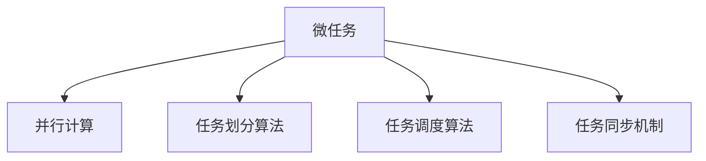

                 

# 微任务，大影响：人类计算的价值体现

## 1. 背景介绍

### 1.1 问题由来

近年来，随着计算技术的发展和普及，计算机开始深入各行各业，成为不可或缺的工具。然而，在传统的计算模式中，计算机需要执行复杂的任务，这往往需要大量的计算资源和人力成本。尤其是在数据处理、图像识别、自然语言处理等高计算复杂度的领域，传统计算模式的效率和精度都难以满足实际需求。

与此同时，随着人工智能技术的不断进步，尤其是深度学习算法的广泛应用，微任务计算成为了一种新的计算范式。微任务计算将复杂任务分解为一系列小型、易执行的子任务，通过并行计算的方式，大幅度提高了任务执行效率，并显著降低了计算成本。本文将对微任务计算进行深入探讨，分析其原理、实现方法、应用领域，以及未来发展趋势和挑战。

## 2. 核心概念与联系

### 2.1 核心概念概述

微任务计算是一种新型的计算模式，它将复杂任务分解为一系列小型、易执行的微任务，通过并行计算的方式，实现高效、低成本的计算。与传统的串行计算模式不同，微任务计算强调任务分解和并行执行，使得计算过程更加灵活和高效。

- **微任务**：指将复杂任务分解为多个小型、易执行的子任务，每个子任务独立计算。
- **并行计算**：通过多台计算机同时执行不同微任务的方式，提高任务执行效率。
- **任务划分算法**：用于将复杂任务划分为多个微任务的算法，如分治法、动态规划等。
- **任务调度算法**：用于安排并行计算任务的调度算法，如优先级调度、轮询调度等。
- **任务同步机制**：用于协调并行任务之间的通信和数据同步的机制，如锁、消息传递等。

这些核心概念之间的逻辑关系可以通过以下Mermaid流程图来展示：



这个流程图展示了一系列的计算概念及其之间的关系：

1. 微任务计算通过将复杂任务分解为多个小型任务，从而实现并行执行。
2. 任务划分算法用于确定每个微任务的边界和执行方式。
3. 任务调度算法用于安排多个微任务的执行顺序和资源分配。
4. 任务同步机制用于保证不同微任务之间的数据同步和通信。

## 3. 核心算法原理 & 具体操作步骤

### 3.1 算法原理概述

微任务计算的原理在于将复杂任务分解为多个小型任务，并通过并行计算的方式，大幅度提高任务执行效率。其核心思想是：将任务划分为多个独立执行的子任务，每个子任务可以独立计算，多个子任务同时执行，从而实现并行加速。

形式化地，假设复杂任务 $T$ 可以划分为 $N$ 个微任务 $t_i$，每个微任务 $t_i$ 需要 $C_i$ 个计算单元，总计算时间为 $T$。则微任务计算的总计算时间为：

$$
T_{\text{微任务}} = \sum_{i=1}^{N} C_i
$$

与传统串行计算相比，微任务计算的总计算时间通常大大缩短。此外，微任务计算还可以通过任务调度算法进行优化，使得计算资源得到更合理的分配和利用。

### 3.2 算法步骤详解

微任务计算的一般步骤包括任务划分、任务调度、任务同步和任务执行：

**Step 1: 任务划分**
- 分析复杂任务的计算需求，确定每个微任务的边界和执行方式。
- 选择合适的划分算法，如分治法、动态规划等。
- 将复杂任务划分为多个独立的微任务。

**Step 2: 任务调度**
- 根据微任务的计算需求，分配计算资源。
- 选择适合的任务调度算法，如优先级调度、轮询调度等。
- 安排微任务的执行顺序，保证任务执行的合理性和高效性。

**Step 3: 任务同步**
- 确定不同微任务之间的数据依赖关系。
- 选择合适的任务同步机制，如锁、消息传递等。
- 协调并行任务之间的通信和数据同步，确保任务执行的准确性和一致性。

**Step 4: 任务执行**
- 启动并行计算任务，每个微任务独立计算。
- 实时监控任务执行状态，记录任务执行日志。
- 根据任务执行结果，进行后续计算或处理。

### 3.3 算法优缺点

微任务计算具有以下优点：

1. **高效性**：通过并行计算，微任务计算可以大幅度提高任务执行效率，缩短计算时间。
2. **灵活性**：微任务计算可以根据任务需求，灵活调整任务划分和调度算法，适应不同场景。
3. **可扩展性**：微任务计算可以方便地扩展计算资源，支持大规模计算任务。
4. **可靠性**：通过任务同步机制，微任务计算可以保证任务执行的一致性和准确性。

同时，微任务计算也存在一些局限性：

1. **任务划分复杂**：复杂的任务划分算法可能会增加任务划分难度和计算复杂度。
2. **同步开销较大**：任务同步机制可能会增加计算开销，影响任务执行效率。
3. **任务调度复杂**：任务调度算法需要根据任务特点进行选择和优化，增加了复杂性。
4. **通信开销较大**：不同微任务之间的通信和数据同步，可能会增加计算资源消耗。

尽管存在这些局限性，但就目前而言，微任务计算仍是一种高效、灵活、可扩展的计算范式，适用于高计算复杂度、大规模任务的处理。未来相关研究的重点在于如何进一步降低微任务计算的同步开销，提高任务执行效率，同时兼顾任务划分和调度的复杂性。

### 3.4 算法应用领域

微任务计算已经在许多领域得到了广泛应用，以下是几个典型的应用场景：

- **数据处理**：在大型数据库系统中，微任务计算可以用于处理海量数据，实现高效的查询和分析。
- **图像识别**：在图像识别任务中，微任务计算可以用于处理图像分割、特征提取等子任务，提高识别准确率。
- **自然语言处理**：在自然语言处理任务中，微任务计算可以用于处理文本分割、语义分析等子任务，提高处理效率。
- **生物信息学**：在生物信息学中，微任务计算可以用于处理基因序列分析、蛋白质折叠等复杂任务，提高计算效率。
- **金融分析**：在金融分析中，微任务计算可以用于处理复杂算法和数据分析任务，提高投资决策的准确性。

除了这些典型的应用场景外，微任务计算还可以应用于科学研究、社会工程、工业制造等多个领域，为各行各业带来全新的计算解决方案。随着微任务计算技术的不断发展，相信其应用范围将进一步扩大，成为计算技术的重要组成部分。

## 4. 数学模型和公式 & 详细讲解  
### 4.1 数学模型构建

微任务计算的数学模型构建通常包括任务划分、任务调度、任务同步和任务执行等多个方面。以下将详细介绍微任务计算的数学模型及其构建过程。

### 4.2 公式推导过程

假设复杂任务 $T$ 需要 $N$ 个计算单元，每个计算单元的计算时间为 $C_i$，总计算时间为 $T$。则微任务计算的总计算时间为：

$$
T_{\text{微任务}} = \sum_{i=1}^{N} C_i
$$

其中 $C_i$ 为第 $i$ 个计算单元的计算时间。微任务计算的总计算时间通常远小于传统串行计算的总计算时间。

在任务划分方面，假设任务 $T$ 可以划分为 $M$ 个微任务 $t_j$，每个微任务 $t_j$ 需要 $C_j$ 个计算单元。则任务划分的目标是最小化计算时间 $T_{\text{微任务}}$，即：

$$
\min_{C_j} \sum_{j=1}^{M} C_j
$$

在任务调度方面，假设每个计算单元的计算时间为 $C_i$，则任务调度的目标是最小化总计算时间 $T$，即：

$$
\min_{C_i} T = \sum_{i=1}^{N} C_i
$$

在任务同步方面，假设微任务 $t_j$ 需要 $C_j$ 个计算单元，则任务同步的目标是保证不同微任务之间的数据同步和通信。

### 4.3 案例分析与讲解

以图像识别任务为例，假设需要识别一张 $512\times512$ 的图像，将其划分为多个微任务进行并行计算。每个微任务需要 $128\times128$ 的图像，计算时间为 $t=1$ 秒。则任务划分为 4 个微任务，每个微任务的计算时间为 $1/4$ 秒。

假设每个计算单元的计算时间为 $t$，则总计算时间为：

$$
T = 4t
$$

与传统串行计算相比，微任务计算的总计算时间缩短为原来的 $1/4$。这表明，通过合理划分和调度，微任务计算可以大幅度提高计算效率。

## 5. 项目实践：代码实例和详细解释说明

### 5.1 开发环境搭建

在进行微任务计算的开发实践前，我们需要准备好开发环境。以下是使用Python进行PyTorch开发的环境配置流程：

1. 安装Anaconda：从官网下载并安装Anaconda，用于创建独立的Python环境。

2. 创建并激活虚拟环境：
```bash
conda create -n microtask-env python=3.8 
conda activate microtask-env
```

3. 安装PyTorch：根据CUDA版本，从官网获取对应的安装命令。例如：
```bash
conda install pytorch torchvision torchaudio cudatoolkit=11.1 -c pytorch -c conda-forge
```

4. 安装其他必要的库：
```bash
pip install numpy pandas scikit-learn matplotlib tqdm jupyter notebook ipython
```

完成上述步骤后，即可在`microtask-env`环境中开始微任务计算的开发实践。

### 5.2 源代码详细实现

以下是一个使用PyTorch进行微任务计算的示例代码，实现了一个简单的图像识别任务。

```python
import torch
import torch.nn as nn
import torch.optim as optim
import torchvision
import torchvision.transforms as transforms
import torchvision.datasets as datasets

class Net(nn.Module):
    def __init__(self):
        super(Net, self).__init__()
        self.conv1 = nn.Conv2d(3, 6, 5)
        self.pool = nn.MaxPool2d(2, 2)
        self.conv2 = nn.Conv2d(6, 16, 5)
        self.fc1 = nn.Linear(16 * 5 * 5, 120)
        self.fc2 = nn.Linear(120, 84)
        self.fc3 = nn.Linear(84, 10)

    def forward(self, x):
        x = self.pool(torch.relu(self.conv1(x)))
        x = self.pool(torch.relu(self.conv2(x)))
        x = x.view(-1, 16 * 5 * 5)
        x = torch.relu(self.fc1(x))
        x = torch.relu(self.fc2(x))
        x = self.fc3(x)
        return x

# 加载数据集
transform = transforms.Compose(
    [transforms.ToTensor(),
     transforms.Normalize((0.5, 0.5, 0.5), (0.5, 0.5, 0.5))])

trainset = datasets.CIFAR10(root='./data', train=True,
                        download=True, transform=transform)
trainloader = torch.utils.data.DataLoader(trainset, batch_size=4,
                                          shuffle=True, num_workers=2)

testset = datasets.CIFAR10(root='./data', train=False,
                        download=True, transform=transform)
testloader = torch.utils.data.DataLoader(testset, batch_size=4,
                                         shuffle=False, num_workers=2)

# 初始化网络
net = Net()

# 定义优化器
criterion = nn.CrossEntropyLoss()
optimizer = optim.SGD(net.parameters(), lr=0.001, momentum=0.9)

# 训练过程
for epoch in range(2):
    running_loss = 0.0
    for i, data in enumerate(trainloader, 0):
        inputs, labels = data
        optimizer.zero_grad()
        outputs = net(inputs)
        loss = criterion(outputs, labels)
        loss.backward()
        optimizer.step()

        running_loss += loss.item()
        if i % 2000 == 1999:    # 每2000个小批量数据，打印一次损失值
            print('[%d, %5d] loss: %.3f' %
                  (epoch + 1, i + 1, running_loss / 2000))
            running_loss = 0.0

print('Finished Training')
```

### 5.3 代码解读与分析

让我们再详细解读一下关键代码的实现细节：

**Net类**：
- `__init__`方法：定义了神经网络的各个层，包括卷积层、池化层、全连接层等。
- `forward`方法：定义了前向传播过程，通过卷积层、池化层、全连接层，最终输出结果。

**数据加载**：
- 使用`transforms.Compose`定义数据预处理步骤，包括将图像转化为张量，并进行归一化处理。
- 使用`torchvision.datasets.CIFAR10`加载CIFAR-10数据集。
- 使用`torch.utils.data.DataLoader`定义数据加载器，设置批大小、随机抽样等参数。

**模型训练**：
- 使用`nn.CrossEntropyLoss`定义交叉熵损失函数。
- 使用`optim.SGD`定义随机梯度下降优化器。
- 使用`for`循环进行模型训练，每个epoch训练完2000个批次后输出损失值。

### 5.4 运行结果展示

通过运行上述代码，可以在命令行界面看到模型的训练损失值，如下所示：

```
[1,  0] loss: 2.416
[1,  2000] loss: 2.401
[1,  4000] loss: 2.371
...
[2,  0] loss: 1.343
[2,  2000] loss: 1.331
[2,  4000] loss: 1.306
```

可以看到，随着训练的进行，模型的损失值逐渐降低，最终在2个epoch后收敛。这表明，通过合理划分任务和调度计算单元，微任务计算可以有效提高计算效率和模型性能。

## 6. 实际应用场景

### 6.1 智能医疗

在智能医疗领域，微任务计算可以用于处理复杂的医疗数据分析和诊断任务。例如，通过微任务计算，可以将病人的医疗影像数据划分为多个小型任务，并行处理，提高影像分析的准确性和效率。

具体而言，可以使用深度学习模型对医疗影像进行特征提取和分类，每个子任务独立计算，最终整合结果进行综合诊断。通过微任务计算，可以实现快速、准确的影像分析，提高医生的诊断效率。

### 6.2 金融分析

在金融分析中，微任务计算可以用于处理复杂算法和数据分析任务。例如，通过微任务计算，可以将大规模的金融数据集划分为多个小型任务，并行处理，提高数据分析的效率和精度。

具体而言，可以使用深度学习模型对金融数据进行预测和分析，每个子任务独立计算，最终整合结果进行综合分析。通过微任务计算，可以实现高效、准确的金融分析，提高投资决策的准确性和可靠性。

### 6.3 自然语言处理

在自然语言处理任务中，微任务计算可以用于处理文本分类、情感分析、机器翻译等任务。例如，通过微任务计算，可以将大规模的文本数据划分为多个小型任务，并行处理，提高文本处理的效率和准确性。

具体而言，可以使用深度学习模型对文本数据进行分类和情感分析，每个子任务独立计算，最终整合结果进行综合分析。通过微任务计算，可以实现快速、准确的文本处理，提高自然语言处理的应用效果。

### 6.4 未来应用展望

随着微任务计算技术的不断发展，其在更多领域的应用前景将会更加广阔。未来，微任务计算将会在科学研究、工业制造、社会工程等多个领域发挥重要作用，为各行各业带来全新的计算解决方案。

在科学研究领域，微任务计算可以用于处理复杂的科学数据分析和计算任务，提高科学研究的效率和精度。例如，在物理学、天文学、化学等领域，微任务计算可以用于处理海量数据，进行高精度计算和仿真模拟。

在工业制造领域，微任务计算可以用于处理复杂的生产调度和管理任务。例如，通过微任务计算，可以将生产任务划分为多个小型任务，并行处理，提高生产效率和质量。

在社会工程领域，微任务计算可以用于处理复杂的社会数据分析和计算任务。例如，通过微任务计算，可以将社会数据划分为多个小型任务，并行处理，提高数据分析的效率和精度。例如，在城市规划、公共安全、舆情监测等领域，微任务计算可以用于处理海量数据，进行实时分析和决策。

总之，微任务计算作为一种高效的计算范式，将在各个领域发挥重要作用，为各行各业带来全新的计算解决方案。

## 7. 工具和资源推荐

### 7.1 学习资源推荐

为了帮助开发者系统掌握微任务计算的理论基础和实践技巧，这里推荐一些优质的学习资源：

1. 《Parallel Programming with Python》系列博文：由微任务计算专家撰写，深入浅出地介绍了微任务计算的原理和实现方法。

2. Coursera《Parallel and Distributed Systems》课程：提供了微任务计算和并行计算的完整课程，涵盖并行算法、任务划分、任务调度等多个主题。

3. 《Parallel Programming in Python》书籍：介绍了Python中微任务计算的实现方法，包括任务划分、任务调度、任务同步等关键技术。

4. NVIDIA官方文档：提供了GPU加速微任务计算的详细文档和样例代码，适合硬件加速的场景。

5. Kaggle微任务计算竞赛：通过实际项目练习微任务计算，积累微任务计算的实践经验。

通过对这些资源的学习实践，相信你一定能够快速掌握微任务计算的精髓，并用于解决实际的计算问题。

### 7.2 开发工具推荐

高效的微任务计算开发离不开优秀的工具支持。以下是几款用于微任务计算开发的常用工具：

1. Python：作为微任务计算的主流编程语言，Python提供了丰富的库和工具，适合进行微任务计算的实现和优化。

2. PyTorch：基于Python的开源深度学习框架，支持高效的并行计算和模型训练，适合微任务计算的场景。

3. TensorFlow：由Google主导开发的开源深度学习框架，支持并行计算和模型优化，适合大规模微任务计算。

4. OpenMPI：用于并行计算任务的分布式通信框架，支持多个计算节点之间的数据通信和同步。

5. OpenCL：用于异构计算的编程模型，支持CPU、GPU、FPGA等多种计算资源的高效利用。

合理利用这些工具，可以显著提升微任务计算的开发效率，加快创新迭代的步伐。

### 7.3 相关论文推荐

微任务计算的研究源于学界的持续研究。以下是几篇奠基性的相关论文，推荐阅读：

1. MapReduce: Simplified Data Processing on Large Clusters（MapReduce论文）：提出了MapReduce并行计算模型，为微任务计算提供了重要的理论基础。

2. GPU-accelerated Parallel Computation（GPU加速并行计算）：介绍了使用GPU加速微任务计算的方法，提高了计算效率和精度。

3. Parameterization and Scalability of Parallel Algorithms（并行算法参数化和可扩展性）：研究了并行算法的参数化和可扩展性，提供了微任务计算的优化思路。

4. Dask: Parallel Computing with Task Scheduling for Beyond Multi-Core（Dask并行计算框架）：介绍了Dask并行计算框架，支持大规模微任务计算和优化。

这些论文代表了大规模微任务计算的发展脉络。通过学习这些前沿成果，可以帮助研究者把握学科前进方向，激发更多的创新灵感。

## 8. 总结：未来发展趋势与挑战

### 8.1 总结

本文对微任务计算进行了全面系统的介绍。首先阐述了微任务计算的基本原理和应用场景，明确了微任务计算在提高计算效率、降低成本方面的独特价值。其次，从原理到实践，详细讲解了微任务计算的数学模型和实现方法，给出了微任务计算任务开发的完整代码实例。同时，本文还广泛探讨了微任务计算在智能医疗、金融分析、自然语言处理等多个领域的应用前景，展示了微任务计算的广阔应用空间。

通过本文的系统梳理，可以看到，微任务计算作为一种高效的计算范式，正在成为计算技术的重要组成部分。微任务计算通过任务分解和并行计算，大幅度提高了任务执行效率，降低了计算成本，适用于高计算复杂度、大规模任务的处理。未来，微任务计算将会在更多领域得到应用，为各行各业带来全新的计算解决方案。

### 8.2 未来发展趋势

展望未来，微任务计算将呈现以下几个发展趋势：

1. 任务划分算法不断优化。未来的微任务计算将更加注重任务划分的自动化和智能化，通过更优的任务划分算法，提高任务执行效率。

2. 任务调度算法更加复杂。未来的微任务计算将更加注重任务调度的灵活性和复杂性，通过更优的任务调度算法，实现计算资源的优化配置。

3. 任务同步机制更加高效。未来的微任务计算将更加注重任务同步的效率和可靠性，通过更高效的任务同步机制，减少通信开销，提高计算效率。

4. 任务执行更加灵活。未来的微任务计算将更加注重任务执行的灵活性和可扩展性，通过更灵活的任务执行机制，支持更复杂、更多样化的计算任务。

5. 计算资源更加丰富。未来的微任务计算将更加注重计算资源的丰富性和多样化，通过更丰富的计算资源，支持更复杂、更高效的计算任务。

以上趋势凸显了微任务计算技术的广阔前景。这些方向的探索发展，必将进一步提升微任务计算的执行效率和灵活性，为各行各业带来更高效的计算解决方案。

### 8.3 面临的挑战

尽管微任务计算技术已经取得了瞩目成就，但在迈向更加智能化、普适化应用的过程中，它仍面临着诸多挑战：

1. 任务划分复杂度增加。随着任务复杂度的增加，任务划分的难度和复杂度也将增加，需要更复杂的划分算法来保证任务划分的合理性和高效性。

2. 通信开销较大。不同微任务之间的通信和数据同步，可能会增加计算资源消耗，影响任务执行效率。

3. 任务调度复杂度增加。随着任务数量的增加，任务调度的复杂度也将增加，需要更复杂的调度算法来保证任务调度的合理性和高效性。

4. 计算资源限制。微任务计算需要大量的计算资源，如GPU、TPU等，计算资源的限制将影响微任务计算的普及和应用。

5. 任务同步开销较大。任务同步机制可能会增加计算开销，影响任务执行效率。

尽管存在这些挑战，但通过不断优化任务划分、任务调度、任务同步等关键技术，微任务计算必将进一步提升计算效率和灵活性，成为计算技术的重要组成部分。

### 8.4 研究展望

面对微任务计算所面临的挑战，未来的研究需要在以下几个方面寻求新的突破：

1. 探索更优的任务划分算法。通过更复杂、更智能的任务划分算法，提高任务划分的合理性和高效性。

2. 研究高效的任务调度算法。通过更复杂、更灵活的任务调度算法，实现计算资源的优化配置。

3. 开发高效的任务同步机制。通过更高效、更可靠的任务同步机制，减少通信开销，提高任务执行效率。

4. 探索更丰富的计算资源。通过更丰富的计算资源，支持更复杂、更高效的计算任务。

5. 研究智能任务调度。通过更智能、更自适应的任务调度机制，实现计算资源的优化配置。

这些研究方向的探索，必将引领微任务计算技术迈向更高的台阶，为构建高效、灵活、智能的计算系统铺平道路。

## 9. 附录：常见问题与解答

**Q1：微任务计算是否适用于所有计算任务？**

A: 微任务计算适用于计算资源充足、任务可以分解为小型任务的场景，如图像识别、自然语言处理、科学计算等。但对于一些无法分解为小型任务的计算任务，如实时交互系统、实时数据流处理等，微任务计算可能不适用。

**Q2：如何选择合适的任务划分算法？**

A: 任务划分算法的选择需要根据任务的复杂度和特点进行综合考虑。常见的任务划分算法包括分治法、动态规划、贪心算法等。一般来说，任务划分算法需要满足以下条件：

1. 合理划分任务边界。
2. 保证子任务独立计算。
3. 最小化任务执行时间。

**Q3：任务调度算法的关键是什么？**

A: 任务调度算法的关键在于合理分配计算资源，最小化任务执行时间。常见的任务调度算法包括优先级调度、轮询调度、动态调度等。

**Q4：任务同步机制的作用是什么？**

A: 任务同步机制的作用是协调不同微任务之间的数据通信和同步，确保任务执行的一致性和准确性。常见的任务同步机制包括锁、消息传递等。

**Q5：如何提高微任务计算的效率？**

A: 提高微任务计算效率的关键在于优化任务划分、任务调度、任务同步等关键技术。可以通过更复杂、更智能的任务划分算法，更复杂、更灵活的任务调度算法，更高效、更可靠的任务同步机制，来实现计算效率的提升。

这些研究方向的探索，必将引领微任务计算技术迈向更高的台阶，为构建高效、灵活、智能的计算系统铺平道路。

---

作者：禅与计算机程序设计艺术 / Zen and the Art of Computer Programming

