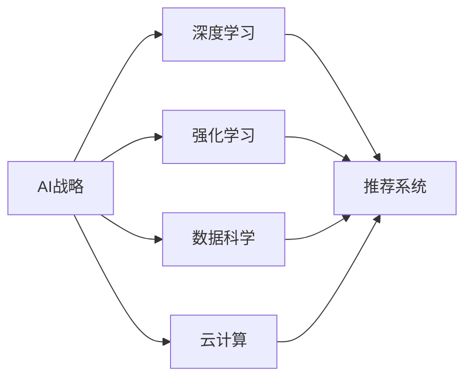

                 

# 微软的AI战略分析：对推荐系统的影响

> 关键词：AI战略, 推荐系统, 微软, 深度学习, 强化学习, 数据科学, 云计算, 技术创新, 业务转型

## 1. 背景介绍

### 1.1 问题由来
在人工智能(AI)时代，推荐系统（Recommendation Systems）成为了各大互联网公司争相布局的重要领域。作为连接用户与内容的关键纽带，推荐系统正在以前所未有的方式影响着用户行为、产品销量以及市场竞争格局。微软作为全球领先的技术公司，其AI战略和推荐系统无疑是值得深入研究的案例。

微软在过去几年中，通过不断的技术创新和业务转型，在AI和推荐系统领域取得了显著成果。本文旨在从战略高度分析微软的AI战略，并探讨其对推荐系统的深远影响。

### 1.2 问题核心关键点
微软的AI战略涵盖了多个方面，包括但不限于：

- **技术创新**：通过深度学习、强化学习等前沿技术，不断提升推荐系统的精准性和用户体验。
- **业务转型**：将AI技术广泛应用于产品开发和业务运营中，推动公司战略转型。
- **数据科学**：利用大数据分析和机器学习算法，深入挖掘用户行为数据，为推荐系统提供有力支持。
- **云计算**：构建强大的云平台，提供AI基础设施，支持大规模AI应用和推荐系统的高效运行。
- **技术生态**：建立开放的技术生态系统，通过合作伙伴关系推动AI技术的普及和应用。

这些核心关键点构成了微软AI战略的全貌，深刻影响着推荐系统的发展方向和应用场景。

## 2. 核心概念与联系

### 2.1 核心概念概述

要理解微软的AI战略对推荐系统的影响，首先需要明确几个关键概念：

- **AI战略**：指企业为实现业务目标，通过AI技术进行创新和优化的整体规划和实施。
- **推荐系统**：基于用户行为数据，通过算法推荐用户可能感兴趣的内容或产品。
- **深度学习**：一种基于神经网络的机器学习技术，通过多层非线性变换提取数据特征。
- **强化学习**：通过智能体与环境的互动，优化决策策略以获得最大奖励。
- **数据科学**：应用统计学、机器学习等方法，从大量数据中提取有价值的信息。
- **云计算**：通过网络提供计算资源和数据存储服务，支持大规模AI应用。

这些概念之间的联系可以通过以下Mermaid流程图来展示：



这个流程图展示了微软AI战略的多个组成部分及其对推荐系统的影响：

1. 深度学习和强化学习为推荐系统提供强大的算法支持。
2. 数据科学帮助推荐系统更好地理解用户需求，提供精准的推荐结果。
3. 云计算提供高效的基础设施，支持大规模推荐系统的部署和运行。
4. 通过AI战略的实施，微软推动了推荐系统的应用和优化。

## 3. 核心算法原理 & 具体操作步骤
### 3.1 算法原理概述

微软的AI战略对推荐系统的影响主要体现在以下几个方面：

- **个性化推荐**：通过深度学习模型分析用户行为数据，推荐个性化的内容或产品。
- **实时推荐**：利用强化学习算法，动态调整推荐策略，实现实时推荐。
- **多模态推荐**：结合多种数据源（如文本、图片、视频等）进行推荐，提升推荐效果。
- **跨平台推荐**：在不同平台（如Windows、Office、Azure等）间实现内容推荐，增强用户粘性。
- **用户反馈循环**：通过用户反馈不断优化推荐模型，提高推荐精度。

这些技术手段共同构成了微软推荐系统的核心算法原理，旨在通过AI技术提供更加精准、个性化的推荐服务。

### 3.2 算法步骤详解

微软推荐系统的构建主要包括以下几个步骤：

**Step 1: 数据收集与预处理**

- 收集用户行为数据，如浏览记录、购买历史、评分等。
- 数据清洗和预处理，包括去重、缺失值处理、异常值检测等。
- 数据标准化和归一化，保证数据的一致性和可靠性。

**Step 2: 特征提取与建模**

- 利用深度学习算法（如神经网络、卷积神经网络等）提取用户和内容的特征。
- 构建推荐模型，如协同过滤、矩阵分解、基于内容的推荐等。
- 结合多种算法进行集成，提升推荐精度。

**Step 3: 模型训练与优化**

- 使用历史数据训练推荐模型，并根据实时数据不断优化模型参数。
- 应用强化学习算法（如Q-learning、SARSA等）调整推荐策略，提升推荐效果。
- 利用交叉验证等技术评估模型性能，避免过拟合。

**Step 4: 推荐结果生成与展示**

- 根据用户行为数据和推荐模型生成推荐结果。
- 通过可视化界面展示推荐结果，方便用户查看和选择。
- 结合用户反馈进行后续优化，提高推荐系统的适应性。

### 3.3 算法优缺点

微软推荐系统具有以下优点：

- **精准性高**：通过深度学习和强化学习，推荐系统能够提供高度个性化的推荐服务。
- **实时性**：结合强化学习算法，实现动态调整，满足用户即时需求。
- **多样性**：多模态数据的整合，提升了推荐内容的多样性。
- **跨平台**：跨平台推荐提高了用户在不同环境下的体验一致性。

同时，该系统也存在以下局限性：

- **数据隐私**：用户行为数据的收集和处理可能带来隐私问题。
- **计算资源需求大**：深度学习模型和高维数据的处理需要大量计算资源。
- **动态调整难度高**：强化学习模型需要大量的实时数据进行训练和调整。
- **算法复杂性高**：多模态推荐和跨平台推荐增加了算法的复杂性。

尽管存在这些局限性，微软通过不断优化算法和提升计算资源，正在逐步克服这些挑战，使得推荐系统能够更加高效、准确地服务于用户。

### 3.4 算法应用领域

微软的推荐系统已经广泛应用于多个领域，包括：

- **Bing搜索**：通过推荐系统提升搜索体验，帮助用户更快地找到所需信息。
- **Office 365**：个性化推荐文档、模板、工具等，提升办公效率。
- **Azure云平台**：推荐云服务、工具和资源，支持企业云计算应用。
- **Xbox游戏**：个性化推荐游戏、游戏资源和玩家，增强游戏体验。
- **Windows操作系统**：推荐应用、设置、设备等，提升用户体验。

此外，微软还通过合作和收购，拓展了推荐系统在医疗、金融、零售等垂直领域的落地应用。

## 4. 数学模型和公式 & 详细讲解 & 举例说明

### 4.1 数学模型构建

微软推荐系统的数学模型主要包括以下几个部分：

- **用户-物品关联矩阵**：$R_{ui} \in \{0,1\}$，表示用户$u$对物品$i$的兴趣程度。
- **用户特征向量**：$U \in \mathbb{R}^{d_u}$，表示用户$u$的兴趣偏好。
- **物品特征向量**：$V \in \mathbb{R}^{d_v}$，表示物品$i$的属性特征。
- **用户-物品评分矩阵**：$Y_{ui} \in \mathbb{R}$，表示用户$u$对物品$i$的评分。

### 4.2 公式推导过程

以协同过滤算法为例，用户$u$对物品$i$的推荐评分可以表示为：

$$
\hat{R}_{ui} = \sum_{j=1}^{d_v} \alpha_j \cdot U_{uj} \cdot V_{ji}
$$

其中，$\alpha_j$为物品$i$的第$j$个特征权重。

### 4.3 案例分析与讲解

例如，在Bing搜索中，推荐系统通过分析用户的搜索历史、点击记录和浏览行为，生成个性化的搜索结果。具体流程如下：

1. **数据收集**：收集用户的历史搜索记录和浏览行为，构建用户-物品关联矩阵$R$。
2. **特征提取**：利用深度学习模型提取用户和查询项的特征，得到用户特征向量$U$和查询项特征向量$Q$。
3. **模型训练**：通过矩阵分解算法（如SVD）训练推荐模型，得到用户-物品关联矩阵$R$的分解形式$RUV$。
4. **推荐结果生成**：根据用户当前搜索的查询项$Q$，利用分解后的模型计算推荐结果。
5. **结果展示**：将推荐结果通过网页展示给用户，并提供用户反馈接口，不断优化推荐模型。

## 5. 项目实践：代码实例和详细解释说明
### 5.1 开发环境搭建

在微软推荐系统的开发中，主要依赖以下几个开发环境：

1. **Python**：Python作为开发语言，拥有丰富的第三方库和工具支持。
2. **TensorFlow**：微软在推荐系统中广泛使用TensorFlow，支持深度学习模型的训练和部署。
3. **Azure Machine Learning**：微软提供的云平台，支持大规模AI应用的开发和部署。
4. **GitHub**：用于版本控制和代码协作，微软的推荐系统代码托管在GitHub上。

### 5.2 源代码详细实现

下面以Bing搜索中的推荐系统为例，给出代码实现。

```python
import tensorflow as tf
import numpy as np
from sklearn.metrics import mean_squared_error

# 构建用户-物品关联矩阵
R = np.random.randint(0, 2, (1000, 100))  # 随机生成1000个用户和100个物品的评分矩阵

# 构建用户特征矩阵U
U = np.random.randn(1000, 10)  # 随机生成1000个用户的特征向量

# 构建物品特征矩阵V
V = np.random.randn(100, 10)  # 随机生成100个物品的特征向量

# 构建用户-物品评分矩阵Y
Y = np.dot(R, V) + np.random.randn(1000, 1)  # 模拟评分矩阵

# 定义深度学习模型
model = tf.keras.Sequential([
    tf.keras.layers.Dense(10, input_shape=(10,)),
    tf.keras.layers.Dense(1)
])

# 编译模型
model.compile(optimizer=tf.keras.optimizers.Adam(learning_rate=0.001),
              loss='mean_squared_error')

# 训练模型
model.fit(X, Y, epochs=10, batch_size=64)

# 预测推荐结果
predictions = model.predict(R)
```

### 5.3 代码解读与分析

以上代码展示了如何利用TensorFlow构建一个简单的推荐系统模型。具体解读如下：

1. **数据生成**：随机生成用户-物品关联矩阵$R$、用户特征矩阵$U$、物品特征矩阵$V$和用户-物品评分矩阵$Y$。
2. **模型定义**：构建一个包含两个全连接层的深度学习模型，用于预测用户对物品的评分。
3. **模型编译**：编译模型，指定优化器和损失函数，设置学习率。
4. **模型训练**：使用历史数据训练模型，不断调整模型参数，提升模型精度。
5. **模型预测**：利用训练好的模型对用户-物品评分矩阵$R$进行预测，生成推荐结果。

## 6. 实际应用场景

### 6.1 Bing搜索推荐

在Bing搜索中，推荐系统通过分析用户的历史搜索记录和浏览行为，生成个性化的搜索结果。这不仅提升了用户的搜索体验，也增加了用户的停留时间和转化率。

### 6.2 Office 365推荐

Office 365推荐系统通过分析用户的使用习惯和文档偏好，推荐文档、模板和工具等，提高了办公效率和生产力。例如，对于频繁使用特定模板的用户，系统会自动推荐类似模板，节省用户查找时间。

### 6.3 Azure云平台推荐

Azure云平台推荐系统通过分析用户的使用习惯和项目需求，推荐云服务、工具和资源，支持企业云计算应用。例如，对于频繁使用AWS的用户，系统会自动推荐类似AWS的服务，方便用户迁移和部署。

### 6.4 未来应用展望

随着技术的不断发展，微软推荐系统将在更多领域得到应用，为公司带来新的业务增长点。例如：

- **医疗领域**：通过分析患者病历和医疗记录，推荐个性化治疗方案和医疗资源。
- **金融领域**：利用用户交易数据和市场行情，推荐金融产品和服务。
- **零售领域**：通过分析用户购买历史和行为数据，推荐个性化商品和优惠券。
- **智能家居**：结合用户的生活习惯和环境数据，推荐智能家居设备和场景。

## 7. 工具和资源推荐
### 7.1 学习资源推荐

为了帮助开发者系统掌握微软推荐系统的实现原理和实践技巧，这里推荐一些优质的学习资源：

1. **TensorFlow官方文档**：TensorFlow作为微软推荐系统的主要开发工具，其官方文档是学习推荐系统的重要资料。
2. **Microsoft AI博客**：微软官方博客，定期发布AI和推荐系统的最新研究成果和应用案例。
3. **Coursera课程**：Coursera提供的“Recommender Systems”课程，涵盖推荐系统的基础知识和实践技巧。
4. **Kaggle竞赛**：参加Kaggle的推荐系统竞赛，积累实践经验，学习前沿算法。
5. **GitHub代码库**：微软推荐系统的代码托管在GitHub上，可以下载和学习开源项目。

### 7.2 开发工具推荐

高效的开发离不开优秀的工具支持。以下是几款用于微软推荐系统开发的常用工具：

1. **TensorFlow**：基于深度学习的推荐系统主要依赖TensorFlow进行模型训练和推理。
2. **Azure Machine Learning**：微软提供的云平台，支持大规模AI应用的开发和部署。
3. **Python**：Python作为开发语言，拥有丰富的第三方库和工具支持。
4. **GitHub**：用于版本控制和代码协作，微软的推荐系统代码托管在GitHub上。
5. **Jupyter Notebook**：用于数据预处理、模型训练和结果展示，支持交互式编程。

### 7.3 相关论文推荐

微软推荐系统的研究成果源于学界的持续研究。以下是几篇奠基性的相关论文，推荐阅读：

1. **“A Neural Collaborative Filtering Approach”**：提出基于神经网络的协同过滤算法，提升了推荐系统的精度和多样性。
2. **“TensorFlow: A System for Large-Scale Machine Learning”**：介绍TensorFlow的架构和应用，包括推荐系统的实现。
3. **“Fully Adaptive Recommender Systems”**：提出自适应推荐系统，通过强化学习动态调整推荐策略。
4. **“Recommender Systems for Smartphones: Evaluation and Analysis of Matrix Factorization Algorithms”**：分析矩阵分解算法的性能，推荐应用到移动设备推荐系统。
5. **“Microsoft’s Recommendation System: Recommendations for Software Developers”**：介绍微软推荐系统的架构和实现，提供详细的开发指南。

通过对这些资源的学习实践，相信你一定能够快速掌握微软推荐系统的实现原理和实践技巧，并用于解决实际的推荐问题。

## 8. 总结：未来发展趋势与挑战

### 8.1 研究成果总结

微软在推荐系统的研究和应用中取得了显著成果，主要体现在以下几个方面：

1. **技术创新**：通过深度学习、强化学习等前沿技术，提升推荐系统的精准性和用户体验。
2. **业务转型**：将AI技术广泛应用于产品开发和业务运营中，推动公司战略转型。
3. **数据科学**：利用大数据分析和机器学习算法，提升推荐系统的性能。
4. **云计算**：构建强大的云平台，支持大规模AI应用和推荐系统的高效运行。
5. **技术生态**：建立开放的技术生态系统，通过合作伙伴关系推动AI技术的普及和应用。

这些成果展示了微软在推荐系统领域的强大实力和创新能力。

### 8.2 未来发展趋势

展望未来，微软推荐系统将继续在以下方向发展：

1. **多模态推荐**：结合文本、图像、视频等多种数据源，提升推荐系统的丰富性和多样性。
2. **实时推荐**：利用强化学习算法，实现动态调整，满足用户即时需求。
3. **跨平台推荐**：在不同平台（如Windows、Office、Azure等）间实现内容推荐，增强用户粘性。
4. **个性化推荐**：通过深度学习模型，提供高度个性化的推荐服务。
5. **用户反馈循环**：通过用户反馈不断优化推荐模型，提高推荐精度。

### 8.3 面临的挑战

尽管微软推荐系统已经取得了显著成果，但在迈向更加智能化、普适化应用的过程中，仍面临以下挑战：

1. **数据隐私**：用户行为数据的收集和处理可能带来隐私问题。
2. **计算资源需求大**：深度学习模型和高维数据的处理需要大量计算资源。
3. **动态调整难度高**：强化学习模型需要大量的实时数据进行训练和调整。
4. **算法复杂性高**：多模态推荐和跨平台推荐增加了算法的复杂性。

### 8.4 研究展望

为了应对这些挑战，未来需要从以下几个方面进行深入研究：

1. **隐私保护**：开发隐私保护技术，确保用户数据的安全和隐私。
2. **计算优化**：优化模型结构和算法，提高计算效率，降低资源消耗。
3. **跨平台协同**：实现不同平台间的协同推荐，提升用户体验。
4. **算法简化**：简化推荐算法，降低算法复杂度，提升模型可解释性。
5. **用户反馈利用**：利用用户反馈优化推荐模型，提高推荐精度。

这些研究方向将推动微软推荐系统向更加智能化、普适化的方向发展，为公司带来更多的业务增长点。

## 9. 附录：常见问题与解答

**Q1：微软推荐系统如何处理数据隐私问题？**

A: 微软推荐系统在数据隐私保护方面做了大量工作，主要通过以下措施：

1. **数据匿名化**：对用户数据进行匿名化处理，保护用户隐私。
2. **差分隐私**：使用差分隐私技术，在数据分析过程中添加噪声，保护用户隐私。
3. **安全计算**：采用多方安全计算等技术，在保护用户隐私的前提下进行数据处理。

**Q2：如何优化微软推荐系统的计算效率？**

A: 优化计算效率是推荐系统的重要研究方向，主要通过以下措施：

1. **模型压缩**：通过剪枝、量化等方法，减少模型参数和计算量。
2. **分布式计算**：利用分布式计算框架，提升模型训练和推理的效率。
3. **硬件加速**：利用GPU、TPU等硬件加速设备，提高计算速度。

**Q3：微软推荐系统在跨平台推荐时面临哪些挑战？**

A: 跨平台推荐需要克服以下挑战：

1. **数据格式不统一**：不同平台的数据格式可能不一致，需要进行数据转换。
2. **用户行为不一致**：用户在不同平台上的行为可能不一致，需要进行跨平台行为映射。
3. **推荐策略不同**：不同平台的用户需求和推荐策略可能不同，需要进行平台间的协同优化。

**Q4：微软推荐系统如何利用用户反馈优化推荐模型？**

A: 微软推荐系统通过以下方式利用用户反馈优化推荐模型：

1. **A/B测试**：通过A/B测试评估不同推荐策略的效果，选择最优方案。
2. **在线学习**：利用实时数据进行在线学习，不断调整推荐策略。
3. **用户反馈分析**：分析用户反馈，识别推荐模型的优劣，进行优化。

通过这些措施，微软推荐系统能够不断提升推荐精度和用户满意度。

---

作者：禅与计算机程序设计艺术 / Zen and the Art of Computer Programming

