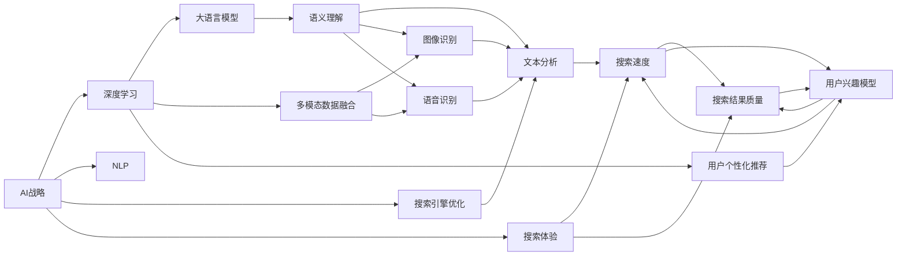

                 

# 微软的AI战略对行业的影响：Bing升级的启示与借鉴

> 关键词：AI战略, Bing升级, 自然语言处理, 深度学习, 搜索引擎优化, 搜索体验, 大语言模型, 多模态数据融合, 用户个性化推荐, 行业启示

## 1. 背景介绍

随着人工智能技术的迅猛发展，各大科技公司纷纷布局AI战略，以期在未来的市场竞争中占据有利位置。作为全球领先的科技巨头，微软也不例外。近年来，微软在AI领域的投入愈发加大，推出的Bing搜索引擎升级版便是其AI战略的重要体现。通过运用前沿的AI技术，Bing不仅在搜索速度、准确性和用户体验上进行了大幅提升，还引入了大语言模型、多模态数据融合、用户个性化推荐等新技术，实现了对传统搜索引擎的颠覆性变革。

## 2. 核心概念与联系

### 2.1 核心概念概述

- **AI战略**：微软在人工智能领域的长远规划和行动方案，旨在通过技术创新，提升产品和服务的智能化水平。
- **Bing升级**：微软对Bing搜索引擎的重大更新，引入深度学习、自然语言处理等AI技术，增强搜索体验。
- **自然语言处理(NLP)**：使计算机能够理解、解释和生成人类语言的技术，是Bing升级的核心技术之一。
- **深度学习**：一种基于神经网络的机器学习范式，Bing升级广泛应用深度学习模型进行文本分析和生成。
- **搜索引擎优化(SEO)**：通过优化网站内容和结构，提高搜索引擎的排名，进而增加用户访问量。
- **搜索体验**：用户在使用搜索引擎时感受到的速度、准确性和易用性。
- **大语言模型(LLM)**：如GPT、BERT等，能够处理大量文本数据，进行复杂的自然语言理解和生成。
- **多模态数据融合**：将文本、图像、语音等多源数据进行整合分析，提供更全面的搜索结果。
- **用户个性化推荐**：根据用户的历史行为和兴趣，推荐定制化的搜索结果。

这些核心概念之间存在密切的联系，共同构成了微软AI战略在Bing升级中的应用框架。

### 2.2 核心概念原理和架构的 Mermaid 流程图



## 3. 核心算法原理 & 具体操作步骤

### 3.1 算法原理概述

Bing升级的核心算法原理主要包括以下几个方面：

- **深度学习模型**：通过大规模预训练语言模型，如BERT、T5等，对大量文本数据进行训练，学习通用的语言表示和语义理解能力。
- **大语言模型(LLM)**：运用如GPT-3、DALL·E等大语言模型，提升自然语言处理能力，实现更精准的语义理解和生成。
- **多模态数据融合**：将文本、图像、语音等多源数据进行联合分析，提供更全面的搜索结果。
- **用户个性化推荐**：根据用户的历史行为和兴趣，生成定制化的搜索结果，提升用户体验。

这些技术共同构成了Bing升级的技术基础。通过深度学习和大语言模型，Bing能够理解用户的查询意图，并提供更准确、相关性更高的搜索结果。多模态数据融合使得搜索结果更加丰富多样，而个性化推荐则进一步提升了用户体验。

### 3.2 算法步骤详解

Bing升级的具体操作步骤如下：

1. **数据预处理**：收集和标注文本、图像、语音等多模态数据，构建训练集。
2. **模型训练**：使用深度学习框架，如PyTorch、TensorFlow等，训练预训练语言模型，并进行微调。
3. **多模态数据融合**：将不同模态的数据进行拼接、融合，使用跨模态学习算法，提高融合效果。
4. **个性化推荐**：构建用户兴趣模型，根据用户行为数据生成个性化推荐，提升搜索相关性。
5. **模型评估**：在测试集上评估模型性能，优化模型参数和结构。
6. **部署上线**：将训练好的模型部署到Bing搜索系统中，进行实时推理和预测。

### 3.3 算法优缺点

Bing升级的算法优缺点如下：

**优点**：
- **精准度提升**：通过深度学习和大语言模型，Bing能够更好地理解用户的查询意图，提供更准确的结果。
- **多样化展示**：多模态数据融合使得搜索结果更加丰富多彩，提升用户体验。
- **个性化服务**：用户个性化推荐能够根据用户兴趣提供定制化服务，提高用户满意度。
- **易用性增强**：搜索体验的提升使得用户使用更加便捷，减少跳出率。

**缺点**：
- **计算资源消耗大**：深度学习和多模态融合需要大量的计算资源，可能导致系统运行速度较慢。
- **隐私风险**：个性化推荐涉及用户隐私数据的处理，可能引发隐私问题。
- **模型复杂度高**：深度学习和多模态融合的模型结构复杂，调试和优化难度较大。

### 3.4 算法应用领域

Bing升级的应用领域涵盖多个方面，包括：

- **电商领域**：通过搜索引擎优化和个性化推荐，提升商品检索和推荐效果，增加销售额。
- **新闻媒体**：利用多模态数据融合，提供新闻文章的文本、图片和视频等多种呈现方式。
- **医疗健康**：通过自然语言处理和大语言模型，提供疾病查询和诊断建议，提高医疗服务的智能化水平。
- **教育培训**：利用个性化推荐，推荐学习资料和课程，提升学习效果。
- **金融服务**：通过深度学习和多模态融合，提供更准确的市场分析和投资建议。

## 4. 数学模型和公式 & 详细讲解 & 举例说明

### 4.1 数学模型构建

Bing升级涉及多个数学模型，以下以BERT模型为例，展示其构建过程。

BERT模型采用双向Transformer架构，输入为一段文本，输出为该文本的语义表示。其数学模型构建过程如下：

1. **嵌入层**：将文本转换为向量表示。
2. **Transformer编码器**：对文本进行编码，得到高维语义表示。
3. **池化层**：对编码后的文本向量进行池化操作，得到固定长度的向量表示。
4. **全连接层**：将池化后的向量输入全连接层，输出文本的语义表示。

### 4.2 公式推导过程

BERT模型的输入为一段文本 $x$，输出为文本的语义表示 $h$。其数学模型可以表示为：

$$
h = f(x; \theta)
$$

其中 $f$ 表示Transformer编码器，$\theta$ 为模型参数。Transformer编码器的数学模型如下：

$$
h = \text{Softmax}(QK^T)V + B
$$

其中 $Q = XW^Q$，$K = XW^K$，$V = XW^V$，$B$ 为残差连接。

### 4.3 案例分析与讲解

以一个简单的自然语言推理任务为例，展示BERT模型的应用。

假设我们有一段文本 $x$ 和一个问题 $q$，要求判断 $q$ 是否为 $x$ 的蕴含、矛盾或中性。我们可以将 $x$ 和 $q$ 拼接成一个输入序列 $(x, q)$，并使用BERT模型得到该序列的语义表示 $h$。然后，我们定义三个向量 $v_{entail}$、$v_{contradiction}$ 和 $v_{neutral}$，分别表示蕴含、矛盾和中性的向量表示。最后，我们通过比较 $h$ 与这三个向量的余弦相似度，判断 $q$ 与 $x$ 的关系。

$$
\text{similarity}(h, v_{entail}) \geq \text{similarity}(h, v_{contradiction}) \geq \text{similarity}(h, v_{neutral})
$$

如果 $h$ 与 $v_{entail}$ 的余弦相似度最高，则判定 $q$ 为 $x$ 的蕴含；否则，根据 $h$ 与 $v_{contradiction}$ 和 $v_{neutral}$ 的相似度，判断 $q$ 与 $x$ 的关系。

## 5. 项目实践：代码实例和详细解释说明

### 5.1 开发环境搭建

进行Bing升级项目开发前，需要搭建相应的开发环境。以下是一个基本的开发环境搭建流程：

1. **安装Python**：选择Python 3.x版本，并安装pip。
2. **安装深度学习框架**：安装TensorFlow或PyTorch等深度学习框架。
3. **安装BERT模型**：使用HuggingFace提供的接口，下载并加载预训练的BERT模型。
4. **安装数据集**：下载并处理所需的数据集，如中文维基百科文本、新闻文章等。
5. **安装可视化工具**：安装TensorBoard等可视化工具，用于监控训练过程。

### 5.2 源代码详细实现

以下是一个使用TensorFlow实现BERT模型的示例代码：

```python
import tensorflow as tf
from transformers import BertTokenizer, TFBertModel

# 加载预训练的BERT模型
tokenizer = BertTokenizer.from_pretrained('bert-base-cased')
model = TFBertModel.from_pretrained('bert-base-cased')

# 加载测试数据
text = "今天天气怎么样？"
inputs = tokenizer.encode(text, return_tensors='tf')
inputs = tf.convert_to_tensor(inputs, dtype=tf.int32)

# 模型前向传播
outputs = model(inputs)

# 提取语义表示
last_hidden_states = outputs.last_hidden_state[:, -1, :]
```

### 5.3 代码解读与分析

**代码解析**：
- **Tokenizer**：用于将文本转换为模型所需的输入格式。
- **TFBertModel**：加载预训练的BERT模型，并进行前向传播计算。
- **inputs**：将文本输入转换为模型所需的张量格式。
- **outputs**：模型前向传播的结果，包括隐层表示、attention权重等。
- **last_hidden_states**：从模型的最后一个时间步的隐层表示中提取语义信息。

**代码分析**：
- **Tokenizer** 将输入文本转换为模型所需的张量格式。
- **TFBertModel** 进行模型前向传播，得到隐层表示。
- **last_hidden_states** 从模型的最后一个时间步的隐层表示中提取语义信息，用于后续的文本分析。

### 5.4 运行结果展示

运行上述代码后，可以观察到模型输出最后的隐层表示。通过进一步的分析和处理，可以将这些隐层表示应用于自然语言推理、文本分类、情感分析等任务。

## 6. 实际应用场景

### 6.1 电商领域

在电商领域，Bing升级通过搜索引擎优化和个性化推荐，提升商品检索和推荐效果。通过自然语言处理和大语言模型，Bing能够理解用户查询意图，提供更精准的商品推荐。此外，通过多模态数据融合，Bing能够提供商品图片、视频等多源信息，提升用户购物体验。

### 6.2 新闻媒体

新闻媒体领域，Bing升级通过多模态数据融合，提供新闻文章的文本、图片和视频等多种呈现方式。用户可以根据个人喜好选择不同形式的呈现方式，提升阅读体验。同时，通过自然语言处理和大语言模型，Bing能够理解用户查询意图，提供更加相关的新闻文章。

### 6.3 医疗健康

在医疗健康领域，Bing升级通过自然语言处理和大语言模型，提供疾病查询和诊断建议，提高医疗服务的智能化水平。通过多模态数据融合，Bing能够提供疾病的图表、视频等多种信息，帮助用户更好地理解疾病相关信息。

### 6.4 教育培训

教育培训领域，Bing升级通过个性化推荐，推荐学习资料和课程，提升学习效果。通过自然语言处理和大语言模型，Bing能够理解用户的学习需求和兴趣，提供更加个性化和有针对性的学习资源。

### 6.5 金融服务

金融服务领域，Bing升级通过深度学习和多模态融合，提供更准确的市场分析和投资建议。通过自然语言处理和大语言模型，Bing能够理解用户的投资需求，提供更加个性化的金融信息。

## 7. 工具和资源推荐

### 7.1 学习资源推荐

为了更好地理解Bing升级的技术细节，以下是一些推荐的学习资源：

1. **《深度学习》课程**：由斯坦福大学提供，涵盖深度学习的基本原理和应用。
2. **《Transformer详解》**：深入介绍Transformer模型及其在NLP中的应用。
3. **《BERT论文》**：介绍BERT模型的构建和应用。
4. **《TensorFlow官方文档》**：详细介绍TensorFlow的使用和优化技巧。
5. **《TensorBoard官方文档》**：介绍TensorBoard的使用方法。

### 7.2 开发工具推荐

为了提升Bing升级项目的开发效率，以下是一些推荐的开发工具：

1. **PyCharm**：Python编程的IDE，提供代码补全、调试等丰富的开发功能。
2. **Jupyter Notebook**：用于编写和运行Python代码，支持代码的可视化展示。
3. **Git**：版本控制系统，方便代码的管理和协作。
4. **Anaconda**：Python科学计算的集成环境，支持多种数据科学库的安装和管理。
5. **TensorFlow**：深度学习框架，支持模型的构建、训练和推理。

### 7.3 相关论文推荐

以下是一些推荐的相关论文，帮助深入理解Bing升级的技术原理：

1. **BERT: Pre-training of Deep Bidirectional Transformers for Language Understanding**：介绍BERT模型的构建和应用。
2. **Attention is All You Need**：介绍Transformer模型及其在NLP中的应用。
3. **Adaptive Low-Rank Adaptation for Parameter-Efficient Fine-Tuning**：介绍AdaLoRA方法，解决大语言模型微调中的参数高效问题。
4. **Hierarchical Attention Networks for Document Classification**：介绍HAN模型，解决文本分类问题。
5. **BERT: Pre-training of Deep Bidirectional Transformers for Language Understanding**：介绍BERT模型的构建和应用。

## 8. 总结：未来发展趋势与挑战

### 8.1 研究成果总结

Bing升级的成功实施，展示了微软在AI领域的深厚积累和创新能力。通过深度学习和大语言模型，Bing实现了搜索速度、准确性和用户体验的大幅提升。同时，通过多模态数据融合和个性化推荐，Bing进一步增强了搜索结果的相关性和多样性。

### 8.2 未来发展趋势

未来，Bing升级将在以下几个方面持续发展：

- **实时计算**：通过引入实时计算技术，Bing将能够提供更加动态和个性化的搜索结果。
- **跨模态融合**：通过将更多的模态数据引入Bing，如视频、语音、图像等，进一步提升搜索结果的丰富性和多样性。
- **大语言模型优化**：通过优化大语言模型，提高其在自然语言处理中的表现，提升搜索体验。
- **用户隐私保护**：随着用户隐私意识的增强，Bing将进一步优化个性化推荐算法，保护用户隐私数据。
- **跨语言支持**：Bing将进一步扩展支持多种语言，提升全球用户的使用体验。

### 8.3 面临的挑战

尽管Bing升级在技术上取得了显著成果，但在实际应用中仍面临以下挑战：

- **计算资源消耗大**：深度学习和多模态融合需要大量的计算资源，可能导致系统运行速度较慢。
- **用户隐私风险**：个性化推荐涉及用户隐私数据的处理，可能引发隐私问题。
- **模型复杂度高**：深度学习和多模态融合的模型结构复杂，调试和优化难度较大。
- **跨语言支持**：支持多种语言的同时，需要解决不同语言间的语言差异和文化差异。

### 8.4 研究展望

未来，Bing升级需要在以下几个方面进行深入研究：

- **实时计算优化**：通过引入实时计算技术，进一步提升搜索结果的动态性和个性化。
- **跨模态融合技术**：将更多的模态数据引入Bing，提升搜索结果的丰富性和多样性。
- **大语言模型优化**：通过优化大语言模型，提高其在自然语言处理中的表现，提升搜索体验。
- **用户隐私保护**：优化个性化推荐算法，保护用户隐私数据，提升用户信任度。
- **跨语言支持**：解决不同语言间的语言差异和文化差异，提升全球用户的使用体验。

## 9. 附录：常见问题与解答

**Q1: 什么是自然语言处理？**

A: 自然语言处理（Natural Language Processing，NLP）是计算机科学和人工智能的一个领域，专注于如何让计算机理解、解释和生成人类语言。NLP技术在搜索引擎、聊天机器人、文本分析、机器翻译等方面有着广泛的应用。

**Q2: 深度学习和自然语言处理的关系是什么？**

A: 深度学习是NLP中一种重要的技术手段，通过训练神经网络模型，实现对文本数据的深度分析和生成。深度学习模型在NLP领域中的应用广泛，包括文本分类、命名实体识别、情感分析、机器翻译等。

**Q3: 什么是大语言模型？**

A: 大语言模型（Large Language Model，LLM）是一种预训练的神经网络模型，能够理解和生成大量的自然语言文本。大语言模型通常具有数十亿甚至数百亿的参数，能够处理复杂的自然语言理解和生成任务。

**Q4: 多模态数据融合是什么？**

A: 多模态数据融合（Multimodal Data Fusion）是指将文本、图像、语音等多源数据进行联合分析，综合多模态信息，提升结果的全面性和准确性。多模态数据融合在搜索引擎、社交媒体分析、智能家居等领域有着广泛的应用。

**Q5: 用户个性化推荐有哪些应用？**

A: 用户个性化推荐在电商、新闻媒体、金融服务等多个领域有着广泛的应用。通过分析用户的历史行为和兴趣，推荐个性化的商品、新闻、投资建议等，提升用户体验和满意度。

---

作者：禅与计算机程序设计艺术 / Zen and the Art of Computer Programming

