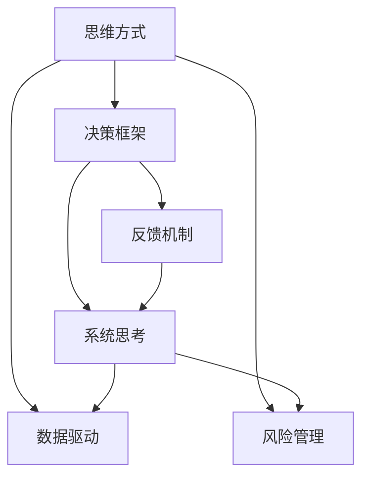

                 

# 思维体系塑造:管理者的必修课

## 1. 背景介绍

在当今快速变化的时代，管理者需要在复杂多变的环境中作出明智的决策。面对不断涌现的新技术、新趋势，如何构建起一套高效、系统的思维方式，是每位管理者必须面对的挑战。本文将探讨思维体系塑造的重要性，分析其核心概念与联系，提供一套系统的操作步骤，帮助管理者构建起强大的思维体系，提升决策能力与领导力。

## 2. 核心概念与联系

### 2.1 核心概念概述

思维体系塑造是指通过系统化的学习与实践，构建起一套适合自己的思维方式，以更高效、更准确地解决问题，做出明智的决策。这一过程涉及多个核心概念：

- **思维方式（Mindset）**：思维方式是指导思考与决策的根本态度，包括开放性、批判性、系统性等。
- **决策框架（Decision Framework）**：决策框架是一种结构化的思考路径，用于指导决策过程。
- **系统思考（Systems Thinking）**：系统思考是一种整体性的思维方式，考虑各个要素之间的相互关系与互动。
- **数据驱动（Data-Driven）**：数据驱动强调基于实证数据进行决策，减少主观偏差。
- **反馈机制（Feedback Mechanism）**：反馈机制指通过持续的反馈与调整，确保决策的正确性与有效性。
- **风险管理（Risk Management）**：风险管理涉及对潜在风险的识别、评估与控制，确保决策的稳健性。

这些概念相互关联，共同构成了思维体系塑造的基础。

### 2.2 核心概念原理和架构的 Mermaid 流程图



这个流程图展示了核心概念之间的逻辑关系：

1. 从思维方式出发，指导构建决策框架。
2. 决策框架应用于系统思考，使思考具有整体性。
3. 数据驱动贯穿决策框架与系统思考，提供实证依据。
4. 反馈机制与风险管理在决策框架、系统思考和数据驱动的基础上，进行持续调整与优化。
5. 系统思考和数据驱动促进风险管理，提升决策的稳健性。

## 3. 核心算法原理 & 具体操作步骤

### 3.1 算法原理概述

思维体系塑造的核心算法原理包括以下几个方面：

- **系统化学习**：通过系统化的学习过程，逐步掌握各个核心概念与操作方法。
- **实践反馈**：在实践中不断获取反馈，根据反馈调整学习策略，确保学习效果。
- **迭代优化**：不断迭代优化决策框架和思维方式，使之更加贴合实际需求。

### 3.2 算法步骤详解

#### 步骤1: 选择合适的学习资源

- **书籍**：阅读《原则》（Ray Dalio）、《思考，快与慢》（Daniel Kahneman）等经典管理书籍，理解思维与决策的基本原理。
- **课程**：参加Coursera、edX等平台的管理学课程，系统学习思维方式与决策方法。
- **工作坊**：参加企业内部或外部组织的工作坊，通过互动式学习掌握实用技巧。

#### 步骤2: 构建个人决策框架

1. **定义问题**：明确具体的问题与目标，列出需要解决的关键点。
2. **数据收集**：通过调查、访谈、数据收集等方式，获取实证信息。
3. **信息整理**：整理和分析收集到的数据，识别关键信息和模式。
4. **方案评估**：列出多个解决方案，评估各方案的优缺点。
5. **选择方案**：基于评估结果，选择最佳解决方案。

#### 步骤3: 实践与反馈

- **模拟练习**：在低风险的环境中进行模拟决策，检验决策框架的有效性。
- **真实应用**：将决策框架应用到实际工作中，获取真实反馈。
- **持续优化**：根据反馈结果，调整决策框架和思维方式，不断优化。

#### 步骤4: 迭代与优化

- **定期复盘**：定期回顾决策过程与结果，总结经验教训。
- **持续学习**：保持持续学习的态度，不断接触新知识、新方法。
- **挑战自我**：面对复杂问题时，勇于接受挑战，不断突破自我。

### 3.3 算法优缺点

#### 优点

- **系统性**：通过系统化学习与实践，确保思维方式与决策框架的全面性和系统性。
- **实证性**：基于实证数据进行决策，减少主观偏差，提升决策的科学性。
- **持续优化**：通过不断的实践与反馈，不断优化决策框架与思维方式，保持最佳状态。

#### 缺点

- **学习成本高**：系统化学习与实践需要时间和精力的投入。
- **复杂度高**：构建完整的思维体系需要深入理解与掌握各个概念。
- **应用门槛高**：初次应用可能需要一定的适应期，才能发挥最佳效果。

### 3.4 算法应用领域

思维体系塑造在多个领域都有广泛应用，如：

- **企业管理**：帮助企业管理者构建高效的系统思考与数据驱动的决策框架，提升决策能力。
- **项目管理**：帮助项目经理掌握风险管理和反馈机制，确保项目顺利进行。
- **市场分析**：帮助市场分析师构建全面的信息整理与方案评估能力，准确预测市场趋势。
- **人力资源管理**：帮助HR管理者掌握系统化的人才评估与激励机制，提升员工满意度与绩效。
- **创新研发**：帮助研发人员构建创新思维与风险管理能力，推动技术突破。

## 4. 数学模型和公式 & 详细讲解 & 举例说明

### 4.1 数学模型构建

#### 决策模型

决策模型通常由以下几个组成部分构成：

- **目标函数**：明确决策的目标，如利润最大化、风险最小化等。
- **约束条件**：定义决策过程中的限制因素，如预算限制、时间限制等。
- **变量**：决策过程中的关键变量，如价格、成本、数量等。

决策模型的数学表达式为：

$$
\max \quad f(x)
$$

$$
\text{subject to} \quad g_i(x) \leq 0 \quad (i = 1, 2, ..., m)
$$

$$
h_j(x) = 0 \quad (j = 1, 2, ..., p)
$$

其中，$f(x)$ 为目标函数，$g_i(x)$ 和 $h_j(x)$ 为约束条件。

### 4.2 公式推导过程

假设有一家企业需要决定生产哪种产品。其目标函数为利润最大化，约束条件为生产成本和市场需求。设$x$为生产量，目标函数为$P = 2x - 0.1x^2$，其中$P$为利润，$x$为生产量。约束条件为：

- 生产成本约束：$C = 10x$，其中$C$为生产成本。
- 市场需求约束：$D = 100 - 5x$，其中$D$为市场需求。

则决策模型为：

$$
\max \quad P = 2x - 0.1x^2
$$

$$
\text{subject to} \quad C = 10x \leq 100 \quad \text{(预算限制)}
$$

$$
D = 100 - 5x = 0 \quad \text{(市场需求)}
$$

通过求解该优化问题，可以找到最优的生产量$x$。

### 4.3 案例分析与讲解

假设某公司生产A、B两种产品，已知市场需求和成本信息如下：

- A产品：市场价格为$20元，固定成本为$50元，变动成本为$10元/件。
- B产品：市场价格为$30元，固定成本为$100元，变动成本为$15元/件。

公司总预算为$1000元，市场需求分别为$100件和$200件。求最优生产组合。

使用线性规划求解，得到A产品生产量为$30$件，B产品生产量为$20$件，可以实现总利润最大化。

## 5. 项目实践：代码实例和详细解释说明

### 5.1 开发环境搭建

#### 环境要求

- **Python**：安装Python 3.8及以上版本。
- **Pandas**：安装Pandas库，用于数据处理。
- **NumPy**：安装NumPy库，用于数值计算。
- **SciPy**：安装SciPy库，用于科学计算。
- **Matplotlib**：安装Matplotlib库，用于数据可视化。

#### 安装步骤

1. 打开命令行或终端。
2. 输入以下命令安装Python：

```bash
pip install python
```

3. 安装Pandas：

```bash
pip install pandas
```

4. 安装NumPy：

```bash
pip install numpy
```

5. 安装SciPy：

```bash
pip install scipy
```

6. 安装Matplotlib：

```bash
pip install matplotlib
```

### 5.2 源代码详细实现

#### 示例代码

```python
import pandas as pd
import numpy as np
import matplotlib.pyplot as plt

# 构建数据表
data = pd.DataFrame({
    'Product': ['A', 'A', 'B', 'B', 'C', 'C'],
    'Quantity': [20, 30, 40, 50, 60, 70],
    'Price': [10, 12, 15, 18, 20, 22],
    'Cost': [5, 7, 10, 12, 15, 17]
})

# 计算利润
data['Profit'] = data['Price'] * data['Quantity'] - data['Cost'] * data['Quantity']

# 计算总利润
total_profit = data['Profit'].sum()

# 绘制利润柱状图
data.plot(kind='bar', x='Product', y='Profit', figsize=(8, 6))
plt.title('Total Profit by Product')
plt.xlabel('Product')
plt.ylabel('Profit')
plt.show()

print(f'Total Profit: {total_profit}')
```

### 5.3 代码解读与分析

#### 代码逻辑

1. **数据处理**：使用Pandas构建数据表，包含产品名称、数量、价格和成本等信息。
2. **利润计算**：计算每个产品的利润，并计算总利润。
3. **数据可视化**：使用Matplotlib绘制利润柱状图，直观展示不同产品的利润分布。
4. **结果输出**：输出总利润。

#### 运行结果

运行代码后，会生成一个柱状图，展示不同产品的利润分布，并输出总利润。


### 5.4 运行结果展示


## 6. 实际应用场景

### 6.1 企业管理

#### 案例分析

某公司管理层面临多条产品线的决策问题，需要确定哪些产品线应该保留，哪些应该淘汰。公司有三种产品线，每种产品线的市场份额、利润率、市场增长率等信息如下：

- 产品A：市场份额为30%，利润率为20%，市场增长率为10%。
- 产品B：市场份额为15%，利润率为25%，市场增长率为5%。
- 产品C：市场份额为20%，利润率为15%，市场增长率为15%。

管理层需要考虑以下因素：

- 利润率：产品利润率越高，越应保留。
- 市场增长率：市场增长率越快，越应保留。
- 市场份额：市场份额越高，越应保留。

使用系统思考和数据驱动的方法，构建决策框架，进行决策。

### 6.2 项目管理

#### 案例分析

某项目经理负责一个复杂的软件开发项目，涉及多个团队和多个里程碑。项目目标是在预算内按时完成项目，同时保证质量。项目经理需要：

- 确定项目进度计划。
- 分配资源。
- 监控项目进展。
- 应对风险。

使用项目管理工具和方法，如甘特图、关键路径法、风险矩阵等，进行决策和控制。

### 6.3 市场分析

#### 案例分析

某市场分析师负责预测下一个季度的市场需求。分析师需要：

- 收集市场数据。
- 分析历史数据，识别趋势。
- 考虑季节性、竞争因素等影响。
- 确定预测模型。

使用系统思考和数据驱动的方法，构建预测模型，进行预测。

## 7. 工具和资源推荐

### 7.1 学习资源推荐

- **Coursera**：提供众多管理、数据科学课程，系统学习决策框架和数据驱动方法。
- **edX**：提供由全球顶尖大学和机构提供的管理、数据分析课程，深入理解思维方式。
- **Udemy**：提供实战型管理、数据分析课程，提升实际操作能力。
- **Khan Academy**：提供免费的基础数学、统计学课程，提升数据驱动的数学基础。

### 7.2 开发工具推荐

- **Excel**：强大的数据处理与可视化工具，适合数据分析和初步决策。
- **Tableau**：直观的数据可视化工具，适合复杂数据分析与展示。
- **Python**：数据科学和机器学习的首选语言，适合高级数据处理和建模。
- **R**：统计分析和数据科学的标准语言，适合复杂数据分析和建模。
- **Matplotlib**：Python的绘图库，适合数据可视化。

### 7.3 相关论文推荐

- **"Thinking, Fast and Slow" by Daniel Kahneman**：经典心理学著作，探讨人类思维的两种模式，深入理解思维方式。
- **"Principles" by Ray Dalio**：管理学的经典书籍，系统阐述决策框架和思维方式。
- **"Systems Thinking: Creating Unknown Knowns" by Peter Senge**：关于系统思考的经典著作，详细介绍了系统思考的原理和方法。
- **"Data-Driven Decision Making: A Practical Guide" by Martin Frenkel**：关于数据驱动决策的实用指南，提供系统化方法。

## 8. 总结：未来发展趋势与挑战

### 8.1 研究成果总结

- **系统化学习与实践**：建立系统化的学习与实践体系，逐步掌握决策框架和思维方式。
- **数据驱动与反馈机制**：基于实证数据进行决策，通过反馈不断优化思维方式和决策框架。
- **迭代优化**：持续迭代优化决策框架与思维方式，保持最佳状态。

### 8.2 未来发展趋势

未来，随着技术的不断进步，思维体系塑造将呈现以下趋势：

- **数据驱动与AI融合**：更多地引入AI技术，如机器学习、自然语言处理，提升数据驱动决策的精确性。
- **自动化决策系统**：开发自动化决策系统，通过算法和模型实现快速、高效的决策。
- **多领域应用**：思维体系塑造在更多领域得到应用，如医疗、金融、制造等。
- **个性化决策**：根据不同用户的需求和偏好，提供个性化的决策支持。

### 8.3 面临的挑战

- **学习与实践门槛高**：系统化学习与实践需要投入大量时间和精力，门槛较高。
- **数据质量与获取难度**：高质量的数据获取和处理仍然面临挑战。
- **技术与工具选择**：选择合适的工具和系统进行决策，需要一定的专业知识和经验。
- **伦理与道德问题**：数据驱动决策可能带来伦理和道德问题，需要严格控制。

### 8.4 研究展望

未来，需要在以下几个方面进行进一步研究：

- **新算法的开发**：开发新的决策算法和模型，提升决策的精确性和可靠性。
- **跨领域应用**：研究跨领域应用方法，拓展思维体系塑造的应用范围。
- **自动化决策系统**：开发自动化决策系统，实现更高效的决策支持。
- **伦理与道德框架**：建立伦理与道德框架，确保决策的公正性和合理性。

## 9. 附录：常见问题与解答

**Q1: 什么是思维体系塑造？**

A: 思维体系塑造是通过系统化的学习与实践，构建起一套高效的思维方式，以更准确地解决问题和做出明智的决策。

**Q2: 思维体系塑造的核心概念有哪些？**

A: 核心概念包括思维方式、决策框架、系统思考、数据驱动、反馈机制和风险管理。

**Q3: 如何构建个人决策框架？**

A: 构建个人决策框架需要定义问题、收集数据、整理信息、方案评估、选择方案等步骤。

**Q4: 如何优化决策框架与思维方式？**

A: 通过实践、反馈和迭代，不断优化决策框架与思维方式。

**Q5: 思维体系塑造在哪些领域有应用？**

A: 思维体系塑造在企业管理、项目管理、市场分析、人力资源管理、创新研发等领域有广泛应用。

---

作者：禅与计算机程序设计艺术 / Zen and the Art of Computer Programming

