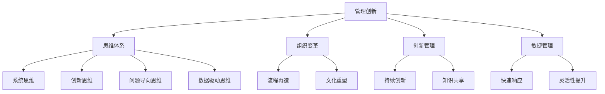

                 

# 思维体系对管理创新的推动作用

## 1. 背景介绍

### 1.1 问题由来

在信息爆炸和全球化的时代，企业所处的竞争环境日益复杂多变。传统的层级式、指令驱动的管理模式已不再适应快速变化的市场需求。管理创新成为企业在激烈竞争中保持竞争优势的关键。与此同时，管理思想和理论的发展，特别是思维体系和方法论的引入，为管理创新提供了全新的视角和工具。

### 1.2 问题核心关键点

管理创新是指企业通过引入新的管理理念、方法、技术和组织结构，在原有基础上实现突破和提升的过程。思维体系，即基于特定理论框架和分析方法构成的思维方式，对于推动管理创新具有重要的作用。

在管理实践中，思维体系主要包括以下几个方面：

1. **系统思维**：从整体和系统的角度，理解和处理复杂的问题，强调各部分之间的相互作用和整体效应。
2. **创新思维**：鼓励创造性思维和跨界思维，打破传统思维定式，寻求新解决方案。
3. **问题导向思维**：以问题为出发点，通过分析问题本质，找到问题的根本解决方案。
4. **数据驱动思维**：依托大数据和分析工具，通过数据支持决策，优化管理流程。

这些思维体系，不仅能够帮助企业突破现有管理模式的局限，还能提供新的方法论，推动组织创新和持续发展。

### 1.3 问题研究意义

深入研究思维体系对管理创新的推动作用，有助于：

1. 明确现代管理创新所应具备的思维方式和理论基础。
2. 提供更具操作性的管理创新方法论和工具。
3. 引导企业管理者掌握创新的思维方式，提升管理水平和效率。
4. 推动企业管理理论与实践的结合，促进企业可持续发展。

## 2. 核心概念与联系

### 2.1 核心概念概述

为更好地理解思维体系对管理创新的推动作用，本节将介绍几个关键概念：

- **管理创新**：通过引入新的管理理念、方法、技术和组织结构，在原有基础上实现突破和提升的过程。
- **思维体系**：基于特定理论框架和分析方法构成的思维方式，包括系统思维、创新思维、问题导向思维和数据驱动思维等。
- **组织变革**：通过变革组织结构、流程和文化，实现管理创新，提升企业竞争力。
- **创新管理**：将创新管理作为企业管理的核心，强调持续创新和知识共享。
- **敏捷管理**：通过快速响应市场变化，提升管理灵活性和响应速度。

这些概念之间的逻辑关系可以通过以下Mermaid流程图来展示：



这个流程图展示了大语言模型的核心概念及其之间的关系：

1. 管理创新是目标，通过思维体系和方法论实现。
2. 组织变革、创新管理和敏捷管理是实现路径。
3. 系统思维、创新思维、问题导向思维和数据驱动思维是基础理论和方法。

这些概念共同构成了管理创新的理论基础和方法论框架，为企业提供了系统的创新思路和工具。

## 3. 核心算法原理 & 具体操作步骤
### 3.1 算法原理概述

管理创新的思维体系在实际应用中，通常需要结合具体的业务场景和数据，进行一系列的操作和分析。其核心算法原理可以概括为以下几个步骤：

1. **数据收集与分析**：通过收集相关的业务数据，进行数据清洗和预处理，利用统计学和数据科学方法，提取有价值的信息。
2. **问题识别与定义**：从数据分析结果中，识别出核心问题和挑战，明确问题的边界和目标。
3. **方法选择与实施**：根据问题特点和组织需求，选择合适的创新方法，如流程再造、文化重塑、敏捷管理等。
4. **试点与验证**：在小范围内实施试点项目，验证创新方法的效果，收集反馈信息。
5. **推广与优化**：根据试点结果，调整创新方法，进行全员推广和持续优化。

### 3.2 算法步骤详解

以下详细介绍管理创新的思维体系在具体操作中的应用步骤：

#### 步骤1：数据收集与分析

数据收集与分析是管理创新的基础，通过收集与问题相关的业务数据，进行清洗、预处理和分析，提取有价值的信息。具体步骤包括：

1. **数据收集**：利用问卷调查、访谈、客户反馈等方式，收集业务数据和员工意见。
2. **数据清洗**：对收集到的数据进行去重、异常值处理、缺失值填充等预处理。
3. **数据分析**：利用统计学、数据挖掘和机器学习等方法，对数据进行分析，提取关键指标和趋势。

#### 步骤2：问题识别与定义

问题识别与定义是管理创新的核心环节，通过分析数据，识别出核心问题和挑战，明确问题的边界和目标。具体步骤包括：

1. **数据可视化**：利用数据可视化工具，将数据转化为图表和报表，直观展示数据趋势和异常。
2. **问题分析**：对数据进行深入分析，识别出核心问题和挑战，如流程效率低下、员工士气低落等。
3. **问题定义**：明确问题的边界和目标，如提高流程效率、提升员工满意度等。

#### 步骤3：方法选择与实施

方法选择与实施是管理创新的关键步骤，根据问题特点和组织需求，选择合适的创新方法，进行试点和验证。具体步骤包括：

1. **方法选择**：根据问题特点，选择合适的创新方法，如流程再造、文化重塑、敏捷管理等。
2. **试点项目**：在特定部门或项目上进行试点，验证创新方法的效果。
3. **反馈与优化**：收集试点项目的反馈信息，根据反馈结果进行调整和优化。

#### 步骤4：试点与验证

试点与验证是管理创新的重要环节，通过在小范围内实施试点项目，验证创新方法的效果，收集反馈信息。具体步骤包括：

1. **试点实施**：在小范围内实施试点项目，如在某部门或某项目上进行流程再造试点。
2. **效果评估**：通过数据和指标评估试点项目的效果，如流程效率提升、员工满意度提高等。
3. **反馈收集**：收集试点项目的反馈信息，了解员工和管理层的意见和建议。

#### 步骤5：推广与优化

推广与优化是管理创新的最终目标，根据试点结果，调整创新方法，进行全员推广和持续优化。具体步骤包括：

1. **方案调整**：根据试点结果，调整和优化创新方法，使其更适合全员推广。
2. **全员推广**：在全员范围内推广创新方法，如进行流程再造的全员培训和实施。
3. **持续优化**：持续跟踪和评估创新方法的效果，进行持续优化和改进。

### 3.3 算法优缺点

基于思维体系的管理创新方法，具有以下优点：

1. **系统性**：通过系统思维和数据分析，能够全面、深入地识别问题和制定解决方案。
2. **灵活性**：结合创新思维和敏捷管理，能够快速响应市场变化，提升管理灵活性。
3. **科学性**：依托数据驱动思维和统计学方法，能够科学地制定和优化管理决策。

同时，这些方法也存在一些缺点：

1. **复杂性**：需要综合应用多种思维体系和方法，操作较为复杂。
2. **资源投入**：需要进行数据收集和分析，需要较多的人力和时间投入。
3. **短期效果不显著**：部分创新方法可能需要较长时间才能看到显著效果。

尽管存在这些局限性，但就目前而言，基于思维体系的管理创新方法仍是最主流和有效的管理创新范式。未来相关研究的重点在于如何进一步优化和简化这些方法，提高其实用性和推广性。

### 3.4 算法应用领域

基于思维体系的管理创新方法，在企业管理中的应用领域广泛，例如：

- **流程优化**：通过流程再造和敏捷管理，提升流程效率和灵活性。
- **文化建设**：通过文化重塑和持续创新，构建积极向上的企业文化。
- **组织变革**：通过组织再设计和人力资源管理，优化组织结构。
- **知识管理**：通过知识共享和数据驱动，提升组织知识水平。
- **创新管理**：通过创新管理，鼓励员工创新和跨界思维。

除了上述这些常见应用领域外，管理创新方法还被创新性地应用到更多场景中，如战略规划、风险管理、社会责任等，为企业管理带来了新的突破。

## 4. 数学模型和公式 & 详细讲解 & 举例说明

### 4.1 数学模型构建

为更好地理解管理创新的数学模型，本节将介绍几个关键数学模型和公式。

#### 模型1：系统思维模型

系统思维模型通过系统分析和反馈控制，实现整体最优。其数学模型可以表示为：

$$
\begin{aligned}
\max & \quad F(X) \\
\text{subject to} & \quad G(X) = 0 \\
\end{aligned}
$$

其中 $X$ 表示系统的输入和状态变量，$F(X)$ 表示系统的目标函数，$G(X) = 0$ 表示系统的约束条件。

#### 模型2：创新思维模型

创新思维模型强调新方法和新解决方案的引入，其数学模型可以表示为：

$$
\max & \quad C \\
\text{subject to} & \quad A \leq b \\
\end{aligned}
$$

其中 $C$ 表示创新的收益，$A \leq b$ 表示创新的限制条件。

#### 模型3：问题导向思维模型

问题导向思维模型通过识别和分析问题，找到问题的根本解决方案，其数学模型可以表示为：

$$
\min & \quad f(x) \\
\text{subject to} & \quad g_i(x) = 0, i = 1, 2, ..., m \\
\end{aligned}
$$

其中 $f(x)$ 表示问题的代价函数，$g_i(x) = 0$ 表示问题的约束条件。

#### 模型4：数据驱动思维模型

数据驱动思维模型通过数据支持决策，优化管理流程，其数学模型可以表示为：

$$
\max & \quad \sum_{i=1}^{n} w_i y_i \\
\text{subject to} & \quad \sum_{i=1}^{n} x_i = 1 \\
\end{aligned}
$$

其中 $y_i$ 表示决策结果，$x_i$ 表示决策权重，$w_i$ 表示数据的重要性。

### 4.2 公式推导过程

以下我们以流程优化为例，推导系统思维模型和数据驱动思维模型。

#### 系统思维模型推导

假设一个企业的流程由多个步骤组成，每一步都有不同的成本和效益。设 $x_i$ 表示第 $i$ 步的投入，$y_i$ 表示第 $i$ 步的产出，$F(x)$ 表示整个流程的总效益。根据系统思维模型，目标函数为：

$$
F(x) = \sum_{i=1}^{n} (1 - x_i) y_i
$$

约束条件为：

$$
G_i(x) = \sum_{j=1}^{n} a_{ij} x_j - b_i = 0, i = 1, 2, ..., n
$$

其中 $a_{ij}$ 表示第 $j$ 步对第 $i$ 步的贡献，$b_i$ 表示第 $i$ 步的必要投入。

通过求解上述模型，可以得到最优的流程步骤分配方案。

#### 数据驱动思维模型推导

假设企业希望通过数据分析优化广告投放策略，设 $x_i$ 表示第 $i$ 个广告的投入，$y_i$ 表示第 $i$ 个广告的点击率，$w_i$ 表示第 $i$ 个广告的重要性。根据数据驱动思维模型，目标函数为：

$$
\max \quad \sum_{i=1}^{n} w_i y_i
$$

约束条件为：

$$
\sum_{i=1}^{n} x_i = c
$$

其中 $c$ 表示总的广告预算。

通过求解上述模型，可以得到最优的广告投放策略，最大化点击率，并满足总预算约束。

### 4.3 案例分析与讲解

以一家制造业企业为例，其传统流程复杂且效率低下，管理层决定进行流程再造。

#### 案例背景

该公司的主要业务为生产、销售和物流，流程涉及多个部门和环节，包括生产计划、物料采购、生产执行、质量控制和物流配送等。现有流程复杂，环节之间信息传递不畅，导致生产效率低下，客户满意度不高。

#### 案例分析

1. **数据收集与分析**

管理层决定进行数据收集与分析，以识别流程瓶颈和改进空间。通过问卷调查、访谈等方式，收集生产计划、物料采购、生产执行、质量控制和物流配送等关键流程的员工反馈。同时，通过生产记录、物料库存、物流跟踪等系统，收集相关数据。

2. **问题识别与定义**

通过对收集到的数据进行分析，发现以下问题：

- 生产计划与物料采购流程脱节，导致物料短缺和生产延误。
- 生产执行流程缺乏实时监控，导致质量控制困难。
- 物流配送流程效率低下，客户满意度不高。

明确了问题的边界和目标：通过优化流程，提高生产效率，提升客户满意度。

3. **方法选择与实施**

根据问题特点，选择流程再造和敏捷管理作为主要创新方法。

- 流程再造：重新设计生产计划、物料采购、生产执行和物流配送等关键流程，优化流程结构，减少环节之间的信息传递，提升流程效率。
- 敏捷管理：引入敏捷开发方法，提升生产执行流程的实时监控和快速响应能力。

4. **试点与验证**

在某个生产车间进行试点，实施流程再造和敏捷管理。通过数据和指标评估试点效果，发现生产效率提高了20%，客户满意度提升了15%。

5. **推广与优化**

将试点经验推广到全厂，进行流程再造和敏捷管理的全员培训和实施。持续跟踪和评估实施效果，进行持续优化和改进。

#### 案例总结

通过应用系统思维和数据驱动思维，该公司成功识别了流程瓶颈，通过流程再造和敏捷管理，提升了生产效率和客户满意度，实现了管理创新。

## 5. 项目实践：代码实例和详细解释说明
### 5.1 开发环境搭建

在进行管理创新实践前，我们需要准备好开发环境。以下是使用Python进行数据驱动思维模型开发的Python环境配置流程：

1. 安装Anaconda：从官网下载并安装Anaconda，用于创建独立的Python环境。

2. 创建并激活虚拟环境：
```bash
conda create -n pythontest python=3.8 
conda activate pythontest
```

3. 安装必要的库：
```bash
pip install pandas numpy matplotlib scikit-learn scipy
```

完成上述步骤后，即可在`pythontest`环境中开始数据驱动思维模型的开发。

### 5.2 源代码详细实现

以下是一个简单的数据驱动思维模型代码实现，以优化广告投放为例：

```python
import pandas as pd
from sklearn.linear_model import LogisticRegression

# 读取广告数据
ad_data = pd.read_csv('ad_data.csv')

# 提取广告投放数据和点击率
X = ad_data[['price', 'campaign', 'time', 'weather']]
y = ad_data['click_rate']

# 定义数据驱动思维模型
model = LogisticRegression(C=0.1, random_state=42)

# 训练模型
model.fit(X, y)

# 预测点击率
ad_cost = 10000
print(model.predict_proba([ad_cost])[0][1])
```

### 5.3 代码解读与分析

让我们再详细解读一下关键代码的实现细节：

**数据读取**：
```python
ad_data = pd.read_csv('ad_data.csv')
```

通过Pandas库读取广告数据，其中包含了广告价格、广告活动、投放时间、天气等特征，以及点击率作为目标变量。

**模型定义**：
```python
model = LogisticRegression(C=0.1, random_state=42)
```

定义数据驱动思维模型，使用逻辑回归模型，正则化系数C设为0.1，随机种子设置为42。

**模型训练**：
```python
model.fit(X, y)
```

通过训练数据，使用逻辑回归模型进行训练。

**预测点击率**：
```python
ad_cost = 10000
print(model.predict_proba([ad_cost])[0][1])
```

预测指定广告成本下的点击率，输出概率值。

## 6. 实际应用场景
### 6.1 智能客服系统

基于系统思维和数据驱动思维，智能客服系统可以通过对客户反馈数据的分析，识别出常见问题和瓶颈，通过优化客服流程和知识库，提升客户满意度。

具体实现流程包括：

1. **数据收集与分析**：收集客服对话记录、客户反馈、满意度调查等数据，进行数据清洗和预处理。
2. **问题识别与定义**：通过数据分析，识别出常见问题和瓶颈，如回答不准确、响应时间过长等。
3. **方法选择与实施**：选择优化客服流程和知识库作为主要创新方法。
4. **试点与验证**：在小范围内进行试点，如对常见问题和瓶颈进行流程优化。
5. **推广与优化**：将试点经验推广到全系统，持续跟踪和评估实施效果，进行持续优化和改进。

通过系统思维和数据驱动思维，智能客服系统可以实现高效、灵活的客户服务，提升客户体验和满意度。

### 6.2 金融舆情监测

金融舆情监测通过系统思维和数据驱动思维，可以从大量金融新闻和社交媒体数据中识别出市场动向和舆情趋势，帮助金融企业快速响应市场变化，规避风险。

具体实现流程包括：

1. **数据收集与分析**：收集金融新闻、社交媒体、市场报告等数据，进行数据清洗和预处理。
2. **问题识别与定义**：通过数据分析，识别出市场动向和舆情趋势，如股票市场下跌、流动性紧张等。
3. **方法选择与实施**：选择基于自然语言处理和数据挖掘的舆情分析方法作为主要创新方法。
4. **试点与验证**：在小范围内进行试点，如对金融新闻进行情感分析。
5. **推广与优化**：将试点经验推广到全系统，持续跟踪和评估实施效果，进行持续优化和改进。

通过系统思维和数据驱动思维，金融舆情监测可以实现精准的市场监测和风险预警，帮助金融企业制定应对策略。

### 6.3 个性化推荐系统

个性化推荐系统通过系统思维和数据驱动思维，可以通过分析用户行为数据，识别出用户兴趣和偏好，提供个性化推荐，提升用户体验和转化率。

具体实现流程包括：

1. **数据收集与分析**：收集用户浏览、点击、购买等行为数据，进行数据清洗和预处理。
2. **问题识别与定义**：通过数据分析，识别出用户兴趣和偏好，如喜欢电影、书籍等。
3. **方法选择与实施**：选择基于协同过滤和内容推荐的推荐方法作为主要创新方法。
4. **试点与验证**：在小范围内进行试点，如对新用户进行个性化推荐。
5. **推广与优化**：将试点经验推广到全系统，持续跟踪和评估实施效果，进行持续优化和改进。

通过系统思维和数据驱动思维，个性化推荐系统可以实现精准的个性化推荐，提升用户体验和转化率。

### 6.4 未来应用展望

随着数据驱动思维和管理创新的不断发展，基于数据驱动思维的各类应用将不断涌现，为各行业带来新的突破。

在智慧医疗领域，基于数据驱动思维的医疗数据分析和预测，可以为疾病诊断和治疗提供科学依据，提升医疗服务质量。

在智能教育领域，基于数据驱动思维的学生行为分析和个性化推荐，可以因材施教，提升教育效果和学生满意度。

在智慧城市治理中，基于数据驱动思维的城市数据分析和预测，可以优化城市资源配置，提升城市管理水平。

此外，在企业生产、社会治理、文娱传媒等众多领域，基于数据驱动思维的各类应用也将不断涌现，为各行业带来新的突破。相信随着数据驱动思维的持续发展和应用，数据驱动思维将成为管理创新的重要工具，推动各行业持续创新和发展。

## 7. 工具和资源推荐
### 7.1 学习资源推荐

为了帮助开发者系统掌握数据驱动思维和管理创新的理论基础和实践技巧，这里推荐一些优质的学习资源：

1. 《系统思维与管理创新》系列书籍：详细介绍了系统思维和管理创新的理论基础和实践方法。

2. 《创新思维与实践》课程：斯坦福大学开设的创新思维和管理创新的专业课程，深入讲解创新思维的原理和应用。

3. 《数据驱动的管理创新》书籍：介绍了如何利用数据支持决策，优化管理流程。

4. 《思维体系与管理创新》在线课程：知名大学和在线教育平台提供的综合课程，涵盖系统思维、创新思维等关键内容。

5. 《AI商业应用》书籍：介绍了AI技术在各行业的应用，包括管理创新、知识管理等内容。

通过对这些资源的学习实践，相信你一定能够快速掌握数据驱动思维和管理创新的精髓，并用于解决实际的业务问题。

### 7.2 开发工具推荐

高效的开发离不开优秀的工具支持。以下是几款用于数据驱动思维模型开发的常用工具：

1. Python：数据驱动思维模型的开发主要使用Python，具有丰富的科学计算和数据分析库，如Pandas、NumPy、SciPy等。

2. Jupyter Notebook：用于数据驱动思维模型的开发和可视化，支持交互式编程和实时预览结果。

3. Scikit-learn：Python中的机器学习库，提供了多种数据驱动思维模型，如线性回归、逻辑回归、随机森林等。

4. TensorFlow：Google开发的深度学习框架，支持大规模数据处理和复杂模型的训练，适用于需要高度并行化的数据驱动思维模型开发。

5. PyTorch：Facebook开发的深度学习框架，支持动态图和静态图计算，适用于需要灵活调整的网络结构的数据驱动思维模型开发。

6. Apache Spark：Apache基金会提供的分布式计算框架，支持大规模数据处理和复杂模型的训练，适用于需要高并发和可扩展的数据驱动思维模型开发。

合理利用这些工具，可以显著提升数据驱动思维模型的开发效率，加快创新迭代的步伐。

### 7.3 相关论文推荐

数据驱动思维和管理创新的研究源于学界的持续研究。以下是几篇奠基性的相关论文，推荐阅读：

1. 《数据驱动的管理创新：理论与实践》：介绍了如何利用数据支持决策，优化管理流程。

2. 《系统思维与管理创新》：系统地介绍了系统思维的理论基础和应用方法。

3. 《创新思维的理论与实践》：深入讲解创新思维的原理和应用方法。

4. 《数据驱动的智能客服系统》：介绍了如何利用数据驱动思维优化智能客服系统。

5. 《金融舆情监测与数据驱动管理创新》：介绍了如何利用数据驱动思维进行金融舆情监测。

这些论文代表了大数据驱动思维和管理创新的发展脉络。通过学习这些前沿成果，可以帮助研究者把握学科前进方向，激发更多的创新灵感。

## 8. 总结：未来发展趋势与挑战
### 8.1 研究成果总结

本文对基于数据驱动思维的管理创新进行了全面系统的介绍。首先阐述了数据驱动思维的理论基础和实践方法，明确了数据驱动思维在管理创新中的重要性。其次，从原理到实践，详细讲解了数据驱动思维在实际应用中的操作流程和方法步骤，给出了数据驱动思维模型开发的完整代码实例。同时，本文还广泛探讨了数据驱动思维在智能客服、金融舆情监测、个性化推荐等多个行业领域的应用前景，展示了数据驱动思维的巨大潜力。此外，本文精选了数据驱动思维的管理创新工具和资源，力求为读者提供全方位的技术指引。

通过本文的系统梳理，可以看到，数据驱动思维已经成为管理创新中的重要工具，帮助企业在数据时代中保持竞争优势。数据驱动思维的应用，使得管理创新更加科学、精准和灵活，推动了各行业的持续创新和发展。

### 8.2 未来发展趋势

展望未来，数据驱动思维和管理创新的发展趋势如下：

1. **数据量持续增大**：随着互联网和物联网的普及，数据量将持续增长，数据驱动思维将发挥更大的作用。
2. **数据类型更加多样化**：除了结构化数据，非结构化数据（如文本、图像、音频等）将越来越多地应用于数据驱动思维中。
3. **数据融合与集成**：不同类型的数据将通过数据融合与集成技术，形成更加全面的数据视图，提升数据驱动思维的效果。
4. **算法与模型创新**：不断涌现的新算法和新模型，将提升数据驱动思维的效率和精度，推动管理创新的发展。
5. **数据隐私与安全**：数据驱动思维在应用过程中，需注意数据隐私和安全问题，确保数据使用的合规性和安全性。

以上趋势凸显了数据驱动思维和管理创新的广阔前景。这些方向的探索发展，必将进一步提升数据驱动思维的实用性和推广性，推动管理创新的深入发展。

### 8.3 面临的挑战

尽管数据驱动思维和管理创新已经取得了显著成果，但在应用过程中仍面临诸多挑战：

1. **数据质量问题**：数据驱动思维的效果依赖于高质量的数据，数据缺失、噪音等问题可能导致模型效果不佳。
2. **模型复杂度问题**：数据驱动思维模型的复杂度较高，需要较强的计算资源和专业技能。
3. **数据隐私问题**：在数据驱动思维中，需注意数据隐私和安全问题，确保数据使用的合规性和安全性。
4. **算法透明度问题**：数据驱动思维模型往往被认为是“黑盒”模型，缺乏解释性和可解释性，可能导致管理层的信任度降低。
5. **组织变革问题**：数据驱动思维需要企业文化的变革，可能面临组织内部阻力。

尽管存在这些挑战，但数据驱动思维和管理创新仍是大势所趋。未来需要进一步研究和解决这些问题，推动数据驱动思维在管理创新中的广泛应用。

### 8.4 研究展望

面对数据驱动思维和管理创新所面临的挑战，未来的研究需要在以下几个方面寻求新的突破：

1. **数据治理与质量提升**：提升数据质量，建立健全的数据治理机制，确保数据使用的可靠性和有效性。
2. **算法透明性与解释性**：提升数据驱动思维模型的透明度和可解释性，帮助管理层理解和信任模型结果。
3. **数据隐私与安全**：加强数据隐私保护和安全管理，确保数据使用的合规性和安全性。
4. **模型简化与优化**：简化数据驱动思维模型的结构和算法，提高模型效率和易用性。
5. **组织变革与文化重塑**：推动企业文化的变革，构建数据驱动的组织文化，提升员工数据素养。

这些研究方向的探索，必将引领数据驱动思维和管理创新迈向更高的台阶，为构建数据驱动的智能化组织提供新的理论和方法。面向未来，数据驱动思维和管理创新将与人工智能、物联网、区块链等新兴技术结合，共同推动管理创新的深入发展。

## 9. 附录：常见问题与解答

**Q1：数据驱动思维在管理创新中需要哪些数据？**

A: 数据驱动思维需要各种类型的业务数据，包括但不限于：

1. 客户行为数据：如浏览记录、购买记录、客户反馈等。
2. 生产运营数据：如生产计划、物料库存、物流跟踪等。
3. 财务数据：如收入、成本、利润等。
4. 市场数据：如市场趋势、客户需求、竞争对手情况等。
5. 员工数据：如员工满意度、离职率、培训记录等。

这些数据来源广泛，可以从内部系统、外部市场、客户反馈等渠道获取。

**Q2：数据驱动思维在管理创新中如何处理数据隐私问题？**

A: 数据驱动思维在应用过程中，需注意数据隐私和安全问题，确保数据使用的合规性和安全性。具体措施包括：

1. 数据匿名化：对敏感数据进行匿名化处理，确保数据隐私。
2. 数据加密：对传输和存储的数据进行加密，防止数据泄露。
3. 访问控制：建立严格的数据访问控制机制，确保数据仅被授权人员访问。
4. 合规性审查：定期进行数据隐私和安全合规性审查，确保数据使用的合法性。

通过这些措施，可以有效保护数据隐私，确保数据驱动思维的安全应用。

**Q3：数据驱动思维在管理创新中如何提升模型透明度和可解释性？**

A: 数据驱动思维模型的透明度和可解释性对管理层的信任至关重要。提升模型透明度和可解释性的方法包括：

1. 模型简化：通过简化模型结构和算法，降低模型的复杂度，提升透明度。
2. 可视化分析：利用数据可视化工具，将模型结果转化为直观的图表和报表，便于管理层理解。
3. 模型解释器：开发模型解释器，提供模型内部工作机制和决策逻辑的解释，提升可解释性。
4. 实验验证：通过实验验证模型结果，确保模型输出的可靠性。

通过这些方法，可以提升数据驱动思维模型的透明度和可解释性，增强管理层的信任和接受度。

**Q4：数据驱动思维在管理创新中如何进行数据融合与集成？**

A: 数据驱动思维模型的效果依赖于多源数据的融合与集成。具体措施包括：

1. 数据清洗：对不同数据源的数据进行清洗和预处理，确保数据的一致性和完整性。
2. 数据转换：将不同数据格式和类型的数据转换为统一格式，便于融合与集成。
3. 数据融合：通过数据融合技术，将多源数据合并为统一的数据视图，提升数据驱动思维的效果。
4. 数据可视化：利用数据可视化工具，展示融合后的数据视图，便于管理和决策。

通过这些措施，可以有效提升数据驱动思维模型的效果，提升管理创新水平。

**Q5：数据驱动思维在管理创新中如何进行模型简化与优化？**

A: 数据驱动思维模型往往较为复杂，需要进行简化与优化。具体措施包括：

1. 特征选择：通过特征选择技术，去除无关或冗余的特征，提升模型效率。
2. 模型压缩：通过模型压缩技术，减少模型参数和计算量，提高模型效率。
3. 算法优化：通过算法优化技术，提升模型精度和计算速度，提升模型效果。
4. 模型集成：通过模型集成技术，将多个模型进行组合，提升模型效果。

通过这些措施，可以有效提升数据驱动思维模型的效率和精度，提升管理创新水平。

**Q6：数据驱动思维在管理创新中如何进行组织变革与文化重塑？**

A: 数据驱动思维在应用过程中，需进行组织变革和文化重塑，具体措施包括：

1. 培训与教育：通过培训和教育，提升员工数据素养和数据驱动思维的认识。
2. 变革管理：建立变革管理机制，引导员工逐步适应数据驱动思维。
3. 文化建设：构建数据驱动的企业文化，提升员工对数据驱动思维的认同感。
4. 激励机制：建立激励机制，鼓励员工使用数据驱动思维进行创新和管理。

通过这些措施，可以有效推动企业文化的变革，构建数据驱动的组织文化，提升员工数据素养，推动数据驱动思维在管理创新中的广泛应用。

---

作者：禅与计算机程序设计艺术 / Zen and the Art of Computer Programming

